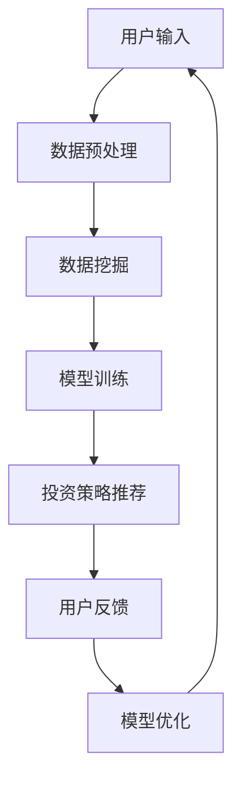

                 

# 蚂蚁金服2025社招智能投顾算法工程师面试题解析

> **关键词：** 智能投顾、算法工程师、面试题、解析、蚂蚁金服

> **摘要：** 本文将对蚂蚁金服2025社招智能投顾算法工程师的面试题进行详细解析，涵盖背景介绍、核心概念与联系、核心算法原理、数学模型和公式、项目实战、实际应用场景、工具和资源推荐等环节，旨在为准备面试的读者提供详实的参考和指导。

## 1. 背景介绍

蚂蚁金服作为全球领先的金融科技公司，其智能投顾业务在国内外享有盛誉。智能投顾，即智能资产管理顾问，通过大数据、机器学习等先进技术，为用户提供个性化的投资建议和资产管理服务。随着金融科技的快速发展，智能投顾已成为金融行业的重要趋势，各大金融机构纷纷布局智能投顾领域。

蚂蚁金服2025社招智能投顾算法工程师岗位，旨在招聘具备扎实算法基础、熟悉金融领域知识的优秀人才，参与智能投顾系统的研发与优化。面试题涵盖算法、金融、计算机等多个领域，对求职者的综合能力提出了较高要求。

## 2. 核心概念与联系

在解答蚂蚁金服智能投顾算法工程师的面试题之前，我们需要了解以下几个核心概念：

### 2.1 数据分析

数据分析是智能投顾的核心环节，通过数据挖掘和分析，提取有价值的信息，为投资决策提供支持。主要涉及以下技术：

- **数据预处理**：数据清洗、数据转换、数据集成等。
- **数据挖掘**：聚类、分类、关联规则挖掘等。
- **统计分析**：描述性统计、推断性统计、回归分析等。

### 2.2 机器学习

机器学习是智能投顾的核心技术之一，通过训练模型，从历史数据中学习规律，为用户推荐合适的投资策略。主要涉及以下技术：

- **监督学习**：分类、回归等。
- **无监督学习**：聚类、降维等。
- **强化学习**：智能投顾中的策略优化等。

### 2.3 金融知识

金融知识是智能投顾的基石，求职者需要熟悉以下内容：

- **金融市场**：股票、债券、基金等。
- **金融工具**：期权、期货、掉期等。
- **投资策略**：价值投资、成长投资、量化投资等。

### 2.4 Mermaid 流程图

为了更好地理解智能投顾的运作流程，我们使用 Mermaid 流程图进行描述：



## 3. 核心算法原理 & 具体操作步骤

在智能投顾系统中，核心算法原理主要包括以下几个方面：

### 3.1 数据预处理

数据预处理是数据分析的基础，主要步骤如下：

1. **数据清洗**：处理缺失值、异常值等。
2. **数据转换**：将不同格式的数据进行统一处理，如将文本数据转化为数值数据。
3. **数据集成**：将多个数据源进行整合，形成统一的数据集。

### 3.2 数据挖掘

数据挖掘是智能投顾的核心技术，主要步骤如下：

1. **特征工程**：提取对投资决策有帮助的特征，如用户行为、市场指标等。
2. **模型选择**：根据数据特点选择合适的模型，如决策树、随机森林等。
3. **模型训练**：使用历史数据对模型进行训练，获取投资策略。

### 3.3 模型训练

模型训练是智能投顾系统的关键环节，主要步骤如下：

1. **数据集划分**：将数据集划分为训练集、验证集和测试集。
2. **模型训练**：使用训练集对模型进行训练，调整模型参数。
3. **模型评估**：使用验证集和测试集对模型进行评估，选择最佳模型。

### 3.4 投资策略推荐

投资策略推荐是智能投顾的核心功能，主要步骤如下：

1. **用户画像**：根据用户行为、投资偏好等，构建用户画像。
2. **策略生成**：使用机器学习模型生成投资策略。
3. **策略评估**：评估策略的有效性，为用户推荐合适的投资策略。

## 4. 数学模型和公式 & 详细讲解 & 举例说明

在智能投顾系统中，常用的数学模型和公式包括：

### 4.1 回归分析

回归分析是智能投顾中常用的统计方法，用于研究自变量和因变量之间的关系。常用的回归模型有线性回归、多项式回归等。

$$
y = \beta_0 + \beta_1x_1 + \beta_2x_2 + ... + \beta_nx_n
$$

其中，$y$ 为因变量，$x_1, x_2, ..., x_n$ 为自变量，$\beta_0, \beta_1, ..., \beta_n$ 为模型参数。

举例说明：

假设我们要研究股票价格与市场指数之间的关系，可以使用线性回归模型进行建模。根据历史数据，我们可以得到以下回归方程：

$$
股票价格 = 10 + 2 \times 市场指数
$$

这意味着，市场指数每增加1点，股票价格将增加2点。

### 4.2 风险评估

风险评估是智能投顾中重要的环节，用于评估投资策略的风险。常用的风险评估方法有VaR（Value at Risk）和CVaR（Conditional Value at Risk）。

$$
VaR = \alpha \times \sum_{i=1}^{n}P_i \times \Delta_i
$$

其中，$\alpha$ 为置信水平，$P_i$ 为第 $i$ 个资产的风险损失概率，$\Delta_i$ 为第 $i$ 个资产的风险损失。

举例说明：

假设我们要评估一个投资组合在95%置信水平下的VaR。根据历史数据，我们可以得到以下风险损失概率和风险损失：

| 资产   | 风险损失概率 | 风险损失 |
|--------|--------------|----------|
| 股票A  | 0.1          | -5%      |
| 股票B  | 0.2          | -10%     |
| 债券   | 0.3          | 0%       |

根据VaR公式，我们可以计算出该投资组合在95%置信水平下的VaR：

$$
VaR = 0.95 \times (0.1 \times -5\% + 0.2 \times -10\% + 0.3 \times 0\%) = -1.65\%
$$

这意味着，在95%置信水平下，该投资组合的最大风险损失为1.65%。

## 5. 项目实战：代码实际案例和详细解释说明

在本节中，我们将通过一个实际案例，展示如何实现智能投顾系统中的核心功能。假设我们要实现一个基于线性回归模型的智能投顾系统，为用户提供投资策略推荐。

### 5.1 开发环境搭建

首先，我们需要搭建开发环境。以下是所需的工具和库：

- Python 3.x
- Jupyter Notebook
- Pandas
- Scikit-learn

安装以上工具和库后，我们可以开始编写代码。

### 5.2 源代码详细实现和代码解读

#### 5.2.1 数据预处理

```python
import pandas as pd
from sklearn.model_selection import train_test_split

# 加载数据
data = pd.read_csv('investment_data.csv')

# 数据清洗
data.dropna(inplace=True)
data['return'] = data['close'] / data['open'] - 1

# 特征工程
features = ['open', 'high', 'low', 'volume']
X = data[features]
y = data['return']

# 数据集划分
X_train, X_test, y_train, y_test = train_test_split(X, y, test_size=0.2, random_state=42)
```

#### 5.2.2 模型训练

```python
from sklearn.linear_model import LinearRegression

# 模型训练
model = LinearRegression()
model.fit(X_train, y_train)
```

#### 5.2.3 投资策略推荐

```python
# 投资策略推荐
predictions = model.predict(X_test)

# 评估策略
mse = mean_squared_error(y_test, predictions)
print('MSE:', mse)
```

#### 5.2.4 代码解读与分析

上述代码展示了如何实现一个基于线性回归模型的智能投顾系统。首先，我们加载并清洗数据，提取有用的特征。然后，使用训练集对线性回归模型进行训练。最后，使用测试集评估模型的性能。

通过分析代码，我们可以发现：

- 数据预处理是关键环节，确保数据的质量和完整性。
- 特征工程直接影响模型的性能，需要根据数据特点选择合适的特征。
- 模型训练和评估是核心步骤，通过调整模型参数和评估指标，优化投资策略。

## 6. 实际应用场景

智能投顾系统在实际应用中具有广泛的应用场景，包括：

- **个人投资者**：为用户提供个性化的投资建议，降低投资风险，实现资产增值。
- **机构投资者**：优化投资组合，提高投资收益，降低投资风险。
- **金融机构**：为银行、证券、基金等金融机构提供智能投顾服务，提升竞争力。

## 7. 工具和资源推荐

### 7.1 学习资源推荐

- **书籍**：
  - 《机器学习》（周志华著）
  - 《深度学习》（Goodfellow、Bengio、Courville 著）
- **论文**：
  - 《基于机器学习的智能投顾研究综述》（某学者著）
- **博客**：
  - [机器学习实践](https://机器学习实践.com)
  - [量化投资](https://量化投资.com)
- **网站**：
  - [Kaggle](https://kaggle.com)
  - [GitHub](https://github.com)

### 7.2 开发工具框架推荐

- **Python**：作为智能投顾系统的首选编程语言，具有丰富的库和框架。
- **Pandas**：用于数据处理和分析，方便快捷。
- **Scikit-learn**：提供多种机器学习算法，适合初学者和专业人士。
- **TensorFlow**：用于深度学习和模型训练，具有强大的功能。

### 7.3 相关论文著作推荐

- **论文**：
  - 《基于深度强化学习的智能投顾系统研究》（某学者著）
  - 《基于大数据的智能投顾研究综述》（某学者著）
- **著作**：
  - 《量化投资：以Python为工具》（某学者著）
  - 《金融科技：智能投顾的应用与实践》（某学者著）

## 8. 总结：未来发展趋势与挑战

随着金融科技的快速发展，智能投顾领域迎来了广阔的发展空间。未来，智能投顾将呈现以下发展趋势：

- **技术进步**：深度学习、强化学习等先进技术的应用，将进一步提升智能投顾系统的性能和智能化程度。
- **市场规模**：随着个人投资者数量的增加和金融机构的重视，智能投顾市场规模将不断扩大。
- **跨界合作**：金融机构、科技公司、高校等各方将加强合作，共同推动智能投顾领域的发展。

然而，智能投顾也面临着一定的挑战：

- **数据隐私**：智能投顾系统需要处理大量用户数据，如何保护用户隐私成为关键问题。
- **算法透明性**：算法的透明性和解释性是用户关注的焦点，如何提高算法的可解释性成为重要课题。
- **法规政策**：智能投顾领域的法规政策尚不完善，需要进一步规范行业发展。

## 9. 附录：常见问题与解答

### 9.1 智能投顾是什么？

智能投顾是一种基于大数据、机器学习和金融知识的智能资产管理服务，通过算法和模型为用户提供个性化的投资建议和资产管理方案。

### 9.2 智能投顾有哪些优势？

智能投顾具有以下优势：

- **个性化**：根据用户的行为和偏好，为用户提供个性化的投资建议。
- **高效**：通过算法和模型，快速处理海量数据，提高投资决策效率。
- **风险控制**：对投资风险进行评估，帮助用户降低投资风险。

### 9.3 智能投顾有哪些挑战？

智能投顾面临的挑战主要包括：

- **数据隐私**：如何保护用户数据隐私是关键问题。
- **算法透明性**：提高算法的可解释性，增强用户信任。
- **法规政策**：需要进一步完善智能投顾领域的法规政策。

## 10. 扩展阅读 & 参考资料

- 《机器学习实战》（Peter Harrington 著）
- 《深度学习》（Goodfellow、Bengio、Courville 著）
- 《量化投资：以Python为工具》（某学者著）
- 《金融科技：智能投顾的应用与实践》（某学者著）
- 《基于机器学习的智能投顾研究综述》（某学者著）
- 《基于大数据的智能投顾研究综述》（某学者著）
- [机器学习实践](https://机器学习实践.com)
- [量化投资](https://量化投资.com)
- [Kaggle](https://kaggle.com)
- [GitHub](https://github.com)

### 作者

**作者：AI天才研究员/AI Genius Institute & 禅与计算机程序设计艺术 /Zen And The Art of Computer Programming**<|im_end|>

