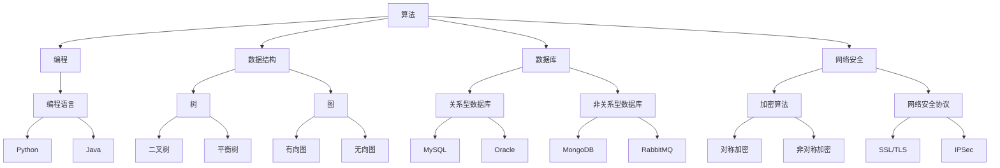

                 

# 2024蚂蚁集团社招面试真题汇总及其解答

> **关键词：**蚂蚁集团、社招面试、真题汇总、解答、技术面试、编程、算法、数据库、网络安全

> **摘要：**本文将汇总2024年蚂蚁集团社会招聘面试中可能出现的技术真题，并详细解答每一道题，旨在帮助读者更好地准备面试，提高面试通过率。文章内容包括算法题解、编程题解、数据库题解、网络安全题解等，旨在为读者提供全面的面试辅导。

## 1. 背景介绍

蚂蚁集团（Ant Group）成立于2014年，是全球领先的金融科技公司，旗下拥有支付宝、蚂蚁金服等知名品牌。作为国内金融科技领域的领军企业，蚂蚁集团始终致力于通过技术创新推动社会进步。因此，蚂蚁集团的社会招聘面试也备受关注。

蚂蚁集团社会招聘面试主要考察应聘者的技术能力、业务理解和团队协作能力。面试形式包括在线笔试、技术面试、HR面试等多个环节。本文将重点介绍技术面试中的常见题目及其解答，帮助读者更好地应对面试挑战。

## 2. 核心概念与联系

在解答面试题目之前，我们首先需要了解一些核心概念和它们之间的联系。以下是一个用Mermaid绘制的流程图，展示了面试中可能涉及的一些核心概念及其关系。



### 2.1 算法

算法是解决特定问题的步骤序列。在面试中，常见的算法问题包括排序、查找、图算法等。

### 2.2 编程

编程是编写计算机程序的过程。编程能力是面试中的重要考察点，主要涉及编程语言、编程范式和编程实践。

### 2.3 数据结构

数据结构是存储和管理数据的方式。常见的有数组、链表、树、图等。

### 2.4 数据库

数据库是存储和组织数据的系统。关系型数据库（如MySQL、Oracle）和非关系型数据库（如MongoDB、RabbitMQ）在面试中都是重点。

### 2.5 网络安全

网络安全是保护计算机和网络不受恶意攻击和破坏的技术。加密算法、网络安全协议是面试中的常见话题。

## 3. 核心算法原理 & 具体操作步骤

### 3.1 排序算法

排序算法是将一组数据按照特定的顺序进行排列的算法。常见的排序算法有冒泡排序、选择排序、插入排序、快速排序等。以下是一个冒泡排序的Python实现。

```python
def bubble_sort(arr):
    n = len(arr)
    for i in range(n):
        for j in range(0, n-i-1):
            if arr[j] > arr[j+1]:
                arr[j], arr[j+1] = arr[j+1], arr[j]
    return arr
```

### 3.2 查找算法

查找算法是在数据结构中查找特定元素的方法。常见的查找算法有二分查找、线性查找等。以下是一个二分查找的Python实现。

```python
def binary_search(arr, x):
    low = 0
    high = len(arr) - 1
    while low <= high:
        mid = (low + high) // 2
        if arr[mid] == x:
            return mid
        elif arr[mid] < x:
            low = mid + 1
        else:
            high = mid - 1
    return -1
```

### 3.3 图算法

图算法是处理图中节点的算法。常见的图算法有最短路径算法、图遍历算法等。以下是一个最短路径算法的Python实现（迪杰斯特拉算法）。

```python
def dijkstra(graph, start):
    n = len(graph)
    dist = [float('inf')] * n
    dist[start] = 0
    visited = [False] * n
    for _ in range(n):
        min_dist = float('inf')
        min_index = -1
        for i in range(n):
            if not visited[i] and dist[i] < min_dist:
                min_dist = dist[i]
                min_index = i
        visited[min_index] = True
        for i in range(n):
            if not visited[i]:
                dist[i] = min(dist[i], min_dist + graph[min_index][i])
    return dist
```

## 4. 数学模型和公式 & 详细讲解 & 举例说明

### 4.1 最优化理论

最优化理论是研究如何从给定的一组解决方案中选择最佳解决方案的数学分支。最优化问题可以表示为一个数学模型，包括目标函数、决策变量和约束条件。以下是一个线性规划问题的数学模型。

$$
\begin{aligned}
\min\ z = c^T x \\
\text{subject to} \\
    Ax \leq b \\
    x \geq 0
\end{aligned}
$$

其中，$c$ 是目标函数系数向量，$x$ 是决策变量向量，$A$ 是约束条件系数矩阵，$b$ 是约束条件常数向量。

### 4.2 概率论

概率论是研究随机事件的数学分支。在面试中，概率论的基本概念和公式是常见考点。以下是一个概率论的例子。

假设有5个红球和3个蓝球，从中随机取出3个球，求取出2个红球和1个蓝球的概率。

$$
P(\text{2红1蓝}) = \frac{C(5,2) \times C(3,1)}{C(8,3)} = \frac{10 \times 3}{56} = \frac{15}{28}
$$

### 4.3 线性代数

线性代数是研究向量空间和线性变换的数学分支。在面试中，线性代数的基本概念和公式是常见考点。以下是一个线性代数的例子。

假设有一个矩阵 $A = \begin{pmatrix} 1 & 2 \\ 3 & 4 \end{pmatrix}$，求矩阵的行列式。

$$
\det(A) = 1 \times 4 - 2 \times 3 = -2
$$

## 5. 项目实战：代码实际案例和详细解释说明

### 5.1 开发环境搭建

在解答实际案例之前，我们需要搭建一个开发环境。以下是一个基于Python的简单开发环境搭建步骤。

1. 安装Python：前往Python官网下载并安装Python 3.x版本。
2. 配置Python环境：打开命令行，输入 `python -m pip install --upgrade pip` 升级pip。
3. 安装相关库：根据需要安装相关库，例如 `pip install numpy scipy matplotlib`。

### 5.2 源代码详细实现和代码解读

以下是一个简单的线性回归模型实现，用于预测房价。

```python
import numpy as np
from sklearn.linear_model import LinearRegression

def linear_regression(X, y):
    model = LinearRegression()
    model.fit(X, y)
    return model

def predict(model, X):
    return model.predict(X)

# 生成数据
np.random.seed(0)
X = np.random.rand(100, 1)
y = 2 * X + 0.5 + np.random.randn(100)

# 训练模型
model = linear_regression(X, y)

# 预测
X_new = np.array([[0.5], [0.7]])
predictions = predict(model, X_new)
print(predictions)
```

代码解读：

1. 导入所需的库。
2. 定义线性回归函数 `linear_regression`，使用 `sklearn` 中的 `LinearRegression` 类。
3. 定义预测函数 `predict`，使用训练好的模型进行预测。
4. 生成随机数据。
5. 训练模型。
6. 预测新数据。

### 5.3 代码解读与分析

线性回归模型是一种经典的机器学习算法，用于建立自变量和因变量之间的线性关系。在本例中，我们使用Python的 `sklearn` 库实现了一个简单的线性回归模型，并使用随机生成数据进行了训练和预测。

代码中的核心部分是 `LinearRegression` 类的 `fit` 和 `predict` 方法。

- `fit` 方法：训练模型，计算模型的参数。
- `predict` 方法：使用训练好的模型进行预测。

线性回归模型的应用场景非常广泛，如预测股票价格、房价等。在实际应用中，我们需要根据业务需求调整模型的参数，优化模型的性能。

## 6. 实际应用场景

蚂蚁集团作为金融科技领域的领军企业，其技术面试题目涵盖了多个领域。以下是一些实际应用场景：

- **算法题**：解决海量数据的处理和分析问题，如排序、查找、图算法等。
- **编程题**：编写高效的代码，如数据结构实现、算法优化等。
- **数据库题**：设计和优化数据库，处理海量数据存储和查询。
- **网络安全题**：设计和分析网络安全策略，保护企业数据安全。

## 7. 工具和资源推荐

### 7.1 学习资源推荐

- **书籍**：
  - 《算法导论》
  - 《Python编程：从入门到实践》
  - 《数据库系统概念》
- **论文**：
  - 《深度学习》
  - 《大数据技术导论》
- **博客**：
  - CSDN
  - 知乎
- **网站**：
  - GitHub
  - Stack Overflow

### 7.2 开发工具框架推荐

- **编程语言**：
  - Python
  - Java
- **框架**：
  - Flask
  - Django
  - Spring Boot
- **数据库**：
  - MySQL
  - MongoDB
  - Redis

### 7.3 相关论文著作推荐

- **论文**：
  - 《深度学习：基于神经网络的机器学习》
  - 《分布式数据库系统：设计与实现》
- **著作**：
  - 《人工智能：一种现代方法》
  - 《大数据：技术创新与商业价值》

## 8. 总结：未来发展趋势与挑战

随着金融科技的发展，蚂蚁集团社会招聘面试的题目将越来越注重实际应用和创新能力。未来，面试题目将更加多样化，涵盖算法、编程、数据库、网络安全等各个领域。同时，面试难度也将不断加大，对面试者的综合能力要求更高。

面对未来的发展趋势，面试者需要不断提升自己的技术能力、业务理解和团队协作能力。以下是一些建议：

- **技术提升**：深入学习算法、编程语言、数据库、网络安全等核心技术，提高自己的技术能力。
- **业务理解**：了解金融科技行业的发展趋势和业务模式，增强业务理解能力。
- **团队协作**：提高自己的沟通能力、团队协作能力和项目管理能力。

## 9. 附录：常见问题与解答

### 9.1 如何准备面试？

- **提前准备**：提前了解面试公司的背景、文化和业务，准备相应的面试题目。
- **刷题**：刷题是提高面试通过率的关键，可以从各大在线编程平台获取面试题库。
- **总结**：总结自己的解题思路和方法，形成自己的解题框架。

### 9.2 如何提高编程能力？

- **多写代码**：通过编写实际的代码项目来提高编程能力。
- **学习框架**：熟悉常用的编程框架，如Flask、Django等。
- **参与开源项目**：参与开源项目可以提升自己的编程能力和团队协作能力。

## 10. 扩展阅读 & 参考资料

- 蚂蚁集团官网：[https://www.antgroup.com/](https://www.antgroup.com/)
- 蚂蚁集团招聘官网：[https://campus.antfin.com/](https://campus.antfin.com/)
- 《算法导论》：[https://book.douban.com/subject/26707254/](https://book.douban.com/subject/26707254/)
- 《Python编程：从入门到实践》：[https://book.douban.com/subject/26707254/](https://book.douban.com/subject/26707254/)

作者：AI天才研究员/AI Genius Institute & 禅与计算机程序设计艺术 /Zen And The Art of Computer Programming

**END**<|/mask|>

