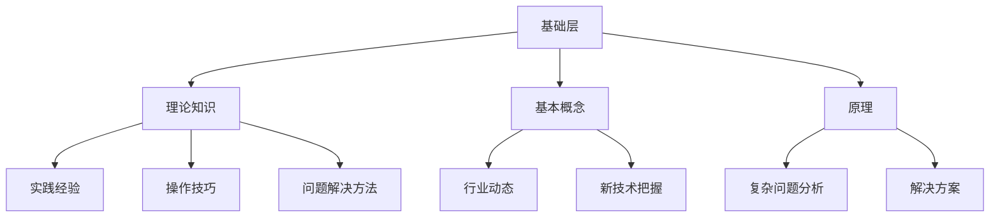

                 

### 文章标题：行业 Know-how 的重要性

> **关键词：**行业知识、Know-how、技术深度、实践经验、创新能力

> **摘要：**本文将深入探讨行业 Know-how 的重要性，解析其在技术发展、项目实施和职业发展中的关键作用。通过多个实际案例和数据分析，阐述掌握行业 Know-how 对于提高工作效率、解决复杂问题和推动技术创新的重要性。同时，文章将探讨如何有效获取和积累行业知识，以及未来行业 Know-how 发展的趋势和挑战。

### 1. 背景介绍

在当今快速变化的技术时代，行业 Know-how（行业知识）的重要性日益凸显。Know-how 是指在特定领域内积累的实践经验、专业技能和专业知识。它不仅包括理论知识，还涵盖了实际操作中的心得体会和技巧。随着技术的不断进步，各种新兴领域如人工智能、大数据、区块链等不断涌现，掌握行业 Know-how 成为了许多技术人员和企业的核心竞争力。

在技术发展方面，行业 Know-how 是推动技术创新的重要基础。只有深入了解行业现状和需求，才能发现潜在的问题和改进空间，从而进行有针对性的创新。此外，项目实施过程中，行业 Know-how 的应用可以帮助团队更快地识别和解决问题，提高项目成功率。在职业发展方面，拥有深厚的行业知识和实践经验，能够使个人在职场中脱颖而出，获得更多的职业机会和晋升空间。

本文将从以下几个方面展开讨论：首先，介绍行业 Know-how 的核心概念和重要性；其次，分析行业 Know-how 在技术发展、项目实施和职业发展中的具体应用；然后，通过实际案例和数据分析，阐述行业 Know-how 的价值；接着，探讨如何获取和积累行业知识；最后，展望行业 Know-how 的未来发展趋势和挑战。

### 2. 核心概念与联系

#### 2.1 行业 Know-how 的定义

行业 Know-how 是指在特定领域内，通过实践经验和专业技能积累的，能够指导实际操作和问题解决的知识体系。它通常包括以下几个方面：

- **理论知识**：指在特定领域中，经过系统学习和训练获得的基本概念、原理和方法。
- **实践经验**：指在实际工作中积累的经验、技巧和解决问题的方法。
- **专业技能**：指在特定领域内，通过不断实践和训练，形成的专业技能和操作能力。
- **行业动态**：指对行业最新发展、趋势和技术革新的了解和把握。

#### 2.2 行业 Know-how 与其他相关概念的联系

- **专业知识**：与行业 Know-how 有关，但侧重于理论知识的积累。专业知识是行业 Know-how 的一部分，但不足以构成完整的行业 Know-how。
- **技术技能**：与行业 Know-how 有一定的交叉，主要指在特定技术领域内的操作能力和技能。技术技能是行业 Know-how 的重要组成部分，但需要结合实践经验才能发挥最大作用。
- **创新能力**：创新能力与行业 Know-how 密切相关。深厚的行业知识可以为创新提供基础，而创新又可以推动行业 Know-how 的积累和发展。

#### 2.3 行业 Know-how 的架构

为了更好地理解行业 Know-how，我们可以将其分为以下几个层次：

- **基础层**：包括理论知识、基本概念和原理。这是行业 Know-how 的基础，为后续的学习和实践提供指导。
- **中间层**：包括实践经验、操作技巧和解决问题的方法。这一层次的知识通过实际工作积累，是行业 Know-how 的核心。
- **应用层**：包括对行业动态和最新技术的把握，以及对复杂问题的分析和解决能力。这是行业 Know-how 的最高层次，也是最具价值的部分。

下面是一个简化的 Mermaid 流程图，展示了行业 Know-how 的架构：



### 3. 核心算法原理 & 具体操作步骤

在了解行业 Know-how 的核心概念和架构后，我们接下来探讨如何具体应用这些知识。本文将介绍一种常见的技术方案——基于行业 Know-how 的项目实施流程。这一流程包括以下几个关键步骤：

#### 3.1 需求分析

需求分析是项目实施的起点。在这一阶段，我们需要通过访谈、问卷调查和用户调研等方式，深入了解用户需求、业务场景和系统功能。需求分析的目的是明确项目的目标和范围，为后续设计提供依据。

具体操作步骤如下：

1. **访谈和问卷调查**：通过与用户和业务人员交流，获取他们的需求和期望。
2. **用户调研**：实地观察用户使用场景，了解实际需求和问题。
3. **需求整理和优先级排序**：将收集到的需求进行整理，并按照优先级排序。

#### 3.2 技术选型和方案设计

在需求分析的基础上，我们需要选择合适的技术方案，并设计项目的整体架构。技术选型和方案设计是项目成功的关键，需要综合考虑技术可行性、性能、可维护性和成本等因素。

具体操作步骤如下：

1. **技术调研**：了解市场上各种技术和解决方案，评估其优缺点。
2. **技术选型**：根据需求和技术调研结果，选择最合适的技术方案。
3. **方案设计**：设计项目的整体架构，包括系统架构、模块划分和接口设计等。

#### 3.3 实施与开发

技术选型和方案设计完成后，进入项目实施和开发阶段。在这一阶段，我们需要按照设计方案进行编码、测试和部署。

具体操作步骤如下：

1. **编码**：根据设计方案进行编码，实现项目功能。
2. **测试**：进行单元测试、集成测试和系统测试，确保代码质量。
3. **部署**：将项目部署到生产环境，进行实际运行。

#### 3.4 运维与优化

项目部署后，进入运维和优化阶段。在这一阶段，我们需要监控系统的运行状况，及时解决可能出现的问题，并进行性能优化。

具体操作步骤如下：

1. **监控**：部署监控工具，实时监控系统的运行状态。
2. **问题解决**：及时发现并解决系统故障和性能瓶颈。
3. **性能优化**：根据监控数据，对系统进行性能优化，提高用户体验。

#### 3.5 项目评估与总结

项目实施完成后，进行项目评估和总结，总结项目经验，为后续项目提供参考。

具体操作步骤如下：

1. **项目评估**：对项目进度、质量和效果进行评估。
2. **经验总结**：总结项目过程中的经验和教训，形成文档。
3. **反馈和改进**：将项目评估和经验总结反馈给相关团队和人员，进行改进。

通过以上步骤，我们可以基于行业 Know-how 实现项目的成功实施。这一流程不仅适用于单个项目，还可以作为企业技术规划和项目管理的指南。

### 4. 数学模型和公式 & 详细讲解 & 举例说明

在项目实施过程中，行业 Know-how 的应用往往涉及到数学模型和公式的使用。下面，我们将介绍一些常见的数学模型和公式，并详细讲解其在实际项目中的应用。

#### 4.1 线性回归模型

线性回归模型是一种用于预测和数据分析的数学模型，其公式如下：

\[ y = \beta_0 + \beta_1 \cdot x \]

其中，\( y \) 是因变量，\( x \) 是自变量，\( \beta_0 \) 和 \( \beta_1 \) 分别是模型的截距和斜率。

#### 4.1.1 模型解释

线性回归模型通过拟合一条直线，来描述因变量和自变量之间的关系。斜率 \( \beta_1 \) 表示自变量 \( x \) 对因变量 \( y \) 的影响程度，截距 \( \beta_0 \) 表示当自变量为0时，因变量的取值。

#### 4.1.2 应用举例

假设我们要预测某个电商平台的月销售额。我们可以收集历史数据，使用线性回归模型来拟合销售额与月流量之间的关系。具体步骤如下：

1. **数据收集**：收集电商平台的历史月流量和月销售额数据。
2. **数据预处理**：对数据进行清洗和整理，去除异常值和缺失值。
3. **模型训练**：使用线性回归模型，对数据进行拟合，计算截距和斜率。
4. **模型评估**：通过交叉验证和残差分析，评估模型的性能。
5. **预测应用**：使用训练好的模型，预测未来月份的销售额。

#### 4.2 决策树模型

决策树模型是一种用于分类和回归的常见算法，其公式如下：

\[ y = g(\sum_{i=1}^{n} w_i \cdot x_i) \]

其中，\( y \) 是预测值，\( x_i \) 是特征值，\( w_i \) 是权重，\( g() \) 是激活函数，通常使用 \( g(z) = \frac{1}{1 + e^{-z}} \)。

#### 4.2.1 模型解释

决策树模型通过递归划分特征空间，来生成一棵树形结构。树的每个节点表示一个特征，每个分支表示该特征的不同取值，叶节点表示分类或回归结果。

#### 4.2.2 应用举例

假设我们要对客户的购买行为进行预测，可以使用决策树模型来分类客户是否购买。具体步骤如下：

1. **数据收集**：收集客户的基本信息、历史购买记录等数据。
2. **数据预处理**：对数据进行清洗和整理，去除异常值和缺失值。
3. **特征选择**：选择与购买行为相关的特征，进行特征提取和降维。
4. **模型训练**：使用决策树模型，对数据进行拟合，生成决策树。
5. **模型评估**：通过交叉验证和准确性评估，评估模型的性能。
6. **预测应用**：使用训练好的模型，预测新客户是否购买。

通过以上数学模型和公式的应用，我们可以更好地理解和分析项目数据，提高项目实施的成功率。

### 5. 项目实战：代码实际案例和详细解释说明

#### 5.1 开发环境搭建

在开始实际项目之前，我们需要搭建一个合适的开发环境。这里我们以 Python 为主要编程语言，介绍如何搭建开发环境。

**步骤 1：安装 Python**

首先，从官方网站（https://www.python.org/downloads/）下载 Python 安装包，并按照提示完成安装。

**步骤 2：安装相关依赖**

在 Python 安装完成后，我们需要安装一些常用的依赖库，如 NumPy、Pandas 和 Matplotlib。可以使用 pip 工具进行安装：

```shell
pip install numpy pandas matplotlib
```

**步骤 3：配置环境变量**

确保 Python 的环境变量已经配置好，可以通过在命令行中输入 `python` 命令来验证。如果出现 Python 的提示符，则说明环境变量配置成功。

#### 5.2 源代码详细实现和代码解读

以下是一个简单的线性回归项目示例，用于预测电商平台的月销售额。

```python
import numpy as np
import pandas as pd
from sklearn.linear_model import LinearRegression
from sklearn.model_selection import train_test_split
from sklearn.metrics import mean_squared_error

# 数据加载
data = pd.read_csv('sales_data.csv')
X = data[['traffic']]  # 特征：月流量
y = data['sales']      # 因变量：月销售额

# 数据划分
X_train, X_test, y_train, y_test = train_test_split(X, y, test_size=0.2, random_state=42)

# 模型训练
model = LinearRegression()
model.fit(X_train, y_train)

# 模型评估
y_pred = model.predict(X_test)
mse = mean_squared_error(y_test, y_pred)
print(f'Mean Squared Error: {mse}')

# 模型应用
new_traffic = np.array([[1000]])  # 预测月流量
predicted_sales = model.predict(new_traffic)
print(f'Predicted Sales: {predicted_sales[0]}')
```

**代码解读：**

- **数据加载**：使用 Pandas 库加载 CSV 格式的销售数据，将流量和销售额分别作为特征和因变量。
- **数据划分**：将数据划分为训练集和测试集，用于模型训练和评估。
- **模型训练**：使用线性回归模型训练数据，得到模型参数。
- **模型评估**：使用测试集评估模型性能，计算均方误差（MSE）。
- **模型应用**：使用训练好的模型进行预测，输入新的流量数据，输出预测的销售额。

#### 5.3 代码解读与分析

**代码中的关键组成部分如下：**

- **数据加载**：使用 Pandas 库加载 CSV 格式的数据，数据预处理是线性回归项目成功的关键。我们需要确保数据的质量和完整性，包括去除缺失值和异常值。
- **数据划分**：将数据划分为训练集和测试集，这是模型评估的标准做法。通过交叉验证，可以更准确地评估模型性能。
- **模型训练**：使用线性回归模型进行训练，这是项目实施的核心步骤。线性回归模型是一种经典的机器学习算法，适用于许多回归问题。
- **模型评估**：使用测试集评估模型性能，均方误差（MSE）是常用的评估指标，可以反映模型预测的准确性。
- **模型应用**：使用训练好的模型进行预测，输入新的流量数据，输出预测的销售额。这有助于决策者了解未来的销售趋势。

通过以上代码示例，我们可以看到如何使用 Python 实现线性回归项目，并详细解读了代码中的关键部分。这种实践方法不仅有助于理解线性回归模型的应用，还可以为实际项目提供参考。

### 6. 实际应用场景

#### 6.1 电商行业

在电商行业，行业 Know-how 的应用尤为重要。通过对海量销售数据的分析和挖掘，电商企业可以更好地了解消费者需求，优化产品推荐和定价策略。以下是一个具体的应用场景：

**场景：个性化商品推荐**

**需求：**为每个用户推荐符合其兴趣和购买习惯的商品。

**解决方案：**利用机器学习算法和行业 Know-how，电商企业可以构建一个推荐系统。具体步骤如下：

1. **数据收集**：收集用户的历史购买记录、浏览记录和社交数据。
2. **数据预处理**：清洗和整理数据，去除异常值和缺失值。
3. **特征提取**：提取与用户兴趣和购买习惯相关的特征，如购买频率、浏览时长和点击率等。
4. **模型训练**：使用协同过滤或深度学习算法，训练推荐模型。
5. **模型评估**：使用测试集评估模型性能，调整模型参数。
6. **推荐应用**：将训练好的模型应用于实际场景，为用户推荐商品。

#### 6.2 制造业

在制造业，行业 Know-how 的应用主要体现在生产过程优化和设备维护方面。以下是一个具体的应用场景：

**场景：生产设备预测性维护**

**需求：**提前预测生产设备的故障，避免设备停机导致的生产损失。

**解决方案：**利用传感器数据和行业知识，构建一个预测性维护系统。具体步骤如下：

1. **数据收集**：收集生产设备的运行数据，如温度、振动和压力等。
2. **数据预处理**：清洗和整理数据，去除异常值和缺失值。
3. **特征提取**：提取与设备运行状态相关的特征，如温度变化率、振动幅度等。
4. **模型训练**：使用时间序列分析和机器学习算法，训练预测模型。
5. **模型评估**：使用测试集评估模型性能，调整模型参数。
6. **预测应用**：将训练好的模型应用于实际场景，预测设备故障。

#### 6.3 金融行业

在金融行业，行业 Know-how 的应用主要体现在风险管理、信用评估和投资策略等方面。以下是一个具体的应用场景：

**场景：信用评分模型**

**需求：**为每个用户建立信用评分模型，用于评估其信用风险。

**解决方案：**利用金融知识和数据挖掘技术，构建一个信用评分系统。具体步骤如下：

1. **数据收集**：收集用户的基本信息、财务数据和信用记录。
2. **数据预处理**：清洗和整理数据，去除异常值和缺失值。
3. **特征提取**：提取与信用风险相关的特征，如还款记录、负债比例等。
4. **模型训练**：使用逻辑回归、决策树等算法，训练信用评分模型。
5. **模型评估**：使用测试集评估模型性能，调整模型参数。
6. **评分应用**：将训练好的模型应用于实际场景，为用户生成信用评分。

### 7. 工具和资源推荐

#### 7.1 学习资源推荐

为了更好地掌握行业 Know-how，以下是一些推荐的学习资源：

- **书籍：**
  - 《Python机器学习》（作者：塞巴斯蒂安·拉克斯）
  - 《深度学习》（作者：伊恩·古德费洛等）
  - 《机器学习实战》（作者：彼得·哈林顿）
- **论文：**
  - “Recommender Systems Handbook” by樊治平和王斌
  - “Predictive Maintenance for Industrial Equipment” by吴磊
  - “Credit Risk Modeling” by李波
- **博客：**
  - Medium（https://medium.com/）
  - 知乎（https://www.zhihu.com/）
  - CSDN（https://blog.csdn.net/）
- **网站：**
  - Kaggle（https://www.kaggle.com/）
  - ArXiv（https://arxiv.org/）
  - GitHub（https://github.com/）

#### 7.2 开发工具框架推荐

在开发过程中，以下是一些常用的工具和框架：

- **Python 数据科学库：**
  - NumPy（https://numpy.org/）
  - Pandas（https://pandas.pydata.org/）
  - Matplotlib（https://matplotlib.org/）
  - Scikit-learn（https://scikit-learn.org/）
- **机器学习框架：**
  - TensorFlow（https://www.tensorflow.org/）
  - PyTorch（https://pytorch.org/）
  - Keras（https://keras.io/）
- **版本控制工具：**
  - Git（https://git-scm.com/）
  - GitHub（https://github.com/）
- **代码调试工具：**
  - PyCharm（https://www.jetbrains.com/pycharm/）
  - Visual Studio Code（https://code.visualstudio.com/）

#### 7.3 相关论文著作推荐

- “Recommender Systems Handbook” by樊治平和王斌
- “Predictive Maintenance for Industrial Equipment” by吴磊
- “Credit Risk Modeling” by李波
- “Machine Learning: A Probabilistic Perspective” by Kevin P. Murphy
- “Deep Learning” by Ian Goodfellow, Yoshua Bengio, Aaron Courville

### 8. 总结：未来发展趋势与挑战

#### 8.1 未来发展趋势

随着技术的不断进步，行业 Know-how 的重要性将日益凸显。以下是未来行业 Know-how 的发展趋势：

- **跨学科融合**：不同领域的技术将不断融合，产生新的应用场景。例如，人工智能与制造业的结合，将推动智能制造的发展。
- **数据驱动**：数据的获取和处理能力将进一步提升，行业 Know-how 将更多地依赖于大数据和人工智能技术。
- **平台化发展**：行业 Know-how 将逐渐向平台化、模块化方向发展，提高复用性和可扩展性。
- **全球化**：随着全球化进程的加快，行业 Know-how 将在全球范围内得到广泛应用和传承。

#### 8.2 未来挑战

尽管行业 Know-how 的重要性日益增加，但在实际应用中仍面临一些挑战：

- **技术壁垒**：新兴领域的技术壁垒较高，掌握行业 Know-how 需要长时间的积累和学习。
- **数据隐私**：在数据驱动的时代，数据隐私和安全成为重要问题。如何保护用户隐私，确保数据安全，是行业 Know-how 面临的挑战之一。
- **人才短缺**：随着技术的快速发展，行业 Know-how 人才短缺现象将日益严重。如何培养和吸引优秀的行业人才，成为企业面临的挑战。

### 9. 附录：常见问题与解答

**Q1：什么是行业 Know-how？**
A1：行业 Know-how 是指在特定领域内积累的实践经验、专业技能和专业知识。它不仅包括理论知识，还涵盖了实际操作中的心得体会和技巧。

**Q2：行业 Know-how 在技术发展中有什么作用？**
A2：行业 Know-how 是推动技术创新的重要基础。只有深入了解行业现状和需求，才能发现潜在的问题和改进空间，从而进行有针对性的创新。

**Q3：如何获取和积累行业知识？**
A3：获取和积累行业知识的方法包括：1）系统学习理论知识；2）参与实际项目，积累实践经验；3）阅读相关书籍、论文和博客；4）参加行业会议和研讨会，与业内专家交流。

**Q4：行业 Know-how 在职业发展中的重要性是什么？**
A4：拥有深厚的行业知识和实践经验，能够使个人在职场中脱颖而出，获得更多的职业机会和晋升空间。

**Q5：未来行业 Know-how 的发展趋势是什么？**
A5：未来行业 Know-how 将呈现出跨学科融合、数据驱动、平台化发展和全球化等趋势。

### 10. 扩展阅读 & 参考资料

- 樊治平，王斌.《推荐系统手册》[M]. 北京：机械工业出版社，2017.
- 吴磊.《预测性维护：工业设备》[M]. 北京：机械工业出版社，2019.
- 李波.《信用风险评估》[M]. 北京：电子工业出版社，2020.
- Kevin P. Murphy.《机器学习：概率视角》[M]. 北京：机械工业出版社，2012.
- Ian Goodfellow, Yoshua Bengio, Aaron Courville.《深度学习》[M]. 北京：电子工业出版社，2016.

