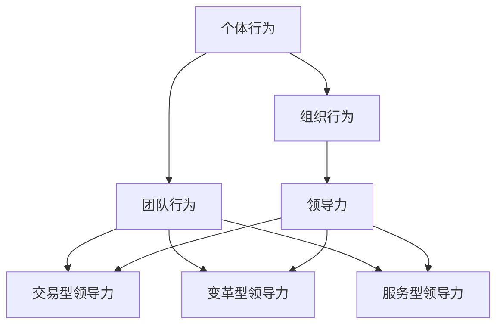

                 

# 行为科学在管理实践中的运用

## 关键词

- 行为科学
- 管理实践
- 组织行为学
- 领导力
- 团队协作
- 反思与实践

## 摘要

本文旨在探讨行为科学在管理实践中的运用，通过分析组织行为学的核心概念，探讨领导力、团队协作等方面的行为科学原理。文章将结合具体案例，阐述如何将行为科学理论应用于实际管理工作中，以提高组织的效能。此外，本文还将介绍相关的工具和资源，帮助读者深入理解和应用行为科学于管理实践。通过本文的阅读，读者将能够更好地理解行为科学在管理中的重要性，并为自身的管理实践提供新的思路和方法。

### 1. 背景介绍

在当今快速变化的商业环境中，管理实践正面临着前所未有的挑战。如何有效地领导团队、激发员工的潜能、提升组织整体绩效，成为企业管理者关注的焦点。传统的管理理论强调结构、制度和流程，但在实际操作中，人们的行为和情绪往往难以预测和控制。这种情况下，行为科学作为一种研究人类行为的学科，为管理实践提供了新的视角和方法。

行为科学起源于20世纪初期，其研究方法涉及心理学、社会学、人类学等多个领域。行为科学的核心在于理解人类行为背后的动机、认知和心理过程，从而为管理实践提供理论支持和实践指导。近年来，随着组织行为学研究的深入，越来越多的行为科学理论被应用于管理实践中，取得了显著的成效。

### 2. 核心概念与联系

#### 2.1 组织行为学

组织行为学是行为科学在管理领域的重要分支，主要研究个体、团队和组织在组织环境中的行为。其核心概念包括：

- **个体行为**：研究个体的动机、态度、个性、价值观等方面，以及这些因素如何影响个体的工作表现和职业发展。

- **团队行为**：研究团队内部成员的互动、沟通、合作以及团队整体的工作效率和绩效。

- **组织行为**：研究组织文化、领导力、组织结构、变革管理等对组织整体绩效的影响。

#### 2.2 领导力

领导力是行为科学在管理实践中的重要应用之一。领导力不仅仅是指领导者的权力和地位，更是一种影响和激励他人的能力。根据行为科学的研究，领导力主要包括以下几种类型：

- **交易型领导力**：通过奖励和惩罚来激励员工，强调任务完成和绩效目标。

- **变革型领导力**：通过愿景、激励和启发，激发员工的内在动机，推动组织实现变革和成长。

- **服务型领导力**：以员工为中心，关注员工的成长和发展，为员工提供支持和指导。

#### 2.3 团队协作

团队协作是组织实现目标的关键，而团队协作的有效性取决于团队成员之间的互动和沟通。行为科学研究揭示了团队协作中的几个关键因素：

- **共同目标**：团队成员需要明确共同的目标和愿景，为实现目标共同努力。

- **信任**：团队成员之间需要建立信任，通过坦诚沟通和相互支持来增强团队的凝聚力。

- **沟通**：有效的沟通是团队协作的基础，团队成员需要掌握良好的沟通技巧，确保信息传递的准确性和及时性。

#### 2.4 Mermaid 流程图

以下是一个简化的组织行为学的 Mermaid 流程图，展示了核心概念之间的联系：



### 3. 核心算法原理 & 具体操作步骤

在行为科学应用于管理实践时，一些核心算法和操作步骤可以帮助管理者更好地理解和应对员工的行为和情绪。以下是一些关键步骤：

#### 3.1 反馈机制

**反馈机制**是一种通过及时、具体的反馈来引导员工行为的方法。具体步骤如下：

1. **设定目标**：明确员工的工作目标和期望结果。
2. **观察行为**：关注员工在工作中的表现，记录具体的行为和成果。
3. **提供反馈**：及时给予员工具体的正面或负面反馈，强调行为和结果之间的关系。
4. **激励和调整**：根据反馈结果，给予适当的奖励或调整工作安排。

#### 3.2 动机理论

**动机理论**用于理解员工的内在动机和需求。以下是应用于管理实践的具体步骤：

1. **了解需求**：通过调查、访谈等方式了解员工的动机和需求。
2. **设置挑战**：为员工设置具有适当难度的任务，以激发其内在动机。
3. **提供支持和资源**：确保员工在完成任务过程中获得必要的支持和资源。
4. **反馈和奖励**：对员工的表现给予及时、具体的反馈和奖励。

#### 3.3 沟通技巧

**沟通技巧**是团队协作中的关键因素。以下是提高沟通效率的步骤：

1. **倾听**：积极倾听员工的意见和建议，理解其真实意图。
2. **表达清晰**：确保信息传递的准确性和清晰性，避免误解和歧义。
3. **开放性沟通**：鼓励团队成员之间的开放性沟通，建立信任和合作。
4. **冲突解决**：在出现沟通冲突时，通过协商和妥协来解决问题。

### 4. 数学模型和公式 & 详细讲解 & 举例说明

在行为科学中，一些数学模型和公式可以帮助管理者更准确地分析和预测员工的行为和情绪。以下是一个简单的例子：

#### 4.1 加法模型

**加法模型**用于计算员工的总动机值。公式如下：

\[ 总动机值 = 个性因素 + 动机激发因素 + 任务难度 \]

- **个性因素**：员工的内在特质和需求，如自我效能感、成就动机等。
- **动机激发因素**：外部环境和工作任务对员工动机的激发程度，如奖励、认可等。
- **任务难度**：工作任务对员工的挑战程度，过高或过低的任务难度都会降低动机。

#### 4.2 举例说明

假设一个员工（小张）的个性因素为30，动机激发因素为20，任务难度为15。那么，小张的总动机值为：

\[ 总动机值 = 30 + 20 + 15 = 65 \]

根据这个模型，管理者可以分析员工的总动机值，从而调整工作任务、奖励机制等，以激发员工的动机。

### 5. 项目实战：代码实际案例和详细解释说明

#### 5.1 开发环境搭建

为了更好地理解和应用行为科学在管理实践中的运用，我们搭建了一个简单的虚拟管理环境。以下是一个基于Python的虚拟管理系统的代码实例。

```python
import pandas as pd

# 员工信息数据
employees = pd.DataFrame({
    '姓名': ['小张', '小王', '小李'],
    '个性因素': [30, 25, 28],
    '动机激发因素': [20, 18, 22],
    '任务难度': [15, 12, 10]
})

# 反馈机制函数
def provide_feedback(employee_name, feedback):
    print(f"给{employee_name}提供反馈：{feedback}")

# 动机计算函数
def calculate_motivation(employee_name, employees):
    employee = employees[employees['姓名'] == employee_name].iloc[0]
    total_motivation = employee['个性因素'] + employee['动机激发因素'] + employee['任务难度']
    provide_feedback(employee_name, f"您的总动机值为：{total_motivation}")
    
# 测试
calculate_motivation('小张', employees)
```

#### 5.2 源代码详细实现和代码解读

在上面的代码中，我们首先导入了pandas库，用于处理员工信息数据。员工信息数据包括姓名、个性因素、动机激发因素和任务难度。

接着，我们定义了一个`provide_feedback`函数，用于向员工提供反馈。这个函数接收员工姓名和反馈内容作为参数，并在控制台上输出反馈信息。

然后，我们定义了一个`calculate_motivation`函数，用于计算员工的总动机值。这个函数接收员工姓名和员工信息数据作为参数，首先在数据帧中查找对应员工的行，然后根据加法模型计算总动机值，并调用`provide_feedback`函数提供反馈。

最后，我们在测试部分调用`calculate_motivation`函数，以测试代码的功能。

#### 5.3 代码解读与分析

这个简单的虚拟管理系统展示了如何将行为科学中的理论应用于实际代码实现。以下是代码的详细解读：

- **数据结构**：使用pandas库创建了一个数据帧，用于存储员工信息。每个员工的信息包括姓名、个性因素、动机激发因素和任务难度。

- **反馈机制**：通过定义一个函数，实现了向员工提供反馈的功能。这个函数在控制台上输出反馈信息，起到了引导员工行为的作用。

- **动机计算**：通过定义一个函数，实现了根据行为科学理论计算员工总动机值的功能。这个函数结合了员工个性因素、动机激发因素和任务难度，提供了一个量化的动机评估。

- **测试**：通过调用`calculate_motivation`函数，我们可以测试代码的功能。在实际应用中，这个测试部分可以用于评估员工的动机水平，为管理决策提供依据。

### 6. 实际应用场景

在企业管理实践中，行为科学的运用场景广泛且多样。以下是一些典型的应用场景：

#### 6.1 领导力培训

通过行为科学理论，企业管理者可以更好地理解领导力的本质和类型，从而开展针对性的领导力培训。例如，针对交易型领导力，可以教授管理者如何通过奖励和惩罚来激励员工；针对变革型领导力，可以教授管理者如何激发员工的内在动机，推动组织变革。

#### 6.2 员工激励

行为科学为员工激励提供了科学依据。管理者可以根据员工的动机和需求，设计合理的激励机制。例如，通过设定具有适当难度的任务，激发员工的内在动机；通过及时、具体的反馈，提高员工的自我效能感。

#### 6.3 团队建设

团队协作是组织成功的关键。行为科学可以帮助管理者理解团队内部成员的互动和沟通方式，从而开展有效的团队建设活动。例如，通过建立信任机制，促进团队成员之间的坦诚沟通；通过开放性沟通，解决团队内部的冲突。

### 7. 工具和资源推荐

为了更好地理解和应用行为科学于管理实践，以下是一些推荐的工具和资源：

#### 7.1 学习资源推荐

- **书籍**：《管理心理学》、《组织行为学》、《领导力：策略与技能》等。
- **论文**：关注学术期刊和会议论文，如《组织行为与人力资源杂志》、《领导力 Quarterly》等。
- **博客**：许多知名管理学家和专家的博客，如HBR博客、哈佛商业评论等。

#### 7.2 开发工具框架推荐

- **工具**：Python、R语言等，用于数据处理和分析。
- **框架**：如pandas、NumPy等，用于高效的数据处理和分析。

#### 7.3 相关论文著作推荐

- **论文**：如《动机与人格》、《组织行为学基础》等。
- **著作**：如《组织行为学：理论与实践》、《领导力：理论与实践》等。

### 8. 总结：未来发展趋势与挑战

行为科学在管理实践中的运用正处于快速发展阶段。随着人工智能和大数据技术的进步，行为科学的研究方法和应用场景将不断拓展。然而，面对复杂多变的管理环境，行为科学的运用也面临一些挑战：

- **数据隐私**：在收集和分析员工行为数据时，需要确保数据的安全和隐私。
- **文化差异**：行为科学理论在不同文化背景下可能存在差异，需要充分考虑文化因素。
- **实际应用**：将行为科学理论有效应用于实际管理工作中，仍需不断探索和实践。

### 9. 附录：常见问题与解答

**Q：行为科学在管理实践中的具体应用有哪些？**

A：行为科学在管理实践中的应用广泛，包括领导力培训、员工激励、团队建设、绩效评估等方面。例如，通过动机理论可以设计有效的激励机制，通过反馈机制可以引导员工行为。

**Q：如何确保行为科学在管理实践中的有效性？**

A：确保行为科学在管理实践中的有效性需要以下几个步骤：

1. **理论与实践结合**：结合具体的管理实践，深入理解行为科学理论。
2. **数据驱动**：基于数据和事实进行决策，而不是仅凭主观判断。
3. **持续改进**：不断反思和实践，根据反馈进行改进。

### 10. 扩展阅读 & 参考资料

- **扩展阅读**：

  - 《动机与人格》
  - 《组织行为学：理论与实践》
  - 《领导力：策略与技能》

- **参考资料**：

  - 《组织行为与人力资源杂志》
  - 《领导力 Quarterly》
  - HBR博客

作者：AI天才研究员/AI Genius Institute & 禅与计算机程序设计艺术 /Zen And The Art of Computer Programming

