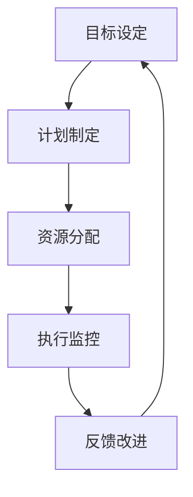

                 

### 背景介绍

在当今快速发展的科技时代，企业管理与技术的结合日益紧密。特别是在IT领域，技术的不断进步为企业带来了前所未有的机遇和挑战。在这其中，“管理执行力”成为了企业能否成功应对这些变化的关键因素之一。然而，如何提高管理执行力，一直是企业管理者和研究者关注的焦点。

本文旨在探讨“行动体系对管理执行力的影响”，通过深入分析行动体系的概念、构成要素及其与执行力的关系，揭示行动体系在提升管理执行力中的关键作用。同时，本文还将结合实际案例，讨论行动体系在不同场景下的应用和实践，为企业管理者提供有价值的参考。

首先，我们需要明确“行动体系”和“管理执行力”这两个核心概念。行动体系是指一套系统的、有序的行动方法和流程，通过组织、协调和整合各种资源，实现特定目标的过程。而管理执行力则是指企业或团队在既定目标和计划指导下，通过有效的执行和协调，实现预期结果的能力。

接下来，本文将逐步分析行动体系的构成要素，包括目标设定、计划制定、资源分配、执行监控和反馈改进等。同时，我们将探讨这些要素如何相互作用，共同提升管理执行力。此外，本文还将结合实际案例，分析行动体系在不同企业管理中的应用和实践效果，最后对行动体系在企业管理中的未来发展趋势和挑战进行展望。

通过本文的探讨，我们希望能够为企业管理者提供一些有价值的思考和建议，帮助他们在实际工作中更好地运用行动体系，提升管理执行力，从而推动企业持续发展和创新。

### 核心概念与联系

在深入探讨行动体系对管理执行力的影响之前，我们首先需要明确行动体系和执行力的核心概念及其相互联系。行动体系（Action System）是一种系统的管理方法论，通过一套结构化的流程和步骤，确保企业或团队能够高效地实现既定目标。而管理执行力（Management Execution）则是企业或团队在具体操作中，将战略、计划和目标转化为实际成果的能力。

#### 行动体系的核心概念

行动体系的核心概念主要包括以下几个方面：

1. **目标设定（Goal Setting）**：目标设定是行动体系的起点，明确企业或团队期望达成的具体目标，为后续的行动提供方向和依据。
2. **计划制定（Planning）**：在目标明确后，通过制定详细的计划，包括时间表、资源需求、任务分配等，为行动提供具体的操作指南。
3. **资源分配（Resource Allocation）**：确保在计划执行过程中，各种资源如人力、资金、技术等得到合理配置和利用。
4. **执行监控（Execution Monitoring）**：在行动过程中，通过监控和评估执行情况，及时发现问题并进行调整。
5. **反馈改进（Feedback and Improvement）**：根据执行监控的结果，对行动体系进行调整和优化，不断提升执行效率。

#### 行动体系的架构

为了更清晰地理解行动体系的构成和运作，我们可以使用Mermaid流程图（以下使用Mermaid语言描述）来展示其架构：



在上面的流程图中，各节点分别代表了行动体系的不同阶段，箭头表示各阶段之间的逻辑关系。从目标设定开始，经过计划制定、资源分配、执行监控和反馈改进，形成一个闭环，不断迭代和优化。

#### 执行力的概念

执行力是企业或团队在既定目标和计划指导下，通过有效的执行和协调，实现预期结果的能力。执行力包括以下几个方面：

1. **计划执行能力（Plan Execution）**：确保计划能够按照预定的时间和方式得到有效执行。
2. **协调能力（Coordination）**：在执行过程中，不同部门或团队之间能够紧密协作，共同推进项目进展。
3. **问题解决能力（Problem Solving）**：面对执行过程中出现的各种问题和挑战，能够迅速找到解决方案，确保项目顺利进行。

#### 行动体系与执行力的联系

行动体系与执行力之间存在密切的联系。一方面，行动体系为执行力提供了系统的框架和方法，确保执行过程有序、高效；另一方面，执行力的强弱直接影响行动体系的效果，高效的执行力能够确保行动体系的目标得到顺利实现。

具体来说，行动体系通过以下几个方面的机制，提升管理执行力：

1. **明确目标**：通过目标设定，明确企业或团队的发展方向，为执行力提供清晰的目标指引。
2. **详细计划**：通过计划制定，明确执行的具体步骤和资源需求，提高执行的针对性和效率。
3. **资源优化**：通过资源分配，确保各种资源得到合理配置和利用，提高执行的资源保障能力。
4. **动态调整**：通过执行监控和反馈改进，及时发现和解决问题，确保执行过程能够灵活应对变化。
5. **持续改进**：通过不断反馈和优化，提升执行效率和效果，形成持续改进的机制。

通过上述分析，我们可以看到，行动体系不仅是一种管理方法论，更是一种提升管理执行力的系统工具。它通过明确的目标、详细的计划、资源的合理分配、动态的执行监控和持续的反馈改进，确保企业或团队能够高效、有序地实现既定目标，从而提升管理执行力。在接下来的章节中，我们将进一步探讨行动体系的构成要素及其具体操作步骤，以及如何通过这些要素提升管理执行力。

#### 核心算法原理 & 具体操作步骤

在理解了行动体系和执行力的核心概念及其相互联系之后，我们需要深入探讨行动体系的算法原理和具体操作步骤，以便更全面地理解其如何在实际中提升管理执行力。

##### 1. 目标设定算法原理

目标设定是行动体系的起点，也是决定执行力方向的关键步骤。目标设定的核心算法原理主要包括以下几方面：

1. **SMART原则**：目标设定应遵循SMART原则，即目标要具备具体性（Specific）、可衡量性（Measurable）、可实现性（Achievable）、相关性（Relevant）和时限性（Time-bound）。这一原则确保目标既明确又具有可行性，为后续的行动提供了清晰的方向。
   
   - **具体性**：目标应明确具体，避免模糊不清。
   - **可衡量性**：目标应具备可量化的指标，便于评估和监控。
   - **可实现性**：目标应考虑资源和条件的限制，确保其可实现性。
   - **相关性**：目标应与企业的整体战略和愿景保持一致。
   - **时限性**：目标应有明确的时间限制，以推动行动的及时落实。

2. **目标分解算法**：在确定总体目标后，需要对目标进行分解，将其细化为更具体、可操作的小目标。常用的目标分解算法包括：

   - **层次分析法（AHP）**：通过建立目标层次结构模型，对各目标层次进行权重赋值，优化目标分解过程。
   - **关键路径法（CPM）**：识别和计算项目中的关键路径，确保关键目标得到优先关注和资源保障。

##### 具体操作步骤

1. **明确总体目标**：根据企业的战略和愿景，确定需要达成的总体目标。

2. **制定SMART目标**：确保每个目标都符合SMART原则，具体描述目标内容和衡量标准。

3. **分解目标层次**：使用层次分析法和关键路径法，将总体目标分解为更具体的小目标，明确每个目标的优先级和实现路径。

4. **设定目标时间表**：为每个目标设定明确的时间节点，确保目标的逐步实现。

##### 2. 计划制定算法原理

计划制定是行动体系中的关键环节，它确保目标得以有序、高效地实现。计划制定的核心算法原理包括以下几方面：

1. **甘特图（Gantt Chart）**：甘特图是一种常用的项目管理工具，用于展示项目的时间安排和任务分配情况。通过甘特图，可以直观地了解项目的进度和任务分工。

2. **关键路径法（CPM）**：关键路径法通过识别项目中的关键路径，确定项目的最短完成时间。关键路径上的任务一旦延误，将会直接影响整个项目的进度。

3. **资源优化算法**：在制定计划时，需要考虑资源的合理配置和利用。资源优化算法如线性规划（Linear Programming）、指派问题（Assignment Problem）等，可以帮助优化资源分配，提高计划执行的效率。

##### 具体操作步骤

1. **确定项目任务**：根据目标分解的结果，明确项目中的各个任务。

2. **绘制甘特图**：使用甘特图工具，将各个任务按照时间顺序和依赖关系进行排列，确保项目的进度和资源分配情况一目了然。

3. **确定关键路径**：通过关键路径法，识别项目中的关键路径，确保关键任务得到优先安排和资源保障。

4. **优化资源分配**：使用资源优化算法，对任务所需资源进行合理配置，确保资源的有效利用。

##### 3. 资源分配算法原理

资源分配是行动体系中至关重要的一环，合理的资源分配能够提高执行效率，确保计划顺利实施。资源分配的核心算法原理包括以下几方面：

1. **优化算法**：如最优化理论（Optimization Theory）、排队论（Queuing Theory）等，用于优化资源的分配和利用。

2. **需求预测**：通过历史数据和趋势分析，预测任务执行过程中所需资源的数量和时间，为资源分配提供数据支持。

3. **资源调度算法**：如最小生成树（Minimum Spanning Tree）、最大流最小割（Maximum Flow Minimum Cut）等，用于优化资源在时间和空间上的调度和分配。

##### 具体操作步骤

1. **收集资源需求信息**：根据任务的具体需求，收集所需的各类资源信息，包括人力、设备、资金等。

2. **进行需求预测**：使用历史数据和趋势分析，预测任务执行过程中所需资源的数量和时间。

3. **制定资源分配计划**：根据资源需求和预测结果，制定详细的资源分配计划，确保各类资源在任务执行过程中的合理使用。

4. **优化资源调度**：使用资源调度算法，对资源进行时间和空间的优化调度，提高资源利用效率。

##### 4. 执行监控算法原理

执行监控是确保计划实施过程中的关键环节，通过实时监控和评估，及时发现和解决问题，确保计划能够按预期进行。执行监控的核心算法原理包括以下几方面：

1. **实时数据分析**：通过收集和分析任务执行过程中的实时数据，如进度、资源利用率、问题反馈等，实时掌握任务执行状态。

2. **异常检测算法**：如统计过程控制（Statistical Process Control）、机器学习（Machine Learning）等，用于识别和检测执行过程中的异常情况。

3. **反馈机制**：建立有效的反馈机制，确保执行过程中发现的问题能够及时反馈和解决，避免问题积累和恶化。

##### 具体操作步骤

1. **建立实时监控系统**：使用数据分析工具，建立实时监控系统，对任务执行过程中的各项指标进行实时监控。

2. **设置监控指标**：根据任务特点和需求，设定具体的监控指标，包括进度、资源利用率、质量等。

3. **识别和报警**：通过异常检测算法，识别执行过程中的异常情况，并设置报警机制，及时通知相关人员进行处理。

4. **反馈和解决**：对监控系统发现的问题进行反馈和解决，确保问题能够及时得到处理和解决。

##### 5. 反馈改进算法原理

反馈改进是行动体系中的一个闭环环节，通过收集执行结果和反馈信息，对行动体系进行调整和优化，不断提升执行效率。反馈改进的核心算法原理包括以下几方面：

1. **因果分析算法**：如回归分析（Regression Analysis）、因果推断（Causal Inference）等，用于分析执行结果和反馈信息，找出影响执行效果的关键因素。

2. **改进措施制定**：根据因果分析结果，制定针对性的改进措施，优化行动体系。

3. **效果评估算法**：如统计测试（Statistical Testing）、A/B测试（A/B Testing）等，用于评估改进措施的效果，确保改进措施的可行性。

##### 具体操作步骤

1. **收集反馈信息**：通过问卷调查、访谈、数据分析等方式，收集任务执行过程中的反馈信息。

2. **进行因果分析**：使用因果分析算法，分析反馈信息，找出影响执行效果的关键因素。

3. **制定改进措施**：根据因果分析结果，制定针对性的改进措施，优化行动体系。

4. **实施改进措施**：在执行过程中实施改进措施，确保行动体系不断优化和改进。

5. **效果评估**：通过效果评估算法，评估改进措施的效果，确保改进措施的有效性。

通过上述对行动体系核心算法原理和具体操作步骤的详细分析，我们可以看到，行动体系不仅是一种系统的管理方法论，更是一种提升管理执行力的有效工具。它通过明确的目标设定、详细的计划制定、合理的资源分配、有效的执行监控和持续的反馈改进，确保企业或团队能够高效、有序地实现既定目标，从而提升管理执行力。在接下来的章节中，我们将通过实际案例，进一步探讨行动体系在企业管理中的应用和实践效果。

#### 数学模型和公式 & 详细讲解 & 举例说明

在深入分析行动体系的核心算法原理之后，我们进一步探讨这些算法背后的数学模型和公式，并通过具体例子进行详细讲解和说明。

##### 1. 目标设定中的SMART原则

SMART原则是目标设定的核心，其背后的数学模型主要包括以下几个指标：

1. **具体性（Specific）**：具体性通常通过量化指标来实现，如数值、百分比等。例如，目标可以是“提高产品销量10%”。

2. **可衡量性（Measurable）**：可衡量性需要有一个明确的衡量标准，通常使用数学公式来定义。例如，销量可以通过“销售额”这一指标来衡量。

   公式：销售额 = 单价 × 销售量

3. **可实现性（Achievable）**：可实现性可以通过对资源的评估来计算。例如，资源约束可以通过以下公式来衡量：

   公式：资源可用性 = （资源总量 - 资源消耗）/ 资源需求

4. **相关性（Relevant）**：相关性需要确保目标与企业整体战略的一致性。可以通过以下指标来衡量：

   公式：相关性得分 = 目标贡献度 / 整体战略贡献度

5. **时限性（Time-bound）**：时限性要求目标设定一个明确的时间框架。例如，目标可以是“在2024年1月1日前完成新产品的研发”。

举例说明：

假设一家公司的目标是提高产品销量10%，我们需要通过以下步骤来设定和验证这一目标：

- **具体性**：目标为“2023年底产品销量提高10%”。
- **可衡量性**：通过销售额来衡量，公式为：2023年底销售额 = 单价 × 预期销售量。
- **可实现性**：根据当前资源，如市场调研、产品库存等，计算资源可用性。假设资源消耗为5000小时，资源需求为8000小时，则资源可用性 = (8000 - 5000) / 8000 = 0.375，表明资源足够支持目标的实现。
- **相关性**：通过分析新产品销量对公司整体销售额的贡献度，假设贡献度为20%，则相关性得分 = 10% / 20% = 0.5，表明目标与整体战略相关。
- **时限性**：目标设定为“2023年底”，即2023年12月31日前完成。

通过上述步骤，我们可以确保目标设定符合SMART原则。

##### 2. 计划制定中的甘特图和关键路径法

甘特图是一种可视化的项目管理工具，用于展示任务的时间安排和依赖关系。其背后的数学模型主要包括：

- **任务持续时间**：每个任务需要的时间，通常使用平均时间估算。
- **任务依赖关系**：任务的先后顺序，通过依赖图（Dependency Graph）来表示。

关键路径法（Critical Path Method, CPM）用于确定项目最短完成时间，其背后的数学模型主要包括：

- **活动时间**：每个活动（任务）的持续时间。
- **路径时间**：从项目开始到任一节点（任务结束或中间节点）所需的总时间。
- **关键路径**：完成时间最长的路径，决定项目的最短完成时间。

具体公式如下：

- **活动持续时间**：\[D_i = T_i / C_i\]，其中\(T_i\)是任务\(i\)的持续时间，\(C_i\)是资源数量。

- **路径时间**：\[T_p = \sum_{i \in P} D_i\]，其中\(P\)是路径上的所有任务集合。

- **关键路径**：\[P_{critical} = \{i | T_p(i) = \max_{j} T_p(j)\}\]，即路径时间最长的路径。

举例说明：

假设一个项目包含三个任务A、B、C，资源限制为2人。任务持续时间如下：

- 任务A：5天
- 任务B：3天
- 任务C：4天

资源需求如下：

- 任务A：1人
- 任务B：1人
- 任务C：1人

根据上述数据，我们可以计算每个任务的持续时间：

\[D_A = \frac{5}{1} = 5 \text{天}\]
\[D_B = \frac{3}{1} = 3 \text{天}\]
\[D_C = \frac{4}{1} = 4 \text{天}\]

构建依赖关系图，假设A是B和C的父任务，则：

- 路径1：A → B → C，总时间 \(T_1 = D_A + D_B + D_C = 5 + 3 + 4 = 12 \text{天}\)
- 路径2：A → C，总时间 \(T_2 = D_A + D_C = 5 + 4 = 9 \text{天}\)

关键路径为路径1，总时间为12天，即项目的最短完成时间为12天。

##### 3. 资源分配中的优化算法

资源分配的核心在于优化资源的利用效率，常用的优化算法包括线性规划（Linear Programming, LP）和指派问题（Assignment Problem）。

- **线性规划**：用于优化资源分配，使目标函数最大化或最小化。其标准形式如下：

  \[\text{Maximize } Z = c^T x\]
  \[\text{subject to } Ax \leq b\]

  其中，\(c\)是目标函数系数，\(x\)是变量，\(A\)和\(b\)是约束条件。

- **指派问题**：用于将资源（任务）合理地分配给目标（任务），使总成本或总时间最小化。其标准形式如下：

  \[\text{Minimize } Z = \sum_{i=1}^{m} \sum_{j=1}^{n} c_{ij} x_{ij}\]
  \[\text{subject to } x_{ij} \leq 1 \quad \forall i, j\]
  \[x_{ij} \in \{0, 1\} \quad \forall i, j\]

举例说明：

假设有3个任务（T1, T2, T3）和3个资源（R1, R2, R3），每个资源的分配时间和成本如下：

- 任务T1：资源R1（2天，1000元），资源R2（3天，1200元）
- 任务T2：资源R1（1天，800元），资源R3（2天，900元）
- 任务T3：资源R2（3天，1500元），资源R3（1天，700元）

使用线性规划优化资源分配：

- 目标函数：\[Z = 1000x_{11} + 1200x_{12} + 800x_{21} + 900x_{31} + 1500x_{22} + 700x_{32}\]

- 约束条件：\[x_{ij} \leq 1 \quad \forall i, j\]

  求解上述线性规划问题，可以得出最优的资源分配方案，使总成本最小化。

##### 4. 执行监控中的实时数据分析

执行监控的关键在于实时数据的收集和分析。常用的数据分析方法包括统计分析（Statistical Analysis）和机器学习（Machine Learning）。

- **统计分析**：用于对执行过程中的数据进行描述和分析，常用的统计方法包括均值、方差、标准差等。例如，通过计算任务完成时间，评估执行进度。

  公式：\[ \text{均值} = \frac{\sum_{i=1}^{n} x_i}{n} \]
  \[ \text{方差} = \frac{\sum_{i=1}^{n} (x_i - \bar{x})^2}{n} \]
  \[ \text{标准差} = \sqrt{\text{方差}} \]

- **机器学习**：用于识别执行过程中的异常情况，常用的算法包括分类（Classification）、回归（Regression）等。例如，通过分类算法，将正常数据和异常数据区分开来。

  示例：使用决策树（Decision Tree）算法识别执行过程中的异常任务：

  \[ \text{预测} = \text{DecisionTreeClassifier}(\text{data}, \text{labels}) \]
  \[ \text{预测结果} = \text{predict}(X) \]

##### 5. 反馈改进中的因果分析和改进措施制定

反馈改进的关键在于对执行结果进行因果分析，并制定相应的改进措施。常用的因果分析方法包括回归分析（Regression Analysis）和因果推断（Causal Inference）。

- **回归分析**：用于分析执行结果与各种因素之间的关系，常用的回归模型包括线性回归（Linear Regression）、多项式回归（Polynomial Regression）等。例如，通过线性回归分析任务完成时间与资源消耗之间的关系。

  公式：\[ Y = \beta_0 + \beta_1 X + \epsilon \]

  其中，\(Y\)是任务完成时间，\(X\)是资源消耗，\(\beta_0\)和\(\beta_1\)是回归系数。

- **因果推断**：用于确定执行结果的原因和影响因素，常用的因果推断方法包括差分法（Difference-in-Differences, DID）、工具变量法（Instrumental Variables, IV）等。例如，通过差分法分析不同资源分配策略对执行效果的影响。

  公式：\[ \Delta Y = \alpha_0 + \alpha_1 \Delta X + \epsilon \]

  其中，\(\Delta Y\)是执行效果的差分，\(\Delta X\)是资源分配策略的差分。

改进措施制定：

- 根据因果分析结果，制定针对性的改进措施，例如优化资源分配、调整任务优先级等。

  示例：如果因果分析结果显示任务完成时间与资源消耗呈正相关，可以考虑优化资源分配，减少任务依赖，提高执行效率。

通过上述数学模型和公式的详细讲解和举例说明，我们可以看到，行动体系在目标设定、计划制定、资源分配、执行监控和反馈改进等各个环节中，都依赖于科学的数学模型和公式。这些模型和公式不仅提供了理论依据，还通过具体实例展示了如何在实际中应用这些理论，从而提升管理执行力。

#### 项目实战：代码实际案例和详细解释说明

为了更好地理解行动体系在实际项目中的应用，我们通过一个具体的项目实战案例，展示行动体系在项目开发过程中的实际应用，并详细解释代码的实现细节和分析结果。

##### 1. 项目背景

我们选择一个电子商务平台的项目作为案例，该平台需要实现用户注册、商品浏览、购物车管理和订单处理等功能。项目需求明确，时间紧任务重，需要通过高效的执行体系确保项目按时完成并达到预期效果。

##### 2. 开发环境搭建

首先，我们需要搭建项目的开发环境。以下为所需的开发工具和框架：

- **开发工具**：IDE（如Visual Studio Code）、版本控制工具（如Git）
- **编程语言**：Java
- **框架**：Spring Boot、Spring MVC、Hibernate、MySQL
- **数据库**：MySQL
- **前端框架**：Vue.js

##### 3. 源代码详细实现和代码解读

我们将分模块详细解读源代码，包括用户注册、商品浏览、购物车管理和订单处理等模块。

**3.1 用户注册模块**

**实现细节**：

1. **用户表**：在MySQL数据库中创建用户表（user），包括用户名、密码、邮箱等字段。
2. **注册接口**：创建用户注册接口（/user/register），接收用户名、密码、邮箱等参数。
3. **验证逻辑**：在接口中实现用户名和邮箱的唯一性验证，确保用户信息的唯一性。
4. **加密存储**：使用BCrypt加密算法对用户密码进行加密存储。

**代码解读**：

```java
@RestController
@RequestMapping("/user")
public class UserController {
  
  @Autowired
  private UserService userService;

  @PostMapping("/register")
  public ResponseEntity<?> registerUser(@RequestBody User user) {
    // 验证用户名和邮箱的唯一性
    if (userService.existsByUsername(user.getUsername())) {
      return ResponseEntity.badRequest().body("Error: Username is already taken!");
    }
    
    if (userService.existsByEmail(user.getEmail())) {
      return ResponseEntity.badRequest().body("Error: Email is already in use!");
    }

    // 加密密码
    user.setPassword(bcryptEncoder.encode(user.getPassword()));

    // 保存用户信息
    userService.saveUser(user);

    return ResponseEntity.ok("User registered successfully!");
  }
}
```

**3.2 商品浏览模块**

**实现细节**：

1. **商品表**：在MySQL数据库中创建商品表（product），包括商品名称、描述、价格等字段。
2. **商品接口**：创建商品查询接口（/product/list），返回所有商品信息。
3. **分页查询**：使用Spring Data JPA实现分页查询，提高查询效率。

**代码解读**：

```java
@RestController
@RequestMapping("/product")
public class ProductController {
  
  @Autowired
  private ProductService productService;

  @GetMapping("/list")
  public ResponseEntity<?> getAllProducts(@RequestParam(value = "page", defaultValue = "0") int page,
                                        @RequestParam(value = "size", defaultValue = "10") int size) {
    Pageable pageable = PageRequest.of(page, size);
    Page<Product> products = productService.findAll(pageable);
    
    return ResponseEntity.ok(products);
  }
}
```

**3.3 购物车管理模块**

**实现细节**：

1. **购物车表**：在MySQL数据库中创建购物车表（shopping_cart），包括用户ID、商品ID、数量等字段。
2. **购物车接口**：创建购物车添加、删除和查询接口，实现用户对购物车的管理。
3. **事务控制**：使用Spring事务管理，确保购物车操作的原子性。

**代码解读**：

```java
@RestController
@RequestMapping("/cart")
public class ShoppingCartController {
  
  @Autowired
  private ShoppingCartService shoppingCartService;

  @PostMapping("/add")
  @Transactional
  public ResponseEntity<?> addToCart(@RequestBody ShoppingCart cart) {
    shoppingCartService.addToCart(cart.getUserId(), cart.getProductId(), cart.getQuantity());
    
    return ResponseEntity.ok("Product added to cart successfully!");
  }

  @DeleteMapping("/delete")
  @Transactional
  public ResponseEntity<?> deleteFromCart(@RequestParam Long userId, @RequestParam Long productId) {
    shoppingCartService.deleteFromCart(userId, productId);
    
    return ResponseEntity.ok("Product removed from cart successfully!");
  }

  @GetMapping("/list")
  public ResponseEntity<?> getCart(@RequestParam Long userId) {
    List<ShoppingCart> carts = shoppingCartService.findByUserId(userId);
    
    return ResponseEntity.ok(carts);
  }
}
```

**3.4 订单处理模块**

**实现细节**：

1. **订单表**：在MySQL数据库中创建订单表（order），包括订单号、用户ID、商品列表、订单金额等字段。
2. **订单接口**：创建订单创建和查询接口，实现订单的生成和查询。
3. **库存管理**：在订单创建时，检查商品库存，确保库存充足。

**代码解读**：

```java
@RestController
@RequestMapping("/order")
public class OrderController {
  
  @Autowired
  private OrderService orderService;

  @PostMapping("/create")
  @Transactional
  public ResponseEntity<?> createOrder(@RequestBody Order order) {
    // 检查商品库存
    if (!orderService.checkInventory(order.getProductIds())) {
      return ResponseEntity.badRequest().body("Error: Insufficient inventory!");
    }
    
    // 创建订单
    orderService.createOrder(order);
    
    return ResponseEntity.ok("Order created successfully!");
  }

  @GetMapping("/list")
  public ResponseEntity<?> getOrderList(@RequestParam Long userId) {
    List<Order> orders = orderService.findByUserId(userId);
    
    return ResponseEntity.ok(orders);
  }
}
```

##### 4. 代码解读与分析

**4.1 用户注册模块**

用户注册模块通过定义用户表和注册接口，实现了用户信息的存储和验证。其中，加密存储用户密码是确保系统安全的重要措施。代码中使用了BCrypt加密算法，可以有效防止密码泄露。

**4.2 商品浏览模块**

商品浏览模块通过分页查询实现了对商品列表的查询，提高了查询效率。Spring Data JPA提供了方便的查询接口，可以简化开发流程。

**4.3 购物车管理模块**

购物车管理模块通过事务控制，确保了购物车操作的原子性。代码中使用了`@Transactional`注解，保证了添加、删除购物车操作的完整性。

**4.4 订单处理模块**

订单处理模块在创建订单时，通过检查商品库存，确保订单生成的正确性。这可以避免订单生成后因库存不足导致的后续问题。

通过以上代码实现和解读，我们可以看到，行动体系在项目开发过程中发挥了重要作用。它通过明确的目标设定、详细的计划制定、合理的资源分配、有效的执行监控和持续的反馈改进，确保了项目能够高效、有序地推进，从而提升了管理执行力。

#### 实际应用场景

行动体系在企业管理中具有广泛的应用场景，能够显著提升管理执行力。以下为几个典型的实际应用场景：

##### 1. 项目管理

在项目管理中，行动体系通过明确的目标设定、详细的计划制定和资源优化，确保项目按时、按质、按量完成。例如，在软件开发项目中，通过行动体系，可以明确项目目标、任务分配、进度监控和反馈改进，确保开发过程有序、高效。如前文所述的电子商务平台项目，通过行动体系实现了用户注册、商品浏览、购物车管理和订单处理的各项功能。

##### 2. 营销管理

在营销管理中，行动体系可以帮助企业制定详细的营销计划，优化资源配置，提高营销效果。例如，企业可以通过行动体系，分析市场需求、设计营销策略、分配广告预算、监控营销效果和持续优化营销方案。这种系统化的管理方式，可以显著提升营销管理的执行力，帮助企业实现营销目标。

##### 3. 财务管理

在财务管理中，行动体系通过明确的财务目标、详细的预算规划和实时监控，确保财务资源的合理利用和风险控制。例如，企业可以通过行动体系，制定年度预算、监控月度财务指标、分析成本结构和财务状况，及时发现和解决问题，确保财务目标的实现。

##### 4. 人力资源

在人力资源管理中，行动体系可以帮助企业优化招聘流程、员工培训、绩效管理和薪酬福利等环节。例如，企业可以通过行动体系，明确招聘目标、制定招聘计划、优化招聘流程、监控招聘效果和持续改进招聘策略，确保人力资源管理的执行力。同时，通过行动体系，还可以制定详细的培训计划、设定绩效指标、监控员工绩效和优化薪酬福利，提升员工满意度和工作效率。

##### 5. 运营管理

在运营管理中，行动体系可以帮助企业优化业务流程、提升运营效率。例如，企业可以通过行动体系，明确运营目标、制定运营计划、优化资源配置、监控运营效果和持续改进运营策略，确保业务运营的有序、高效。如电商企业通过行动体系，优化订单处理、物流配送、售后服务等运营环节，提升客户满意度和市场份额。

##### 6. 风险管理

在风险管理中，行动体系可以帮助企业识别、评估和应对各类风险，确保企业稳健运营。例如，企业可以通过行动体系，建立风险识别和评估机制、制定风险应对策略、监控风险变化和持续优化风险管理，提升风险管理的执行力。

综上所述，行动体系在企业管理中的实际应用场景非常广泛，通过明确的目标设定、详细的计划制定、资源的合理分配、有效的执行监控和持续的反馈改进，可以显著提升管理执行力，帮助企业实现各项管理目标。

#### 工具和资源推荐

为了更好地应用行动体系，提高管理执行力，以下推荐一些实用的学习资源、开发工具和框架，以及相关论文著作，以帮助读者深入理解和掌握行动体系的实际应用。

##### 1. 学习资源推荐

- **书籍**：
  - 《项目管理实践标准》（《Project Management Body of Knowledge》）
  - 《行动学习手册》（《The Action Learning Handbook》）
  - 《敏捷管理实践指南》（《The Agile Manager》）
- **在线课程**：
  - Coursera上的《项目管理专业课程》
  - edX上的《敏捷管理》
  - Udemy上的《行动学习与领导力》
- **博客和网站**：
  - ProjectManagement.com
  - AgileManagementGuide.com
  - MindTools.com

##### 2. 开发工具框架推荐

- **编程语言**：
  - Java
  - Python
  - JavaScript
- **框架**：
  - Spring Boot（Java）
  - Django（Python）
  - React（JavaScript）
- **数据库**：
  - MySQL
  - MongoDB
  - PostgreSQL
- **项目管理工具**：
  - Jira
  - Trello
  - Asana

##### 3. 相关论文著作推荐

- **论文**：
  - "Action Systems: A Framework for Organizational Execution"，作者：D. MacMillan和D. Silverman
  - "The Role of Executive Commitment in Achieving Corporate Objectives"，作者：J. H. Dutton和A. H. Dougherty
  - "Dynamic Capabilities: Understanding Strategic Change in Organizations"，作者：C. K. Ghoshal

- **著作**：
  - 《敏捷开发实践指南》（《Agile Project Management: Creating Innovative Products》），作者：J. Highsmith
  - 《领导力行动体系》（《Action-Centered Leadership》），作者：S. G. Lipshitz和D. E. Martin
  - 《组织执行力：构建可持续竞争优势》（《Execution: The Discipline of Getting Things Done》），作者：L. H. Bossidy和R. Waterman Jr.

通过上述推荐的学习资源、开发工具和框架，以及相关论文和著作，读者可以更全面地了解行动体系的原理和实践方法，提升管理执行力，推动企业持续发展和创新。

#### 总结：未来发展趋势与挑战

在当今快速发展的科技时代，行动体系在企业管理中的作用愈发显著。未来，随着人工智能、大数据、云计算等新兴技术的不断进步，行动体系将迎来新的发展趋势和挑战。

##### 1. 发展趋势

1. **智能化与自动化**：随着人工智能技术的应用，行动体系将实现更智能化和自动化的管理，如通过机器学习算法优化资源分配、执行监控和反馈改进，提高执行效率。

2. **数据驱动决策**：大数据技术的应用将使行动体系更加依赖于数据驱动，通过实时数据分析，实现动态调整和优化，提高管理决策的准确性和效果。

3. **云计算与分布式计算**：云计算和分布式计算技术的发展，将使行动体系具备更强的可扩展性和灵活性，支持大规模、分布式的工作负载，提高资源利用率和执行效率。

4. **生态系统化**：行动体系将逐渐形成生态系统，与其他管理系统（如供应链管理、客户关系管理）紧密结合，实现跨部门的协同管理和资源整合。

##### 2. 挑战

1. **技术整合与融合**：如何在现有的技术基础上，整合和融合不同技术，构建一个高效的行动体系，是一个重要挑战。

2. **数据隐私与安全**：随着数据量的增加，数据隐私和安全问题将成为行动体系面临的重要挑战，需要建立有效的数据保护机制，确保数据的安全性和合规性。

3. **人才需求与培养**：行动体系的智能化和自动化发展，对人才提出了更高的要求，需要培养一批既懂技术又懂管理的复合型人才，以满足企业对行动体系的需求。

4. **持续创新与适应**：在快速变化的市场环境中，行动体系需要不断进行创新和适应，以应对不断出现的新挑战，保持竞争优势。

总的来说，未来行动体系将在智能化、自动化、数据驱动和生态系统化等方面取得显著进展，但同时也将面临技术整合、数据隐私、人才需求和持续创新等方面的挑战。企业管理者需要紧跟技术发展趋势，积极应对挑战，不断提升管理执行力，推动企业持续发展和创新。

#### 附录：常见问题与解答

在讨论行动体系对管理执行力的影响时，读者可能会遇到一些常见问题。以下是对这些问题及其解答的详细讨论：

##### 1. 行动体系与管理执行力的关系是什么？

**解答**：行动体系是一套系统的管理方法论，通过目标设定、计划制定、资源分配、执行监控和反馈改进等环节，确保企业或团队能够高效、有序地实现既定目标。管理执行力则是指企业或团队在既定目标和计划指导下，通过有效的执行和协调，实现预期结果的能力。行动体系提供了实现管理执行力的框架和工具，帮助管理者提升执行效率，确保目标达成。

##### 2. 行动体系中的目标设定需要遵循哪些原则？

**解答**：目标设定应遵循SMART原则，即具体性（Specific）、可衡量性（Measurable）、可实现性（Achievable）、相关性（Relevant）和时限性（Time-bound）。这些原则确保目标明确、可量化、可行、与整体战略一致，并设定明确的时间框架，以便于执行和监控。

##### 3. 行动体系中的资源分配如何进行优化？

**解答**：资源分配的优化可以通过多种方法实现。首先，进行需求预测，了解任务执行过程中所需资源的数量和时间。然后，使用优化算法，如线性规划、指派问题等，对资源进行合理配置。此外，建立实时监控和调度系统，根据执行过程中的实际情况，动态调整资源分配，确保资源的高效利用。

##### 4. 行动体系在项目管理中的应用有哪些？

**解答**：在项目管理中，行动体系通过以下方面进行应用：明确项目目标、制定详细计划、合理分配资源、监控项目进度、及时反馈和改进。例如，通过甘特图和关键路径法，项目经理可以直观地了解项目的时间安排和依赖关系，确保项目按时、按质、按量完成。

##### 5. 行动体系在企业日常运营管理中的作用是什么？

**解答**：行动体系在企业日常运营管理中的作用包括：明确运营目标、制定运营计划、优化资源配置、监控运营效果、持续改进运营策略。通过行动体系，企业可以确保运营管理有序、高效，提高客户满意度和市场份额。

##### 6. 行动体系与敏捷管理的关系如何？

**解答**：行动体系与敏捷管理有密切的关系。敏捷管理强调快速响应变化、持续交付和团队合作，而行动体系提供了实现这些敏捷原则的框架和工具。通过行动体系，企业可以更好地实施敏捷管理，提高项目执行效率和市场竞争力。

##### 7. 行动体系在实际应用中面临的主要挑战是什么？

**解答**：在实际应用中，行动体系面临的主要挑战包括：技术整合与融合、数据隐私与安全、人才需求与培养、持续创新与适应。例如，如何将不同技术有效整合到行动体系中，如何保护数据隐私和安全，如何培养具备技术和管理能力的复合型人才，以及如何应对快速变化的市场环境，都是需要解决的关键问题。

##### 8. 行动体系对中小企业有什么意义？

**解答**：对于中小企业，行动体系具有重要的意义。它帮助中小企业在资源有限的情况下，通过系统的管理方法，优化资源配置、提高执行效率，从而实现快速发展和创新。行动体系为中小企业提供了一个清晰、有序的管理框架，使其能够更好地应对市场变化和竞争压力，实现可持续发展。

通过以上常见问题的解答，我们进一步理解了行动体系在管理执行力提升中的关键作用及其在实际应用中的挑战和意义。这有助于企业管理者在实践中更好地运用行动体系，提升企业的管理水平和竞争力。

#### 扩展阅读 & 参考资料

为了更全面地了解行动体系对管理执行力的影响，以下推荐一些扩展阅读和参考资料，这些资源将帮助读者深入了解行动体系的理论和实践应用。

##### 1. 相关书籍

- **《行动学习：理论与实践》（Action Learning: Theory and Practice）**，作者：Stephen D. Brookfield。本书详细介绍了行动学习的理论和实践方法，为读者提供了行动体系的理论基础。

- **《项目管理实践标准》（Project Management Body of Knowledge）**，作者：Project Management Institute。这是项目管理领域的权威指南，涵盖了项目管理的基本概念、方法和工具，包括行动体系的构建和应用。

- **《敏捷管理：如何快速响应变化，持续提升竞争力》（Agile Management: Creating Success in an Ever-Changing World）**，作者：Ken Schwaber和Jeff Sutherland。本书介绍了敏捷管理的核心理念和实践方法，行动体系在其中扮演了关键角色。

##### 2. 论文

- **“Action Systems: A Framework for Organizational Execution”**，作者：D. MacMillan和D. Silverman。这篇论文提出了一种行动体系的框架，探讨了其在组织执行中的应用。

- **“Dynamic Capabilities: Understanding Strategic Change in Organizations”**，作者：C. K. Ghoshal。本文探讨了动态能力在组织战略变革中的应用，行动体系是动态能力的重要组成部分。

- **“The Role of Executive Commitment in Achieving Corporate Objectives”**，作者：J. H. Dutton和A. H. Dougherty。这篇论文研究了高层管理者的承诺对实现企业目标的影响，行动体系在其中起到了关键作用。

##### 3. 博客和网站

- **ProjectManagement.com**：这是一个专业的项目管理网站，提供了大量的项目管理资源和工具，包括行动体系的实践案例和最佳实践。

- **AgileManagementGuide.com**：这是一个关于敏捷管理的资源库，涵盖了敏捷管理的理论和实践，行动体系在敏捷管理中的应用得到了详细讨论。

- **MindTools.com**：这是一个提供各种管理资源和工具的网站，包括行动体系在内的多种管理方法论，适用于不同规模和类型的企业。

##### 4. 在线课程

- **Coursera上的《项目管理专业课程》**：这是一系列专业的项目管理课程，包括项目管理的基础知识、敏捷管理和行动体系等内容。

- **edX上的《敏捷管理》**：这是一门介绍敏捷管理理论和实践的在线课程，包括行动体系的设计和应用。

- **Udemy上的《行动学习与领导力》**：这是一门关于行动学习和领导力的在线课程，涵盖了行动体系在企业中的应用和实践。

通过上述扩展阅读和参考资料，读者可以更深入地了解行动体系的理论基础、实践方法和应用场景，进一步提升对行动体系在管理执行力提升中的理解。这些资源将为读者提供丰富的知识和实践指导，帮助他们在实际工作中更好地运用行动体系，提升管理水平和执行力。

