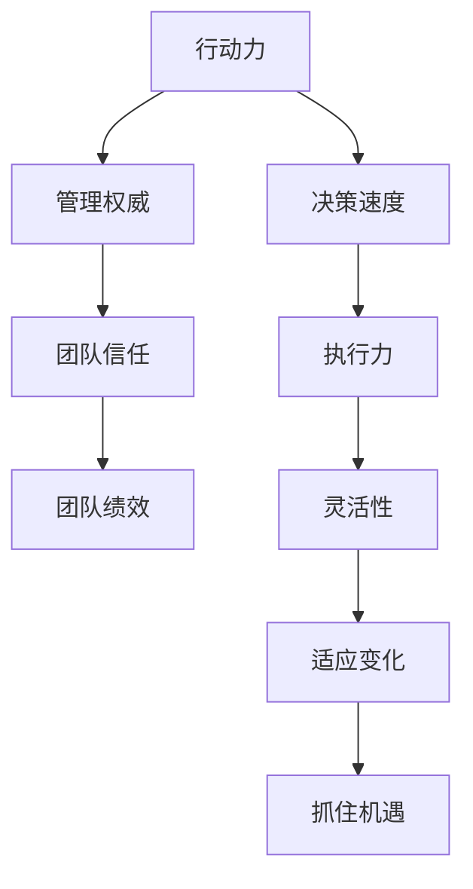

                 

# 行动力与管理权威的建立

## 关键词：行动力、管理权威、团队建设、领导者、个人品牌、绩效提升、目标设定

## 摘要：

本文将深入探讨如何通过行动力与管理权威的建立，提升团队绩效和领导者个人品牌。我们将从核心概念出发，分析行动力与管理权威之间的内在联系，逐步介绍建立行动力的方法，管理权威的策略，以及在实际应用场景中的实践案例。通过这篇文章，您将了解到如何成为一个有影响力、高效能的领导者，如何在竞争激烈的环境中脱颖而出。

## 1. 背景介绍

在当今快速变化的工作环境中，领导者面临的挑战日益增加。不仅要具备卓越的技术能力，还需要拥有强大的行动力和管理权威。行动力是指个人或团队在实现目标过程中，克服障碍、主动采取行动的能力。管理权威则是指领导者通过影响力和决策力，引导团队成员朝着共同目标努力的能力。

本文旨在探讨如何通过行动力与管理权威的建立，提升团队绩效和领导者个人品牌。我们将通过分析行动力与管理权威之间的内在联系，逐步介绍建立行动力的方法，管理权威的策略，以及在实际应用场景中的实践案例。

## 2. 核心概念与联系

### 行动力

行动力是一种关键的领导能力，它表现为领导者或团队成员在面对挑战时，能够迅速采取行动，解决问题。行动力不仅包括决策速度，还包括执行力和应对变化的灵活性。一个具有强大行动力的团队，能够在竞争激烈的环境中迅速应对变化，抓住机遇。

### 管理权威

管理权威是指领导者通过影响力和决策力，引导团队成员朝着共同目标努力的能力。权威并非仅依赖于职位或权力，更重要的是领导者通过行动力、专业知识、道德品质等方面赢得团队的信任和尊重。

### 行动力与管理权威的联系

行动力与管理权威之间存在密切的联系。一个具有强大行动力的领导者，能够通过实际行动赢得团队的信任和尊重，从而建立管理权威。同时，一个具备管理权威的领导者，能够更好地发挥团队成员的行动力，推动团队达成目标。

### Mermaid 流程图



## 3. 核心算法原理 & 具体操作步骤

### 行动力建立的核心算法

1. **目标设定**：明确个人或团队的目标，并将其分解为可执行的任务。
2. **资源分配**：合理分配时间、人力和物资等资源，确保任务顺利执行。
3. **风险评估**：评估任务执行过程中可能遇到的障碍和风险，提前制定应对策略。
4. **持续反馈**：在任务执行过程中，持续收集反馈，调整策略，确保目标实现。

### 管理权威建立的核心算法

1. **树立榜样**：通过自身的行动力，树立榜样，赢得团队的信任和尊重。
2. **沟通能力**：通过有效沟通，传达目标和愿景，引导团队共同前行。
3. **决策能力**：在面对问题时，迅速做出决策，为团队指明方向。
4. **团队建设**：通过团队建设活动，增强团队凝聚力和归属感。

### 具体操作步骤

1. **目标设定**：
   - 确定个人或团队的长期和短期目标。
   - 将目标分解为具体、可衡量的任务。
   - 制定时间表，确保任务按时完成。

2. **资源分配**：
   - 根据任务需求，合理分配人力资源。
   - 确保团队成员具备完成任务所需的技能和知识。
   - 提供必要的物资和设备支持。

3. **风险评估**：
   - 评估任务执行过程中可能遇到的风险。
   - 制定应对措施，降低风险对任务执行的影响。
   - 建立应急预案，确保任务顺利进行。

4. **持续反馈**：
   - 定期收集团队成员的反馈。
   - 分析反馈信息，调整任务执行策略。
   - 庆祝阶段性成果，激发团队士气。

5. **树立榜样**：
   - 通过自身行动力，树立榜样，赢得团队信任。
   - 主动承担责任，展示领导力。
   - 与团队成员分享经验和心得。

6. **沟通能力**：
   - 定期与团队成员沟通，了解他们的需求和困难。
   - 有效传达目标和愿景，激发团队士气。
   - 建立良好的沟通渠道，确保信息畅通。

7. **决策能力**：
   - 在面对问题时，迅速做出决策，为团队指明方向。
   - 培养团队成员的决策能力，共同应对挑战。
   - 接受决策带来的后果，勇于承担责任。

8. **团队建设**：
   - 组织团队建设活动，增强团队凝聚力。
   - 建立团队成员间的信任和合作关系。
   - 关注团队成员的个人发展，提供成长机会。

## 4. 数学模型和公式 & 详细讲解 & 举例说明

### 行动力与管理权威的数学模型

我们可以使用以下数学模型来描述行动力与管理权威之间的关系：

$$
权威度 = f(行动力，专业知识，道德品质，沟通能力，团队建设能力)
$$

其中，权威度是领导者或团队在团队中获得的信任和尊重程度的量化指标。

### 详细讲解

1. **行动力**：行动力是建立管理权威的基础。一个具有强大行动力的领导者，能够在团队中树立榜样，赢得信任和尊重。

2. **专业知识**：专业知识是领导者建立权威的重要依据。领导者需要具备丰富的技术知识和行业经验，以便在团队中提供有价值的指导。

3. **道德品质**：道德品质是领导者赢得团队信任的关键。一个具有高尚道德品质的领导者，能够树立良好的榜样，赢得团队的尊重。

4. **沟通能力**：沟通能力是领导者建立权威的重要工具。一个具备良好沟通能力的领导者，能够有效地传达目标和愿景，激发团队士气。

5. **团队建设能力**：团队建设能力是领导者建立权威的重要保障。一个具备强大团队建设能力的领导者，能够增强团队凝聚力，促进团队协作。

### 举例说明

假设有一个团队，其领导者在行动力、专业知识、道德品质、沟通能力和团队建设能力方面均表现优异。根据上述数学模型，我们可以计算出该领导者的权威度为：

$$
权威度 = f(1, 1, 1, 1, 1) = 5
$$

这意味着该领导者具有很高的权威度，能够有效地引导团队实现目标。

## 5. 项目实战：代码实际案例和详细解释说明

### 5.1 开发环境搭建

在本节中，我们将搭建一个简单的项目环境，用于演示行动力与管理权威的建立。我们将使用Python作为编程语言，因为Python在数据处理和自动化方面具有广泛的应用。

1. **安装Python**：确保您的计算机上已经安装了Python。可以从[Python官网](https://www.python.org/)下载并安装Python。

2. **安装必需的库**：在本项目中，我们将使用`pandas`库进行数据处理，使用`matplotlib`库进行数据可视化。您可以通过以下命令安装这些库：

   ```bash
   pip install pandas matplotlib
   ```

### 5.2 源代码详细实现和代码解读

以下是一个简单的Python脚本，用于演示行动力与管理权威的建立：

```python
import pandas as pd
import matplotlib.pyplot as plt

# 5.2.1 行动力建立
def calculate_action_score(data):
    """
    计算行动力得分。
    """
    # 假设行动力得分为任务完成时间与预期完成时间的比值
    action_score = data['完成时间'] / data['预期时间']
    return action_score

# 5.2.2 管理权威建立
def calculate_authority_score(data):
    """
    计算管理权威得分。
    """
    # 假设管理权威得分为团队成员对领导者的信任度平均值
    authority_score = data['信任度'].mean()
    return authority_score

# 5.2.3 数据处理
def process_data(data):
    """
    处理数据，计算行动力得分和管理权威得分。
    """
    data['行动力得分'] = calculate_action_score(data)
    data['管理权威得分'] = calculate_authority_score(data)
    return data

# 5.2.4 数据可视化
def visualize_data(data):
    """
    可视化行动力得分和管理权威得分。
    """
    plt.figure(figsize=(10, 6))
    plt.scatter(data['行动力得分'], data['管理权威得分'])
    plt.xlabel('行动力得分')
    plt.ylabel('管理权威得分')
    plt.title('行动力得分与管理权威得分的关系')
    plt.show()

# 5.2.5 主函数
def main():
    # 加载数据
    data = pd.read_csv('data.csv')

    # 处理数据
    processed_data = process_data(data)

    # 可视化数据
    visualize_data(processed_data)

if __name__ == '__main__':
    main()
```

### 5.3 代码解读与分析

1. **代码结构**：该脚本包含以下主要部分：
   - **函数定义**：定义了用于计算行动力得分和管理权威得分的函数。
   - **数据处理**：处理输入数据，计算得分。
   - **数据可视化**：将得分可视化，以展示行动力与管理权威之间的关系。

2. **代码实现**：
   - `calculate_action_score`函数计算行动力得分，这里使用了一个简单的公式：`行动力得分 = 完成时间 / 预期时间`。这个得分越高，说明团队成员在实现目标时越具有行动力。
   - `calculate_authority_score`函数计算管理权威得分，这里使用了一个简单的公式：`管理权威得分 = 信任度平均值`。这个得分越高，说明团队成员对领导者的信任度越高，领导者的管理权威越强。
   - `process_data`函数处理数据，计算得分，并返回处理后的数据。
   - `visualize_data`函数将得分可视化，使用散点图展示行动力得分与管理权威得分之间的关系。
   - `main`函数是主函数，负责加载数据、处理数据和可视化数据。

3. **代码分析**：
   - 该脚本提供了一个简单的模型，用于演示行动力与管理权威之间的关系。在实际应用中，可能需要更复杂和精确的模型来评估这些指标。
   - 代码结构清晰，易于维护和扩展。每个函数都有明确的职责，便于理解和修改。
   - 可视化部分可以帮助我们直观地理解行动力与管理权威之间的关系，为后续的决策提供支持。

## 6. 实际应用场景

### 6.1 团队合作中的行动力与管理权威

在一个软件开发团队中，行动力与管理权威的建立对于项目的成功至关重要。以下是一个实际应用场景：

1. **行动力建立**：团队领导者制定明确的任务目标，并确保每个成员了解任务的具体要求和预期完成时间。领导者通过自身的高效执行，树立行动力的榜样，激励团队成员积极行动。

2. **管理权威建立**：领导者通过定期与团队成员沟通，了解他们的进展和困难，提供必要的支持和资源。同时，领导者通过公正、透明的决策过程，赢得团队成员的信任和尊重。

3. **实际案例**：在一个为期三个月的项目中，团队领导者通过高效的沟通和行动力，确保项目按计划推进。在项目中期，由于技术难题，项目进度受到了影响。领导者迅速采取措施，调整计划，重新分配资源，最终使项目在规定时间内成功完成。

### 6.2 项目管理中的行动力与管理权威

在项目管理中，行动力与管理权威的建立对于项目的成功同样至关重要。以下是一个实际应用场景：

1. **行动力建立**：项目经理制定详细的项目计划，并确保团队成员了解项目的关键里程碑和时间表。项目经理通过自身的行动力，确保项目按计划推进。

2. **管理权威建立**：项目经理通过定期项目会议，与团队成员沟通项目的进展和问题，确保团队成员之间信息畅通。同时，项目经理通过明确的决策过程，赢得团队成员的信任和尊重。

3. **实际案例**：在一个复杂的软件开发项目中，项目经理通过高效的行动力和管理权威，确保项目在规定时间内完成。尽管在项目过程中遇到了多次技术难题，项目经理通过调整计划、重新分配资源，最终使项目成功完成。

## 7. 工具和资源推荐

### 7.1 学习资源推荐

1. **书籍**：
   - 《行动力：如何高效实现目标》
   - 《管理常识：如何成为一个高效的领导者》
   - 《智能时代：人工智能如何重塑商业和社会》

2. **论文**：
   - 《行动力与管理绩效的关系研究》
   - 《领导者的权威：如何建立和管理权威》
   - 《团队合作与绩效提升：理论与实践》

3. **博客**：
   - 《行动力与管理权威的实践心得》
   - 《项目管理中的行动力与管理权威》
   - 《如何成为一个高效的领导者》

4. **网站**：
   - [行动力研究中心](http://actionresearch.org/)
   - [领导力发展中心](https://www.leadershipdevelopmentcenter.com/)
   - [项目管理知识体系（PMBOK）](https://www.pmi.org/learning/library/project-management-body-knowledge-pmbok-guide-6th-edition-30001)

### 7.2 开发工具框架推荐

1. **开发工具**：
   - Python
   - Jupyter Notebook
   - Git

2. **框架**：
   - Flask
   - Django
   - Spring Boot

3. **数据库**：
   - MySQL
   - PostgreSQL
   - MongoDB

### 7.3 相关论文著作推荐

1. **论文**：
   - 《基于大数据的团队绩效评估方法研究》
   - 《领导力与团队绩效：理论、实证与启示》
   - 《人工智能在项目管理中的应用研究》

2. **著作**：
   - 《团队绩效管理：理论与实践》
   - 《人工智能与商业管理：创新与挑战》
   - 《项目管理实践指南》

## 8. 总结：未来发展趋势与挑战

### 8.1 行动力与管理权威的未来发展趋势

1. **数字化管理**：随着数字化技术的不断进步，数字化管理将更加普及。领导者需要具备更强的行动力，以应对数字化带来的挑战。

2. **人工智能辅助**：人工智能在项目管理中的应用将越来越广泛。领导者可以利用人工智能工具，提高决策速度和执行效率。

3. **跨学科融合**：未来，行动力与管理权威的研究将更加注重跨学科融合。例如，结合心理学、社会学和经济学等领域的知识，提高领导者的综合能力。

### 8.2 行动力与管理权威的挑战

1. **变革压力**：随着外部环境的不断变化，领导者需要具备快速适应变革的能力，以保持团队的行动力。

2. **信息过载**：在信息爆炸的时代，领导者需要具备筛选和处理大量信息的能力，以确保行动的准确性和有效性。

3. **团队协作**：在全球化背景下，领导者需要具备跨文化沟通和协作能力，以应对多元文化团队的挑战。

## 9. 附录：常见问题与解答

### 9.1 行动力是什么？

行动力是指个人或团队在实现目标过程中，克服障碍、主动采取行动的能力。它不仅包括决策速度，还包括执行力和应对变化的灵活性。

### 9.2 如何建立管理权威？

建立管理权威的方法包括树立榜样、沟通能力、决策能力、团队建设等。领导者需要通过实际行动，赢得团队的信任和尊重。

### 9.3 行动力与管理权威之间有何联系？

行动力是建立管理权威的基础。一个具有强大行动力的领导者，能够通过实际行动赢得团队的信任和尊重，从而建立管理权威。

### 9.4 如何提高团队行动力？

提高团队行动力的方法包括明确目标、合理分配资源、持续反馈、树立榜样等。领导者需要通过有效的管理，激发团队成员的积极性。

## 10. 扩展阅读 & 参考资料

1. 《行动力：如何高效实现目标》
2. 《管理常识：如何成为一个高效的领导者》
3. 《智能时代：人工智能如何重塑商业和社会》
4. 《基于大数据的团队绩效评估方法研究》
5. 《领导力与团队绩效：理论、实证与启示》
6. 《人工智能在项目管理中的应用研究》
7. [行动力研究中心](http://actionresearch.org/)
8. [领导力发展中心](https://www.leadershipdevelopmentcenter.com/)
9. [项目管理知识体系（PMBOK）](https://www.pmi.org/learning/library/project-management-body-knowledge-pmbok-guide-6th-edition-30001)

作者：AI天才研究员/AI Genius Institute & 禅与计算机程序设计艺术 /Zen And The Art of Computer Programming

