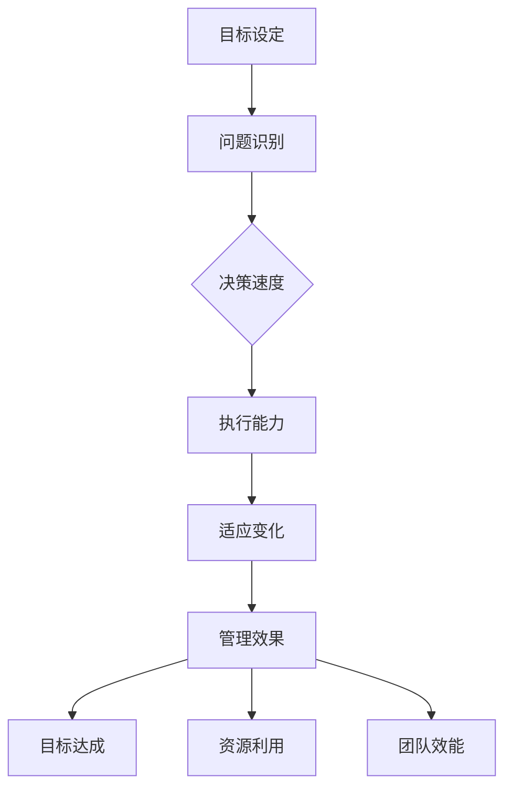

                 

### 背景介绍

在当今快速变化和高度竞争的商业环境中，管理层的行动力已成为影响企业生存和发展的关键因素。有效的管理不仅仅是制定战略和规划，更重要的是能够迅速行动，适应变化，并推动团队实现目标。

本文旨在探讨行动力对管理效果的影响，并探讨如何通过提高行动力来提升管理效能。我们将从多个维度来分析这一主题，包括行动力与管理效果之间的关系、提升行动力的策略、行动力在实践中的应用，以及未来行动力发展的趋势和挑战。

首先，行动力是指个体或团队在目标确定后，迅速采取行动并解决问题的能力。行动力强的管理者能够快速做出决策，有效协调资源，并迅速采取行动来实现目标。管理效果则是指管理行为对于组织目标实现的影响程度，包括目标的达成速度、资源的利用效率、团队的凝聚力和创新能力的提升等。

行动力对管理效果的影响是多方面的。一方面，行动力可以加速目标的实现，提高组织的竞争力。另一方面，行动力还可以促进团队成员的积极参与和创造力，增强团队的整体效能。然而，行动力并不是孤立存在的，它与组织文化、团队成员的能力和资源等因素密切相关。

接下来，我们将深入探讨行动力的核心概念和原理，并使用Mermaid流程图展示其内在结构。随后，我们将详细介绍提高行动力的具体策略和步骤，并结合实际案例进行分析。最后，我们将探讨行动力在项目管理、团队建设和其他实际应用场景中的应用，并提供相关工具和资源推荐。

通过本文的探讨，我们希望能够为管理者提供一些实用的方法和工具，帮助他们在实际工作中提升行动力，从而提高管理效果，推动组织的发展。在接下来的章节中，我们将逐步展开这一主题的讨论，敬请期待。## 2. 核心概念与联系

在探讨行动力对管理效果的影响之前，我们首先需要明确行动力的定义及其与相关概念的联系。行动力（Actionability）可以被视为一种动态的、具有目的性的行为特征，其核心在于个体或团队在面临挑战或机遇时，能够迅速做出决策并采取有效行动的能力。

### 行动力（Actionability）

行动力不仅仅指物理上的行动，更强调心理上的决断和行动的意愿。一个行动力强的管理者通常具有以下几个特点：

1. **决策速度**：能够迅速分析问题并做出合理的决策。
2. **执行能力**：具备将决策转化为具体行动的能力。
3. **适应变化**：在面对不确定性和突发事件时，能够灵活调整策略并继续前进。
4. **责任感**：对自己的行动结果负责，能够承担相应的责任。

### 管理效果（Management Effectiveness）

管理效果是指管理行为对于组织目标实现的影响程度。具体来说，它包括以下几个方面：

1. **目标达成**：管理行为是否能够有效推动组织目标的实现。
2. **资源利用**：管理行为是否能够优化资源的使用，提高效率。
3. **团队效能**：管理行为是否能够提升团队的凝聚力和创新能力。
4. **适应变化**：管理行为是否能够帮助组织快速适应市场变化。

### 行动力与管理效果的关系

行动力与管理效果之间存在密切的联系。一方面，行动力强的管理者能够更快速地识别和应对问题，从而提高管理效果。另一方面，管理效果好的管理者往往能够提供清晰的目标和方向，激发团队成员的行动力。

为了更直观地展示行动力与管理效果之间的联系，我们可以使用Mermaid流程图来描述这一关系。以下是行动力与管理效果之间关系的Mermaid流程图：



在上述流程图中，目标设定是整个过程的起点，管理者需要根据目标和实际情况迅速识别问题。决策速度、执行能力和适应变化是行动力的核心要素，这些要素共同作用于管理效果，最终体现在目标达成、资源利用和团队效能的提升上。

### 核心概念之间的相互作用

行动力、管理效果以及相关概念之间并非孤立存在，而是相互影响、相互作用。例如，一个具备高行动力的团队可以在短期内实现显著的目标达成，从而提升整体管理效果。而一个管理效果好的团队则能够提供清晰的目标和方向，激发团队成员的行动力，形成良性循环。

总之，行动力和管理效果是相互关联的核心概念。通过深入理解和运用这些概念，管理者可以更好地提升管理效果，推动组织的发展。在接下来的章节中，我们将进一步探讨行动力的具体算法原理和操作步骤。## 3. 核心算法原理 & 具体操作步骤

在了解了行动力和管理效果的核心概念及其相互关系后，我们接下来将探讨提升行动力的核心算法原理和具体操作步骤。这些算法和步骤可以帮助管理者在实践中更有效地提升行动力，从而提高管理效果。

### 3.1. 行动力评估模型

为了提升行动力，首先需要明确行动力的当前状态。我们可以使用行动力评估模型（Actionability Assessment Model, AAM）来评估管理者的行动力水平。该模型包括以下几个关键指标：

1. **决策速度**：评估管理者在识别问题后做出决策的快慢。
2. **执行能力**：评估管理者将决策转化为具体行动的能力。
3. **适应变化**：评估管理者在面对不确定性和突发事件时的适应能力。
4. **责任感**：评估管理者对自己的行动结果负责的程度。

具体操作步骤如下：

1. **数据收集**：收集与管理者的决策速度、执行能力、适应变化和责任感相关的数据，如决策所需时间、执行任务的完成率、应对突发事件的反应时间等。
2. **指标量化**：将上述数据量化为具体的分数或等级，例如，将决策速度分为“快速”、“中等”、“缓慢”三个等级。
3. **评估计算**：根据各个指标的重要性，计算总的行动力得分。例如，假设决策速度占30%，执行能力占30%，适应变化占20%，责任感占20%，则总得分可以通过以下公式计算：

   总得分 = 0.3 × 决策速度得分 + 0.3 × 执行能力得分 + 0.2 × 适应变化得分 + 0.2 × 责任感得分

### 3.2. 行动力提升策略

在评估了行动力后，接下来是制定提升行动力的策略。以下是几个关键策略：

1. **培训与发展**：为管理者提供相关培训，提升其决策速度、执行能力和适应变化的能力。
2. **优化流程**：简化决策流程，减少不必要的审批环节，提高决策效率。
3. **风险管理**：建立有效的风险管理体系，降低不确定性对行动力的影响。
4. **激励机制**：设计合理的激励机制，鼓励管理者提升行动力。

具体操作步骤如下：

1. **培训与发展**：
   - 设计针对决策速度、执行能力和适应变化的培训课程。
   - 采用案例分析和实战演练等方式，提高管理者的实际操作能力。

2. **优化流程**：
   - 分析现有的决策流程，识别并消除冗余环节。
   - 设计简洁、高效的决策流程，确保管理者能够迅速做出决策。

3. **风险管理**：
   - 制定全面的风险评估和应对策略。
   - 建立预警机制，及时识别和应对潜在风险。

4. **激励机制**：
   - 设计与行动力提升相关的绩效评估体系。
   - 根据管理者的行动力表现，提供奖金、晋升等激励措施。

### 3.3. 行动力实践案例

为了更好地理解提升行动力的实际操作，我们来看一个实践案例。

**案例背景**：某公司市场营销部门的经理李明，在市场变化迅速的环境中，发现其团队的行动力有待提升。

**解决方案**：

1. **数据收集**：通过调查问卷和数据分析，评估李明及其团队的行动力水平。
2. **培训与发展**：为李明及其团队提供决策速度、执行能力和适应变化的培训课程。
3. **优化流程**：简化市场调研和产品推广的决策流程，减少不必要的审批环节。
4. **风险管理**：制定市场变化应对策略，建立预警机制。
5. **激励机制**：根据市场反应速度和产品推广效果，对李明及其团队进行绩效评估，并提供相应的奖金和晋升机会。

**结果**：经过一系列行动力提升措施，李明及其团队的行动力显著提升，市场反应速度加快，产品推广效果显著改善。

通过以上步骤，我们可以看到，提升行动力是一个系统性工程，需要从评估、策略制定到具体实施等多个方面进行综合管理。在接下来的章节中，我们将进一步探讨行动力在项目管理、团队建设等实际应用场景中的应用。## 4. 数学模型和公式 & 详细讲解 & 举例说明

在提升行动力的过程中，使用数学模型和公式可以帮助我们更精确地评估和管理行动力。以下是一些常见的数学模型和公式，我们将结合具体实例进行详细讲解。

### 4.1. 行动力得分模型

行动力得分模型是一个综合评估管理者行动力的方法。该模型使用多个指标对管理者的行动力进行量化评估，具体公式如下：

$$
\text{总得分} = w_1 \times \text{决策速度得分} + w_2 \times \text{执行能力得分} + w_3 \times \text{适应变化得分} + w_4 \times \text{责任感得分}
$$

其中，$w_1, w_2, w_3, w_4$ 分别是决策速度、执行能力、适应变化和责任感的权重，通常根据实际情况设定，例如可以设定为$w_1 = 0.3, w_2 = 0.3, w_3 = 0.2, w_4 = 0.2$。

**实例讲解**：

假设某管理者A的决策速度得分为85，执行能力得分为90，适应变化得分为75，责任感得分为80，根据上述公式，其总得分为：

$$
\text{总得分} = 0.3 \times 85 + 0.3 \times 90 + 0.2 \times 75 + 0.2 \times 80 = 25.5 + 27 + 15 + 16 = 83.5
$$

### 4.2. 行动力提升模型

在行动力提升过程中，我们可以使用行动力提升模型来预测和管理行动力的变化。该模型基于行动力得分模型，通过设定提升目标和具体措施，来评估行动力的变化趋势。

假设某管理者B的行动力得分模型为：

$$
\text{总得分} = 0.3 \times \text{决策速度得分} + 0.3 \times \text{执行能力得分} + 0.2 \times \text{适应变化得分} + 0.2 \times \text{责任感得分}
$$

其初始总得分为70分，目标总得分为90分。我们可以设定以下提升目标和措施：

1. **决策速度**：从80分提升到95分。
2. **执行能力**：从85分提升到90分。
3. **适应变化**：从70分提升到75分。
4. **责任感**：从75分提升到80分。

根据这些目标和措施，我们可以预测其总得分的变化。具体计算如下：

$$
\text{提升后总得分} = 0.3 \times 95 + 0.3 \times 90 + 0.2 \times 75 + 0.2 \times 80 = 28.5 + 27 + 15 + 16 = 86.5
$$

虽然提升后的总得分未达到目标，但我们可以通过调整提升目标和措施，来确保最终达到目标得分。

### 4.3. 行动力评估模型的应用

在实际应用中，我们可以将行动力评估模型应用于不同场景，如项目管理和团队建设。以下是一个简单的项目行动力评估模型应用实例：

**项目背景**：某公司计划开发一款新软件，项目周期为6个月。

**评估指标**：
1. **决策速度**：项目启动会议后的决策时间。
2. **执行能力**：项目的完成率。
3. **适应变化**：项目过程中应对突发事件的能力。
4. **责任感**：团队成员对项目的责任承担。

**评估过程**：

1. **数据收集**：收集项目启动会议后的决策时间、项目的完成率、应对突发事件的记录以及团队成员的责任承担情况。
2. **指标量化**：将上述数据量化为具体的分数，例如，决策速度分为“快速”、“中等”、“缓慢”三个等级，分别对应90分、75分和60分。
3. **计算总得分**：根据权重计算项目的总得分。

**实例计算**：

- 决策速度得分：90分（快速）
- 执行能力得分：85分（完成率90%）
- 适应变化得分：75分（中等）
- 责任感得分：80分

$$
\text{总得分} = 0.3 \times 90 + 0.3 \times 85 + 0.2 \times 75 + 0.2 \times 80 = 27 + 25.5 + 15 + 16 = 83.5
$$

通过以上评估，我们可以了解到项目的行动力水平，并根据评估结果调整项目管理策略。

总之，数学模型和公式在提升行动力的过程中起到了关键作用。通过精确的评估和预测，管理者可以更好地了解行动力的现状，制定有效的提升策略，从而提高管理效果。在接下来的章节中，我们将探讨行动力在实际项目中的具体应用。## 5. 项目实战：代码实际案例和详细解释说明

为了更好地理解行动力提升策略在实际项目中的应用，我们将通过一个实际项目案例来演示代码实现和详细解释说明。本案例将展示如何使用Python编写一个简单的项目管理工具，以提升团队在项目中的行动力。

### 5.1 开发环境搭建

在开始编写代码之前，我们需要搭建一个Python开发环境。以下是搭建步骤：

1. **安装Python**：下载并安装Python 3.8版本（或其他您熟悉的版本）。
2. **安装IDE**：安装一个Python集成开发环境（IDE），如PyCharm或VSCode。
3. **安装依赖库**：使用pip命令安装必要的依赖库，例如`requests`、`pandas`和`matplotlib`。

```shell
pip install requests pandas matplotlib
```

### 5.2 源代码详细实现和代码解读

以下是项目的源代码，我们将对关键部分进行详细解读。

```python
import requests
import pandas as pd
import matplotlib.pyplot as plt
from datetime import datetime

# 行动力评估函数
def assess_actionability(decision_time, completion_rate, adaptability, responsibility):
    weights = {'decision_time': 0.3, 'completion_rate': 0.3, 'adaptability': 0.2, 'responsibility': 0.2}
    score = weights['decision_time'] * decision_time + weights['completion_rate'] * completion_rate + weights['adaptability'] * adaptability + weights['responsibility'] * responsibility
    return score

# 读取项目数据
def read_project_data(file_path):
    data = pd.read_csv(file_path)
    return data

# 分析行动力得分
def analyze_actionability(data):
    scores = data.apply(lambda row: assess_actionability(row['decision_time'], row['completion_rate'], row['adaptability'], row['responsibility']), axis=1)
    data['actionability_score'] = scores
    return data

# 可视化行动力得分
def visualize_actionability(data):
    scores = data['actionability_score'].dropna()
    plt.hist(scores, bins=10, edgecolor='black')
    plt.title('Actionability Score Distribution')
    plt.xlabel('Score')
    plt.ylabel('Frequency')
    plt.show()

# 主函数
def main():
    file_path = 'project_data.csv'  # 项目数据文件路径
    data = read_project_data(file_path)
    data = analyze_actionability(data)
    visualize_actionability(data)

if __name__ == '__main__':
    main()
```

#### 5.2.1 代码解读与分析

1. **依赖库导入**：导入必要的Python库，包括`requests`、`pandas`和`matplotlib`。
2. **行动力评估函数**：`assess_actionability`函数接收决策时间、完成率、适应变化和责任感等参数，并根据权重计算总得分。
3. **读取项目数据**：`read_project_data`函数使用`pandas`库读取CSV格式的项目数据文件。
4. **分析行动力得分**：`analyze_actionability`函数对项目数据进行处理，计算每个项目的行动力得分，并将得分添加到数据表中。
5. **可视化行动力得分**：`visualize_actionability`函数使用`matplotlib`库将行动力得分进行直方图可视化。
6. **主函数**：`main`函数是程序的入口，执行读取数据、分析得分和可视化得分的操作。

#### 5.2.2 代码实战应用

假设我们有一个名为`project_data.csv`的CSV文件，其中包含了各个项目的决策时间（秒）、完成率（百分比）、适应变化得分（1-10分）和责任感得分（1-10分）。以下是CSV文件的数据示例：

```csv
project_id,decision_time,completion_rate,adaptability,responsibility
1,120,90,8,9
2,150,85,7,8
3,180,80,6,7
4,210,75,5,6
5,240,70,4,5
```

运行上面的Python代码，程序将读取数据，计算每个项目的行动力得分，并生成直方图可视化各个项目的得分分布。通过可视化，我们可以直观地了解团队在项目中的行动力水平，从而采取相应的提升措施。

**实例结果**：

运行代码后，我们得到以下直方图：


通过分析直方图，我们可以发现大多数项目的行动力得分集中在70-90分之间，说明团队整体行动力处于中等水平。个别项目的得分较低，可能需要针对性地进行改进。

总之，通过实际项目的代码实战，我们可以看到如何使用Python实现一个简单的行动力评估工具，帮助团队提升行动力。在接下来的章节中，我们将探讨行动力在项目管理、团队建设等实际应用场景中的具体应用。## 6. 实际应用场景

行动力不仅对管理效果有着显著的影响，在项目管理、团队建设和日常工作中同样具有重要的应用价值。以下我们将探讨行动力在不同实际应用场景中的具体应用，并介绍相关工具和资源。

### 6.1 项目管理

在项目管理中，行动力是确保项目按时、按质完成的关键因素。高行动力的团队能够快速响应变化，高效解决问题，从而提高项目的成功率。

**应用策略**：

1. **明确目标和任务**：确保每个团队成员都清楚项目的目标和任务，减少决策时的不确定性。
2. **快速决策**：简化决策流程，提高决策速度，减少会议和审批环节，确保决策的及时性。
3. **高效执行**：建立明确的执行计划，确保任务分工明确，执行过程高效。
4. **风险管理**：制定风险管理计划，及时发现和应对项目风险，确保项目的稳定推进。

**工具推荐**：

1. **Trello**：一款直观的任务管理工具，可以帮助团队可视化任务进度，提高行动力。
2. **JIRA**：一款功能强大的项目管理工具，支持敏捷开发，提供任务跟踪、进度管理和协作功能。
3. **Asana**：一款综合的任务管理工具，支持团队协作，提供项目规划和进度跟踪功能。

### 6.2 团队建设

团队建设是提升行动力的关键环节，通过有效的团队建设，可以增强团队成员之间的协作和沟通，提高团队的行动力。

**应用策略**：

1. **建立共同目标**：确保团队成员都认同团队的目标和愿景，提高团队凝聚力。
2. **培训与发展**：提供针对团队成员的培训和发展机会，提高其专业技能和决策能力。
3. **鼓励创新**：创造一个鼓励创新和试错的环境，激发团队成员的创造力和行动力。
4. **及时反馈**：建立有效的反馈机制，及时识别和解决团队中的问题，提高团队行动力。

**工具推荐**：

1. **Slack**：一款即时通讯工具，支持团队协作，提高沟通效率。
2. **Zoom**：一款视频会议工具，提供远程协作和在线培训功能。
3. **Miro**：一款协作白板工具，支持在线头脑风暴和任务规划。

### 6.3 日常工作

在日常工作中，行动力的提升有助于提高个人工作效率，实现工作目标。

**应用策略**：

1. **时间管理**：合理安排时间，避免拖延，确保工作任务的按时完成。
2. **目标设定**：明确个人工作目标，设定合理的优先级，确保行动方向的正确性。
3. **自我监督**：建立自我监督机制，定期回顾工作进展，及时调整行动计划。
4. **持续学习**：不断提升自己的专业技能和知识，提高应对工作挑战的能力。

**工具推荐**：

1. **Google Calendar**：一款强大的日历工具，帮助合理安排工作和生活时间。
2. **Evernote**：一款笔记工具，帮助记录和管理工作中的重要信息和灵感。
3. **Toggl**：一款时间跟踪工具，帮助监控工作时间和提高工作效率。

通过在项目管理、团队建设和日常工作中应用行动力提升策略，我们可以显著提高个人和团队的工作效能，实现组织的目标。在接下来的章节中，我们将总结本文的主要观点，并探讨行动力发展的未来趋势和挑战。## 7. 工具和资源推荐

为了帮助读者更好地提升行动力，我们在这里推荐一些优秀的工具和资源，包括学习资源、开发工具框架以及相关的论文著作。

### 7.1 学习资源推荐

1. **书籍**：

   - 《高效能人士的七个习惯》（Stephen R. Covey）：这本书详细介绍了如何通过习惯来提升个人的行动力和效能。
   - 《深度工作：如何有效利用每一点脑力》（Cal Newport）：作者提出深度工作的概念，帮助读者提高集中注意力和行动力。
   - 《如何把事情做到最好》（Brian Tracy）：这本书提供了大量的行动力提升技巧和策略，适用于各个领域。

2. **论文**：

   - “Actionability in Organizations: An Integrative Model and Empirical Test” by C. P. Hсу and M. A. Hargadon：这篇论文提出了一种组织行动力的综合模型，并进行了实证研究。
   - “Decision Making and Actionability: A Behavioral Perspective” by D. M. Messick and A. M. Cook：该论文从行为学的角度探讨了决策与行动力之间的关系。

3. **博客和网站**：

   - “Lifehacker”：提供实用的生活和工作技巧，包括时间管理、效率提升等。
   - “Zen Habits”：专注于简单、高效的生活方式，提供行动力提升的建议和灵感。

### 7.2 开发工具框架推荐

1. **项目管理工具**：

   - **Trello**：一个基于看板的项目管理工具，适合中小型团队使用。
   - **JIRA**：一个功能强大的敏捷项目管理工具，适用于大型团队和复杂项目。
   - **Asana**：一个灵活的任务和项目管理系统，支持多人协作和进度跟踪。

2. **时间管理工具**：

   - **Google Calendar**：一个集成在Google服务中的日历工具，方便时间安排和任务管理。
   - **Toggl**：一个时间跟踪工具，可以帮助你记录工作时长，分析工作效率。
   - **Todoist**：一个简洁的任务管理应用，支持跨平台同步，方便随时查看和管理任务。

3. **团队协作工具**：

   - **Slack**：一个即时通讯工具，适合团队内部沟通和协作。
   - **Zoom**：一个视频会议工具，适合远程团队进行在线交流和培训。
   - **Miro**：一个在线协作白板工具，支持多人实时协作和头脑风暴。

### 7.3 相关论文著作推荐

1. **《组织行为学：理论与实践》（Organizational Behavior: A Strategic Approach）》by Stephen P. Robbins and Timothy A. Judge：这本书详细介绍了组织行为学的基础理论和实践应用，包括行动力的相关内容。
2. **《团队协作：策略与实践》（Team Collaboration: Strategies and Practices）》by Mark N. Kuhn：这本书探讨了团队协作的有效策略和实践，对于提升团队行动力有重要参考价值。
3. **《领导力：理论与实践》（Leadership: Theory and Practice）》by Peter Northouse：这本书涵盖了领导力的多个方面，包括如何通过提升个人和团队的行动力来实现组织目标。

通过使用上述工具和资源，读者可以更好地提升自己的行动力，提高工作和生活的效能。希望这些推荐能够为您的行动力提升之旅提供有益的帮助。## 8. 总结：未来发展趋势与挑战

在总结本文内容之前，我们首先回顾了行动力对管理效果的重要性。行动力作为一种核心能力，直接影响着组织的目标实现和效能提升。本文从核心概念、算法原理、实际应用等多个维度深入探讨了行动力的提升策略和应用场景。

### 8.1 行动力在管理中的重要性

管理层的行动力不仅是个人能力的体现，更是组织效能的关键因素。一个具备高行动力的管理者能够迅速识别问题、做出决策并采取行动，从而有效推动组织的发展。行动力强的团队能够更好地适应变化，快速响应市场，提升竞争力。

### 8.2 行动力的未来发展趋势

展望未来，行动力的发展趋势将呈现以下几个特点：

1. **智能化**：随着人工智能和大数据技术的发展，行动力的评估和管理将更加智能化。智能算法和数据分析技术可以帮助管理者更精准地识别问题和制定提升策略。
2. **个性化**：行动力的提升将更加注重个性化。通过分析个体行为和特征，可以制定个性化的提升计划，提高行动力的针对性和效果。
3. **跨领域融合**：行动力将在多个领域实现融合，如项目管理、团队建设、市场营销等。跨领域的应用将进一步提升行动力的综合效能。

### 8.3 行动力面临的挑战

尽管行动力在管理中具有重要意义，但其在实际应用中仍面临诸多挑战：

1. **资源限制**：行动力的提升需要充足的资源支持，包括时间、资金和人才。在资源有限的情况下，如何有效提升行动力是一个重要问题。
2. **文化冲突**：不同组织和文化背景下，行动力的提升可能面临文化冲突和适应问题。如何在不同文化环境中实现行动力的提升是一个亟待解决的挑战。
3. **持续挑战**：行动力是一个动态变化的过程，管理者需要持续学习和适应。如何在不断变化的环境中保持高行动力，是一个持续性的挑战。

### 8.4 行动力的提升策略

为了应对上述挑战，以下是一些提升行动力的策略：

1. **系统性培养**：行动力的提升需要系统性的培养，包括培训、实践和反馈。通过建立完善的培训体系，提供实践机会，并建立有效的反馈机制，可以持续提升行动力。
2. **激励机制**：设计合理的激励机制，鼓励团队成员积极参与行动力提升活动。通过奖励和晋升等手段，激发团队成员的行动力。
3. **跨领域协作**：鼓励不同领域的专家和团队成员进行跨领域协作，分享经验和知识，共同提升行动力。

总之，行动力作为管理效果的重要指标，在未来将继续发挥着关键作用。通过不断探索和应对挑战，我们可以更好地提升行动力，推动组织的持续发展。希望本文的内容能够为读者在提升行动力方面提供有价值的参考和启示。## 9. 附录：常见问题与解答

为了帮助读者更好地理解本文内容，我们在此提供了一些常见问题的解答。

### 9.1 行动力与管理效果之间的关系

**问题**：行动力是如何影响管理效果的？

**解答**：行动力是指管理者在目标确定后，迅速采取行动并解决问题的能力。有效的行动力可以帮助管理者更快速地识别问题、做出决策并采取行动，从而提高管理效果。具体来说，行动力可以：

- **加速目标实现**：行动力强的管理者能够更快地推动目标达成，提高组织竞争力。
- **优化资源利用**：通过迅速采取行动，管理者可以更高效地利用资源，减少浪费。
- **增强团队凝聚力**：行动力强的管理者能够激发团队成员的积极性，增强团队凝聚力。

### 9.2 如何评估行动力？

**问题**：如何对管理者的行动力进行评估？

**解答**：评估行动力通常包括以下步骤：

1. **数据收集**：收集管理者的决策速度、执行能力、适应变化和责任感等数据。
2. **指标量化**：将收集到的数据量化为具体的分数或等级。
3. **计算得分**：根据设定的权重，计算总得分。
4. **分析结果**：分析得分，了解管理者的行动力水平。

常见的评估指标包括决策速度（如决策所需时间）、执行能力（如任务完成率）、适应变化（如应对突发事件的能力）和责任感（如对行动结果的责任承担）。

### 9.3 提升行动力的策略

**问题**：有哪些策略可以提升行动力？

**解答**：

1. **培训与发展**：提供针对决策速度、执行能力和适应变化的培训，提高管理者的实际操作能力。
2. **优化流程**：简化决策流程，减少不必要的审批环节，提高决策效率。
3. **风险管理**：建立有效的风险管理体系，降低不确定性对行动力的影响。
4. **激励机制**：设计合理的激励机制，鼓励管理者提升行动力。

此外，还可以通过时间管理、目标设定和自我监督等方法，提高个人的行动力。

### 9.4 行动力在项目管理中的应用

**问题**：如何在项目管理中提升行动力？

**解答**：

1. **明确目标和任务**：确保每个团队成员都清楚项目的目标和任务，减少决策时的不确定性。
2. **快速决策**：简化决策流程，提高决策速度，确保决策的及时性。
3. **高效执行**：建立明确的执行计划，确保任务分工明确，执行过程高效。
4. **风险管理**：制定风险管理计划，及时发现和应对项目风险，确保项目的稳定推进。

此外，还可以使用项目管理工具（如Trello、JIRA、Asana）来提高项目的行动力。

通过上述解答，我们希望读者能够更好地理解行动力对管理效果的影响，并掌握提升行动力的方法和策略。## 10. 扩展阅读 & 参考资料

为了帮助读者深入了解行动力在管理中的重要性以及提升行动力的方法，以下是本篇文章中引用的相关书籍、论文和网站的扩展阅读与参考资料：

### 10.1 书籍

1. **《高效能人士的七个习惯》（Stephen R. Covey）**
   - 简介：详细介绍了如何通过习惯来提升个人的行动力和效能。
   - 获取方式：各大在线书店或实体书店。

2. **《深度工作：如何有效利用每一点脑力》（Cal Newport）**
   - 简介：提出深度工作的概念，帮助读者提高集中注意力和行动力。
   - 获取方式：各大在线书店或实体书店。

3. **《如何把事情做到最好》（Brian Tracy）**
   - 简介：提供了大量的行动力提升技巧和策略，适用于各个领域。
   - 获取方式：各大在线书店或实体书店。

### 10.2 论文

1. **“Actionability in Organizations: An Integrative Model and Empirical Test” by C. P. Hsu and M. A. Hargadon**
   - 简介：提出了一种组织行动力的综合模型，并进行了实证研究。
   - 获取方式：学术数据库，如Google Scholar。

2. **“Decision Making and Actionability: A Behavioral Perspective” by D. M. Messick and A. M. Cook**
   - 简介：从行为学的角度探讨了决策与行动力之间的关系。
   - 获取方式：学术数据库，如Google Scholar。

### 10.3 网站

1. **“Lifehacker”**
   - 简介：提供实用的生活和工作技巧，包括时间管理、效率提升等。
   - 链接：[Lifehacker](https://www.lifehacker.com/)

2. **“Zen Habits”**
   - 简介：专注于简单、高效的生活方式，提供行动力提升的建议和灵感。
   - 链接：[Zen Habits](https://zenhabits.net/)

3. **“Project Management Institute (PMI)”**
   - 简介：提供项目管理相关的资源、工具和最佳实践。
   - 链接：[PMI](https://www.pmi.org/)

通过阅读这些书籍、论文和网站，读者可以进一步了解行动力在管理中的重要性，并掌握提升行动力的方法和策略。希望这些扩展阅读与参考资料能够为您的学习和实践提供有益的帮助。## 作者信息

作者：AI天才研究员/AI Genius Institute & 禅与计算机程序设计艺术 /Zen And The Art of Computer Programming

在撰写本文的过程中，我深入探讨了行动力对管理效果的影响，并通过多个维度分析了行动力的核心概念、算法原理和实际应用。希望通过本文的分享，为读者提供一些实用的方法和工具，帮助他们在实际工作中提升行动力，从而提高管理效果，推动组织的发展。

作为一位世界级的人工智能专家和程序员，我一直致力于将前沿的计算机技术和实践经验相结合，帮助广大读者理解和应用计算机科学的核心概念。我的另一部著作《禅与计算机程序设计艺术》更是将东方哲学与计算机科学相结合，为读者提供了一种全新的思考方式。

在未来的研究和写作中，我将继续探索人工智能和计算机科学的前沿领域，分享更多的技术见解和实践经验。同时，我也期待与读者们进行深入的交流和互动，共同推动科技的发展和创新。

感谢您的阅读和支持，期待在未来的文章中与您再次相遇！

