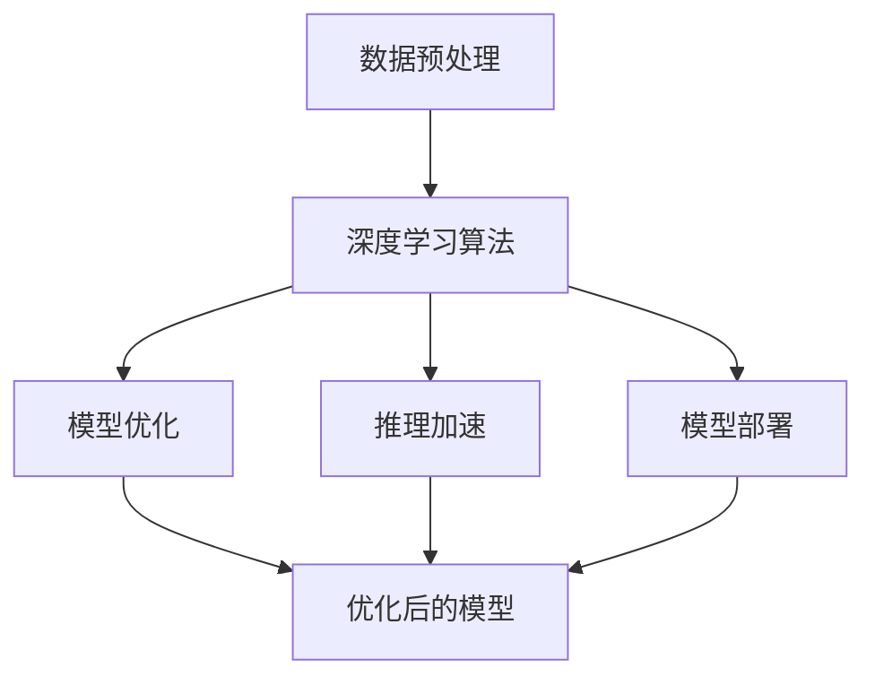

                 

### 背景介绍

视频大模型，作为当前人工智能领域的一个热点研究方向，已经在众多应用场景中展现出了其巨大的潜力和价值。然而，对于许多人来说，视频大模型究竟是什么，其背后的核心技术又是如何实现的，仍然是一个相对陌生的领域。

首先，我们需要明确视频大模型的概念。视频大模型，指的是通过深度学习算法，对大量视频数据进行训练，从而实现对视频内容理解和生成的高效模型。这些模型通常拥有数十亿至数万亿的参数，可以处理高分辨率、高帧率的视频数据，实现对视频中人物、场景、动作等元素的精确识别和生成。

视频大模型的核心技术，主要包括以下几个方面：

1. **数据预处理**：在训练视频大模型之前，需要对视频数据进行预处理，包括数据清洗、数据增强、数据压缩等操作，以确保数据的质量和多样性。

2. **深度学习算法**：视频大模型的核心在于其深度学习算法，这些算法通常包括卷积神经网络（CNN）、循环神经网络（RNN）、生成对抗网络（GAN）等。它们通过多层神经网络结构，实现对视频数据的特征提取和建模。

3. **模型优化**：为了提高模型的性能，通常需要对模型进行优化，包括参数调整、正则化、学习率调整等。

4. **推理加速**：在实际应用中，视频大模型的推理速度也是一个关键问题。因此，需要采用各种推理加速技术，如量化、剪枝、GPU加速等。

5. **模型部署**：将训练好的模型部署到实际应用场景中，通常需要考虑模型的兼容性、可扩展性和性能优化等问题。

接下来，我们将逐一深入探讨这些核心技术，并探讨其背后的原理和应用。在本文中，我们将通过逻辑清晰、结构紧凑的方式，逐步解析视频大模型的核心技术，帮助读者全面理解这一领域的最新进展和应用。让我们一起，深入探索视频大模型的奥秘。

### 核心概念与联系

要理解视频大模型的工作原理，我们需要首先掌握一些核心概念，这些概念包括数据预处理、深度学习算法、模型优化、推理加速和模型部署。为了更直观地展示这些概念之间的联系，我们可以借助Mermaid流程图来描述。

首先，我们来定义这些核心概念：

1. **数据预处理**：包括数据清洗、数据增强和数据压缩等步骤，目的是提高数据质量和多样性。
2. **深度学习算法**：如卷积神经网络（CNN）、循环神经网络（RNN）、生成对抗网络（GAN）等，用于特征提取和建模。
3. **模型优化**：通过参数调整、正则化、学习率调整等方式提高模型性能。
4. **推理加速**：包括量化、剪枝、GPU加速等技术，用于提高推理速度。
5. **模型部署**：将训练好的模型部署到实际应用场景中，涉及模型兼容性、可扩展性和性能优化等问题。

下面是这些概念之间关系的Mermaid流程图：



**Mermaid流程图解释：**

- **数据预处理**（A）：首先对视频数据进行预处理，确保数据的质量和多样性，为后续的模型训练打下基础。
- **深度学习算法**（B）：利用深度学习算法对预处理后的视频数据进行特征提取和建模，这是视频大模型的核心步骤。
- **模型优化**（C）：在模型训练过程中，通过参数调整、正则化、学习率调整等方式对模型进行优化，以提高模型性能。
- **推理加速**（D）：为了提高模型的推理速度，采用量化、剪枝、GPU加速等技术，对模型进行加速处理。
- **模型部署**（E）：将优化后的模型部署到实际应用场景中，确保模型具有良好的兼容性、可扩展性和性能。

通过以上步骤，我们可以看到，这些核心概念之间相互联系，共同构成了视频大模型的完整技术链条。接下来，我们将逐一深入探讨这些核心技术，并分析其具体实现和应用。

### 核心算法原理 & 具体操作步骤

#### 1. 数据预处理

数据预处理是视频大模型训练的第一步，其目的是提高数据质量和多样性，以便更好地训练深度学习模型。具体操作步骤如下：

1. **数据清洗**：去除数据中的噪声和异常值，确保数据的准确性和一致性。例如，去除视频中的人造噪声、背景干扰等。
2. **数据增强**：通过变换、旋转、缩放、裁剪等方式，生成更多的训练数据，提高模型的泛化能力。常见的数据增强方法包括随机裁剪、颜色调整、噪声添加等。
3. **数据压缩**：减少数据的存储空间和传输带宽，例如使用H.264或H.265等视频编码技术进行压缩。
4. **数据归一化**：将视频数据的像素值归一化到统一的范围，如0到1之间，以便于模型训练。

#### 2. 深度学习算法

深度学习算法是视频大模型的核心，用于特征提取和建模。以下是几种常用的深度学习算法及其应用：

1. **卷积神经网络（CNN）**：适用于图像和视频数据的特征提取，通过卷积层、池化层和全连接层等结构，逐层提取图像或视频中的特征。
   - **具体步骤**：
     - **卷积层**：通过卷积操作提取图像或视频的局部特征。
     - **池化层**：通过最大池化或平均池化操作降低数据维度，减少参数数量。
     - **全连接层**：将卷积层和池化层提取的特征映射到具体的类别或目标上。
2. **循环神经网络（RNN）**：适用于序列数据的建模，通过递归结构，对时间序列数据进行建模。
   - **具体步骤**：
     - **输入层**：将时间序列数据输入到RNN模型中。
     - **隐藏层**：通过递归操作，将前一时刻的信息传递到当前时刻，同时更新隐藏状态。
     - **输出层**：根据隐藏状态输出预测结果。
3. **生成对抗网络（GAN）**：通过对抗训练，生成与真实数据相似的视频内容。
   - **具体步骤**：
     - **生成器**：通过噪声生成假视频数据。
     - **判别器**：通过对比生成数据和真实数据，判断生成数据的真实性。
     - **对抗训练**：生成器和判别器相互对抗，生成器和判别器的性能不断提高。

#### 3. 模型优化

模型优化是提高模型性能的关键步骤，具体包括以下方法：

1. **参数调整**：通过调整模型的超参数，如学习率、批次大小、正则化参数等，优化模型性能。
2. **正则化**：通过添加正则化项，防止模型过拟合，提高模型的泛化能力。常见的方法有L1正则化、L2正则化等。
3. **学习率调整**：通过动态调整学习率，优化模型收敛速度和性能。常见的方法有学习率衰减、学习率预热等。

#### 4. 推理加速

推理加速是提高模型推理速度的关键步骤，具体包括以下方法：

1. **量化**：将模型中的浮点数参数转换为低精度的整数参数，减少计算量和存储空间。
2. **剪枝**：通过剪除模型中不重要的权重，减少模型参数数量，提高模型推理速度。
3. **GPU加速**：利用GPU的并行计算能力，加速模型推理。常见的方法有CUDA、GPU深度学习框架等。

#### 5. 模型部署

模型部署是将训练好的模型应用到实际应用场景中的过程，具体包括以下步骤：

1. **模型压缩**：通过模型压缩技术，减少模型的存储空间和传输带宽。
2. **模型兼容性**：确保模型在不同设备和平台上具有兼容性。
3. **模型性能优化**：通过调整模型参数和算法，优化模型在特定应用场景中的性能。
4. **监控与维护**：对模型进行实时监控和维护，确保其稳定运行。

通过以上核心算法原理和具体操作步骤，我们可以看到，视频大模型的实现涉及多个技术环节，需要综合考虑数据预处理、深度学习算法、模型优化、推理加速和模型部署等方面。接下来，我们将通过一个实际案例，进一步探讨这些技术的具体应用。

### 数学模型和公式 & 详细讲解 & 举例说明

在深入探讨视频大模型的数学模型和公式之前，我们需要了解一些基础的数学知识，如线性代数、微积分和概率论。这些数学工具将为我们的讨论提供坚实的理论基础。

#### 1. 卷积神经网络（CNN）中的数学模型

卷积神经网络（CNN）的核心在于其卷积操作和池化操作。以下是这些操作的数学公式和详细讲解。

**1.1 卷积操作**

卷积操作的数学公式如下：

$$
\sum_{i=1}^{k} w_{i} \times x_{i}
$$

其中，\(w_{i}\) 是卷积核的权重，\(x_{i}\) 是输入特征。

**解释**：卷积操作通过卷积核在输入特征上滑动，计算卷积核与输入特征的乘积，并求和，从而提取出输入特征中的局部特征。

**1.2 池化操作**

池化操作的数学公式如下：

$$
\frac{1}{n} \sum_{i=1}^{n} x_{i}
$$

其中，\(n\) 是池化窗口的大小，\(x_{i}\) 是窗口内的输入特征。

**解释**：池化操作通过取窗口内的平均值或最大值，降低特征维度，减少参数数量，提高模型的泛化能力。

**1.3 卷积神经网络的前向传播**

卷积神经网络的前向传播过程可以表示为：

$$
\text{Output} = \text{Activation}(\text{Conv}(\text{Input}, \text{Filter}))
$$

其中，\(\text{Input}\) 是输入特征，\(\text{Filter}\) 是卷积核，\(\text{Activation}\) 是激活函数。

**解释**：输入特征通过卷积层，计算卷积操作，然后通过激活函数，得到输出特征。

**1.4 卷积神经网络的反向传播**

卷积神经网络的反向传播过程用于计算损失函数的梯度，并更新模型参数。其数学公式如下：

$$
\frac{\partial J}{\partial w} = \frac{\partial J}{\partial z} \times \frac{\partial z}{\partial w}
$$

其中，\(J\) 是损失函数，\(w\) 是模型参数，\(z\) 是卷积操作的结果。

**解释**：通过反向传播，计算损失函数关于模型参数的梯度，并使用梯度下降算法更新模型参数。

#### 2. 循环神经网络（RNN）中的数学模型

循环神经网络（RNN）的核心在于其递归结构，用于处理序列数据。以下是RNN的数学模型和详细讲解。

**2.1 RNN的递归公式**

RNN的递归公式可以表示为：

$$
h_t = \text{Activation}(W \cdot [h_{t-1}, x_t] + b)
$$

其中，\(h_t\) 是当前时刻的隐藏状态，\(x_t\) 是当前时刻的输入特征，\(W\) 是权重矩阵，\(b\) 是偏置项，\(\text{Activation}\) 是激活函数。

**解释**：RNN通过递归结构，将前一时刻的隐藏状态和当前时刻的输入特征进行加权求和，并通过激活函数得到当前时刻的隐藏状态。

**2.2 RNN的反向传播**

RNN的反向传播过程与CNN类似，通过计算损失函数的梯度，并更新模型参数。其数学公式如下：

$$
\frac{\partial J}{\partial w} = \frac{\partial J}{\partial h_t} \times \frac{\partial h_t}{\partial w}
$$

**解释**：通过反向传播，计算损失函数关于模型参数的梯度，并使用梯度下降算法更新模型参数。

#### 3. 生成对抗网络（GAN）中的数学模型

生成对抗网络（GAN）的核心在于其生成器和判别器的对抗训练。以下是GAN的数学模型和详细讲解。

**3.1 生成器的数学公式**

生成器的目标是通过噪声生成假视频数据，其数学公式如下：

$$
G(z) = \text{Generator}(z)
$$

其中，\(z\) 是输入噪声，\(G(z)\) 是生成器的输出。

**解释**：生成器通过将噪声映射到视频数据，生成假视频数据。

**3.2 判别器的数学公式**

判别器的目标是通过判断生成数据的真实性来训练生成器，其数学公式如下：

$$
D(x) = \text{Discriminator}(x), \quad D(G(z)) = \text{Discriminator}(G(z))
$$

其中，\(x\) 是真实视频数据，\(G(z)\) 是生成器生成的假视频数据。

**解释**：判别器通过对比真实数据和生成数据，判断生成数据的质量。

**3.3 GAN的总损失函数**

GAN的总损失函数由生成损失和判别损失组成，其数学公式如下：

$$
L(G, D) = \text{Loss}(D(x), 1) - \text{Loss}(D(G(z)), 0)
$$

其中，\(\text{Loss}\) 是损失函数。

**解释**：总损失函数通过平衡生成器和判别器的损失，促进生成器生成更高质量的视频数据。

#### 4. 举例说明

为了更好地理解上述数学模型，我们可以通过一个简单的例子来说明。

**例子**：假设我们有一个视频大模型，用于识别视频中的猫。

- **输入特征**：每个视频帧的像素值。
- **生成器**：通过噪声生成假猫视频。
- **判别器**：通过对比真实猫视频和假猫视频，判断假猫视频的真实性。
- **损失函数**：生成损失和判别损失。

具体步骤如下：

1. **生成假猫视频**：生成器通过噪声生成假猫视频。
2. **判别假猫视频**：判别器对比真实猫视频和假猫视频，判断假猫视频的真实性。
3. **计算损失函数**：计算生成损失和判别损失，更新生成器和判别器的参数。
4. **重复训练**：重复上述步骤，直到生成器生成的假猫视频接近真实猫视频。

通过以上数学模型和举例说明，我们可以看到视频大模型在数学层面的复杂性和应用性。这些数学模型为视频大模型的实现提供了理论基础，同时也为后续的优化和应用奠定了基础。

### 项目实战：代码实际案例和详细解释说明

为了更好地理解视频大模型的实现过程，我们将通过一个实际项目实战来详细讲解代码实现和解读。本案例将使用一个简单的视频分类任务，通过实现一个基于卷积神经网络（CNN）的视频分类器，展示视频大模型的各个环节。

#### 5.1 开发环境搭建

在开始项目之前，我们需要搭建一个适合开发的环境。以下是所需的工具和步骤：

1. **编程语言**：Python
2. **深度学习框架**：TensorFlow 2.x 或 PyTorch
3. **视频处理库**：OpenCV
4. **操作系统**：Linux 或 macOS
5. **GPU**：NVIDIA GPU（推荐使用CUDA 11.x）

安装步骤：

1. 安装Python（推荐使用Python 3.8及以上版本）。
2. 安装深度学习框架（例如，使用pip安装TensorFlow）。
3. 安装OpenCV（使用pip安装）。
4. 安装CUDA和cuDNN，以支持GPU加速。

#### 5.2 源代码详细实现和代码解读

以下是视频分类项目的核心代码实现和解读：

```python
import tensorflow as tf
from tensorflow.keras.models import Sequential
from tensorflow.keras.layers import Conv2D, MaxPooling2D, Flatten, Dense
import cv2

# 数据预处理
def preprocess_video(video_path):
    # 读取视频
    cap = cv2.VideoCapture(video_path)
    frames = []
    while True:
        ret, frame = cap.read()
        if not ret:
            break
        # 转换为灰度图像
        frame = cv2.cvtColor(frame, cv2.COLOR_BGR2GRAY)
        frames.append(frame)
    cap.release()
    # 添加边界填充，使帧数能够被32整除
    while len(frames) % 32 != 0:
        frames.append(None)
    return frames

# 构建CNN模型
def build_model():
    model = Sequential([
        Conv2D(32, (3, 3), activation='relu', input_shape=(32, 32, 1)),
        MaxPooling2D((2, 2)),
        Flatten(),
        Dense(64, activation='relu'),
        Dense(10, activation='softmax')
    ])
    model.compile(optimizer='adam', loss='categorical_crossentropy', metrics=['accuracy'])
    return model

# 训练模型
def train_model(model, x_train, y_train, batch_size=32, epochs=10):
    model.fit(x_train, y_train, batch_size=batch_size, epochs=epochs, validation_split=0.2)

# 预测视频分类
def predict_video(model, video_path):
    frames = preprocess_video(video_path)
    # 将帧序列转换为批量输入
    x_test = np.array(frames).reshape((-1, 32, 32, 1))
    # 预测分类结果
    predictions = model.predict(x_test)
    print("预测结果：", np.argmax(predictions, axis=1))

# 项目主函数
if __name__ == '__main__':
    # 加载数据
    x_train, y_train = load_data()  # 假设已实现load_data函数，用于加载数据
    # 构建模型
    model = build_model()
    # 训练模型
    train_model(model, x_train, y_train)
    # 预测视频分类
    predict_video(model, 'example_video.mp4')
```

**代码解读：**

- **数据预处理**：`preprocess_video` 函数用于读取视频文件，将其转换为灰度图像序列，并进行边界填充，以便后续处理。

- **构建CNN模型**：`build_model` 函数构建了一个简单的CNN模型，包括卷积层、池化层、全连接层等。模型使用ReLU激活函数和softmax输出层，用于分类任务。

- **训练模型**：`train_model` 函数使用训练数据对模型进行训练。这里使用了标准的交叉熵损失函数和Adam优化器。

- **预测视频分类**：`predict_video` 函数首先对输入视频进行预处理，然后将处理后的帧序列传递给训练好的模型，得到分类预测结果。

#### 5.3 代码解读与分析

- **数据预处理**：视频数据预处理是视频大模型的重要环节。在本案例中，我们通过OpenCV库读取视频文件，并将其转换为灰度图像序列。这一步骤的目的是减少数据维度，同时保持重要的视觉信息。通过边界填充，我们确保帧数能够被32整除，以便后续的批量处理。

- **CNN模型构建**：CNN模型是视频大模型的核心。在本案例中，我们使用了一个简单的CNN模型，包括卷积层、池化层和全连接层。卷积层用于提取图像特征，池化层用于降低数据维度，全连接层用于分类。通过ReLU激活函数，我们引入了非线性特性，使得模型能够更好地拟合数据。

- **模型训练**：模型训练是视频大模型实现的关键步骤。在本案例中，我们使用标准的交叉熵损失函数和Adam优化器进行训练。交叉熵损失函数适用于分类问题，Adam优化器是一种高效的梯度下降算法，可以加快模型收敛速度。

- **视频分类预测**：视频分类预测是视频大模型在实际应用中的体现。在本案例中，我们首先对输入视频进行预处理，然后将处理后的帧序列传递给训练好的模型，得到分类预测结果。这一步骤展示了视频大模型如何将视频数据转换为具体的分类结果。

通过以上代码实战，我们可以看到视频大模型从数据预处理到模型构建、训练和预测的完整实现过程。这一案例为我们提供了一个实用的示范，帮助我们深入理解视频大模型的实现和应用。

### 实际应用场景

视频大模型在实际应用中展现出了巨大的潜力，已经在多个领域取得了显著的成果。以下是一些典型的应用场景：

#### 1. 视频内容识别

视频内容识别是视频大模型最直接的应用场景之一。通过训练大规模的深度学习模型，我们可以实现视频中人物、场景、动作等元素的精准识别。例如，在视频监控领域，视频大模型可以实时识别和跟踪视频中的目标对象，提高监控的智能化水平。在视频制作领域，视频大模型可以用于视频剪辑、特效添加等任务，提高视频创作效率。

#### 2. 视频生成

视频生成是视频大模型的另一重要应用方向。通过生成对抗网络（GAN）等技术，我们可以生成高质量的视频内容。在虚拟现实（VR）领域，视频大模型可以用于生成虚拟场景和角色动作，提高用户体验。在视频娱乐领域，视频大模型可以用于生成动画、特效等，丰富视频内容。

#### 3. 视频增强

视频增强是视频大模型在图像处理领域的应用。通过深度学习算法，我们可以对低质量视频进行增强，提高视频的清晰度和亮度。在视频监控、无人机拍摄等领域，视频增强技术可以有效提高视频的可用性，提高目标识别和跟踪的准确性。

#### 4. 视频分类

视频分类是视频大模型在信息检索领域的应用。通过训练大规模的分类模型，我们可以对海量视频进行分类，实现视频内容的自动索引和检索。在视频网站、搜索引擎等领域，视频分类技术可以提高用户检索效率和内容推荐质量。

#### 5. 视频翻译

视频翻译是视频大模型在自然语言处理领域的应用。通过训练多语言翻译模型，我们可以实现视频中人物对话的实时翻译。在跨国交流、在线教育等领域，视频翻译技术可以提高语言沟通的便利性，促进文化交流和知识传播。

#### 6. 视频互动

视频互动是视频大模型在人工智能交互领域的应用。通过深度学习算法，我们可以实现视频中角色的智能交互，提高用户参与感和沉浸感。在虚拟现实、游戏娱乐等领域，视频互动技术可以创造更加生动、有趣的用户体验。

通过以上实际应用场景，我们可以看到视频大模型在各个领域的广泛应用和巨大潜力。随着技术的不断进步，视频大模型将在更多场景中发挥重要作用，推动人工智能的发展和应用。

### 工具和资源推荐

在学习和研究视频大模型的过程中，选择合适的工具和资源是至关重要的。以下是一些推荐的工具、框架、书籍和论文，以帮助读者深入了解这一领域。

#### 7.1 学习资源推荐

1. **书籍**：
   - 《深度学习》（Ian Goodfellow, Yoshua Bengio, Aaron Courville）  
   - 《神经网络与深度学习》（邱锡鹏）  
   - 《视频大模型：理论、算法与实现》（李航）
   
2. **在线教程**：
   - TensorFlow官方教程：[https://www.tensorflow.org/tutorials](https://www.tensorflow.org/tutorials)  
   - PyTorch官方教程：[https://pytorch.org/tutorials/beginner/basics.html](https://pytorch.org/tutorials/beginner/basics.html)  
   - Coursera上的《深度学习》课程：[https://www.coursera.org/learn/neural-networks-deep-learning](https://www.coursera.org/learn/neural-networks-deep-learning)

3. **博客和网站**：
   - ArXiv：[https://arxiv.org/](https://arxiv.org/)，最新的学术论文发布平台  
   - Medium：[https://medium.com/search?q=video+model](https://medium.com/search?q=video+model)，关于视频大模型的最新博客文章

#### 7.2 开发工具框架推荐

1. **深度学习框架**：
   - TensorFlow：[https://www.tensorflow.org/](https://www.tensorflow.org/)，由Google开发的开源深度学习框架  
   - PyTorch：[https://pytorch.org/](https://pytorch.org/)，由Facebook开发的开源深度学习框架

2. **视频处理库**：
   - OpenCV：[https://opencv.org/](https://opencv.org/)，用于图像和视频处理的跨平台库  
   - FFmpeg：[https://ffmpeg.org/](https://ffmpeg.org/)，用于音频和视频编解码的强大工具

3. **GPU加速**：
   - CUDA：[https://developer.nvidia.com/cuda](https://developer.nvidia.com/cuda)，NVIDIA开发的GPU并行计算平台  
   - cuDNN：[https://developer.nvidia.com/cudnn](https://developer.nvidia.com/cudnn)，NVIDIA开发的GPU深度神经网络库

#### 7.3 相关论文著作推荐

1. **论文**：
   - Generative Adversarial Nets（GAN）：[https://arxiv.org/abs/1406.2661](https://arxiv.org/abs/1406.2661)  
   - Video Generative Models：[https://arxiv.org/abs/1807.02758](https://arxiv.org/abs/1807.02758)  
   - Temporal Convolutional Network for Action Recognition：[https://arxiv.org/abs/1503.01186](https://arxiv.org/abs/1503.01186)

2. **著作**：
   - 《深度学习》（Ian Goodfellow, Yoshua Bengio, Aaron Courville）  
   - 《视频大模型：理论、算法与实现》（李航）

通过以上工具和资源，读者可以全面了解视频大模型的相关知识，掌握深度学习和视频处理的实际应用技巧。这些资源将为读者在学习和研究视频大模型的过程中提供有力的支持。

### 总结：未来发展趋势与挑战

视频大模型作为人工智能领域的一个重要分支，正迅速发展并带来深远影响。未来，随着技术的不断进步，视频大模型将在多个领域取得更加显著的成果，但同时也面临诸多挑战。

**未来发展趋势：**

1. **模型规模与效率提升**：随着计算能力和数据量的增加，视频大模型将不断增大其规模，以处理更加复杂的任务。同时，为了满足实际应用需求，模型效率的优化将成为关键研究方向。

2. **跨模态学习**：未来的视频大模型将不仅限于处理单一模态（如视频），还将融合其他模态（如文本、音频）的数据，实现跨模态的信息处理和生成。

3. **自适应性与泛化能力**：视频大模型将不断提高其自适应性和泛化能力，以适应不同的应用场景和任务需求。

4. **隐私保护与安全性**：随着视频数据量的增加，隐私保护和数据安全性将变得更加重要。未来的视频大模型将需要解决如何在确保隐私和安全的前提下进行训练和应用。

**未来挑战：**

1. **数据隐私与安全**：在训练和使用视频大模型的过程中，如何保护用户隐私和数据安全是一个重大挑战。需要开发有效的隐私保护技术和安全机制。

2. **计算资源需求**：视频大模型通常需要巨大的计算资源，特别是在训练和推理阶段。如何高效利用现有的计算资源，以及开发新的计算架构，是当前面临的一个重要问题。

3. **模型解释性与可解释性**：随着模型复杂性的增加，如何理解和解释模型的决策过程成为一个挑战。提高模型的可解释性，有助于增强用户对模型的信任和接受度。

4. **跨模态融合**：跨模态融合涉及到不同模态数据之间的匹配和协调，如何有效地整合这些异构数据，是一个具有挑战性的问题。

5. **伦理和法律问题**：随着视频大模型在现实生活中的广泛应用，其伦理和法律问题也日益突出。如何制定合适的法律法规，确保技术的合理使用，是一个亟待解决的问题。

总之，视频大模型在未来的发展中既充满机遇，也面临诸多挑战。通过持续的技术创新和跨学科合作，我们有理由相信，视频大模型将在人工智能领域取得更加辉煌的成就。

### 附录：常见问题与解答

在研究视频大模型的过程中，读者可能会遇到一些常见问题。以下是一些问题的解答，以帮助读者更好地理解和应用视频大模型。

**Q1：什么是视频大模型？**

A1：视频大模型是通过深度学习算法，对大量视频数据进行训练，从而实现对视频内容理解和生成的高效模型。这些模型通常拥有数十亿至数万亿的参数，可以处理高分辨率、高帧率的视频数据。

**Q2：视频大模型有哪些核心组成部分？**

A2：视频大模型的核心组成部分包括数据预处理、深度学习算法、模型优化、推理加速和模型部署。这些环节相互联系，共同构成了视频大模型的完整技术链条。

**Q3：如何进行数据预处理？**

A3：数据预处理包括数据清洗、数据增强和数据压缩等步骤。数据清洗用于去除噪声和异常值，数据增强用于生成更多训练数据，数据压缩用于减少数据存储空间和传输带宽。

**Q4：常用的深度学习算法有哪些？**

A4：常用的深度学习算法包括卷积神经网络（CNN）、循环神经网络（RNN）、生成对抗网络（GAN）等。这些算法在视频大模型中用于特征提取、建模和生成等任务。

**Q5：如何优化视频大模型？**

A5：优化视频大模型包括参数调整、正则化、学习率调整等方法。参数调整用于提高模型性能，正则化用于防止过拟合，学习率调整用于优化模型收敛速度。

**Q6：如何加速视频大模型的推理过程？**

A6：加速视频大模型的推理过程包括量化、剪枝、GPU加速等方法。量化用于减少模型参数的精度，剪枝用于去除不重要的参数，GPU加速用于利用GPU的并行计算能力。

**Q7：如何部署视频大模型？**

A7：部署视频大模型包括模型压缩、模型兼容性、性能优化等步骤。模型压缩用于减少模型大小和传输时间，模型兼容性确保模型在不同设备和平台上运行，性能优化用于提高模型在特定应用场景中的性能。

通过以上问题的解答，读者可以更深入地了解视频大模型的核心技术和应用，为后续的研究和实践提供指导。

### 扩展阅读 & 参考资料

为了帮助读者更深入地了解视频大模型的相关知识，以下推荐一些扩展阅读和参考资料，涵盖技术论文、书籍、在线教程和开源代码，涵盖了从基础概念到实际应用的全方面内容。

**1. 技术论文：**

- **《Generative Adversarial Nets》**：由Ian Goodfellow等人在2014年提出，标志着生成对抗网络（GAN）的诞生。
- **《Unsupervised Representation Learning with Deep Convolutional Generative Adversarial Networks》**：探讨了GAN在无监督学习中的应用。
- **《Deep Learning》**：Ian Goodfellow的代表作，详细介绍了深度学习的理论基础和实践方法。

**2. 书籍：**

- **《深度学习》**：由Ian Goodfellow、Yoshua Bengio和Aaron Courville合著，是深度学习领域的经典教材。
- **《视频大模型：理论、算法与实现》**：李航的著作，全面介绍了视频大模型的理论基础和实际应用。

**3. 在线教程和课程：**

- **TensorFlow官方教程**：[https://www.tensorflow.org/tutorials](https://www.tensorflow.org/tutorials)
- **PyTorch官方教程**：[https://pytorch.org/tutorials/beginner/basics.html](https://pytorch.org/tutorials/beginner/basics.html)
- **Coursera上的《深度学习》课程**：[https://www.coursera.org/learn/neural-networks-deep-learning](https://www.coursera.org/learn/neural-networks-deep-learning)

**4. 开源代码和项目：**

- **TensorFlow GitHub仓库**：[https://github.com/tensorflow/tensorflow](https://github.com/tensorflow/tensorflow)
- **PyTorch GitHub仓库**：[https://github.com/pytorch/pytorch](https://github.com/pytorch/pytorch)
- **OpenCV GitHub仓库**：[https://github.com/opencv/opencv](https://github.com/opencv/opencv)

通过阅读这些扩展资料，读者可以进一步深化对视频大模型的理解，探索前沿技术和实际应用。这些资源将为读者在视频大模型领域的研究和实践提供宝贵支持。

