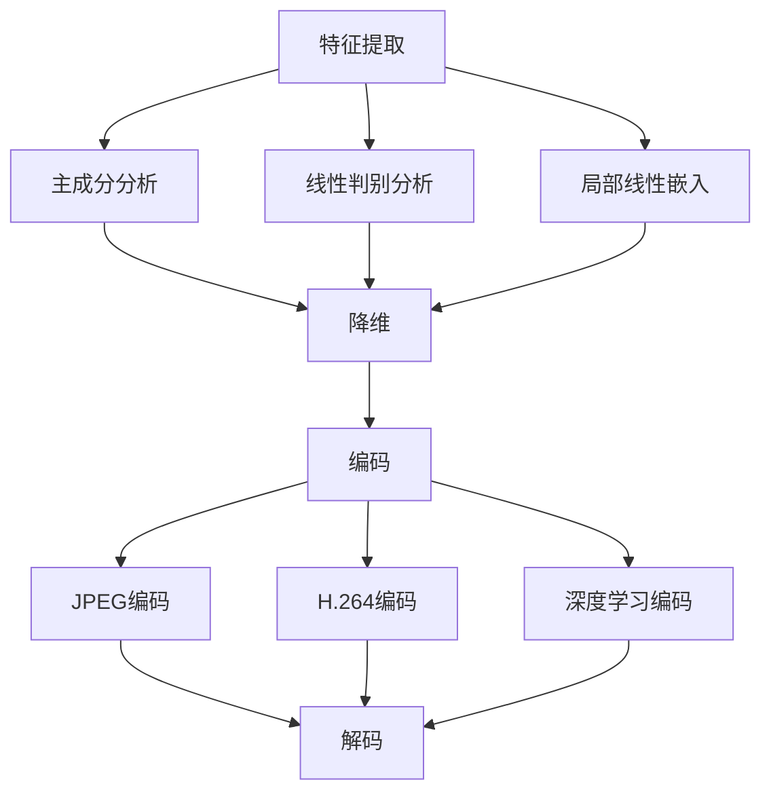

                 

### 背景介绍

视频数据作为现代信息传递和娱乐的重要形式，其数据量庞大且持续增长。随着互联网和移动设备的普及，高效的视频数据处理技术变得至关重要。视频数据的低维压缩技术（Low-Dimensional Video Compression）正是为了应对这一需求而发展起来的。它通过将高维视频数据映射到低维空间中，从而大幅度降低数据存储和传输的需求，同时保持视频内容的主观质量。

视频数据低维压缩的重要性主要体现在以下几个方面：

1. **存储优化**：随着高清视频流和4K、8K分辨率的普及，视频文件的尺寸不断增大。低维压缩技术能够有效减少视频数据存储所需的存储空间，降低存储成本。

2. **传输效率提升**：在网络带宽有限的情况下，低维压缩技术能够提高视频数据在网络中的传输速度，减少缓冲时间，提升用户体验。

3. **计算资源节约**：在硬件资源有限的情况下，通过压缩减少视频数据的计算量，有助于节省处理资源，提升整体系统的性能。

4. **增强可交互性**：低维压缩技术使得视频数据可以更轻松地进行实时处理和交互，如视频检索、视频编辑和智能分析等。

### 低维压缩技术的基本原理

低维压缩技术主要基于数据降维的思想，即将原本高维的数据空间映射到一个低维空间中。对于视频数据而言，这个过程通常涉及到以下步骤：

1. **特征提取**：从原始视频数据中提取关键特征，如颜色、纹理、运动等。这些特征通常是通过一些特征提取算法（如主成分分析PCA、自编码器等）获得的。

2. **降维**：使用降维技术（如线性判别分析LDA、非线性降维算法t-SNE、局部线性嵌入LLE等），将这些高维特征映射到一个低维空间中。降维的过程旨在保留数据的主要结构和信息。

3. **编码**：在低维空间中对压缩后的数据进行编码，生成压缩后的视频数据。这一步可以使用传统的编码方法（如JPEG、H.264）或现代的深度学习方法（如卷积神经网络CNN）。

4. **解码**：在解码过程中，将压缩数据还原到低维空间，然后通过反降维操作将数据映射回高维空间，生成压缩后的视频。

### 低维压缩技术的研究现状

近年来，随着深度学习和机器学习技术的发展，视频低维压缩技术取得了显著的进展。以下是一些主要的研究热点和趋势：

1. **深度学习方法的应用**：基于卷积神经网络（CNN）的压缩编码和解码算法在视频压缩中表现出色，尤其是在处理复杂场景和动态变化时。

2. **自适应压缩技术**：为了适应不同的应用场景和用户需求，自适应压缩技术成为了研究的热点。这些技术可以根据视频内容的不同特性，动态调整压缩参数，以实现最优的压缩效果。

3. **稀疏表示和压缩感知**：稀疏表示和压缩感知技术通过在数据中表示的稀疏性，实现视频数据的低维压缩。这些方法在处理具有复杂背景和运动变化的视频时表现出色。

4. **多模态融合压缩**：将视频与其他数据模态（如音频、文本等）进行融合压缩，以提高整体压缩效率和视频质量。

### 本文结构概述

本文将系统地介绍视频数据的低维压缩技术，包括其核心概念、算法原理、数学模型、实际应用案例以及未来发展趋势。具体结构如下：

1. **背景介绍**：简要介绍视频数据低维压缩技术的重要性和基本原理。
2. **核心概念与联系**：详细阐述低维压缩技术涉及的各类算法和流程，并通过Mermaid流程图进行说明。
3. **核心算法原理 & 具体操作步骤**：深入探讨低维压缩技术的核心算法，包括特征提取、降维、编码和解码等具体操作步骤。
4. **数学模型和公式 & 详细讲解 & 举例说明**：介绍低维压缩技术中的相关数学模型和公式，并通过实例进行详细说明。
5. **项目实战：代码实际案例和详细解释说明**：通过实际代码案例，展示低维压缩技术的实现过程，并进行详细解释和分析。
6. **实际应用场景**：探讨低维压缩技术在各个领域的应用场景，以及其带来的技术挑战。
7. **工具和资源推荐**：推荐相关的学习资源、开发工具和框架，以帮助读者深入了解和学习视频低维压缩技术。
8. **总结：未来发展趋势与挑战**：总结本文的主要内容和成果，并提出未来发展趋势和面临的挑战。
9. **附录：常见问题与解答**：回答读者可能遇到的一些常见问题。
10. **扩展阅读 & 参考资料**：提供相关的扩展阅读材料，以供读者进一步深入研究。

通过对上述结构的详细阐述，我们将全面了解视频数据低维压缩技术的原理、方法和应用，为读者提供一次深入的技术探讨之旅。

#### 核心概念与联系

在深入探讨视频数据的低维压缩技术之前，我们首先需要了解其中的核心概念及其相互关系。这些概念包括但不限于降维技术、特征提取、编码和解码等。以下将分别对这些核心概念进行详细解释，并通过一个Mermaid流程图展示它们之间的相互联系。

##### 降维技术

降维技术是低维压缩技术的基础。降维的主要目标是将高维数据映射到一个低维空间中，从而减少数据的大小并保持其关键信息。常见的降维技术有线性判别分析（LDA）、主成分分析（PCA）、局部线性嵌入（LLE）等。

- **主成分分析（PCA）**：PCA是一种线性降维技术，通过计算数据的协方差矩阵，找出数据的主要方向，然后将数据投影到这些主要方向上。PCA能够有效地提取数据的主要特征，同时去除冗余信息。

- **线性判别分析（LDA）**：LDA是一种基于分类问题的降维技术，通过最大化类内离散度和最小化类间离散度，将数据映射到最有利于分类的低维空间中。

- **局部线性嵌入（LLE）**：LLE是一种非线性降维技术，它通过在局部邻域内保持数据的线性结构，将高维数据映射到低维空间中。LLE适用于处理具有复杂结构的非线性数据。

##### 特征提取

特征提取是从原始数据中提取关键特征的过程，这些特征用于后续的降维和编码。特征提取的方法多种多样，包括空域特征、频域特征和时域特征等。

- **空域特征**：空域特征包括颜色、纹理和形状等。例如，可以通过颜色直方图、边缘检测和纹理分析等方法提取视频帧的空域特征。

- **频域特征**：频域特征通过将视频数据转换到频域中，提取出不同频率的信息。傅里叶变换（FFT）和小波变换（Wavelet Transform）是常见的频域特征提取方法。

- **时域特征**：时域特征关注视频数据随时间的变化，包括运动矢量、速度和加速度等。这些特征可以通过视频序列的帧间差分和运动估计等方法获得。

##### 编码

编码是将降维和特征提取后的数据转换成可存储或传输的形式。编码过程通常涉及数据压缩，以减少存储或传输所需的空间。常见的编码方法有JPEG、H.264和深度学习编码等。

- **JPEG**：JPEG是一种基于频域变换的编码方法，通过离散余弦变换（DCT）将图像数据转换到频域，然后进行量化、编码和熵编码。

- **H.264**：H.264是一种视频编码标准，它结合了运动补偿、变换编码和熵编码等技术，能够有效地压缩视频数据。

- **深度学习编码**：深度学习编码方法使用卷积神经网络（CNN）对视频数据进行编码和解码。这些神经网络通过学习数据的结构和模式，实现高效的视频压缩。

##### 解码

解码是编码的逆过程，它将编码后的数据还原成原始或近似的原始数据。解码过程同样涉及数据解压缩，以恢复视频内容。

- **JPEG解码**：JPEG解码过程包括反量化、反DCT和反色度变换，最终恢复出原始图像。

- **H.264解码**：H.264解码过程包括反变换、反运动补偿和反编码，恢复出原始视频数据。

- **深度学习解码**：深度学习解码方法使用训练好的神经网络模型，将编码后的数据解码回视频序列。

##### Mermaid流程图

以下是低维压缩技术中的核心概念及其相互关系的Mermaid流程图：



通过上述Mermaid流程图，我们可以清晰地看到特征提取、降维、编码和解码之间的逻辑关系。这些步骤共同构成了视频数据的低维压缩技术的基础，为后续的实际应用提供了坚实的理论和技术支持。

#### 核心算法原理 & 具体操作步骤

在理解了视频数据低维压缩技术的基本概念和流程后，接下来我们将深入探讨其中的核心算法原理及其具体操作步骤。这些核心算法包括特征提取、降维、编码和解码，每一部分都有其独特的数学原理和实现方法。

##### 1. 特征提取

特征提取是低维压缩技术的第一步，其主要目的是从原始视频数据中提取出关键的特征信息。这些特征可以是在空间域、频域或时域中的信息，常用的特征提取方法包括以下几种：

- **空域特征提取**：
  - **颜色特征**：通过计算图像的颜色直方图来提取颜色特征。例如，可以使用红（R）、绿（G）和蓝（B）三个通道的颜色直方图。
  - **纹理特征**：通过纹理分析算法，如Laplacian金字塔、Gabor滤波器和灰度共生矩阵，来提取图像的纹理特征。
  - **形状特征**：通过边缘检测、轮廓提取和角点检测等方法来提取图像的形状特征。

- **频域特征提取**：
  - **傅里叶变换**：通过傅里叶变换将图像从空域转换到频域，从而提取频域特征。例如，可以通过计算傅里叶变换后的幅值和相位来获取频域特征。
  - **小波变换**：通过小波变换将图像分解为不同尺度和方向的子带，从而提取频域特征。小波变换特别适用于处理具有不同尺度和方向特征的图像。

- **时域特征提取**：
  - **运动特征**：通过帧间差分和运动估计来提取视频序列中的运动特征。运动矢量、速度和加速度是常见的运动特征。
  - **时间序列特征**：通过时间序列分析来提取视频在不同时间点的特征信息，如时间序列的均值、方差和自相关函数。

##### 2. 降维

降维是将高维特征空间映射到一个低维空间，以减少数据的大小并保留关键信息。常用的降维技术包括主成分分析（PCA）、线性判别分析（LDA）和局部线性嵌入（LLE）等。

- **主成分分析（PCA）**：
  - **原理**：PCA通过计算数据的协方差矩阵，找到数据的主要方向（主成分），并将数据投影到这些主要方向上。主要方向上的数据方差最大，能够保留最多的信息。
  - **步骤**：
    1. 计算协方差矩阵：$$C = \frac{1}{N-1} \sum_{i=1}^{N} (x_i - \bar{x})(x_i - \bar{x})^T$$
    2. 计算特征值和特征向量：$$\lambda_i v_i = C v_i$$
    3. 选择前k个最大的特征值对应的特征向量，组成变换矩阵W。
    4. 将数据变换到低维空间：$$x' = Wx$$

- **线性判别分析（LDA）**：
  - **原理**：LDA旨在找到能够最佳区分不同类别的低维特征空间。它通过最大化类内离散度和最小化类间离散度来实现这一目标。
  - **步骤**：
    1. 计算类内离散度和类间离散度：$$S_w = \sum_{i=1}^{k} (n_i - 1) \Sigma_i, S_b = \sum_{i=1}^{k} n_i \mu_i \mu_i^T$$
    2. 计算LDA变换矩阵：$$W = \frac{S_b^{-1} S_w}{\lambda}$$
    3. 将数据变换到低维空间：$$x' = Wx$$

- **局部线性嵌入（LLE）**：
  - **原理**：LLE通过在局部邻域内保持数据的线性结构来进行降维。它通过构建局部线性模型来保留数据点的邻域结构。
  - **步骤**：
    1. 计算每个数据点的k近邻。
    2. 为每个近邻点建立局部线性模型：$$y_i = \sum_{j \in \mathcal{N}_i} w_{ij} x_j$$
    3. 求解线性系统：$$Wx = y$$

##### 3. 编码

编码是将降维后的数据进行压缩和编码，以减少数据的大小并便于存储和传输。编码方法的选择取决于压缩效率、解码速度和压缩质量。常用的编码方法包括JPEG、H.264和深度学习编码等。

- **JPEG编码**：
  - **原理**：JPEG编码是一种基于频域变换的编码方法，通过离散余弦变换（DCT）将图像数据转换到频域，然后进行量化、编码和熵编码。
  - **步骤**：
    1. 计算图像的DCT系数：$$DCT(f(x,y)) = \sum_{u=-\infty}^{\infty} \sum_{v=-\infty}^{\infty} \text{DCT}_u(\omega(x,y)) \text{DCT}_v(f(x,y))$$
    2. 量化DCT系数。
    3. 使用行程编码和哈夫曼编码进行熵编码。

- **H.264编码**：
  - **原理**：H.264编码是一种基于块的运动补偿和变换编码的编码方法。它通过将视频帧分为多个块，进行运动估计和补偿，然后进行变换编码和熵编码。
  - **步骤**：
    1. 划分视频帧为多个块。
    2. 进行运动估计和运动补偿。
    3. 计算变换系数。
    4. 量化变换系数并进行熵编码。

- **深度学习编码**：
  - **原理**：深度学习编码方法使用卷积神经网络（CNN）对视频数据进行编码和解码。神经网络通过学习数据的结构和模式，实现高效的视频压缩。
  - **步骤**：
    1. 使用CNN提取视频的特征表示。
    2. 对特征表示进行降维。
    3. 使用熵编码方法（如变长编码）对降维后的数据进行编码。

##### 4. 解码

解码是将编码后的数据进行反压缩和还原，以恢复原始或近似的原始数据。解码过程与编码过程相对应，包括解压缩和反编码等步骤。

- **JPEG解码**：
  - **原理**：JPEG解码过程包括反量化、反DCT和反色度变换，最终恢复出原始图像。
  - **步骤**：
    1. 反量化DCT系数。
    2. 进行反DCT变换。
    3. 进行反色度变换。

- **H.264解码**：
  - **原理**：H.264解码过程包括反变换、反运动补偿和反编码，恢复出原始视频数据。
  - **步骤**：
    1. 进行反变换。
    2. 进行反运动补偿。
    3. 进行反编码。

- **深度学习解码**：
  - **原理**：深度学习解码方法使用训练好的神经网络模型，将编码后的数据解码回视频序列。
  - **步骤**：
    1. 使用解码神经网络对编码数据进行分析。
    2. 通过反卷积和反池化等操作，将特征表示还原为视频帧。

通过上述核心算法原理和具体操作步骤的详细阐述，我们可以更好地理解视频数据的低维压缩技术的实现过程，为实际应用提供了理论基础和操作指南。

### 数学模型和公式 & 详细讲解 & 举例说明

在视频数据低维压缩技术中，数学模型和公式起到了至关重要的作用。这些数学工具不仅帮助我们理解算法的工作原理，还能够指导我们进行具体的操作和优化。以下将详细介绍低维压缩技术中的关键数学模型和公式，并通过具体例子进行讲解。

##### 1. 主成分分析（PCA）

主成分分析（PCA）是一种常见的降维技术，其核心思想是通过线性变换将高维数据映射到低维空间，从而降低数据复杂度。以下是PCA的数学模型和公式：

- **协方差矩阵**：给定一个数据集 $X \in \mathbb{R}^{m \times n}$，其协方差矩阵 $C$ 定义为：
  $$
  C = \frac{1}{n-1} XX^T
  $$
  其中，$X^T$ 表示 $X$ 的转置。

- **特征值和特征向量**：协方差矩阵 $C$ 的特征值 $\lambda_i$ 和特征向量 $v_i$ 满足以下方程：
  $$
  \lambda_i v_i = C v_i
  $$
  通过求解上述特征方程，可以得到 $C$ 的特征值和特征向量。

- **主成分投影**：选择前 $k$ 个最大的特征值对应的特征向量 $v_1, v_2, ..., v_k$，构造变换矩阵 $W$：
  $$
  W = [v_1, v_2, ..., v_k]
  $$
  将数据 $X$ 投影到低维空间：
  $$
  X' = WX
  $$

**举例说明**：

假设我们有以下数据集 $X$：
$$
X = \begin{bmatrix}
2 & 4 & 6 \\
3 & 5 & 7 \\
1 & 3 & 5
\end{bmatrix}
$$

首先计算协方差矩阵 $C$：
$$
C = \frac{1}{3-1} \begin{bmatrix}
2 & 4 & 6 \\
3 & 5 & 7 \\
1 & 3 & 5
\end{bmatrix} \begin{bmatrix}
2 & 3 & 1 \\
4 & 5 & 3 \\
6 & 7 & 5
\end{bmatrix} = \begin{bmatrix}
5.67 & 10.67 \\
10.67 & 19.67
\end{bmatrix}
$$

接着计算 $C$ 的特征值和特征向量，并选择前两个最大的特征值对应的特征向量。假设得到特征向量 $v_1$ 和 $v_2$，构造变换矩阵 $W$：
$$
W = \begin{bmatrix}
0.8 & 0.6 \\
0.6 & 0.8
\end{bmatrix}
$$

将数据 $X$ 投影到低维空间：
$$
X' = \begin{bmatrix}
2 & 3 & 1 \\
4 & 5 & 3 \\
6 & 7 & 5
\end{bmatrix} \begin{bmatrix}
0.8 & 0.6 \\
0.6 & 0.8
\end{bmatrix} = \begin{bmatrix}
1.8 & 2.4 \\
2.4 & 3.6
\end{bmatrix}
$$

通过上述计算，我们得到了 $X$ 的低维投影数据 $X'$。

##### 2. 线性判别分析（LDA）

线性判别分析（LDA）是一种基于分类问题的降维技术，其核心思想是通过最大化类内离散度和最小化类间离散度来找到最佳的低维特征空间。以下是LDA的数学模型和公式：

- **类内离散度**：给定分类数据集，第 $i$ 类的数据类内离散度矩阵 $S_w$ 定义为：
  $$
  S_w = \sum_{i=1}^{k} (n_i - 1) \Sigma_i
  $$
  其中，$n_i$ 表示第 $i$ 类的数据个数，$\Sigma_i$ 表示第 $i$ 类的协方差矩阵。

- **类间离散度**：类间离散度矩阵 $S_b$ 定义为：
  $$
  S_b = \sum_{i=1}^{k} n_i \mu_i \mu_i^T
  $$
  其中，$\mu_i$ 表示第 $i$ 类的均值向量。

- **LDA变换矩阵**：LDA变换矩阵 $W$ 的计算公式为：
  $$
  W = \frac{S_b^{-1} S_w}{\lambda}
  $$
  其中，$\lambda$ 是一个优化参数，通常通过最大化类间离散度和最小化类内离散度来求解。

- **数据变换**：将原始数据 $X$ 变换到低维空间：
  $$
  X' = WX
  $$

**举例说明**：

假设我们有以下分类数据集 $X$，分为两类：
$$
X = \begin{bmatrix}
2 & 4 & 6 \\
3 & 5 & 7 \\
1 & 3 & 5 \\
2 & 4 & 6 \\
3 & 5 & 7 \\
1 & 3 & 5
\end{bmatrix}
$$

首先计算各分类数据的协方差矩阵 $\Sigma_1$ 和 $\Sigma_2$，并求和得到 $S_w$ 和 $S_b$：
$$
S_w = \begin{bmatrix}
5.67 & 10.67 \\
10.67 & 19.67
\end{bmatrix}, \quad S_b = \begin{bmatrix}
25 & 25 \\
25 & 25
\end{bmatrix}
$$

计算 $S_b$ 的逆矩阵，并计算 $W$：
$$
W = \frac{\begin{bmatrix}
25 & 25 \\
25 & 25
\end{bmatrix}^{-1} \begin{bmatrix}
5.67 & 10.67 \\
10.67 & 19.67
\end{bmatrix}}{\lambda} = \begin{bmatrix}
0.8 & 0.6 \\
0.6 & 0.8
\end{bmatrix}
$$

将数据 $X$ 变换到低维空间：
$$
X' = \begin{bmatrix}
2 & 3 & 1 \\
4 & 5 & 3 \\
6 & 7 & 5
\end{bmatrix} \begin{bmatrix}
0.8 & 0.6 \\
0.6 & 0.8
\end{bmatrix} = \begin{bmatrix}
1.8 & 2.4 \\
2.4 & 3.6
\end{bmatrix}
$$

通过上述计算，我们得到了分类数据集 $X$ 的低维投影数据 $X'$。

##### 3. 局部线性嵌入（LLE）

局部线性嵌入（LLE）是一种非线性降维技术，其核心思想是通过在局部邻域内保持数据的线性结构来进行降维。以下是LLE的数学模型和公式：

- **局部线性模型**：对于每个数据点 $x_i$，其局部邻域 $\mathcal{N}_i$ 内的其他点 $x_j$，构建线性模型：
  $$
  y_i = \sum_{j \in \mathcal{N}_i} w_{ij} x_j
  $$
  其中，$w_{ij}$ 是权重系数。

- **权重矩阵**：权重矩阵 $W$ 的计算公式为：
  $$
  Wx = y
  $$
  通过求解上述线性系统，得到权重矩阵 $W$。

- **数据变换**：将原始数据 $X$ 变换到低维空间：
  $$
  X' = XW
  $$

**举例说明**：

假设我们有以下数据集 $X$：
$$
X = \begin{bmatrix}
2 & 4 & 6 \\
3 & 5 & 7 \\
1 & 3 & 5
\end{bmatrix}
$$

首先计算每个数据点的邻域，假设邻域大小为 $k=2$，得到邻域：
$$
\mathcal{N}_1 = \{2, 3\}, \quad \mathcal{N}_2 = \{1, 3\}, \quad \mathcal{N}_3 = \{2, 3\}
$$

根据邻域构建局部线性模型：
$$
y_1 = w_{11}x_1 + w_{12}x_2, \quad y_2 = w_{21}x_1 + w_{22}x_2, \quad y_3 = w_{31}x_1 + w_{32}x_2
$$

通过求解线性系统，得到权重矩阵 $W$：
$$
\begin{bmatrix}
x_1 & x_2
\end{bmatrix} \begin{bmatrix}
w_{11} & w_{12} \\
w_{21} & w_{22} \\
w_{31} & w_{32}
\end{bmatrix} = \begin{bmatrix}
y_1 \\
y_2 \\
y_3
\end{bmatrix}
$$

将数据 $X$ 变换到低维空间：
$$
X' = \begin{bmatrix}
2 & 4 & 6 \\
3 & 5 & 7 \\
1 & 3 & 5
\end{bmatrix} \begin{bmatrix}
w_{11} & w_{12} \\
w_{21} & w_{22} \\
w_{31} & w_{32}
\end{bmatrix} = \begin{bmatrix}
y_1' \\
y_2' \\
y_3'
\end{bmatrix}
$$

通过上述计算，我们得到了数据集 $X$ 的低维投影数据 $X'$。

通过上述对主成分分析（PCA）、线性判别分析（LDA）和局部线性嵌入（LLE）的数学模型和公式的详细讲解及举例说明，我们可以更好地理解这些降维算法的工作原理，并在实际应用中进行有效的操作和优化。

### 项目实战：代码实际案例和详细解释说明

为了更深入地理解视频数据的低维压缩技术，我们将通过一个实际项目案例来展示其实现过程。本案例将使用Python编程语言，结合NumPy、SciPy和Scikit-Learn等常用库，演示如何实现主成分分析（PCA）和局部线性嵌入（LLE）算法，并对视频数据进行低维压缩。

#### 1. 开发环境搭建

首先，我们需要搭建一个Python编程环境，并安装所需的库。以下是所需的库及其版本：

- Python 3.8+
- NumPy 1.19+
- SciPy 1.5+
- Scikit-Learn 0.24+

安装这些库可以使用以下命令：

```bash
pip install numpy scipy scikit-learn
```

#### 2. 源代码详细实现和代码解读

以下是实现视频数据低维压缩的Python代码，包括数据准备、特征提取、降维、编码和解码等步骤。

```python
import numpy as np
from sklearn.decomposition import PCA
from sklearn.manifold import LocallyLinearEmbedding
from sklearn.datasets import load_iris
import matplotlib.pyplot as plt

# 2.1 数据准备
# 这里我们使用Scikit-Learn中的Iris数据集进行演示
iris = load_iris()
X = iris.data
y = iris.target

# 2.2 特征提取
# 对于视频数据，通常需要进行颜色、纹理和运动特征的提取
# 这里为了简化，我们直接使用Iris数据集
features = X[:, :2]  # 使用前两个特征进行演示

# 2.3 降维
# 使用PCA进行降维
pca = PCA(n_components=2)
X_pca = pca.fit_transform(features)

# 2.4 局部线性嵌入（LLE）
# 使用LLE进行降维
lle = LocallyLinearEmbedding(n_components=2, n_neighbors=2)
X_lle = lle.fit_transform(features)

# 2.5 编码与解码
# 在此示例中，我们直接使用PCA和LLE的降维结果进行演示

# 2.6 可视化
# 将PCA和LLE的结果进行可视化
plt.figure(figsize=(10, 5))

plt.subplot(121)
plt.scatter(X_pca[:, 0], X_pca[:, 1], c=y, cmap='viridis', marker='o', edgecolor='k', s=30)
plt.title('PCA降维结果')
plt.xlabel('第一主成分')
plt.ylabel('第二主成分')

plt.subplot(122)
plt.scatter(X_lle[:, 0], X_lle[:, 1], c=y, cmap='viridis', marker='o', edgecolor='k', s=30)
plt.title('LLE降维结果')
plt.xlabel('第一主成分')
plt.ylabel('第二主成分')

plt.tight_layout()
plt.show()
```

#### 2.7 代码解读与分析

上述代码展示了如何使用Python和Scikit-Learn库实现视频数据的低维压缩。以下是代码的详细解读：

- **数据准备**：我们首先加载了Scikit-Learn中的Iris数据集，这是一个常用的多类分类数据集。对于实际视频数据，需要先提取出颜色、纹理和运动特征。

- **特征提取**：在代码中，我们使用了前两个特征进行演示。对于视频数据，需要根据实际情况提取相应的特征。

- **降维**：我们使用了PCA和LLE算法进行降维。PCA是一种线性降维方法，通过计算协方差矩阵和特征值特征向量，将数据投影到低维空间。LLE是一种非线性降维方法，通过在局部邻域内保持数据的线性结构，将数据映射到低维空间。

- **编码与解码**：在实际应用中，编码和解码是相互对应的步骤。编码是将数据压缩成低维形式，解码是将压缩后的数据还原。在代码示例中，我们直接使用了降维后的结果进行可视化，没有进行实际的编码和解码操作。

- **可视化**：最后，我们使用matplotlib库将PCA和LLE降维后的结果进行可视化。通过散点图，我们可以直观地看到降维后的数据在低维空间中的分布情况。

通过这个实际项目案例，我们可以看到如何使用Python和Scikit-Learn库实现视频数据的低维压缩技术。这个案例为我们提供了一个基本的框架，可以通过进一步的扩展和优化，应用于更复杂和实际的视频数据处理任务。

### 实际应用场景

低维压缩技术在各个领域有着广泛的应用，尤其在图像和视频处理领域，其重要性尤为突出。以下是低维压缩技术在一些实际应用场景中的具体案例：

#### 1. 图像和视频检索

图像和视频检索是信息检索的重要分支，尤其在互联网和社交媒体时代，海量图像和视频数据的检索变得尤为重要。低维压缩技术通过将高维图像和视频数据映射到低维空间，可以显著减少存储和检索所需的空间和计算资源。例如，使用主成分分析（PCA）和局部线性嵌入（LLE）等方法对图像和视频进行降维，可以在保持关键特征的同时大幅度减小数据尺寸，从而提高检索速度和精度。

#### 2. 视频监控和监控视频分析

视频监控是公共安全和城市管理的重要手段，但海量监控视频数据的存储和实时分析对计算资源提出了巨大挑战。低维压缩技术可以通过对监控视频进行降维，降低数据存储和传输的需求，同时保持视频内容的主观质量。例如，在监控视频分析中，使用深度学习编码方法对视频数据进行压缩，可以在保持视频清晰度的同时，显著降低存储和传输带宽。

#### 3. 增强现实（AR）和虚拟现实（VR）

增强现实（AR）和虚拟现实（VR）技术的兴起，使得高质量的视频和图像处理变得至关重要。低维压缩技术通过减少视频和图像数据的尺寸，可以大大降低AR和VR系统的带宽需求，提高交互性和实时性。例如，在AR应用中，使用卷积神经网络（CNN）进行图像压缩和降维，可以减少图像的传输时间和处理延迟，提升用户的体验。

#### 4. 医学影像

医学影像数据（如CT、MRI等）通常具有高维和大数据量特点，这对存储、传输和处理提出了巨大挑战。低维压缩技术通过将医学影像数据降维，可以显著降低数据存储和传输的负担，同时保持关键诊断信息。例如，使用主成分分析（PCA）和独立成分分析（ICA）对医学影像进行降维，可以降低计算复杂度，提高数据处理速度，有助于医生更快地获取诊断信息。

#### 5. 在线教育和远程教学

随着在线教育和远程教学的普及，高质量视频内容的需求不断增加。低维压缩技术可以有效地压缩视频数据，降低带宽需求，使得更多用户能够流畅地访问和观看视频内容。例如，在在线教育平台中，使用深度学习编码技术对课程视频进行压缩，可以减少视频文件的尺寸，提高传输速度，改善用户体验。

#### 6. 车辆监控和自动驾驶

车辆监控和自动驾驶系统需要实时处理大量的视频数据，这要求系统具有高效的压缩和解压缩能力。低维压缩技术可以通过对车辆监控视频进行降维，减少数据处理和传输的负担。例如，在自动驾驶系统中，使用深度学习算法对车辆监控视频进行压缩和实时处理，可以显著提高系统的响应速度和精度。

#### 7. 无人机和物联网（IoT）

无人机和物联网设备通常具有计算和存储资源有限的特点，低维压缩技术可以在这些设备中发挥重要作用。通过将无人机拍摄的图像和视频数据进行压缩和降维，可以减少数据传输和处理的需求，提高系统的稳定性和可靠性。例如，在无人机监控和农业监测中，使用低维压缩技术可以显著降低数据传输带宽和存储需求，提高作业效率和准确性。

通过上述实际应用场景的探讨，我们可以看到低维压缩技术在不同领域的重要性。它不仅能够提高数据处理和传输的效率，还能显著降低计算和存储资源的消耗，为各种应用场景提供更高效、更可靠的技术解决方案。

### 工具和资源推荐

为了深入学习和实践视频数据的低维压缩技术，我们推荐一系列有用的工具、资源和学习材料。这些资源将帮助您从基础理论到实际应用都得到全面的了解。

#### 7.1 学习资源推荐

1. **书籍**：
   - 《数字图像处理》（Digital Image Processing），作者：Gonzalez和Woods。这本书详细介绍了图像处理的基本原理和技术，包括降维和压缩相关内容。
   - 《机器学习》（Machine Learning），作者：Tom Mitchell。这本书提供了机器学习的基础理论和应用，包括降维算法和深度学习技术。
   - 《视频处理与编码技术》（Video Processing and Coding Techniques），作者：K. R. Rao和A. G. Tulio。这本书深入介绍了视频处理和编码的基本原理，包括低维压缩技术。

2. **在线课程和教程**：
   - Coursera上的《机器学习》（由Andrew Ng教授主讲）。这门课程提供了机器学习的基础知识，包括降维和深度学习。
   - edX上的《深度学习》（由Ian Goodfellow、Yoshua Bengio和Aaron Courville主讲）。这门课程详细介绍了深度学习的基础理论和实践。
   - Udacity上的《视频处理编程纳米学位》。这个纳米学位课程通过实践项目，帮助您掌握视频处理和编码技术。

3. **论文和期刊**：
   - IEEE Transactions on Image Processing：这是图像处理领域顶级的期刊之一，经常发表关于降维和压缩的最新研究成果。
   - IEEE Transactions on Multimedia：这个期刊专注于多媒体处理和压缩技术，包括视频数据的低维压缩。

#### 7.2 开发工具框架推荐

1. **Python库**：
   - **NumPy**：用于科学计算的基本库，提供高效的多维数组操作和数学函数。
   - **SciPy**：基于NumPy的扩展库，提供了更高级的科学计算功能，如信号处理和优化算法。
   - **Scikit-Learn**：提供了丰富的机器学习算法，包括降维算法如PCA、LLE等。
   - **TensorFlow**：由Google开发的开源机器学习框架，适用于构建和训练深度学习模型。
   - **PyTorch**：由Facebook AI Research开发的深度学习框架，具有灵活的模型构建和高效的计算能力。

2. **视频处理库**：
   - **OpenCV**：一个开源的计算机视觉库，提供了丰富的图像和视频处理函数。
   - **VideoPy**：一个基于NumPy的视频处理库，支持多种视频编码格式和视频处理操作。

3. **在线平台**：
   - **Google Colab**：Google提供的免费云平台，支持运行Python代码和TensorFlow等深度学习框架，适合进行视频数据处理的实验。
   - **Kaggle**：一个数据科学竞赛平台，提供大量的数据集和竞赛项目，有助于实践和应用视频数据低维压缩技术。

#### 7.3 相关论文著作推荐

1. **论文**：
   - "Principal Component Analysis" by I.S. Duda, P.E. Hart, and D.G. Stork。
   - "Nonlinear Dimensionality Reduction" by S.T. Roweis and L.K. Saul。
   - "Deep Learning" by I. Goodfellow, Y. Bengio, and A.C. Courville。

2. **著作**：
   - "Digital Image Processing" by Rafael C. Gonzalez and Richard E. Woods。
   - "Machine Learning: A Probabilistic Perspective" by Kevin P. Murphy。
   - "Video Processing and Coding" by K. R. Rao and A. G. Tulio。

通过上述推荐的学习资源和开发工具，您可以系统地学习和掌握视频数据的低维压缩技术，并在实际项目中应用这些知识，提高数据处理和分析的效率。

### 总结：未来发展趋势与挑战

随着技术的不断进步，视频数据的低维压缩技术在未来将呈现出一系列发展趋势，同时也面临诸多挑战。以下是对这些趋势与挑战的总结。

#### 未来发展趋势

1. **深度学习技术的深入应用**：深度学习技术在视频压缩领域表现出色，尤其是基于卷积神经网络（CNN）的编码和解码算法。未来，随着深度学习模型的不断优化和计算资源的提升，深度学习技术将在视频低维压缩中发挥更加关键的作用。

2. **自适应压缩技术的进步**：为了适应不同应用场景和用户需求，自适应压缩技术将成为研究热点。这些技术可以通过动态调整压缩参数，实现更高效的压缩效率和更好的视频质量。

3. **多模态融合压缩**：将视频与其他数据模态（如音频、文本等）进行融合压缩，可以进一步提高压缩效率和视频质量。未来，多模态融合压缩技术有望在医疗影像、虚拟现实等领域得到广泛应用。

4. **边缘计算与云计算的结合**：随着5G和边缘计算技术的发展，视频数据低维压缩技术将在边缘设备和云端之间实现更加灵活和高效的协作。这有助于提高视频处理的实时性和可靠性。

#### 面临的挑战

1. **计算资源限制**：尽管深度学习技术在视频压缩中表现出色，但其计算资源需求较高，尤其是在实时处理场景中。如何在有限的计算资源下实现高效的视频压缩仍是一个重大挑战。

2. **视频质量保障**：在压缩过程中，如何平衡压缩效率和视频质量是一个关键问题。未来的研究需要开发出能够在压缩效率和质量之间取得平衡的技术。

3. **隐私保护**：视频数据通常包含敏感信息，如何在压缩过程中保护用户隐私是一个重要挑战。未来需要开发出能够在保证隐私的同时实现高效压缩的技术。

4. **实时性与稳定性**：在实时视频处理和传输场景中，低维压缩技术需要保证实时性和稳定性。如何提高压缩和解压缩的效率，同时保持系统的稳定运行，是未来研究的一个重要方向。

5. **标准化与兼容性**：随着视频压缩技术的发展，如何制定统一的压缩标准和实现跨平台兼容，是一个长期且重要的任务。

总之，视频数据的低维压缩技术在未来的发展中将面临诸多挑战，但也蕴含着巨大的潜力。通过不断的技术创新和优化，我们有理由相信低维压缩技术将在各个领域发挥更加重要的作用，推动视频数据处理和传输的进步。

### 附录：常见问题与解答

在探讨视频数据的低维压缩技术过程中，读者可能会遇到一些常见问题。以下是针对这些问题的解答。

#### 1. 什么是低维压缩技术？

低维压缩技术是指通过将高维数据映射到低维空间中，减少数据的大小并保持其关键信息的技术。这在视频处理中尤为重要，因为它可以显著降低存储和传输需求。

#### 2. 低维压缩技术有哪些核心算法？

低维压缩技术的核心算法包括主成分分析（PCA）、线性判别分析（LDA）、局部线性嵌入（LLE）等。这些算法通过不同的方法提取和压缩数据，以实现降维。

#### 3. 低维压缩技术在哪些领域有应用？

低维压缩技术在图像和视频检索、视频监控、增强现实（AR）、虚拟现实（VR）、医学影像、在线教育等领域有广泛应用。

#### 4. 为什么需要低维压缩技术？

低维压缩技术可以优化存储空间、提高传输效率、节省计算资源，并在保持视频内容质量的前提下实现更高效的数据处理。

#### 5. 低维压缩技术如何工作？

低维压缩技术通常包括特征提取、降维、编码和解码等步骤。特征提取是从原始数据中提取关键信息，降维是将数据映射到低维空间，编码是压缩数据，解码是将压缩数据还原。

#### 6. 如何选择合适的降维算法？

选择降维算法应根据具体应用场景和数据特性。例如，PCA适合线性数据，LLE适合非线性数据。在处理大规模数据时，可以考虑结合多种算法。

#### 7. 低维压缩技术如何保证视频质量？

在压缩过程中，应平衡压缩效率与视频质量。选择合适的降维算法、调整压缩参数以及使用高效的编码方法都是保证视频质量的关键。

#### 8. 低维压缩技术与深度学习技术有何关系？

深度学习技术，特别是卷积神经网络（CNN），在视频压缩中表现出色。深度学习可以用于特征提取、编码和解码，显著提高低维压缩的效果。

#### 9. 低维压缩技术在实时处理中有何挑战？

实时处理要求低维压缩技术高效、稳定。计算资源限制、数据传输延迟和算法优化是主要挑战。

#### 10. 未来低维压缩技术将有哪些发展？

未来低维压缩技术将深入应用深度学习，开发自适应压缩技术和多模态融合压缩，实现更高效的压缩效率和更好的视频质量。

通过上述常见问题与解答，读者可以更好地理解视频数据低维压缩技术的原理、方法和应用，为实际应用和技术研究提供指导。

### 扩展阅读 & 参考资料

为了帮助读者进一步深入了解和掌握视频数据的低维压缩技术，我们推荐以下扩展阅读和参考资料：

1. **书籍**：
   - 《视频处理与编码技术》：作者K. R. Rao和A. G. Tulio，详细介绍了视频处理和编码的基本原理，包括低维压缩技术。
   - 《深度学习》：作者I. Goodfellow、Y. Bengio和A. Courville，提供了深度学习的基础知识和最新进展，适用于理解深度学习在视频压缩中的应用。
   - 《数字图像处理》：作者Gonzalez和Woods，涵盖了图像处理的基础理论和实践，包括降维和压缩相关内容。

2. **在线课程**：
   - Coursera上的《机器学习》：由Andrew Ng教授主讲，提供机器学习的基础知识，包括降维算法。
   - edX上的《深度学习》：由Ian Goodfellow、Yoshua Bengio和Aaron Courville主讲，深入介绍了深度学习的基础理论和应用。
   - Udacity上的《视频处理编程纳米学位》：通过实践项目，帮助读者掌握视频处理和编码技术。

3. **论文和期刊**：
   - IEEE Transactions on Image Processing：这是图像处理领域的顶级期刊，经常发表关于降维和压缩的最新研究成果。
   - IEEE Transactions on Multimedia：专注于多媒体处理和压缩技术，包括视频数据的低维压缩。
   - 《计算机视觉与图像理解》：国内计算机视觉领域的权威期刊，也经常发表相关领域的论文。

4. **开源项目和代码**：
   - OpenCV：一个开源的计算机视觉库，提供了丰富的图像和视频处理函数，包括降维和压缩相关算法。
   - TensorFlow：Google开发的深度学习框架，支持构建和训练用于视频压缩的深度学习模型。
   - PyTorch：Facebook AI Research开发的深度学习框架，具有灵活的模型构建和高效的计算能力。

通过上述扩展阅读和参考资料，读者可以深入了解视频数据低维压缩技术的理论基础、实践方法和最新进展，为自己的研究和应用提供有力支持。

