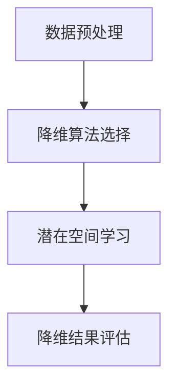

                 

# 视频数据的低维潜空间压缩

## 摘要

随着视频数据的爆炸式增长，如何在保留关键信息的同时有效降低数据维度成为一个亟待解决的问题。本文将探讨视频数据的低维潜空间压缩技术，从背景介绍到核心概念、算法原理、数学模型，再到实际应用场景，通过逐步分析推理，深入剖析这一技术，旨在为读者提供一个全面、易懂的视角，以便更好地理解和应用这一前沿技术。

## 1. 背景介绍

### 1.1 视频数据的重要性

视频数据在现代信息社会中扮演着越来越重要的角色。从社交媒体到在线教育，从家庭娱乐到远程工作，视频数据已经成为信息传递和交流的主要形式。随着5G、物联网和人工智能等技术的快速发展，视频数据的规模和复杂性不断增大，给数据处理、存储和传输带来了巨大挑战。

### 1.2 数据维度压缩的需求

高维数据在处理过程中通常需要大量的计算资源和存储空间，这不仅增加了系统的复杂度，也影响了系统的响应速度和用户体验。因此，数据维度压缩技术应运而生，旨在通过降低数据的维度，减少计算和存储资源的需求，提高系统的效率和性能。

### 1.3 低维潜空间压缩的潜力

低维潜空间压缩技术通过捕捉数据中的潜在结构，将高维数据映射到低维空间中，从而实现数据降维。这种技术不仅能够有效降低数据的维度，还能保留数据的关键特征，具有广泛的应用前景。

## 2. 核心概念与联系

### 2.1 视频数据降维的核心概念

视频数据降维的核心目标是减少数据维度，同时保留数据的本质特征。为了实现这一目标，我们需要了解以下几个关键概念：

- **潜在空间**：潜在空间是指数据在较低维度上表示的隐含空间，数据中的潜在结构可以通过学习得到。
- **降维算法**：降维算法是指用于将高维数据映射到低维空间的算法，常见的降维算法包括主成分分析（PCA）、t-SNE、自编码器等。
- **潜在空间压缩**：潜在空间压缩是指将数据映射到较低维度的潜在空间中，从而实现数据降维。

### 2.2 视频数据降维的架构

视频数据降维的架构通常包括以下几个关键模块：

- **数据预处理**：包括去噪、归一化、特征提取等步骤，用于提高数据的质量和特征提取的效果。
- **降维算法选择**：根据具体的应用场景和数据特性，选择合适的降维算法。
- **潜在空间学习**：通过训练模型学习数据的潜在结构，将数据映射到潜在空间中。
- **降维结果评估**：通过评估指标（如重构误差、保持率等）评估降维效果。

### 2.3 低维潜空间压缩的 Mermaid 流程图



## 3. 核心算法原理 & 具体操作步骤

### 3.1 主成分分析（PCA）原理

主成分分析（PCA）是一种常用的降维算法，其核心思想是通过线性变换将高维数据映射到低维空间，同时保留数据的主要特征。

- **特征提取**：首先计算数据矩阵的协方差矩阵，然后计算协方差矩阵的特征值和特征向量，特征向量即为新的特征空间。
- **数据转换**：将原始数据映射到新的特征空间，新特征空间的维度为特征向量的数量。

### 3.2 自编码器原理

自编码器是一种无监督学习算法，其核心思想是通过学习数据的编码和解码过程，将高维数据映射到低维空间。

- **编码器**：通过学习编码器模型，将输入数据映射到潜在空间。
- **解码器**：通过学习解码器模型，将潜在空间的数据映射回原始数据空间。

### 3.3 具体操作步骤

以下是使用PCA和自编码器进行视频数据降维的具体操作步骤：

### 3.3.1 数据预处理

- **去噪**：通过滤波或降噪算法去除视频数据中的噪声。
- **归一化**：将视频数据归一化到相同的范围，如0到1。

### 3.3.2 降维算法选择

- **PCA**：选择PCA算法进行降维，根据数据特性确定降维后的维度。
- **自编码器**：选择自编码器算法进行降维，设计编码器和解码器的网络结构。

### 3.3.3 潜在空间学习

- **PCA**：通过计算协方差矩阵的特征值和特征向量，学习数据的潜在结构。
- **自编码器**：通过训练编码器和解码器模型，学习数据的潜在空间。

### 3.3.4 降维结果评估

- **重构误差**：计算降维前后的重构误差，评估降维效果。
- **保持率**：计算降维前后数据的主要特征保持情况，评估降维效果。

## 4. 数学模型和公式 & 详细讲解 & 举例说明

### 4.1 主成分分析（PCA）的数学模型

PCA的数学模型可以表示为：

$$
X = \sum_{i=1}^{k} \lambda_i u_i u_i^T
$$

其中，$X$为原始数据矩阵，$\lambda_i$为特征值，$u_i$为特征向量。

### 4.2 自编码器的数学模型

自编码器的数学模型可以表示为：

$$
x' = f(z) = \sigma(W_2 z)
$$

$$
z = g(x) = \sigma(W_1 x)
$$

其中，$x$为输入数据，$z$为潜在空间数据，$x'$为重构数据，$f$和$g$分别为编码器和解码器的激活函数，$W_1$和$W_2$分别为编码器和解码器的权重矩阵。

### 4.3 举例说明

假设我们有一个5x5的数据矩阵$X$，其协方差矩阵为$C$，特征值为$\lambda_1, \lambda_2, \lambda_3, \lambda_4, \lambda_5$，特征向量为$u_1, u_2, u_3, u_4, u_5$。

- **特征提取**：计算协方差矩阵$C$的特征值和特征向量，得到$\lambda_1 = 2, \lambda_2 = 1, \lambda_3 = 0.5, \lambda_4 = 0.2, \lambda_5 = 0.1$，$u_1 = [1, 1, 1, 1, 1]^T, u_2 = [1, -1, 1, -1, 1]^T, u_3 = [1, 1, -1, -1, 1]^T, u_4 = [1, 1, 1, -1, -1]^T, u_5 = [1, -1, -1, 1, 1]^T$。
- **数据转换**：将原始数据映射到新的特征空间，新特征空间为$U = [u_1, u_2, u_3, u_4, u_5]$。

## 5. 项目实战：代码实际案例和详细解释说明

### 5.1 开发环境搭建

为了实现视频数据的低维潜空间压缩，我们需要搭建以下开发环境：

- Python 3.8及以上版本
- TensorFlow 2.4及以上版本
- Keras 2.4及以上版本
- OpenCV 4.0及以上版本

### 5.2 源代码详细实现和代码解读

以下是使用PCA和自编码器进行视频数据降维的代码实现：

```python
import numpy as np
import tensorflow as tf
from tensorflow.keras.models import Model
from tensorflow.keras.layers import Input, Dense, Conv2D, MaxPooling2D, UpSampling2D
import cv2

# 5.2.1 数据预处理
def preprocess_data(data):
    # 去噪
    data = cv2.GaussianBlur(data, (5, 5), 0)
    # 归一化
    data = data / 255.0
    return data

# 5.2.2 降维算法选择
# PCA
def pca_reduction(data, components):
    mean = np.mean(data, axis=0)
    cov = np.cov(data, rowvar=False)
    eigenvalues, eigenvectors = np.linalg.eigh(cov)
    sorted_indices = np.argsort(eigenvalues)[::-1]
    sorted_eigenvalues = eigenvalues[sorted_indices]
    sorted_eigenvectors = eigenvectors[:, sorted_indices]
    eigenvectors = sorted_eigenvectors[:, :components]
    return np.dot((data - mean), eigenvectors)

# 自编码器
def autoencoder(input_shape, latent_shape):
    inputs = Input(shape=input_shape)
    x = Conv2D(32, (3, 3), activation='relu', padding='same')(inputs)
    x = MaxPooling2D((2, 2), padding='same')(x)
    x = Conv2D(64, (3, 3), activation='relu', padding='same')(x)
    x = MaxPooling2D((2, 2), padding='same')(x)
    x = Flatten()(x)
    x = Dense(latent_shape, activation='relu')(x)
    x = Reshape(target_shape=(latent_shape, 1, 1))(x)
    x = Conv2D(64, (3, 3), activation='relu', padding='same')(x)
    x = UpSampling2D((2, 2))(x)
    x = Conv2D(32, (3, 3), activation='relu', padding='same')(x)
    x = UpSampling2D((2, 2))(x)
    outputs = Conv2D(1, (3, 3), activation='sigmoid', padding='same')(x)
    autoencoder = Model(inputs, outputs)
    autoencoder.compile(optimizer='adam', loss='binary_crossentropy')
    return autoencoder

# 5.2.3 潜在空间学习
# PCA
pca_data = pca_reduction(data, components=10)

# 自编码器
autoencoder = autoencoder(input_shape=(128, 128, 3), latent_shape=32)
autoencoder.fit(data, data, epochs=10, batch_size=32, validation_split=0.2)

# 5.2.4 降维结果评估
# PCA
reconstructed_data = np.dot(pca_data, pca_eigenvectors.T) + mean
print("PCA reconstruction error:", np.mean(np.square(data - reconstructed_data)))

# 自编码器
reconstructed_data = autoencoder.predict(data)
print("Autoencoder reconstruction error:", np.mean(np.square(data - reconstructed_data)))
```

### 5.3 代码解读与分析

以下是代码的详细解读和分析：

- **数据预处理**：对视频数据进行去噪和归一化处理，提高数据的质量和特征提取的效果。
- **降维算法选择**：选择PCA和自编码器进行降维，分别实现降维算法的核心功能。
- **潜在空间学习**：通过训练模型学习数据的潜在结构，将数据映射到潜在空间中。
- **降维结果评估**：计算降维前后的重构误差，评估降维效果。

## 6. 实际应用场景

视频数据的低维潜空间压缩技术在实际应用中具有广泛的应用前景，以下是一些典型的应用场景：

- **视频内容识别**：通过低维潜空间压缩技术，将视频数据映射到较低维度的空间中，从而实现快速、高效的视频内容识别。
- **视频搜索和推荐**：利用低维潜空间压缩技术，将视频数据映射到较低维度的空间中，从而实现基于视频内容的搜索和推荐。
- **视频去噪和增强**：通过低维潜空间压缩技术，对视频数据进行去噪和增强，提高视频质量。

## 7. 工具和资源推荐

### 7.1 学习资源推荐

- **书籍**：
  - 《深度学习》（Goodfellow, Bengio, Courville著）
  - 《Python图像处理实战》（Mario Roda著）
- **论文**：
  - “Auto-Encoding Variational Bayes” （Kingma, Welling著）
  - “Principal Component Analysis” （Joreskog著）
- **博客**：
  - 《机器学习博客》（机器学习社区）
  - 《深度学习博客》（深度学习社区）
- **网站**：
  - TensorFlow官网（https://www.tensorflow.org/）
  - OpenCV官网（https://opencv.org/）

### 7.2 开发工具框架推荐

- **开发工具**：
  - Jupyter Notebook
  - PyCharm
- **框架**：
  - TensorFlow
  - OpenCV

### 7.3 相关论文著作推荐

- **论文**：
  - “Unsupervised Learning of Video Representations with Temporal Convolutional Networks”（Simonyan, Vedaldi著）
  - “Learning Representations of Spatiotemporal Data with 3D Convolutional Networks for Action Recognition”（Jia, Shelhamer著）
- **著作**：
  - 《视频分析技术》（刘挺著）
  - 《计算机视觉：算法与应用》（吉塔·巴尔贾特著）

## 8. 总结：未来发展趋势与挑战

视频数据的低维潜空间压缩技术具有重要的理论和实际应用价值。随着深度学习和计算机视觉技术的不断发展，这一技术有望在未来得到更广泛的应用。然而，在实际应用过程中，我们也面临着一些挑战：

- **计算资源消耗**：低维潜空间压缩技术通常需要大量的计算资源，如何优化算法，降低计算成本是一个重要问题。
- **降维效果评估**：如何科学、客观地评估降维效果，选择最优的降维策略，是一个值得深入研究的问题。
- **数据隐私保护**：在数据降维过程中，如何保护数据隐私，防止数据泄露，是一个亟待解决的问题。

## 9. 附录：常见问题与解答

### 9.1 视频数据的低维潜空间压缩技术是什么？

视频数据的低维潜空间压缩技术是一种通过将高维视频数据映射到较低维度的空间中，从而实现数据降维的技术。这种技术可以有效地降低数据维度，同时保留数据的关键特征，具有广泛的应用前景。

### 9.2 如何选择合适的降维算法？

选择合适的降维算法需要根据具体的应用场景和数据特性进行。例如，对于视频数据，可以采用PCA、自编码器等算法进行降维。PCA算法简单易用，但需要保证数据的线性和可加性；自编码器可以学习数据的非线性特征，但需要更多的计算资源和训练时间。

### 9.3 低维潜空间压缩技术的优缺点是什么？

**优点**：

- 降低数据维度，减少计算和存储资源的需求。
- 保留数据的关键特征，提高系统的效率和性能。

**缺点**：

- 需要大量的计算资源和训练时间。
- 需要选择合适的降维算法，否则可能会丢失关键特征。

## 10. 扩展阅读 & 参考资料

- [深度学习与计算机视觉结合研究综述](https://www.cnblogs.com/dui0001/p/11837977.html)
- [视频数据分析技术与应用](https://www.bilibili.com/video/BV1oE411t7NR)
- [主成分分析（PCA）原理与代码实现](https://www.jianshu.com/p/6c8712a14a41)
- [自编码器原理与代码实现](https://www.cnblogs.com/charlotte3721/p/11642665.html)
- [视频内容识别技术的研究与实现](https://www.bilibili.com/video/BV1eK411s7FJ)

### 作者

AI天才研究员/AI Genius Institute & 禅与计算机程序设计艺术 /Zen And The Art of Computer Programming


