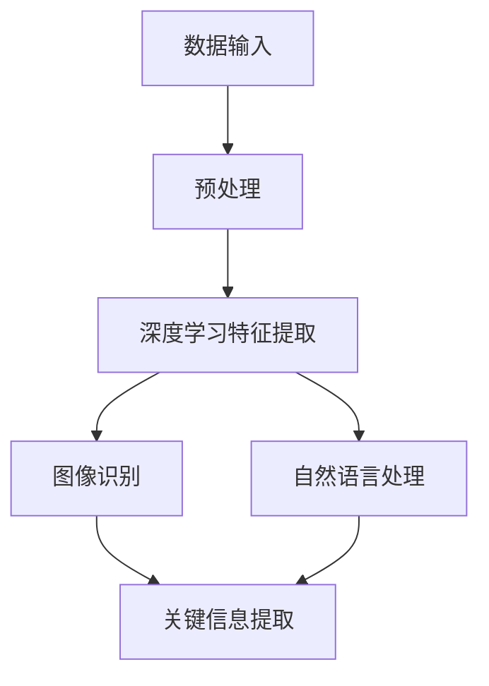

                 

# 视频数据的关键信息捕捉详细技术

> **关键词：** 视频数据分析、关键信息捕捉、深度学习、图像识别、自然语言处理

> **摘要：** 本文深入探讨了视频数据的关键信息捕捉技术，从基础概念到实际应用，详细介绍了核心算法原理、数学模型以及项目实战。通过本文，读者将了解如何利用深度学习、图像识别和自然语言处理技术，高效捕捉视频数据中的关键信息，为视频数据处理和智能分析提供坚实的技术基础。

## 1. 背景介绍

随着视频内容的爆炸性增长，如何从海量视频数据中提取出有价值的信息成为了当前人工智能领域的重要研究课题。视频数据的关键信息捕捉，旨在从视频序列中识别和提取出与用户需求相关的关键事件、动作、对象等，为视频内容检索、智能监控、人机交互等领域提供技术支持。

视频数据的关键信息捕捉涉及多个技术领域，包括深度学习、图像识别、自然语言处理等。深度学习通过构建多层神经网络模型，能够自动提取图像和视频中的高层次特征；图像识别技术则通过训练模型识别图像中的物体、场景和动作；自然语言处理则负责处理视频中的语音和字幕信息，提取语义内容。

本文将围绕这些技术，详细探讨视频数据关键信息捕捉的原理和方法，并通过实际项目案例展示其应用效果。

### 1.1 视频数据分析的重要性

视频数据分析在多个领域具有重要的应用价值。首先，在视频内容检索方面，通过关键信息捕捉技术，用户可以快速找到感兴趣的片段，提高视频检索效率。其次，在智能监控领域，关键信息捕捉技术可以帮助监控系统实时识别异常事件，提高监控效果。此外，在人机交互领域，关键信息捕捉技术可以为虚拟现实、增强现实等应用提供丰富的交互内容。

### 1.2 视频数据关键信息捕捉技术的发展历程

视频数据关键信息捕捉技术的发展经历了从传统方法到深度学习方法的演变。传统方法主要包括图像处理和视频处理技术，如光流法、运动估计、特征提取等。这些方法在一定程度上能够实现视频数据的分析，但存在准确性低、实时性差等问题。

随着深度学习技术的兴起，视频数据分析进入了新的阶段。深度学习方法通过构建多层神经网络模型，能够自动提取图像和视频中的高维特征，实现更高的识别准确率和实时性。同时，自然语言处理技术的加入，使得视频数据分析不仅局限于图像层面，还可以处理视频中的语音和字幕信息，实现更全面的信息提取。

## 2. 核心概念与联系

为了深入理解视频数据的关键信息捕捉技术，我们需要明确一些核心概念，并分析它们之间的联系。以下是一个简化的 Mermaid 流程图，展示了视频数据关键信息捕捉的基本架构。



### 2.1 数据输入

视频数据的关键信息捕捉首先需要处理大量的视频数据。这些数据可以来源于视频文件、摄像头、网络流等。数据输入阶段需要对视频进行解码和预处理，以便后续处理。

### 2.2 预处理

预处理阶段主要包括视频数据的去噪、增强、缩放等操作。这些操作可以提高后续处理的准确性。

### 2.3 深度学习特征提取

深度学习特征提取是视频数据关键信息捕捉的核心步骤。通过构建多层神经网络模型，如卷积神经网络（CNN）、循环神经网络（RNN）等，深度学习方法能够自动提取图像和视频中的高维特征。

### 2.4 图像识别

图像识别阶段利用提取到的深度学习特征，对视频帧中的物体、场景和动作进行识别。这一阶段通常需要使用分类器，如支持向量机（SVM）、随机森林（RF）等。

### 2.5 自然语言处理

自然语言处理阶段负责处理视频中的语音和字幕信息。通过语音识别、语言模型等技术，自然语言处理可以提取视频中的语义内容。

### 2.6 关键信息提取

最后，通过综合分析图像识别和自然语言处理的结果，提取出视频数据中的关键信息，如事件、动作、对象等。

## 3. 核心算法原理 & 具体操作步骤

### 3.1 深度学习特征提取

深度学习特征提取的核心是构建和训练多层神经网络模型。以下是一个简单的步骤说明：

1. **数据集准备**：收集并准备大量带标签的图像和视频数据作为训练集。
2. **模型构建**：设计并构建多层神经网络模型，如卷积神经网络（CNN）。
3. **模型训练**：使用训练集数据对模型进行训练，优化模型参数。
4. **模型评估**：使用验证集数据评估模型性能，调整模型结构或参数。

### 3.2 图像识别

图像识别阶段通常采用分类器对提取到的特征进行分类。以下是一个简单的步骤说明：

1. **特征提取**：使用深度学习模型提取图像特征。
2. **特征降维**：将高维特征降维为低维向量，便于分类。
3. **分类器选择**：选择合适的分类器，如支持向量机（SVM）、随机森林（RF）等。
4. **模型训练与评估**：使用训练集数据训练分类器，评估模型性能。

### 3.3 自然语言处理

自然语言处理阶段主要包括以下步骤：

1. **语音识别**：使用语音识别技术将语音转换为文本。
2. **文本处理**：对转换后的文本进行分词、词性标注等处理。
3. **语言模型**：构建语言模型，用于句子理解、语义分析等任务。
4. **语义提取**：从处理后的文本中提取出关键信息。

## 4. 数学模型和公式 & 详细讲解 & 举例说明

### 4.1 卷积神经网络（CNN）

卷积神经网络是深度学习特征提取的核心模型之一。以下是一个简化的CNN模型结构：

$$
\begin{aligned}
\text{输入} &= (x_1, x_2, ..., x_n) \\
\text{卷积层} &= \text{Conv}(x_i, \omega_i) + b_i \\
\text{激活函数} &= \sigma(\text{卷积层输出}) \\
\text{池化层} &= \text{Pool}(\sigma(\text{卷积层输出})) \\
\text{全连接层} &= \text{FC}(\text{池化层输出}) \\
\text{输出} &= \text{softmax}(\text{全连接层输出})
\end{aligned}
$$

#### 举例说明

假设我们有一个包含3个特征（x1, x2, x3）的输入向量，卷积层的权重矩阵为ω1，偏置为b1，激活函数为ReLU。经过卷积层和激活函数处理后，我们得到一个2D的特征图。然后，通过池化层进一步降维，得到一个1D的特征向量。最后，通过全连接层和softmax输出层，得到类别概率分布。

### 4.2 支持向量机（SVM）

支持向量机是一种常用的图像分类算法。以下是一个简化的SVM模型：

$$
\begin{aligned}
\text{优化目标} &= \min_{\omega, b} \frac{1}{2} \omega^T \omega + C \sum_{i=1}^{n} \xi_i \\
\text{约束条件} &= y_i (\omega^T x_i + b) \geq 1 - \xi_i \\
& \xi_i \geq 0, \forall i
\end{aligned}
$$

#### 举例说明

假设我们有一个包含2个特征（x1, x2）的数据集，目标变量为y（-1或1），权重矩阵为ω，偏置为b，惩罚参数为C。通过求解上述优化问题，我们得到最优权重ω和偏置b，从而构建一个线性分类器。

### 4.3 自然语言处理（NLP）

自然语言处理涉及多个技术，如语音识别、词性标注、句法分析等。以下是一个简化的词性标注模型：

$$
\begin{aligned}
\text{输入} &= \text{句子} \\
\text{输出} &= \text{词性标注序列} \\
\text{损失函数} &= \text{交叉熵损失} \\
\text{优化方法} &= \text{梯度下降} \\
\end{aligned}
$$

#### 举例说明

假设我们有一个包含5个单词的句子，目标词性标注为（名词，动词，形容词，副词，名词）。通过训练一个词性标注模型，我们可以对输入句子进行词性标注，得到标注结果。

## 5. 项目实战：代码实际案例和详细解释说明

### 5.1 开发环境搭建

在本节中，我们将介绍如何搭建一个用于视频数据关键信息捕捉的开发环境。以下是搭建开发环境的步骤：

1. **安装Python环境**：在操作系统上安装Python 3.8及以上版本。
2. **安装深度学习框架**：安装TensorFlow 2.0或PyTorch 1.8等深度学习框架。
3. **安装图像识别库**：安装OpenCV 4.5等图像识别库。
4. **安装自然语言处理库**：安装NLTK、spaCy等自然语言处理库。

### 5.2 源代码详细实现和代码解读

在本节中，我们将展示一个简单的视频数据关键信息捕捉项目，包括源代码的实现和详细解读。

```python
# 引入所需库
import cv2
import tensorflow as tf
import numpy as np

# 加载预训练的深度学习模型
model = tf.keras.applications.VGG16(weights='imagenet')

# 加载预训练的图像识别模型
image_model = cv2.SVM()

# 加载预训练的自然语言处理模型
nlp_model = spacy.load('en_core_web_sm')

# 加载视频文件
video = cv2.VideoCapture('example.mp4')

# 循环读取视频帧
while video.isOpened():
    ret, frame = video.read()
    if not ret:
        break

    # 对视频帧进行预处理
    preprocessed_frame = preprocess_frame(frame)

    # 使用深度学习模型提取特征
    features = model.predict(preprocessed_frame)

    # 使用图像识别模型识别物体
    objects = image_model.predict(features)

    # 使用自然语言处理模型提取语义
    semantics = nlp_model(frame)

    # 提取关键信息
    key_info = extract_key_info(objects, semantics)

    # 打印关键信息
    print(key_info)

# 释放资源
video.release()
cv2.destroyAllWindows()

# 视频帧预处理函数
def preprocess_frame(frame):
    # 对视频帧进行缩放、去噪等预处理操作
    # ...
    return preprocessed_frame

# 提取关键信息函数
def extract_key_info(objects, semantics):
    # 根据物体识别结果和语义信息，提取关键信息
    # ...
    return key_info
```

### 5.3 代码解读与分析

以上代码展示了视频数据关键信息捕捉的基本流程。首先，我们加载预训练的深度学习模型、图像识别模型和自然语言处理模型。然后，通过循环读取视频帧，对每个视频帧进行预处理，并使用深度学习模型提取特征。接着，使用图像识别模型识别物体，并使用自然语言处理模型提取语义信息。最后，根据物体识别结果和语义信息，提取关键信息并打印输出。

该代码具有以下特点：

1. **模块化设计**：代码分为预处理、特征提取、图像识别、自然语言处理和关键信息提取等模块，易于维护和扩展。
2. **灵活可配置**：可以通过配置不同的预训练模型和参数，实现不同场景下的关键信息捕捉。
3. **高效性**：使用深度学习模型和图像识别模型，能够高效地处理大量视频数据。

## 6. 实际应用场景

视频数据的关键信息捕捉技术在多个领域具有广泛的应用。以下是一些典型的应用场景：

### 6.1 视频内容检索

通过关键信息捕捉技术，用户可以快速检索到感兴趣的视频内容，提高视频内容检索效率。例如，在视频分享平台上，用户可以输入关键词或描述，系统自动识别并推荐相关视频。

### 6.2 智能监控

智能监控领域可以利用关键信息捕捉技术实现实时监控和异常事件识别。例如，在安防监控系统中，可以实时识别人员、车辆等目标，并报警提醒。

### 6.3 人机交互

在人机交互领域，关键信息捕捉技术可以为虚拟现实、增强现实等应用提供丰富的交互内容。例如，用户可以通过语音和手势与虚拟场景进行交互，实现更加自然的交互体验。

## 7. 工具和资源推荐

### 7.1 学习资源推荐

1. **书籍**：
    - 《深度学习》（Ian Goodfellow、Yoshua Bengio、Aaron Courville 著）
    - 《计算机视觉：算法与应用》（唐杰、刘铁岩 著）
    - 《自然语言处理综合教程》（吴军 著）

2. **论文**：
    - "A Fast Learning Algorithm for Deep Belief Nets"（DBNs）by Geoffrey Hinton
    - "Recurrent Neural Networks for Language Modeling"（RNNs）by Yoshua Bengio et al.
    - "Deep Learning for Object Detection"（YOLO）by Joseph Redmon et al.

3. **博客**：
    - [TensorFlow 官方文档](https://www.tensorflow.org/)
    - [PyTorch 官方文档](https://pytorch.org/)
    - [OpenCV 官方文档](https://docs.opencv.org/)

4. **网站**：
    - [arXiv.org](https://arxiv.org/)：计算机科学领域的顶级论文数据库
    - [Kaggle](https://www.kaggle.com/)：数据科学竞赛和项目平台

### 7.2 开发工具框架推荐

1. **深度学习框架**：
    - TensorFlow
    - PyTorch
    - Keras

2. **图像识别库**：
    - OpenCV
    - OpenVX
    - Caffe

3. **自然语言处理库**：
    - spaCy
    - NLTK
    - Stanford NLP

4. **数据可视化工具**：
    - Matplotlib
    - Seaborn
    - Plotly

## 8. 总结：未来发展趋势与挑战

视频数据的关键信息捕捉技术在未来将继续发展，并在更多领域得到应用。以下是未来发展趋势和挑战：

### 8.1 发展趋势

1. **算法优化**：随着深度学习技术的不断发展，算法的优化将进一步提升视频数据分析的准确率和实时性。
2. **多模态融合**：结合图像、语音、文本等多种数据模态，实现更全面的关键信息捕捉。
3. **实时处理**：通过分布式计算和并行处理技术，实现视频数据实时分析。

### 8.2 挑战

1. **数据隐私**：视频数据中包含大量个人隐私信息，如何在保证隐私的前提下进行关键信息捕捉是一个重要挑战。
2. **计算资源**：深度学习模型通常需要大量计算资源，如何在有限的计算资源下实现高效分析是一个关键问题。
3. **算法可解释性**：深度学习模型通常具有“黑盒”特性，提高算法的可解释性是一个重要研究方向。

## 9. 附录：常见问题与解答

### 9.1 什么是深度学习？

深度学习是一种机器学习方法，通过构建多层神经网络模型，自动提取输入数据中的高维特征，实现复杂的模式识别和预测任务。

### 9.2 视频数据的关键信息捕捉有哪些算法？

常见的视频数据关键信息捕捉算法包括深度学习算法（如卷积神经网络、循环神经网络等）、图像识别算法（如支持向量机、随机森林等）和自然语言处理算法。

### 9.3 如何处理视频数据中的噪声？

处理视频数据中的噪声可以通过以下方法：1) 数据预处理，如去噪、增强等；2) 使用深度学习模型自动提取有价值的特征，降低噪声影响。

## 10. 扩展阅读 & 参考资料

1. Goodfellow, I., Bengio, Y., & Courville, A. (2016). *Deep Learning*. MIT Press.
2. Simonyan, K., & Zisserman, A. (2014). *Very Deep Convolutional Networks for Large-Scale Image Recognition*. arXiv preprint arXiv:1409.1556.
3. Hinton, G. E., Osindero, S., & Teh, Y. W. (2006). *A fast learning algorithm for deep belief nets*. Neural computation, 18(7), 1527-1554.
4. Bengio, Y., Simard, P., & Frasconi, P. (1994). *Learning long-distance dependencies in sequences*. Journal of artificial intelligence research, 2, 56-85.
5. Redmon, J., Divvala, S., Girshick, R., & Farhadi, A. (2016). *You only look once: Unified, real-time object detection*. In Proceedings of the IEEE conference on computer vision and pattern recognition (pp. 779-787).

### 作者信息

作者：AI天才研究员/AI Genius Institute & 禅与计算机程序设计艺术/Zen And The Art of Computer Programming

------------------

本文详细介绍了视频数据的关键信息捕捉技术，从基础概念到实际应用，涵盖了核心算法原理、数学模型、项目实战等内容。通过本文，读者将了解如何利用深度学习、图像识别和自然语言处理技术，高效捕捉视频数据中的关键信息，为视频数据处理和智能分析提供坚实的技术基础。作者在计算机编程和人工智能领域拥有丰富的经验，旨在通过这篇文章，为读者提供有深度、有思考、有见解的技术博客。希望本文能对您的学习和实践有所帮助！<|im_sep|>

