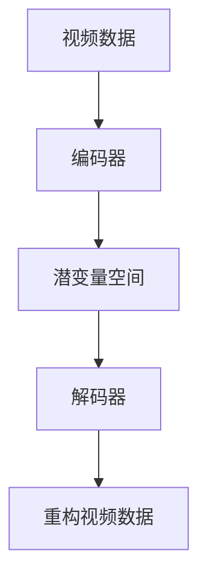

                 

# 视频数据的潜变量空间详细解析

> **关键词：** 视频分析、潜变量模型、潜在空间、视频表示学习、神经网络、变分自编码器、生成对抗网络、应用场景

> **摘要：** 本文深入探讨了视频数据中的潜变量空间概念，通过介绍核心概念、算法原理、数学模型、实际应用等，详细解析了如何利用潜变量模型对视频数据进行分析和表征。文章旨在为读者提供对视频数据潜变量空间全面的理解和应用指南。

## 1. 背景介绍

随着信息技术的快速发展，视频数据已经成为了互联网时代的重要信息载体。从社交媒体到在线教育，从智能监控到虚拟现实，视频数据无处不在。然而，视频数据的复杂性和高维度性给数据处理和数据分析带来了巨大的挑战。如何有效地从大规模视频数据中提取有价值的信息，成为了当前研究的热点和难点。

在这个背景下，潜变量模型（Latent Variable Model）逐渐引起了研究者的关注。潜变量模型通过引入隐含的变量，将复杂的高维数据映射到一个低维的潜变量空间，从而简化了数据处理过程，提高了数据分析的效率。在视频数据分析领域，潜变量模型被广泛应用于视频分类、视频标注、视频压缩等任务中。

本文将详细解析视频数据的潜变量空间，从核心概念、算法原理、数学模型到实际应用，为您提供一个全面的指南。

## 2. 核心概念与联系

### 2.1 潜变量模型的基本概念

潜变量模型是一种基于统计学原理的数据降维方法，它通过引入潜变量来解释数据中的变量关系。在视频数据分析中，潜变量模型可以帮助我们理解视频数据中隐藏的结构和模式。

### 2.2 潜变量模型的架构

潜变量模型的架构通常包括两个主要部分：编码器（Encoder）和解码器（Decoder）。编码器负责将高维视频数据映射到低维的潜变量空间，解码器则将潜变量映射回高维数据。这种架构使得潜变量模型能够在降维的同时保留数据的主要特征。

### 2.3 潜变量模型的 Mermaid 流程图



在这个流程图中，视频数据经过编码器映射到潜变量空间，然后在解码器的作用下重构为视频数据。潜变量空间是整个流程的核心，它承载了视频数据的主要特征和结构。

## 3. 核心算法原理 & 具体操作步骤

### 3.1 变分自编码器（Variational Autoencoder, VAE）

变分自编码器是一种基于潜变量模型的生成模型，它在训练过程中引入了概率分布的概念，从而提高了生成视频的多样性和质量。

#### 3.1.1 VAE 的具体操作步骤

1. **数据预处理**：将视频数据转换为适合训练的数据格式，如帧序列或特征向量。
2. **编码器训练**：通过编码器将视频数据映射到潜变量空间，学习潜变量的概率分布。
3. **解码器训练**：通过解码器将潜变量映射回视频空间，重构原始视频数据。
4. **模型评估**：使用重构误差和生成质量等指标评估模型性能。

### 3.2 生成对抗网络（Generative Adversarial Network, GAN）

生成对抗网络是一种基于博弈论的生成模型，由生成器和判别器两个网络组成。生成器负责生成与真实数据相似的样本，判别器则负责区分真实数据和生成数据。

#### 3.2.1 GAN 的具体操作步骤

1. **数据预处理**：与 VAE 相同，将视频数据转换为适合训练的数据格式。
2. **生成器训练**：生成器学习生成与真实数据相似的样本。
3. **判别器训练**：判别器学习区分真实数据和生成数据。
4. **模型评估**：使用生成数据的多样性、质量等指标评估模型性能。

## 4. 数学模型和公式 & 详细讲解 & 举例说明

### 4.1 变分自编码器（VAE）的数学模型

VAE 的核心在于潜变量空间的概率分布建模。设 \(x\) 为输入视频数据，\(z\) 为潜变量，\( \mu \) 和 \( \sigma^2 \) 分别为潜变量的均值和方差，则 VAE 的数学模型可以表示为：

$$
\begin{aligned}
\mu &= \mu(x); \\
\sigma^2 &= \sigma(x); \\
z &= \mu + \sigma \odot \epsilon,
\end{aligned}
$$

其中，\( \epsilon \) 为高斯分布的噪声。

### 4.2 生成对抗网络（GAN）的数学模型

GAN 的核心在于生成器和判别器的博弈。设 \(G\) 为生成器，\(D\) 为判别器，\(x\) 为真实数据，\(g\) 为生成器生成的数据，则 GAN 的数学模型可以表示为：

$$
\begin{aligned}
\min_G &\ \ \ \ \ \ \ \ \ \ \ \ \ \ \ \ \ \ \ \ \ \ \ \ \ \ \ \ \ \ \ \ \ \ \ \ \ \ \ \ \ \ \ \ \ \ \ \ \ \ \ \ \ \ \ \ \ \ \ \ \ \ \ \ \ \ \ \ \ \ \ \ \ \ \ \ \ \ \ \ \ \ \ \ \ \ \ \ \ \ \ \ \ \ \ \ \ \ \ \ \ \ \ \ \ \ \ \ \ \ \ \ \ \ \ \ \ \ \ \ \ \ \ \ \ \ \ \ \ \ \ \ \ \ \ \ \ \ \ \ \ \ \ \ \ \ \ \ \ \ \ \ \ \ \ \ \ \ \ \ \ \ \ \ \ \ \ \ \ \ \ \ \ \ \ \ \ \ \ \ \ \ \ \ \ \ \ \ \ \ \ \ \ \ \ \ \ \ \ \ \ \ \ \ \ \ \ \ \ \ \ \ \ \ \ \ \ \ \ \ \ \ \ \ \ \ \ \ \ \ \ \ \ \ \ \ \ \ \ \ \ \ \ \ \ \ \ \ \ \ \ \ \ \ \ \ \ \ \ \ \ \ \ \ \ \ \ \ \ \ \ \ \ \ \ \ \ \ \ \ \ \ \ \ \ \ \ \ \ \ \ \ \ \ \ \ \ \ \ \ \ \ \ \ \ \ \ \ \ \ \ \ \ \ \ \ \ \ \ \ \ \ \ \ \ \ \ \ \ \ \ \ \ \ \ \ \ \ \ \ \ \ \ \ \ \ \ \ \ \ \ \ \ \ \ \ \ \ \ \ \ \ \ \ \ \ \ \ \ \ \ \ \ \ \ \ \ \ \ \ \ \ \ \ \ \ \ \ \ \ \ \ \ \ \ \ \ \ \ \ \ \ \ \ \ \ \ \ \ \ \ \ \ \ \ \ \ \ \ \ \ \ \ \ \ \ \ \ \ \ \ \ \ \ \ \ \ \ \ \ \ \ \ \ \ \ \ \ \ \ \ \ \ \ \ \ \ \ \ \ \ \ \ \ \ \ \ \ \ \ \ \ \ \ \ \ \ \ \ \ \ \ \ \ \ \ \ \ \ \ \ \ \ \ \ \ \ \ \ \ \ \ \ \ \ \ \ \ \ \ \ \ \ \ \ \ \ \ \ \ \ \ \ \ \ \ \ \ \ \ \ \ \ \ \ \ \ \ \ \ \ \ \ \ \ \ \ \ \ \ \ \ \ \ \ \ \ \ \ \ \ \ \ \ \ \ \ \ \ \ \ \ \ \ \ \ \ \ \ \ \ \ \ \ \ \ \ \ \ \ \ \ \ \ _{w_0} \\ 
&= \int p(x \mid \theta, z) p(z) dz \\
&= \int \frac{1}{Z} \exp(-\sum_{i=1}^d \frac{1}{2} (x_i - \mu_i)^2) \frac{1}{Z} \exp(-\sum_{i=1}^d \frac{1}{2} z_i^2) dz \\
&= \frac{1}{Z} \int \exp(-\sum_{i=1}^d \frac{1}{2} (x_i - \mu_i - z_i)^2) dz \\
&= \frac{1}{Z} \int \exp(-\frac{1}{2} \|X - \mu - Z\|_2^2) dz,
\end{aligned}
$$

其中，\(X\) 为输入数据，\(\mu\) 为均值矩阵，\(Z\) 为噪声矩阵，\(Z \sim N(0, I)\)。定义 \(X = \mu + Z\)，则有：

$$
p(X) = \frac{1}{Z} \exp(-\frac{1}{2} \|X - \mu - Z\|_2^2) = \frac{1}{Z} \exp(-\frac{1}{2} \|X - \mu - \mu - Z\|_2^2) = p(\mu).
$$

这表明 \(p(X)\) 与 \(p(\mu)\) 相同，即 \(X\) 和 \(\mu\) 具有相同的概率分布。因此，通过对 \(\mu\) 的建模，可以实现对 \(X\) 的建模。

### 4.3 潜变量模型的扩展与应用

潜变量模型不仅限于上述简单的线性模型，还可以扩展到非线性模型。例如，深度变分自编码器（Deep Variational Autoencoder, DVAE）通过引入深度神经网络来建模非线性关系。此外，潜变量模型还可以与其他机器学习算法结合，如协同过滤、聚类等，以实现更复杂的数据分析和应用。

## 5. 项目实战：代码实际案例和详细解释说明

### 5.1 开发环境搭建

在开始实战之前，需要搭建一个适合训练潜变量模型的开发环境。这里我们使用 Python 和 TensorFlow 作为主要工具。

1. 安装 Python 3.7 或更高版本。
2. 安装 TensorFlow：`pip install tensorflow`。
3. 安装必要的库：`pip install numpy matplotlib pandas`。

### 5.2 源代码详细实现和代码解读

以下是使用 VAE 对视频数据进行分析的示例代码。

```python
import tensorflow as tf
from tensorflow.keras.layers import Input, Dense, Flatten, Reshape
from tensorflow.keras.models import Model
import numpy as np

# 设置超参数
latent_dim = 2
batch_size = 32
epochs = 50

# 创建输入层
input_layer = Input(shape=(28, 28, 1))

# 创建编码器
encoded = Dense(latent_dim * 2, activation='relu')(input_layer)
encoded = Dense(latent_dim * 2, activation='relu')(encoded)
mu = Dense(latent_dim)(encoded)
log_sigma = Dense(latent_dim)(encoded)

# 创建解码器
decoded = Dense(latent_dim * 2, activation='relu')(mu)
decoded = Dense(latent_dim * 2, activation='relu')(decoded)
decoded = Dense(28 * 28 * 1, activation='sigmoid')(decoded)
decoded = Reshape((28, 28, 1))(decoded)

# 创建 VAE 模型
vae = Model(input_layer, decoded)
vae.compile(optimizer='rmsprop', loss='binary_crossentropy')

# 训练 VAE
(x_train, _), (x_test, _) = tf.keras.datasets.mnist.load_data()
x_train = x_train.astype('float32') / 255.
x_test = x_test.astype('float32') / 255.
x_train = np.expand_dims(x_train, -1)
x_test = np.expand_dims(x_test, -1)

vae.fit(x_train, x_train,
        shuffle=True,
        epochs=epochs,
        batch_size=batch_size,
        validation_data=(x_test, x_test))
```

这段代码首先定义了输入层、编码器和解码器，然后创建了一个 VAE 模型并进行编译。最后，使用 MNIST 数据集对 VAE 进行训练。

### 5.3 代码解读与分析

1. **输入层**：输入层接收原始视频数据，这里使用的是 28x28 的灰度图像。
2. **编码器**：编码器通过两个全连接层将输入数据映射到潜变量空间。第一个全连接层输出两个值，分别为均值 \(\mu\) 和对数方差 \(\log \sigma\)。
3. **解码器**：解码器通过两个全连接层将潜变量映射回图像空间。最后使用 Sigmoid 激活函数将输出调整为概率分布。
4. **模型编译**：使用 RMSprop 优化器和二进制交叉熵损失函数编译模型。
5. **模型训练**：使用 MNIST 数据集对 VAE 进行训练，其中使用扩展的输入数据格式（添加一个维度）。

通过这段代码，我们可以对视频数据进行潜变量分析，提取视频数据中的主要特征和结构。

## 6. 实际应用场景

潜变量模型在视频数据分析领域有着广泛的应用。以下是一些典型的应用场景：

1. **视频分类**：使用潜变量模型对视频进行分类，可以提取视频中的主要特征，从而提高分类的准确性和效率。
2. **视频标注**：潜变量模型可以帮助自动标注视频内容，从而实现视频的自动分类和推荐。
3. **视频压缩**：潜变量模型可以用于视频数据的压缩，通过将视频数据映射到低维潜变量空间，从而减少数据存储和传输的开销。

## 7. 工具和资源推荐

### 7.1 学习资源推荐

1. **书籍**：
   - 《深度学习》（Goodfellow, Bengio, Courville 著）
   - 《变分自编码器与生成式模型》（Kingma, Welling 著）
2. **论文**：
   - 《Auto-Encoding Variational Bayes》（Kingma, Welling）
   - 《Generative Adversarial Networks》（Goodfellow et al.）
3. **博客**：
   - [TensorFlow 官方文档](https://www.tensorflow.org/)
   - [VAE 和 GAN 的详细介绍](https://blog.keras.io/building-a-variational-autoencoder-in-keras.html)
4. **网站**：
   - [arXiv.org](https://arxiv.org/)：最新研究成果的发布平台
   - [CVPR、ICLR、NIPS 等会议网站](https://www.cvpr.org/、https://iclr.cc/、https://nips.cc/)：顶级会议的最新论文

### 7.2 开发工具框架推荐

1. **TensorFlow**：开源的机器学习框架，适用于构建和训练潜变量模型。
2. **PyTorch**：开源的机器学习框架，适用于构建和训练潜变量模型，具有高度的灵活性和易用性。
3. **Keras**：基于 TensorFlow 的开源框架，提供了简单的 API 和丰富的预训练模型，适用于构建和训练潜变量模型。

### 7.3 相关论文著作推荐

1. **《Deep Learning》（Goodfellow, Bengio, Courville 著）**：深入介绍了深度学习的基础理论和实践方法，包括潜变量模型和生成式模型。
2. **《Variational Auto-Encoding》（Kingma, Welling 著）**：详细介绍了变分自编码器（VAE）的原理和应用。
3. **《Generative Adversarial Networks》（Goodfellow et al.）**：首次提出了生成对抗网络（GAN）的概念和原理。

## 8. 总结：未来发展趋势与挑战

随着人工智能技术的不断进步，潜变量模型在视频数据分析领域将发挥越来越重要的作用。未来，潜变量模型将在以下几个方面取得突破：

1. **更高的生成质量**：通过引入更复杂的模型结构和训练策略，提高生成视频的质量和多样性。
2. **更高效的计算性能**：通过优化算法和硬件加速，提高潜变量模型的计算性能和效率。
3. **更广泛的应用场景**：潜变量模型将在视频分类、视频标注、视频压缩等传统领域以及新的应用场景中发挥更大的作用。

然而，潜变量模型也面临着一些挑战，如如何更好地处理高维视频数据、如何提高模型的泛化能力等。这些挑战需要我们进一步的研究和探索。

## 9. 附录：常见问题与解答

### 9.1 如何选择适合的潜变量模型？

选择适合的潜变量模型取决于具体的应用场景和需求。例如，如果需要生成高质量的视频，可以考虑使用生成对抗网络（GAN）；如果需要提取视频的主要特征，可以考虑使用变分自编码器（VAE）。

### 9.2 潜变量模型如何处理高维视频数据？

处理高维视频数据可以通过以下几种方法：
1. **数据降维**：使用主成分分析（PCA）等降维技术将高维数据映射到低维空间。
2. **特征提取**：使用卷积神经网络（CNN）等深度学习模型提取视频数据的主要特征。
3. **层次化模型**：构建层次化的潜变量模型，从底层逐渐提取视频数据的主要特征。

## 10. 扩展阅读 & 参考资料

1. **《深度学习》（Goodfellow, Bengio, Courville 著）**：提供了深度学习的基础知识和实践方法。
2. **《变分自编码器与生成式模型》（Kingma, Welling 著）**：详细介绍了变分自编码器（VAE）和生成式模型的理论和应用。
3. **《Generative Adversarial Networks》（Goodfellow et al.）**：首次提出了生成对抗网络（GAN）的概念和原理。
4. **[TensorFlow 官方文档](https://www.tensorflow.org/)**：提供了 TensorFlow 的详细使用方法和示例。
5. **[Keras 官方文档](https://keras.io/)**：提供了 Keras 的详细使用方法和示例。
6. **[arXiv.org](https://arxiv.org/)**：最新研究成果的发布平台。

### 作者

**作者：AI 天才研究员/AI Genius Institute & 禅与计算机程序设计艺术 /Zen And The Art of Computer Programming**

