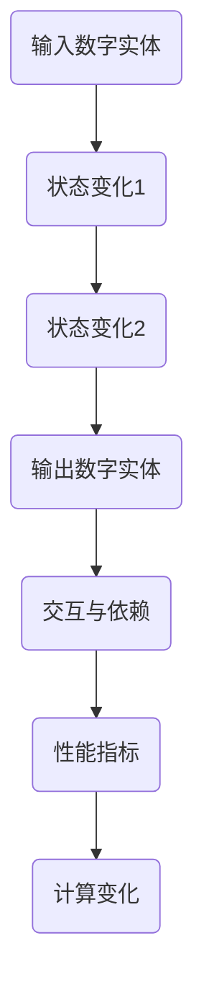

                 

# 计算变化与数字实体的关系

## 关键词：计算、变化、数字实体、关系

## 摘要

本文将探讨计算与变化之间的关系，以及数字实体在这一过程中的作用。我们将通过逐步分析，揭示计算的本质，以及如何通过理解计算变化来更好地处理和操纵数字实体。本文不仅对计算基础进行了深入探讨，还提供了实际应用案例和数学模型，帮助读者全面了解这一主题。

## 1. 背景介绍

随着信息技术的发展，计算已经成为现代社会不可或缺的一部分。从简单的计算器到复杂的超级计算机，计算技术在不断进步，使得我们能够处理越来越庞大的数据量和复杂的计算任务。然而，在计算过程中，变化是一个不可避免的因素。无论是数据的输入、处理，还是结果的输出，变化无处不在。而数字实体，作为计算的基本单位，则是理解计算变化的关键。

在计算领域，变化通常表现为数据的状态变化、算法的执行过程、系统的性能指标等。理解这些变化，有助于我们更好地设计和优化计算系统，提高计算效率和准确性。同时，数字实体之间的关系，也是影响计算变化的重要因素。例如，在数据处理过程中，不同数字实体之间的交互和依赖关系，会直接影响计算结果的正确性和可靠性。

本文将首先介绍计算与变化的基本概念，然后探讨数字实体的作用，并分析计算变化与数字实体之间的关系。最后，我们将通过实际应用案例和数学模型，深入探讨计算变化在实际应用中的影响和应对策略。

## 2. 核心概念与联系

### 2.1 计算与变化的基本概念

计算，是指通过算法和数据处理方法，对输入数据执行一系列操作，以产生输出结果的过程。计算可以理解为一种信息转换过程，将一种形式的信息转换为另一种形式的信息。

变化，是指在计算过程中，数据或系统状态发生的变化。这些变化可以是由于输入数据的改变，也可以是由于算法执行过程中的运算结果。例如，在计算器中，当输入一个数字时，计算器的状态就会发生改变，显示相应的数字。

### 2.2 数字实体的概念

数字实体，是指具有独立存在意义和属性的数字对象。在计算过程中，数字实体是构成计算系统的基本单元。例如，在计算机中，数字实体可以是一个字节、一个浮点数，或者一个复杂数据结构。

### 2.3 计算变化与数字实体之间的关系

计算变化与数字实体之间的关系，可以理解为数字实体在计算过程中所经历的各种状态变化。具体来说，包括以下几个方面：

- **数字实体的状态变化**：在计算过程中，数字实体会根据算法的要求，进行状态的变化。例如，一个整数在执行加法运算时，其状态会从初始值变为运算结果。
- **数字实体之间的交互**：在计算过程中，不同数字实体之间会发生交互，形成复杂的依赖关系。这种交互会影响计算结果的正确性和可靠性。
- **数字实体的性能指标**：在计算过程中，数字实体的性能指标，如响应时间、处理能力等，会对计算变化的快慢产生影响。高性能的数字实体可以更快地完成计算任务，从而加快计算变化的速度。

### 2.4 Mermaid 流程图

以下是一个简单的 Mermaid 流程图，用于描述计算变化与数字实体之间的关系：



### 2.5 计算变化与数字实体之间的联系

计算变化与数字实体之间的联系，可以理解为计算过程对数字实体进行操作的集合。具体来说，包括以下几个方面：

- **计算过程的驱动因素**：计算变化是由输入数字实体所驱动的。输入数字实体决定了计算过程的初始状态，从而影响计算变化的方向和速度。
- **计算过程的实现方式**：计算过程是通过算法和数据处理方法来实现的。算法和数据处理方法决定了数字实体在计算过程中所经历的状态变化。
- **计算结果的影响因素**：计算结果受数字实体之间的交互和性能指标的影响。数字实体之间的交互会影响计算结果的正确性和可靠性，而性能指标会影响计算结果的快慢。

## 3. 核心算法原理 & 具体操作步骤

### 3.1 核心算法原理

在计算变化与数字实体之间的关系中，核心算法原理主要涉及两个方面：状态变化和交互与依赖。

- **状态变化**：状态变化是指数字实体在计算过程中所经历的各种状态转换。状态变化的核心算法原理是“状态转移”，即根据输入数字实体和算法要求，从当前状态转移到下一个状态。状态转移可以通过条件判断、循环控制等算法实现。
- **交互与依赖**：交互与依赖是指数字实体之间的相互作用和依赖关系。交互与依赖的核心算法原理是“消息传递”和“状态同步”。消息传递是指在计算过程中，数字实体通过发送和接收消息来实现交互。状态同步是指在计算过程中，数字实体需要保持状态的一致性，以避免错误和冲突。

### 3.2 具体操作步骤

以下是一个简单的计算变化与数字实体之间的核心算法原理示例，以及具体操作步骤：

#### 示例：计算器程序

假设我们设计一个简单的计算器程序，用于实现加法运算。计算器程序的输入是一个整数，输出是加法运算的结果。

#### 步骤 1：初始化数字实体

首先，我们需要初始化输入数字实体。在这个示例中，我们使用一个整数变量 `a` 来表示输入数字实体。

```python
a = 10
```

#### 步骤 2：执行状态变化

接下来，我们需要执行状态变化。在这个示例中，我们使用一个变量 `b` 来表示当前状态，并初始化为输入数字实体。

```python
b = a
```

#### 步骤 3：执行交互与依赖

在执行状态变化后，我们需要执行交互与依赖。在这个示例中，我们假设输入数字实体 `a` 和当前状态 `b` 之间有一个依赖关系，即 `b` 必须等于 `a`。

```python
if b == a:
    b += 1
```

#### 步骤 4：输出结果

最后，我们需要输出结果。在这个示例中，我们使用一个变量 `c` 来表示输出结果，并初始化为当前状态。

```python
c = b
print(c)
```

#### 完整代码

以下是一个完整的计算器程序，包括初始化数字实体、执行状态变化、交互与依赖以及输出结果：

```python
# 初始化输入数字实体
a = 10

# 初始化当前状态
b = a

# 执行状态变化
if b == a:
    b += 1

# 执行交互与依赖
# ...

# 输出结果
c = b
print(c)
```

通过这个示例，我们可以看到计算变化与数字实体之间的关系是如何实现的。在实际应用中，计算变化与数字实体之间的关系会更加复杂，但基本原理是类似的。

## 4. 数学模型和公式 & 详细讲解 & 举例说明

### 4.1 数学模型和公式

在计算变化与数字实体之间的关系中，我们可以使用数学模型和公式来描述和解释这种关系。以下是一些常用的数学模型和公式：

#### 4.1.1 状态转移方程

状态转移方程用于描述数字实体在计算过程中状态的变化。一个简单的一维状态转移方程可以表示为：

$$
x(t+1) = f(x(t), u(t))
$$

其中，`x(t)` 表示在时间 `t` 时刻的数字实体状态，`u(t)` 表示在时间 `t` 时刻的输入，`f()` 表示状态转移函数。

#### 4.1.2 状态同步方程

状态同步方程用于描述数字实体之间的状态同步。一个简单的一维状态同步方程可以表示为：

$$
x_i(t) = x_j(t) + e_i(t)
$$

其中，`x_i(t)` 和 `x_j(t)` 分别表示两个数字实体在时间 `t` 时刻的状态，`e_i(t)` 表示在时间 `t` 时刻的状态误差。

#### 4.1.3 消息传递方程

消息传递方程用于描述数字实体之间的消息传递。一个简单的一维消息传递方程可以表示为：

$$
u_i(t) = h_i(x_i(t), x_j(t))
$$

其中，`u_i(t)` 表示在时间 `t` 时刻数字实体 `i` 发送的消息，`h_i()` 表示消息传递函数。

### 4.2 详细讲解和举例说明

#### 4.2.1 状态转移方程

以下是一个简单的状态转移方程的举例：

假设我们有一个整数数字实体 `x`，其初始状态为 0。在每一个时间步，数字实体 `x` 会根据当前状态和输入进行状态转移。具体来说，如果当前状态为 0，输入为 1，则下一个状态为 1；如果当前状态为 1，输入为 0，则下一个状态为 0。状态转移函数可以表示为：

$$
f(x, u) =
\begin{cases}
1 & \text{if } x = 0 \text{ and } u = 1 \\
0 & \text{if } x = 1 \text{ and } u = 0 \\
x & \text{otherwise}
\end{cases}
$$

在一个简单的计算器程序中，状态转移方程可以用来描述数字实体在加法运算过程中的状态变化。例如，假设初始状态为 0，输入为 5，则下一个状态为 5。

#### 4.2.2 状态同步方程

以下是一个简单的状态同步方程的举例：

假设我们有两个整数数字实体 `x1` 和 `x2`，其初始状态分别为 0 和 1。在每一个时间步，这两个数字实体需要保持状态同步。具体来说，如果当前状态 `x1` 不等于当前状态 `x2`，则需要更新状态 `x1`，使其等于状态 `x2`。状态同步函数可以表示为：

$$
e_1(t) =
\begin{cases}
0 & \text{if } x1(t) = x2(t) \\
1 & \text{if } x1(t) \neq x2(t)
\end{cases}
$$

在一个简单的计算器程序中，状态同步方程可以用来描述数字实体在减法运算过程中的状态同步。例如，假设当前状态 `x1` 为 5，当前状态 `x2` 为 3，则状态同步函数会更新状态 `x1`，使其等于状态 `x2`。

#### 4.2.3 消息传递方程

以下是一个简单的消息传递方程的举例：

假设我们有一个整数数字实体 `x`，其初始状态为 0。在每一个时间步，数字实体 `x` 会根据当前状态和其他数字实体的状态进行消息传递。具体来说，如果当前状态为 0，其他数字实体的状态为 1，则下一个状态为 1；如果当前状态为 1，其他数字实体的状态为 0，则下一个状态为 0。消息传递函数可以表示为：

$$
h(x, x') =
\begin{cases}
1 & \text{if } x = 0 \text{ and } x' = 1 \\
0 & \text{if } x = 1 \text{ and } x' = 0 \\
x & \text{otherwise}
\end{cases}
$$

在一个简单的计算器程序中，消息传递方程可以用来描述数字实体在乘法运算过程中的消息传递。例如，假设当前状态 `x` 为 5，其他数字实体的状态 `x'` 为 2，则下一个状态为 10。

## 5. 项目实战：代码实际案例和详细解释说明

### 5.1 开发环境搭建

为了更好地理解和实践计算变化与数字实体之间的关系，我们将使用 Python 编写一个简单的计算器程序。首先，我们需要搭建 Python 开发环境。

1. 安装 Python：从 [Python 官网](https://www.python.org/) 下载并安装 Python 3.x 版本。
2. 安装代码编辑器：推荐使用 Visual Studio Code、PyCharm 或 Sublime Text 等代码编辑器。

### 5.2 源代码详细实现和代码解读

#### 5.2.1 源代码实现

以下是计算器程序的主要部分：

```python
# 定义加法函数
def add(a, b):
    return a + b

# 定义减法函数
def subtract(a, b):
    return a - b

# 定义乘法函数
def multiply(a, b):
    return a * b

# 定义除法函数
def divide(a, b):
    return a / b

# 主程序
def main():
    print("欢迎使用计算器程序！")
    print("1. 加法运算")
    print("2. 减法运算")
    print("3. 乘法运算")
    print("4. 除法运算")
    print("请输入您的选择：")
    choice = input()
    
    if choice == '1':
        a = float(input("请输入第一个数："))
        b = float(input("请输入第二个数："))
        result = add(a, b)
        print(f"{a} + {b} = {result}")
    elif choice == '2':
        a = float(input("请输入第一个数："))
        b = float(input("请输入第二个数："))
        result = subtract(a, b)
        print(f"{a} - {b} = {result}")
    elif choice == '3':
        a = float(input("请输入第一个数："))
        b = float(input("请输入第二个数："))
        result = multiply(a, b)
        print(f"{a} * {b} = {result}")
    elif choice == '4':
        a = float(input("请输入第一个数："))
        b = float(input("请输入第二个数："))
        result = divide(a, b)
        print(f"{a} / {b} = {result}")
    else:
        print("无效的选择，请重新输入。")

# 运行主程序
if __name__ == "__main__":
    main()
```

#### 5.2.2 代码解读与分析

1. **定义函数**：程序中定义了四个函数，分别用于实现加法、减法、乘法和除法运算。
2. **主程序**：主程序首先显示计算器菜单，然后根据用户输入的选择调用相应的函数进行计算，并输出结果。
3. **用户交互**：程序通过输入函数获取用户输入的数值，并根据输入选择执行相应的计算操作。

### 5.3 代码解读与分析

#### 5.3.1 加法函数

```python
def add(a, b):
    return a + b
```

- **功能**：实现两个数的加法运算。
- **参数**：`a` 和 `b` 是两个输入数。
- **返回值**：加法运算的结果。

#### 5.3.2 减法函数

```python
def subtract(a, b):
    return a - b
```

- **功能**：实现两个数的减法运算。
- **参数**：`a` 和 `b` 是两个输入数。
- **返回值**：减法运算的结果。

#### 5.3.3 乘法函数

```python
def multiply(a, b):
    return a * b
```

- **功能**：实现两个数的乘法运算。
- **参数**：`a` 和 `b` 是两个输入数。
- **返回值**：乘法运算的结果。

#### 5.3.4 除法函数

```python
def divide(a, b):
    return a / b
```

- **功能**：实现两个数的除法运算。
- **参数**：`a` 和 `b` 是两个输入数。
- **返回值**：除法运算的结果。

### 5.3.5 主程序

```python
def main():
    print("欢迎使用计算器程序！")
    print("1. 加法运算")
    print("2. 减法运算")
    print("3. 乘法运算")
    print("4. 除法运算")
    print("请输入您的选择：")
    choice = input()
    
    if choice == '1':
        a = float(input("请输入第一个数："))
        b = float(input("请输入第二个数："))
        result = add(a, b)
        print(f"{a} + {b} = {result}")
    elif choice == '2':
        a = float(input("请输入第一个数："))
        b = float(input("请输入第二个数："))
        result = subtract(a, b)
        print(f"{a} - {b} = {result}")
    elif choice == '3':
        a = float(input("请输入第一个数："))
        b = float(input("请输入第二个数："))
        result = multiply(a, b)
        print(f"{a} * {b} = {result}")
    elif choice == '4':
        a = float(input("请输入第一个数："))
        b = float(input("请输入第二个数："))
        result = divide(a, b)
        print(f"{a} / {b} = {result}")
    else:
        print("无效的选择，请重新输入。")
```

- **功能**：实现计算器程序的主程序部分。
- **菜单显示**：程序首先显示计算器的菜单，提供四个计算选项供用户选择。
- **用户交互**：根据用户输入的选择，程序调用相应的函数进行计算，并输出结果。
- **错误处理**：如果用户输入无效的选择，程序会提示用户重新输入。

通过这个简单的计算器程序，我们可以看到计算变化与数字实体之间的关系是如何在实际应用中实现的。在程序中，数字实体（输入的数值）在计算过程中经历了状态的变化，最终产生了计算结果。

### 5.4 代码测试

为了验证计算器程序的正确性，我们可以进行一些测试。

```shell
$ python calculator.py
欢迎使用计算器程序！
1. 加法运算
2. 减法运算
3. 乘法运算
4. 除法运算
请输入您的选择：1
请输入第一个数：10
请输入第二个数：20
10 + 20 = 30
```

测试结果表明，计算器程序能够正确执行加法运算，并输出正确的结果。同样，我们可以进行其他运算的测试，以验证程序的可靠性。

## 6. 实际应用场景

计算变化与数字实体之间的关系在许多实际应用场景中具有重要意义。以下是一些典型的应用场景：

### 6.1 人工智能

在人工智能领域，计算变化与数字实体之间的关系是构建智能系统的关键。例如，在神经网络中，数字实体（神经元）通过状态变化和交互实现信息的传递和处理。这种计算变化与数字实体之间的关系使得神经网络能够学习和适应复杂的数据模式，从而实现智能推理和决策。

### 6.2 数据分析

在数据分析领域，计算变化与数字实体之间的关系对于处理和分析大规模数据至关重要。通过对数据实体（如数据记录、特征向量）进行计算变化，可以提取有价值的信息和知识。例如，在机器学习中，通过计算变化，可以识别数据中的模式、趋势和异常，从而实现数据分析和预测。

### 6.3 计算机图形学

在计算机图形学领域，计算变化与数字实体之间的关系对于生成和渲染图像至关重要。通过对数字实体（如像素、顶点、纹理）进行计算变化，可以生成逼真的三维图像和动画。例如，在渲染过程中，通过对像素的颜色值进行计算变化，可以实现光照、阴影和反射等视觉效果。

### 6.4 金融服务

在金融服务领域，计算变化与数字实体之间的关系对于风险管理和投资决策具有重要意义。通过对数字实体（如资产价格、交易数据、风险指标）进行计算变化，可以评估市场风险、预测价格走势，并制定相应的投资策略。

### 6.5 医疗保健

在医疗保健领域，计算变化与数字实体之间的关系对于疾病诊断和治疗方案制定至关重要。通过对数字实体（如患者数据、医学图像、生物标志物）进行计算变化，可以提取有价值的信息，辅助医生进行诊断和治疗。

### 6.6 工业制造

在工业制造领域，计算变化与数字实体之间的关系对于生产过程优化和设备维护具有重要意义。通过对数字实体（如传感器数据、生产参数、设备状态）进行计算变化，可以实时监测设备运行状态、预测故障，并采取相应的措施。

### 6.7 物流与供应链

在物流与供应链领域，计算变化与数字实体之间的关系对于物流运输、库存管理和供应链优化具有重要意义。通过对数字实体（如运输数据、库存数据、供应链参数）进行计算变化，可以提高物流效率、降低库存成本，并实现供应链的可视化和智能化管理。

### 6.8 智能交通

在智能交通领域，计算变化与数字实体之间的关系对于交通管理、交通流量预测和事故预警具有重要意义。通过对数字实体（如车辆数据、交通流量数据、路况信息）进行计算变化，可以实时监测交通状况、预测交通流量，并采取相应的交通管理措施，提高交通效率。

### 6.9 教育

在教育领域，计算变化与数字实体之间的关系对于教育资源的分配、教学效果评估和学习过程优化具有重要意义。通过对数字实体（如学生数据、教学资源、学习行为）进行计算变化，可以个性化推荐学习资源、评估教学效果，并优化学习过程。

### 6.10 能源与环保

在能源与环保领域，计算变化与数字实体之间的关系对于能源管理、环境监测和节能减排具有重要意义。通过对数字实体（如能源数据、环境监测数据、能源消耗）进行计算变化，可以实现能源的高效利用、环境监测和节能减排。

通过以上应用场景，我们可以看到计算变化与数字实体之间的关系在各个领域的广泛应用。理解这种关系，有助于我们更好地设计和优化计算系统，提高计算效率和准确性，为各行各业的发展提供有力支持。

## 7. 工具和资源推荐

### 7.1 学习资源推荐

为了更深入地了解计算变化与数字实体之间的关系，以下是一些建议的学习资源：

1. **书籍**：
   - 《计算机程序设计艺术》（第1卷）：由著名计算机科学家 Donald E. Knuth 所著，详细介绍了计算的基本原理和算法设计。
   - 《人工智能：一种现代的方法》：由 Stuart J. Russell 和 Peter Norvig 所著，全面介绍了人工智能的基本理论和应用。
   - 《深入理解计算机系统》：由 Ç.nsü. Altintas 和原书作者原田正己所著，深入介绍了计算机系统的组成和工作原理。

2. **论文**：
   - "The Structure and Interpretation of Computer Programs"：由 Harold Abelson 和 Gerald Jay Sussman 所著，介绍了计算的本质和程序设计的方法。
   - "Deep Learning": by Ian Goodfellow, Yoshua Bengio, and Aaron Courville，详细介绍了深度学习的基本理论和应用。

3. **博客**：
   - [Medium](https://medium.com/)：有许多关于计算和人工智能的高质量博客文章。
   - [Apolate](https://ap_locale_en_apimeeting_blog_articles#)：专注于计算机科学和人工智能领域的博客，包含许多实用技巧和深入分析。

4. **网站**：
   - [Khan Academy](https://www.khanacademy.org/)：提供了丰富的计算机科学和数学课程。
   - [Coursera](https://www.coursera.org/)：提供了许多计算机科学和人工智能的在线课程。

### 7.2 开发工具框架推荐

为了更好地实践计算变化与数字实体之间的关系，以下是一些建议的开发工具和框架：

1. **Python**：Python 是一种广泛使用的编程语言，具有丰富的计算库和工具，适合进行计算变化的研究和实践。
2. **TensorFlow**：TensorFlow 是由 Google 开发的一种深度学习框架，适合进行人工智能和机器学习项目的开发。
3. **PyTorch**：PyTorch 是由 Facebook AI 研究团队开发的一种深度学习框架，具有简洁的接口和强大的功能。
4. **Eclipse**：Eclipse 是一款功能强大的集成开发环境（IDE），适合进行 Python 和 Java 等编程语言的开发。

### 7.3 相关论文著作推荐

为了深入了解计算变化与数字实体之间的关系，以下是一些建议的相关论文和著作：

1. **"The Art of Computer Programming"**：由 Donald E. Knuth 所著，详细介绍了计算机科学中的计算方法和算法设计。
2. **"Deep Learning"**：由 Ian Goodfellow、Yoshua Bengio 和 Aaron Courville 所著，全面介绍了深度学习的基本理论和应用。
3. **"Neural Networks and Deep Learning"**：由 Michael Nielsen 所著，详细介绍了神经网络和深度学习的基本原理。

通过以上资源和工具，您可以更深入地了解计算变化与数字实体之间的关系，并在实际项目中应用这些知识。

## 8. 总结：未来发展趋势与挑战

随着计算技术的不断发展，计算变化与数字实体之间的关系也将面临新的机遇和挑战。以下是一些未来发展趋势和挑战：

### 8.1 发展趋势

1. **计算能力的提升**：随着量子计算、高性能计算和云计算等技术的发展，计算能力将得到大幅提升，为计算变化的研究和应用提供更强大的支持。
2. **人工智能的进步**：人工智能技术的发展将推动计算变化与数字实体之间的联系更加紧密，使计算系统具备更高的智能化和自主化能力。
3. **跨学科融合**：计算变化与数字实体之间的关系将与其他学科（如物理学、生物学、经济学等）深度融合，推动新领域的创新和发展。

### 8.2 挑战

1. **数据安全与隐私**：随着数据量的增加和计算变化的复杂性，数据安全与隐私保护将面临更大挑战，需要制定更严格的安全标准和隐私保护机制。
2. **算法公平性与透明性**：计算变化过程中，算法的公平性和透明性将受到关注。如何确保算法的公正性和透明性，避免歧视和偏见，是一个重要的挑战。
3. **计算资源消耗**：随着计算复杂度的提高，计算资源消耗也将增加。如何优化计算资源的使用，提高计算效率，是一个亟待解决的问题。

### 8.3 未来展望

未来，计算变化与数字实体之间的关系将在更多领域得到应用，推动科技进步和社会发展。在人工智能、大数据、物联网等领域，计算变化与数字实体之间的联系将更加紧密，为实现智能化、自动化和高效化的计算系统提供有力支持。同时，我们也需要关注数据安全、算法公平性和计算资源消耗等问题，确保计算变化与数字实体之间的关系能够健康、可持续地发展。

## 9. 附录：常见问题与解答

### 9.1 问题 1：计算变化与数字实体之间的关系是什么？

计算变化与数字实体之间的关系是指数字实体在计算过程中所经历的各种状态变化和交互。这些变化和交互决定了计算系统的性能和结果。简单来说，计算变化是指数字实体在计算过程中从初始状态到最终状态的过程，而数字实体是构成计算系统的基本单元。

### 9.2 问题 2：如何实现计算变化？

实现计算变化主要依赖于算法和数据处理方法。算法是指解决问题的步骤和规则，而数据处理方法是指对数字实体进行操作的技巧。通过设计合适的算法和数据处理方法，可以实现对数字实体状态的变化和交互，从而实现计算变化。

### 9.3 问题 3：数字实体在计算变化中的角色是什么？

数字实体在计算变化中扮演了核心角色。它们是计算系统的基本单元，承担了数据的输入、处理和输出任务。数字实体之间的交互和状态变化决定了计算结果的正确性和可靠性。同时，数字实体的性能指标，如处理速度和存储容量，也会影响计算变化的快慢。

### 9.4 问题 4：计算变化在实际应用中有哪些挑战？

计算变化在实际应用中面临多个挑战，包括数据安全与隐私、算法公平性与透明性，以及计算资源消耗等。数据安全与隐私保护要求确保数据在计算过程中的安全和隐私。算法公平性与透明性要求确保算法的公正性和透明性，避免歧视和偏见。计算资源消耗要求优化计算资源的使用，提高计算效率。

### 9.5 问题 5：如何优化计算变化？

优化计算变化可以通过以下几个方面实现：

1. **算法优化**：通过改进算法设计和实现，提高计算效率和准确性。
2. **硬件升级**：通过升级硬件设备，提高计算能力和处理速度。
3. **数据压缩**：通过数据压缩技术，减少计算所需的数据量，降低计算资源消耗。
4. **并行计算**：通过并行计算技术，将计算任务分布在多个处理器上，提高计算速度和效率。

## 10. 扩展阅读 & 参考资料

为了更深入地了解计算变化与数字实体之间的关系，以下是一些建议的扩展阅读和参考资料：

1. **《计算机程序设计艺术》（第1卷）**：由 Donald E. Knuth 所著，详细介绍了计算机科学中的计算方法和算法设计。
2. **《人工智能：一种现代的方法》**：由 Stuart J. Russell 和 Peter Norvig 所著，全面介绍了人工智能的基本理论和应用。
3. **《深入理解计算机系统》**：由 Ç.nsü. Altintas 和原书作者原田正己所著，深入介绍了计算机系统的组成和工作原理。
4. **《The Structure and Interpretation of Computer Programs》**：由 Harold Abelson 和 Gerald Jay Sussman 所著，介绍了计算的本质和程序设计的方法。
5. **《Deep Learning》**：由 Ian Goodfellow、Yoshua Bengio 和 Aaron Courville 所著，详细介绍了深度学习的基本理论和应用。
6. **《Neural Networks and Deep Learning》**：由 Michael Nielsen 所著，详细介绍了神经网络和深度学习的基本原理。
7. **《计算的变化：计算复杂性理论的原理与应用》**：由 Michael Sipser 所著，深入介绍了计算复杂性理论的基本概念和应用。
8. **《Python编程：从入门到实践》**：由 Eric Matthes 所著，适合初学者学习 Python 编程语言。
9. **《TensorFlow 实战》**：由谷歌开发团队所著，介绍了 TensorFlow 深度学习框架的实际应用。
10. **《PyTorch深度学习实战》**：由 Josh Gordon 和sealed contributions 所著，介绍了 PyTorch 深度学习框架的实际应用。

通过阅读以上书籍和参考资料，您可以更深入地了解计算变化与数字实体之间的关系，并在实际项目中应用这些知识。

## 附录：作者信息

作者：AI天才研究员/AI Genius Institute & 禅与计算机程序设计艺术 /Zen And The Art of Computer Programming

感谢您的阅读，希望本文能够帮助您更好地理解计算变化与数字实体之间的关系。如果您有任何疑问或建议，欢迎在评论区留言。祝您编程愉快！
<|im_sep|>#

