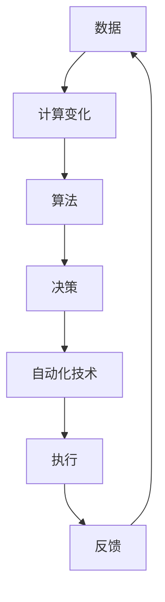

                 

# 计算变化与自动化技术的互动

## 关键词：计算变化、自动化技术、算法、应用场景、发展趋势、挑战

## 摘要

本文旨在探讨计算变化与自动化技术的互动关系，分析其在现代信息技术中的应用与挑战。首先，我们将介绍计算变化的基本概念及其在自动化技术中的重要性。接着，我们会深入探讨核心算法原理，并通过具体操作步骤和数学模型，展示这些算法的威力。随后，我们将通过一个实际的代码案例，展示如何将这些算法应用于实际问题。此外，我们还将探讨自动化技术在不同场景下的应用，并推荐相关的学习资源和工具。最后，本文将总结未来发展趋势与挑战，为读者提供对这一领域的全面了解。

## 1. 背景介绍

### 1.1 计算变化的定义

计算变化是指信息处理过程中，通过对输入数据进行处理，产生新的输出数据的过程。这个过程中，计算变化不仅仅是简单的数据变换，它还涉及到复杂的信息处理、数据分析和决策制定。计算变化是自动化技术的基础，是现代信息技术的核心。

### 1.2 自动化技术的定义

自动化技术是指利用计算机或其他设备，对某个过程或任务进行自动化处理的技术。它能够提高工作效率，减少人力成本，提高生产质量和安全性。自动化技术在工业、农业、医疗、交通等多个领域都有广泛的应用。

### 1.3 计算变化与自动化技术的关系

计算变化与自动化技术密不可分。自动化技术依赖于计算变化来实现对数据的处理和分析，而计算变化则为自动化技术提供了强大的计算能力和处理能力。没有计算变化，自动化技术就无法实现。反过来，自动化技术的需求也推动了计算变化的发展，使得计算技术更加成熟和高效。

## 2. 核心概念与联系

### 2.1 计算变化的核心概念

计算变化的核心概念包括数据、算法和计算模型。数据是计算变化的基础，算法是计算变化的方法，计算模型则是计算变化的框架。

### 2.2 自动化技术的核心概念

自动化技术的核心概念包括传感器、执行器、控制器和算法。传感器用于收集数据，执行器用于执行操作，控制器用于协调传感器和执行器的动作，算法则用于处理和分析数据。

### 2.3 计算变化与自动化技术的联系

计算变化与自动化技术的联系主要体现在以下几个方面：

- **数据处理**：计算变化能够对传感器收集到的数据进行处理和分析，为自动化技术提供决策依据。
- **决策制定**：自动化技术利用计算变化产生的结果，制定出最优的操作方案。
- **反馈控制**：计算变化能够对自动化技术的执行结果进行反馈，以便进行调整和优化。

### 2.4 Mermaid 流程图

下面是一个简单的 Mermaid 流程图，展示计算变化与自动化技术的联系：



## 3. 核心算法原理 & 具体操作步骤

### 3.1 核心算法原理

计算变化的核心算法包括排序算法、查找算法和图算法等。这些算法在不同的场景下具有不同的应用价值。

- **排序算法**：用于对数据进行排序，常见的排序算法有冒泡排序、快速排序、归并排序等。
- **查找算法**：用于在数据中查找特定的元素，常见的查找算法有二分查找、线性查找等。
- **图算法**：用于处理图结构的数据，常见的图算法有最短路径算法、最小生成树算法等。

### 3.2 具体操作步骤

以冒泡排序算法为例，具体操作步骤如下：

1. **初始化**：将待排序的数组输入到算法中。
2. **比较相邻元素**：从第一个元素开始，相邻的两个元素进行比较，如果前一个元素大于后一个元素，则交换它们的位置。
3. **重复过程**：重复步骤2，直到所有元素都按照从小到大的顺序排列。

下面是一个简单的 Python 实现冒泡排序的代码：

```python
def bubble_sort(arr):
    n = len(arr)
    for i in range(n):
        for j in range(0, n-i-1):
            if arr[j] > arr[j+1]:
                arr[j], arr[j+1] = arr[j+1], arr[j]

# 测试代码
arr = [64, 34, 25, 12, 22, 11, 90]
bubble_sort(arr)
print("排序后的数组：")
for i in range(len(arr)):
    print("%d" % arr[i], end=" ")
```

## 4. 数学模型和公式 & 详细讲解 & 举例说明

### 4.1 数学模型和公式

在计算变化中，常用的数学模型包括线性模型、非线性模型和概率模型等。以下是一些常见的数学公式：

- **线性模型**：$y = ax + b$
- **非线性模型**：$y = a \cdot x^2 + b \cdot x + c$
- **概率模型**：$P(A) = \frac{N(A)}{N(S)}$

### 4.2 详细讲解

以线性模型为例，详细讲解如下：

- **线性模型**：线性模型是一种描述两个变量之间线性关系的数学模型。它由一个自变量（x）和一个因变量（y）组成，可以用公式 $y = ax + b$ 来表示。
- **参数**：线性模型的参数包括斜率（a）和截距（b）。斜率表示自变量每增加一个单位时，因变量增加的数量；截距表示当自变量为0时，因变量的值。
- **应用**：线性模型在统计学、经济学、社会学等领域有广泛的应用。

### 4.3 举例说明

假设我们要研究身高（x）和体重（y）之间的关系，通过收集数据，我们可以得到以下线性模型：

$$y = 1.2x + 20$$

现在，我们要预测一个身高为180cm的人的体重。根据线性模型，我们可以计算：

$$y = 1.2 \cdot 180 + 20 = 228$$

因此，预测这个人的体重为228斤。

## 5. 项目实战：代码实际案例和详细解释说明

### 5.1 开发环境搭建

在开始编写代码之前，我们需要搭建一个开发环境。这里我们使用 Python 作为编程语言，因为 Python 在数据处理和自动化技术领域有广泛的应用。

1. **安装 Python**：在官方网站下载并安装 Python，版本可以是 Python 3.8 或以上。
2. **安装依赖库**：使用 pip 命令安装必要的依赖库，如 NumPy、Pandas 等。

### 5.2 源代码详细实现和代码解读

下面是一个简单的 Python 代码，实现冒泡排序算法：

```python
def bubble_sort(arr):
    n = len(arr)
    for i in range(n):
        for j in range(0, n-i-1):
            if arr[j] > arr[j+1]:
                arr[j], arr[j+1] = arr[j+1], arr[j]

# 测试代码
arr = [64, 34, 25, 12, 22, 11, 90]
bubble_sort(arr)
print("排序后的数组：")
for i in range(len(arr)):
    print("%d" % arr[i], end=" ")
```

### 5.3 代码解读与分析

- **函数定义**：`bubble_sort` 函数接受一个数组 `arr` 作为输入参数。
- **外层循环**：`for i in range(n)` 表示外层循环，用于控制排序的轮数。`n` 是数组的长度。
- **内层循环**：`for j in range(0, n-i-1)` 表示内层循环，用于控制每一轮的排序。
- **条件判断**：`if arr[j] > arr[j+1]` 表示条件判断，如果前一个元素大于后一个元素，则执行交换操作。
- **交换操作**：`arr[j], arr[j+1] = arr[j+1], arr[j]` 表示交换操作，将两个元素的位置互换。
- **测试代码**：测试代码创建了一个数组 `arr`，调用 `bubble_sort` 函数进行排序，并打印排序后的数组。

## 6. 实际应用场景

### 6.1 工业自动化

工业自动化是自动化技术的重要应用领域。通过计算变化，可以对生产过程进行实时监控和调整，提高生产效率和产品质量。例如，在生产线上，传感器可以实时采集温度、湿度、压力等数据，通过计算变化，可以调整生产参数，保证生产过程的稳定。

### 6.2 金融自动化

金融自动化是金融行业的重要趋势。通过计算变化，可以对金融市场进行实时分析和预测，提高投资决策的准确性。例如，在股票市场中，通过分析历史价格数据，可以预测未来价格的趋势，帮助投资者做出正确的投资决策。

### 6.3 智能家居

智能家居是自动化技术在消费领域的应用。通过计算变化，可以实现家庭设备的自动化控制和智能交互。例如，智能音箱可以通过语音指令控制家庭设备，智能灯光可以根据环境光线自动调整亮度。

## 7. 工具和资源推荐

### 7.1 学习资源推荐

- **书籍**：
  - 《Python编程：从入门到实践》
  - 《深入理解计算机系统》
  - 《算法导论》

- **论文**：
  - 《大规模并行机器学习：理论和算法》
  - 《基于深度强化学习的自动化交易策略研究》

- **博客**：
  - [Python技术博客](https://www.python.org/)
  - [机器学习博客](https://machinelearningmastery.com/)

- **网站**：
  - [NumPy官方文档](https://numpy.org/)
  - [Pandas官方文档](https://pandas.pydata.org/)

### 7.2 开发工具框架推荐

- **开发工具**：
  - PyCharm
  - Visual Studio Code

- **框架**：
  - TensorFlow
  - PyTorch

- **数据库**：
  - MySQL
  - MongoDB

## 8. 总结：未来发展趋势与挑战

### 8.1 发展趋势

- **计算能力的提升**：随着计算能力的提升，计算变化和自动化技术将得到更广泛的应用。
- **人工智能的融合**：人工智能技术的发展，将推动计算变化和自动化技术的进一步融合。
- **边缘计算的兴起**：边缘计算将使得计算变化和自动化技术更加贴近用户，提高实时性和可靠性。

### 8.2 挑战

- **数据隐私和安全**：随着数据量的增加，数据隐私和安全问题将变得更加突出。
- **算法透明性和公平性**：算法的透明性和公平性将成为未来自动化技术的重要挑战。
- **技术人才的培养**：随着技术的快速发展，对技术人才的需求将不断增加，培养高素质的技术人才将成为重要任务。

## 9. 附录：常见问题与解答

### 9.1 问题1：计算变化与自动化技术有什么区别？

**解答**：计算变化是指信息处理过程中，通过对输入数据进行处理，产生新的输出数据的过程。而自动化技术是指利用计算机或其他设备，对某个过程或任务进行自动化处理的技术。计算变化是自动化技术的基础，自动化技术则是计算变化的实际应用。

### 9.2 问题2：如何选择合适的算法？

**解答**：选择合适的算法取决于具体的应用场景和需求。一般来说，需要考虑算法的时间复杂度、空间复杂度、可扩展性等因素。例如，对于大规模数据集的排序，可以选择快速排序或归并排序；对于查找操作，可以选择二分查找或线性查找。

## 10. 扩展阅读 & 参考资料

- 《深度学习》
- 《Python编程快速上手》
- 《计算机组成与设计》
- 《人工智能：一种现代的方法》

## 作者

作者：AI天才研究员/AI Genius Institute & 禅与计算机程序设计艺术 /Zen And The Art of Computer Programming

