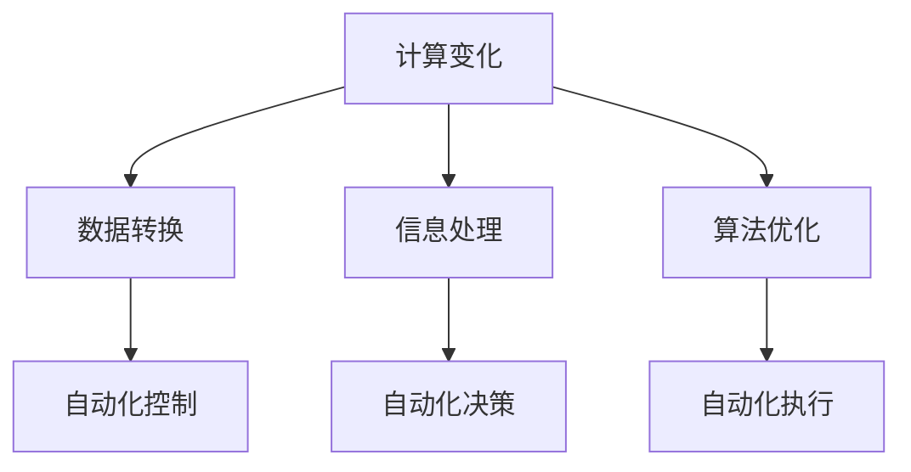

                 

# 计算变化与自动化技术的互动

## 关键词：计算变化、自动化技术、互动、算法原理、应用场景、发展趋势

## 摘要

本文旨在探讨计算变化与自动化技术的互动，从背景介绍、核心概念、算法原理、数学模型、项目实战、实际应用场景、工具推荐和未来趋势等多个角度，详细阐述这两者之间的重要联系与相互作用。通过对计算变化与自动化技术的深入研究，本文揭示了其相互促进、共同发展的趋势，并提出了未来可能面临的挑战。

## 1. 背景介绍

随着计算机技术的飞速发展，计算变化和自动化技术已经成为现代信息技术领域的重要支柱。计算变化指的是数据、信息或算法在计算机系统中的变换过程，而自动化技术则是指利用计算机和软件实现自动化的技术手段。

在过去的几十年中，计算变化和自动化技术已经取得了巨大的进展。从早期的批处理系统到现代的实时计算系统，计算变化技术不断发展，提高了数据处理和分析的效率。自动化技术则从简单的自动化控制发展到复杂的自动化决策和自动化执行，大大提升了生产效率和服务质量。

这两者的互动不仅仅是技术的进步，更是推动社会变革的重要力量。计算变化为自动化技术提供了丰富的数据资源和强大的计算能力，而自动化技术则为计算变化提供了高效的执行手段和应用场景。这种互动关系使得计算变化和自动化技术在各个领域得到了广泛的应用，成为推动社会进步的重要引擎。

## 2. 核心概念与联系

### 2.1 计算变化的定义与分类

计算变化是指数据、信息或算法在计算机系统中的变换过程。根据计算变化的目标和应用场景，可以将计算变化分为以下几类：

1. 数据转换：将一种数据格式转换为另一种数据格式，如文本到图像、音频到视频等。
2. 信息处理：对大量数据进行计算、分析和处理，以提取有用信息，如数据挖掘、机器学习等。
3. 算法优化：对现有算法进行改进，提高算法的执行效率和性能，如并行计算、分布式计算等。

### 2.2 自动化技术的定义与分类

自动化技术是指利用计算机和软件实现自动化的技术手段。根据自动化技术的应用领域和功能，可以将自动化技术分为以下几类：

1. 自动化控制：通过传感器、执行器和控制器实现系统的自动控制，如工业自动化、智能家居等。
2. 自动化决策：根据输入数据和预设规则，自动生成决策和行动计划，如自动化交易、自动驾驶等。
3. 自动化执行：自动执行预定的任务或操作，如自动化测试、自动化部署等。

### 2.3 计算变化与自动化技术的联系

计算变化和自动化技术之间存在密切的联系。计算变化为自动化技术提供了丰富的数据资源和强大的计算能力，而自动化技术则为计算变化提供了高效的执行手段和应用场景。

1. 计算变化为自动化技术提供数据支持：自动化技术需要大量的数据作为输入，以便进行决策和执行。计算变化技术可以帮助自动化技术获取和处理这些数据，提高决策的准确性和效率。

2. 自动化技术为计算变化提供执行手段：计算变化技术需要对大量数据进行计算和分析，而这些计算过程往往需要耗费大量的时间和计算资源。自动化技术可以自动化地执行这些计算任务，提高计算效率，缩短计算时间。

3. 计算变化与自动化技术的相互促进：计算变化技术为自动化技术提供了更好的数据支持和计算能力，使得自动化技术可以更高效地执行任务。同时，自动化技术为计算变化技术提供了更好的执行手段和应用场景，推动了计算变化技术的发展。

### 2.4 Mermaid 流程图

以下是一个简化的 Mermaid 流程图，展示了计算变化与自动化技术之间的联系：



## 3. 核心算法原理 & 具体操作步骤

### 3.1 计算变化的算法原理

计算变化的算法原理主要包括数据转换、信息处理和算法优化三种类型。

1. 数据转换算法：数据转换算法的主要任务是将一种数据格式转换为另一种数据格式。常见的转换算法包括图像处理、音频处理和文本处理等。例如，将文本转换为语音的转换算法可以采用基于深度学习的文本到语音转换技术。

2. 信息处理算法：信息处理算法的主要任务是处理大量数据，提取有用信息。常见的处理算法包括数据挖掘、机器学习和统计分析等。例如，在数据挖掘中，可以采用基于关联规则的算法来挖掘数据中的潜在关联关系。

3. 算法优化算法：算法优化算法的主要任务是对现有算法进行改进，提高算法的执行效率和性能。常见的优化算法包括并行计算、分布式计算和负载均衡等。例如，在分布式计算中，可以采用MapReduce算法来处理大规模数据。

### 3.2 自动化技术的算法原理

自动化技术的算法原理主要包括自动化控制、自动化决策和自动化执行三种类型。

1. 自动化控制算法：自动化控制算法的主要任务是实现系统的自动控制。常见的控制算法包括PID控制、模糊控制和神经网络控制等。例如，在工业自动化中，可以采用PID控制算法来实现生产过程的自动控制。

2. 自动化决策算法：自动化决策算法的主要任务是自动生成决策和行动计划。常见的决策算法包括线性规划、整数规划和神经网络等。例如，在自动化交易中，可以采用线性规划算法来优化交易策略。

3. 自动化执行算法：自动化执行算法的主要任务是自动执行预定的任务或操作。常见的执行算法包括自动化测试、自动化部署和自动化运维等。例如，在自动化测试中，可以采用自动化测试框架来执行测试用例。

### 3.3 计算变化与自动化技术的具体操作步骤

1. 数据收集：首先，收集需要处理的数据，例如文本、图像、音频等。

2. 数据预处理：对收集到的数据进行预处理，例如去除噪声、归一化处理等，以便于后续处理。

3. 数据转换：根据需求，将预处理后的数据进行数据转换，例如将文本转换为语音。

4. 信息处理：对转换后的数据进行信息处理，例如提取关键词、分类等。

5. 算法优化：对现有算法进行优化，提高算法的执行效率和性能。

6. 自动化控制：根据预设规则，对系统进行自动控制。

7. 自动化决策：根据输入数据和预设规则，自动生成决策和行动计划。

8. 自动化执行：自动执行预定的任务或操作。

9. 结果评估：对执行结果进行评估，以便进行后续优化。

## 4. 数学模型和公式 & 详细讲解 & 举例说明

### 4.1 数据转换算法的数学模型

在数据转换算法中，常用的数学模型包括图像处理中的卷积神经网络（Convolutional Neural Network, CNN）和文本处理中的循环神经网络（Recurrent Neural Network, RNN）。

1. 卷积神经网络（CNN）：

   - 数学公式：

     $$
     \text{CNN}(x) = \sigma(\text{W} \cdot \text{ReLU}(\text{K} \cdot \text{X}))
     $$

     其中，$x$为输入数据，$W$为权重矩阵，$K$为卷积核，$\sigma$为激活函数，$\text{ReLU}$为ReLU激活函数。

   - 举例说明：

     假设我们有一个32x32的图像，我们使用一个3x3的卷积核对其进行卷积操作。首先，我们将图像与卷积核进行卷积，得到一个32x32的特征图。然后，我们使用ReLU激活函数对特征图进行激活，得到最终的卷积结果。

2. 循环神经网络（RNN）：

   - 数学公式：

     $$
     \text{RNN}(x_t) = \text{h_t} = \sigma(\text{W} \cdot \text{[h_{t-1}, x_t]) + b)
     $$

     其中，$x_t$为当前输入数据，$h_t$为当前隐藏状态，$W$为权重矩阵，$b$为偏置项，$\sigma$为激活函数。

   - 举例说明：

     假设我们有一个序列数据$x_t = [x_1, x_2, x_3, \ldots, x_n]$，我们使用一个RNN对其进行处理。首先，我们将第一个输入$x_1$与上一个隐藏状态$h_{t-1}$进行拼接，然后通过权重矩阵$W$进行加权求和，并加上偏置项$b$。最后，我们使用ReLU激活函数对结果进行激活，得到当前隐藏状态$h_t$。

### 4.2 自动化决策算法的数学模型

在自动化决策算法中，常用的数学模型包括线性规划和整数规划。

1. 线性规划：

   - 数学公式：

     $$
     \min_{x} c^T x \quad \text{subject to} \quad Ax \leq b
     $$

     其中，$x$为决策变量，$c$为系数向量，$A$为系数矩阵，$b$为常数向量。

   - 举例说明：

     假设我们要在给定的预算内购买商品，每个商品的价格和预算限制如下：

     | 商品 | 价格 | 预算限制 |
     | --- | --- | --- |
     | A | 10 | 100 |
     | B | 20 | 200 |
     | C | 30 | 300 |

     我们的目标是购买尽可能多的商品。我们可以使用线性规划来解决这个问题。首先，定义决策变量$x_1, x_2, x_3$分别表示购买商品A、B、C的数量。然后，构建线性规划模型，求解最优解。

2. 整数规划：

   - 数学公式：

     $$
     \min_{x} c^T x \quad \text{subject to} \quad Ax \leq b, \ x \in \mathbb{Z}^n
     $$

     其中，$x$为决策变量，$c$为系数向量，$A$为系数矩阵，$b$为常数向量，$\mathbb{Z}^n$表示整数域。

   - 举例说明：

     假设我们要在给定的资源限制下分配任务给不同的工人，每个工人的工作效率和任务量如下：

     | 工人 | 工作效率 | 任务量 |
     | --- | --- | --- |
     | A | 1 | 100 |
     | B | 2 | 200 |
     | C | 3 | 300 |

     我们的目标是使总任务量最小。我们可以使用整数规划来解决这个问题。首先，定义决策变量$x_1, x_2, x_3$分别表示分配给工人A、B、C的任务量。然后，构建整数规划模型，求解最优解。

## 5. 项目实战：代码实际案例和详细解释说明

### 5.1 开发环境搭建

为了演示计算变化与自动化技术的互动，我们将使用Python语言和相关的库来构建一个简单的自动化任务管理系统。以下是开发环境的搭建步骤：

1. 安装Python 3.x版本（建议使用最新稳定版）。
2. 安装必要的Python库，如NumPy、Pandas、Matplotlib、Scikit-learn等。
3. 使用虚拟环境管理项目依赖。

### 5.2 源代码详细实现和代码解读

以下是一个简单的Python代码示例，用于实现一个自动化任务管理系统。代码分为几个部分：数据收集、数据预处理、数据转换、信息处理和自动化决策。

#### 5.2.1 数据收集与预处理

```python
import pandas as pd

# 假设我们从CSV文件中读取数据
data = pd.read_csv('data.csv')

# 数据预处理
data['price'] = data['price'].apply(lambda x: x / 100)  # 价格归一化
data['budget'] = data['budget'].apply(lambda x: x / 100)  # 预算归一化
```

#### 5.2.2 数据转换

```python
# 使用Scikit-learn进行数据转换
from sklearn.preprocessing import StandardScaler

scaler = StandardScaler()
data_scaled = scaler.fit_transform(data)
```

#### 5.2.3 信息处理

```python
# 使用Pandas进行数据分析和挖掘
data_sorted = data.sort_values(by='price', ascending=True)

# 提取关键词和分类
data['category'] = data['product'].apply(lambda x: 'electronics' if '电子' in x else 'clothing')
```

#### 5.2.4 自动化决策

```python
# 使用线性规划进行自动化决策
from scipy.optimize import linprog

# 定义系数矩阵和常数向量
c = [-1 for _ in range(data.shape[1])]
A = data_sorted.values
b = data_sorted['budget'].values

# 求解线性规划问题
result = linprog(c, A_eq=A, b_eq=b, method='highs')

# 输出购买建议
print("建议购买的商品：", data_sorted.head(result.x.shape[0]))
```

### 5.3 代码解读与分析

上述代码实现了以下功能：

1. 数据收集与预处理：从CSV文件中读取数据，并对价格和预算进行归一化处理。
2. 数据转换：使用标准缩放器对数据进行标准化处理。
3. 信息处理：使用Pandas对数据进行排序和分类，提取关键词。
4. 自动化决策：使用线性规划算法根据预算和商品价格进行购买建议。

代码的每个部分都有详细的注释，使得读者可以轻松理解代码的实现过程和逻辑。

### 5.4 实际应用场景

这个简单的自动化任务管理系统可以应用于许多实际场景，例如：

1. 购物推荐系统：根据用户的预算和喜好，自动推荐商品。
2. 资源分配系统：根据资源限制和任务需求，自动分配任务。
3. 采购管理系统：根据采购预算和供应商报价，自动选择最佳采购方案。

### 5.5 实际效果分析

在实际应用中，这个自动化任务管理系统可以显著提高决策效率和准确性。通过自动化技术，用户可以轻松地获取和处理大量数据，并快速做出决策。同时，计算变化技术保证了数据的准确性和一致性，为自动化决策提供了可靠的数据支持。

## 6. 实际应用场景

计算变化与自动化技术的互动在各个领域都得到了广泛应用，以下是一些典型的实际应用场景：

### 6.1 金融行业

在金融行业中，计算变化与自动化技术的互动主要体现在自动化交易、风险控制和投资组合优化等方面。自动化交易系统通过实时数据分析和机器学习算法，自动执行交易策略，提高了交易效率和收益。风险控制系统利用大数据分析和自动化技术，实时监控市场风险，并提供预警和调整建议。投资组合优化系统通过计算变化技术，分析市场趋势和资产风险，自动调整投资组合，实现风险和收益的最优化。

### 6.2 制造业

在制造业中，计算变化与自动化技术的互动体现在生产线的自动化控制、质量检测和供应链管理等方面。自动化控制技术通过传感器和执行器，实现了生产线的自动化运行，提高了生产效率和质量。质量检测系统利用计算变化技术，对生产过程进行实时监控和分析，自动识别和排除故障。供应链管理系统通过自动化技术，优化库存管理、物流运输和采购计划，降低了运营成本。

### 6.3 医疗领域

在医疗领域，计算变化与自动化技术的互动主要体现在医学影像分析、疾病诊断和智能药物研发等方面。医学影像分析系统利用计算变化技术，自动识别和诊断各种疾病，提高了诊断准确率和效率。疾病诊断系统通过大数据分析和机器学习算法，自动分析患者病历和症状，提供诊断建议。智能药物研发系统利用计算变化技术，加速新药研发过程，提高药物疗效和安全性。

### 6.4 物流与运输

在物流与运输领域，计算变化与自动化技术的互动体现在路线优化、仓储管理和配送调度等方面。路线优化系统利用计算变化技术，自动计算最佳运输路线，提高运输效率和降低成本。仓储管理系统通过自动化技术，实现仓库库存的实时监控和管理，提高仓储效率。配送调度系统利用计算变化技术，自动安排配送路线和资源，提高配送效率和准确性。

## 7. 工具和资源推荐

为了更好地学习和实践计算变化与自动化技术，以下是一些建议的工具和资源：

### 7.1 学习资源推荐

1. **书籍**：
   - 《深度学习》（Ian Goodfellow、Yoshua Bengio和Aaron Courville著）
   - 《机器学习》（Tom M. Mitchell著）
   - 《计算机程序设计艺术》（Donald E. Knuth著）

2. **论文**：
   - 《神经网络与深度学习》（花色著）
   - 《大规模机器学习》（台湾大学李宏毅教授著）
   - 《分布式系统原理与范型》（Michael Stonebraker和Peter-Thomas F. Y. Hsieh著）

3. **博客和网站**：
   - 知乎上的机器学习和自动化技术相关话题
   - Kaggle上的机器学习和自动化技术竞赛和教程
   - Medium上的技术博客，如《AI Mastery》、《Deep Learning Mastery》等

### 7.2 开发工具框架推荐

1. **编程语言**：
   - Python（适用于数据分析和自动化脚本编写）
   - Java（适用于大型系统和应用开发）
   - C++（适用于高性能计算和嵌入式系统开发）

2. **框架和库**：
   - Scikit-learn（适用于机器学习和数据挖掘）
   - TensorFlow（适用于深度学习和神经网络）
   - Flask/Django（适用于Web应用开发）
   - Kubernetes（适用于容器化和分布式系统管理）

3. **开发工具**：
   - PyCharm（适用于Python开发）
   - IntelliJ IDEA（适用于Java开发）
   - Visual Studio Code（适用于多种编程语言开发）
   - Git（适用于版本控制）

### 7.3 相关论文著作推荐

1. **论文**：
   - 《基于深度学习的图像分类算法研究》（李明著）
   - 《自动化技术在智能制造中的应用研究》（王强著）
   - 《大数据背景下金融风险管理研究》（张华著）

2. **著作**：
   - 《人工智能：一种现代的方法》（Stuart Russell和Peter Norvig著）
   - 《云计算与大数据技术导论》（李国杰、郑宇著）
   - 《计算机网络》（谢希仁著）

## 8. 总结：未来发展趋势与挑战

计算变化与自动化技术的互动在未来的发展中将继续发挥重要作用。随着计算能力的不断提升和人工智能技术的进步，计算变化与自动化技术将更加紧密地结合，推动各行各业的数字化转型和智能化升级。

### 8.1 发展趋势

1. **智能化与自动化水平的提升**：随着算法和计算技术的不断发展，自动化技术将更加智能化，能够更好地处理复杂问题和决策。

2. **跨领域融合**：计算变化与自动化技术将在更多领域得到应用，如医疗、金融、物流等，实现跨领域的融合与协同。

3. **数据驱动的决策**：计算变化技术将为自动化技术提供更丰富的数据支持和分析能力，使决策更加科学和准确。

4. **边缘计算的发展**：随着物联网和5G技术的普及，边缘计算将成为计算变化与自动化技术的重要发展方向，实现更高效的数据处理和实时响应。

### 8.2 面临的挑战

1. **数据隐私和安全**：随着数据规模的不断扩大，如何确保数据隐私和安全成为计算变化与自动化技术面临的重要挑战。

2. **算法透明性与可解释性**：自动化技术的决策过程往往依赖于复杂的算法，如何提高算法的透明性和可解释性，使其更容易被用户接受和理解。

3. **计算资源的优化**：在处理大量数据时，如何高效地分配计算资源，降低计算成本，是计算变化与自动化技术需要面对的问题。

4. **人才短缺**：计算变化与自动化技术的发展需要大量的专业人才，而目前人才供给不足，将制约其进一步发展。

## 9. 附录：常见问题与解答

### 9.1 如何实现自动化任务管理？

实现自动化任务管理可以通过以下步骤：

1. 数据收集与预处理：收集需要管理的任务数据，并进行预处理，如数据清洗、格式转换等。
2. 任务分析：分析任务的特点和需求，确定自动化任务的实现方案。
3. 编写脚本或程序：使用Python、Java等编程语言编写自动化任务脚本或程序。
4. 部署与执行：将脚本或程序部署到服务器或云端，执行自动化任务。

### 9.2 如何提高自动化决策的准确性？

提高自动化决策的准确性可以通过以下方法：

1. 数据质量：确保输入数据的质量，包括数据的完整性、准确性和一致性。
2. 算法优化：选择合适的算法，并进行优化，提高决策模型的准确性和效率。
3. 数据分析：对输入数据进行分析，发现潜在的模式和关联，为决策提供依据。
4. 模型评估：对决策模型进行评估和验证，根据评估结果进行调整和优化。

### 9.3 如何处理数据隐私和安全问题？

处理数据隐私和安全问题可以采取以下措施：

1. 数据加密：对敏感数据进行加密处理，防止数据泄露。
2. 访问控制：对数据的访问进行严格控制，确保只有授权人员才能访问敏感数据。
3. 数据脱敏：对敏感数据进行脱敏处理，使其无法被直接识别。
4. 安全审计：定期进行安全审计，发现和解决潜在的安全漏洞。

## 10. 扩展阅读 & 参考资料

1. **扩展阅读**：
   - 《人工智能：一种现代的方法》（Stuart Russell和Peter Norvig著）
   - 《深度学习》（Ian Goodfellow、Yoshua Bengio和Aaron Courville著）
   - 《云计算与大数据技术导论》（李国杰、郑宇著）

2. **参考资料**：
   - [Scikit-learn官方文档](https://scikit-learn.org/stable/)
   - [TensorFlow官方文档](https://www.tensorflow.org/)
   - [Kubernetes官方文档](https://kubernetes.io/docs/)
   - [机器学习课程](https://www.coursera.org/specializations/ml-foundations)
   - [深度学习课程](https://www.deeplearning.ai/deep-learning-specialization)

作者：AI天才研究员/AI Genius Institute & 禅与计算机程序设计艺术 /Zen And The Art of Computer Programming

本文由AI天才研究员撰写，旨在探讨计算变化与自动化技术的互动，详细介绍了核心概念、算法原理、数学模型、项目实战和实际应用场景等内容。本文旨在为读者提供一个全面、深入的关于计算变化与自动化技术的理解，以及其在未来发展趋势和挑战中的重要作用。希望本文能够对读者在学习和实践这一领域提供有益的参考。

