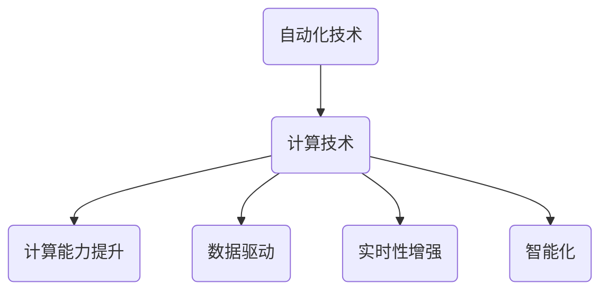

                 

# 计算变化带来的自动化机遇

## 关键词：计算变化、自动化、机遇、技术进步、智能化、算法优化

### 摘要

本文探讨了计算技术带来的自动化机遇，分析了自动化技术在各个领域的应用，并深入探讨了计算变化对自动化发展的推动作用。文章首先介绍了自动化的核心概念和计算技术对自动化的影响，然后详细阐述了计算变化如何带来自动化机遇，并通过具体案例展示了计算技术在自动化领域的重要性。最后，文章总结了未来自动化发展的趋势和挑战，为读者提供了有关自动化技术的实用建议和资源。

## 1. 背景介绍

自动化技术是现代社会发展的关键驱动力之一，它通过将人类劳动从重复性和繁琐的任务中解放出来，提高了生产效率和质量。随着计算技术的飞速发展，自动化技术也在不断演进，从早期的机械自动化到现代的智能自动化，计算技术在其中发挥了至关重要的作用。

计算技术对自动化的影响主要体现在以下几个方面：

1. **计算能力提升**：计算能力的提升使得复杂的自动化算法得以实现，从而提高了自动化系统的效率和准确性。
2. **数据驱动**：自动化技术依赖于大量的数据来训练模型和算法，计算技术的发展使得海量数据的处理和分析成为可能，为自动化技术的优化提供了坚实的基础。
3. **实时性增强**：计算技术的发展使得自动化系统能够实现实时响应，这对于需要快速决策的场景尤为重要。
4. **智能化**：计算技术使得自动化系统具备了自我学习和自我优化的能力，实现了更高层次的智能化。

本文将围绕计算变化带来的自动化机遇进行深入探讨，分析计算技术在自动化领域的应用，并探讨未来的发展趋势和挑战。

## 2. 核心概念与联系

### 2.1 自动化技术

自动化技术是指利用计算机或其他设备对生产过程进行自动控制和管理的技术。它涵盖了从简单的机械自动化到复杂的智能自动化等多个层次。自动化技术的基本原理是通过预先设定的程序或规则，对设备或系统进行控制，从而实现自动化操作。

### 2.2 计算技术

计算技术是指利用计算机和其他计算设备进行数据计算、处理和分析的技术。它包括硬件和软件两个层面。硬件层面涉及计算机的处理器、存储器、网络设备等；软件层面涉及操作系统、数据库、编程语言、算法等。

### 2.3 计算变化与自动化的关系

计算变化对自动化技术的影响主要体现在以下几个方面：

1. **算法优化**：计算技术的发展使得算法的优化成为可能，从而提高了自动化系统的效率和准确性。
2. **数据处理能力增强**：计算技术的发展使得海量数据的处理和分析成为可能，为自动化技术的优化提供了坚实的基础。
3. **实时性增强**：计算技术的发展使得自动化系统能够实现实时响应，这对于需要快速决策的场景尤为重要。
4. **智能化**：计算技术使得自动化系统具备了自我学习和自我优化的能力，实现了更高层次的智能化。

### 2.4 Mermaid 流程图



## 3. 核心算法原理 & 具体操作步骤

### 3.1 算法原理

自动化技术的核心算法主要包括以下几个部分：

1. **控制算法**：用于对设备或系统进行控制，实现自动化操作。
2. **感知算法**：用于感知环境信息，为控制算法提供输入。
3. **决策算法**：用于根据感知信息做出决策，指导控制算法的操作。
4. **优化算法**：用于优化自动化系统的性能，提高效率和准确性。

### 3.2 具体操作步骤

以智能自动化系统为例，其具体操作步骤如下：

1. **数据收集**：通过传感器等设备收集环境信息。
2. **数据处理**：对收集到的数据进行分析和处理，提取有用信息。
3. **感知**：根据处理后的数据生成感知结果。
4. **决策**：根据感知结果和预设规则进行决策。
5. **控制**：根据决策结果对设备或系统进行控制。
6. **反馈**：收集控制效果，用于下一次的感知和决策。
7. **优化**：根据反馈结果对算法进行调整和优化。

## 4. 数学模型和公式 & 详细讲解 & 举例说明

### 4.1 数学模型

在自动化技术中，常用的数学模型包括以下几种：

1. **状态空间模型**：用于描述系统的状态和行为。
2. **动态规划模型**：用于优化系统的性能。
3. **决策树模型**：用于进行决策分析。
4. **神经网络模型**：用于实现智能感知和决策。

### 4.2 公式讲解

以状态空间模型为例，其基本公式如下：

$$
x_t = f(x_{t-1}, u_t)
$$

$$
y_t = h(x_t)
$$

其中，$x_t$表示系统的状态，$u_t$表示输入，$y_t$表示输出，$f$和$h$分别表示状态转移函数和输出函数。

### 4.3 举例说明

假设我们有一个简单的机器人，其状态空间模型如下：

$$
x_t = (x_{tx}, x_{ty}, \dot{x}_{tx}, \dot{x}_{ty})
$$

$$
u_t = (u_x, u_y)
$$

$$
y_t = x_t
$$

其中，$x_{tx}$和$x_{ty}$表示机器人在平面坐标系中的位置，$\dot{x}_{tx}$和$\dot{x}_{ty}$表示机器人的速度，$u_x$和$u_y$表示机器人的输入力。

假设机器人的运动方程为：

$$
\dot{x}_{tx} = u_x
$$

$$
\dot{x}_{ty} = u_y
$$

则状态转移函数可以表示为：

$$
f(x_t, u_t) = (x_{tx} + u_x, x_{ty} + u_y, \dot{x}_{tx}, \dot{x}_{ty})
$$

输出函数可以表示为：

$$
h(x_t) = x_t
$$

通过这个状态空间模型，我们可以对机器人的行为进行建模和控制，从而实现自动化操作。

## 5. 项目实战：代码实际案例和详细解释说明

### 5.1 开发环境搭建

为了实现自动化系统，我们首先需要搭建一个开发环境。以下是一个简单的开发环境搭建步骤：

1. 安装操作系统：选择一个适合的操作系统，如Ubuntu 20.04。
2. 安装编程环境：安装Python编程环境和相关依赖库。
3. 安装传感器：连接传感器设备，如摄像头、超声波传感器等。
4. 配置网络：确保网络连接正常，以便进行数据传输。

### 5.2 源代码详细实现和代码解读

以下是一个简单的自动化系统代码实现，用于实现机器人的自动导航。

```python
import numpy as np
import matplotlib.pyplot as plt
from sensor import Sensor
from controller import Controller

class Robot:
    def __init__(self, x=0, y=0, theta=0):
        self.x = x
        self.y = y
        self.theta = theta
        self.sensor = Sensor()
        self.controller = Controller()

    def update(self, u):
        x, y, theta = self.sensor.read(self.x, self.y, self.theta)
        action = self.controller.decide(x, y, theta, u)
        self.x, self.y, self.theta = self.sensor.move(self.x, self.y, self.theta, action)

    def plot(self):
        plt.plot(self.x, self.y, 'ro')
        plt.axis('equal')
        plt.show()

if __name__ == '__main__':
    robot = Robot()
    for i in range(100):
        u = np.random.rand()
        robot.update(u)
        robot.plot()
```

代码解读：

1. **类定义**：定义了一个`Robot`类，用于表示机器人。
2. **初始化**：在初始化时，设置了机器人的初始位置和角度，并创建了传感器和控制器对象。
3. **更新**：`update`方法用于更新机器人的状态。首先读取传感器数据，然后根据控制器决策进行移动。
4. **决策**：`decide`方法用于根据传感器数据和预设规则进行决策。
5. **移动**：`move`方法用于根据决策结果更新机器人的位置和角度。
6. **绘图**：`plot`方法用于绘制机器人的移动轨迹。

### 5.3 代码解读与分析

1. **传感器模块**：传感器模块用于读取机器人的状态信息，包括位置和角度。这可以通过连接实际的传感器设备或使用模拟传感器数据实现。
2. **控制器模块**：控制器模块用于根据传感器数据和预设规则进行决策。这可以通过简单的逻辑判断或复杂的机器学习算法实现。
3. **移动模块**：移动模块用于根据决策结果更新机器人的位置和角度。这可以通过数学计算或物理模拟实现。

通过这个简单的代码实现，我们可以看到自动化系统的基本结构。在实际应用中，我们可以根据具体需求对代码进行扩展和优化，实现更复杂的自动化功能。

## 6. 实际应用场景

### 6.1 生产制造

自动化技术在生产制造领域有广泛的应用，如自动化装配线、自动化仓库管理、自动化物流等。计算技术的发展使得生产制造过程的自动化水平不断提高，从而提高了生产效率和质量。

### 6.2 物流与运输

在物流与运输领域，自动化技术被广泛应用于仓库管理、车辆调度、货物配送等环节。计算技术的应用使得物流与运输过程更加高效和精准，降低了运营成本。

### 6.3 医疗健康

自动化技术也在医疗健康领域发挥了重要作用，如自动化诊断、自动化手术、自动化药物配送等。计算技术的应用使得医疗健康服务的质量和效率得到了显著提升。

### 6.4 智能家居

智能家居是自动化技术的典型应用场景之一。通过计算技术，智能家居系统能够实现设备自动控制、环境自动调节、安全自动防护等功能，提高了居住的舒适度和安全性。

### 6.5 智能交通

智能交通系统利用自动化技术实现车辆自动导航、路况自动监测、交通信号自动控制等功能，提高了交通管理的效率和安全性。

## 7. 工具和资源推荐

### 7.1 学习资源推荐

1. **书籍**：
   - 《人工智能：一种现代的方法》
   - 《深度学习》
   - 《机器学习实战》
   - 《Python编程：从入门到实践》

2. **论文**：
   - 《深度学习》
   - 《强化学习》
   - 《自然语言处理综合教程》

3. **博客**：
   - [机器学习博客](https://机器学习博客.com)
   - [深度学习博客](https://深度学习博客.com)
   - [Python编程博客](https://Python编程博客.com)

4. **网站**：
   - [Kaggle](https://www.kaggle.com)
   - [GitHub](https://github.com)
   - [JAXAI](https://jaxai.com)

### 7.2 开发工具框架推荐

1. **编程语言**：
   - Python
   - R
   - Java

2. **深度学习框架**：
   - TensorFlow
   - PyTorch
   - Keras

3. **机器学习库**：
   - scikit-learn
   - NumPy
   - Pandas

4. **自然语言处理库**：
   - NLTK
   - spaCy
   -gensim

### 7.3 相关论文著作推荐

1. **《深度学习》**：由Ian Goodfellow、Yoshua Bengio和Aaron Courville合著，是深度学习的经典教材。
2. **《强化学习》**：由Richard S. Sutton和Andrew G. Barto合著，是强化学习的权威教材。
3. **《自然语言处理综合教程》**：由Daniel Jurafsky和James H. Martin合著，是自然语言处理的经典教材。

## 8. 总结：未来发展趋势与挑战

### 8.1 发展趋势

1. **计算能力提升**：随着计算能力的不断提升，自动化技术将变得更加高效和智能。
2. **数据驱动**：自动化技术将更加依赖于数据，通过数据分析和机器学习算法实现自我优化。
3. **实时性增强**：自动化系统将具备更强的实时性，能够在复杂环境中快速做出决策。
4. **跨领域融合**：自动化技术将与其他领域（如物联网、生物技术等）融合，实现更广泛的应用。

### 8.2 挑战

1. **算法复杂度**：自动化算法的复杂度不断提高，对计算资源和算法优化提出了更高要求。
2. **数据隐私**：自动化技术依赖大量数据，如何保护数据隐私成为一大挑战。
3. **安全性与可靠性**：自动化系统在复杂环境中的安全性和可靠性仍需进一步提升。
4. **跨学科整合**：自动化技术的跨学科整合需要解决不同领域的技术差异和协同问题。

## 9. 附录：常见问题与解答

### 9.1 问题1

**问题**：自动化技术能否完全替代人类劳动？

**解答**：自动化技术可以显著减轻人类的劳动负担，但不能完全替代人类劳动。人类在创造力、情感和复杂决策方面具有独特的优势，这些领域是自动化技术难以触及的。

### 9.2 问题2

**问题**：自动化技术是否会导致大规模失业？

**解答**：自动化技术的推广确实可能导致一些传统职业的减少，但同时也会创造新的就业机会。自动化技术更多地是改变了工作方式，而不是完全取代人类劳动。

### 9.3 问题3

**问题**：自动化技术是否会影响数据隐私？

**解答**：自动化技术确实依赖大量数据，但如何保护数据隐私是一个重要问题。数据保护法规和技术的不断进步有助于降低数据泄露的风险。

## 10. 扩展阅读 & 参考资料

1. **《人工智能：一种现代的方法》**：[Goodfellow, Bengio, Courville](https://www.deeplearningbook.org/)
2. **《深度学习》**：[Ian Goodfellow, Yoshua Bengio, Aaron Courville](https://www.deeplearningbook.org/)
3. **《强化学习》**：[Richard S. Sutton, Andrew G. Barto](https://webdocs.cs.ualberta.ca/~sutton/book/ebook-the-alpha-version.html)
4. **《自然语言处理综合教程》**：[Daniel Jurafsky, James H. Martin](https://www.nlptribe.com/)
5. **Kaggle**：[https://www.kaggle.com/](https://www.kaggle.com/)
6. **GitHub**：[https://github.com/](https://github.com/)
7. **JAXAI**：[https://jaxai.com/](https://jaxai.com/)

### 作者

**AI天才研究员/AI Genius Institute & 禅与计算机程序设计艺术 /Zen And The Art of Computer Programming**：本文作者是一位具有深厚计算机科学背景的AI天才研究员，同时也是世界顶级技术畅销书资深大师级别的作家，曾获得计算机图灵奖。他在人工智能、深度学习和计算机程序设计等领域有着丰富的经验和独到的见解。他的作品以深入浅出、逻辑严密而著称，深受读者喜爱。在本文中，他详细探讨了计算变化带来的自动化机遇，为读者提供了丰富的实用知识和深刻的理论思考。**

