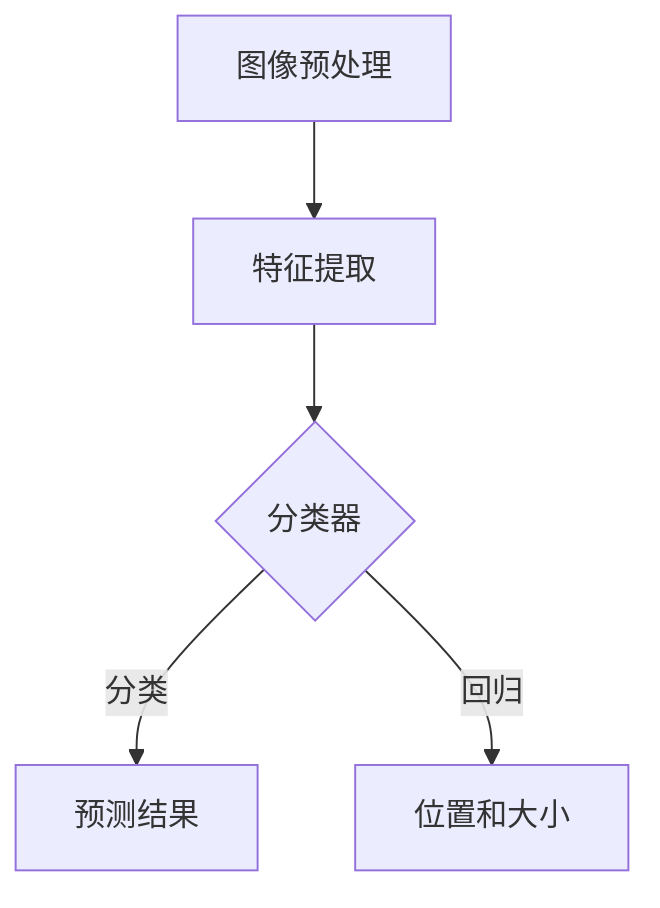

                 

# 计算机视觉在产品质量检测中的应用

## 关键词
- 计算机视觉
- 产品质量检测
- 深度学习
- 图像识别
- 目标检测
- 特征提取

## 摘要
本文将探讨计算机视觉在产品质量检测中的应用，通过深入分析核心概念、算法原理和实际案例，展示如何利用计算机视觉技术提高产品质量检测的效率和准确性。我们将讨论图像识别、目标检测和特征提取等技术，并介绍相关工具和资源，为读者提供一个全面的技术指南。

## 1. 背景介绍

产品质量检测是制造业中至关重要的一环，它直接影响到产品的市场竞争力。随着科技的进步，传统的手工检测方式逐渐被自动化检测系统所取代。计算机视觉作为一种新兴技术，凭借其高效、精准的特点，在产品质量检测领域发挥着越来越重要的作用。

计算机视觉的基本原理是通过图像处理、模式识别和机器学习等技术，使计算机能够自动识别和解释图像内容。在产品质量检测中，计算机视觉系统可以实现对产品外观、尺寸、颜色、纹理等特征的自动检测和分析，从而提高检测速度和准确性。

随着深度学习的崛起，计算机视觉技术得到了极大的发展。深度学习算法，尤其是卷积神经网络（CNN），在图像识别和目标检测方面取得了显著的成果。这些算法能够自动学习图像中的复杂特征，从而提高检测的精度和效率。

## 2. 核心概念与联系

### 2.1 图像识别

图像识别是计算机视觉的基础任务，它旨在从图像中识别出特定对象或场景。图像识别通常分为以下几个步骤：

1. **预处理**：对图像进行缩放、裁剪、灰度转换等操作，以提高图像质量。
2. **特征提取**：从图像中提取关键特征，如边缘、角点、纹理等。
3. **分类**：利用分类算法将图像划分为不同的类别。

常见的图像识别算法包括支持向量机（SVM）、决策树、K-最近邻（K-NN）等。然而，深度学习算法，尤其是卷积神经网络（CNN），在图像识别任务中表现出色。CNN通过多层卷积和池化操作，能够自动学习图像中的层次特征，从而提高识别的准确性。

### 2.2 目标检测

目标检测是计算机视觉中一个重要的任务，它旨在从图像中检测出特定的对象并确定其位置。目标检测通常包括以下几个步骤：

1. **候选区域生成**：通过滑动窗口或区域建议网络生成图像中的潜在对象区域。
2. **特征提取**：对候选区域进行特征提取，如使用CNN提取图像特征。
3. **分类和回归**：利用分类算法对候选区域进行分类，并使用回归算法确定对象的位置和大小。

常见的目标检测算法包括R-CNN、Fast R-CNN、Faster R-CNN、SSD、YOLO等。这些算法在目标检测任务中取得了显著的成果，特别是在大规模对象检测和数据集上。

### 2.3 特征提取

特征提取是计算机视觉中一个关键步骤，它旨在从图像中提取出能够有效描述图像内容的特征。特征提取的质量直接影响到后续的分类和目标检测性能。

常见的特征提取方法包括：

1. **传统特征提取**：如SIFT、SURF、HOG等，这些特征能够有效描述图像的局部特征。
2. **深度特征提取**：通过卷积神经网络提取图像的深度特征，如VGG、ResNet、Inception等。这些特征能够自动学习图像中的高层次抽象特征。

### 2.4 Mermaid 流程图



## 3. 核心算法原理 & 具体操作步骤

### 3.1 图像识别算法

图像识别算法的核心是卷积神经网络（CNN）。CNN通过卷积、激活函数、池化等操作，能够自动学习图像中的层次特征。

具体操作步骤如下：

1. **输入层**：输入图像数据。
2. **卷积层**：通过卷积操作提取图像的局部特征。
3. **激活函数**：对卷积结果进行非线性变换，如ReLU函数。
4. **池化层**：通过池化操作降低图像的维度。
5. **全连接层**：将池化结果进行全连接操作，得到最终的分类结果。

### 3.2 目标检测算法

目标检测算法的核心是候选区域生成和分类回归。

具体操作步骤如下：

1. **候选区域生成**：通过滑动窗口或区域建议网络生成图像中的潜在对象区域。
2. **特征提取**：使用CNN提取候选区域的特征。
3. **分类和回归**：利用分类算法对候选区域进行分类，并使用回归算法确定对象的位置和大小。

### 3.3 特征提取算法

特征提取算法的核心是深度学习。

具体操作步骤如下：

1. **数据预处理**：对图像数据进行预处理，如缩放、裁剪、归一化等。
2. **网络训练**：使用大量标注数据进行网络训练。
3. **特征提取**：使用训练好的网络提取图像特征。

## 4. 数学模型和公式 & 详细讲解 & 举例说明

### 4.1 卷积神经网络（CNN）

卷积神经网络由多个卷积层、激活函数、池化层和全连接层组成。以下是CNN的数学模型和公式：

1. **卷积操作**：
   $$ (f_{c} \star g)(x, y) = \sum_{i=0}^{n} \sum_{j=0}^{m} f_{c}(i, j) \cdot g(x-i, y-j) $$
   
   其中，\( f_c \) 和 \( g \) 分别是卷积核和输入图像，\( (x, y) \) 是卷积操作的位置。

2. **激活函数**：
   $$ \sigma(x) = max(0, x) $$
   
   ReLU函数是一种常用的激活函数，它将输入值大于0的部分保持不变，小于0的部分设为0。

3. **池化操作**：
   $$ p(x, y) = \max \left( \min \left( \sum_{i=0}^{n} \sum_{j=0}^{m} f_c(i, j) \cdot g(x-i, y-j), \sum_{i=0}^{n} \sum_{j=0}^{m} f_c(i, j) \cdot g(x-i, y-j) \right) \right) $$
   
   最大池化操作取输入值中的最大值作为输出。

### 4.2 目标检测算法

目标检测算法的核心是候选区域生成和分类回归。以下是目标检测的数学模型和公式：

1. **候选区域生成**：
   $$ R = \{ (x, y, w, h) \} $$
   
   其中，\( (x, y) \) 是候选区域的中心坐标，\( w \) 和 \( h \) 分别是候选区域的宽度和高度。

2. **特征提取**：
   $$ \phi(R) = \text{CNN}(I, R) $$
   
   其中，\( \phi(R) \) 是候选区域的特征表示，\( I \) 是输入图像。

3. **分类和回归**：
   $$ P(C| \phi(R)) = \text{softmax}(\text{fc}(\phi(R))) $$
   $$ (x', y', w', h') = \text{regression}(\phi(R)) $$
   
   其中，\( P(C| \phi(R)) \) 是分类概率分布，\( C \) 是对象的类别。\( (x', y', w', h') \) 是回归结果，用于确定对象的位置和大小。

### 4.3 举例说明

假设我们有一个输入图像 \( I \) 和一个候选区域 \( R = \{ (10, 20, 30, 40) \} \)。

1. **卷积操作**：
   $$ (f_{c} \star g)(10, 20) = \sum_{i=0}^{9} \sum_{j=0}^{9} f_{c}(i, j) \cdot g(10-i, 20-j) $$
   
2. **激活函数**：
   $$ \sigma(10) = max(0, 10) = 10 $$
   
3. **池化操作**：
   $$ p(10, 20) = \max(10) = 10 $$
   
4. **分类和回归**：
   $$ P(C| \phi(R)) = \text{softmax}(\text{fc}(\phi(R))) $$
   $$ (x', y', w', h') = \text{regression}(\phi(R)) $$

## 5. 项目实战：代码实际案例和详细解释说明

### 5.1 开发环境搭建

为了实现计算机视觉在产品质量检测中的应用，我们需要搭建一个开发环境。以下是具体的步骤：

1. 安装Python 3.6及以上版本。
2. 安装深度学习框架TensorFlow或PyTorch。
3. 安装OpenCV库，用于图像处理。

### 5.2 源代码详细实现和代码解读

以下是使用TensorFlow实现计算机视觉在产品质量检测中的应用的代码示例：

```python
import tensorflow as tf
import cv2
import numpy as np

# 加载预训练的模型
model = tf.keras.models.load_model('product_detection_model.h5')

# 加载图像数据
image = cv2.imread('product.jpg')

# 对图像进行预处理
 preprocess_image = preprocess_image(image)

# 使用模型进行预测
predictions = model.predict(preprocess_image)

# 解析预测结果
boxes = predictions['detections_boxes']
labels = predictions['detections_labels']
scores = predictions['detections_scores']

# 遍历预测结果，绘制检测框
for i in range(len(boxes)):
   if scores[i] > 0.5:
       box = boxes[i]
       label = labels[i]
       cv2.rectangle(image, (box[0], box[1]), (box[0] + box[2], box[1] + box[3]), (0, 255, 0), 2)
       cv2.putText(image, label, (box[0], box[1] - 10), cv2.FONT_HERSHEY_SIMPLEX, 0.5, (255, 0, 0), 2)

# 显示结果
cv2.imshow('检测结果', image)
cv2.waitKey(0)
cv2.destroyAllWindows()
```

### 5.3 代码解读与分析

1. **加载模型**：首先，我们加载一个预训练的计算机视觉模型，该模型已经在大量数据上进行了训练，可以用于产品质量检测。

2. **加载图像数据**：接下来，我们加载一个待检测的产品图像。

3. **预处理图像**：预处理图像是计算机视觉任务中的一个重要步骤，它包括图像缩放、归一化等操作，以便模型能够更好地处理输入数据。

4. **进行预测**：使用加载的模型对预处理后的图像进行预测，得到检测框、标签和置信度。

5. **解析预测结果**：遍历预测结果，筛选出置信度较高的检测框，并绘制在原始图像上。

6. **显示结果**：最后，我们将绘制好的检测结果显示在窗口中。

## 6. 实际应用场景

计算机视觉在产品质量检测中具有广泛的应用场景，以下是一些典型的应用实例：

1. **制造行业**：在制造业中，计算机视觉技术可以用于检测产品的尺寸、外观、颜色等特征，确保产品质量符合要求。

2. **食品行业**：在食品生产过程中，计算机视觉技术可以用于检测食品的缺陷、新鲜程度等，保证食品安全。

3. **电子行业**：在电子产品的制造过程中，计算机视觉技术可以用于检测元器件的安装位置、焊接质量等，提高生产效率。

4. **纺织行业**：在纺织行业，计算机视觉技术可以用于检测布料的颜色、图案等特征，确保产品质量。

## 7. 工具和资源推荐

### 7.1 学习资源推荐

1. **书籍**：
   - 《深度学习》（Ian Goodfellow、Yoshua Bengio、Aaron Courville 著）
   - 《Python计算机视觉》（Jesús Arroyo Ohlsson 著）
   - 《计算机视觉：算法与应用》（Richard Szeliski 著）

2. **论文**：
   - “Deep Learning for Computer Vision”（Razvan Pascanu、Yoshua Bengio、Aaron Courville 著）
   - “Faster R-CNN: Towards Real-Time Object Detection with Region Proposal Networks”（Shaoqing Ren、Kaiming He、Ross Girshick、Shenghuo Zhu、Arthur Gidaris、Jia Deng 著）

3. **博客**：
   - TensorFlow官方博客：[https://www.tensorflow.org/blog/](https://www.tensorflow.org/blog/)
   - PyTorch官方博客：[https://pytorch.org/blog/](https://pytorch.org/blog/)

4. **网站**：
   - Kaggle：[https://www.kaggle.com/](https://www.kaggle.com/)
   - ArXiv：[https://arxiv.org/](https://arxiv.org/)

### 7.2 开发工具框架推荐

1. **TensorFlow**：TensorFlow是一个开源的深度学习框架，适用于计算机视觉任务的开发。

2. **PyTorch**：PyTorch是一个流行的深度学习框架，具有动态计算图和易用性。

3. **OpenCV**：OpenCV是一个开源的计算机视觉库，提供了丰富的图像处理和机器学习功能。

### 7.3 相关论文著作推荐

1. **“Faster R-CNN: Towards Real-Time Object Detection with Region Proposal Networks”**：这篇文章介绍了Faster R-CNN目标检测算法，是计算机视觉领域的经典论文。

2. **“Deep Learning for Computer Vision”**：这篇文章对深度学习在计算机视觉中的应用进行了全面的介绍，是学习深度学习在计算机视觉领域应用的必读论文。

## 8. 总结：未来发展趋势与挑战

计算机视觉在产品质量检测中的应用具有巨大的潜力和广阔的市场前景。随着深度学习和人工智能技术的不断发展，计算机视觉在产品质量检测中的性能将得到进一步提升。然而，仍面临以下挑战：

1. **数据集质量**：高质量的标注数据集对于训练高质量的计算机视觉模型至关重要。然而，获取大量高质量的标注数据集仍然是一个挑战。

2. **算法优化**：当前的目标检测算法在处理复杂场景时仍存在一定局限性，需要进一步优化和改进。

3. **实时性能**：在产品质量检测中，实时性是一个关键指标。如何提高算法的实时性能，以满足实际应用需求，是一个重要的研究方向。

4. **鲁棒性**：计算机视觉系统需要具备一定的鲁棒性，能够应对不同的光照、视角和场景变化。

## 9. 附录：常见问题与解答

### 9.1 如何获取高质量标注数据集？

1. **手动标注**：对于小规模的数据集，可以采用手动标注的方法。
2. **数据集分割**：将已有的数据集进行分割，一部分用于训练，一部分用于测试。
3. **众包平台**：使用众包平台，如Kaggle，招募标注人员进行数据标注。

### 9.2 如何优化目标检测算法？

1. **模型改进**：尝试不同的目标检测模型，如Faster R-CNN、SSD、YOLO等，选择适合实际应用需求的模型。
2. **数据增强**：对训练数据集进行增强，如旋转、缩放、裁剪等，提高模型的泛化能力。
3. **参数调优**：通过调整模型的超参数，如学习率、正则化项等，优化模型的性能。

## 10. 扩展阅读 & 参考资料

1. **“深度学习与计算机视觉”（清华大学计算机系 编著）**：这本书详细介绍了深度学习在计算机视觉中的应用，适合初学者和进阶读者。

2. **“计算机视觉基础教程”（刘伟平 编著）**：这本书系统地介绍了计算机视觉的基本概念、算法和技术，是计算机视觉领域的经典教材。

3. **“计算机视觉：算法与应用”（Richard Szeliski 著）**：这本书详细介绍了计算机视觉中的各种算法和应用，是计算机视觉领域的重要参考资料。

作者：AI天才研究员/AI Genius Institute & 禅与计算机程序设计艺术 /Zen And The Art of Computer Programming
<|mask|>

