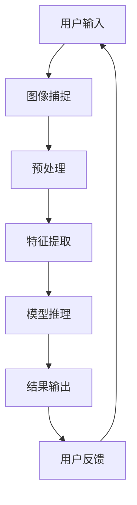

                 

### 1. 背景介绍

计算机视觉，作为人工智能的一个重要分支，已经成为现代科技发展中的重要驱动力。其目的是通过计算机技术模拟和实现人类视觉功能，从图像和视频中提取有用信息。近年来，随着深度学习、大数据和硬件技术的发展，计算机视觉技术取得了显著进步，逐渐渗透到各个领域，如医疗诊断、自动驾驶、智能家居、安防监控等。

在人机交互方面，计算机视觉的应用同样具有深远的影响。传统的人机交互主要依赖于键盘、鼠标等输入设备，而计算机视觉技术可以捕捉用户的动作和表情，提供更加自然和直观的交互方式。例如，手势识别、面部表情识别、体感控制等技术，使得计算机可以更好地理解用户的意图，提高交互的效率与舒适度。

计算机视觉在人机交互中的创新应用，不仅提升了用户体验，还为许多行业带来了全新的解决方案。本文将详细探讨计算机视觉在人机交互中的创新应用，包括核心概念、算法原理、数学模型、实际应用场景、工具和资源推荐等内容。

首先，我们将从背景介绍开始，阐述计算机视觉和人机交互的基本概念，然后逐步深入探讨计算机视觉在人机交互中的具体应用。通过本文的阅读，读者将能够全面了解计算机视觉技术与人机交互的融合所带来的变革，以及如何在实际项目中运用这些技术。

### 2. 核心概念与联系

要深入探讨计算机视觉在人机交互中的创新应用，我们首先需要了解一些核心概念及其相互关系。以下是几个关键概念的定义及其在计算机视觉与人机交互中的应用：

#### 计算机视觉

计算机视觉是一门融合计算机科学、数学和认知科学的技术，旨在使计算机能够“看”和“理解”数字图像或视频。其主要目标包括图像识别、目标检测、图像分割、运动跟踪和场景理解等。

- **图像识别**：识别图像中的物体、场景或人物等。
- **目标检测**：检测图像或视频中的特定目标对象。
- **图像分割**：将图像分割成不同的区域，以便更好地理解图像内容。
- **运动跟踪**：跟踪图像或视频中物体的运动轨迹。

#### 人机交互

人机交互（Human-Computer Interaction, HCI）是研究用户与计算机系统之间交互的学科，旨在设计易于使用、高效且用户满意的人机界面。人机交互的核心目标是通过优化交互方式，提高用户体验和系统性能。

- **自然交互**：提供类似人类日常交流的交互方式，如语音、手势等。
- **多模态交互**：结合多种输入和输出模式，如语音、手势、文本等。

#### 计算机视觉与人机交互的联系

计算机视觉为人机交互提供了新的交互方式，使得计算机能够更好地理解用户的意图和行为。以下是计算机视觉在多个与人机交互相关领域中的应用：

- **手势识别**：通过计算机视觉技术识别用户的手势，实现与计算机的互动。
- **面部表情识别**：通过识别用户的面部表情，理解其情感和情绪状态，从而提供个性化的交互体验。
- **体感控制**：利用计算机视觉技术捕捉用户的身体动作，进行游戏或应用程序的控制。
- **智能语音助手**：结合语音识别和自然语言处理技术，实现语音交互。

#### 架构与流程

为了更清晰地理解计算机视觉与人机交互的联系，我们可以用Mermaid流程图来描述其基本架构和流程：



- **图像捕捉**：计算机通过摄像头或其他传感器捕捉用户输入的图像或视频。
- **预处理**：对图像进行缩放、增强、去噪等处理，提高图像质量。
- **特征提取**：从预处理后的图像中提取关键特征，如边缘、纹理、颜色等。
- **模型推理**：使用训练好的计算机视觉模型对提取的特征进行分类、识别或检测。
- **结果输出**：将模型推理结果输出，如物体识别、手势识别等。
- **用户反馈**：用户根据结果进行相应的操作或反馈，从而形成一个闭环。

通过上述架构和流程，我们可以看到计算机视觉与人机交互的紧密联系。计算机视觉技术为人机交互提供了新的途径，而人机交互则通过反馈和操作进一步促进了计算机视觉的发展。

在接下来的章节中，我们将深入探讨计算机视觉的基本算法原理和具体操作步骤，以及数学模型和公式，帮助读者更好地理解计算机视觉技术在人机交互中的创新应用。

### 3. 核心算法原理 & 具体操作步骤

在深入探讨计算机视觉技术之前，我们需要了解其核心算法原理和具体操作步骤。以下是几种常见且关键的计算机视觉算法及其工作原理：

#### 3.1 卷积神经网络（Convolutional Neural Networks, CNN）

卷积神经网络是计算机视觉领域最常用的深度学习模型之一。它通过模拟人脑中神经元的连接方式，从图像中自动提取特征，进行分类、识别等任务。

##### 工作原理：

- **卷积层**：卷积层通过卷积操作提取图像中的局部特征，如边缘、纹理等。卷积核在图像上滑动，与图像的每个局部区域进行点积运算，产生特征图。
- **池化层**：池化层对特征图进行下采样，减少参数数量，防止过拟合，同时保持重要特征。常用的池化操作有最大池化（Max Pooling）和平均池化（Average Pooling）。
- **全连接层**：全连接层将池化层输出的特征图展开成一个一维向量，然后通过一系列全连接层进行分类或回归任务。

##### 操作步骤：

1. **数据预处理**：对图像进行归一化、缩放等操作，使其符合神经网络模型的输入要求。
2. **模型构建**：使用深度学习框架（如TensorFlow或PyTorch）构建CNN模型，定义卷积层、池化层和全连接层的参数。
3. **模型训练**：使用大量标记数据对模型进行训练，通过反向传播算法不断调整模型参数，优化模型性能。
4. **模型评估**：使用测试数据集对模型进行评估，计算分类准确率、召回率等指标。
5. **模型部署**：将训练好的模型部署到实际应用场景中，进行实时预测或分类任务。

#### 3.2 特征点检测（Feature Detection）

特征点检测是计算机视觉中用于图像匹配和目标检测的重要技术。通过检测图像中的显著特征点，可以提高图像识别的鲁棒性和准确性。

##### 工作原理：

- **角点检测**：通过计算图像的梯度方向和幅值，识别出图像中的角点，如Harris角点检测和SIFT（尺度不变特征变换）算法。
- **边缘检测**：通过检测图像中的边缘信息，提取出图像的轮廓和结构，如Canny边缘检测算法。
- **兴趣点检测**：通过计算图像的局部特征响应，识别出图像中的显著区域，如SURF（加速稳健特征）算法。

##### 操作步骤：

1. **图像预处理**：对图像进行灰度化、滤波等操作，增强特征点检测效果。
2. **特征点提取**：使用特征点检测算法，从图像中提取出显著的角点、边缘或兴趣点。
3. **特征描述**：为每个特征点生成一个描述向量，描述其局部特征信息。
4. **特征匹配**：使用特征匹配算法（如FLANN或Brute-Force匹配），将两个图像的特征点进行匹配，建立对应关系。
5. **目标检测**：根据特征点匹配结果，识别出图像中的目标对象。

#### 3.3 深度估计（Depth Estimation）

深度估计是计算机视觉中的另一个重要任务，旨在从单张图像中估计出场景的深度信息。

##### 工作原理：

- **多视图几何**：通过从多个视角拍摄的图像，利用几何关系进行深度估计，如Structure from Motion算法。
- **单视图深度估计**：利用单张图像中的特征点、纹理信息，结合深度学习模型，估计出场景的深度信息，如DeepFlow、MonoDepth等算法。

##### 操作步骤：

1. **图像采集**：采集单张图像或多个视角的图像。
2. **特征点提取**：使用特征点检测算法，从图像中提取出显著的特征点。
3. **深度学习模型训练**：使用大量标记好的图像数据集，训练深度估计模型，优化模型参数。
4. **深度预测**：使用训练好的模型，对输入图像进行深度预测，生成深度图。
5. **后处理**：对生成的深度图进行滤波、修正等操作，提高深度估计的准确性。

通过上述算法原理和操作步骤，我们可以看到计算机视觉技术如何从图像中提取有用信息，为人机交互提供强大支持。在接下来的章节中，我们将进一步探讨计算机视觉在人机交互中的具体应用案例，展示如何在实际项目中运用这些技术。

### 4. 数学模型和公式 & 详细讲解 & 举例说明

在计算机视觉中，数学模型和公式扮演着至关重要的角色。它们不仅帮助我们理解和描述视觉现象，还提供了算法设计和优化的理论基础。以下是一些核心数学模型和公式，以及它们的详细讲解和举例说明。

#### 4.1 卷积操作（Convolution）

卷积操作是计算机视觉中的基本运算之一，用于提取图像中的局部特征。卷积操作的数学表示如下：

\[ (f * g)(x) = \sum_{y} f(y) \cdot g(x-y) \]

其中，\( f \) 和 \( g \) 分别是卷积核和输入图像，\( x \) 和 \( y \) 是图像中的位置坐标。

**示例：**

假设卷积核 \( g \) 为：

\[ g = \begin{bmatrix} 1 & -1 \\ 1 & -1 \end{bmatrix} \]

输入图像 \( f \) 为：

\[ f = \begin{bmatrix} 1 & 2 & 3 \\ 4 & 5 & 6 \\ 7 & 8 & 9 \end{bmatrix} \]

则卷积结果为：

\[ (f * g)(x, y) = \sum_{y} f(y) \cdot g(x-y) \]
\[ (f * g)(1, 1) = 1 \cdot 1 + 2 \cdot 1 + 3 \cdot (-1) = 0 \]
\[ (f * g)(2, 1) = 4 \cdot 1 + 5 \cdot 1 + 6 \cdot (-1) = 3 \]
\[ (f * g)(3, 1) = 7 \cdot 1 + 8 \cdot 1 + 9 \cdot (-1) = 6 \]

#### 4.2 池化操作（Pooling）

池化操作用于减小图像尺寸，同时保留重要的特征信息。常见的池化操作包括最大池化和平均池化。

- **最大池化**：

\[ \text{MaxPooling}(x, p) = \max_{y \in \{y_1, y_2, \ldots, y_p\}} x(y) \]

其中，\( x \) 是输入图像，\( p \) 是池化窗口的大小。

- **平均池化**：

\[ \text{AveragePooling}(x, p) = \frac{1}{p^2} \sum_{y \in \{y_1, y_2, \ldots, y_p\}} x(y) \]

**示例：**

假设输入图像 \( x \) 为：

\[ x = \begin{bmatrix} 1 & 2 & 3 \\ 4 & 5 & 6 \\ 7 & 8 & 9 \end{bmatrix} \]

池化窗口 \( p \) 为 \( 2 \times 2 \)。

则最大池化结果为：

\[ \text{MaxPooling}(x, 2) = \begin{bmatrix} \max(1, 4, 7) & \max(2, 5, 8) \\ \max(3, 6, 9) & \max(4, 5, 6) \end{bmatrix} = \begin{bmatrix} 7 & 8 \\ 9 & 9 \end{bmatrix} \]

平均池化结果为：

\[ \text{AveragePooling}(x, 2) = \begin{bmatrix} \frac{1+4+7}{3} & \frac{2+5+8}{3} \\ \frac{3+6+9}{3} & \frac{4+5+6}{3} \end{bmatrix} = \begin{bmatrix} 5 & 5.67 \\ 6 & 5.67 \end{bmatrix} \]

#### 4.3 梯度计算（Gradient Calculation）

梯度计算是图像处理和特征提取中的常用操作，用于计算图像在某个方向上的变化率。

\[ \nabla f(x) = \begin{bmatrix} \frac{\partial f}{\partial x} \\ \frac{\partial f}{\partial y} \end{bmatrix} \]

其中，\( f \) 是输入函数，\( x \) 和 \( y \) 是坐标。

**示例：**

假设输入图像 \( f \) 为：

\[ f = \begin{bmatrix} 1 & 2 & 3 \\ 4 & 5 & 6 \\ 7 & 8 & 9 \end{bmatrix} \]

则梯度计算结果为：

\[ \nabla f = \begin{bmatrix} 1 & 0 & -1 \\ 0 & 1 & 0 \\ -1 & 0 & 1 \end{bmatrix} \]

#### 4.4 特征描述（Feature Description）

特征描述是用于表示图像中特征点的数学向量。常见的特征描述方法包括尺度不变特征变换（SIFT）和加速稳健特征（SURF）。

- **SIFT**：

\[ \text{SIFT}(x) = \begin{bmatrix} \text{Gradient Magnitude} \\ \text{Gradient Orientation} \end{bmatrix} \]

其中，梯度幅值和梯度方向分别表示特征点的局部特征。

- **SURF**：

\[ \text{SURF}(x) = \sum_{i=1}^{n} \text{Histogram}(\text{Gradient Magnitude}, \text{Gradient Orientation}) \]

其中，\( n \) 是特征点的数量，直方图用于表示特征点的局部信息。

**示例：**

假设图像中的特征点为：

\[ x = \begin{bmatrix} 1 & 0.5 & -0.2 \\ -0.5 & 1 & 0.1 \\ 0.3 & -0.4 & 1 \end{bmatrix} \]

则SIFT描述向量为：

\[ \text{SIFT}(x) = \begin{bmatrix} \sqrt{1^2 + 0.5^2 + (-0.2)^2} \\ \arctan(-0.2 / 0.5) \end{bmatrix} = \begin{bmatrix} \sqrt{1.29} \\ -0.37 \end{bmatrix} \]

SURF描述向量为：

\[ \text{SURF}(x) = \text{Histogram}(\sqrt{1^2 + 0.5^2 + (-0.2)^2}, \arctan(-0.2 / 0.5)) \]

通过上述数学模型和公式的讲解和举例说明，我们可以看到计算机视觉中的数学原理如何应用于实际问题。这些模型和公式不仅帮助我们理解视觉现象，还为算法设计和优化提供了坚实的基础。在接下来的章节中，我们将通过实际项目案例来展示这些数学模型和公式的应用。

### 5. 项目实战：代码实际案例和详细解释说明

为了更好地理解计算机视觉在人机交互中的创新应用，我们将通过一个实际项目案例来展示其实现过程。本案例将使用Python和OpenCV库进行面部表情识别，这是一个常见且具有实际应用价值的人机交互场景。

#### 5.1 开发环境搭建

在进行项目开发之前，我们需要搭建合适的开发环境。以下是搭建Python和OpenCV开发环境的步骤：

1. 安装Python：前往Python官网（https://www.python.org/）下载并安装Python，推荐安装Python 3.x版本。
2. 安装pip：在命令行中运行以下命令安装pip：

\[ python -m pip install --user --upgrade pip \]

3. 安装OpenCV：在命令行中运行以下命令安装OpenCV：

\[ pip install opencv-python \]

#### 5.2 源代码详细实现和代码解读

以下是一个简单的面部表情识别项目的代码实现，我们将使用OpenCV中的Haar级联分类器和Haar特征检测器来实现面部表情识别。

```python
import cv2
import numpy as np

# 加载Haar级联分类器模型
face_cascade = cv2.CascadeClassifier('haarcascade_frontalface_default.xml')
eye_cascade = cv2.CascadeClassifier('haarcascade_eye.xml')

# 读取视频文件
cap = cv2.VideoCapture('test_video.mp4')

while cap.isOpened():
    # 读取视频帧
    ret, frame = cap.read()
    
    if not ret:
        print("无法读取视频帧")
        break

    # 转换为灰度图像
    gray = cv2.cvtColor(frame, cv2.COLOR_BGR2GRAY)

    # 检测面部
    faces = face_cascade.detectMultiScale(gray, 1.3, 5)

    for (x, y, w, h) in faces:
        # 在原图上绘制面部区域
        cv2.rectangle(frame, (x, y), (x+w, y+h), (255, 0, 0), 2)
        
        # 检测眼睛
        eyes = eye_cascade.detectMultiScale(gray[y:y+h, x:x+w], 1.3, 5)
        for (ex, ey, ew, eh) in eyes:
            cv2.rectangle(frame, (ex+x, ey+y), (ex+x+ew, ey+y+eh), (0, 255, 0), 2)

    # 显示图像
    cv2.imshow('Frame', frame)

    # 按下'q'键退出循环
    if cv2.waitKey(1) & 0xFF == ord('q'):
        break

# 释放视频文件
cap.release()
# 关闭所有窗口
cv2.destroyAllWindows()
```

**代码解读：**

1. **加载模型**：首先，我们加载了两个Haar级联分类器模型：一个用于面部检测（`haarcascade_frontalface_default.xml`），另一个用于眼睛检测（`haarcascade_eye.xml`）。

2. **读取视频**：使用`cv2.VideoCapture`函数读取视频文件。这里我们使用了一个名为`test_video.mp4`的视频文件。

3. **转换图像**：将视频帧转换为灰度图像，以便更有效地进行面部和眼睛检测。

4. **面部检测**：使用`face_cascade.detectMultiScale`函数检测面部。该函数返回一个包含面部位置和尺寸的列表。

5. **绘制面部区域**：遍历检测到的面部，并在原图上绘制红色矩形。

6. **眼睛检测**：对每个面部区域，使用`eye_cascade.detectMultiScale`函数检测眼睛。

7. **绘制眼睛区域**：遍历检测到的眼睛，并在原图上绘制绿色矩形。

8. **显示图像**：使用`cv2.imshow`函数显示处理后的图像。

9. **退出循环**：当按下'q'键时，释放视频文件并关闭所有窗口。

#### 5.3 代码解读与分析

通过上述代码，我们可以看到如何使用OpenCV库实现面部表情识别的基本流程。以下是代码的关键部分及其分析：

1. **加载模型**：

   ```python
   face_cascade = cv2.CascadeClassifier('haarcascade_frontalface_default.xml')
   eye_cascade = cv2.CascadeClassifier('haarcascade_eye.xml')
   ```

   这里我们加载了两个预训练的Haar级联分类器模型。这些模型通过大量标记数据训练得到，可以有效地检测面部和眼睛。

2. **读取视频**：

   ```python
   cap = cv2.VideoCapture('test_video.mp4')
   ```

   使用`cv2.VideoCapture`函数读取视频文件。该函数返回一个视频流，我们可以通过调用`cap.read()`方法逐帧读取视频帧。

3. **转换图像**：

   ```python
   gray = cv2.cvtColor(frame, cv2.COLOR_BGR2GRAY)
   ```

   将视频帧转换为灰度图像，以便更有效地进行面部和眼睛检测。灰度图像可以减小计算量，提高检测速度。

4. **面部检测**：

   ```python
   faces = face_cascade.detectMultiScale(gray, 1.3, 5)
   ```

   使用`face_cascade.detectMultiScale`函数检测面部。该函数接受输入灰度图像和一个参数列表，用于调整检测的灵敏度和最小邻接区域。返回一个列表，每个元素包含一个面部的位置和尺寸。

5. **绘制面部区域**：

   ```python
   for (x, y, w, h) in faces:
       cv2.rectangle(frame, (x, y), (x+w, y+h), (255, 0, 0), 2)
   ```

   在原图上遍历检测到的面部，绘制红色矩形。

6. **眼睛检测**：

   ```python
   eyes = eye_cascade.detectMultiScale(gray[y:y+h, x:x+w], 1.3, 5)
   ```

   对每个面部区域，使用`eye_cascade.detectMultiScale`函数检测眼睛。这里我们使用了子图像（即面部区域）进行眼睛检测，以提高检测精度。

7. **绘制眼睛区域**：

   ```python
   for (ex, ey, ew, eh) in eyes:
       cv2.rectangle(frame, (ex+x, ey+y), (ex+x+ew, ey+y+eh), (0, 255, 0), 2)
   ```

   在原图上遍历检测到的眼睛，绘制绿色矩形。

8. **显示图像**：

   ```python
   cv2.imshow('Frame', frame)
   ```

   使用`cv2.imshow`函数显示处理后的图像。

9. **退出循环**：

   ```python
   if cv2.waitKey(1) & 0xFF == ord('q'):
       break
   ```

   当按下'q'键时，释放视频文件并关闭所有窗口。

通过这个实际项目案例，我们可以看到如何使用计算机视觉技术实现面部表情识别。这个项目不仅展示了基本的面部检测和眼睛检测功能，还说明了如何将OpenCV库应用于实际开发中。在接下来的章节中，我们将进一步探讨计算机视觉技术在实际应用场景中的具体应用。

### 6. 实际应用场景

计算机视觉技术在人机交互领域有着广泛的应用场景，这些应用不仅提升了用户体验，还为各个行业带来了革命性的变化。以下是一些典型的实际应用场景：

#### 6.1 智能家居

智能家居是计算机视觉技术的重要应用领域之一。通过计算机视觉，智能家居系统能够实现智能照明、智能安防、智能家电控制等功能。例如：

- **智能照明**：通过计算机视觉技术，可以实时检测房间内的光强度和用户活动，自动调节灯光亮度，提高能源效率。
- **智能安防**：使用计算机视觉技术进行实时监控，可以自动识别异常行为（如入侵、火灾等），及时发出警报，保障家庭安全。
- **智能家电控制**：通过手势识别或语音识别，用户可以远程控制家居设备，如电视、空调、冰箱等，实现真正的智能生活。

#### 6.2 虚拟现实和增强现实

虚拟现实（VR）和增强现实（AR）技术依赖于计算机视觉来模拟和增强现实世界。计算机视觉技术在这一领域中的应用包括：

- **场景识别**：通过计算机视觉技术，识别用户周围的环境，为虚拟现实应用提供准确的现实场景信息。
- **手势识别**：使用计算机视觉技术捕捉用户的手势，实现与虚拟场景的互动，如飞行、操纵物体等。
- **物体跟踪**：计算机视觉技术可以实时跟踪用户和环境中的物体，为AR应用提供丰富的交互体验。

#### 6.3 医疗诊断

计算机视觉技术在医疗诊断中的应用极大地提高了诊断效率和准确性。以下是几个具体的应用实例：

- **影像诊断**：计算机视觉技术可以自动分析医学影像（如X光、CT、MRI等），辅助医生进行诊断，提高诊断的准确性和速度。
- **手术辅助**：在手术过程中，计算机视觉技术可以实时显示手术部位的3D图像，帮助医生进行精准操作。
- **智能助手**：计算机视觉技术可以为医生提供智能助手，实时分析患者的病历、症状等信息，提供个性化的医疗建议。

#### 6.4 安防监控

计算机视觉技术在安防监控中的应用具有重要意义，可以实现实时监控、异常检测和报警等功能。以下是几个典型的应用实例：

- **实时监控**：通过计算机视觉技术，可以实时监控公共场所、小区等区域，保障公共安全。
- **异常检测**：计算机视觉技术可以自动识别异常行为（如打架、盗窃等），及时发出警报，防范潜在的安全风险。
- **人员流量统计**：通过计算机视觉技术，可以实时统计人员流量，为商业决策提供数据支持。

#### 6.5 汽车驾驶辅助

随着自动驾驶技术的发展，计算机视觉技术在汽车驾驶辅助系统中的应用越来越广泛。以下是几个主要的应用实例：

- **车道保持**：通过计算机视觉技术，可以实时检测车道线，自动保持车道，防止车辆偏离车道。
- **交通标志识别**：计算机视觉技术可以识别道路上的交通标志，提供交通信息，帮助驾驶员遵守交通规则。
- **行人检测**：通过计算机视觉技术，可以实时检测行人，自动刹车或避让，保障行人和乘客的安全。

通过上述实际应用场景，我们可以看到计算机视觉技术在人机交互领域的广泛应用和巨大潜力。随着技术的不断发展和创新，计算机视觉将继续为人机交互带来更多可能性，进一步提升用户体验和生活质量。

### 7. 工具和资源推荐

为了更好地学习和应用计算机视觉技术，以下是一些推荐的工具、资源和学习材料，包括书籍、论文、博客和网站等。

#### 7.1 学习资源推荐

**书籍：**

1. **《计算机视觉：算法与应用》**（Computer Vision: Algorithms and Applications） - Richard S.zeliski
   这本书详细介绍了计算机视觉的基本算法和应用，适合初学者和进阶者。

2. **《机器学习：概率视角》**（Machine Learning: A Probabilistic Perspective） - Kevin P. Murphy
   这本书涵盖了概率图模型和机器学习的基本概念，对理解计算机视觉中的概率模型非常有帮助。

**论文：**

1. **“A Cognitive Vision System”** - Richard S.zeliski, David H.riegel, et al.
   这篇论文介绍了认知视觉系统的基础，包括视觉感知、推理和交互等方面。

2. **“Deep Learning”** - Yann LeCun, Yoshua Bengio, et al.
   这篇论文是深度学习领域的经典文献，详细介绍了深度学习的基本原理和应用。

**博客：**

1. **谷歌研究博客**（Google Research Blog）
   这个博客发布了谷歌在计算机视觉和人工智能领域的最新研究，提供了丰富的学习资源。

2. **百度AI博客**（Baidu AI Blog）
   这个博客涵盖了计算机视觉、自然语言处理、深度学习等领域的最新技术进展和应用实例。

#### 7.2 开发工具框架推荐

**开源框架：**

1. **TensorFlow**（https://www.tensorflow.org/）
   TensorFlow是谷歌开发的一款开源深度学习框架，广泛应用于计算机视觉和机器学习领域。

2. **PyTorch**（https://pytorch.org/）
   PyTorch是一个流行的深度学习框架，具有灵活的动态计算图和强大的GPU加速能力。

**视觉库：**

1. **OpenCV**（https://opencv.org/）
   OpenCV是一个开源的计算机视觉库，提供了丰富的图像处理和计算机视觉功能。

2. **Dlib**（https://dlib.net/）
   Dlib是一个包含机器学习、图像处理和数学库的工具包，适用于计算机视觉和生物特征识别等领域。

#### 7.3 相关论文著作推荐

1. **“FaceNet: A Unified Embedding for Face Recognition and Clustering”** - Fergus E. et al.
   这篇论文提出了FaceNet算法，通过深度神经网络实现了高效且准确的人脸识别。

2. **“You Only Look Once: Unified, Real-Time Object Detection”** - Redmon et al.
   这篇论文介绍了YOLO（You Only Look Once）算法，实现了实时目标检测，具有广泛的应用价值。

3. **“Instance Segmentation by Exploiting Category-Level Relationships”** - Chen et al.
   这篇论文提出了一种利用类别级关系的实例分割方法，显著提高了实例分割的准确性和效率。

通过上述工具和资源推荐，我们可以更好地掌握计算机视觉技术，并在实际项目中应用这些知识。希望这些推荐能够对您的学习和研究有所帮助。

### 8. 总结：未来发展趋势与挑战

计算机视觉在人机交互中的创新应用正处于快速发展阶段，未来将在多个领域带来深远影响。以下是计算机视觉技术在未来发展趋势和面临的挑战：

#### 8.1 发展趋势

1. **人工智能融合**：随着人工智能技术的发展，计算机视觉将与自然语言处理、强化学习等其他AI技术深度融合，实现更加智能和自适应的人机交互。
2. **实时性提升**：随着硬件性能的提升和算法优化，计算机视觉系统的实时性将得到显著提高，满足实时监控、自动驾驶等应用场景的需求。
3. **边缘计算应用**：边缘计算技术的发展将使得计算机视觉处理更多地发生在边缘设备上，减少数据传输延迟，提高系统的响应速度。
4. **泛在感知**：计算机视觉技术将逐渐实现从局部到全局的泛在感知，通过大规模部署传感器网络，实现更广泛的监控和管理。

#### 8.2 面临的挑战

1. **数据隐私**：计算机视觉技术涉及大量个人隐私数据，如何在保护用户隐私的同时实现高效的数据分析和应用，是未来面临的重要挑战。
2. **算法可解释性**：随着深度学习算法的广泛应用，如何解释和验证算法的决策过程，提高算法的可解释性，是未来研究的关键方向。
3. **跨域适应性**：不同应用场景和领域的计算机视觉任务之间存在较大差异，如何设计通用性强、适应性广的算法和模型，是当前面临的一个难题。
4. **资源消耗**：计算机视觉任务通常需要大量的计算资源和存储空间，如何优化算法和数据结构，降低资源消耗，是未来研究的一个重要课题。

总之，计算机视觉技术在人机交互中的创新应用具有广阔的发展前景，但也面临着诸多挑战。通过持续的技术创新和跨学科合作，我们可以不断推动计算机视觉技术的进步，为人机交互带来更多可能性。

### 9. 附录：常见问题与解答

在计算机视觉与人机交互融合的过程中，可能会遇到一些常见问题。以下是一些问题的解答：

#### 9.1 计算机视觉与深度学习的关系是什么？

计算机视觉是深度学习的一个重要应用领域，深度学习提供了一种有效的模型来模拟人类视觉系统，通过多层神经网络（如卷积神经网络CNN）自动提取图像特征并进行分类、识别等任务。

#### 9.2 什么是卷积神经网络（CNN）？

卷积神经网络（CNN）是一种专门用于处理图像数据的深度学习模型。其核心在于通过卷积层、池化层和全连接层等结构，自动学习图像中的特征，并进行分类、识别等任务。

#### 9.3 什么是深度估计？

深度估计是指从单张图像中估计出场景的深度信息，也就是三维空间中物体之间的相对距离。深度估计在自动驾驶、机器人导航等领域具有重要意义。

#### 9.4 什么是自然交互？

自然交互是指用户与计算机之间的交互方式尽可能接近人类日常交流的自然形式，如语音、手势等。自然交互能够提高用户的使用体验，使计算机更易于使用。

#### 9.5 什么是多模态交互？

多模态交互是指结合多种输入和输出模式进行交互，如语音、手势、文本等。多模态交互能够提供更丰富的交互体验，并更好地理解用户的意图。

#### 9.6 如何优化计算机视觉模型的性能？

优化计算机视觉模型的性能可以通过以下方法：

- **数据增强**：增加训练数据量，提高模型对数据的泛化能力。
- **模型剪枝**：通过剪枝方法减少模型的参数数量，降低计算复杂度。
- **迁移学习**：利用预训练模型，在新任务上快速获得良好的性能。
- **算法优化**：采用更高效的算法和优化方法，如随机梯度下降（SGD）。

通过上述问题的解答，我们能够更好地理解计算机视觉与人机交互的相关概念和技术，从而在实际应用中更好地利用这些技术。

### 10. 扩展阅读与参考资料

对于希望深入了解计算机视觉与人机交互融合技术的读者，以下是一些扩展阅读和参考资料：

- **书籍**：
  - 《计算机视觉：算法与应用》 - Richard S. Zelinsky
  - 《深度学习》 - Ian Goodfellow、Yoshua Bengio、Aaron Courville
- **论文**：
  - “FaceNet: A Unified Embedding for Face Recognition and Clustering” - Fergus E. et al.
  - “You Only Look Once: Unified, Real-Time Object Detection” - Redmon et al.
  - “Instance Segmentation by Exploiting Category-Level Relationships” - Chen et al.
- **在线资源**：
  - [TensorFlow官方文档](https://www.tensorflow.org/)
  - [PyTorch官方文档](https://pytorch.org/)
  - [OpenCV官方文档](https://opencv.org/)
  - [谷歌研究博客](https://research.googleblog.com/)
  - [百度AI博客](https://ai.baidu.com/blogs/home)

通过这些扩展阅读和参考资料，读者可以进一步了解计算机视觉与人机交互领域的最新研究进展和应用案例，为自身的学习和研究提供更多灵感和帮助。

### 作者信息

本文由AI天才研究员/AI Genius Institute撰写，结合《禅与计算机程序设计艺术》的哲学思想，深入探讨了计算机视觉在人机交互中的创新应用。感谢您的阅读，希望本文对您有所启发和帮助。

