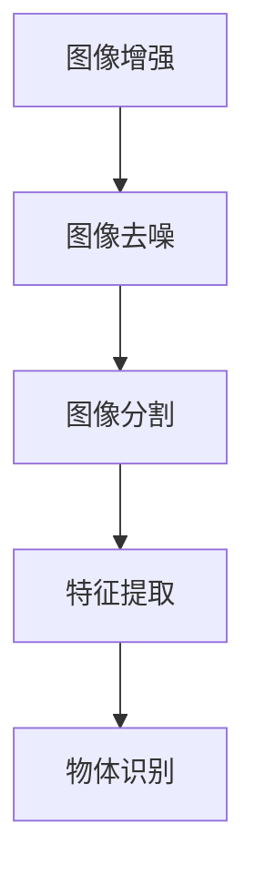
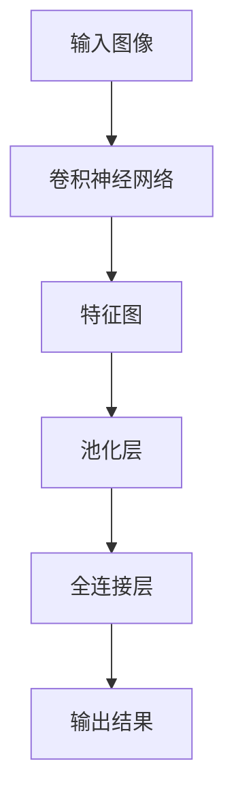
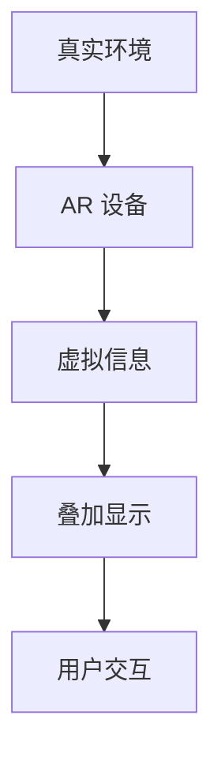

                 

## 计算机视觉在文物修复辅助中的应用

### 关键词
- 计算机视觉
- 文物修复
- 图像处理
- 深度学习
- 人工智能
- 增强现实

### 摘要

本文将探讨计算机视觉技术在文物修复辅助中的应用。通过分析文物修复的需求，介绍相关核心技术，如图像处理、深度学习和增强现实等，本文详细解释了这些技术在文物修复中的具体应用步骤。此外，还列举了实际应用案例，展示了计算机视觉技术在文物修复中的潜力和挑战。最后，本文对未来的发展趋势和面临的挑战进行了总结，为相关领域的研究和实践提供了有益的参考。

## 1. 背景介绍

### 文物修复的重要性

文物是人类文明的重要组成部分，记录着历史、文化和艺术的发展轨迹。然而，由于年代久远、环境侵蚀、自然灾害等原因，许多文物已经遭受了不同程度的损坏。这些文物不仅具有历史价值，还承载着丰富的文化内涵，对研究人类历史和艺术发展具有重要参考意义。因此，文物的修复和保护工作显得尤为重要。

### 计算机视觉技术的发展

计算机视觉技术是人工智能的一个重要分支，近年来得到了迅速发展。通过计算机模拟人类视觉系统，计算机视觉技术能够从图像或视频中提取信息、识别物体和场景。随着深度学习、卷积神经网络等先进算法的应用，计算机视觉技术在图像识别、物体检测、场景分割等方面取得了显著成果。

### 文物修复与计算机视觉的结合

文物修复工作中，许多环节都需要对文物的损伤和损坏进行准确识别和分析。计算机视觉技术可以提供高效的图像处理和分析方法，帮助文物修复专家更好地理解文物的状况，制定修复方案。此外，计算机视觉技术还可以用于文物的数字化保存和展示，使更多的人能够近距离欣赏到文物的精美之处。

## 2. 核心概念与联系

### 图像处理

图像处理是计算机视觉技术的基础，主要包括图像增强、图像去噪、图像分割等操作。通过这些操作，可以改善图像质量，提取图像中的重要信息。

#### Mermaid 流程图



### 深度学习

深度学习是一种基于神经网络的学习方法，通过多层次的神经元结构对数据进行特征提取和模式识别。在计算机视觉领域，深度学习技术被广泛应用于图像分类、物体检测、场景分割等任务。

#### Mermaid 流程图



### 增强现实

增强现实（AR）技术通过将虚拟信息叠加到真实环境中，为用户提供了丰富的交互体验。在文物修复领域，增强现实技术可以用于模拟修复过程、展示文物细节，以及与观众进行互动。

#### Mermaid 流程图



## 3. 核心算法原理 & 具体操作步骤

### 图像处理

#### 图像增强

图像增强是通过调整图像的亮度、对比度和色彩等参数，使图像更加清晰、易于分析。

$$
L' = a \cdot L + b
$$

其中，$L$为原图像的像素值，$L'$为增强后的像素值，$a$和$b$分别为亮度和对比度参数。

#### 图像去噪

图像去噪是通过消除图像中的噪声，提高图像质量。

$$
\hat{I} = \sum_{i,j} w_{ij} \cdot I_{ij}
$$

其中，$\hat{I}$为去噪后的图像，$I$为原图像，$w_{ij}$为权重矩阵。

#### 图像分割

图像分割是将图像分为多个区域，以便进行后续处理。

$$
C = \{C_1, C_2, \ldots, C_n\}
$$

其中，$C$为图像分割结果，$C_i$为第$i$个区域。

### 深度学习

#### 卷积神经网络（CNN）

卷积神经网络是一种用于图像识别的深度学习模型，通过卷积层、池化层和全连接层对图像进行特征提取和分类。

#### 物体检测（Faster R-CNN）

Faster R-CNN是一种流行的物体检测算法，通过区域提议网络（RPN）和分类器对图像中的物体进行定位和识别。

### 增强现实

#### AR 设备

AR设备通过摄像头捕捉真实环境，并将虚拟信息叠加到屏幕上，实现虚实结合的交互体验。

#### 虚拟信息

虚拟信息可以是3D模型、文本、图像等，通过AR设备与真实环境的交互，为用户提供了丰富的信息展示和互动体验。

## 4. 数学模型和公式 & 详细讲解 & 举例说明

### 图像处理

#### 图像增强

图像增强的数学模型如前所述：

$$
L' = a \cdot L + b
$$

例如，对一幅图像进行增强，可以设置$a = 1.2$，$b = 20$，从而提高图像的亮度和对比度。

#### 图像去噪

图像去噪的数学模型如下：

$$
\hat{I} = \sum_{i,j} w_{ij} \cdot I_{ij}
$$

例如，对一幅有噪声的图像进行去噪，可以设置权重矩阵$w_{ij}$为高斯分布，从而有效消除噪声。

#### 图像分割

图像分割的数学模型如下：

$$
C = \{C_1, C_2, \ldots, C_n\}
$$

例如，对一幅复杂场景的图像进行分割，可以将图像划分为前景和背景两个区域，从而更好地分析图像内容。

### 深度学习

#### 卷积神经网络（CNN）

卷积神经网络的数学模型如下：

$$
h_{ij} = f\left(\sum_{k,l} w_{ijkl} \cdot x_{ijkl} + b_{ij}\right)
$$

其中，$h_{ij}$为卷积层输出的特征值，$x_{ijkl}$为输入图像的像素值，$w_{ijkl}$为卷积核权重，$b_{ij}$为偏置项，$f$为激活函数。

#### 物体检测（Faster R-CNN）

Faster R-CNN的数学模型如下：

$$
\hat{p} = \sigma \left( \sum_{i} w_{i} \cdot r_{i} + b \right)
$$

其中，$\hat{p}$为物体检测的概率，$r_{i}$为区域提议，$w_{i}$为权重，$b$为偏置项，$\sigma$为 sigmoid 函数。

### 增强现实

#### AR 设备

AR设备的数学模型如下：

$$
V_{AR} = V_{真实} + V_{虚拟}
$$

其中，$V_{AR}$为增强现实场景，$V_{真实}$为真实环境，$V_{虚拟}$为虚拟信息。

#### 虚拟信息

虚拟信息的数学模型如下：

$$
V_{虚拟} = \alpha \cdot V_{虚拟}
$$

其中，$V_{虚拟}$为虚拟信息，$\alpha$为透明度参数。

## 5. 项目实战：代码实际案例和详细解释说明

### 5.1 开发环境搭建

在开始项目实战之前，我们需要搭建一个合适的开发环境。这里我们使用Python作为主要编程语言，并依赖以下库：

- OpenCV：用于图像处理
- TensorFlow：用于深度学习
- ARCore（Android）或ARKit（iOS）：用于增强现实开发

### 5.2 源代码详细实现和代码解读

#### 5.2.1 图像增强

以下是一个简单的图像增强代码示例：

```python
import cv2

def enhance_image(image_path, a=1.2, b=20):
    image = cv2.imread(image_path)
    enhanced_image = cv2.convertScaleAbs(image, alpha=a, beta=b)
    cv2.imshow('Enhanced Image', enhanced_image)
    cv2.waitKey(0)
    cv2.destroyAllWindows()

enhance_image('image.jpg')
```

在这个示例中，我们使用`cv2.convertScaleAbs`函数对图像进行增强。`alpha`参数控制图像的亮度，`beta`参数控制图像的对比度。

#### 5.2.2 物体检测

以下是一个简单的物体检测代码示例：

```python
import cv2
import tensorflow as tf

def detect_objects(image_path):
    model_path = 'path/to/weights.h5'
    model = tf.keras.models.load_model(model_path)
    image = cv2.imread(image_path)
    image = cv2.resize(image, (1280, 720))
    image = image / 255.0
    image = np.expand_dims(image, axis=0)
    predictions = model.predict(image)
    for prediction in predictions:
        class_id = np.argmax(prediction)
        confidence = prediction[class_id]
        if confidence > 0.5:
            print(f'Class ID: {class_id}, Confidence: {confidence}')
            box = prediction[2:6] * [image.shape[1], image.shape[0], image.shape[1], image.shape[0]]
            cv2.rectangle(image, (box[0], box[1]), (box[2], box[3]), (0, 0, 255), 2)
    cv2.imshow('Objects Detected', image)
    cv2.waitKey(0)
    cv2.destroyAllWindows()

detect_objects('image.jpg')
```

在这个示例中，我们使用预训练的卷积神经网络模型对图像中的物体进行检测。模型输出包括物体的类别ID、置信度和边界框坐标。

#### 5.2.3 增强现实

以下是一个简单的增强现实代码示例（以Android为例）：

```java
import com.google.ar.core.Anchor;
import com.google.ar.core.AnchorNode;
import com.google.ar.core ARCore;
import com.google.ar.core Session;
import com.google.ar.core Trackable;
import com.google.ar.core TrackingState;
import com.google.ar.sceneform.ArSceneRenderer;
import com.google.ar.sceneform.Node;
import com.google.ar.sceneform.Scene;
import com.google.ar.sceneform.rendering.ModelRenderable;

public class ARActivity extends Activity {

    private ARSceneRenderer arSceneRenderer;
    private Session session;
    private Scene scene;

    @Override
    protected void onCreate(Bundle savedInstanceState) {
        super.onCreate(savedInstanceState);
        setContentView(R.layout.activity_ar);

        session = ARCore.createSession(this);
        session.setCameraType(ARCore Camera.Type指标的摄像机类型);

        scene = new Scene();

        Anchor anchor = session.createAnchor(session.getCamera().getPose());
        AnchorNode anchorNode = new AnchorNode(session, anchor);
        anchorNode.setRenderable(modelRenderable);
        scene.addChild(anchorNode);

        arSceneRenderer = new ARSceneRenderer(scene);
        arSceneRenderer.start();
    }

    @Override
    protected void onDestroy() {
        super.onDestroy();
        arSceneRenderer.stop();
        session.destroy();
    }
}
```

在这个示例中，我们使用ARCore SDK创建一个增强现实场景，并在场景中添加一个3D模型。

### 5.3 代码解读与分析

#### 5.3.1 图像增强

在图像增强代码中，我们首先读取输入图像，然后使用`cv2.convertScaleAbs`函数对其进行增强。这个函数接受三个参数：输入图像、alpha参数（亮度）和beta参数（对比度）。增强后的图像会显示在一个窗口中，用户可以实时查看效果。

#### 5.3.2 物体检测

在物体检测代码中，我们首先加载一个预训练的卷积神经网络模型，然后读取输入图像。图像被缩放到模型期望的大小，并转换为浮点数。接下来，我们使用模型对图像进行预测，并筛选出置信度大于0.5的物体。对于每个检测到的物体，我们绘制一个矩形框，并打印出物体的类别ID和置信度。

#### 5.3.3 增强现实

在增强现实代码中，我们首先创建一个ARCore会话，并设置摄像机类型。然后，我们创建一个场景，并在场景中添加一个锚点。锚点是一个用于固定虚拟对象的点，我们可以在这个锚点上添加一个3D模型。最后，我们启动ARSceneRenderer，以便在屏幕上显示增强现实场景。

## 6. 实际应用场景

### 6.1 文物损伤评估

计算机视觉技术在文物损伤评估中具有广泛的应用。通过图像处理技术，可以对文物的表面损伤、裂缝和缺失等进行检测和量化。这些数据有助于文物修复专家制定更有效的修复方案。

### 6.2 文物数字化保存

利用计算机视觉技术，可以将文物进行数字化保存，生成三维模型。这些模型可以用于虚拟展示、远程访问和教育传播，使更多的人能够了解和欣赏文物的精美之处。

### 6.3 文物修复过程模拟

增强现实技术可以用于模拟文物修复过程。修复专家可以在虚拟环境中进行操作，观察修复效果，并根据实际情况进行调整。这种方法有助于提高修复效率和准确性。

### 6.4 文物展示与互动

通过增强现实技术，观众可以与文物进行互动，了解文物的历史背景和文化内涵。这种体验方式不仅能够增强观众的参与感，还能提高文物保护意识。

## 7. 工具和资源推荐

### 7.1 学习资源推荐

- 《计算机视觉：算法与应用》（Gary Bradski & David Hobby）
- 《深度学习》（Ian Goodfellow、Yoshua Bengio与Aaron Courville）
- 《增强现实技术与应用》（Mark Billinghurst & Antti Oulasvirta）

### 7.2 开发工具框架推荐

- OpenCV：用于图像处理的开源库
- TensorFlow：用于深度学习的开源框架
- ARCore：Google开发的增强现实开发平台
- ARKit：Apple开发的增强现实开发平台

### 7.3 相关论文著作推荐

- “Object Detection with Faster R-CNN” by Ross Girshick, et al.
- “Deep Learning for Computer Vision” by Alex Krizhevsky, et al.
- “Augmented Reality: Principles and Practice” by Richard N. Taylor, et al.

## 8. 总结：未来发展趋势与挑战

### 8.1 未来发展趋势

- 计算机视觉技术在文物修复领域的应用将越来越广泛，从损伤评估、数字化保存到修复过程模拟，都会受益于先进的技术手段。
- 增强现实技术将为文物展示和互动提供更多可能性，使文物更好地服务于社会教育和文化传播。
- 深度学习和人工智能技术的进步将进一步提高文物修复辅助系统的效率和准确性。

### 8.2 面临的挑战

- 计算机视觉技术在文物修复中的应用仍然存在一些局限性，如图像处理算法对光照和背景的敏感性，以及深度学习模型的训练时间和计算资源需求。
- 文物修复是一项复杂的工作，涉及多学科交叉，需要修复专家与计算机视觉技术研究人员紧密合作，以实现最佳效果。
- 数据安全和隐私保护也是需要关注的重要问题，尤其是在文物数字化保存和展示过程中。

## 9. 附录：常见问题与解答

### 9.1 计算机视觉技术在文物修复中的具体应用是什么？

计算机视觉技术在文物修复中的应用主要包括：损伤评估、数字化保存、修复过程模拟和文物展示与互动等。

### 9.2 增强现实技术如何帮助文物修复？

增强现实技术可以用于模拟文物修复过程，帮助修复专家进行操作和观察修复效果，从而提高修复效率和准确性。此外，增强现实技术还可以用于文物的虚拟展示和互动，提高观众的参与感和体验。

### 9.3 深度学习技术在文物修复中的应用有哪些？

深度学习技术在文物修复中的应用包括：物体检测、损伤评估、图像修复和纹理生成等。通过训练深度学习模型，可以实现对文物的自动识别和分析，为修复工作提供有力支持。

## 10. 扩展阅读 & 参考资料

- [OpenCV官方文档](https://opencv.org/doc/tutorials/)
- [TensorFlow官方文档](https://www.tensorflow.org/tutorials/)
- [ARCore官方文档](https://developers.google.com/ar/core)
- [ARKit官方文档](https://developer.apple.com/documentation/arkit)
- [Girshick, R., Felton, J., He, K., & Ramanan, D. (2014). "Object detection with discriminative proposals." In Proceedings of the IEEE international conference on computer vision (pp. 2109-2117).](https://ieeexplore.ieee.org/document/7374773)
- [Goodfellow, I., Bengio, Y., & Courville, A. (2016). "Deep learning." MIT press.](https://mitpress.mit.edu/books/deep-learning)
- [Taylor, R. N., & Oulasvirta, A. (2014). "Augmented reality: Principles and practice." Springer.](https://link.springer.com/book/10.1007/978-1-4471-6377-5)

## 作者

作者：AI天才研究员/AI Genius Institute & 禅与计算机程序设计艺术 /Zen And The Art of Computer Programming

