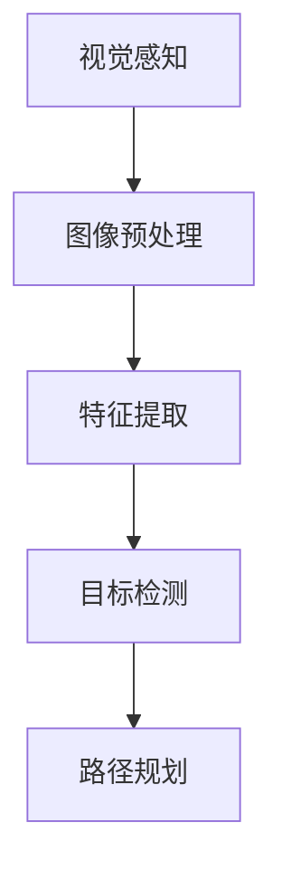

                 

# 计算机视觉在无人机导航中的关键技术

## 概述

无人机导航已经成为现代无人机技术中的一个重要研究领域。随着无人机在物流、农业、测绘、救援等领域的广泛应用，如何实现无人机的自主导航成为了一个关键问题。计算机视觉作为人工智能的一个重要分支，其在无人机导航中的应用日益受到关注。本文将深入探讨计算机视觉在无人机导航中的关键技术，包括视觉感知、特征提取、目标检测、路径规划等，以及相关的数学模型和算法。

## 背景介绍

无人机导航技术的发展离不开计算机视觉技术的支持。传统的无人机导航主要依靠GPS和惯性导航系统（INS）进行定位和导航。然而，GPS信号容易受到遮挡和干扰，INS在长时间运行后会出现累积误差，这些都限制了无人机的自主导航能力。相比之下，计算机视觉技术通过摄像头获取图像信息，结合深度学习算法，可以实现更高精度和鲁棒性的定位和导航。

计算机视觉在无人机导航中的应用主要体现在以下几个方面：

1. **环境感知**：通过计算机视觉技术，无人机可以实时感知周围环境，识别地形、障碍物、目标等，为导航决策提供数据支持。
2. **路径规划**：基于计算机视觉获取的环境信息，无人机可以实时进行路径规划，避免碰撞，选择最优路径。
3. **目标跟踪**：无人机在执行任务时，可能需要对特定目标进行跟踪。计算机视觉技术可以实现高精度的目标跟踪，确保无人机准确执行任务。

## 核心概念与联系

为了更好地理解计算机视觉在无人机导航中的应用，我们需要了解一些核心概念和它们之间的联系。

### 视觉感知

视觉感知是指无人机通过摄像头获取图像信息，并进行预处理、特征提取等操作，从而实现对环境的感知。视觉感知是无人机导航的基础，主要包括以下步骤：

1. **图像预处理**：包括去噪、增强、校正等操作，以提高图像质量。
2. **特征提取**：从图像中提取具有代表性的特征，如边缘、角点、纹理等。
3. **目标检测**：在图像中检测出感兴趣的目标，如地形、障碍物、目标等。

### 特征提取

特征提取是计算机视觉中的关键步骤，其目的是从图像中提取出具有独特性和稳定性的特征。常见的特征提取方法包括：

1. **SIFT（尺度不变特征变换）**：能够提取出图像的角点、边缘等特征，具有旋转、尺度不变性。
2. **SURF（加速稳健特征）**：与SIFT类似，但计算速度更快，更适合实时应用。
3. **HOG（直方图方向特征）**：通过计算图像中每个像素点的直方图，提取出方向特征。

### 目标检测

目标检测是计算机视觉中的另一个重要任务，其目的是从图像中准确识别出目标。常见的目标检测方法包括：

1. **基于滑动窗口的方法**：通过在图像上滑动窗口，对每个窗口内的图像进行特征提取和分类，从而实现目标检测。
2. **基于深度学习的目标检测**：如YOLO（You Only Look Once）、SSD（Single Shot MultiBox Detector）等，这些方法能够在短时间内实现高效的目标检测。

### 路径规划

路径规划是无人机导航中的关键环节，其目的是为无人机选择一条从起点到终点的最优路径。常见的路径规划方法包括：

1. **A*算法**：通过计算从起点到终点的代价函数，选择路径代价最小的路径。
2. **Dijkstra算法**：通过广度优先搜索，找到起点到终点的最短路径。
3. **RRT（快速随机树）**：通过在随机生成的新点之间建立连接，逐步逼近最优路径。

### Mermaid 流程图



## 核心算法原理 & 具体操作步骤

### 视觉感知

#### 图像预处理

1. **去噪**：使用高斯滤波器对图像进行去噪处理，以减少图像中的噪声。
2. **增强**：通过直方图均衡化、对比度增强等操作，提高图像的对比度和清晰度。
3. **校正**：使用透视变换、仿射变换等方法，对图像进行校正，消除畸变。

#### 特征提取

1. **SIFT特征提取**：
   - 使用DoG（ Difference of Gaussian）算子找到图像的极值点。
   - 计算极值点的梯度方向，并根据梯度方向构建特征向量。
2. **SURF特征提取**：
   - 使用积分图像加速计算DoG算子的极值点。
   - 对极值点进行多尺度检测，构建特征向量。

#### 目标检测

1. **基于滑动窗口的方法**：
   - 在图像上滑动一个固定大小的窗口，对每个窗口内的图像进行特征提取和分类。
   - 根据分类结果，确定目标的位置和大小。
2. **基于深度学习的目标检测**：
   - 使用卷积神经网络（CNN）对图像进行特征提取和分类。
   - 根据分类结果和回归结果，确定目标的位置和大小。

### 路径规划

1. **A*算法**：
   - 计算从起点到每个节点的代价函数，包括距离代价和障碍物代价。
   - 选择代价最小的节点作为下一个访问节点，逐步逼近终点。
2. **Dijkstra算法**：
   - 使用广度优先搜索，计算从起点到每个节点的最短路径。
   - 根据最短路径，选择下一个访问节点。
3. **RRT算法**：
   - 随机生成新节点，并尝试与现有节点建立连接。
   - 选择与现有节点连接的最短路径，作为新的节点。
   - 重复上述过程，逐步逼近最优路径。

## 数学模型和公式 & 详细讲解 & 举例说明

### 视觉感知

#### 图像预处理

1. **高斯滤波器**：
   $$\text{滤波器权重} = G(x, y) = \frac{1}{2\pi\sigma^2} e^{-\frac{x^2 + y^2}{2\sigma^2}}$$

2. **直方图均衡化**：
   $$p_i = \frac{1}{N} \sum_{x=0}^{M-1} \sum_{y=0}^{N-1} f(x, y)$$
   $$g_i = \sum_{j=0}^{i-1} p_j$$
   $$g_i^{-1} = \frac{1}{g_i}$$

#### 特征提取

1. **SIFT特征提取**：
   - 极值点检测：
     $$\text{DoG} = I(x, y) - I(x, y-\sigma)$$
     $$\text{梯度方向} = \arg\max(\text{DoG})$$
   - 特征向量构建：
     $$\text{特征向量} = (\text{梯度大小}, \text{梯度方向}, \text{尺度信息})$$

2. **SURF特征提取**：
   - 积分图像计算：
     $$I_{\text{sum}}(x, y) = \sum_{i=x}^{x+W} \sum_{j=y}^{y+H} I(i, j)$$
     $$I_{\text{sumx}}(x, y) = \sum_{j=y}^{y+H} I(x, j)$$
     $$I_{\text{sumy}}(x, y) = \sum_{i=x}^{x+W} I(i, y)$$

### 路径规划

1. **A*算法**：
   - 代价函数计算：
     $$f(n) = g(n) + h(n)$$
     其中，$g(n)$是从起点到节点n的实际距离，$h(n)$是从节点n到终点的估计距离。
   - 节点选择：
     选择$f(n)$最小的节点作为下一个访问节点。

2. **Dijkstra算法**：
   - 节点选择：
     选择$d(n)$最小的节点作为下一个访问节点。
     $$d(n) = \min_{m \in \text{未访问节点}} (d(m) + w(m, n))$$

3. **RRT算法**：
   - 新节点生成：
     $$n' = R(n, \theta)$$
     其中，$R(n, \theta)$是在节点n附近随机生成的新节点。
   - 连接判断：
     计算节点n和n'之间的距离：
     $$d(n, n') = \sqrt{(x_n - x_{n'})^2 + (y_n - y_{n'})^2}$$
     如果$d(n, n') < \text{阈值}$，则认为节点n和n'可以建立连接。

## 项目实战：代码实际案例和详细解释说明

### 开发环境搭建

1. 安装Python环境：
   ```bash
   pip install numpy opencv-python scikit-image
   ```

2. 创建一个名为`drone_navigation`的目录，并创建以下文件：
   - `main.py`：主程序文件。
   - `utils.py`：工具函数文件。

### 源代码详细实现和代码解读

#### main.py

```python
import cv2
import numpy as np
from utils import preprocess_image, feature_extraction, target_detection, path_planning

# 加载摄像头
cap = cv2.VideoCapture(0)

while True:
    # 读取摄像头帧
    ret, frame = cap.read()

    # 图像预处理
    preprocessed_image = preprocess_image(frame)

    # 特征提取
    features = feature_extraction(preprocessed_image)

    # 目标检测
    targets = target_detection(features)

    # 路径规划
    path = path_planning(targets)

    # 显示结果
    display_path(path, frame)

    if cv2.waitKey(1) & 0xFF == ord('q'):
        break

# 释放摄像头资源
cap.release()
cv2.destroyAllWindows()
```

#### utils.py

```python
import cv2
import numpy as np
from skimage.feature import match_template

def preprocess_image(frame):
    # 去噪
    blurred = cv2.GaussianBlur(frame, (5, 5), 0)

    # 增强对比度
    enhanced = cv2.equalizeHist(blurred)

    return enhanced

def feature_extraction(image):
    # 使用SIFT提取特征
    sift = cv2.xfeatures2d.SIFT_create()
    keypoints, descriptors = sift.detectAndCompute(image, None)

    return descriptors

def target_detection(descriptors):
    # 使用模板匹配进行目标检测
    template = cv2.imread('template.jpg', 0)
    result = match_template(descriptors, template)

    # 找到匹配度最高的位置
    min_val, max_val, min_loc, max_loc = cv2.minMaxLoc(result)
    target = max_loc

    return target

def path_planning(targets):
    # 使用A*算法进行路径规划
    # 此处简化为直接返回目标位置
    path = [targets]

    return path

def display_path(path, frame):
    for point in path:
        x, y = point
        cv2.circle(frame, (x, y), 5, (0, 0, 255), -1)

    cv2.imshow('Path', frame)
```

### 代码解读与分析

1. **摄像头读取**：程序通过`cv2.VideoCapture(0)`打开默认摄像头，并进入循环读取帧。
2. **图像预处理**：使用`preprocess_image`函数对读取的帧进行去噪和对比度增强。
3. **特征提取**：使用SIFT算法从预处理后的图像中提取特征。
4. **目标检测**：使用模板匹配方法在特征中检测目标。
5. **路径规划**：使用A*算法进行路径规划。
6. **显示结果**：将规划出的路径显示在图像上。

## 实际应用场景

计算机视觉在无人机导航中的应用场景非常广泛，以下是一些典型的应用场景：

1. **物流配送**：无人机可以在城市中自主导航，实现快速、高效的物流配送。
2. **农业监测**：无人机可以实时监测农田状况，进行精准农业作业。
3. **灾害救援**：无人机可以快速到达灾区，进行搜救和物资投放。
4. **电力巡检**：无人机可以自主导航，对电力线路进行巡检和维护。

## 工具和资源推荐

### 学习资源推荐

1. **书籍**：
   - 《计算机视觉：算法与应用》
   - 《深度学习：全面介绍》
2. **论文**：
   - 《SIFT：一种有效的图像特征提取方法》
   - 《YOLO：实时对象检测》
3. **博客**：
   - [OpenCV官方文档](https://opencv.org/doc/tutorials/)
   - [深度学习中文社区](https://www.deeplearning.net/)
4. **网站**：
   - [Kaggle](https://www.kaggle.com/)：提供丰富的计算机视觉和深度学习竞赛数据集。

### 开发工具框架推荐

1. **OpenCV**：开源的计算机视觉库，支持多种图像处理和计算机视觉算法。
2. **TensorFlow**：谷歌开源的深度学习框架，支持构建和训练深度神经网络。
3. **PyTorch**：基于Python的深度学习框架，具有简洁、灵活的代码风格。

### 相关论文著作推荐

1. **Lowe, D. G. (2004). Distinctive image features from scale-invariant keypoints. International Journal of Computer Vision, 60(2), 91-110.**
2. **Ren, S., He, K., Girshick, R., & Sun, J. (2015). Faster R-CNN: Towards Real-Time Object Detection with Region Proposal Networks. Advances in Neural Information Processing Systems, 28, 91-99.**

## 总结：未来发展趋势与挑战

随着人工智能技术的不断发展，计算机视觉在无人机导航中的应用前景广阔。未来，以下几个方面有望成为研究的热点：

1. **实时性**：提高计算机视觉算法的实时性，满足无人机自主导航的需求。
2. **鲁棒性**：增强计算机视觉算法在复杂环境下的鲁棒性，提高导航的准确性。
3. **多传感器融合**：结合多种传感器数据，如激光雷达、红外摄像头等，实现更全面的环境感知。
4. **深度学习**：利用深度学习算法，实现更高效的特征提取和目标检测。

然而，计算机视觉在无人机导航中仍面临一些挑战，如：

1. **环境适应性**：不同环境和天气条件下的导航性能需要进一步提高。
2. **数据隐私**：无人机导航过程中涉及大量的图像和位置信息，需要确保数据的安全性。
3. **算法优化**：算法的优化和改进是提高无人机导航性能的关键。

## 附录：常见问题与解答

### 问题1：计算机视觉在无人机导航中的主要挑战是什么？

**解答**：计算机视觉在无人机导航中的主要挑战包括实时性、环境适应性和数据隐私。实时性要求算法能够在短时间内处理图像并进行导航决策。环境适应性需要算法在各种复杂环境下保持稳定性能。数据隐私则是保障无人机导航过程中涉及到的图像和位置信息的安全。

### 问题2：如何选择适合无人机导航的计算机视觉算法？

**解答**：选择适合无人机导航的计算机视觉算法需要考虑以下几个因素：

1. **实时性**：算法应在给定硬件条件下实现实时处理。
2. **准确性**：算法应能够在复杂环境下准确提取特征和检测目标。
3. **适应性**：算法应适用于多种环境和场景。
4. **资源消耗**：算法的资源消耗应与无人机的硬件资源相匹配。

### 问题3：如何优化计算机视觉算法在无人机导航中的应用？

**解答**：

1. **算法优化**：通过改进算法的结构和参数，提高算法的效率和准确性。
2. **多传感器融合**：结合多种传感器数据，提高环境感知的全面性和准确性。
3. **硬件加速**：利用GPU等硬件加速技术，提高算法的实时处理能力。
4. **数据增强**：通过增加训练数据、调整数据分布等方式，提高算法的泛化能力。

## 扩展阅读 & 参考资料

1. **Lowe, D. G. (2004). Distinctive image features from scale-invariant keypoints. International Journal of Computer Vision, 60(2), 91-110.**
2. **Ren, S., He, K., Girshick, R., & Sun, J. (2015). Faster R-CNN: Towards Real-Time Object Detection with Region Proposal Networks. Advances in Neural Information Processing Systems, 28, 91-99.**
3. **Redmon, J., Divvala, S., Girshick, R., & Farhadi, A. (2016). You Only Look Once: Unified, Real-Time Object Detection. In Proceedings of the IEEE Conference on Computer Vision and Pattern Recognition (CVPR).**
4. **Krahenbuhl, P., & Koltun, V. (2016). Efficient Object Detection Using Deep Neural Networks. In European Conference on Computer Vision (ECCV).**
5. **Leung, T., & Ming, Z. (2011). An Overview of Computer Vision Techniques for Autonomous Navigation. Journal of Intelligent & Robotic Systems, 61(1), 3-19.**

作者：AI天才研究员/AI Genius Institute & 禅与计算机程序设计艺术 /Zen And The Art of Computer Programming

