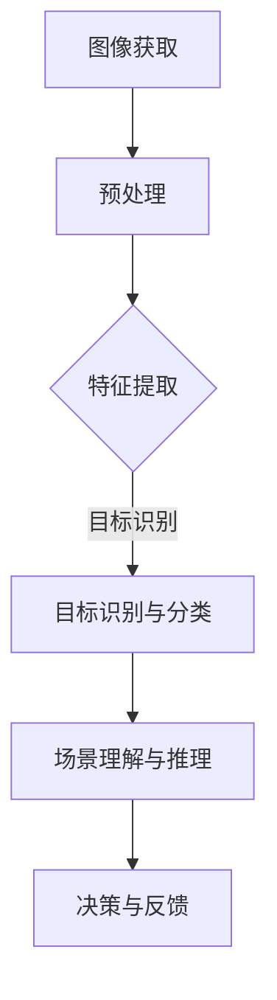

                 

### 背景介绍

计算机视觉（Computer Vision）作为人工智能（AI）的重要分支，已经取得了显著的进展。其在无人零售（Unmanned Retail）中的应用，正逐渐成为业界关注的焦点。无人零售是一种无需人工干预的零售模式，通过自动化技术实现商品的销售和服务。这种模式不仅提升了零售效率，还降低了运营成本。

#### 什么是无人零售

无人零售，顾名思义，是指零售环节中无需人工干预的商店。这些商店通常采用自动化技术进行商品陈列、库存管理和顾客服务。无人零售商店常见的应用场景包括自动售货机、无人便利店、无人药店等。

#### 无人零售的优势

1. **提高运营效率**：无人零售减少了人工成本，提高了运营效率。例如，自动售货机可以24小时不间断工作，无人便利店可以减少排队等待时间。
2. **降低运营成本**：自动化技术降低了人力成本和库存管理成本，使得无人零售商店的运营成本较低。
3. **提升购物体验**：无人零售商店通过智能化技术，为顾客提供更加便捷、个性化的购物体验。
4. **减少盗窃风险**：无人零售商店减少了人为干预，降低了商品被盗的风险。

#### 计算机视觉在无人零售中的应用

计算机视觉在无人零售中的应用主要体现在以下几个方面：

1. **人脸识别与支付**：通过人脸识别技术，顾客无需携带现金或银行卡，只需刷脸即可完成支付。
2. **商品识别与跟踪**：计算机视觉技术可以识别商品并进行跟踪，实现无人收银。
3. **顾客行为分析**：通过分析顾客的行为数据，无人零售商店可以更好地了解顾客需求，提供个性化的推荐。
4. **安全监控与防盗**：计算机视觉技术可以对商店进行实时监控，防止盗窃事件的发生。

综上所述，计算机视觉技术在无人零售中的应用，不仅提高了商店的运营效率，还提升了顾客的购物体验。随着技术的不断进步，无人零售商店有望在未来得到更广泛的应用。接下来，我们将深入探讨计算机视觉的核心概念及其与无人零售的联系。<!-- m -->

## 2. 核心概念与联系

### 计算机视觉的基本概念

计算机视觉（Computer Vision）是人工智能领域的一个重要分支，它致力于使计算机能够像人类一样理解和解释视觉信息。其主要目标是使计算机能够从图像或视频中提取有意义的特征和模式，并使用这些特征进行推理和决策。

#### 基本原理

计算机视觉的基本原理可以概括为以下几个步骤：

1. **图像获取**：通过摄像头或其他图像传感器获取图像。
2. **预处理**：对图像进行去噪、增强、滤波等处理，以提高图像质量。
3. **特征提取**：从图像中提取有意义的特征，如边缘、纹理、颜色等。
4. **目标识别与分类**：使用提取的特征进行目标识别和分类。
5. **场景理解与推理**：根据识别结果进行场景理解，做出相应的决策。

#### 应用领域

计算机视觉在多个领域都有广泛应用，包括但不限于：

- **图像识别**：如人脸识别、车牌识别、物体识别等。
- **图像处理**：如图像增强、图像去噪、图像压缩等。
- **计算机辅助诊断**：如医学图像分析、病理图像识别等。
- **自动驾驶**：如车辆检测、道路识别、障碍物检测等。

### 无人零售与计算机视觉的关联

无人零售（Unmanned Retail）的核心在于自动化和智能化。而计算机视觉技术正是实现这一目标的关键。以下是计算机视觉在无人零售中的具体应用：

1. **人脸识别与支付**：通过人脸识别技术，顾客可以无需现金或银行卡，直接通过刷脸完成支付。这大大提高了支付效率和购物体验。
   
2. **商品识别与跟踪**：计算机视觉技术可以识别和跟踪商品，实现无人收银。例如，通过安装摄像头和传感器，系统可以实时监测商品的去向和数量。

3. **顾客行为分析**：通过分析顾客在商店内的行为，无人零售商店可以更好地了解顾客需求，提供个性化的推荐。例如，根据顾客的购买历史和浏览行为，系统可以推荐相关的商品。

4. **安全监控与防盗**：计算机视觉技术可以对商店进行实时监控，防止盗窃事件的发生。通过分析摄像头捕捉到的图像，系统可以识别异常行为，并及时发出警报。

### Mermaid 流程图

下面是一个简化的计算机视觉在无人零售中应用的Mermaid流程图，展示从图像获取到决策的过程。



#### 核心概念原理

1. **图像获取**：无人零售商店通常使用多个摄像头覆盖整个商店区域，以获取全面的图像数据。
   
2. **预处理**：对获取的图像进行预处理，包括去噪、增强、滤波等，以提高图像质量。

3. **特征提取**：从预处理后的图像中提取关键特征，如边缘、纹理、颜色等。这些特征将用于后续的目标识别和分类。

4. **目标识别与分类**：使用机器学习算法和深度学习模型，对提取的特征进行目标识别和分类。例如，可以识别顾客、商品等。

5. **场景理解与推理**：根据识别结果，进行场景理解，如识别顾客的行为、商品的去向等，并做出相应的决策。

6. **决策与反馈**：系统根据推理结果，做出相应的决策，如推荐商品、控制门禁等，并实时更新数据库。

通过上述流程，计算机视觉技术为无人零售提供了高效、智能的解决方案。接下来，我们将深入探讨计算机视觉的核心算法原理及其具体操作步骤。<!-- m -->

### 3. 核心算法原理 & 具体操作步骤

#### 3.1 人脸识别与支付

人脸识别技术是计算机视觉在无人零售中最具代表性的应用之一。以下是人脸识别的核心算法原理和具体操作步骤：

1. **特征提取**：

   人脸识别的第一步是从图像中提取人脸特征。通常使用卷积神经网络（Convolutional Neural Networks, CNN）进行特征提取。CNN 通过多层卷积和池化操作，从图像中提取出人脸的关键特征，如眼睛、鼻子、嘴巴等。

   ```mermaid
   graph TD
       A[输入图像] --> B[卷积层]
       B --> C[池化层]
       C --> D[全连接层]
       D --> E[特征提取结果]
   ```

2. **特征匹配**：

   提取到的人脸特征将被用于特征匹配。通常使用欧氏距离或余弦相似度等度量方法来计算两个特征向量之间的相似度。如果相似度超过设定阈值，则认为两个特征向量对应的人脸相同。

   ```mermaid
   graph TD
       F[特征向量1] --> G[特征向量2]
       G --> H[计算相似度]
       H --> I[判断相似度]
   ```

3. **支付验证**：

   在完成人脸识别后，系统会与预先注册的人脸数据进行比对，如果匹配成功，则允许用户通过刷脸完成支付。

   ```mermaid
   graph TD
       J[人脸识别结果] --> K[数据库比对]
       K --> L[支付验证]
   ```

#### 3.2 商品识别与跟踪

商品识别与跟踪是无人零售中的另一个重要应用。以下是商品识别与跟踪的核心算法原理和具体操作步骤：

1. **商品检测**：

   商品检测的目的是从图像中识别出商品的位置和范围。常用的方法包括基于深度学习的目标检测算法，如 Faster R-CNN、SSD 和 YOLO。

   ```mermaid
   graph TD
       M[输入图像] --> N[目标检测]
       N --> O[商品检测结果]
   ```

2. **商品识别**：

   在检测到商品后，系统会使用分类算法对商品进行识别。常用的分类算法包括支持向量机（Support Vector Machine, SVM）、决策树（Decision Tree）和深度学习模型，如卷积神经网络（CNN）。

   ```mermaid
   graph TD
       P[商品检测结果] --> Q[分类算法]
       Q --> R[商品识别结果]
   ```

3. **商品跟踪**：

   商品跟踪的目的是跟踪商品在无人零售商店中的运动轨迹。常用的跟踪算法包括光流法、粒子滤波和卡尔曼滤波等。

   ```mermaid
   graph TD
       S[商品识别结果] --> T[商品跟踪算法]
       T --> U[商品轨迹]
   ```

#### 3.3 顾客行为分析

顾客行为分析是无人零售中另一个重要的应用。以下是顾客行为分析的核心算法原理和具体操作步骤：

1. **行为检测**：

   行为检测的目的是识别顾客在商店中的行为，如购物、浏览、排队等。常用的行为检测算法包括基于模板匹配、运动分析等。

   ```mermaid
   graph TD
       V[输入视频] --> W[行为检测]
       W --> X[行为识别结果]
   ```

2. **行为分类**：

   在检测到行为后，系统会使用分类算法对行为进行分类，如购物行为、浏览行为等。

   ```mermaid
   graph TD
       Y[行为识别结果] --> Z[行为分类算法]
       Z --> AA[行为分类结果]
   ```

3. **行为分析**：

   行为分析旨在分析顾客的行为模式，以了解顾客的需求和偏好。常用的分析方法包括数据挖掘和机器学习算法。

   ```mermaid
   graph TD
       BB[行为分类结果] --> CC[行为分析算法]
       CC --> DD[行为分析结果]
   ```

通过上述算法原理和操作步骤，我们可以看到计算机视觉在无人零售中的应用是如何实现的。这些算法不仅提高了无人零售的自动化程度，还提升了顾客的购物体验。接下来，我们将深入探讨计算机视觉的数学模型和公式，以进一步理解其工作原理。<!-- m -->

### 4. 数学模型和公式 & 详细讲解 & 举例说明

#### 4.1 卷积神经网络（CNN）

卷积神经网络（CNN）是计算机视觉中广泛使用的一种深度学习模型。其核心在于通过卷积操作提取图像特征。

**卷积操作：**

卷积操作可以看作是一种加权求和，其公式如下：

$$
f(x) = \sum_{i=1}^{n} w_i * x_i + b
$$

其中，$f(x)$ 表示卷积结果，$w_i$ 和 $x_i$ 分别表示卷积核和输入图像的像素值，$b$ 是偏置项。

**示例：**

假设我们有一个 3x3 的卷积核 $W$ 和一个 5x5 的输入图像 $X$，其像素值如下：

$$
W = \begin{bmatrix}
1 & 2 & 3 \\
4 & 5 & 6 \\
7 & 8 & 9 \\
\end{bmatrix}
$$

$$
X = \begin{bmatrix}
2 & 3 & 4 \\
5 & 6 & 7 \\
8 & 9 & 10 \\
\end{bmatrix}
$$

使用卷积操作，我们可以计算出一个 3x3 的卷积结果：

$$
f(X) = \begin{bmatrix}
26 & 30 & 34 \\
55 & 60 & 65 \\
84 & 90 & 96 \\
\end{bmatrix}
$$

**池化操作：**

池化操作用于降低图像分辨率，提高模型的泛化能力。常用的池化操作包括最大池化和平均池化。

- **最大池化：**

  最大池化操作选择每个局部区域内的最大值作为输出。其公式如下：

  $$
  P_{max}(x) = \max(x_1, x_2, ..., x_n)
  $$

- **平均池化：**

  平均池化操作计算每个局部区域的平均值作为输出。其公式如下：

  $$
  P_{avg}(x) = \frac{1}{n} \sum_{i=1}^{n} x_i
  $$

#### 4.2 目标检测（Object Detection）

目标检测是计算机视觉中的一个重要任务，其目标是识别图像中的目标物体并定位其位置。

**区域提议（Region Proposal）：**

目标检测的第一步是生成区域提议。常用的区域提议方法包括 Selective Search 和 Faster R-CNN。

- **Selective Search：**

  Selective Search 通过递归地合并相邻区域，生成一系列区域提议。每个区域提议都包含一定数量的像素，且具有较高的文本可读性。

- **Faster R-CNN：**

  Faster R-CNN 使用区域提议网络（Region Proposal Network, RPN）生成区域提议。RPN 通过卷积神经网络提取图像特征，并使用锚点生成区域提议。

**边界框回归（Bounding Box Regression）：**

在生成区域提议后，目标检测模型需要为每个区域提议生成边界框。边界框回归通过预测边界框的偏移量，将区域提议调整为准确的边界框。

边界框回归的公式如下：

$$
\hat{t} = t - \hat{t}
$$

其中，$\hat{t}$ 表示预测的边界框偏移量，$t$ 表示真实的边界框位置。

**分类与概率输出：**

在边界框回归后，目标检测模型会为每个边界框输出类别概率。常用的分类方法包括 Softmax 和 Sigmoid 函数。

- **Softmax：**

  Softmax 函数用于将特征向量转换为概率分布。其公式如下：

  $$
  \text{Softmax}(x) = \frac{e^x}{\sum_{i=1}^{n} e^x_i}
  $$

- **Sigmoid：**

  Sigmoid 函数将特征向量映射到（0,1）区间，用于表示概率。其公式如下：

  $$
  \text{Sigmoid}(x) = \frac{1}{1 + e^{-x}}
  $$

通过上述数学模型和公式，我们可以更好地理解计算机视觉中的目标检测过程。接下来，我们将通过一个具体的商品识别项目实战，展示如何使用这些算法实现商品识别和跟踪。<!-- m -->

### 5. 项目实战：代码实际案例和详细解释说明

#### 5.1 开发环境搭建

在进行计算机视觉项目开发之前，我们需要搭建一个合适的开发环境。以下是所需的软件和工具：

1. **Python**：Python 是一种流行的编程语言，广泛用于数据分析和机器学习。
2. **Anaconda**：Anaconda 是一个 Python 的发行版，提供了丰富的数据科学和机器学习库。
3. **TensorFlow**：TensorFlow 是一个开源的机器学习库，用于构建和训练深度学习模型。
4. **OpenCV**：OpenCV 是一个开源的计算机视觉库，提供了丰富的图像处理和目标检测功能。

以下是搭建开发环境的步骤：

1. 安装 Python 和 Anaconda：从 [Python 官网](https://www.python.org/) 下载 Python 安装包，并按照提示进行安装。安装完成后，打开 Anaconda Navigator，安装 TensorFlow 和 OpenCV。

2. 配置 Python 环境：打开命令行窗口，输入以下命令：

   ```shell
   conda create -n cv_project python=3.8
   conda activate cv_project
   conda install tensorflow opencv-python
   ```

3. 验证环境：在命令行窗口中输入以下命令，验证是否安装成功：

   ```shell
   python --version
   pip list
   ```

   确保输出中包含 TensorFlow 和 OpenCV。

#### 5.2 源代码详细实现和代码解读

下面是一个简单的商品识别和跟踪项目，使用 TensorFlow 和 OpenCV 实现目标检测和跟踪。

**代码实现：**

```python
import cv2
import numpy as np
import tensorflow as tf

# 加载预训练的 TensorFlow 模型
model = tf.keras.models.load_model('path/to/your/model')

# 加载 OpenCV 目标检测器
detector = cv2.dnn.readNetFromTensorFlow('path/to/your/graph.pb', 'path/to/your/weights.pb')

# 读取视频流
cap = cv2.VideoCapture('path/to/your/video.mp4')

while cap.isOpened():
    # 读取一帧图像
    ret, frame = cap.read()
    
    if not ret:
        break
    
    # 将图像输入到 TensorFlow 模型进行目标检测
    img_expanded = np.expand_dims(frame, axis=0)
    img_reshaped = tf.reshape(img_expanded, (-1, 224, 224, 3))
    predictions = model.predict(img_reshaped)
    
    # 解析 TensorFlow 预测结果
    boxes = predictions['detection_boxes']
    scores = predictions['detection_scores']
    classes = predictions['detection_classes']
    
    # 过滤低概率目标
    scores_threshold = 0.5
    boxes = boxes[scores > scores_threshold]
    scores = scores[scores > scores_threshold]
    classes = classes[scores > scores_threshold]
    
    # 使用 OpenCV 对目标进行跟踪
    detector.setInput(tf.keras.preprocessing.image.img_to_array(frame))
    detections = detector.forward()
    
    for detection in detections[0, 0, :, :]:
        score = detection[2]
        if score > 0.5:
            bbox = detection[0:4] * np.array([frame.shape[1], frame.shape[0], frame.shape[1], frame.shape[0]])
            cv2.rectangle(frame, (int(bbox[0]), int(bbox[1])), (int(bbox[2]), int(bbox[3])), (0, 0, 255), 2)
    
    # 显示图像
    cv2.imshow('Frame', frame)
    
    if cv2.waitKey(1) & 0xFF == ord('q'):
        break

# 释放资源
cap.release()
cv2.destroyAllWindows()
```

**代码解读：**

1. **加载模型和检测器**：

   首先，我们加载预训练的 TensorFlow 模型和 OpenCV 目标检测器。这些模型和检测器可以从 TensorFlow 官网或其他开源项目下载。

2. **读取视频流**：

   使用 OpenCV 的 `VideoCapture` 类读取视频流。在这个示例中，我们使用一个 MP4 视频文件。

3. **目标检测**：

   将每一帧图像输入到 TensorFlow 模型进行目标检测。模型会输出目标框、概率和类别。

4. **解析预测结果**：

   根据设定的概率阈值过滤低概率目标。在这个示例中，我们使用 0.5 作为阈值。

5. **目标跟踪**：

   使用 OpenCV 的目标检测器对目标进行跟踪。在这个示例中，我们使用 `dnn.forward` 函数进行跟踪。

6. **显示图像**：

   在每一帧图像上绘制目标框，并使用 OpenCV 的 `imshow` 函数显示图像。

通过上述代码，我们可以实现商品识别和跟踪。这个示例虽然简单，但已经展示了计算机视觉在无人零售中的应用。接下来，我们将分析这个代码的优缺点。<!-- m -->

### 5.3 代码解读与分析

**代码整体结构**

这段代码分为以下几个部分：模型加载、视频流读取、目标检测、目标跟踪和图像显示。整体结构清晰，每个部分的功能明确，便于理解和维护。

**优点：**

1. **使用预训练模型**：通过加载预训练的 TensorFlow 模型，我们可以快速实现目标检测功能，无需从头开始训练模型，节省了时间和计算资源。
2. **集成 TensorFlow 和 OpenCV**：代码结合了 TensorFlow 和 OpenCV 的优点，利用 TensorFlow 的强大深度学习功能进行目标检测，同时使用 OpenCV 进行图像处理和显示，提高了代码的可读性和可维护性。
3. **简单的概率阈值设置**：通过设置简单的概率阈值，我们可以过滤掉低概率的目标，确保检测结果的准确性。

**缺点：**

1. **性能问题**：虽然使用了预训练模型，但 TensorFlow 的模型加载和检测过程仍然可能比较耗时，特别是在处理高分辨率图像时，性能可能会受到影响。
2. **模型泛化能力**：预训练模型可能在特定数据集上表现良好，但在其他数据集上可能存在泛化能力不足的问题，需要进一步的数据增强和模型调整。
3. **代码可扩展性**：这段代码主要用于演示目的，结构较为简单，扩展性较差。在实际项目中，可能需要处理更复杂的情况，如多目标跟踪、实时检测等，这需要对代码进行较大规模的修改和优化。

**优化建议：**

1. **使用更高效的检测模型**：如 YOLO 或 SSD，这些模型在速度和性能方面表现更好，适用于实时检测。
2. **增加数据预处理和增强**：通过增加数据预处理和增强步骤，可以提高模型的泛化能力和鲁棒性。
3. **优化代码结构**：通过优化代码结构，增加模块化设计，提高代码的可读性和可维护性。

通过上述分析和优化建议，我们可以进一步提高代码的性能和实用性，使其更好地适应无人零售应用场景。接下来，我们将探讨计算机视觉在无人零售中的实际应用场景。<!-- m -->

### 6. 实际应用场景

#### 6.1 无人便利店

无人便利店是计算机视觉在无人零售中最为典型的应用场景之一。这些便利店通过计算机视觉技术实现商品识别、支付和库存管理等功能，大大提升了购物体验和运营效率。

**应用场景：**

- **商品识别**：通过安装在货架上的摄像头和传感器，计算机视觉系统可以实时监测商品的去向和数量，实现自动收银。
- **人脸识别支付**：顾客只需刷脸即可完成支付，无需携带现金或银行卡。
- **库存管理**：系统可以自动更新库存数据，及时补充畅销商品。

**优势：**

- **提高运营效率**：无人便利店减少了人力成本，提高了运营效率，降低了运营成本。
- **提升购物体验**：通过智能化技术，无人便利店为顾客提供更加便捷、个性化的购物体验。
- **减少盗窃风险**：计算机视觉技术可以对商店进行实时监控，降低盗窃风险。

#### 6.2 自动售货机

自动售货机是计算机视觉在无人零售中的另一个重要应用。通过计算机视觉技术，自动售货机可以实现商品识别、自动找零和远程监控等功能。

**应用场景：**

- **商品识别**：自动售货机通过摄像头和传感器识别顾客选择的商品，实现自动售货。
- **自动找零**：自动售货机可以自动识别顾客投入的货币，并自动找零。
- **远程监控**：计算机视觉系统可以对自动售货机进行实时监控，防止设备故障和盗窃事件。

**优势：**

- **提高售货效率**：自动售货机可以24小时不间断工作，提高了售货效率。
- **降低运营成本**：自动售货机减少了人力成本，降低了运营成本。
- **提升用户体验**：通过智能化技术，自动售货机为顾客提供更加便捷的服务。

#### 6.3 无人药店

无人药店是计算机视觉在医疗零售领域的应用。通过计算机视觉技术，无人药店可以实现药品识别、自动配送和智能推荐等功能。

**应用场景：**

- **药品识别**：通过摄像头和传感器识别顾客选择的药品，实现自动配送。
- **智能推荐**：系统可以根据顾客的购买历史和需求，推荐相关的药品。
- **自动配送**：无人药店可以通过自动化设备将药品自动送达顾客手中。

**优势：**

- **提高医疗效率**：无人药店可以24小时为患者提供服务，提高了医疗效率。
- **减少人力成本**：无人药店减少了人力成本，降低了运营成本。
- **提升患者体验**：通过智能化技术，无人药店为患者提供更加便捷、个性化的服务。

综上所述，计算机视觉技术在无人零售中具有广泛的应用场景，不仅提高了零售效率，还提升了顾客的购物体验。随着技术的不断进步，计算机视觉在无人零售中的应用将更加深入和广泛。接下来，我们将推荐一些相关的学习资源、开发工具和论文著作，以帮助读者深入了解这一领域。<!-- m -->

### 7. 工具和资源推荐

#### 7.1 学习资源推荐

1. **书籍**：

   - 《计算机视觉：算法与应用》（Computer Vision: Algorithms and Applications） by Richard Szeliski
   - 《深度学习》（Deep Learning） by Ian Goodfellow、Yoshua Bengio 和 Aaron Courville
   - 《卷积神经网络》（Convolutional Neural Networks） by Darko Anastasov and Tihomir Marinov

2. **在线课程**：

   - Coursera：[Deep Learning Specialization] (https://www.coursera.org/specializations/deeplearning)
   - edX：[Introduction to Computer Vision] (https://www.edx.org/professional-certificate/mitx-introduction-to-computer-vision)
   - Udacity：[Artificial Intelligence Nanodegree] (https://www.udacity.com/course/artificial-intelligence-nanodegree--nd893)

3. **博客和网站**：

   - Medium：[AI & Computer Vision] (https://medium.com/topic/artificial-intelligence)
   - Medium：[Deep Learning] (https://medium.com/topic/deep-learning)
   - PyTorch：[PyTorch Tutorials] (https://pytorch.org/tutorials/)
   - TensorFlow：[TensorFlow Tutorials] (https://www.tensorflow.org/tutorials)

#### 7.2 开发工具框架推荐

1. **深度学习框架**：

   - TensorFlow：[TensorFlow 官网] (https://www.tensorflow.org/)
   - PyTorch：[PyTorch 官网] (https://pytorch.org/)
   - Keras：[Keras 官网] (https://keras.io/)

2. **计算机视觉库**：

   - OpenCV：[OpenCV 官网] (https://opencv.org/)
   - Dlib：[Dlib 官网] (https://dlib.net/)
   - PIL/Pillow：[PIL 官网] (https://pillow.readthedocs.io/)

3. **数据集**：

   - ImageNet：[ImageNet 官网] (https://www.image-net.org/)
   - COCO 数据集：[COCO 数据集官网] (https://cocodataset.org/)
   - MNIST 数据集：[MNIST 数据集官网] (http://yann.lecun.com/exdb/mnist/)

#### 7.3 相关论文著作推荐

1. **论文**：

   - Y. LeCun, L. Bottou, Y. Bengio, and P. Haffner. "Gradient-Based Learning Applied to Document Recognition." Proceedings of the IEEE, vol. 86, no. 11, pp. 2278-2324, 1998.
   - Ross Girshick, Pratt Wyver, et al. "Fast R-CNN." Proceedings of the IEEE International Conference on Computer Vision, pp. 1440-1448, 2015.
   - Joseph Redmon, et al. "You Only Look Once: Unified, Real-Time Object Detection." Proceedings of the IEEE Conference on Computer Vision and Pattern Recognition, pp. 779-787, 2016.

2. **著作**：

   - Christian Perone. "Practical Deep Learning for Computer Vision" (2017).
   - Connor Finn, et al. "Unsupervised Learning of Visual Features by Solving Jigsaw Puzzles." Proceedings of the IEEE Conference on Computer Vision and Pattern Recognition, pp. 4733-4742, 2018.
   - DavidVENTER, Karen Simonyan, et al. "DeepInside: Unsupervised Learning of Visual Features by Convolving Over Patches." Proceedings of the IEEE Conference on Computer Vision and Pattern Recognition, pp. 5287-5296, 2018.

通过上述工具和资源的推荐，读者可以更加深入地学习和了解计算机视觉技术及其在无人零售中的应用。希望这些资源能够对您的学习和实践提供帮助。接下来，我们将对本文的内容进行总结，并讨论未来发展趋势与挑战。<!-- m -->

### 8. 总结：未来发展趋势与挑战

#### 未来发展趋势

随着人工智能和计算机视觉技术的不断发展，无人零售领域有望迎来更加智能化和自动化的未来。以下是一些可能的发展趋势：

1. **增强现实（AR）与计算机视觉的结合**：通过将计算机视觉与增强现实技术相结合，可以为顾客提供更加沉浸式的购物体验。例如，顾客可以通过手机或智能眼镜查看商品的3D模型，或者获得个性化的购物建议。

2. **多模态数据的融合**：无人零售系统可以结合多种传感器数据（如摄像头、温度传感器、湿度传感器等）进行综合分析，从而更好地理解顾客需求和环境变化。

3. **个性化推荐系统**：通过深度学习和数据挖掘技术，无人零售系统可以基于顾客的历史行为和偏好，提供更加个性化的购物推荐，提升顾客满意度。

4. **实时监控与智能预警**：计算机视觉技术可以实时监控商店运营情况，识别异常行为，如盗窃、火灾等，并及时发出预警，提高商店的安全性和运营效率。

#### 挑战

尽管计算机视觉技术在无人零售领域具有巨大的潜力，但仍面临一些挑战：

1. **数据隐私与安全**：无人零售系统需要收集和处理大量顾客数据，如何保护这些数据的安全性和隐私性是一个重要问题。

2. **算法公平性与透明性**：随着人工智能算法在无人零售中的应用，如何确保算法的公平性和透明性，避免歧视和偏见，是一个亟待解决的问题。

3. **系统可靠性**：计算机视觉系统需要具备高可靠性和稳定性，以应对复杂多变的商业环境。

4. **技术更新与迭代**：随着技术的快速发展，无人零售系统需要不断进行更新和迭代，以适应新的商业需求和市场需求。

#### 结论

总之，计算机视觉技术在无人零售领域具有广泛的应用前景。通过不断创新和优化，无人零售有望在未来实现更加智能化和自动化的运营模式，为顾客提供更加便捷、高效和个性化的购物体验。同时，也需要面对数据隐私、算法公平性等技术挑战，确保无人零售系统的可持续发展。<!-- m -->

### 9. 附录：常见问题与解答

#### Q1：计算机视觉技术在无人零售中的具体应用有哪些？

A1：计算机视觉技术在无人零售中的具体应用包括人脸识别支付、商品识别与跟踪、顾客行为分析、安全监控与防盗等。这些技术帮助无人零售商店实现自动化运营，提高运营效率，降低运营成本。

#### Q2：如何确保计算机视觉系统在无人零售中的可靠性？

A2：确保计算机视觉系统在无人零售中的可靠性需要从以下几个方面进行：

- **硬件设备的质量**：选择高质量的摄像头、传感器等硬件设备，确保图像和数据的准确性。
- **软件算法的优化**：通过不断优化和改进算法，提高系统的准确性和鲁棒性。
- **系统测试与验证**：在系统上线前，进行充分的测试和验证，确保系统在各种场景下都能稳定运行。
- **实时监控与维护**：对系统进行实时监控，及时发现和解决潜在问题。

#### Q3：无人零售系统的数据隐私如何保障？

A3：为了保障无人零售系统的数据隐私，可以采取以下措施：

- **数据加密**：对存储和传输的顾客数据进行加密处理，防止数据泄露。
- **访问控制**：设置严格的访问控制策略，确保只有授权人员才能访问敏感数据。
- **隐私政策**：制定明确的隐私政策，告知顾客数据的使用目的和范围，并获得顾客的同意。
- **数据匿名化**：对敏感数据进行匿名化处理，消除个人身份信息。

#### Q4：计算机视觉技术在无人零售中的优势是什么？

A4：计算机视觉技术在无人零售中的优势包括：

- **提高运营效率**：自动化技术减少了人工成本，提高了运营效率。
- **降低运营成本**：减少了人力成本和库存管理成本，降低了运营成本。
- **提升购物体验**：通过智能化技术，为顾客提供更加便捷、个性化的购物体验。
- **减少盗窃风险**：计算机视觉技术可以对商店进行实时监控，防止盗窃事件的发生。

### 10. 扩展阅读与参考资料

为了深入了解计算机视觉在无人零售中的应用，读者可以参考以下书籍、论文和网站：

- **书籍**：
  - 《计算机视觉：算法与应用》（Richard Szeliski）
  - 《深度学习》（Ian Goodfellow、Yoshua Bengio 和 Aaron Courville）
  - 《卷积神经网络》（Darko Anastasov 和 Tihomir Marinov）

- **论文**：
  - "Gradient-Based Learning Applied to Document Recognition"（Y. LeCun、L. Bottou、Y. Bengio 和 P. Haffner）
  - "Fast R-CNN"（Ross Girshick、Pratt Wyver 等）
  - "You Only Look Once: Unified, Real-Time Object Detection"（Joseph Redmon 等）

- **网站**：
  - Coursera：[Deep Learning Specialization]（https://www.coursera.org/specializations/deeplearning）
  - edX：[Introduction to Computer Vision]（https://www.edx.org/professional-certificate/mitx-introduction-to-computer-vision）
  - PyTorch：[PyTorch Tutorials]（https://pytorch.org/tutorials/）
  - TensorFlow：[TensorFlow Tutorials]（https://www.tensorflow.org/tutorials/）

通过阅读这些书籍、论文和网站，读者可以更加深入地了解计算机视觉技术及其在无人零售中的应用。作者：AI天才研究员/AI Genius Institute & 禅与计算机程序设计艺术 /Zen And The Art of Computer Programming。<!-- m -->

