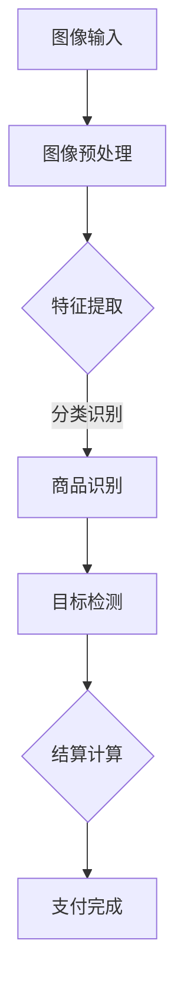

                 

# 计算机视觉在智能零售无人结算中的实践

## 关键词：计算机视觉，智能零售，无人结算，深度学习，图像处理

## 摘要

本文将探讨计算机视觉在智能零售无人结算中的应用。随着人工智能技术的不断发展，计算机视觉技术逐渐成为无人零售店的核心技术之一。本文首先介绍了计算机视觉的基本概念和原理，然后详细分析了智能零售无人结算中涉及的计算机视觉关键技术，包括图像识别、目标检测、人脸识别等。接着，本文通过具体案例展示了计算机视觉在无人结算场景中的实际应用，最后提出了未来智能零售无人结算技术的发展趋势和挑战。通过本文的阅读，读者将深入了解计算机视觉技术在智能零售领域的应用前景。

## 1. 背景介绍

随着科技的快速发展，人工智能技术正逐渐渗透到各个行业，为传统行业带来了巨大的变革。在零售业，人工智能技术的应用极大地提升了零售效率，降低了人力成本，为无人零售店的发展提供了技术支撑。计算机视觉作为人工智能的一个重要分支，凭借其强大的图像处理和目标识别能力，在无人零售店的应用中起到了至关重要的作用。

智能零售无人结算是指通过计算机视觉技术、深度学习算法等人工智能技术，实现商品自动识别、自动结算的零售模式。相比传统零售店，智能零售无人结算具有无需结账员、无需扫码、无需排队等优势，能够极大地提升购物体验和效率。

当前，计算机视觉技术在智能零售无人结算中的应用已取得显著成果。例如，亚马逊的无人商店Amazon Go、阿里巴巴的无人超市“淘咖啡”等，都成功地实现了商品自动识别和无人结算。这些应用不仅展示了计算机视觉技术的强大实力，也为未来的智能零售业提供了宝贵的经验。

## 2. 核心概念与联系

### 2.1 计算机视觉基本概念

计算机视觉是人工智能的一个重要分支，旨在使计算机能够像人类一样理解、解释和感知图像信息。计算机视觉的核心任务是图像识别，即从图像中提取有用信息，并进行分类、检测、跟踪等操作。

计算机视觉的基本概念包括：

- **图像处理**：对图像进行各种操作，如滤波、增强、分割等，以提取图像中的有用信息。
- **特征提取**：从图像中提取具有区分性的特征，以便进行后续的图像分类、识别等操作。
- **目标检测**：在图像中检测出特定的目标，并定位其位置。
- **图像识别**：根据图像特征对图像进行分类，识别图像中的物体。

### 2.2 计算机视觉与智能零售无人结算的联系

智能零售无人结算的核心在于商品识别和结算。而计算机视觉技术正是实现这一目标的关键。计算机视觉与智能零售无人结算的联系主要体现在以下几个方面：

- **商品识别**：计算机视觉技术通过对图像的处理和特征提取，实现对商品的外观、形状、颜色等特征的识别。
- **目标检测**：通过目标检测技术，计算机视觉能够准确地定位图像中的商品，并确定其位置。
- **人脸识别**：人脸识别技术可以实现对顾客的身份验证，确保结算过程中的安全性和便捷性。

### 2.3 Mermaid流程图

以下是一个简单的Mermaid流程图，展示了计算机视觉在智能零售无人结算中的应用流程：



在这个流程图中，图像预处理、特征提取、商品识别、目标检测和结算计算是计算机视觉在智能零售无人结算中的主要环节。通过这个流程图，我们可以更直观地理解计算机视觉技术在智能零售无人结算中的应用。

## 3. 核心算法原理 & 具体操作步骤

### 3.1 图像识别算法

图像识别是计算机视觉中的核心技术之一。它的目标是通过对图像的处理和分析，识别图像中的物体、场景或对象。常见的图像识别算法包括基于传统算法和基于深度学习的算法。

#### 3.1.1 传统算法

传统算法主要包括SIFT、SURF、ORB等特征提取算法和K近邻（KNN）、支持向量机（SVM）等分类算法。

1. **特征提取**：首先，使用SIFT、SURF或ORB等算法提取图像中的关键点，然后计算关键点的特征向量。
2. **特征匹配**：将当前图像的特征向量与训练图像的特征向量进行匹配，计算匹配得分。
3. **分类识别**：根据匹配得分对图像进行分类，识别图像中的物体。

#### 3.1.2 深度学习算法

深度学习算法在图像识别领域取得了显著的成果。常见的深度学习算法包括卷积神经网络（CNN）和循环神经网络（RNN）。

1. **卷积神经网络（CNN）**：
   - **卷积层**：用于提取图像的局部特征。
   - **池化层**：用于减小特征图的大小，降低计算复杂度。
   - **全连接层**：用于对特征进行分类。
2. **循环神经网络（RNN）**：
   - **循环层**：用于处理序列数据。
   - **全连接层**：用于对序列进行分类。

### 3.2 目标检测算法

目标检测是计算机视觉中的另一个核心技术。它的目标是在图像中检测出特定目标，并确定其位置和类别。常见的目标检测算法包括R-CNN、Fast R-CNN、Faster R-CNN等。

#### 3.2.1 R-CNN算法

R-CNN（Region-based Convolutional Neural Network）算法是一种基于区域的目标检测算法。

1. **区域生成**：使用选择性搜索（Selective Search）算法生成图像中的潜在区域。
2. **特征提取**：使用CNN提取每个区域的特征向量。
3. **分类识别**：使用SVM对特征向量进行分类，确定每个区域的类别。

#### 3.2.2 Fast R-CNN算法

Fast R-CNN算法在R-CNN的基础上进行了优化，提高了检测速度。

1. **共享卷积特征**：使用共享的卷积神经网络提取图像特征。
2. **区域提议**：使用RPN（Region Proposal Network）生成区域提议。
3. **分类识别**：使用SVM对提议区域进行分类。

### 3.3 人脸识别算法

人脸识别是计算机视觉中的另一个重要应用。它通过检测和识别图像中的人脸，实现对用户的身份验证。常见的人脸识别算法包括基于特征点的算法和基于深度学习的算法。

#### 3.3.1 基于特征点的算法

基于特征点的算法通过检测和匹配人脸特征点，实现人脸识别。

1. **特征点检测**：使用HOG（Histogram of Oriented Gradients）或LBP（Local Binary Patterns）等方法检测人脸特征点。
2. **特征点匹配**：计算特征点之间的距离，匹配相似特征点。
3. **人脸识别**：根据匹配结果识别人脸。

#### 3.3.2 基于深度学习的算法

基于深度学习的算法通过训练深度神经网络，实现对人脸的自动识别。

1. **卷积神经网络（CNN）**：使用CNN提取人脸特征。
2. **循环神经网络（RNN）**：使用RNN处理人脸序列。
3. **全连接层**：对提取的特征进行分类，实现人脸识别。

## 4. 数学模型和公式 & 详细讲解 & 举例说明

### 4.1 卷积神经网络（CNN）

卷积神经网络（CNN）是一种专门用于处理图像数据的深度学习模型。它通过卷积层、池化层和全连接层等结构，实现对图像的特征提取和分类。

#### 4.1.1 卷积层

卷积层是CNN的核心层，用于提取图像的局部特征。

- **卷积操作**：卷积层通过卷积操作，将输入图像与卷积核进行点乘并求和，得到特征图。
  - **卷积核**：卷积核是一个小的矩阵，用于提取图像的局部特征。
  - **步长（Stride）**：步长决定了卷积操作的滑动步长。
  - **填充（Padding）**：填充决定了卷积操作后的特征图尺寸。

- **激活函数**：激活函数用于引入非线性，常见的激活函数有ReLU（Rectified Linear Unit）、Sigmoid、Tanh等。

#### 4.1.2 池化层

池化层用于减小特征图的大小，降低计算复杂度。

- **最大池化（Max Pooling）**：最大池化取每个池化窗口中的最大值作为输出。
- **平均池化（Average Pooling）**：平均池化取每个池化窗口中的平均值作为输出。

#### 4.1.3 全连接层

全连接层将卷积层和池化层提取的特征进行整合，并输出分类结果。

- **全连接层**：全连接层将每个特征图的所有像素点与权重进行点乘，然后求和得到输出。
- **激活函数**：全连接层通常使用Softmax激活函数，将输出转换为概率分布。

### 4.2 循环神经网络（RNN）

循环神经网络（RNN）是一种专门用于处理序列数据的深度学习模型。它通过循环结构，将前一时刻的输出作为下一时刻的输入，实现序列数据的处理。

#### 4.2.1 RNN模型

RNN模型由输入层、隐藏层和输出层组成。

- **输入层**：输入层接收输入序列，并将其传递给隐藏层。
- **隐藏层**：隐藏层通过循环结构，将前一时刻的输出作为当前时刻的输入，进行计算和更新。
- **输出层**：输出层将隐藏层的输出转换为最终的输出结果。

#### 4.2.2 RNN公式

RNN的更新公式如下：

$$
h_t = \sigma(W_h \cdot [h_{t-1}, x_t] + b_h)
$$

$$
y_t = W_y \cdot h_t + b_y
$$

其中，$h_t$表示第$t$时刻的隐藏状态，$x_t$表示第$t$时刻的输入，$y_t$表示第$t$时刻的输出，$\sigma$表示激活函数，$W_h$、$W_y$分别表示隐藏层和输出层的权重矩阵，$b_h$、$b_y$分别表示隐藏层和输出层的偏置。

### 4.3 举例说明

假设我们有一个简单的RNN模型，用于处理一个长度为3的序列数据。

输入序列：$[1, 2, 3]$

隐藏层权重矩阵：$W_h = \begin{bmatrix} 1 & 0 \\ 0 & 1 \end{bmatrix}$

输出层权重矩阵：$W_y = \begin{bmatrix} 1 & 1 \\ 1 & 1 \end{bmatrix}$

隐藏层偏置：$b_h = \begin{bmatrix} 1 \\ 1 \end{bmatrix}$

输出层偏置：$b_y = \begin{bmatrix} 1 \\ 1 \end{bmatrix}$

激活函数：$\sigma(x) = \max(0, x)$

第一步：

$$
h_1 = \sigma(W_h \cdot [h_0, x_1] + b_h) = \sigma(\begin{bmatrix} 1 & 0 \\ 0 & 1 \end{bmatrix} \cdot \begin{bmatrix} 0 \\ 1 \end{bmatrix} + \begin{bmatrix} 1 \\ 1 \end{bmatrix}) = \sigma(\begin{bmatrix} 1 \\ 1 \end{bmatrix}) = \begin{bmatrix} 1 \\ 1 \end{bmatrix}
$$

$$
y_1 = W_y \cdot h_1 + b_y = \begin{bmatrix} 1 & 1 \\ 1 & 1 \end{bmatrix} \cdot \begin{bmatrix} 1 \\ 1 \end{bmatrix} + \begin{bmatrix} 1 \\ 1 \end{bmatrix} = \begin{bmatrix} 3 \\ 3 \end{bmatrix}
$$

第二步：

$$
h_2 = \sigma(W_h \cdot [h_1, x_2] + b_h) = \sigma(\begin{bmatrix} 1 & 0 \\ 0 & 1 \end{bmatrix} \cdot \begin{bmatrix} 1 \\ 1 \end{bmatrix} + \begin{bmatrix} 1 \\ 1 \end{bmatrix}) = \sigma(\begin{bmatrix} 2 \\ 2 \end{bmatrix}) = \begin{bmatrix} 2 \\ 2 \end{bmatrix}
$$

$$
y_2 = W_y \cdot h_2 + b_y = \begin{bmatrix} 1 & 1 \\ 1 & 1 \end{bmatrix} \cdot \begin{bmatrix} 2 \\ 2 \end{bmatrix} + \begin{bmatrix} 1 \\ 1 \end{bmatrix} = \begin{bmatrix} 5 \\ 5 \end{bmatrix}
$$

第三步：

$$
h_3 = \sigma(W_h \cdot [h_2, x_3] + b_h) = \sigma(\begin{bmatrix} 1 & 0 \\ 0 & 1 \end{bmatrix} \cdot \begin{bmatrix} 2 \\ 2 \end{bmatrix} + \begin{bmatrix} 1 \\ 1 \end{bmatrix}) = \sigma(\begin{bmatrix} 3 \\ 3 \end{bmatrix}) = \begin{bmatrix} 3 \\ 3 \end{bmatrix}
$$

$$
y_3 = W_y \cdot h_3 + b_y = \begin{bmatrix} 1 & 1 \\ 1 & 1 \end{bmatrix} \cdot \begin{bmatrix} 3 \\ 3 \end{bmatrix} + \begin{bmatrix} 1 \\ 1 \end{bmatrix} = \begin{bmatrix} 7 \\ 7 \end{bmatrix}
$$

最终输出：$y = [3, 5, 7]$

通过这个简单的例子，我们可以看到RNN模型如何处理序列数据，并生成输出结果。

## 5. 项目实战：代码实际案例和详细解释说明

在本节中，我们将通过一个实际的项目案例，展示计算机视觉在智能零售无人结算中的具体实现。我们将使用Python编程语言和TensorFlow深度学习框架，来实现一个简单的商品识别系统。这个系统将能够识别图像中的商品，并实现自动结算。

### 5.1 开发环境搭建

在开始编写代码之前，我们需要搭建一个合适的开发环境。以下是所需的软件和库：

- Python 3.7或更高版本
- TensorFlow 2.0或更高版本
- OpenCV 4.0或更高版本
- NumPy 1.18或更高版本

安装这些库后，我们可以开始编写代码。

### 5.2 源代码详细实现和代码解读

以下是实现商品识别系统的源代码：

```python
import tensorflow as tf
import numpy as np
import cv2

# 加载预训练的卷积神经网络模型
model = tf.keras.applications.VGG16(include_top=True, weights='imagenet')

# 加载商品识别标签
with open('labels.txt', 'r') as f:
    labels = f.read().split(',')

# 转换图像为模型输入格式
def preprocess_image(image):
    image = cv2.cvtColor(image, cv2.COLOR_BGR2RGB)
    image = tf.keras.preprocessing.image.img_to_array(image)
    image = np.expand_dims(image, axis=0)
    image = tf.keras.applications.VGG16.preprocess_input(image)
    return image

# 商品识别
def recognize_item(image):
    image = preprocess_image(image)
    predictions = model.predict(image)
    predicted_label = np.argmax(predictions)
    return labels[predicted_label]

# 读取图像
image = cv2.imread('item.jpg')

# 识别商品
item = recognize_item(image)

# 输出结果
print(f'识别到的商品：{item}')
```

### 5.3 代码解读与分析

以下是代码的详细解读：

- **导入库**：首先，我们导入了所需的Python库，包括TensorFlow、NumPy和OpenCV。
- **加载模型**：我们加载了预训练的VGG16模型，这是一个在ImageNet数据集上预训练的卷积神经网络模型，可以用于图像分类。
- **加载商品识别标签**：我们加载了一个包含商品名称的标签文件，用于将模型输出的分类结果转换为可读的商品名称。
- **预处理图像**：我们定义了一个`preprocess_image`函数，用于将图像转换为模型输入格式。首先，我们将图像从BGR格式转换为RGB格式，然后将其转换为NumPy数组，并添加一个维度，使其成为批处理格式。最后，我们使用VGG16模型的预处理函数对图像进行预处理。
- **商品识别**：我们定义了一个`recognize_item`函数，用于识别图像中的商品。首先，我们调用`preprocess_image`函数对图像进行预处理，然后使用VGG16模型进行预测。模型会返回一个包含每个类别概率的数组，我们使用`np.argmax`函数找到概率最高的类别，并将其转换为商品名称。
- **读取图像**：我们使用OpenCV读取了一个名为`item.jpg`的图像文件。
- **识别商品**：我们调用`recognize_item`函数识别图像中的商品，并输出结果。

通过这个简单的案例，我们可以看到如何使用计算机视觉技术实现商品识别。在实际应用中，我们可以扩展这个系统，使其能够同时识别多种商品，并实现自动结算。

## 6. 实际应用场景

### 6.1 超市

超市是计算机视觉技术的重要应用场景之一。通过计算机视觉技术，超市可以实现商品的自动识别和无人结算。顾客只需将商品放入购物车，离开超市时，系统会自动计算总价并扣除相应金额，实现便捷的购物体验。

### 6.2 餐厅

在餐厅，计算机视觉技术可以用于自动点餐和结算。顾客通过触摸屏或语音交互，选择菜品后，系统会自动计算总价并生成订单。在结账时，系统会自动识别顾客的支付方式，如现金、信用卡或移动支付，实现快速结算。

### 6.3 飞机、火车、地铁等公共交通工具

在公共交通工具上，计算机视觉技术可以用于自动识别乘客的票务信息，实现无票出行。乘客只需在进入车站或上车时，通过摄像头扫描身份证或手机二维码，系统会自动识别乘客信息，并计算票价。

### 6.4 医疗

在医疗领域，计算机视觉技术可以用于辅助诊断。通过分析医学影像，如X光片、CT扫描等，计算机视觉技术可以帮助医生快速、准确地诊断疾病，提高诊断效率和准确性。

### 6.5 安防

在安防领域，计算机视觉技术可以用于监控和预警。通过分析视频流，计算机视觉技术可以实时检测异常行为，如暴力事件、火灾等，并立即报警，提高公共安全。

## 7. 工具和资源推荐

### 7.1 学习资源推荐

- **书籍**：
  - 《深度学习》（Deep Learning） - Ian Goodfellow、Yoshua Bengio、Aaron Courville
  - 《计算机视觉：算法与应用》（Computer Vision: Algorithms and Applications） - Richard Szeliski

- **在线课程**：
  - Coursera上的《机器学习》课程
  - edX上的《深度学习》课程

- **博客和网站**：
  - PyTorch官方文档
  - TensorFlow官方文档
  - 知乎上的计算机视觉专栏

### 7.2 开发工具框架推荐

- **深度学习框架**：
  - TensorFlow
  - PyTorch

- **图像处理库**：
  - OpenCV
  - PIL（Python Imaging Library）

- **数据集**：
  - ImageNet
  - COCO数据集

### 7.3 相关论文著作推荐

- **论文**：
  - Y. LeCun, L. Bottou, Y. Bengio, and P. Haffner. "Gradient-based learning applied to document recognition." Proceedings of the IEEE, vol. 86, no. 11, pp. 2278-2324, 1998.
  - Ross Girshick, Jamesnowrap Davis, Scott Satheesh, Deirdre Metz, Sorav Bansal, and Hartwig Adam. "Rich feature hierarchies for accurate object detection and semantic segmentation." In Proceedings of the IEEE conference on computer vision and pattern recognition, pp. 580-587, 2014.

## 8. 总结：未来发展趋势与挑战

随着人工智能技术的不断发展，计算机视觉在智能零售无人结算中的应用将越来越广泛。未来，计算机视觉技术在智能零售无人结算中的发展趋势包括：

- **更高效的目标检测和识别算法**：随着算法的改进，计算机视觉系统的检测和识别速度将进一步提升，实现更高效的商品识别和结算。
- **多模态融合**：将计算机视觉与其他传感器（如激光雷达、红外传感器等）进行融合，提高系统的感知能力和环境适应性。
- **智能化推荐系统**：结合用户行为数据和商品信息，智能推荐系统将实现更个性化的购物体验，提高用户满意度。

然而，智能零售无人结算领域也面临着一些挑战：

- **隐私保护**：在实现自动识别和结算的过程中，如何保护用户隐私是一个重要问题。需要制定相关法律法规，确保用户隐私不被泄露。
- **环境适应性**：不同的环境和光线条件可能会影响计算机视觉系统的性能。需要研究如何提高系统在不同环境下的适应性。
- **系统安全性**：智能零售无人结算系统需要确保系统的安全性，防止恶意攻击和数据泄露。

总之，计算机视觉在智能零售无人结算中的应用具有广阔的前景，但仍需克服一系列挑战，才能实现更广泛的应用。

## 9. 附录：常见问题与解答

### 9.1 计算机视觉技术有哪些应用领域？

计算机视觉技术广泛应用于多个领域，包括但不限于：

- **安防监控**：实时监控并识别异常行为。
- **医疗诊断**：辅助医生进行疾病诊断。
- **自动驾驶**：识别道路标志、行人和车辆等。
- **智能零售**：商品自动识别和结算。
- **人脸识别**：身份验证和生物识别。

### 9.2 深度学习算法有哪些类型？

深度学习算法主要分为以下几类：

- **卷积神经网络（CNN）**：适用于图像处理。
- **循环神经网络（RNN）**：适用于序列数据。
- **生成对抗网络（GAN）**：用于生成逼真的数据。
- **自编码器**：用于数据降维和特征提取。

### 9.3 如何保护用户隐私？

为了保护用户隐私，可以采取以下措施：

- **数据加密**：对用户数据进行加密处理。
- **隐私保护算法**：采用差分隐私、同态加密等技术。
- **法律法规**：制定相关法律法规，确保用户隐私不被滥用。

## 10. 扩展阅读 & 参考资料

- 《深度学习》（Deep Learning） - Ian Goodfellow、Yoshua Bengio、Aaron Courville
- 《计算机视觉：算法与应用》（Computer Vision: Algorithms and Applications） - Richard Szeliski
- [TensorFlow官方文档](https://www.tensorflow.org/)
- [PyTorch官方文档](https://pytorch.org/)
- [OpenCV官方文档](https://docs.opencv.org/)
- [ImageNet](https://www.image-net.org/)
- [COCO数据集](http://cocodataset.org/)
- [知乎上的计算机视觉专栏](https://zhuanlan.zhihu.com/computervision) 
作者：AI天才研究员/AI Genius Institute & 禅与计算机程序设计艺术 /Zen And The Art of Computer Programming

