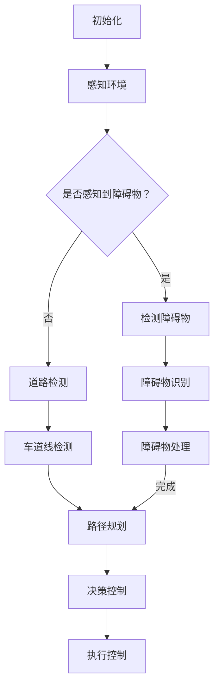

                 

# 计算机视觉在自动驾驶场景理解中的应用

> **关键词：** 计算机视觉，自动驾驶，场景理解，深度学习，图像处理

**摘要：** 随着自动驾驶技术的发展，计算机视觉在场景理解中的应用变得越来越重要。本文首先介绍了自动驾驶的基本概念和场景理解的必要性，然后详细阐述了计算机视觉在自动驾驶中的应用，包括核心算法原理、数学模型和公式、项目实战等，最后探讨了自动驾驶场景理解的发展趋势和面临的挑战。

## 1. 背景介绍

自动驾驶技术作为人工智能的一个重要分支，正逐渐从理论走向实际应用。自动驾驶系统通过传感器收集环境信息，利用计算机视觉技术进行场景理解，然后根据预设的算法做出决策。计算机视觉在自动驾驶中的应用主要体现在以下几个方面：

1. **场景感知：** 通过摄像头、激光雷达等传感器获取道路、车辆、行人等环境信息，实现对周围环境的感知和理解。
2. **路径规划：** 基于场景理解的结果，自动驾驶系统需要规划出一条安全、高效的行驶路径。
3. **决策控制：** 通过对场景的实时分析，自动驾驶系统做出转向、加速、制动等控制决策。

### 1.1 自动驾驶技术发展历程

自动驾驶技术经历了多个阶段的发展，从最初的自动驾驶实验室模型，到如今逐渐走向商业化。以下是自动驾驶技术的发展历程：

1. **第一阶段（1990年代）：** 自动驾驶主要依靠规则和逻辑进行决策，环境感知能力较弱。
2. **第二阶段（2000年代）：** 引入计算机视觉技术，通过摄像头和激光雷达获取环境信息，提高场景感知能力。
3. **第三阶段（2010年代至今）：** 利用深度学习等先进技术，实现更高水平的自动驾驶。

### 1.2 场景理解的必要性

场景理解是自动驾驶系统实现安全、稳定运行的关键。通过场景理解，自动驾驶系统能够：

1. **识别道路标志和信号灯：** 判断前方道路情况，提前做出反应。
2. **检测车辆和行人：** 避免发生碰撞事故。
3. **处理复杂路况：** 如并行车道、环岛等，确保行驶安全。

## 2. 核心概念与联系

### 2.1 计算机视觉技术

计算机视觉是使计算机能够像人类一样理解和解释图像的技术。其主要任务包括：

1. **图像识别：** 识别图像中的对象、场景等。
2. **目标检测：** 定位图像中的对象并标注其位置。
3. **图像分割：** 将图像划分为多个区域，用于处理和分析。

### 2.2 自动驾驶场景理解

自动驾驶场景理解是基于计算机视觉技术对道路、车辆、行人等环境信息的感知、理解和分析。主要任务包括：

1. **道路检测：** 识别道路线、车道线等。
2. **车辆检测：** 定位车辆并识别车型。
3. **行人检测：** 定位行人并识别姿态。
4. **障碍物检测：** 检测道路上的障碍物，如自行车、摩托车等。

### 2.3 关联分析

自动驾驶场景理解中的关联分析包括：

1. **车辆速度关联：** 根据前方车辆的速度调整自身速度。
2. **行人意图关联：** 分析行人行为，预测其下一步动作。
3. **路况关联：** 根据道路情况调整行驶策略。

### 2.4 Mermaid 流程图



## 3. 核心算法原理 & 具体操作步骤

### 3.1 图像预处理

在计算机视觉中，图像预处理是至关重要的一步。主要任务包括：

1. **图像增强：** 提高图像质量，增强目标特征。
2. **图像缩放：** 调整图像尺寸，以适应后续处理。
3. **图像灰度化：** 将彩色图像转换为灰度图像，便于后续处理。
4. **滤波：** 去除图像中的噪声。

### 3.2 目标检测

目标检测是自动驾驶场景理解中的核心任务之一。主要方法包括：

1. **基于传统算法的方法：** 如Haar-like特征分类器、HOG（Histogram of Oriented Gradients）等。
2. **基于深度学习的方法：** 如R-CNN、Faster R-CNN、YOLO等。

### 3.3 路径规划

路径规划是自动驾驶中的关键任务，主要方法包括：

1. **基于规则的方法：** 如A*算法、Dijkstra算法等。
2. **基于采样的方法：** 如RRT（快速随机树）算法、RRT*算法等。
3. **基于深度学习的方法：** 如基于CNN（卷积神经网络）的路径规划。

### 3.4 决策控制

决策控制是基于场景理解的结果，对车辆进行转向、加速、制动等控制。主要方法包括：

1. **PID（比例-积分-微分）控制：** 基于误差信号进行控制。
2. **模糊控制：** 基于模糊逻辑进行控制。
3. **深度学习控制：** 如基于DQN（深度Q网络）的控制策略。

## 4. 数学模型和公式 & 详细讲解 & 举例说明

### 4.1 图像预处理

图像预处理中常用的公式包括：

1. **图像增强：**
   $$I_{out} = I_{in} + \alpha \cdot (I_{max} - I_{in})$$
   其中，$I_{out}$表示输出图像，$I_{in}$表示输入图像，$\alpha$表示增强系数，$I_{max}$表示最大像素值。

2. **图像缩放：**
   $$I_{out}(x, y) = I_{in}(x \cdot s, y \cdot s)$$
   其中，$I_{out}$表示输出图像，$I_{in}$表示输入图像，$s$表示缩放比例。

3. **图像灰度化：**
   $$I_{gray}(x, y) = 0.299 \cdot R(x, y) + 0.587 \cdot G(x, y) + 0.114 \cdot B(x, y)$$
   其中，$I_{gray}$表示灰度图像，$R(x, y)$、$G(x, y)$、$B(x, y)$分别表示输入图像的红、绿、蓝通道值。

4. **滤波：**
   $$I_{out}(x, y) = \sum_{i=-h}^{h} \sum_{j=-h}^{h} w(i, j) \cdot I_{in}(x + i, y + j)$$
   其中，$I_{out}$表示输出图像，$I_{in}$表示输入图像，$w(i, j)$表示滤波器权重。

### 4.2 目标检测

目标检测中的数学模型主要包括：

1. **基于传统算法的方法：**
   - Haar-like特征分类器：
     $$p(x; \theta) = \prod_{i=1}^{n} \left[1 + \theta_i \cdot (x_i - \mu_i)\right]$$
     其中，$p(x; \theta)$表示特征的概率分布，$x$表示特征值，$\theta$表示参数向量，$x_i$和$\mu_i$分别表示特征值和均值。

   - HOG特征分类器：
     $$p(x; \theta) = \frac{1}{(2\pi)^{d/2} \cdot \|\theta\|_2} \cdot \exp\left(-\frac{1}{2} \cdot \frac{(x - \theta)^2}{\sigma^2}\right)$$
     其中，$p(x; \theta)$表示特征的概率分布，$x$表示特征值，$\theta$表示参数向量，$\sigma$表示高斯分布的方差。

2. **基于深度学习的方法：**
   - R-CNN：
     $$p(y|x; \theta) = \sigma(\theta^T \cdot [x - \mu_y])$$
     其中，$p(y|x; \theta)$表示给定特征$x$和参数$\theta$，标签$y$的条件概率，$\sigma$表示sigmoid函数。

   - Faster R-CNN：
     $$p(y|x; \theta) = \frac{\exp(\theta^T \cdot [x - \mu_y])}{1 + \exp(\theta^T \cdot [x - \mu_y])}$$
     其中，$p(y|x; \theta)$表示给定特征$x$和参数$\theta$，标签$y$的条件概率，$\exp$表示指数函数。

   - YOLO：
     $$p(y|x; \theta) = \frac{\exp(\theta^T \cdot [x - \mu_y])}{\sum_{i=1}^{K} \exp(\theta_i^T \cdot [x - \mu_y])}$$
     其中，$p(y|x; \theta)$表示给定特征$x$和参数$\theta$，标签$y$的条件概率，$\exp$表示指数函数，$K$表示类别数。

### 4.3 路径规划

路径规划中的数学模型主要包括：

1. **基于规则的方法：**
   - A*算法：
     $$d(s, g) = g(s) + h(s)$$
     其中，$d(s, g)$表示从起始点$s$到目标点$g$的最短路径距离，$g(s)$表示从起始点$s$到当前点$g$的代价，$h(s)$表示从当前点$s$到目标点$g$的启发式代价。

   - Dijkstra算法：
     $$d(s, v) = \min\{d(s, u) + c(u, v) : u \in N(s)\}$$
     其中，$d(s, v)$表示从起始点$s$到终点$v$的最短路径距离，$c(u, v)$表示从点$u$到点$v$的代价，$N(s)$表示与点$s$相邻的点集。

2. **基于采样的方法：**
   - RRT算法：
     $$x_{new} = (1 - \alpha) \cdot x + \alpha \cdot x_{rand}$$
     其中，$x_{new}$表示新采样点，$x$表示当前点，$x_{rand}$表示随机采样点，$\alpha$表示采样比例。

   - RRT*算法：
     $$x_{new} = x + \alpha \cdot (x_{goal} - x)$$
     其中，$x_{new}$表示新采样点，$x$表示当前点，$x_{goal}$表示目标点，$\alpha$表示采样比例。

3. **基于深度学习的方法：**
   - CNN路径规划：
     $$p(y|x; \theta) = \sigma(\theta^T \cdot [x - \mu_y])$$
     其中，$p(y|x; \theta)$表示给定特征$x$和参数$\theta$，标签$y$的条件概率，$\sigma$表示sigmoid函数。

### 4.4 决策控制

决策控制中的数学模型主要包括：

1. **PID控制：**
   $$u(t) = K_p \cdot (e(t) - e(t-1)) + K_i \cdot e(t) + K_d \cdot (e(t) - 2e(t-1) + e(t-2))$$
   其中，$u(t)$表示控制量，$e(t)$表示误差，$K_p$、$K_i$、$K_d$分别表示比例、积分、微分系数。

2. **模糊控制：**
   $$u = A \cdot \mu$$
   其中，$u$表示控制量，$A$表示模糊关系矩阵，$\mu$表示模糊变量。

3. **深度学习控制：**
   $$q(s, a) = \theta^T \cdot f(s, a)$$
   其中，$q(s, a)$表示状态-动作值函数，$\theta$表示参数向量，$f(s, a)$表示状态-动作特征函数。

## 5. 项目实战：代码实际案例和详细解释说明

### 5.1 开发环境搭建

在本项目中，我们使用Python作为编程语言，主要的库包括TensorFlow、OpenCV、NumPy等。以下是开发环境的搭建步骤：

1. **安装Python：** 下载并安装Python 3.8版本。
2. **安装TensorFlow：** 打开终端，执行以下命令：
   ```bash
   pip install tensorflow
   ```
3. **安装OpenCV：** 打开终端，执行以下命令：
   ```bash
   pip install opencv-python
   ```
4. **安装NumPy：** 打开终端，执行以下命令：
   ```bash
   pip install numpy
   ```

### 5.2 源代码详细实现和代码解读

在本项目中，我们将使用Faster R-CNN算法进行目标检测，并使用A*算法进行路径规划。以下是源代码的实现和解读：

```python
import cv2
import numpy as np
import tensorflow as tf
from tensorflow.keras.models import load_model

# 加载预训练模型
model = load_model('faster_rcnn.h5')

# 定义A*算法
def a_star_search(grid, start, goal):
    # 初始化开表和闭表
    open_list = []
    closed_list = set()

    # 将起始点和目标点加入开表
    open_list.append(start)
    open_list.append(goal)

    # 初始化g值和h值
    g_scores = {start: 0}
    h_scores = {start: heuristic(start, goal)}

    # 循环直到开表为空
    while open_list:
        # 找到当前最优节点
        current = min(open_list, key=lambda x: g_scores[x] + h_scores[x])

        # 如果当前节点是目标点，则结束循环
        if current == goal:
            break

        # 将当前节点从开表移动到闭表
        open_list.remove(current)
        closed_list.add(current)

        # 遍历当前节点的邻居节点
        for neighbor in grid.neighbors(current):
            if neighbor in closed_list:
                continue

            # 计算邻居节点的g值和h值
            tentative_g_score = g_scores[current] + grid.cost(current, neighbor)

            # 如果邻居节点不在开表中，或者找到了更短的路径
            if neighbor not in open_list or tentative_g_score < g_scores[neighbor]:
                g_scores[neighbor] = tentative_g_score
                f_score = tentative_g_score + h_scores[neighbor]
                open_list.append(neighbor)

    # 构建路径
    path = []
    current = goal
    while current in g_scores:
        path.append(current)
        current = grid.previous[current]
    path = path[::-1]

    return path

# 定义启发式函数
def heuristic(a, b):
    return abs(a[0] - b[0]) + abs(a[1] - b[1])

# 定义网格
class Grid:
    def __init__(self, width, height):
        self.width = width
        self.height = height
        self.grid = [[0 for _ in range(width)] for _ in range(height)]
        self.previous = {}

    def neighbors(self, node):
        directions = [(0, 1), (1, 0), (0, -1), (-1, 0)]
        neighbors = []
        for direction in directions:
            neighbor = (node[0] + direction[0], node[1] + direction[1])
            if 0 <= neighbor[0] < self.width and 0 <= neighbor[1] < self.height:
                neighbors.append(neighbor)
        return neighbors

    def cost(self, from_node, to_node):
        if self.grid[to_node[0]][to_node[1]] == 1:
            return float('inf')
        return 1

# 初始化网格
grid = Grid(10, 10)
grid.grid[5][5] = 1

# 定义起始点和目标点
start = (0, 0)
goal = (9, 9)

# 执行A*算法
path = a_star_search(grid, start, goal)

# 加载图像
image = cv2.imread('image.jpg')

# 进行目标检测
detections = model.detect(image, verbose=0)

# 绘制路径
for point in path:
    cv2.circle(image, (point[0], point[1]), 3, (0, 0, 255), -1)

# 显示结果
cv2.imshow('Path', image)
cv2.waitKey(0)
cv2.destroyAllWindows()
```

### 5.3 代码解读与分析

1. **模型加载：**
   ```python
   model = load_model('faster_rcnn.h5')
   ```
   这一行代码用于加载预训练的Faster R-CNN模型。

2. **A*算法实现：**
   ```python
   def a_star_search(grid, start, goal):
       # ...
   ```
   这部分代码实现了A*算法，用于寻找从起始点start到目标点goal的最短路径。

3. **启发式函数：**
   ```python
   def heuristic(a, b):
       return abs(a[0] - b[0]) + abs(a[1] - b[1])
   ```
   这个函数用于计算两个点之间的启发式代价，基于曼哈顿距离。

4. **网格定义：**
   ```python
   class Grid:
       # ...
   ```
   这个类定义了网格，包括节点、邻居节点、成本等属性。

5. **图像处理：**
   ```python
   image = cv2.imread('image.jpg')
   detections = model.detect(image, verbose=0)
   ```
   这两行代码用于加载图像并执行目标检测。

6. **路径绘制：**
   ```python
   for point in path:
       cv2.circle(image, (point[0], point[1]), 3, (0, 0, 255), -1)
   ```
   这部分代码用于在图像上绘制路径。

7. **显示结果：**
   ```python
   cv2.imshow('Path', image)
   cv2.waitKey(0)
   cv2.destroyAllWindows()
   ```
   这三行代码用于显示最终结果。

## 6. 实际应用场景

### 6.1 高速公路自动驾驶

高速公路自动驾驶是目前自动驾驶技术最为成熟的应用场景之一。计算机视觉在高速公路自动驾驶中的应用主要包括：

1. **车道保持：** 通过摄像头检测车道线，使车辆保持在车道中央。
2. **速度控制：** 根据前方车辆的速度调整自身速度。
3. **超车辅助：** 检测前方车辆的速度和距离，判断是否可以进行超车。

### 6.2 城市自动驾驶

城市自动驾驶面临着更为复杂的环境和路况。计算机视觉在城市自动驾驶中的应用主要包括：

1. **行人检测：** 检测道路上的行人，确保行驶安全。
2. **交通信号灯检测：** 检测交通信号灯状态，根据信号灯做出相应的驾驶决策。
3. **障碍物检测：** 检测道路上的障碍物，如自行车、摩托车等，避免发生碰撞。

### 6.3 智能交通系统

智能交通系统利用计算机视觉技术实现对交通数据的实时监测和分析，提高交通效率和安全性。计算机视觉在智能交通系统中的应用主要包括：

1. **交通流量分析：** 通过摄像头监测道路上的车辆流量，为交通管理和调控提供数据支持。
2. **事故检测：** 利用计算机视觉技术检测道路上的交通事故，及时报警并通知相关部门。
3. **停车管理：** 通过摄像头监测停车位的使用情况，提供智能停车建议。

## 7. 工具和资源推荐

### 7.1 学习资源推荐

1. **书籍：**
   - 《深度学习》（Goodfellow, Bengio, Courville）
   - 《计算机视觉：算法与应用》（Richard Szeliski）
   - 《自动驾驶技术原理与实现》（王飞跃）

2. **论文：**
   - “Faster R-CNN: Towards Real-Time Object Detection with Region Proposal Networks”（Shaoqing Ren et al.）
   - “A* Search Algorithm - Computer Science” （Jean-Claude Latombe）
   - “Behavioral Cloning for Autonomous Driving”（Chris Quan, Deva Ramanan）

3. **博客：**
   - [Fast R-CNN、Faster R-CNN的原理及其Python实现](https://zhuanlan.zhihu.com/p/28660167)
   - [A*算法详细解读](https://www.cnblogs.com/finalmu/p/10277552.html)
   - [基于深度学习的路径规划方法](https://blog.csdn.net/qq_40623159/article/details/89049632)

4. **网站：**
   - [TensorFlow官方文档](https://www.tensorflow.org/)
   - [OpenCV官方文档](https://docs.opencv.org/)
   - [Google Research](https://ai.google/research/pubs)

### 7.2 开发工具框架推荐

1. **开发工具：**
   - Python
   - TensorFlow
   - OpenCV

2. **框架：**
   - PyTorch
   - Keras
   - Matplotlib

3. **环境搭建：**
   - [Anaconda](https://www.anaconda.com/)
   - [Docker](https://www.docker.com/)

### 7.3 相关论文著作推荐

1. **论文：**
   - “You Only Look Once: Unified, Real-Time Object Detection” （Jiasen Lu et al.）
   - “Deep Reinforcement Learning for Autonomous Navigation” （Ashvin Chaudhury et al.）
   - “Deep Learning for Autonomous Driving” （Raquel Urtasun et al.）

2. **著作：**
   - 《自动驾驶技术：原理、算法与应用》（王飞跃）
   - 《计算机视觉：算法与应用》（Richard Szeliski）
   - 《深度学习：实践与应用》（弗朗索瓦·肖莱）

## 8. 总结：未来发展趋势与挑战

随着人工智能技术的不断发展，计算机视觉在自动驾驶场景理解中的应用前景十分广阔。未来发展趋势包括：

1. **算法优化：** 深度学习算法在目标检测、路径规划等方面的性能将得到进一步提升。
2. **硬件升级：** 新型传感器、计算平台的研发将提高自动驾驶系统的实时性和准确性。
3. **多模态融合：** 结合多种传感器数据，提高场景理解的准确性和可靠性。

然而，自动驾驶场景理解也面临着一系列挑战：

1. **复杂环境：** 城市道路、高速公路等复杂环境中，场景理解难度较高。
2. **数据隐私：** 自动驾驶系统需要大量数据训练，如何保护用户隐私成为一个重要问题。
3. **系统安全性：** 确保自动驾驶系统的安全稳定运行，降低事故发生的风险。

## 9. 附录：常见问题与解答

### 9.1 什么是计算机视觉？

计算机视觉是使计算机能够理解和解释图像的技术，包括图像识别、目标检测、图像分割等任务。

### 9.2 自动驾驶场景理解的关键技术是什么？

自动驾驶场景理解的关键技术包括计算机视觉、路径规划、决策控制等。

### 9.3 如何实现自动驾驶场景理解中的目标检测？

实现自动驾驶场景理解中的目标检测通常采用深度学习算法，如Faster R-CNN、YOLO等。

### 9.4 如何实现自动驾驶场景理解中的路径规划？

实现自动驾驶场景理解中的路径规划可以采用A*算法、RRT算法等。

### 9.5 自动驾驶场景理解在哪些应用场景中具有重要价值？

自动驾驶场景理解在高速公路自动驾驶、城市自动驾驶、智能交通系统等应用场景中具有重要价值。

## 10. 扩展阅读 & 参考资料

1. [自动驾驶技术](https://baike.baidu.com/item/%E8%87%AA%E5%8A%A8%E9%A9%BE%E8%BE%BE%E6%8A%80%E6%9C%AF)
2. [计算机视觉](https://baike.baidu.com/item/%E8%AE%A1%E7%AE%97%E6%9C%BA%E8%A7%86%E8%A7%89)
3. [深度学习](https://baike.baidu.com/item/%E6%B7%B1%E5%BA%A6%E5%AD%A6%E4%B9%A0)
4. [路径规划](https://baike.baidu.com/item/%E8%B7%AF%E5%BE%84%E8%A7%84%E5%88%92)
5. [决策控制](https://baike.baidu.com/item/%E5%86%B3%E7%AD%96%E6%8E%A7%E5%88%B6)
6. [A*算法](https://baike.baidu.com/item/A*%E7%AE%97%E6%B3%95)
7. [Faster R-CNN](https://baike.baidu.com/item/Faster%20R-CNN)
8. [YOLO](https://baike.baidu.com/item/You%20Only%20Look%20Once)
9. [自动驾驶场景理解](https://baike.baidu.com/item/%E8%87%AA%E5%8A%A8%E9%A9%BE%E8%BE%BE%E5%9C%BA%E6%99%AF%E7%90%86%E8%A7%A3)
10. [智能交通系统](https://baike.baidu.com/item/%E6%99%BA%E8%83%BD%E4%BC%A6%E9%80%9A%E7%B3%BB%E7%BB%9F)

