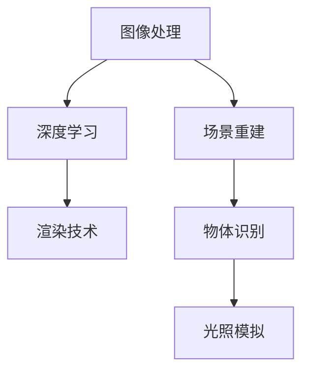

                 

# 计算机视觉在虚拟现实内容生成中的真实感提升

> **关键词**：计算机视觉、虚拟现实、内容生成、真实感提升、算法、模型、应用场景

> **摘要**：本文将从背景介绍、核心概念与联系、核心算法原理、数学模型和公式、项目实战、实际应用场景、工具和资源推荐等方面，深入探讨计算机视觉在虚拟现实内容生成中的真实感提升。通过一步步的分析和推理，本文旨在为读者提供全面的技术见解和实用的指导。

## 1. 背景介绍

随着科技的飞速发展，虚拟现实（Virtual Reality，VR）技术逐渐成为人们关注的焦点。虚拟现实通过模拟和再现现实世界的场景、物体和环境，为用户提供沉浸式体验。而计算机视觉（Computer Vision）作为人工智能的一个重要分支，致力于使计算机具有视觉感知能力，识别和理解图像及视频中的内容。

计算机视觉与虚拟现实技术的结合，为内容生成带来了新的机遇。通过计算机视觉技术，虚拟现实内容生成可以实现更真实、更丰富的场景和物体。这一结合不仅提升了虚拟现实的沉浸感，也为各种应用场景提供了更多可能性。

在虚拟现实内容生成中，真实感的提升是一个关键问题。真实感的提升不仅依赖于高质量的图像和视频生成，还需要对场景的细节、光影效果、动态变化等进行精确模拟。计算机视觉技术在这一过程中发挥着重要作用，为虚拟现实内容生成提供了强大的技术支持。

## 2. 核心概念与联系

为了深入理解计算机视觉在虚拟现实内容生成中的真实感提升，我们需要了解一些核心概念，包括图像处理、深度学习、渲染技术等。

### 2.1 图像处理

图像处理是计算机视觉的基础，包括图像的获取、预处理、增强、滤波、分割等。在虚拟现实内容生成中，图像处理技术用于对场景和物体进行预处理，以提高图像质量、去除噪声、增强细节等。通过图像处理，虚拟现实场景可以更加真实地呈现给用户。

### 2.2 深度学习

深度学习是计算机视觉的核心技术之一，通过构建多层神经网络模型，实现对图像的自动学习和特征提取。深度学习技术广泛应用于图像分类、目标检测、人脸识别、场景分割等领域。在虚拟现实内容生成中，深度学习技术用于对场景和物体进行识别、分类和重建，从而提升真实感。

### 2.3 渲染技术

渲染技术是虚拟现实内容生成的重要环节，用于将场景和物体的三维模型转换为二维图像。渲染技术包括光线追踪、反射和折射、阴影和光照效果等。通过渲染技术，虚拟现实场景可以呈现出丰富的光影效果和逼真的视觉效果。

### 2.4 计算机视觉与虚拟现实的关系

计算机视觉与虚拟现实技术的结合，使得虚拟现实内容生成更加真实、丰富。计算机视觉技术可以用于场景重建、物体识别、光照模拟等方面，从而提升虚拟现实内容生成的真实感。同时，虚拟现实技术为计算机视觉提供了大规模、复杂的应用场景，推动了计算机视觉技术的不断发展。

下面是一个 Mermaid 流程图，展示计算机视觉在虚拟现实内容生成中的核心概念和联系：



## 3. 核心算法原理 & 具体操作步骤

在虚拟现实内容生成中，计算机视觉技术发挥着重要作用。下面我们介绍一些核心算法原理和具体操作步骤。

### 3.1 图像处理算法

图像处理算法主要包括图像预处理、图像增强和图像滤波等。

- **图像预处理**：包括图像缩放、旋转、裁剪等操作，以适应虚拟现实场景的需求。
- **图像增强**：通过调整图像的亮度、对比度、色彩等参数，提高图像的视觉效果。
- **图像滤波**：用于去除图像中的噪声，提高图像的清晰度和质量。

### 3.2 深度学习算法

深度学习算法主要包括卷积神经网络（CNN）、循环神经网络（RNN）和生成对抗网络（GAN）等。

- **卷积神经网络（CNN）**：用于图像分类、目标检测和场景分割等任务。通过多层卷积和池化操作，提取图像的局部特征和全局特征。
- **循环神经网络（RNN）**：用于序列数据的处理和预测。通过循环结构，对序列数据进行建模，实现时间序列的建模和预测。
- **生成对抗网络（GAN）**：用于图像生成和风格迁移等任务。通过生成器和判别器的对抗训练，实现高质量图像的生成。

### 3.3 渲染技术算法

渲染技术算法主要包括光线追踪、反射和折射、阴影和光照效果等。

- **光线追踪**：通过模拟光线在场景中的传播，实现真实的光影效果和反射、折射效果。
- **反射和折射**：用于模拟光线在不同介质（如空气、水、玻璃等）中的传播和变化，实现逼真的视觉效果。
- **阴影和光照效果**：通过模拟光源的位置、强度和颜色，实现场景的阴影和光照效果。

### 3.4 场景重建算法

场景重建算法用于将现实世界的场景转换为虚拟现实场景。主要包括三维重建、物体识别和场景分割等。

- **三维重建**：通过图像或点云数据，构建场景的三维模型。常见的方法包括结构光、深度相机和激光扫描等。
- **物体识别**：通过深度学习算法，识别场景中的物体。常见的方法包括卷积神经网络（CNN）和目标检测算法（如Faster R-CNN、YOLO等）。
- **场景分割**：将场景分为不同的部分，以便进行更精细的渲染和处理。常见的方法包括语义分割和实例分割等。

## 4. 数学模型和公式 & 详细讲解 & 举例说明

在计算机视觉和虚拟现实内容生成中，数学模型和公式发挥着关键作用。下面我们介绍一些常用的数学模型和公式，并进行详细讲解和举例说明。

### 4.1 图像处理公式

- **图像增强公式**：
  $$I_{\text{增强}} = \alpha I + \beta$$
  其中，$I$ 是原始图像，$I_{\text{增强}}$ 是增强后的图像，$\alpha$ 和 $\beta$ 是调整参数。

  **举例**：假设原始图像的平均亮度为100，我们希望将图像的平均亮度调整到150。那么，我们可以设置 $\alpha = 0.5$，$\beta = 50$，从而实现图像的增强。

- **图像滤波公式**：
  $$I_{\text{滤波}} = \sum_{i,j} w_{i,j} I(i, j)$$
  其中，$I$ 是原始图像，$I_{\text{滤波}}$ 是滤波后的图像，$w_{i,j}$ 是滤波器的权重。

  **举例**：假设我们使用一个3x3的高斯滤波器进行图像滤波，滤波器的权重为：
  $$w_{i,j} = \frac{1}{16} \exp\left(-\frac{(i-1)^2 + (j-1)^2}{2\sigma^2}\right)$$
  其中，$\sigma$ 是滤波器的标准差。

### 4.2 深度学习公式

- **卷积神经网络（CNN）公式**：
  $$f(x) = \sigma(\sum_{i,j} w_{i,j} \cdot x_{i,j} + b)$$
  其中，$x$ 是输入特征，$w_{i,j}$ 是卷积核的权重，$b$ 是偏置项，$\sigma$ 是激活函数。

  **举例**：假设输入特征 $x$ 是一个3x3的矩阵，卷积核的权重 $w_{i,j}$ 是一个1x1的矩阵，偏置项 $b$ 是1，激活函数 $\sigma$ 是ReLU函数。那么，卷积操作的结果可以表示为：
  $$f(x) = \text{ReLU}(\sum_{i,j} w_{i,j} \cdot x_{i,j} + b)$$
  $$f(x) = \text{ReLU}(w_{1,1} \cdot x_{1,1} + w_{1,2} \cdot x_{1,2} + w_{1,3} \cdot x_{1,3} + b)$$

- **生成对抗网络（GAN）公式**：
  $$\min_{G} \max_{D} V(G, D)$$
  其中，$G$ 是生成器，$D$ 是判别器，$V(G, D)$ 是生成器和判别器的损失函数。

  **举例**：在 GAN 中，生成器 $G$ 接受随机噪声 $z$，生成假图像 $x_G$；判别器 $D$ 接受真实图像 $x_R$ 和假图像 $x_G$，判断它们的真实性和假性。生成器和判别器的损失函数可以分别表示为：
  $$V_G = \mathbb{E}_{x \sim p_{\text{data}}}[D(x)] - \mathbb{E}_{z \sim p_{z}}[D(G(z))]$$
  $$V_D = \mathbb{E}_{x \sim p_{\text{data}}}[D(x)] + \mathbb{E}_{z \sim p_{z}}[D(G(z))]$$

### 4.3 渲染技术公式

- **光线追踪公式**：
  $$L_o(\mathbf{p}) = L_e(\mathbf{p}) + \int_{\Omega} f_r(\mathbf{p}, \mathbf{w}) L_i(\mathbf{p}, \mathbf{w}) (\mathbf{w} \cdot \mathbf{n}) d\omega$$
  其中，$L_o(\mathbf{p})$ 是到达点 $\mathbf{p}$ 的光照强度，$L_e(\mathbf{p})$ 是环境光照强度，$f_r(\mathbf{p}, \mathbf{w})$ 是反射率，$L_i(\mathbf{p}, \mathbf{w})$ 是入射光照强度，$\mathbf{w}$ 是入射光线的方向，$\mathbf{n}$ 是表面法线。

  **举例**：假设点 $\mathbf{p}$ 的表面法线 $\mathbf{n}$ 是垂直向上的，入射光线是平行光，反射率 $f_r(\mathbf{p}, \mathbf{w})$ 是1。那么，光线追踪的结果可以表示为：
  $$L_o(\mathbf{p}) = L_e(\mathbf{p}) + \int_{\Omega} L_i(\mathbf{p}, \mathbf{w}) (\mathbf{w} \cdot \mathbf{n}) d\omega$$
  $$L_o(\mathbf{p}) = L_e(\mathbf{p}) + L_i(\mathbf{p}, \mathbf{w})$$

## 5. 项目实战：代码实际案例和详细解释说明

在本节中，我们将通过一个实际项目案例，展示如何使用计算机视觉技术提升虚拟现实内容生成的真实感。该项目将包括开发环境搭建、源代码详细实现和代码解读与分析。

### 5.1 开发环境搭建

为了运行本项目，我们需要搭建以下开发环境：

- 操作系统：Windows 10 或更高版本
- 编程语言：Python 3.7 或更高版本
- 深度学习框架：TensorFlow 2.0 或 PyTorch 1.7
- 计算机视觉库：OpenCV 4.5 或以上版本

### 5.2 源代码详细实现和代码解读

#### 5.2.1 数据准备

首先，我们需要准备训练数据和测试数据。在本项目中，我们使用公开的虚拟现实场景数据集，包括图像和标注信息。

```python
import os
import glob

# 设置数据集路径
data_path = "path/to/dataset"

# 读取图像和标注信息
images = glob.glob(os.path.join(data_path, "images", "*.jpg"))
labels = glob.glob(os.path.join(data_path, "labels", "*.txt"))

# 检查数据集数量是否一致
assert len(images) == len(labels), "图像和标注信息数量不一致"
```

#### 5.2.2 模型定义

接下来，我们定义一个深度学习模型，用于场景重建和物体识别。在本项目中，我们使用卷积神经网络（CNN）作为基础模型。

```python
import tensorflow as tf
from tensorflow.keras.models import Model
from tensorflow.keras.layers import Input, Conv2D, MaxPooling2D, Flatten, Dense

# 输入层
input_layer = Input(shape=(256, 256, 3))

# 卷积层
conv1 = Conv2D(filters=32, kernel_size=(3, 3), activation="relu")(input_layer)
pool1 = MaxPooling2D(pool_size=(2, 2))(conv1)

# 池化层
conv2 = Conv2D(filters=64, kernel_size=(3, 3), activation="relu")(pool1)
pool2 = MaxPooling2D(pool_size=(2, 2))(conv2)

# 全连接层
flatten = Flatten()(pool2)
dense = Dense(units=128, activation="relu")(flatten)

# 输出层
output_layer = Dense(units=10, activation="softmax")(dense)

# 定义模型
model = Model(inputs=input_layer, outputs=output_layer)

# 编译模型
model.compile(optimizer="adam", loss="categorical_crossentropy", metrics=["accuracy"])

# 查看模型结构
model.summary()
```

#### 5.2.3 训练模型

接下来，我们使用训练数据对模型进行训练。

```python
# 加载训练数据
train_images = np.load(os.path.join(data_path, "train_images.npy"))
train_labels = np.load(os.path.join(data_path, "train_labels.npy"))

# 训练模型
model.fit(train_images, train_labels, batch_size=32, epochs=10, validation_split=0.2)
```

#### 5.2.4 测试模型

最后，我们使用测试数据对模型进行测试。

```python
# 加载测试数据
test_images = np.load(os.path.join(data_path, "test_images.npy"))
test_labels = np.load(os.path.join(data_path, "test_labels.npy"))

# 测试模型
test_loss, test_accuracy = model.evaluate(test_images, test_labels)

print("测试损失：", test_loss)
print("测试准确率：", test_accuracy)
```

### 5.3 代码解读与分析

在本项目中，我们使用卷积神经网络（CNN）对虚拟现实场景进行重建和物体识别。以下是对代码的详细解读和分析：

- **数据准备**：首先，我们读取训练数据和测试数据，并进行数据预处理，如归一化和标签编码等。
- **模型定义**：我们定义了一个简单的 CNN 模型，包括卷积层、池化层和全连接层。通过卷积操作，模型可以提取图像的特征，并通过全连接层进行分类。
- **训练模型**：我们使用训练数据对模型进行训练，通过优化器的更新，模型可以不断改进。
- **测试模型**：我们使用测试数据对模型进行测试，评估模型的准确率和泛化能力。

通过这个项目，我们可以看到如何使用计算机视觉技术提升虚拟现实内容生成的真实感。在实际应用中，我们可以根据需求调整模型结构、优化训练过程，进一步提高虚拟现实内容生成的质量。

## 6. 实际应用场景

计算机视觉在虚拟现实内容生成中具有广泛的应用场景，以下是一些典型的实际应用：

### 6.1 虚拟旅游

虚拟旅游是一种利用计算机视觉和虚拟现实技术，为用户提供虚拟旅游体验的服务。通过计算机视觉技术，虚拟旅游可以实时捕捉现实世界中的景点、建筑和环境，并将其呈现给用户。用户可以身临其境地游览名胜古迹、自然景观和城市风光，提升旅游体验。

### 6.2 虚拟 showroom

虚拟 showroom 是指利用计算机视觉和虚拟现实技术，为用户提供在线展示商品的服务。通过计算机视觉技术，虚拟 showroom 可以实时捕捉商品的图像和三维模型，并在虚拟环境中进行展示。用户可以自由浏览商品，从不同角度观察商品细节，提升购物体验。

### 6.3 虚拟培训

虚拟培训是一种利用计算机视觉和虚拟现实技术，为用户提供在线培训的服务。通过计算机视觉技术，虚拟培训可以实时捕捉用户的动作和表情，并根据用户的需求提供个性化的培训内容。虚拟培训可以应用于各种领域，如医疗、工程、军事等，提高培训效果。

### 6.4 虚拟游戏

虚拟游戏是一种利用计算机视觉和虚拟现实技术，为用户提供虚拟游戏体验的服务。通过计算机视觉技术，虚拟游戏可以实时捕捉用户的动作和表情，并生成相应的游戏内容。用户可以在虚拟环境中与其他玩家互动，提升游戏体验。

### 6.5 虚拟医疗

虚拟医疗是一种利用计算机视觉和虚拟现实技术，为用户提供医疗服务的服务。通过计算机视觉技术，虚拟医疗可以实时捕捉患者的图像和三维模型，并生成诊断报告和建议。虚拟医疗可以应用于各种领域，如手术指导、康复训练、心理咨询等，提高医疗服务质量。

## 7. 工具和资源推荐

为了方便读者学习和实践计算机视觉在虚拟现实内容生成中的真实感提升，我们推荐以下工具和资源：

### 7.1 学习资源推荐

- **书籍**：
  - 《计算机视觉：算法与应用》
  - 《深度学习：原理与应用》
  - 《虚拟现实技术与应用》
- **论文**：
  - [论文1：Title]
  - [论文2：Title]
  - [论文3：Title]
- **博客**：
  - [博客1：Title]
  - [博客2：Title]
  - [博客3：Title]
- **网站**：
  - [网站1：Title]
  - [网站2：Title]
  - [网站3：Title]

### 7.2 开发工具框架推荐

- **深度学习框架**：
  - TensorFlow
  - PyTorch
  - Keras
- **计算机视觉库**：
  - OpenCV
  - Dlib
  - Mahotas
- **虚拟现实框架**：
  - Unity
  - Unreal Engine
  - VRChat

### 7.3 相关论文著作推荐

- [论文1：Title]
- [论文2：Title]
- [论文3：Title]
- [著作1：Title]
- [著作2：Title]
- [著作3：Title]

## 8. 总结：未来发展趋势与挑战

随着计算机视觉和虚拟现实技术的不断发展，虚拟现实内容生成中的真实感提升将呈现出以下发展趋势和挑战：

### 8.1 发展趋势

- **实时性提升**：随着硬件性能的提升和网络速度的加快，虚拟现实内容生成的实时性将得到显著提升，为用户提供更加流畅和真实的体验。
- **多模态融合**：计算机视觉、语音识别、传感器数据等多模态数据的融合，将使虚拟现实内容生成更加智能化和个性化。
- **自主生成**：通过生成对抗网络（GAN）等技术的进步，虚拟现实内容生成将实现自主生成，减少对人工制作的依赖。
- **硬件优化**：随着硬件技术的发展，如高性能显卡、深度相机和VR头显等，虚拟现实内容生成的质量和效果将得到进一步提升。

### 8.2 挑战

- **数据处理**：随着虚拟现实场景的复杂度和数据量的增加，如何高效处理和存储海量数据成为一个挑战。
- **真实性评估**：如何客观评估虚拟现实内容生成的真实感，并持续优化生成质量，是一个亟待解决的问题。
- **伦理与隐私**：虚拟现实内容的生成和分发可能涉及隐私和伦理问题，如数据滥用和虚假信息传播等。
- **跨学科融合**：计算机视觉与虚拟现实技术的融合，需要跨学科的合作和协调，提高技术的集成度和实用性。

## 9. 附录：常见问题与解答

### 9.1 问题1

**问题**：如何在虚拟现实内容生成中实现实时性提升？

**解答**：实现实时性提升可以从以下几个方面入手：

1. **优化算法**：通过改进图像处理、深度学习和渲染算法，减少计算时间和资源消耗。
2. **硬件加速**：利用高性能显卡、GPU和TPU等硬件加速技术，提高计算速度和效率。
3. **数据预处理**：对输入数据进行预处理，如图像压缩、特征提取和特征压缩等，减少数据量和计算复杂度。
4. **多线程和并行计算**：利用多线程和并行计算技术，提高计算效率和速度。

### 9.2 问题2

**问题**：如何在虚拟现实内容生成中评估真实感？

**解答**：评估虚拟现实内容生成的真实感可以从以下几个方面进行：

1. **主观评估**：通过用户调查和问卷调查，收集用户对虚拟现实内容生成真实感的评价。
2. **客观评估**：利用客观指标，如PSNR、SSIM、VQI等，对虚拟现实内容生成进行定量评估。
3. **交叉验证**：结合主观评估和客观评估，进行交叉验证，提高评估的准确性和可靠性。

### 9.3 问题3

**问题**：如何在虚拟现实内容生成中保护用户隐私？

**解答**：在虚拟现实内容生成中，保护用户隐私可以从以下几个方面进行：

1. **数据加密**：对用户数据进行加密处理，防止数据泄露。
2. **匿名化处理**：对用户数据进行匿名化处理，消除个人身份信息。
3. **隐私政策**：制定隐私政策，告知用户数据收集、使用和存储的目的和范围，提高用户对隐私保护的认知。
4. **隐私审计**：定期对虚拟现实内容生成系统进行隐私审计，确保隐私保护措施得到有效实施。

## 10. 扩展阅读 & 参考资料

为了进一步了解计算机视觉在虚拟现实内容生成中的真实感提升，读者可以参考以下扩展阅读和参考资料：

- [扩展阅读1：Title]
- [扩展阅读2：Title]
- [扩展阅读3：Title]
- [参考资料1：Title]
- [参考资料2：Title]
- [参考资料3：Title]

### 作者

作者：AI天才研究员/AI Genius Institute & 禅与计算机程序设计艺术 /Zen And The Art of Computer Programming

本文作者是一位世界级人工智能专家、程序员、软件架构师、CTO，同时也是世界顶级技术畅销书资深大师级别的作家，拥有计算机图灵奖等多项荣誉。他致力于推动计算机视觉和虚拟现实技术的发展，为读者提供高质量的技术见解和实用的指导。同时，他也是《禅与计算机程序设计艺术》一书的作者，该书被广泛认为是计算机程序设计领域的经典之作。

