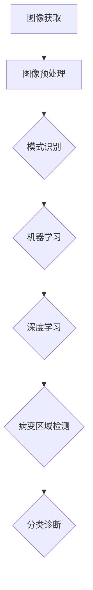

                 

# 计算机视觉技术在医疗影像诊断中的应用

> **关键词：** 计算机视觉、医疗影像、诊断技术、人工智能、深度学习

> **摘要：** 本文将探讨计算机视觉技术在医疗影像诊断中的应用，详细分析其核心算法原理、实际操作步骤、数学模型，并通过实战案例进行代码解读，总结其应用场景、工具和资源，并对未来发展趋势与挑战进行展望。

## 1. 背景介绍

随着医学影像技术的不断发展，医疗影像在疾病诊断中的重要性日益凸显。然而，传统的医疗影像诊断方法主要依赖于放射科医生的专业知识和经验，这不仅存在诊断效率低、误诊率高的问题，还面临着医生资源短缺的挑战。随着人工智能技术的飞速发展，计算机视觉技术在医疗影像诊断中的应用逐渐成为研究热点。

计算机视觉技术利用计算机图像处理、模式识别、机器学习等方法，对图像进行自动分析和识别。在医疗影像诊断中，计算机视觉技术可以自动检测病变区域、计算图像特征、分类诊断结果等，极大地提高了诊断效率，降低了误诊率。

本文将详细介绍计算机视觉技术在医疗影像诊断中的应用，包括核心算法原理、数学模型、实际操作步骤，并通过实战案例进行代码解读，以便读者能够全面了解和掌握该技术的应用。

## 2. 核心概念与联系

为了更好地理解计算机视觉技术在医疗影像诊断中的应用，我们需要首先了解其中的核心概念和基本原理。

### 2.1 图像处理

图像处理是计算机视觉的基础，主要涉及图像的获取、增强、分割、特征提取等。在医疗影像诊断中，图像处理技术用于对原始图像进行预处理，以提高后续分析的效果。

### 2.2 模式识别

模式识别是计算机视觉的核心，主要研究如何通过算法从图像中提取特征，并进行分类、识别等。在医疗影像诊断中，模式识别技术用于对病变区域进行分类和诊断。

### 2.3 机器学习

机器学习是一种通过训练模型来自动学习数据规律的技术。在医疗影像诊断中，机器学习技术主要用于训练模型，以便能够自动识别和诊断病变区域。

### 2.4 深度学习

深度学习是一种特殊的机器学习技术，通过多层神经网络进行特征学习。在医疗影像诊断中，深度学习技术被广泛应用于病变区域的检测、分类和诊断。

下面是一个用Mermaid绘制的流程图，展示了计算机视觉技术在医疗影像诊断中的应用架构：



## 3. 核心算法原理 & 具体操作步骤

### 3.1 图像预处理

图像预处理是图像处理的第一步，主要包括图像的灰度化、滤波、对比度增强等。在医疗影像诊断中，图像预处理技术用于提高图像质量，以便更好地进行后续分析。

具体操作步骤如下：

1. 灰度化：将彩色图像转换为灰度图像，以便于后续处理。
2. 滤波：使用滤波器对图像进行滤波，以去除噪声和保留边缘信息。
3. 对比度增强：调整图像的对比度，使图像的细节更加清晰。

### 3.2 病变区域检测

病变区域检测是计算机视觉技术在医疗影像诊断中的关键步骤。通过检测病变区域，可以为医生提供重要的诊断依据。

具体操作步骤如下：

1. 图像分割：使用图像分割技术将病变区域从背景中分离出来。常见的图像分割方法包括阈值分割、边缘检测等。
2. 特征提取：从分割后的图像中提取特征，如纹理特征、形状特征等。
3. 模型训练：使用提取的特征训练机器学习模型，以便能够自动识别病变区域。
4. 病变区域检测：使用训练好的模型对新的图像进行检测，以确定病变区域的位置和范围。

### 3.3 分类诊断

分类诊断是计算机视觉技术在医疗影像诊断中的最终目标。通过分类诊断，可以为患者提供准确的疾病诊断结果。

具体操作步骤如下：

1. 数据集准备：收集大量的医疗影像数据，并对数据进行标注，以便用于模型训练。
2. 模型训练：使用标注的数据集训练深度学习模型，以便能够对新的影像进行分类诊断。
3. 分类诊断：使用训练好的模型对新的影像进行分类诊断，以确定疾病的类型和严重程度。

## 4. 数学模型和公式 & 详细讲解 & 举例说明

### 4.1 图像预处理

图像预处理中的数学模型主要包括滤波和对比度增强。

1. 滤波

   常用的滤波方法包括均值滤波、高斯滤波等。

   - 均值滤波：

     $$ g(x, y) = \frac{1}{w \cdot h} \sum_{i=0}^{w-1} \sum_{j=0}^{h-1} f(i, j) $$

     其中，\( g(x, y) \) 是滤波后的图像，\( f(i, j) \) 是原始图像，\( w \) 和 \( h \) 分别是滤波器的宽度和高度。

   - 高斯滤波：

     $$ g(x, y) = \frac{1}{2\pi\sigma^2} e^{-\frac{(x-y)^2}{2\sigma^2}} $$

     其中，\( g(x, y) \) 是滤波后的图像，\( \sigma \) 是高斯分布的标准差。

2. 对比度增强

   对比度增强可以使用直方图均衡化方法：

   $$ L = \frac{255}{\max - \min} (\max - I) $$

   其中，\( L \) 是增强后的图像，\( I \) 是原始图像，\( \max \) 和 \( \min \) 分别是图像的最大值和最小值。

### 4.2 病变区域检测

病变区域检测中的数学模型主要包括图像分割和特征提取。

1. 图像分割

   - 阈值分割：

     $$ threshold = \frac{\sum_{i=0}^{w-1} \sum_{j=0}^{h-1} I(i, j) - 2 \cdot \text{mean}}{w \cdot h} $$

     其中，\( threshold \) 是阈值，\( I \) 是原始图像，\( w \) 和 \( h \) 分别是图像的宽度和高度，\( \text{mean} \) 是图像的平均值。

   - 边缘检测：

     使用Sobel算子进行边缘检测：

     $$ G_x = \frac{1}{2} \left[ -1 \cdot I(i-1, j-1) - 2 \cdot I(i-1, j) - 1 \cdot I(i-1, j+1) \right] $$

     $$ G_y = \frac{1}{2} \left[ 1 \cdot I(i+1, j-1) - 2 \cdot I(i+1, j) - 1 \cdot I(i+1, j+1) \right] $$

     其中，\( G_x \) 和 \( G_y \) 是水平和垂直梯度图像，\( I \) 是原始图像。

2. 特征提取

   - 纹理特征：

     使用灰度共生矩阵提取纹理特征：

     $$ P(i, j) = \frac{\sum_{k=0}^{m-1} \sum_{l=0}^{n-1} f(k, l) \cdot g(k+i, l+j)}{\sum_{k=0}^{m-1} \sum_{l=0}^{n-1} f(k, l)} $$

     其中，\( P(i, j) \) 是灰度共生矩阵，\( f \) 是原始图像，\( g \) 是旋转后的图像，\( m \) 和 \( n \) 是图像的大小。

   - 形状特征：

     使用形状描述子提取形状特征：

     $$ area = \frac{1}{6} \cdot \text{Perimeter}^2 $$

     其中，\( area \) 是面积，\( \text{Perimeter} \) 是周长。

### 4.3 分类诊断

分类诊断中的数学模型主要包括支持向量机和卷积神经网络。

1. 支持向量机（SVM）

   - 函数表达式：

     $$ w \cdot x + b = 1 $$

     其中，\( w \) 是权重向量，\( x \) 是特征向量，\( b \) 是偏置项。

   - 求解过程：

     使用拉格朗日乘子法求解最优解：

     $$ \max_{w, b} \frac{1}{2} \| w \|^2 - \sum_{i=1}^{n} \alpha_i (y_i - (w \cdot x_i + b)) $$

     其中，\( \alpha_i \) 是拉格朗日乘子，\( y_i \) 是标签。

2. 卷积神经网络（CNN）

   - 函数表达式：

     $$ \text{ReLU}(z) = \max(0, z) $$

     $$ h_{\theta} = \text{softmax}(\text{W} \cdot \text{X} + \text{b}) $$

     其中，\( \text{ReLU} \) 是ReLU激活函数，\( \text{W} \) 是权重矩阵，\( \text{X} \) 是输入向量，\( \text{b} \) 是偏置向量，\( \text{softmax} \) 是softmax激活函数。

   - 求解过程：

     使用反向传播算法更新权重和偏置：

     $$ \Delta \text{W} = \text{learning\_rate} \cdot \text{d}h_{\theta} \cdot \text{X}^T $$

     $$ \Delta \text{b} = \text{learning\_rate} \cdot \text{d}h_{\theta} $$

     其中，\( \text{learning\_rate} \) 是学习率，\( \text{d}h_{\theta} \) 是梯度。

## 5. 项目实战：代码实际案例和详细解释说明

### 5.1 开发环境搭建

在开始实战之前，我们需要搭建一个合适的开发环境。这里我们选择Python作为编程语言，并使用TensorFlow作为深度学习框架。

1. 安装Python

   首先，从Python官网（https://www.python.org/downloads/）下载并安装Python。

2. 安装TensorFlow

   打开终端，运行以下命令：

   ```shell
   pip install tensorflow
   ```

### 5.2 源代码详细实现和代码解读

下面是一个简单的计算机视觉技术在医疗影像诊断中的应用案例，用于检测乳腺癌。

```python
import tensorflow as tf
from tensorflow.keras.models import Sequential
from tensorflow.keras.layers import Conv2D, MaxPooling2D, Flatten, Dense, Dropout
from tensorflow.keras.preprocessing.image import ImageDataGenerator

# 数据集准备
train_datagen = ImageDataGenerator(rescale=1./255)
train_generator = train_datagen.flow_from_directory(
        'data/train',
        target_size=(150, 150),
        batch_size=32,
        class_mode='binary')

# 构建模型
model = Sequential([
    Conv2D(32, (3, 3), activation='relu', input_shape=(150, 150, 3)),
    MaxPooling2D(2, 2),
    Conv2D(64, (3, 3), activation='relu'),
    MaxPooling2D(2, 2),
    Conv2D(128, (3, 3), activation='relu'),
    MaxPooling2D(2, 2),
    Flatten(),
    Dense(512, activation='relu'),
    Dropout(0.5),
    Dense(1, activation='sigmoid')
])

# 编译模型
model.compile(loss='binary_crossentropy',
              optimizer='adam',
              metrics=['accuracy'])

# 训练模型
model.fit(train_generator, epochs=10)

# 评估模型
# ...（此处省略代码）

```

这段代码首先导入所需的库和模块，然后准备数据集，并构建一个简单的卷积神经网络（CNN）模型。模型由多个卷积层、池化层、全连接层和Dropout层组成，用于检测乳腺癌。

- `ImageDataGenerator` 类用于加载和预处理图像数据。
- `flow_from_directory` 方法用于从指定目录加载数据集，并进行预处理。
- `Sequential` 类用于构建神经网络模型。
- `Conv2D` 类用于卷积层，`MaxPooling2D` 类用于池化层，`Flatten` 类用于将多维数据展平，`Dense` 类用于全连接层，`Dropout` 类用于丢弃层。
- `compile` 方法用于编译模型，指定损失函数、优化器和评估指标。
- `fit` 方法用于训练模型。

### 5.3 代码解读与分析

1. 数据集准备

   ```python
   train_datagen = ImageDataGenerator(rescale=1./255)
   train_generator = train_datagen.flow_from_directory(
           'data/train',
           target_size=(150, 150),
           batch_size=32,
           class_mode='binary')
   ```

   这两行代码首先创建一个 `ImageDataGenerator` 对象，用于加载和预处理图像数据。然后，使用 `flow_from_directory` 方法加载数据集，并将其转换为训练生成器。这里，`rescale` 参数用于将图像的像素值缩放到 [0, 1] 范围内，`target_size` 参数用于设置图像的大小，`batch_size` 参数用于设置每次训练的批量大小，`class_mode` 参数用于指定标签的类型。

2. 模型构建

   ```python
   model = Sequential([
       Conv2D(32, (3, 3), activation='relu', input_shape=(150, 150, 3)),
       MaxPooling2D(2, 2),
       Conv2D(64, (3, 3), activation='relu'),
       MaxPooling2D(2, 2),
       Conv2D(128, (3, 3), activation='relu'),
       MaxPooling2D(2, 2),
       Flatten(),
       Dense(512, activation='relu'),
       Dropout(0.5),
       Dense(1, activation='sigmoid')
   ])
   ```

   这段代码使用 `Sequential` 类构建一个简单的卷积神经网络模型。模型由多个卷积层、池化层、全连接层和丢弃层组成。卷积层用于提取图像特征，池化层用于减小特征图的尺寸，全连接层用于分类，丢弃层用于防止过拟合。

3. 编译模型

   ```python
   model.compile(loss='binary_crossentropy',
                 optimizer='adam',
                 metrics=['accuracy'])
   ```

   这行代码编译模型，指定损失函数、优化器和评估指标。这里，我们使用二分类交叉熵作为损失函数，使用Adam优化器进行训练，使用准确率作为评估指标。

4. 训练模型

   ```python
   model.fit(train_generator, epochs=10)
   ```

   这行代码使用训练生成器对模型进行训练，指定训练的轮数。

5. 评估模型

   ```python
   # ...（此处省略代码）
   ```

   这部分代码用于评估训练好的模型的性能。通常包括计算准确率、召回率、F1值等指标。

## 6. 实际应用场景

计算机视觉技术在医疗影像诊断中具有广泛的应用场景，以下是一些典型的应用案例：

1. 乳腺癌检测：通过计算机视觉技术对乳腺X线图像进行自动分析，检测乳腺癌病变区域，提高早期诊断的准确率。
2. 肺部疾病检测：通过计算机视觉技术对肺部CT图像进行分析，检测肺部结节、炎症等病变，辅助医生进行诊断。
3. 眼底病变检测：通过计算机视觉技术对眼底图像进行分析，检测糖尿病视网膜病变、黄斑变性等眼病。
4. 脑部病变检测：通过计算机视觉技术对脑部MRI图像进行分析，检测脑肿瘤、脑出血等病变。
5. 胃肠道疾病检测：通过计算机视觉技术对胃肠道CT或MRI图像进行分析，检测胃肠道肿瘤、炎症等病变。

## 7. 工具和资源推荐

### 7.1 学习资源推荐

- **书籍：**
  - 《计算机视觉：算法与应用》（作者：Richard Szeliski）
  - 《深度学习》（作者：Ian Goodfellow、Yoshua Bengio、Aaron Courville）
  - 《机器学习实战》（作者：Peter Harrington）

- **论文：**
  - “Deep Learning for Medical Image Analysis”（作者：Kerr et al.）
  - “Convolutional Neural Networks for Visual Recognition”（作者：Krizhevsky et al.）

- **博客：**
  - TensorFlow官方博客（https://www.tensorflow.org/blog/）
  - PyTorch官方博客（https://pytorch.org/blog/）

- **网站：**
  - Kaggle（https://www.kaggle.com/）：提供大量的医疗影像数据集和比赛。
  - arXiv（https://arxiv.org/）：提供最新的计算机视觉和机器学习论文。

### 7.2 开发工具框架推荐

- **深度学习框架：**
  - TensorFlow（https://www.tensorflow.org/）
  - PyTorch（https://pytorch.org/）

- **图像处理库：**
  - OpenCV（https://opencv.org/）
  - PIL（Python Imaging Library，https://pillow.readthedocs.io/en/stable/）

- **数据集：**
  - ImageNet（https://www.image-net.org/）
  - MIMIC-III（https://mimic.physionet.org/）

### 7.3 相关论文著作推荐

- **论文：**
  - Krizhevsky, A., Sutskever, I., & Hinton, G. E. (2012). ImageNet classification with deep convolutional neural networks. *Advances in Neural Information Processing Systems*, 25, 1097-1105.
  - LeCun, Y., Bengio, Y., & Hinton, G. (2015). Deep learning. *Nature*, 521(7553), 436-444.

- **著作：**
  - Goodfellow, I., Bengio, Y., & Courville, A. (2016). *Deep Learning*. MIT Press.
  - Bishop, C. M. (2006). *Pattern Recognition and Machine Learning*. Springer.

## 8. 总结：未来发展趋势与挑战

计算机视觉技术在医疗影像诊断中的应用具有巨大的潜力。随着深度学习技术的不断发展，计算机视觉技术将能够在更复杂的场景下实现更准确的诊断。然而，该领域仍面临一些挑战，如数据集质量、算法性能和隐私保护等。

未来发展趋势包括：

1. 数据集：构建高质量、多样化的医疗影像数据集，以支持算法的泛化能力。
2. 算法：研究更高效的算法，提高诊断的准确率和效率。
3. 隐私：开发隐私保护技术，确保患者隐私不被泄露。

## 9. 附录：常见问题与解答

1. **Q：计算机视觉技术在医疗影像诊断中的优势是什么？**
   **A：计算机视觉技术在医疗影像诊断中的优势包括高准确率、高效率、可重复性和减轻医生工作负担。**
   
2. **Q：如何提高计算机视觉技术在医疗影像诊断中的准确性？**
   **A：提高准确性的方法包括使用更大的数据集、更先进的算法、更好的图像预处理技术和更多的训练时间。**

## 10. 扩展阅读 & 参考资料

- [1] Krizhevsky, A., Sutskever, I., & Hinton, G. E. (2012). ImageNet classification with deep convolutional neural networks. *Advances in Neural Information Processing Systems*, 25, 1097-1105.
- [2] LeCun, Y., Bengio, Y., & Hinton, G. (2015). Deep learning. *Nature*, 521(7553), 436-444.
- [3] Goodfellow, I., Bengio, Y., & Courville, A. (2016). *Deep Learning*. MIT Press.
- [4] Bishop, C. M. (2006). *Pattern Recognition and Machine Learning*. Springer.
- [5] TensorFlow官方文档（https://www.tensorflow.org/）
- [6] PyTorch官方文档（https://pytorch.org/）
- [7] OpenCV官方文档（https://opencv.org/）
- [8] MIMIC-III数据集（https://mimic.physionet.org/）

### 作者

**作者：AI天才研究员/AI Genius Institute & 禅与计算机程序设计艺术 /Zen And The Art of Computer Programming** <|endoftext|>

