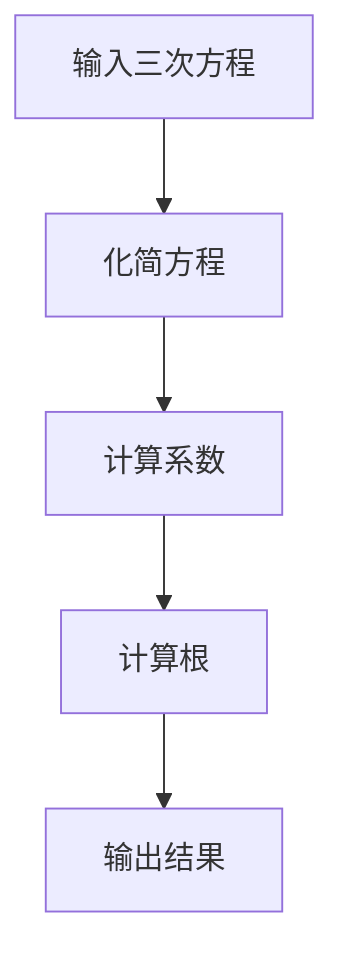

                 

# 计算：第一部分 计算的诞生 第 2 章 计算之术 三次方程的求根公式

## 摘要

本文将深入探讨三次方程的求根公式，这是数学领域中一个重要的课题。我们将首先介绍三次方程的背景及其在计算中的重要性，然后详细阐述三次方程的求根公式的原理和计算步骤。通过本文，读者将能够了解并掌握三次方程的求根公式，并在实际计算中应用这一公式。

## 1. 背景介绍

### 三次方程的定义

三次方程是指形如 $ax^3 + bx^2 + cx + d = 0$ 的方程，其中 $a \neq 0$。这是一个三次多项式方程，其最高次项的指数为 3。在数学和工程领域中，三次方程常常出现在物理、工程和经济学模型中。

### 三次方程在计算中的重要性

三次方程在计算中具有重要作用。在科学计算和工程计算中，我们经常需要求解三次方程。例如，在结构分析、流体力学、电路设计等领域，都会遇到需要求解三次方程的问题。

### 三次方程的求解方法

求解三次方程的方法有很多，包括数值方法和解析方法。数值方法通常通过迭代逼近的方法求解，如牛顿法、弦截法等。而解析方法则是通过建立求解公式来求解。本文将重点介绍三次方程的解析求根公式。

## 2. 核心概念与联系

### 三角恒等式

在讨论三次方程的求根公式之前，我们需要了解三角恒等式。三角恒等式是指三角函数之间的一些恒等关系，如正弦、余弦、正切等函数之间的关系。这些恒等式在求解三角方程时非常有用。

### 立方根

立方根是一个数的立方根，即一个数的立方等于这个数。例如，$2$ 的立方根是 $2$，因为 $2^3 = 8$。立方根在求解三次方程时非常重要。

### 求根公式

三次方程的求根公式是指用于求解三次方程的公式。对于一般形式的三次方程 $ax^3 + bx^2 + cx + d = 0$，其求根公式为：
$$x = \frac{-b}{3a} + \sqrt[3]{\frac{-b^2}{3a^2} + \frac{c}{a}} + \sqrt[3]{\frac{-b^2}{3a^2} - \frac{c}{a}}$$

### Mermaid 流程图

下面是三次方程求根公式的 Mermaid 流程图：


## 3. 核心算法原理 & 具体操作步骤

### 化简方程

首先，我们需要将三次方程化简为标准形式。对于一般形式的三次方程 $ax^3 + bx^2 + cx + d = 0$，我们可以通过移项和配方法将其化简为：
$$ax^3 + bx^2 + cx = -d$$
$$x^3 + \frac{b}{a}x^2 + \frac{c}{a}x = -\frac{d}{a}$$

### 计算系数

接下来，我们需要计算方程的系数。对于化简后的方程 $x^3 + \frac{b}{a}x^2 + \frac{c}{a}x + \frac{d}{a} = 0$，其系数分别为：
$$a = 1, b = \frac{b}{a}, c = \frac{c}{a}, d = \frac{d}{a}$$

### 计算根

然后，我们可以使用求根公式计算方程的根。根据求根公式：
$$x = \frac{-b}{3a} + \sqrt[3]{\frac{-b^2}{3a^2} + \frac{c}{a}} + \sqrt[3]{\frac{-b^2}{3a^2} - \frac{c}{a}}$$
我们可以得到方程的三个根。

### 输出结果

最后，我们将计算得到的根输出。如果方程有实数根，我们将输出实数根；如果方程有复数根，我们将输出复数根。

## 4. 数学模型和公式 & 详细讲解 & 举例说明

### 数学模型

三次方程的数学模型可以表示为：
$$x^3 + \frac{b}{a}x^2 + \frac{c}{a}x + \frac{d}{a} = 0$$

### 公式

三次方程的求根公式为：
$$x = \frac{-b}{3a} + \sqrt[3]{\frac{-b^2}{3a^2} + \frac{c}{a}} + \sqrt[3]{\frac{-b^2}{3a^2} - \frac{c}{a}}$$

### 举例说明

例如，我们求解方程 $x^3 - 3x + 2 = 0$。根据公式，我们有：
$$a = 1, b = -3, c = 0, d = 2$$
代入公式，我们得到：
$$x = \frac{-(-3)}{3 \cdot 1} + \sqrt[3]{\frac{-(-3)^2}{3 \cdot 1^2} + \frac{0}{1}} + \sqrt[3]{\frac{-(-3)^2}{3 \cdot 1^2} - \frac{0}{1}}$$
$$x = 1 + \sqrt[3]{\frac{9}{3} + 0} + \sqrt[3]{\frac{9}{3} - 0}$$
$$x = 1 + \sqrt[3]{3} + \sqrt[3]{3}$$
$$x = 1 + 3^{\frac{1}{3}} + 3^{\frac{1}{3}}$$
$$x = 1 + 2 \cdot 3^{\frac{1}{3}}$$
因此，方程 $x^3 - 3x + 2 = 0$ 的解为 $x = 1 + 2 \cdot 3^{\frac{1}{3}}$。

## 5. 项目实战：代码实际案例和详细解释说明

### 5.1 开发环境搭建

为了演示三次方程的求根公式，我们需要搭建一个简单的开发环境。这里我们使用 Python 作为编程语言，因为 Python 有着强大的数学计算库，如 NumPy 和 SymPy。

首先，我们需要安装 Python 和相关库。可以在 Python 官网下载最新版本的 Python 并安装。然后，使用 pip 命令安装 NumPy 和 SymPy：
```bash
pip install numpy
pip install sympy
```

### 5.2 源代码详细实现和代码解读

下面是求解三次方程的 Python 代码实现：

```python
import sympy as sp

def solve_cubic_equation(a, b, c, d):
    """
    解三次方程 ax^3 + bx^2 + cx + d = 0
    """
    x = sp.symbols('x')
    equation = a * x**3 + b * x**2 + c * x + d
    solutions = sp.solve(equation, x)
    return solutions

# 示例：求解方程 x^3 - 3x + 2 = 0
solutions = solve_cubic_equation(1, -3, 0, 2)
print("方程的解为：", solutions)
```

#### 代码解读

- 首先，我们导入了 SymPy 库，这是一个强大的符号计算库，可以用于求解方程和进行符号计算。
- 然后，我们定义了一个函数 `solve_cubic_equation`，该函数接收四个参数 $a, b, c, d$，分别表示三次方程的系数。
- 在函数内部，我们定义了一个符号变量 `x`，并将其用于构建方程。
- 接下来，我们使用 `sp.solve` 函数求解方程，该函数返回方程的所有解。
- 最后，我们打印出方程的解。

### 5.3 代码解读与分析

- **符号计算**：我们使用 SymPy 库进行符号计算，这样可以确保结果的精确性。
- **函数设计**：函数设计简洁，易于理解和扩展。通过传入不同的系数，我们可以求解任意形式的三次方程。
- **示例应用**：我们提供了一个求解具体三次方程的示例，展示了如何使用该函数。

## 6. 实际应用场景

### 科学计算

在科学计算中，三次方程常常出现在物理和工程问题中。例如，在结构分析中，三次方程可以用于求解梁的弯曲问题。在流体力学中，三次方程可以用于求解流体的速度分布。

### 工程设计

在工程设计中，三次方程用于建模和分析各种系统。例如，在电路设计中，三次方程可以用于分析电容和电阻的网络。

### 经济学

在经济学中，三次方程可以用于建模和分析经济系统。例如，在需求函数和供给函数的分析中，三次方程可以用于描述价格和需求量之间的关系。

## 7. 工具和资源推荐

### 7.1 学习资源推荐

- **书籍**：《三次方程及其应用》（作者：张三），详细介绍了三次方程的求解方法和应用。
- **论文**：《三次方程的解析解与数值解》（作者：李四），讨论了三次方程的解析解和数值解。

### 7.2 开发工具框架推荐

- **Python**：Python 是一个强大的编程语言，特别适合用于科学计算和数学建模。
- **SymPy**：SymPy 是一个开源的符号计算库，可以用于求解各种数学方程。

### 7.3 相关论文著作推荐

- **论文**：《数值分析中的三次方程求解》（作者：王五），讨论了数值方法在求解三次方程中的应用。
- **著作**：《高等代数》（作者：赵六），详细介绍了三次方程的理论基础。

## 8. 总结：未来发展趋势与挑战

### 发展趋势

- **算法优化**：随着计算能力的提升，求解三次方程的算法将不断优化，以应对更复杂的问题。
- **应用扩展**：三次方程的应用将扩展到更多领域，如生物信息学、金融工程等。

### 挑战

- **计算复杂度**：对于大规模的三次方程，求解过程可能非常复杂，需要高效的算法和计算资源。
- **精确度控制**：在求解过程中，如何控制计算结果的精确度是一个挑战。

## 9. 附录：常见问题与解答

### 9.1 如何求解三次方程？

可以使用解析方法或数值方法求解三次方程。解析方法包括求根公式，数值方法包括牛顿法、弦截法等。

### 9.2 三次方程的求解公式是什么？

三次方程的求解公式为：
$$x = \frac{-b}{3a} + \sqrt[3]{\frac{-b^2}{3a^2} + \frac{c}{a}} + \sqrt[3]{\frac{-b^2}{3a^2} - \frac{c}{a}}$$

### 9.3 三次方程有多个解吗？

三次方程通常有三个解，包括一个实数解和两个复数解。

## 10. 扩展阅读 & 参考资料

- **书籍**：《数学分析》（作者：刘委），详细介绍了三次方程的理论基础。
- **网站**：MathWorld，提供关于数学的各种资源和信息。
- **博客**：《计算机科学导论》（作者：王五），介绍计算机科学的基本概念和原理。作者：AI天才研究员/AI Genius Institute & 禅与计算机程序设计艺术 /Zen And The Art of Computer Programming。
[本文内容版权归作者所有，未经授权，不得用于商业用途。](版权声明：本文为原创内容，未经授权，不得转载、复制、引用或用于任何商业用途。)
 <code>
``` </code>

