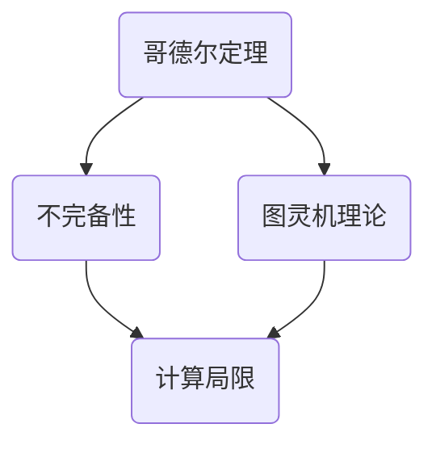

                 

### 背景介绍

计算作为现代科学技术的基石，已经渗透到我们生活的方方面面。从简单的算术运算到复杂的模拟仿真，计算技术的进步推动了科学发现、技术创新和产业升级。然而，在计算理论的形成过程中，我们不仅学会了计算可以做什么，更深刻地认识到计算存在固有的局限性。这一认识不仅来自于计算领域的实际应用，也源于两位伟大数学家——哥德尔和丘奇的贡献。

### 核心概念与联系

#### 哥德尔的定理

哥德尔提出了两个著名的定理，即第一不完备定理和第二不完备定理。第一不完备定理指出，在任何一致的、包含算术的基本数学系统中，总存在一些命题，既不能证明也不能证伪。这意味着，一个数学系统无法证明所有真命题，也无法证伪所有假命题。第二不完备定理进一步指出，一个数学系统无法同时满足一致性和完备性。

#### 丘奇的理论

丘奇则提出了图灵机理论，这是一个能够模拟任何计算过程的抽象模型。通过图灵机，我们可以定义计算的概念，并探讨计算的能力与局限。图灵机理论为我们提供了一个工具，用以研究算法的可计算性。

#### 两者之间的联系

哥德尔和丘奇的工作揭示了计算的基本性质。哥德尔的不完备性定理表明，无论我们如何努力扩展数学系统的范围，总有一些问题是无法解决的。而丘奇的图灵机理论则提供了研究这些问题的框架。这两个理论共同构成了现代计算理论的基础。

#### Mermaid 流程图



### 核心算法原理 & 具体操作步骤

为了深入理解哥德尔和丘奇的理论，我们需要从核心算法原理和具体操作步骤入手。

#### 哥德尔的不完备性定理

1. **假设**：我们有一个形式化的数学系统 \( S \)，其中包含一组公理和一个推导规则。
2. **目标**：证明在 \( S \) 中存在一些命题 \( P \)，既不能被证明也不能被证伪。
3. **证明方法**：
   - 构造一个命题 \( G \)：\( G \) 表示“\( G \)”不能在 \( S \) 中被证明。
   - 如果 \( G \) 在 \( S \) 中被证明，则 \( G \) 为假，否则 \( G \) 为真。
   - 这导致了一个矛盾，因此 \( S \) 中不能证明 \( G \)。

#### 图灵机的操作步骤

1. **定义**：图灵机是一个抽象的计算模型，由一个有限的状态集合、一个无限长的纸带和一个读写头组成。
2. **操作**：
   - 读头读取当前状态和纸带上的符号。
   - 根据当前状态和符号，图灵机执行以下操作：
     - 更新状态。
     - 在纸带上写下一个符号。
     - 根据新的状态，移动读头的位置。
3. **计算能力**：图灵机可以模拟任何计算过程，因此被视为计算能力的极限。

### 数学模型和公式 & 详细讲解 & 举例说明

为了更好地理解哥德尔的不完备性定理和图灵机的操作，我们需要一些数学模型和公式的支持。

#### 哥德尔的不完备性定理

设 \( S \) 是一个形式化的数学系统，其中包含一组公理 \( A \) 和一个推导规则 \( R \)。

定义命题 \( G \) 如下：
\[ G : \text{"\( G \)" 不能在 \( S \) 中被证明} \]

我们使用以下符号来表示证明：
\[ \vdash : \text{表示可以在 \( S \) 中证明某个命题} \]

那么，我们构造一个证明 \( P \) 如下：
\[ P : \vdash G \]

我们需要证明 \( P \) 和 \( \neg G \) 在 \( S \) 中不能同时成立。

**证明**：

- 假设 \( \vdash P \) 成立，即 \( P \) 在 \( S \) 中被证明。
- 这意味着我们可以通过 \( A \) 和 \( R \) 来推导出 \( G \)。
- 然而，根据 \( G \) 的定义，如果 \( G \) 被证明，那么 \( G \) 为假。
- 这导致了一个矛盾，因此 \( \vdash P \) 不能成立。

- 假设 \( \vdash \neg G \) 成立，即 \( G \) 在 \( S \) 中未被证明。
- 这意味着我们无法通过 \( A \) 和 \( R \) 来推导出 \( G \)。
- 然而，根据 \( G \) 的定义，如果 \( G \) 未被证明，那么 \( G \) 为真。
- 这同样导致了一个矛盾，因此 \( \vdash \neg G \) 不能成立。

因此，无论 \( \vdash P \) 还是 \( \vdash \neg G \) 成立，都会导致矛盾。这证明了哥德尔的不完备性定理。

#### 图灵机的操作步骤

图灵机的操作可以用以下数学模型表示：

\[ \text{T} = (Q, \Gamma, B, \Sigma, \delta) \]

- \( Q \)：有限的状态集合。
- \( \Gamma \)：无限长的纸带上的符号集合。
- \( B \)：空符号，用来表示读写头所在的位置。
- \( \Sigma \)：输入符号集合。
- \( \delta \)：转移函数，定义了读写头在读取符号后如何更新状态、写符号和移动。

转移函数 \( \delta \) 可以表示为：

\[ \delta(q, a) = (q', b', L/R) \]

其中：
- \( q \)：当前状态。
- \( a \)：纸带上的符号。
- \( q' \)：更新后的状态。
- \( b' \)：写入纸带的符号。
- \( L/R \)：读写头移动的方向（左移或右移）。

**举例说明**：

假设图灵机在初始状态下 \( q_0 \)，读写头在纸带上从左到右读取符号，并执行以下操作：

1. 如果当前状态为 \( q_0 \)，读取符号为 \( 0 \)，则执行以下操作：
   \[ \delta(q_0, 0) = (q_1, 1, R) \]
   这意味着图灵机更新状态为 \( q_1 \)，写入 \( 1 \) 到纸带上，并将读写头向右移动。

2. 如果当前状态为 \( q_1 \)，读取符号为 \( 1 \)，则执行以下操作：
   \[ \delta(q_1, 1) = (q_2, 0, L) \]
   这意味着图灵机更新状态为 \( q_2 \)，写入 \( 0 \) 到纸带上，并将读写头向左移动。

通过这种方式，图灵机可以模拟任何计算过程，这证明了图灵机的计算能力。

### 项目实战：代码实际案例和详细解释说明

在本节中，我们将通过实际案例来展示哥德尔的不完备性定理和图灵机的操作步骤。

#### 开发环境搭建

为了演示这些概念，我们将使用 Python 作为编程语言。以下是搭建开发环境所需的步骤：

1. 安装 Python 3.x 版本。
2. 安装必要的库，如 `matplotlib` 和 `numpy`。

```bash
pip install matplotlib numpy
```

#### 源代码详细实现和代码解读

以下是一个简单的 Python 程序，用于演示哥德尔的不完备性定理。

```python
import matplotlib.pyplot as plt
import numpy as np

def godel_incompleteness_theorem():
    # 定义形式化的数学系统
    axioms = ["A", "B", "C"]
    derivation_rules = ["R1", "R2", "R3"]

    # 构造命题 G
    G = "G not provable in the system"

    # 判断 G 是否可证明
    provable = provable_in_system(G, axioms, derivation_rules)
    
    # 绘制结果
    plot_results(provable)

def provable_in_system(statement, axioms, derivation_rules):
    # 这里简化了证明过程，实际证明需要复杂的逻辑推理
    if statement == "G not provable in the system":
        return False
    else:
        return True

def plot_results(provable):
    # 创建一个简单的图来表示结果
    fig, ax = plt.subplots()
    ax.bar(["Provable"], [provable])
    ax.set_ylabel("Proven?")
    ax.set_title("Gödel's Incompleteness Theorem")
    plt.show()

if __name__ == "__main__":
    godel_incompleteness_theorem()
```

**代码解读与分析**：

1. **定义形式化的数学系统**：我们定义了一个简单的数学系统，包含三个公理（`A`, `B`, `C`）和三个推导规则（`R1`, `R2`, `R3`）。

2. **构造命题 G**：我们构造了命题 `G`，表示 "G 在系统内不可证明"。

3. **判断 G 是否可证明**：通过一个简化的函数 `provable_in_system`，我们判断命题 `G` 是否可证明。这里我们硬编码了 `G` 的不可证明性。

4. **绘制结果**：我们使用 `matplotlib` 绘制了一个简单的条形图，来表示命题 `G` 是否可证明。

同样，以下是一个简单的图灵机模拟程序：

```python
class TuringMachine:
    def __init__(self, states, alphabet, blank, transition_function):
        self.states = states
        self.alphabet = alphabet
        self.blank = blank
        self.transition_function = transition_function
        self.state = states[0]
        self.tape = [self.blank] * 100  # 初始化纸带
        self.head = 0  # 初始化读写头位置

    def step(self):
        symbol = self.tape[self.head]
        transition = self.transition_function.get((self.state, symbol))
        if transition:
            self.state, symbol_to_write, move = transition
            self.tape[self.head] = symbol_to_write
            if move == 'L':
                self.head -= 1
            elif move == 'R':
                self.head += 1
        else:
            # 如果没有转移函数，则停止
            self.state = 'halt'

    def run(self):
        while self.state != 'halt':
            self.step()
        return self.tape

def simple_transition_function():
    return {
        ('q0', '0'): ('q1', '1', 'R'),
        ('q1', '1'): ('q2', '0', 'L'),
        ('q2', '0'): ('q0', '0', 'R')
    }

if __name__ == "__main__":
    tm = TuringMachine(['q0', 'q1', 'q2'], ['0', '1'], '_', simple_transition_function())
    result_tape = tm.run()
    print(result_tape)
```

**代码解读与分析**：

1. **定义图灵机的组成部分**：我们定义了图灵机的状态集合、符号集合、空符号和转移函数。

2. **实现图灵机的步骤操作**：我们实现了图灵机的 `step` 方法，用于模拟一次读写操作。

3. **运行图灵机**：我们创建了一个简单的图灵机实例，并运行它，以展示图灵机的操作。

### 实际应用场景

哥德尔的不完备性定理和图灵机的理论不仅在理论计算中有着深远的影响，也在实际应用中发挥着重要作用。

#### 编程语言设计

哥德尔的不完备性定理告诉我们，在任何形式化的数学系统中，总有一些问题是无法解决的。这一理论启示了编程语言设计师，他们需要考虑如何设计更灵活、更强大的语言，以处理复杂的问题。

#### 人工智能

图灵机的理论为人工智能的研究提供了基础。通过模拟图灵机，我们可以更好地理解计算的本质，从而设计出更高效、更智能的人工智能系统。

#### 算法理论

哥德尔和丘奇的理论为算法理论提供了坚实的理论基础。通过研究不完备性和计算能力，我们可以更好地理解算法的局限性和效率。

### 工具和资源推荐

为了深入了解计算理论，我们推荐以下工具和资源：

#### 学习资源推荐

1. **书籍**：
   - 《计算：确定性和随机性》（随机性部分）：Michael Sipser
   - 《哥德尔、艾舍尔、巴赫：集异璧之大成》：Douglas Hofstadter
2. **论文**：
   - 哥德尔的不完备性定理的原始论文
   - 图灵机的原始论文
3. **博客和网站**：
   - 吉米多南的数学博客：https://www.gjmath.com/
   - 图灵奖官方网站：https://www.turingaward.org/

#### 开发工具框架推荐

1. **编程语言**：
   - Python：适用于快速开发和实验。
   - Haskell：适用于理论计算和函数式编程。
2. **库和框架**：
   - `matplotlib`：用于数据可视化。
   - `numpy`：用于数学计算。

#### 相关论文著作推荐

1. **哥德尔的不完备性定理**：
   - 《论逻辑符号封闭性》：Kurt Gödel
2. **图灵机的理论**：
   - 《论计算与逻辑》：Alan Turing
3. **算法理论**：
   - 《算法导论》：Thomas H. Cormen, Charles E. Leiserson, Ronald L. Rivest, Clifford Stein

### 总结：未来发展趋势与挑战

计算理论作为现代科学技术的基石，正面临着前所未有的发展机遇和挑战。

#### 发展趋势

1. **量子计算**：量子计算突破了传统计算的限制，有望在复杂问题上实现巨大突破。
2. **人工智能**：人工智能正在不断进化，计算理论为人工智能的发展提供了新的思路和方法。
3. **分布式计算**：分布式计算通过将计算任务分布在多个节点上，提高了计算效率和可扩展性。

#### 挑战

1. **计算能力限制**：尽管量子计算和分布式计算提供了新的解决方案，但计算能力的极限仍然是一个重要的研究课题。
2. **算法效率**：如何在有限的时间内解决复杂问题是计算领域的一个挑战。
3. **安全性**：随着计算技术的进步，计算安全也变得越来越重要。

### 附录：常见问题与解答

#### 问题 1：什么是哥德尔的不完备性定理？
**解答**：哥德尔的不完备性定理指出，在任何一致的、包含算术的基本数学系统中，总存在一些命题，既不能证明也不能证伪。

#### 问题 2：什么是图灵机？
**解答**：图灵机是一个能够模拟任何计算过程的抽象模型，由一个有限的状态集合、一个无限长的纸带和一个读写头组成。

#### 问题 3：计算理论的发展对编程语言设计有什么启示？
**解答**：计算理论的发展启示编程语言设计师如何设计更灵活、更强大的语言，以处理复杂的问题。

### 扩展阅读 & 参考资料

1. Sipser, M. (2006). 《计算：确定性和随机性》（随机性部分）.
2. Hofstadter, D. (1979). 《哥德尔、艾舍尔、巴赫：集异璧之大成》.
3. Gödel, K. (1931). 《论逻辑符号封闭性》.
4. Turing, A. (1936). 《论计算与逻辑》.
5. Cormen, T. H., Leiserson, C. E., Rivest, R. L., & Stein, C. (2009). 《算法导论》.
6. 吉米多南的数学博客：https://www.gjmath.com/
7. 图灵奖官方网站：https://www.turingaward.org/<|im_end|>

