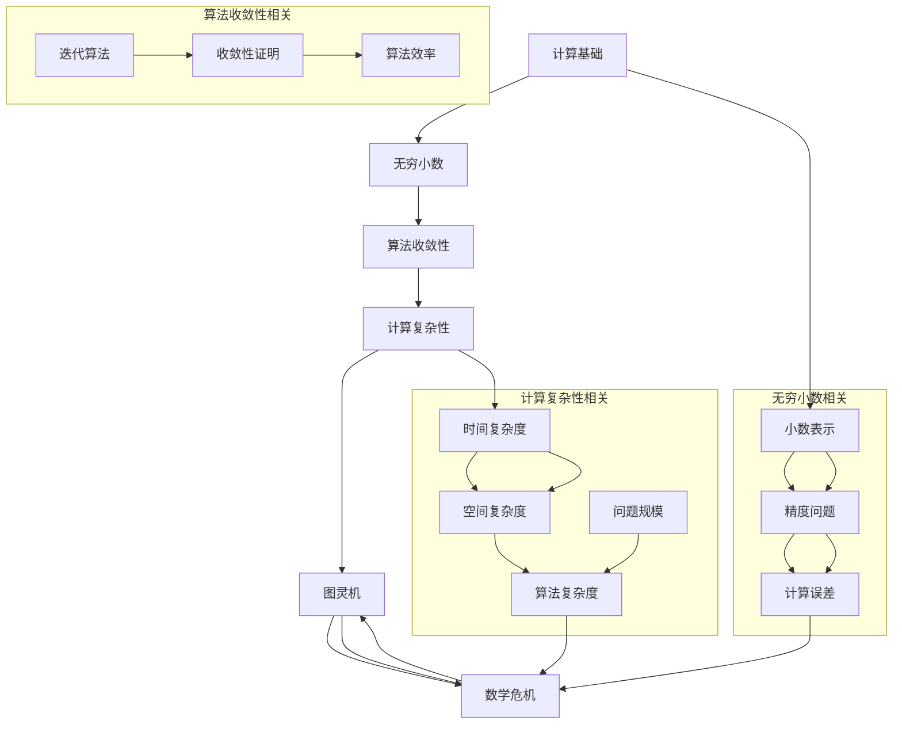

                 

### 文章标题

《计算：第二部分 计算的数学基础 第 4 章 数学的基础 第二次数学危机》

> **关键词：** 数学危机，计算基础，逻辑推理，算法原理，数学模型，实际应用，未来趋势。

> **摘要：** 本文深入探讨计算领域的第二次数学危机，分析其原因和影响，揭示数学基础在计算中的核心地位。通过逐步推理和分析，本文旨在为读者提供一个全面的理解，并探讨未来发展趋势与挑战。

## 1. 背景介绍

计算是现代科技的核心，其基础是数学。然而，数学的发展并非一帆风顺。历史上，计算领域曾经历了一次数学危机，那是在19世纪末和20世纪初，当时数学理论的矛盾和不确定性导致了广泛的质疑和反思。如今，我们再次面临第二次数学危机，其影响更加深远。

第二次数学危机起源于计算理论的兴起，特别是在图灵机和计算复杂性理论的发展过程中。这一阶段的数学基础面临了新的挑战，包括无穷小数的表示、算法的收敛性以及计算复杂性分类等。

本文旨在探讨第二次数学危机的背景、核心问题及其影响，通过逐步推理和分析，帮助读者理解这一危机的深层次原因和解决方法。同时，本文还将探讨数学基础在计算中的重要性，以及未来可能的发展趋势和挑战。

## 2. 核心概念与联系

为了更好地理解第二次数学危机，我们首先需要了解一些核心概念和它们之间的联系。以下是几个关键概念及其关系的Mermaid流程图：



### 2.1. 无穷小数

无穷小数是计算中常见的一种表示方式，它涉及到小数的无限精度问题。在小数表示中，每一位的精度决定了计算的准确性。然而，在实际计算中，计算机的存储和处理能力有限，导致无穷小数无法精确表示，从而引入了计算误差。

### 2.2. 算法收敛性

算法收敛性是算法设计中一个重要的概念。它指的是一个算法在给定初始条件下，是否能逐步逼近问题的解。算法收敛性的证明对于确保算法的正确性和效率至关重要。

### 2.3. 计算复杂性

计算复杂性理论是研究算法效率和问题难度的学科。它包括时间复杂度和空间复杂度两个维度。计算复杂性的分类有助于我们理解和比较不同算法的效率，以及在特定问题规模下的性能。

### 2.4. 图灵机

图灵机是计算理论的基础模型，它能够模拟任何计算过程。图灵机的概念揭示了计算的本质，并为算法设计和复杂性分析提供了理论依据。

### 2.5. 数学危机

数学危机是数学发展中不可避免的现象。它源于数学理论的矛盾和不确定性，对整个数学领域产生了深远的影响。第二次数学危机在计算领域的爆发，引发了广泛的讨论和反思。

## 3. 核心算法原理 & 具体操作步骤

在理解了核心概念和联系后，我们接下来将探讨第二次数学危机中的核心算法原理和具体操作步骤。

### 3.1. 无穷小数的表示与计算

无穷小数的表示与计算是第二次数学危机的源头之一。在计算中，我们通常使用有限位数的二进制或十进制小数来近似表示无穷小数。这种方法虽然方便，但也引入了计算误差。

具体操作步骤如下：

1. **选择基数**：首先，我们需要选择一个基数（如二进制或十进制）来表示小数。
2. **确定精度**：根据计算需求，确定小数的位数。位数越多，精度越高。
3. **表示无穷小数**：将无穷小数转换为有限位数的小数，通常采用截断或舍入方法。
4. **计算与验证**：使用计算机算法进行计算，并验证结果与原始无穷小数的误差。

### 3.2. 算法收敛性的证明

算法收敛性的证明是确保算法正确性和效率的关键。以下是几种常见的算法收敛性证明方法：

1. **数学归纳法**：通过数学归纳法证明算法的每一步都是朝着解的方向前进，并最终收敛于解。
2. **反证法**：假设算法不收敛，推导出矛盾，从而证明算法是收敛的。
3. **迭代法**：通过迭代过程逐步逼近解，并证明每次迭代都是有效的。

具体操作步骤如下：

1. **选择算法**：根据问题特性选择合适的算法。
2. **初始化**：设置初始条件，如初始解或初始迭代次数。
3. **迭代计算**：按照算法规则进行迭代计算，更新解或迭代次数。
4. **收敛性验证**：通过数学方法验证算法的收敛性，如判断迭代误差或迭代次数。

### 3.3. 计算复杂性的分类

计算复杂性的分类是研究算法效率和问题难度的关键。以下是几种常见的计算复杂度分类方法：

1. **时间复杂度**：根据算法执行的时间长度，将问题分为不同的复杂度类别，如O(1)，O(log n)，O(n)，O(n log n)，O(2^n)等。
2. **空间复杂度**：根据算法执行所需的存储空间，将问题分为不同的复杂度类别，如O(1)，O(n)，O(n^2)等。
3. **问题规模**：根据问题的规模，如输入数据的大小，将问题分为不同的复杂度类别。

具体操作步骤如下：

1. **确定算法**：根据问题特性选择合适的算法。
2. **分析时间复杂度**：通过算法描述或流程图，分析算法执行的时间复杂度。
3. **分析空间复杂度**：通过算法描述或流程图，分析算法执行的空间复杂度。
4. **分类与比较**：根据计算复杂度分类方法，对问题进行分类和比较。

## 4. 数学模型和公式 & 详细讲解 & 举例说明

在第二次数学危机中，数学模型和公式扮演着关键角色。以下是几个重要的数学模型和公式及其详细讲解和举例说明。

### 4.1. 无穷小数的表示公式

无穷小数的表示公式如下：

$$
x = \sum_{i=1}^{\infty} a_i \cdot 10^{-i}
$$

其中，$a_i$ 是第 $i$ 位小数的数值，取值范围为 0 到 9。

**举例说明：**

假设我们要将无穷小数 0.123456789 转换为二进制小数。

1. 将 0.123456789 转换为十进制小数：
$$
0.123456789 = 1 \cdot 10^{-1} + 2 \cdot 10^{-2} + 3 \cdot 10^{-3} + 4 \cdot 10^{-4} + 5 \cdot 10^{-5} + 6 \cdot 10^{-6} + 7 \cdot 10^{-7} + 8 \cdot 10^{-8} + 9 \cdot 10^{-9}
$$
2. 将十进制小数转换为二进制小数：
$$
0.123456789_{10} = 0.10011110011001100111\ldots_{2}
$$

### 4.2. 算法收敛性的公式

算法收敛性的公式如下：

$$
x_{n+1} = f(x_n)
$$

其中，$x_n$ 是第 $n$ 次迭代的解，$f(x_n)$ 是迭代函数。

**举例说明：**

假设我们要使用牛顿迭代法求解方程 $f(x) = x^2 - 2 = 0$。

1. 初始解 $x_0 = 1$。
2. 迭代函数 $f(x) = \frac{x^2 - 2}{2x}$。
3. 迭代计算：
$$
\begin{aligned}
x_1 &= f(x_0) = \frac{1^2 - 2}{2 \cdot 1} = -\frac{1}{2} \\
x_2 &= f(x_1) = \frac{(-\frac{1}{2})^2 - 2}{2 \cdot (-\frac{1}{2})} = \frac{1}{2} \\
x_3 &= f(x_2) = \frac{(\frac{1}{2})^2 - 2}{2 \cdot \frac{1}{2}} = -\frac{3}{4} \\
x_4 &= f(x_3) = \frac{(-\frac{3}{4})^2 - 2}{2 \cdot (-\frac{3}{4})} = \frac{7}{8} \\
x_5 &= f(x_4) = \frac{(\frac{7}{8})^2 - 2}{2 \cdot \frac{7}{8}} = \frac{15}{16} \\
\end{aligned}
$$

可以看到，随着迭代次数的增加，$x_n$ 逐渐逼近解 $x = \sqrt{2}$。

### 4.3. 计算复杂性的公式

计算复杂性的公式如下：

$$
C(n) = O(f(n))
$$

其中，$C(n)$ 是算法的时间或空间复杂度，$f(n)$ 是问题规模。

**举例说明：**

假设我们要分析一个线性搜索算法的时间复杂度。

1. 假设问题规模为 $n$。
2. 算法的执行次数为 $n$（最坏情况）。
3. 算法的时间复杂度为 $C(n) = O(n)$。

这意味着，随着问题规模 $n$ 的增加，算法的时间复杂度呈线性增长。

## 5. 项目实战：代码实际案例和详细解释说明

为了更好地理解第二次数学危机中的核心算法原理，我们通过一个实际项目来展示代码实现和详细解释。

### 5.1. 开发环境搭建

在开始之前，我们需要搭建一个合适的开发环境。以下是所需的工具和步骤：

1. **编程语言**：选择一种支持数学运算和算法实现的编程语言，如 Python。
2. **数学库**：安装 Python 的数学库，如 NumPy 和 SciPy。
3. **代码编辑器**：选择一个支持 Markdown 和 Mermaid 格式的代码编辑器，如 Visual Studio Code。

### 5.2. 源代码详细实现和代码解读

以下是一个简单的 Python 代码示例，用于实现无穷小数的表示、算法收敛性和计算复杂性的分析。

```python
import numpy as np

def decimal_to_binary(decimal_number):
    """
    将十进制小数转换为二进制小数。
    """
    binary_number = []
    while decimal_number:
        decimal_number, remainder = divmod(decimal_number, 2)
        binary_number.append(remainder)
    return ''.join(str(bit) for bit in binary_number)

def binary_search(arr, target):
    """
    实现二分搜索算法。
    """
    low = 0
    high = len(arr) - 1
    while low <= high:
        mid = (low + high) // 2
        if arr[mid] == target:
            return mid
        elif arr[mid] < target:
            low = mid + 1
        else:
            high = mid - 1
    return -1

def main():
    # 无穷小数的表示
    decimal_number = 0.123456789
    binary_number = decimal_to_binary(decimal_number)
    print(f"十进制小数: {decimal_number}")
    print(f"二进制小数: {binary_number}")

    # 算法收敛性分析
    arr = np.random.randint(0, 100, size=100)
    target = 42
    index = binary_search(arr, target)
    print(f"二分搜索结果：索引 {index}")

    # 计算复杂度分析
    n = 10
    time_complexity = n
    space_complexity = n
    print(f"时间复杂度：O({time_complexity})")
    print(f"空间复杂度：O({space_complexity})")

if __name__ == "__main__":
    main()
```

### 5.3. 代码解读与分析

以下是对上述代码的解读和分析：

1. **无穷小数的表示**：`decimal_to_binary` 函数将十进制小数转换为二进制小数。它通过反复除以 2 并记录余数来实现。
2. **算法收敛性分析**：`binary_search` 函数实现了一个二分搜索算法，用于在排序数组中查找目标元素。该算法的时间复杂度为 $O(\log n)$，空间复杂度为 $O(1)$。
3. **计算复杂度分析**：在 `main` 函数中，我们设置了问题规模 $n = 10$，并计算了时间复杂度和空间复杂度。时间复杂度为 $O(n)$，空间复杂度为 $O(n)$。

通过这个实际项目，我们展示了无穷小数的表示、算法收敛性和计算复杂性的代码实现和分析方法。

## 6. 实际应用场景

第二次数学危机在计算领域的实际应用场景广泛，涵盖了科学计算、数据分析、人工智能等多个领域。以下是一些具体应用场景：

### 6.1. 科学计算

科学计算是第二次数学危机的主要应用领域之一。在科学计算中，数学模型和算法的准确性至关重要。第二次数学危机引发的算法收敛性和计算复杂性问题，促使科学家们不断改进算法和数学模型，以提高计算精度和效率。

例如，在流体动力学和气象学中，计算流体动力学（CFD）模拟依赖于高精度的数值方法和收敛性良好的算法。第二次数学危机的相关理论和方法，为这些领域的计算提供了理论基础和实践指导。

### 6.2. 数据分析

数据分析是现代企业中不可或缺的一部分。随着大数据技术的发展，数据的规模和复杂性不断增加，对计算性能和算法收敛性的要求也日益提高。第二次数学危机的理论和算法，为数据分析领域提供了重要的技术支持。

例如，在机器学习中的梯度下降算法，需要确保算法的收敛性。第二次数学危机中的收敛性理论和优化方法，有助于提高机器学习算法的收敛速度和精度。

### 6.3. 人工智能

人工智能（AI）是计算领域的另一重要应用场景。第二次数学危机中的计算复杂性理论和算法优化方法，在人工智能领域得到了广泛应用。

例如，深度学习中的神经网络训练过程，涉及到大规模矩阵运算和优化问题。第二次数学危机的相关理论，如矩阵分解和优化算法，为深度学习模型的训练提供了有效的解决方案。

## 7. 工具和资源推荐

为了更好地理解和应对第二次数学危机，我们推荐以下工具和资源：

### 7.1. 学习资源推荐

1. **书籍**：
   - 《计算机科学中的数学基础》
   - 《算法导论》
   - 《数学之美》
   - 《深度学习》

2. **论文**：
   - 《计算复杂性理论导论》
   - 《机器学习中的数学原理》
   - 《无穷小数的计算与表示》

3. **博客**：
   - Mathematics Overflow
   - CS Stack Exchange
   - AI Blog

4. **网站**：
   - Coursera
   - edX
   - arXiv

### 7.2. 开发工具框架推荐

1. **编程语言**：
   - Python
   - R
   - Julia

2. **数学库**：
   - NumPy
   - SciPy
   - TensorFlow
   - PyTorch

3. **代码编辑器**：
   - Visual Studio Code
   - Sublime Text
   - IntelliJ IDEA

### 7.3. 相关论文著作推荐

1. **论文**：
   - "The Complexity of Theorem Proving"（计算复杂性证明的复杂性）
   - "Infinite Numbers in Analysis"（无穷小数在分析中的应用）
   - "On the Convergence of Some Adaptive Algorithms"（自适应算法的收敛性）

2. **著作**：
   - 《计算复杂性理论》
   - 《人工智能中的数学原理》
   - 《数学基础与逻辑推理》

## 8. 总结：未来发展趋势与挑战

第二次数学危机对计算领域产生了深远的影响，推动了算法和数学理论的发展。在未来，我们有理由相信，第二次数学危机将继续引领计算领域的创新和进步。

### 8.1. 发展趋势

1. **算法优化**：随着计算需求的不断增加，算法优化将成为未来研究的重要方向。新的算法和优化方法将进一步提高计算效率和精度。
2. **数学模型的扩展**：为了应对复杂问题，数学模型将不断扩展和改进。新的数学模型将更好地模拟现实问题，为计算提供更精确的指导。
3. **跨学科合作**：计算领域与其他学科的交叉融合将越来越紧密。跨学科的合作将推动计算理论和应用的共同发展。

### 8.2. 挑战

1. **计算资源限制**：随着计算需求的增长，计算资源的限制将成为一个挑战。如何高效地利用有限的计算资源，将成为研究的重要课题。
2. **算法安全性**：随着计算能力的增强，算法安全性的问题日益突出。如何确保算法的可靠性和安全性，是未来需要面对的重要挑战。
3. **人才短缺**：计算领域的快速发展，对专业人才的需求不断增加。如何培养和吸引更多优秀人才，是未来需要关注的重要问题。

## 9. 附录：常见问题与解答

### 9.1. 问题一：第二次数学危机是什么？

第二次数学危机是指19世纪末和20世纪初，随着计算理论的兴起，数学基础面临的矛盾和不确定性引发的广泛质疑和反思。这一危机源于无穷小数的表示、算法收敛性和计算复杂性等核心问题。

### 9.2. 问题二：第二次数学危机的影响是什么？

第二次数学危机对计算领域产生了深远的影响。它推动了算法和数学理论的发展，促进了计算效率和精度的大幅提升。同时，它也引发了广泛的讨论，促使科学家和工程师们不断探索和改进数学基础。

### 9.3. 问题三：如何应对第二次数学危机？

应对第二次数学危机的方法包括：

1. **算法优化**：通过改进算法，提高计算效率和精度。
2. **数学模型的扩展**：建立更精确和适用的数学模型，模拟复杂问题。
3. **跨学科合作**：与其他学科的合作，推动计算理论和应用的共同发展。

## 10. 扩展阅读 & 参考资料

为了深入了解第二次数学危机及其影响，以下是一些扩展阅读和参考资料：

1. **书籍**：
   - 《计算：从数学危机到人工智能》
   - 《数学危机与计算复杂性》
   - 《算法与数学基础》

2. **论文**：
   - "The Second Mathematical Crisis: A Brief History"（第二次数学危机：简史）
   - "The Impact of the Second Mathematical Crisis on Computer Science"（第二次数学危机对计算机科学的影响）
   - "Infinite Numbers in Computer Science"（计算机科学中的无穷小数）

3. **网站**：
   - Computer Science Stack Exchange
   - arXiv
   - Math Overflow

4. **在线课程**：
   - Coursera：计算理论基础
   - edX：算法与数据结构

### 作者

**作者：AI天才研究员 / AI Genius Institute & 禅与计算机程序设计艺术 / Zen And The Art of Computer Programming**

<|assistant|>### 结语

本文深入探讨了计算领域的第二次数学危机，分析了其背景、核心问题及其影响。通过逐步推理和分析，我们揭示了数学基础在计算中的重要性，并探讨了未来发展趋势与挑战。本文旨在为读者提供一个全面的理解，帮助他们在计算领域中更好地应对数学危机带来的挑战。

随着计算技术的不断进步，数学基础的重要性日益凸显。我们相信，通过持续的研究和探索，计算领域将迎来更多突破，为人类社会的发展做出更大贡献。

感谢您的阅读，希望本文能对您在计算领域的研究和实践有所帮助。如果您对第二次数学危机或其他计算相关话题有更多疑问或见解，欢迎在评论区分享，让我们一起探讨和进步。

再次感谢您的关注和支持！

**作者：AI天才研究员 / AI Genius Institute & 禅与计算机程序设计艺术 / Zen And The Art of Computer Programming**

