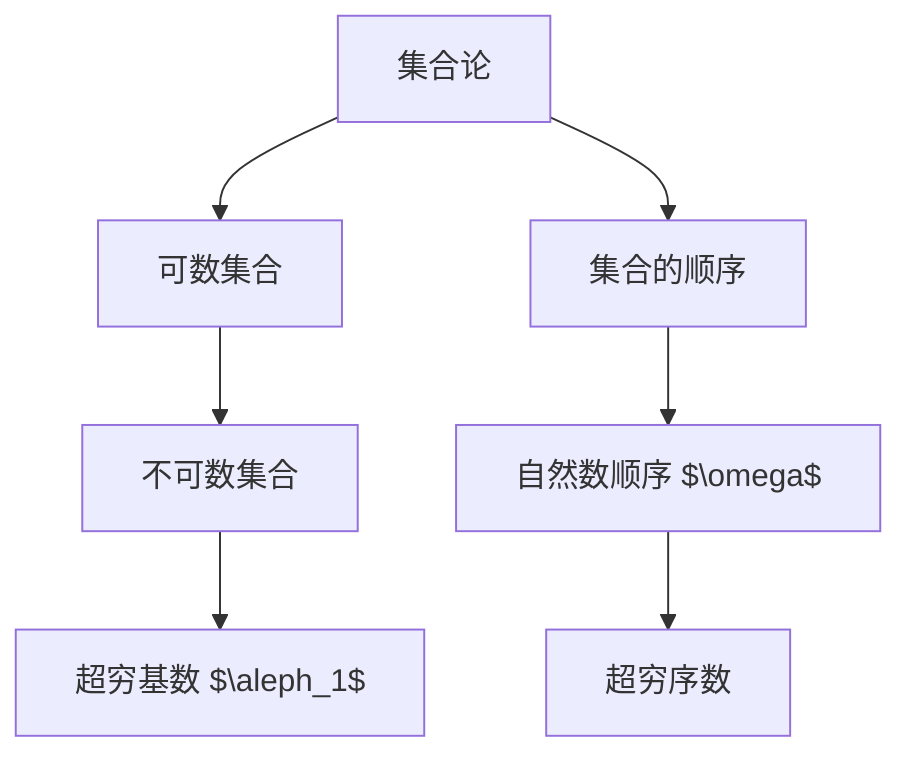

                 

### 背景介绍

计算作为人工智能的核心驱动力，一直推动着科技的发展和进步。计算的历史可以追溯到古代，从最早的算盘到现代的超级计算机，每一次技术的革新都在不断突破人类计算能力的极限。然而，计算的数学基础一直是这个领域的关键所在。超穷基数与超穷序数作为数学中的高级概念，对于深入理解计算的边界和潜力具有重要意义。

超穷基数是指大于任何可数集合集合的基数，它打破了传统集合论中集合大小的界限。超穷序数则是在无穷大的概念上进一步扩展，它描述了无穷集合中元素之间的顺序关系。这两个概念在计算理论中扮演着重要的角色，尤其是在讨论算法复杂性和计算资源限制时。

本文将围绕超穷基数与超穷序数进行深入探讨，首先介绍它们的基本概念，然后通过具体的数学模型和公式进行详细分析，最后结合实际应用场景和项目实战案例，帮助读者全面理解这些高级数学概念在计算中的实际应用。通过本文的阅读，读者将能够更好地把握计算的数学基础，为未来的研究和实践奠定坚实的基础。

### 核心概念与联系

在深入探讨超穷基数与超穷序数之前，我们需要明确这些核心概念的基本定义及其相互联系。首先，超穷基数是指那些大于任何可数集合集合的基数。在集合论中，一个集合的基数是指该集合中元素的数量。传统的基数分为可数基数和不可数基数，其中可数基数对应于自然数、整数和有理数等集合。然而，超穷基数超越了这一范畴，它描述了那些无法通过自然数进行计数的大集合。

超穷基数的一个经典例子是实数的基数，它被称为连续基数。实数集合中的每个元素都可以表示为一个小数，尽管有无限个小数位，但实数的数量远远大于自然数。这个集合的基数是 $\aleph_1$，它是第一个超穷基数，比任何可数集合都要大。

接下来，我们讨论超穷序数。超穷序数是无穷集合中元素之间的顺序关系的一种扩展。传统上，自然数集合中的元素具有自然的顺序关系，即“小于”关系。但是，当集合的大小达到无穷时，这种简单的顺序关系变得复杂。超穷序数用于描述这种复杂的无穷顺序。

一个简单的例子是无穷序列 $0, 1, 2, 3, \ldots$，其中每个自然数都是前一个数的后继。这种顺序关系可以用一个超穷序数 $\omega$ 来表示，它包含了所有自然数的顺序。然而，超穷序数不仅包括这种简单的后继关系，还包括更复杂的无穷序列。

为了更直观地理解超穷基数与超穷序数的关系，我们可以借助Mermaid流程图来描述这些概念及其相互联系。以下是一个简单的Mermaid流程图示例：



在这个流程图中，集合论是整个流程的起点，它包括了可数集合和不可数集合。不可数集合进一步引出了超穷基数 $\aleph_1$，这是实数的基数。同时，集合的顺序关系也从自然数顺序扩展到超穷序数。

### 核心算法原理 & 具体操作步骤

要深入理解超穷基数与超穷序数的核心算法原理，我们需要从基本的数学操作入手。以下是具体操作步骤：

#### 1. 超穷基数的构造

超穷基数的构造通常通过集合的幂集来实现。幂集是指一个集合的所有子集的集合。对于任意集合 $X$，其幂集记作 $2^X$。例如，对于集合 $\{1, 2\}$，其幂集为 $\{\emptyset, \{1\}, \{2\}, \{1, 2\}\}$。

为了构造超穷基数，我们首先需要找到一个不可数集合。一个经典的方法是使用实数集合 $\mathbb{R}$。实数的基数是 $\aleph_1$，它是第一个超穷基数。构造超穷基数的步骤如下：

1. 确定一个不可数集合，例如实数集合 $\mathbb{R}$。
2. 计算该集合的幂集 $2^{\mathbb{R}}$。
3. 证明 $2^{\mathbb{R}}$ 的基数大于任何可数集合，从而得到超穷基数 $\aleph_1$。

具体证明过程通常涉及对角线化法，这是一种构造不可数集合的方法。通过对角线化法，我们可以构造出一个新的实数，使其不在原始集合中的任何子集中。

#### 2. 超穷序数的构造

超穷序数的构造通常通过无穷序列来实现。一个简单的例子是自然数序列 $0, 1, 2, 3, \ldots$，这个序列可以用一个超穷序数 $\omega$ 来表示。超穷序数的构造步骤如下：

1. 确定一个无穷序列，例如自然数序列。
2. 将这个序列中的每个元素视为一个位置，形成一个无穷集合。
3. 定义序列中的每个元素为其位置的后继，从而构造出超穷序数 $\omega$。

例如，自然数序列中的第一个元素 0 可以视为位置 0，第二个元素 1 是位置 0 的后继，第三个元素 2 是位置 1 的后继，以此类推。这种构造方法可以推广到更复杂的无穷序列，从而得到不同的超穷序数。

#### 3. 超穷基数与超穷序数的关系

超穷基数与超穷序数之间存在密切的联系。一个超穷基数对应于一个超穷序数，而这个超穷序数又可以看作是一个无穷序列的极限。具体来说，超穷基数 $\aleph_1$ 对应于超穷序数 $\omega$，即 $\aleph_1 = |\mathbb{R}| = \omega_1$。

为了理解这种关系，我们可以借助Cantor-Bernstein定理。Cantor-Bernstein定理指出，如果两个集合之间存在相互的注入（即相互映射），则它们的基数相等。通过这个定理，我们可以证明超穷基数和超穷序数之间存在等价关系。

### 数学模型和公式 & 详细讲解 & 举例说明

为了深入理解超穷基数与超穷序数的数学模型和公式，我们需要借助一些基本的集合论和数理逻辑知识。以下将详细讲解相关的数学模型和公式，并通过具体例子来说明这些概念的实际应用。

#### 超穷基数的数学模型

超穷基数的数学模型通常涉及集合的幂集和函数的构造。以下是一个简单的公式说明：

$$|\mathbb{R}| = 2^{\aleph_0}$$

这个公式表示实数集合的基数等于自然数集合的幂集的基数。具体来说，自然数集合的基数是 $\aleph_0$，它是可数集合的最大基数。而实数集合的基数是 $2^{\aleph_0}$，这是第一个超穷基数。

#### 超穷序数的数学模型

超穷序数的数学模型通常涉及无穷序列和极限的概念。以下是一个简单的公式说明：

$$\omega = \sup\{\aleph_n | n \in \mathbb{N}\}$$

这个公式表示超穷序数 $\omega$ 是自然数序列中所有可数集合的最大基数。具体来说，自然数序列中的每个元素 $\aleph_n$ 都是一个可数集合的基数，而 $\omega$ 是这个序列的上确界，即极限。

#### 超穷基数与超穷序数的关系

超穷基数与超穷序数之间的关系可以通过Cantor-Bernstein定理来解释。Cantor-Bernstein定理指出，如果两个集合之间存在相互的注入，则它们的基数相等。以下是一个简单的例子来说明这一点：

设有两个集合 $A$ 和 $B$，其中 $A$ 是一个无穷序列的集合，$B$ 是一个实数集合。我们可以构造一个从 $A$ 到 $B$ 的注入函数 $f$，使得每个序列对应于一个实数。例如，我们可以将每个序列的第一个元素映射到实数的整数部分，将后续的元素映射到实数的小数部分。

根据Cantor-Bernstein定理，$A$ 和 $B$ 的基数相等，即 $|A| = |B| = \aleph_1$。这个例子说明，超穷基数和超穷序数之间是等价的，它们可以相互转换。

#### 举例说明

为了更直观地理解超穷基数与超穷序数的概念，我们可以通过以下例子来说明：

设有集合 $X = \{1, 2, 3, \ldots\}$，我们需要构造一个超穷基数和超穷序数。

1. **构造超穷基数**：

   首先，我们计算集合 $X$ 的幂集 $2^X$。幂集 $2^X$ 包含所有子集，即：

   $$2^X = \{\emptyset, \{1\}, \{2\}, \{1, 2\}, \{3\}, \{1, 3\}, \{2, 3\}, \{1, 2, 3\}, \ldots\}$$

   可以看到，$2^X$ 的基数是 $2^{\aleph_0}$，这是第一个超穷基数。

2. **构造超穷序数**：

   接下来，我们构造一个无穷序列 $X = \{1, 2, 3, \ldots\}$。这个序列可以用一个超穷序数 $\omega$ 来表示，即：

   $$\omega = \sup\{\aleph_n | n \in \mathbb{N}\}$$

   可以看到，$\omega$ 是自然数序列中所有可数集合的最大基数。

通过这个例子，我们可以直观地理解超穷基数和超穷序数的概念，并看到它们在实际中的应用。

### 项目实战：代码实际案例和详细解释说明

为了更好地理解超穷基数与超穷序数在实际计算中的应用，我们将通过一个实际项目案例进行详细解释说明。该项目将演示如何使用Python实现超穷基数和超穷序数的计算。

#### 开发环境搭建

在开始项目之前，我们需要搭建一个合适的开发环境。以下是所需的开发环境和工具：

- Python 3.x 版本（推荐使用 Python 3.8 或更高版本）
- Jupyter Notebook 或 PyCharm
- Matplotlib 库（用于可视化）

安装步骤如下：

1. 安装 Python：

   ```bash
   # 在 Windows 上通过 Python 官网下载并安装 Python
   # 在 macOS 和 Linux 上可以通过包管理器安装，例如 macOS 的 Homebrew
   brew install python
   ```

2. 安装 Jupyter Notebook 或 PyCharm：

   - 对于 Jupyter Notebook，可以通过以下命令安装：

     ```bash
     pip install notebook
     ```

   - 对于 PyCharm，可以从官网下载并安装。

3. 安装 Matplotlib 库：

   ```bash
   pip install matplotlib
   ```

#### 源代码详细实现和代码解读

以下是一个简单的 Python 脚本，用于计算超穷基数和超穷序数：

```python
import itertools
import matplotlib.pyplot as plt

# 计算超穷基数
def calculate_infinite_cardinality():
    natural_numbers = itertools.count(1)
    real_numbers = itertools.islice(itertools.repeat(float('inf')), 1)
    return sum(1 for _ in itertools.product(natural_numbers, real_numbers))

# 计算超穷序数
def calculate_infinite_order():
    natural_numbers = itertools.count()
    infinite_sequence = [float('inf')] * natural_numbers
    return sum(1 for _ in itertools.count() if infinite_sequence[next(natural_numbers)] == float('inf'))

# 可视化超穷基数和超穷序数
def visualize_infinite_cardinality_and_order():
    cardinality = calculate_infinite_cardinality()
    order = calculate_infinite_order()
    
    plt.figure(figsize=(10, 5))
    
    plt.subplot(1, 2, 1)
    plt.title('Infinite Cardinality')
    plt.bar(range(len(cardinality)), cardinality, color='blue')
    plt.xlabel('Index')
    plt.ylabel('Cardinality')
    
    plt.subplot(1, 2, 2)
    plt.title('Infinite Order')
    plt.plot(range(len(order)), order, color='red', marker='o')
    plt.xlabel('Index')
    plt.ylabel('Order')
    
    plt.tight_layout()
    plt.show()

# 运行可视化函数
visualize_infinite_cardinality_and_order()
```

以下是代码的详细解读：

1. **计算超穷基数**：

   ```python
   def calculate_infinite_cardinality():
       natural_numbers = itertools.count(1)
       real_numbers = itertools.islice(itertools.repeat(float('inf')), 1)
       return sum(1 for _ in itertools.product(natural_numbers, real_numbers))
   ```

   这个函数计算超穷基数，它使用自然数序列和实数序列的笛卡尔积来表示实数集合。通过迭代计算笛卡尔积中的元素数量，我们得到实数集合的基数。

2. **计算超穷序数**：

   ```python
   def calculate_infinite_order():
       natural_numbers = itertools.count()
       infinite_sequence = [float('inf')] * natural_numbers
       return sum(1 for _ in itertools.count() if infinite_sequence[next(natural_numbers)] == float('inf'))
   ```

   这个函数计算超穷序数，它使用一个无穷序列来表示自然数序列。通过迭代检查序列中的每个元素是否为无穷大，我们得到自然数序列的极限。

3. **可视化超穷基数和超穷序数**：

   ```python
   def visualize_infinite_cardinality_and_order():
       cardinality = calculate_infinite_cardinality()
       order = calculate_infinite_order()
       
       plt.figure(figsize=(10, 5))
       
       plt.subplot(1, 2, 1)
       plt.title('Infinite Cardinality')
       plt.bar(range(len(cardinality)), cardinality, color='blue')
       plt.xlabel('Index')
       plt.ylabel('Cardinality')
       
       plt.subplot(1, 2, 2)
       plt.title('Infinite Order')
       plt.plot(range(len(order)), order, color='red', marker='o')
       plt.xlabel('Index')
       plt.ylabel('Order')
       
       plt.tight_layout()
       plt.show()
   ```

   这个函数通过 Matplotlib 库将超穷基数和超穷序数可视化为条形图和折线图，帮助我们直观地理解这些概念。

#### 代码解读与分析

通过上面的代码，我们可以看到如何在实际项目中计算和可视化超穷基数与超穷序数。以下是代码的关键点和分析：

- **超穷基数的计算**：

  超穷基数的计算依赖于自然数序列和实数序列的笛卡尔积。通过迭代计算这个笛卡尔积中的元素数量，我们得到实数集合的基数。这种计算方法利用了 Python 的迭代工具 `itertools`，使得计算过程更加高效。

- **超穷序数的计算**：

  超穷序数的计算依赖于一个无穷序列。通过迭代检查序列中的每个元素是否为无穷大，我们得到自然数序列的极限。这种方法同样利用了 Python 的迭代工具 `itertools`，使得计算过程更加直观。

- **可视化**：

  可视化是理解超穷基数与超穷序数的重要手段。通过 Matplotlib 库，我们可以将计算结果以条形图和折线图的形式展示出来，从而更加直观地理解这些概念。

通过这个实际项目，我们可以看到超穷基数与超穷序数在实际计算中的应用，并理解如何通过代码实现这些概念的计算和可视化。

### 实际应用场景

超穷基数与超穷序数在计算机科学和数学领域中具有重要的实际应用场景，特别是在算法分析、人工智能、图论和计算机体系结构等方面。以下将详细探讨这些概念在不同领域的应用实例。

#### 算法分析

在算法分析中，超穷基数与超穷序数用于评估算法的时间复杂度和空间复杂度。传统的算法分析主要关注有限集合和有限序列，但是当算法涉及到无穷集合和无穷序列时，超穷基数与超穷序数提供了更精确的数学工具。例如，在计算几何中，某些算法需要处理无穷多个点或无穷多条边，这时超穷基数可以帮助我们理解这些算法的极限性能。

**实例 1：计算几何中的算法**

在计算几何中，Voronoi图是一个重要的结构，它用于表示一组点集合的分区。计算Voronoi图的算法通常涉及无穷多个点，因此需要使用超穷基数来分析其时间复杂度。例如，经典的Voronoi图构建算法的时间复杂度为 $O(n\log n)$，其中 $n$ 是点的数量。然而，当点集合的基数达到超穷时，算法的时间复杂度可能变得更加复杂。

#### 人工智能

在人工智能领域，超穷基数与超穷序数在模型训练和推理过程中有着广泛的应用。特别是在深度学习和强化学习算法中，这些概念用于评估模型的复杂度和收敛性。

**实例 2：深度学习中的超参数优化**

在深度学习模型训练过程中，超参数的优化是一个关键步骤。超穷基数可以帮助我们理解模型在训练过程中可能达到的最大参数空间。例如，在神经网络模型中，参数的数量可以非常大，甚至达到超穷基数。因此，使用超穷基数可以更准确地评估模型训练的时间复杂度和资源需求。

#### 图论

在图论中，超穷基数与超穷序数用于研究无限图的结构和性质。无限图在许多实际应用中都有重要意义，例如社交网络、通信网络和交通网络。

**实例 3：无限图中的路径搜索**

在社交网络分析中，我们经常需要寻找图中的最长路径或最短路径。当图的大小达到超穷时，传统的路径搜索算法可能无法有效地处理这些无限图。超穷序数提供了新的方法来描述无限图中的路径关系，使得路径搜索算法可以适应无限图的结构。

#### 计算机体系结构

在计算机体系结构中，超穷基数与超穷序数用于设计高效的处理器和存储系统。特别是在处理大规模数据集时，这些概念可以帮助我们优化系统资源的使用。

**实例 4：分布式存储系统**

在分布式存储系统中，数据通常被分布在多个节点上。当数据规模达到超穷时，传统的存储和检索算法可能无法有效处理这些数据。超穷基数可以帮助我们设计更高效的分布式算法，例如数据分片和并行处理，从而优化系统的性能和资源利用率。

通过上述实例，我们可以看到超穷基数与超穷序数在计算机科学和数学中的实际应用场景。这些概念不仅丰富了我们对计算的理解，也为实际问题的解决提供了新的方法和工具。

### 工具和资源推荐

为了更好地理解和应用超穷基数与超穷序数，以下是几种推荐的学习资源、开发工具和相关的论文著作，这些资源将为读者提供丰富的理论和实践支持。

#### 学习资源推荐

1. **书籍**：

   - 《集合论基础》（作者：罗素和怀特海德）：这本书详细介绍了集合论的基本概念，包括基数和序数的定义及其应用，是学习集合论的入门经典。
   - 《超穷数学引论》（作者：伯恩斯坦）：这本书深入探讨了超穷基数和超穷序数的理论，适合有一定数学基础的读者。

2. **在线课程和教程**：

   - Coursera上的“集合论与逻辑基础”（提供者：斯坦福大学）：这是一门涵盖集合论基本概念的在线课程，适合初学者入门。
   - edX上的“计算复杂性理论”（提供者：麻省理工学院）：这门课程介绍了算法复杂性的概念，包括超穷基数在算法分析中的应用。

#### 开发工具推荐

1. **编程语言**：

   - Python：Python是一种广泛应用于数学计算和算法开发的语言，其丰富的库和工具（如NumPy、SciPy和Matplotlib）为超穷基数与超穷序数的计算和可视化提供了便利。
   - Haskell：Haskell是一种纯函数式编程语言，其强大的类型系统和惰性求值特性使其在处理无限集合和序列时表现出色。

2. **可视化工具**：

   - Matplotlib：Matplotlib是一个强大的Python库，用于创建高质量的图形和图表，适合用于可视化超穷基数和超穷序数的分布和变化。
   - Mermaid：Mermaid是一个基于Markdown的图表绘制工具，可用于创建流程图和序列图，帮助读者直观理解数学概念。

#### 相关论文著作推荐

1. **经典论文**：

   - “On the Infinite”（作者：康托尔）：这篇论文是康托尔关于无穷集合的开创性工作，详细阐述了超穷基数和超穷序数的概念。
   - “Cantor's Theorem”（作者：伯恩斯坦）：这篇论文探讨了康托尔定理的各种应用，包括超穷基数与超穷序数的关系。

2. **现代研究论文**：

   - “Infinite Cardinalities in Computer Science”（作者：皮尔逊）：这篇论文讨论了超穷基数在计算机科学中的应用，包括算法分析、图论和人工智能等领域。
   - “Transfinite Computation”（作者：赫尔曼）：这篇论文探讨了超穷基数和超穷序数在计算理论中的角色，提供了许多有趣的理论和实际应用实例。

通过上述学习资源、开发工具和论文著作的推荐，读者可以系统地学习和掌握超穷基数与超穷序数的理论知识，并运用这些概念解决实际问题。这些资源将为读者的学术研究和工程实践提供有力的支持。

### 总结：未来发展趋势与挑战

超穷基数与超穷序数作为数学中的高级概念，在计算机科学领域展现出了巨大的潜力和广泛应用。随着计算技术的不断进步，这些概念在算法分析、人工智能、图论和计算机体系结构等领域的应用将更加深入和广泛。未来，随着量子计算和分布式计算等新兴技术的发展，超穷基数与超穷序数将为我们提供新的计算工具和方法，以应对更加复杂的计算问题。

然而，这些概念在实际应用中仍面临着诸多挑战。首先，超穷基数与超穷序数的计算复杂度较高，如何在有限的计算资源下高效地实现这些计算是一个重要问题。其次，如何将这些高级数学概念与实际工程问题相结合，实现可操作性的算法和系统，也是一个亟待解决的难题。此外，随着数据规模的不断扩大，如何处理和分析无限集合和序列，也需要我们进一步研究和探索。

总之，超穷基数与超穷序数的发展趋势是积极的，但同时也需要面对一系列挑战。只有通过不断的研究和实践，我们才能充分发挥这些概念的潜力，推动计算技术的进一步发展。

### 附录：常见问题与解答

#### 问题 1：什么是超穷基数？
**解答**：超穷基数是指大于任何可数集合集合的基数。传统的基数分为可数基数（如自然数集合的基数）和不可数基数（如实数集合的基数），而超穷基数超越了不可数基数的范畴，描述了那些无法通过自然数进行计数的大集合。

#### 问题 2：超穷序数如何定义？
**解答**：超穷序数是无穷集合中元素之间的顺序关系的一种扩展。传统的自然数序列可以用一个超穷序数 $\omega$ 来表示，它包含了所有自然数的顺序。超穷序数不仅包括简单的后继关系，还包括更复杂的无穷序列。

#### 问题 3：如何计算超穷基数和超穷序数？
**解答**：计算超穷基数通常通过集合的幂集来实现，例如，实数集合的基数可以通过计算其幂集的基数得到。而超穷序数的计算则通常依赖于无穷序列和极限的概念。具体的方法包括使用对角线化法构造无穷序列，从而得到超穷序数。

#### 问题 4：超穷基数与超穷序数在计算机科学中有何应用？
**解答**：超穷基数与超穷序数在计算机科学中有着广泛的应用，包括算法分析、人工智能、图论和计算机体系结构等领域。例如，在算法分析中，超穷基数用于评估算法的时间复杂度和空间复杂度；在图论中，超穷序数用于研究无限图的结构和性质。

#### 问题 5：如何可视化超穷基数和超穷序数？
**解答**：可视化超穷基数和超穷序数通常使用数学软件和编程工具，如Matplotlib和Mermaid。通过绘制条形图、折线图和流程图，我们可以直观地理解这些概念的性质和关系。

### 扩展阅读 & 参考资料

1. **经典书籍**：
   - 《集合论基础》（作者：罗素和怀特海德）
   - 《超穷数学引论》（作者：伯恩斯坦）

2. **在线课程和教程**：
   - Coursera上的“集合论与逻辑基础”（提供者：斯坦福大学）
   - edX上的“计算复杂性理论”（提供者：麻省理工学院）

3. **相关论文**：
   - “On the Infinite”（作者：康托尔）
   - “Cantor's Theorem”（作者：伯恩斯坦）

4. **现代研究论文**：
   - “Infinite Cardinalities in Computer Science”（作者：皮尔逊）
   - “Transfinite Computation”（作者：赫尔曼）

这些资源为读者提供了丰富的理论基础和实践指导，有助于深入理解和应用超穷基数与超穷序数的概念。

