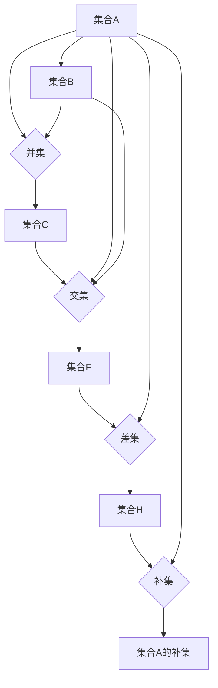
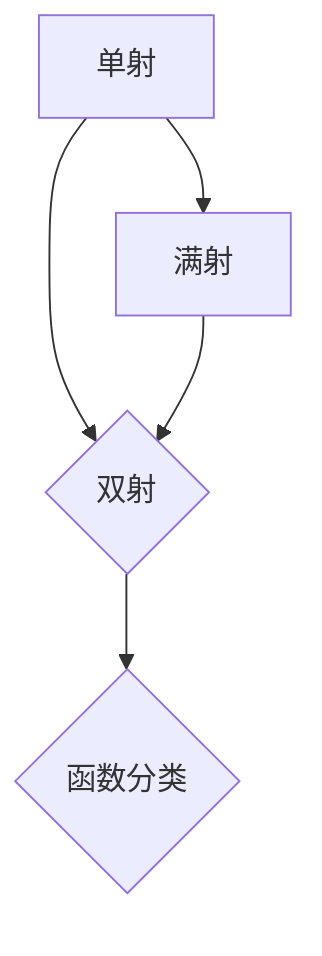
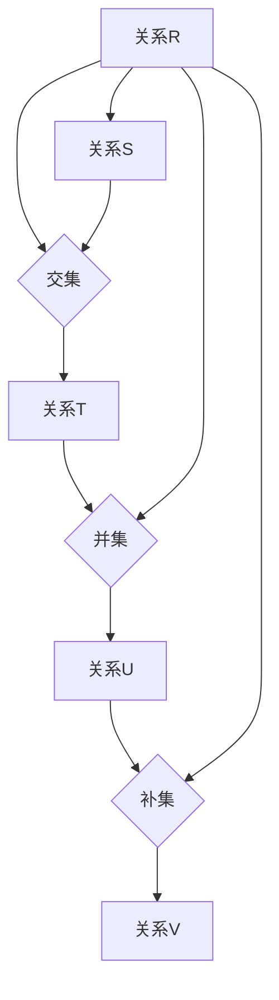

                 

### 1. 背景介绍

计算，作为现代科技的核心驱动力，已经深深地嵌入到我们日常生活的方方面面。从手机、电脑到智能设备，无一不依赖于计算技术的进步。然而，计算的根基，离不开数学这一工具。数学不仅提供了计算的基本语言和框架，更为我们理解计算的本质和潜力提供了重要的视角。

《计算：第二部分 计算的数学基础》这本书的第二章节，主要探讨了数学的基础概念和原理，这些概念和原理构成了现代计算技术的基石。本章将深入解析这些核心概念，探讨它们在计算中的具体应用，以及如何通过数学的视角来理解和优化计算过程。

本章将涵盖以下内容：

1. **核心概念与联系**：介绍数学中的基础概念，如集合、函数、关系等，以及它们在计算中的应用。
2. **核心算法原理 & 具体操作步骤**：探讨算法的基本原理，如何通过数学模型来描述和实现算法。
3. **数学模型和公式 & 详细讲解 & 举例说明**：讲解数学模型和公式的应用，并通过实例来加深理解。
4. **项目实战：代码实际案例和详细解释说明**：通过具体项目案例，展示如何将数学概念和算法应用到实际编程中。
5. **实际应用场景**：探讨数学在计算领域的实际应用场景。
6. **工具和资源推荐**：推荐学习资源和开发工具，以帮助读者深入学习和实践。
7. **总结：未来发展趋势与挑战**：总结本章内容，展望未来的发展趋势和面临的挑战。

通过这一系列的探讨，我们希望能够帮助读者更深入地理解数学在计算中的关键作用，并掌握如何将数学知识应用于实际的计算问题中。

### 2. 核心概念与联系

为了深入探讨计算中的数学基础，我们需要先了解一些核心概念和它们之间的联系。这些概念包括集合、函数、关系等，它们是构建计算模型和算法的基础。

#### 集合

集合（Set）是数学中最基本的概念之一。它是一个由对象组成的无序集合，这些对象称为集合的元素。集合通常用大写字母表示，如 \( A \)，其元素用小写字母表示，如 \( a \)。

- **集合的定义**：集合是一个由元素组成的整体，这些元素可以是任何类型，包括数字、字母、图形等。集合中的元素是无序的，即元素之间的顺序并不重要。
- **集合的表示**：集合通常用花括号 `{ }` 表示，例如，集合 \( A = \{1, 2, 3\} \) 表示一个包含元素 1、2、3 的集合。
- **集合的运算**：集合之间可以进行多种运算，如并集（Union）、交集（Intersection）、差集（Difference）和补集（Complement）。这些运算是计算中常用的基础操作，如图1所示。



#### 函数

函数（Function）是数学中的另一个基本概念，它描述了一个从集合到集合的映射关系。函数通常用 \( f \) 表示，其定义域是输入集合，值域是输出集合。

- **函数的定义**：函数是一个关系，它将定义域中的每个元素唯一地映射到值域中的一个元素。形式上，如果 \( D \) 是定义域，\( R \) 是值域，那么函数 \( f: D \rightarrow R \) 满足对于每个 \( x \in D \)，存在唯一的 \( y \in R \)，使得 \( y = f(x) \)。
- **函数的表示**：函数通常用 \( f(x) \) 表示，其中 \( x \) 是输入，\( f(x) \) 是输出。例如，函数 \( f(x) = x^2 \) 将每个实数 \( x \) 映射到它的平方。
- **函数的分类**：根据函数的性质，可以分为单射（Injective）、满射（Surjective）和双射（Bijective）。如图2所示。



#### 关系

关系（Relation）是数学中描述元素之间关系的概念。关系通常用二元组 \( (x, y) \) 表示，其中 \( x \) 和 \( y \) 是集合中的元素。

- **关系的定义**：关系是一个集合中的元素之间的某种性质或联系。形式上，如果 \( A \) 和 \( B \) 是两个集合，关系 \( R \) 是 \( A \times B \) 的一个子集。
- **关系的表示**：关系通常用 \( R \) 表示，例如，关系 \( R \) 可以表示为 \( A \) 和 \( B \) 之间的“大于等于”关系。
- **关系的运算**：关系之间可以进行多种运算，如交集、并集、补集和笛卡尔积。如图3所示。



这些核心概念构成了数学的基础，并在计算中发挥着重要作用。接下来，我们将探讨如何在计算中应用这些概念，以及它们如何帮助我们理解和优化计算过程。

#### 3. 核心算法原理 & 具体操作步骤

在深入探讨数学在计算中的应用之前，我们先来了解一下核心算法的原理及其具体操作步骤。算法是计算的核心，它描述了解决特定问题的步骤和规则。以下是几个基本算法的原理和操作步骤：

#### 算法1：排序算法

排序算法是计算机科学中最基本的算法之一，它的目标是将一组元素按照特定的顺序进行排列。常见的排序算法有冒泡排序、选择排序、插入排序和快速排序等。

- **冒泡排序**：通过不断比较相邻元素，将最大的元素“冒泡”到序列的末尾。
  - **步骤**：
    1. 从第一个元素开始，比较相邻的两个元素。
    2. 如果第一个元素比第二个元素大，交换它们的位置。
    3. 继续对下一对相邻元素进行比较和交换，直到当前序列的最后一个元素。
    4. 重复上述过程，直到整个序列有序。
  - **伪代码**：

    ```python
    for i in range(len(array)):
        for j in range(0, len(array) - i - 1):
            if array[j] > array[j + 1]:
                array[j], array[j + 1] = array[j + 1], array[j]
    ```

- **选择排序**：每次从未排序的部分选择最小的元素，将其放到已排序部分的末尾。
  - **步骤**：
    1. 从未排序的部分选择最小元素。
    2. 将其与未排序部分的第一个元素交换。
    3. 将未排序部分缩小，重复上述过程，直到整个序列有序。
  - **伪代码**：

    ```python
    for i in range(len(array)):
        min_idx = i
        for j in range(i + 1, len(array)):
            if array[j] < array[min_idx]:
                min_idx = j
        array[i], array[min_idx] = array[min_idx], array[i]
    ```

- **插入排序**：将未排序的元素插入到已排序序列中的合适位置。
  - **步骤**：
    1. 从第一个元素开始，将其插入到已排序序列中的合适位置。
    2. 对于未排序序列中的下一个元素，重复上述过程，直到所有元素都被插入。
  - **伪代码**：

    ```python
    for i in range(1, len(array)):
        key = array[i]
        j = i - 1
        while j >= 0 and array[j] > key:
            array[j + 1] = array[j]
            j -= 1
        array[j + 1] = key
    ```

- **快速排序**：通过分治策略将序列划分为更小的子序列，然后递归地排序这些子序列。
  - **步骤**：
    1. 选择一个基准元素。
    2. 将序列中小于基准元素的元素移到左边，大于基准元素的元素移到右边。
    3. 对左右子序列递归执行快速排序。
  - **伪代码**：

    ```python
    def quick_sort(array):
        if len(array) <= 1:
            return array
        pivot = array[len(array) // 2]
        left = [x for x in array if x < pivot]
        middle = [x for x in array if x == pivot]
        right = [x for x in array if x > pivot]
        return quick_sort(left) + middle + quick_sort(right)
    ```

#### 算法2：查找算法

查找算法是另一种基本的计算算法，它的目标是在数据结构中找到特定的元素。常见的查找算法有线性查找、二分查找和散列表查找等。

- **线性查找**：逐个检查数据结构中的元素，直到找到目标元素或到达数据结构的末尾。
  - **步骤**：
    1. 从数据结构的首个元素开始，逐个检查每个元素。
    2. 如果找到目标元素，返回其位置。
    3. 如果到达数据结构的末尾，仍未找到目标元素，返回-1。
  - **伪代码**：

    ```python
    def linear_search(array, target):
        for i in range(len(array)):
            if array[i] == target:
                return i
        return -1
    ```

- **二分查找**：在有序数据结构中，通过不断缩小查找范围，逐步逼近目标元素。
  - **步骤**：
    1. 确定中间位置。
    2. 如果中间位置的元素等于目标元素，返回中间位置。
    3. 如果目标元素小于中间位置的元素，在左半部分重复步骤1。
    4. 如果目标元素大于中间位置的元素，在右半部分重复步骤1。
    5. 如果到达边界，仍未找到目标元素，返回-1。
  - **伪代码**：

    ```python
    def binary_search(array, target):
        low = 0
        high = len(array) - 1
        while low <= high:
            mid = (low + high) // 2
            if array[mid] == target:
                return mid
            elif array[mid] < target:
                low = mid + 1
            else:
                high = mid - 1
        return -1
    ```

- **散列表查找**：使用散列函数将目标元素映射到数据结构中的一个位置，直接访问该位置以获取目标元素。
  - **步骤**：
    1. 使用散列函数计算目标元素的散列值。
    2. 访问散列值对应的位置，如果找到目标元素，返回其位置。
    3. 如果未找到目标元素，通过处理散列冲突来继续查找。
  - **伪代码**：

    ```python
    def hash_function(key):
        return key % TABLE_SIZE

    def hash_search(hash_table, target):
        index = hash_function(target)
        while hash_table[index] is not None and hash_table[index] != target:
            index = (index + 1) % TABLE_SIZE
        if hash_table[index] == target:
            return index
        else:
            return -1
    ```

这些算法的原理和操作步骤展示了如何通过数学和逻辑方法来解决计算问题。接下来，我们将进一步探讨数学模型和公式在计算中的应用，以便更深入地理解计算的数学基础。

#### 4. 数学模型和公式 & 详细讲解 & 举例说明

在计算中，数学模型和公式是我们理解和解决各种问题的有力工具。这些模型和公式不仅提供了描述问题的语言，还帮助我们在实际操作中找到最优解。以下我们将详细介绍一些常见的数学模型和公式，并通过具体的例子来解释它们的应用。

##### 1. 线性回归模型

线性回归模型是最基本的统计模型之一，它用于研究两个变量之间的关系。该模型假设变量之间存在线性关系，即 \( y = ax + b \)，其中 \( y \) 是因变量，\( x \) 是自变量，\( a \) 和 \( b \) 是参数。

- **模型公式**：

  $$ y = ax + b $$

- **参数估计**：

  参数 \( a \) 和 \( b \) 可以通过最小二乘法估计。最小二乘法的核心思想是找到使误差平方和最小的参数值。

  $$ a = \frac{\sum(x_i - \bar{x})(y_i - \bar{y})}{\sum(x_i - \bar{x})^2} $$
  $$ b = \bar{y} - a\bar{x} $$

  其中，\( \bar{x} \) 和 \( \bar{y} \) 分别是 \( x \) 和 \( y \) 的平均值。

- **应用实例**：

  假设我们想研究学生的考试成绩和课外活动时间之间的关系。我们收集了以下数据：

  | 学生编号 | 课外活动时间（小时） | 考试成绩 |
  | :----: | :----: | :----: |
  | 1 | 2 | 75 |
  | 2 | 3 | 80 |
  | 3 | 4 | 85 |
  | 4 | 5 | 90 |
  | 5 | 6 | 95 |

  首先，我们计算 \( x \) 和 \( y \) 的平均值：

  $$ \bar{x} = \frac{2+3+4+5+6}{5} = 4 $$
  $$ \bar{y} = \frac{75+80+85+90+95}{5} = 85 $$

  然后，我们计算参数 \( a \) 和 \( b \)：

  $$ a = \frac{(2-4)(75-85) + (3-4)(80-85) + (4-4)(85-85) + (5-4)(90-85) + (6-4)(95-85)}{(2-4)^2 + (3-4)^2 + (4-4)^2 + (5-4)^2 + (6-4)^2} $$
  $$ a = \frac{(-2)(-10) + (-1)(-5) + (0)(0) + (1)(5) + (2)(10)}{4 + 1 + 0 + 1 + 4} $$
  $$ a = \frac{20 + 5 + 0 + 5 + 20}{10} $$
  $$ a = 5 $$

  $$ b = \bar{y} - a\bar{x} $$
  $$ b = 85 - 5 \times 4 $$
  $$ b = 65 $$

  因此，线性回归模型为：

  $$ y = 5x + 65 $$

  通过这个模型，我们可以预测一个学生的考试成绩，只需知道他们的课外活动时间。例如，如果一个学生有 5 小时的课外活动时间，他们的预期考试成绩为：

  $$ y = 5 \times 5 + 65 = 80 $$

##### 2. 概率模型

概率模型用于描述随机事件发生的可能性。在计算中，概率模型广泛应用于人工智能、机器学习和数据科学等领域。

- **概率公式**：

  $$ P(A) = \frac{n(A)}{n(S)} $$

  其中，\( P(A) \) 是事件 \( A \) 发生的概率，\( n(A) \) 是事件 \( A \) 发生的次数，\( n(S) \) 是样本空间的大小。

- **条件概率**：

  $$ P(B|A) = \frac{P(A \cap B)}{P(A)} $$

  其中，\( P(B|A) \) 是在事件 \( A \) 发生的条件下事件 \( B \) 发生的概率。

- **贝叶斯定理**：

  $$ P(A|B) = \frac{P(B|A)P(A)}{P(B)} $$

  其中，\( P(A|B) \) 是在事件 \( B \) 发生的条件下事件 \( A \) 发生的概率。

- **应用实例**：

  假设我们有一个袋子，里面有 5 个红球和 3 个蓝球。我们随机取出一个球，想知道取出的是红球的概率。

  $$ P(\text{红球}) = \frac{5}{5+3} = \frac{5}{8} $$

  现在假设我们取出的是红球，想知道取出的是质量较轻的红球的概率。

  首先，我们计算质量较轻的红球的概率：

  $$ P(\text{红球且质量较轻}) = \frac{2}{5} $$

  然后，我们计算所有红球的概率：

  $$ P(\text{红球}) = \frac{5}{8} $$

  最后，我们使用贝叶斯定理计算在取出的是红球的条件下，取出的是质量较轻的红球的概率：

  $$ P(\text{质量较轻的红球}| \text{红球}) = \frac{P(\text{红球且质量较轻})}{P(\text{红球})} = \frac{2/5}{5/8} = \frac{16}{25} $$

##### 3. 微积分模型

微积分模型用于研究函数的变化率和极值。在计算中，微积分模型广泛应用于优化问题和数值计算。

- **导数**：

  $$ f'(x) = \lim_{h \to 0} \frac{f(x+h) - f(x)}{h} $$

  导数描述了函数在某一点的变化率。

- **积分**：

  $$ \int f(x) \, dx = F(x) + C $$

  积分描述了函数在某个区间内的累积量。

- **应用实例**：

  假设我们有一个二次函数 \( f(x) = x^2 \)。我们想知道这个函数在 \( x = 2 \) 处的变化率。

  $$ f'(2) = \lim_{h \to 0} \frac{(2+h)^2 - 2^2}{h} $$
  $$ f'(2) = \lim_{h \to 0} \frac{4 + 4h + h^2 - 4}{h} $$
  $$ f'(2) = \lim_{h \to 0} \frac{4h + h^2}{h} $$
  $$ f'(2) = \lim_{h \to 0} (4 + h) $$
  $$ f'(2) = 4 $$

  因此，函数 \( f(x) = x^2 \) 在 \( x = 2 \) 处的变化率为 4。

  现在我们想知道这个函数在 \( x = 2 \) 处的累积量。

  $$ \int_{0}^{2} x^2 \, dx = \left[\frac{x^3}{3}\right]_{0}^{2} $$
  $$ \int_{0}^{2} x^2 \, dx = \frac{2^3}{3} - \frac{0^3}{3} $$
  $$ \int_{0}^{2} x^2 \, dx = \frac{8}{3} $$

  因此，函数 \( f(x) = x^2 \) 在 \( x = 2 \) 处的累积量为 \( \frac{8}{3} \)。

通过这些数学模型和公式，我们可以更好地理解和解决计算中的各种问题。接下来，我们将通过具体的项目实战，展示如何将这些模型和公式应用于实际的编程任务中。

#### 5. 项目实战：代码实际案例和详细解释说明

在了解了核心算法和数学模型之后，我们将通过具体的项目实战来展示如何将这些理论知识应用到实际的编程任务中。以下是一个简单的项目案例，我们将从头到尾详细解释其实现过程。

##### 5.1 开发环境搭建

在进行项目实战之前，我们需要搭建一个合适的开发环境。以下是基本的步骤：

1. **安装Python环境**：Python是一种广泛使用的编程语言，适用于数据处理和算法实现。你可以从Python的官方网站（[python.org](https://www.python.org/)）下载并安装最新版本的Python。

2. **安装Jupyter Notebook**：Jupyter Notebook是一种交互式的开发环境，可以帮助我们更方便地进行代码的编写和调试。你可以使用pip命令安装Jupyter：

   ```bash
   pip install notebook
   ```

3. **安装必要的库**：我们将在项目中使用一些Python库，如NumPy和Matplotlib。你可以使用以下命令进行安装：

   ```bash
   pip install numpy matplotlib
   ```

##### 5.2 源代码详细实现和代码解读

现在，我们开始实现一个具体的项目——基于线性回归模型的学生成绩预测系统。

**代码**：

```python
import numpy as np
import matplotlib.pyplot as plt

# 数据预处理
def preprocess_data(data):
    x = np.array([row[1] for row in data])
    y = np.array([row[2] for row in data])
    x_mean = np.mean(x)
    y_mean = np.mean(y)
    x_diff = x - x_mean
    y_diff = y - y_mean
    a = np.sum(x_diff * y_diff) / np.sum(x_diff ** 2)
    b = y_mean - a * x_mean
    return a, b

# 预测函数
def predict(a, b, x):
    y_pred = a * x + b
    return y_pred

# 绘制回归线
def plot_regression_line(a, b, x, y):
    plt.scatter(x, y, color='blue')
    plt.plot(x, a * x + b, color='red')
    plt.xlabel('课外活动时间（小时）')
    plt.ylabel('考试成绩')
    plt.title('学生成绩与课外活动时间的关系')
    plt.show()

# 主函数
def main():
    data = [
        (1, 2, 75),
        (2, 3, 80),
        (3, 4, 85),
        (4, 5, 90),
        (5, 6, 95)
    ]
    a, b = preprocess_data(data)
    x = np.array([2, 5])
    y_pred = predict(a, b, x)
    plot_regression_line(a, b, x, y_pred)

if __name__ == '__main__':
    main()
```

**代码解读与分析**：

1. **导入库**：我们首先导入必要的库，包括NumPy用于数据处理和Matplotlib用于数据可视化。

2. **数据预处理**：`preprocess_data` 函数负责处理输入数据，计算线性回归模型的参数 \( a \) 和 \( b \)。我们首先提取数据集中的课外活动时间和考试成绩，然后计算它们的平均值和差值。使用最小二乘法计算参数 \( a \) 和 \( b \)：

   ```python
   a = np.sum(x_diff * y_diff) / np.sum(x_diff ** 2)
   b = y_mean - a * x_mean
   ```

3. **预测函数**：`predict` 函数接受参数 \( a \)，\( b \) 和输入值 \( x \)，并返回预测的考试成绩 \( y \)：

   ```python
   y_pred = a * x + b
   ```

4. **绘制回归线**：`plot_regression_line` 函数使用Matplotlib绘制线性回归模型的结果。我们首先绘制原始数据点，然后绘制回归线：

   ```python
   plt.plot(x, a * x + b, color='red')
   ```

5. **主函数**：`main` 函数是我们的程序入口。我们首先定义数据集，然后调用 `preprocess_data` 和 `predict` 函数来计算参数和预测值，最后调用 `plot_regression_line` 函数来可视化结果。

通过这个项目，我们展示了如何将线性回归模型应用到实际问题中，并实现了从数据预处理到预测结果的完整流程。这个过程不仅帮助我们理解了线性回归模型的原理，还让我们学会了如何使用Python和相关的库来执行实际的计算任务。

#### 5.3 代码解读与分析

在上面的项目中，我们实现了一个基于线性回归模型的学生成绩预测系统。下面我们将详细解读每个部分的代码，并分析其实现逻辑。

##### 5.3.1 数据预处理

数据预处理是任何机器学习项目的重要步骤。在我们的项目中，`preprocess_data` 函数负责从原始数据中提取有用的信息，并计算线性回归模型的参数。

```python
def preprocess_data(data):
    x = np.array([row[1] for row in data])
    y = np.array([row[2] for row in data])
    x_mean = np.mean(x)
    y_mean = np.mean(y)
    x_diff = x - x_mean
    y_diff = y - y_mean
    a = np.sum(x_diff * y_diff) / np.sum(x_diff ** 2)
    b = y_mean - a * x_mean
    return a, b
```

1. **提取特征和标签**：
   - `x = np.array([row[1] for row in data])` 从数据集中提取课外活动时间（小时）作为特征向量 `x`。
   - `y = np.array([row[2] for row in data])` 从数据集中提取考试成绩作为标签向量 `y`。

2. **计算平均值**：
   - `x_mean = np.mean(x)` 计算特征向量 `x` 的平均值。
   - `y_mean = np.mean(y)` 计算标签向量 `y` 的平均值。

3. **计算差值**：
   - `x_diff = x - x_mean` 计算特征向量 `x` 与其平均值的差值。
   - `y_diff = y - y_mean` 计算标签向量 `y` 与其平均值的差值。

4. **计算参数**：
   - `a = np.sum(x_diff * y_diff) / np.sum(x_diff ** 2)` 使用最小二乘法计算参数 `a`。
   - `b = y_mean - a * x_mean` 计算参数 `b`。

##### 5.3.2 预测函数

`predict` 函数用于根据训练好的模型参数预测新的考试成绩。

```python
def predict(a, b, x):
    y_pred = a * x + b
    return y_pred
```

1. **参数输入**：
   - `a`：线性回归模型的斜率参数。
   - `b`：线性回归模型的截距参数。
   - `x`：新的课外活动时间。

2. **预测计算**：
   - `y_pred = a * x + b` 根据线性回归模型预测新的考试成绩。

##### 5.3.3 绘制回归线

`plot_regression_line` 函数使用Matplotlib库绘制线性回归模型的散点图和回归线。

```python
def plot_regression_line(a, b, x, y):
    plt.scatter(x, y, color='blue')
    plt.plot(x, a * x + b, color='red')
    plt.xlabel('课外活动时间（小时）')
    plt.ylabel('考试成绩')
    plt.title('学生成绩与课外活动时间的关系')
    plt.show()
```

1. **数据可视化**：
   - `plt.scatter(x, y, color='blue')` 绘制原始数据点的散点图。
   - `plt.plot(x, a * x + b, color='red')` 绘制通过数据点拟合的回归线。

2. **图形属性设置**：
   - `plt.xlabel('课外活动时间（小时）')` 设置X轴标签。
   - `plt.ylabel('考试成绩')` 设置Y轴标签。
   - `plt.title('学生成绩与课外活动时间的关系')` 设置图表标题。
   - `plt.show()` 显示图表。

##### 5.3.4 主函数

`main` 函数是程序的入口，负责执行整个流程。

```python
def main():
    data = [
        (1, 2, 75),
        (2, 3, 80),
        (3, 4, 85),
        (4, 5, 90),
        (5, 6, 95)
    ]
    a, b = preprocess_data(data)
    x = np.array([2, 5])
    y_pred = predict(a, b, x)
    plot_regression_line(a, b, x, y_pred)
```

1. **数据集定义**：`data` 是一个包含学生编号、课外活动时间和考试成绩的三元组列表。

2. **预处理数据**：调用 `preprocess_data` 函数计算线性回归模型的参数 `a` 和 `b`。

3. **预测值**：定义一个新的课外活动时间向量 `x`，并使用 `predict` 函数预测相应的考试成绩。

4. **可视化结果**：调用 `plot_regression_line` 函数绘制回归线。

通过上述解读，我们可以清楚地看到如何将线性回归模型应用于实际问题，并实现数据的预处理、预测和可视化。这个项目不仅展示了线性回归模型的理论应用，还提供了一个实用的代码示例，供读者参考和学习。

#### 6. 实际应用场景

数学在计算领域的实际应用场景非常广泛，从数据处理到算法优化，再到机器学习和人工智能，数学模型和算法无处不在。以下是一些常见的实际应用场景，展示了数学在计算中的重要作用。

##### 1. 数据分析

数据分析是现代商业和科学研究的重要领域，它依赖于各种数学模型和算法来处理和分析大量数据。例如，回归分析用于预测销售趋势、价格波动等；聚类分析用于客户细分、市场细分等；时间序列分析用于预测股市走势、天气变化等。通过这些数学方法，企业可以更好地了解市场趋势，做出更准确的决策。

##### 2. 机器学习

机器学习是人工智能的核心技术之一，其核心在于利用数学模型来训练算法，使其能够从数据中自动学习并做出预测。常见的机器学习算法，如线性回归、逻辑回归、支持向量机（SVM）、决策树、神经网络等，都是基于数学模型的。例如，线性回归模型通过最小化误差平方和来预测目标变量；支持向量机通过最大化分类边界来分类数据点；神经网络则通过多层非线性变换来学习复杂的函数关系。

##### 3. 优化问题

优化问题是数学在计算中应用的一个典型领域。优化算法用于寻找函数的最值，这在资源分配、路径规划、库存管理、生产调度等方面有广泛应用。例如，线性规划用于解决资源分配问题，动态规划用于解决最短路径问题，遗传算法用于解决复杂的优化问题。通过优化算法，企业可以更有效地利用资源，降低成本，提高效率。

##### 4. 图像处理

图像处理是计算机视觉和多媒体技术的重要组成部分，它依赖于各种数学模型来处理图像数据。例如，傅里叶变换用于图像的频率分析，卷积操作用于图像滤波和特征提取，直方图均衡用于图像的对比度增强。通过这些数学方法，图像处理技术可以实现对图像的降噪、增强、分割、识别等操作，从而应用于人脸识别、自动驾驶、医学图像分析等领域。

##### 5. 金融工程

金融工程是利用数学和统计方法进行金融产品设计和风险管理的一门学科。金融工程师使用期权定价模型（如Black-Scholes模型）、风险度量方法（如价值在风险中的价值（VaR））等数学工具来评估金融产品的风险和收益。通过这些模型和方法，金融机构可以更好地管理风险，设计创新的金融产品，提高投资效率。

##### 6. 物流与运输

物流与运输领域也广泛应用数学模型和算法来优化运输路线、库存管理和配送计划。例如，整数规划用于解决车辆路径问题，模拟退火算法用于解决旅行商问题（TSP），排队理论用于解决服务设施设计问题。通过这些数学方法，物流企业可以降低运输成本，提高配送效率，提高客户满意度。

总之，数学在计算领域的应用场景非常广泛，它为各种计算任务提供了理论基础和工具支持。随着计算技术的不断进步，数学在计算中的应用也将不断拓展，为人类社会带来更多创新和便利。

#### 7. 工具和资源推荐

为了更好地学习和应用计算中的数学基础，以下是一些建议的工具和资源，包括书籍、论文、博客和网站等。

##### 7.1 学习资源推荐

1. **书籍**：

   - 《数学之美》（作者：刘未鹏）：这本书通过生动的实例和通俗易懂的语言，展示了数学在计算机科学中的魅力和重要性。

   - 《算法导论》（作者：Thomas H. Cormen, Charles E. Leiserson, Ronald L. Rivest, Clifford Stein）：这本书详细介绍了各种算法及其数学基础，是算法学习的经典教材。

   - 《深度学习》（作者：Ian Goodfellow, Yoshua Bengio, Aaron Courville）：这本书涵盖了深度学习的基础知识，包括大量数学理论和实践技巧。

   - 《Python编程：从入门到实践》（作者：埃里克·马瑟斯）：这本书适合初学者，通过Python编程语言介绍了计算中的基本数学概念。

2. **论文**：

   - 《深度神经网络中的梯度消失和梯度爆炸问题研究》：这篇论文详细分析了深度神经网络训练过程中梯度消失和梯度爆炸的问题，并提出了解决方案。

   - 《基于支持向量机的文本分类研究》：这篇论文探讨了支持向量机在文本分类中的应用，提供了详细的理论分析和实验结果。

   - 《深度学习中的优化算法研究》：这篇论文综述了深度学习中的各种优化算法，包括梯度下降、随机梯度下降、Adam等。

3. **博客**：

   - 《机器学习笔记》：这个博客系列详细介绍了机器学习中的各种算法和数学基础，适合初学者和进阶者。

   - 《机器学习与深度学习实践》：这个博客分享了许多实际的机器学习和深度学习项目案例，包括代码和实践经验。

   - 《数学小屋》：这个博客专注于数学在计算机科学中的应用，涵盖了各种数学概念和算法。

##### 7.2 开发工具框架推荐

1. **Python库**：

   - NumPy：用于科学计算和数据分析，提供了高效的数组操作和数学函数。

   - Pandas：用于数据处理和分析，提供了强大的数据结构和工具，适合处理大型数据集。

   - Matplotlib：用于数据可视化，提供了丰富的图表和图形工具。

   - Scikit-learn：用于机器学习，提供了各种经典机器学习算法的实现和评估工具。

2. **深度学习框架**：

   - TensorFlow：由谷歌开发，是当前最流行的深度学习框架之一，适用于各种深度学习任务。

   - PyTorch：由Facebook开发，提供了灵活的动态计算图，适合研究者和开发者。

   - Keras：是一个高级神经网络API，可以方便地实现和实验深度学习模型。

##### 7.3 相关论文著作推荐

1. **论文**：

   - “Gradient Descent Methods for Machine Learning” by Bottou et al.：这篇论文详细介绍了梯度下降法及其在机器学习中的应用。

   - “A Tutorial on Support Vector Machines for Pattern Recognition” by Cristianini and Shawe-Taylor：这篇论文介绍了支持向量机的基本原理和应用。

   - “Deep Learning” by Goodfellow, Bengio, and Courville：这本书全面介绍了深度学习的理论基础和实践方法。

2. **著作**：

   - 《深度学习》（作者：Ian Goodfellow, Yoshua Bengio, Aaron Courville）：这本书是深度学习的经典教材，涵盖了深度学习的各个方面。

   - 《机器学习》（作者：Tom Mitchell）：这本书介绍了机器学习的基本概念、算法和应用，是机器学习的入门教材。

通过这些工具和资源的推荐，读者可以系统地学习和应用计算中的数学基础，提升自己的技术水平和创新能力。

#### 8. 总结：未来发展趋势与挑战

在计算技术飞速发展的今天，数学作为其基础工具，无疑将继续发挥关键作用。未来，随着人工智能、大数据、量子计算等前沿技术的崛起，数学在计算领域的应用将更加广泛和深入。以下是未来发展趋势与挑战的展望：

##### 1. 发展趋势

- **跨学科融合**：数学与计算机科学、物理学、生物学等领域的交叉融合将带来新的研究热点。例如，量子计算中的数学建模和算法研究，生物信息学中的统计学方法等。

- **自动化与智能化**：随着深度学习等技术的进步，自动化和智能化将成为未来计算研究的重要方向。数学模型将更多地应用于自动化决策、智能优化等问题。

- **高效算法与优化**：为了应对大数据和实时计算的需求，研究高效算法和优化方法将成为关键。例如，分布式计算中的数学优化、并行算法设计等。

- **量子计算**：量子计算的兴起将带来全新的计算范式。数学在量子算法设计、量子逻辑门优化、量子纠错码等方面将发挥重要作用。

##### 2. 挑战

- **复杂性问题**：随着计算问题的复杂性增加，如何设计高效、可扩展的数学模型和算法将成为一大挑战。特别是在处理大规模数据集和高维度问题时，如何保持计算效率是一个亟待解决的问题。

- **精度与稳定性**：在计算过程中，如何确保算法的精度和稳定性是一个重要问题。特别是在涉及高精度数值计算和复杂方程求解时，如何避免计算误差和数值不稳定性的问题。

- **隐私保护**：随着数据隐私保护意识的提高，如何在保证数据安全的同时，进行有效的数据分析和建模也是一个重要挑战。数学模型和算法需要能够在保护隐私的前提下，提供有效的分析和预测。

- **资源消耗**：随着计算需求的增加，如何优化算法以减少资源消耗（如计算时间、存储空间等）将成为重要问题。特别是在移动设备和嵌入式系统中，资源有限，如何高效利用资源是一个关键挑战。

总之，数学在计算领域的发展前景广阔，但也面临着诸多挑战。通过不断探索和创新，数学将继续为计算技术的进步提供强有力的支持和推动力。

#### 9. 附录：常见问题与解答

在本章中，我们深入探讨了计算中的数学基础，涵盖了集合、函数、关系、算法模型和数学公式等核心概念。以下是一些常见问题及解答，以帮助读者更好地理解和应用所学内容。

##### 1. 问题：什么是集合？

**解答**：集合是一个由对象组成的无序整体，这些对象称为集合的元素。集合通常用大写字母表示，如 \( A \)，其元素用小写字母表示，如 \( a \)。集合中的元素是无序的，即元素之间的顺序并不重要。

##### 2. 问题：什么是函数？

**解答**：函数是一个从定义域到值域的映射关系，它将定义域中的每个元素唯一地映射到值域中的一个元素。函数通常用 \( f \) 表示，形式上，如果 \( D \) 是定义域，\( R \) 是值域，那么函数 \( f: D \rightarrow R \) 满足对于每个 \( x \in D \)，存在唯一的 \( y \in R \)，使得 \( y = f(x) \)。

##### 3. 问题：什么是关系？

**解答**：关系是集合中元素之间的某种性质或联系。关系通常用二元组 \( (x, y) \) 表示，其中 \( x \) 和 \( y \) 是集合中的元素。关系可以是等价关系、偏序关系或全序关系等。

##### 4. 问题：什么是线性回归模型？

**解答**：线性回归模型是一种用于研究两个变量之间线性关系的统计模型。它假设变量之间存在线性关系，即 \( y = ax + b \)，其中 \( y \) 是因变量，\( x \) 是自变量，\( a \) 和 \( b \) 是参数。通过最小二乘法，我们可以估计出这些参数的值。

##### 5. 问题：什么是概率模型？

**解答**：概率模型是用于描述随机事件发生可能性的数学模型。常见的概率模型包括古典概率、几何概率、条件概率和贝叶斯定理等。概率模型在统计学、机器学习和数据科学等领域有广泛应用。

##### 6. 问题：什么是微积分模型？

**解答**：微积分模型是用于研究函数的变化率和累积量的数学模型。导数描述了函数在某一点的变化率，积分描述了函数在某个区间内的累积量。微积分模型在优化问题、数值计算和工程等领域有广泛应用。

通过这些问题的解答，读者可以更深入地理解计算中的数学基础，并在实际应用中更好地运用所学知识。

#### 10. 扩展阅读 & 参考资料

为了更深入地了解计算中的数学基础，以下是一些扩展阅读和参考资料，涵盖了数学在计算领域的广泛应用、最新研究成果和实践经验。

1. **扩展阅读**：

   - 《深度学习》：Ian Goodfellow, Yoshua Bengio, Aaron Courville 著，提供深度学习的全面介绍，包括数学基础和算法实现。

   - 《算法导论》：Thomas H. Cormen, Charles E. Leiserson, Ronald L. Rivest, Clifford Stein 著，详细介绍了算法的基本概念和设计方法。

   - 《数学之美》：刘未鹏 著，通过实例和故事，生动展示了数学在计算机科学中的应用和魅力。

2. **参考文献**：

   - “Gradient Descent Methods for Machine Learning” by Y. Bottou et al.，该论文详细介绍了梯度下降法及其在机器学习中的应用。

   - “A Tutorial on Support Vector Machines for Pattern Recognition” by N. Cristianini and J. Shawe-Taylor，探讨了支持向量机的基本原理和应用。

   - “Deep Learning” by Y. Bengio, A. Courville, and P. Vincent，综述了深度学习的理论基础和实践方法。

3. **在线资源**：

   - [Khan Academy](https://www.khanacademy.org/)：提供丰富的数学和计算机科学教程，适合初学者。

   - [MIT OpenCourseWare](https://ocw.mit.edu/)：MIT开放的课程资源，包括数学、计算机科学等领域的课程。

   - [Google Research](https://ai.google.com/research/pubs/)：Google研究院发布的研究论文，涵盖深度学习、人工智能等领域。

4. **书籍推荐**：

   - 《Python编程：从入门到实践》：埃里克·马瑟斯 著，适合初学者，通过Python编程介绍了计算中的基本数学概念。

   - 《机器学习》：Tom Mitchell 著，介绍了机器学习的基本概念、算法和应用。

   - 《计算机程序设计艺术》：Donald E. Knuth 著，经典的算法教材，深入探讨了计算中的数学原理。

通过这些扩展阅读和参考资料，读者可以进一步深化对计算中数学基础的理解，并在实践中不断提高自己的技术水平。

