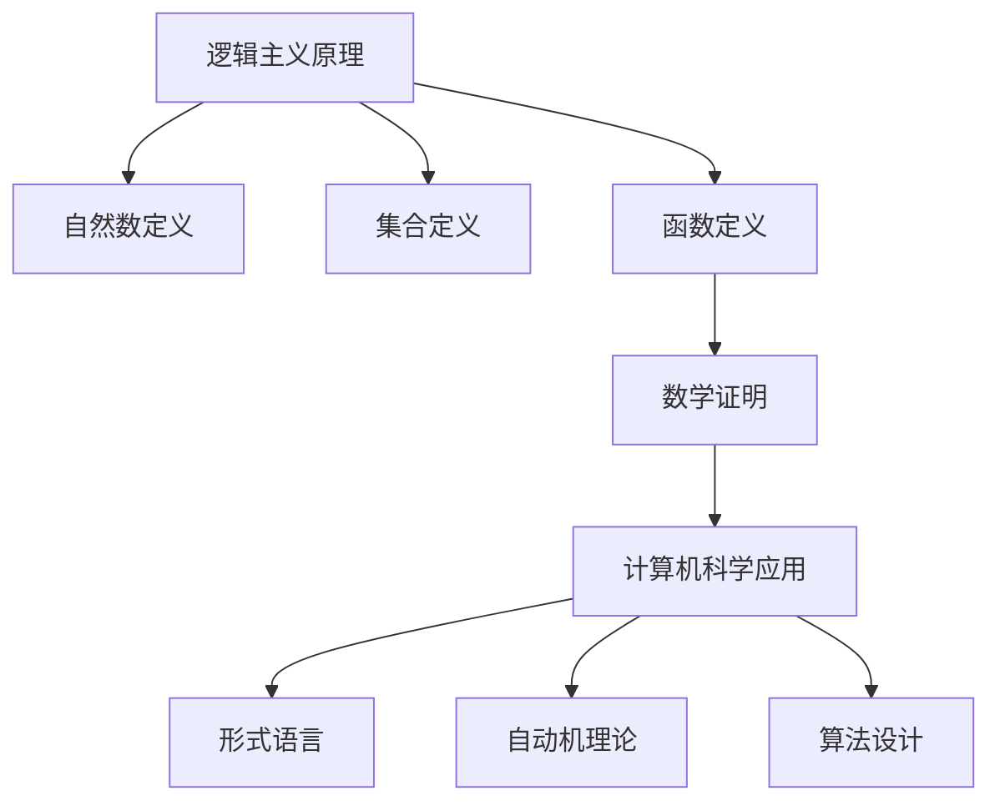

                 

# 计算机图灵奖简介

计算机图灵奖（A.M. Turing Award），也称为图灵奖，是计算机科学的最高奖项之一，被誉为“计算机界的诺贝尔奖”。该奖项由美国计算机协会（ACM）于1966年设立，旨在表彰对计算机科学和信息技术领域做出杰出贡献的个人。图灵奖每年评选一次，获奖者将获得10万美元的奖金、一个金质奖章以及一项由美国总统颁发的国家科学贡献奖状。

图灵奖以其严格的评选标准和卓越的学术成就而闻名于世。获奖者通常在其领域内做出了开创性的贡献，他们的工作对计算机科学的发展产生了深远的影响。例如，艾伦·图灵（Alan Turing）因其对计算机理论和算法设计的贡献而获得了首个图灵奖。自设立以来，许多图灵奖获得者都在人工智能、数据库系统、编程语言设计、计算机架构、密码学等领域做出了杰出的贡献。

计算机图灵奖在计算机科学领域具有重要的地位，不仅是因为其奖励金额和荣誉，更在于其表彰了那些在技术革新和科学进步方面做出卓越贡献的个人。这些获奖者的工作不仅推动了计算机科学的快速发展，也极大地影响了现代信息技术的应用，从而改变了我们的生活方式。

本文将以《计算：第二部分 计算的数学基础 第 5 章 第三次数学危机 逻辑主义进路》为标题，深入探讨逻辑主义在解决第三次数学危机中的重要作用。我们将首先回顾第三次数学危机的背景，然后详细分析逻辑主义的基本原理，接着讨论逻辑主义在数学发展中的实际应用。最后，我们将总结逻辑主义对数学和计算机科学的深远影响，并探讨未来可能面临的挑战。

## 1. 背景介绍

第三次数学危机是数学史上的一次重大转折点，发生在20世纪初。在牛顿和莱布尼茨创立微积分之后，数学家们不断探索新的数学概念和方法，推动了数学的快速发展。然而，随着数学理论的深入，一些基本问题逐渐浮现，尤其是关于数学基础和逻辑一致性的争议。

19世纪末，数学家们发现了诸如集合论悖论和形式系统的不一致性等问题，这引发了广泛的讨论和争议。特别是罗素（Bertrand Russell）和怀特海德（Alfred North Whitehead）在《数学原理》中提出的集合论悖论，揭示了形式系统内在的矛盾。这些问题动摇了数学的根基，使得数学家们开始重新审视数学的基础和逻辑。

为了解决这些危机，数学家们提出了多种不同的解决方案，其中之一便是逻辑主义进路。逻辑主义试图将数学建立在逻辑的基础上，通过严格的逻辑推理和定义来确保数学理论的逻辑一致性。这种进路的核心思想是，所有数学概念和命题都可以还原为逻辑概念和命题，从而避免形式系统中的悖论和矛盾。

逻辑主义的代表人物是弗雷格（Gottlob Frege）和罗素（Bertrand Russell）。弗雷格是逻辑主义的开创者，他试图通过逻辑来构建数学的基础，提出了著名的“概念文字”理论。罗素则通过对集合论的研究，揭示了形式系统中存在的悖论，并提出了逻辑主义的方法来解决问题。

在逻辑主义的框架下，数学家们重新审视了数学的基本概念，如自然数、集合、函数等，并试图通过逻辑推理来证明这些概念的一致性和有效性。逻辑主义不仅为数学提供了新的基础，也为后来的形式化方法和计算机科学的发展奠定了理论基础。

### 1.1 第三次数学危机的起源

第三次数学危机的起源可以追溯到19世纪末和20世纪初，这一时期数学理论的深度和广度都有了显著拓展，同时也暴露了许多基础性问题。集合论作为数学的基础工具，受到了特别关注。然而，集合论本身却引发了众多悖论和逻辑问题，使得数学家们不得不重新审视数学的根基。

其中最著名的悖论是罗素悖论。罗素悖论指出，如果假设一个集合R包含所有不包含自身作为元素的集合，那么R是否包含自身呢？这个问题看似简单，却揭示了形式系统中的不一致性。如果R包含自身，那么根据定义，它不应该包含自身；如果R不包含自身，那么根据定义，它应该包含自身。这就形成了一个逻辑上的矛盾。

除了集合论悖论，数学家们还发现了一些形式系统的不一致性。例如，罗素和怀特海德在《数学原理》中试图构建一个完备的形式系统，以证明数学理论的一致性。然而，他们发现了一些形式系统内的悖论，这表明形式系统本身可能是不一致的。

这些悖论和一致性问题的出现，使得数学家们开始重新审视数学的基础，并寻找新的解决方案。逻辑主义正是在这种背景下提出的，试图通过严格的逻辑推理和定义来重建数学基础，解决数学危机。

### 1.2 数学基础的重新构建

面对第三次数学危机，数学家们提出了多种解决方案，其中最具影响力的便是逻辑主义。逻辑主义的基本思想是，将数学建立在逻辑的基础上，通过逻辑推理来构建数学理论。这一进路的核心目标是确保数学理论的逻辑一致性，避免形式系统中的悖论和矛盾。

首先，逻辑主义者对数学的基本概念进行了重新定义和解释。例如，弗雷格提出了“概念文字”理论，认为数学概念可以通过逻辑概念来定义。他认为，自然数、集合、函数等数学概念都可以通过逻辑术语来表述，从而确保数学理论的逻辑一致性。

其次，逻辑主义者关注数学理论的证明过程。他们试图通过严格的逻辑推理，证明数学命题的有效性。这意味着，每一个数学命题都必须经过严格的逻辑推导，而不能仅仅依赖于直觉或经验。这种严格性有助于确保数学理论的一致性和可靠性。

在逻辑主义的框架下，数学家们开始重新审视数学的基本概念和理论。他们通过逻辑推理，建立了新的数学理论体系，试图解决形式系统中的悖论和一致性问题。这一过程不仅为数学的发展提供了新的方向，也为后来的计算机科学奠定了理论基础。

### 1.3 逻辑主义在数学发展中的意义

逻辑主义在数学发展中具有重要的意义。首先，逻辑主义为数学提供了新的基础，使得数学理论更加严谨和一致。通过将数学建立在逻辑的基础上，逻辑主义者成功地解决了形式系统中的悖论和矛盾，为数学的进一步发展创造了有利条件。

其次，逻辑主义促进了数学理论的统一和简化。通过逻辑推理，数学家们可以将复杂的数学问题转化为更简单的逻辑问题，从而更容易理解和解决。这种统一和简化不仅提高了数学的效率，也为后来的数学研究和应用提供了基础。

最后，逻辑主义对计算机科学的发展产生了深远影响。逻辑主义强调逻辑推理和形式化方法，这些思想在计算机科学中得到了广泛应用。例如，形式语言理论、自动机理论、算法设计等，都深受逻辑主义的影响。逻辑主义为计算机科学提供了坚实的理论基础，推动了计算机科学的快速发展。

总的来说，逻辑主义在解决第三次数学危机中发挥了重要作用。它不仅为数学提供了新的基础，也促进了数学和计算机科学的发展。通过逻辑推理和形式化方法，逻辑主义者成功地解决了数学中的悖论和一致性问题，为现代数学和计算机科学奠定了坚实的基础。

## 2. 核心概念与联系

在深入探讨逻辑主义在解决第三次数学危机中的作用之前，我们需要明确几个核心概念，这些概念不仅构成了逻辑主义的理论基础，也为我们理解逻辑主义的应用提供了必要的背景知识。

### 2.1 逻辑主义的定义与原理

逻辑主义的基本原理是：所有数学概念和命题都可以用逻辑概念和命题来定义和证明。这意味着，数学的基础元素和定理都可以通过逻辑演绎来构建。弗雷格（Gottlob Frege）是逻辑主义的奠基人，他提出了“概念文字”理论，认为数学的基本概念如自然数、函数、集合等都可以用逻辑术语来表达。

罗素（Bertrand Russell）和怀特海德（Alfred North Whitehead）在其著作《数学原理》中进一步发展了逻辑主义，试图通过逻辑来证明数学的基本定理。逻辑主义的目标是确保数学理论的逻辑一致性和无矛盾性，从而解决形式系统中的悖论问题。

### 2.2 数学基础概念的解释

为了理解逻辑主义，我们需要回顾一些关键的数学基础概念：

- **自然数**：逻辑主义者认为，自然数可以用逻辑定义。例如，自然数0可以定义为不包含任何元素的集合，即{ }。自然数1可以定义为包含0的集合，即{0}。递归定义可以用于生成所有自然数。

- **集合**：集合是逻辑主义中一个核心概念。罗素悖论揭示了传统集合论的一些问题，因此逻辑主义者提出了更严格的形式化定义。集合可以定义为具有某些属性的对象的集合，这些属性可以通过逻辑公式来表述。

- **函数**：函数是映射一个集合到另一个集合的规则。逻辑主义者通过逻辑公式来定义函数，从而确保函数的概念在逻辑上一致。

### 2.3 逻辑主义与数学的关系

逻辑主义与数学的关系是紧密的。逻辑主义试图将数学建立在逻辑的基础上，从而确保数学理论的逻辑一致性和无矛盾性。这种关系可以通过以下方式理解：

- **逻辑基础**：逻辑主义提供了数学的基础，使得所有数学概念和定理都可以通过逻辑推理来证明。这种基础不仅确保了数学的严谨性，也使得数学研究更加系统化。

- **数学证明**：逻辑主义强调证明的严格性，每个数学命题都必须经过逻辑推导。这种证明方法不仅提高了数学的可靠性，也为数学理论的发展提供了指导。

- **数学问题**：逻辑主义在解决数学问题方面具有重要作用。通过逻辑推理，数学家可以更好地理解数学问题，并提出更有效的解决方案。例如，在处理集合论悖论时，逻辑主义提供了新的视角和工具。

### 2.4 逻辑主义与计算机科学

逻辑主义不仅对数学的发展产生了深远影响，也对计算机科学的发展产生了重要贡献。逻辑主义的一些核心概念，如形式语言、自动机理论、算法设计等，在计算机科学中得到了广泛应用。

- **形式语言**：逻辑主义中的形式语言理论为计算机科学提供了基础。形式语言是一套用于描述程序和数据的符号系统。通过逻辑公式，可以定义各种形式的语言，这些语言在编译器、解释器和其他计算机系统中得到广泛应用。

- **自动机理论**：自动机理论是计算机科学中的一个重要分支，它研究计算模型和计算过程。逻辑主义中的逻辑概念，如状态、转换和接受条件，为自动机理论提供了基础。

- **算法设计**：算法设计是计算机科学的核心问题。逻辑主义中的逻辑推理和证明方法，有助于开发更高效、更可靠的算法。例如，逻辑主义中的递归定义方法可以用于设计复杂的算法。

### 2.5 逻辑主义的 Mermaid 流程图

为了更好地理解逻辑主义的概念和原理，我们可以使用Mermaid流程图来展示逻辑主义的基本框架。以下是逻辑主义的一个简化的 Mermaid 流程图：



在这个流程图中，逻辑主义原理作为起点，引导我们理解自然数、集合和函数的定义。这些定义用于数学证明，进而推动了计算机科学的发展，包括形式语言、自动机理论和算法设计等领域。

通过以上对核心概念和逻辑主义原理的介绍，我们可以更好地理解逻辑主义在数学发展中的作用。逻辑主义不仅为数学提供了新的基础，也为计算机科学的发展提供了重要的理论支持。

### 3. 核心算法原理 & 具体操作步骤

逻辑主义的核心在于通过逻辑推理和证明来构建数学理论，这一过程中涉及多种算法原理和操作步骤。以下是逻辑主义在构建数学理论中的核心算法原理及具体操作步骤：

#### 3.1 逻辑推理的基本原理

逻辑推理是逻辑主义的基础，它包括以下基本原理：

- **命题逻辑**：命题逻辑是逻辑推理的最基本形式，它涉及命题、命题连接词（如“与”、“或”、“非”）以及推理规则（如“假言推理”、“逆否推理”）。命题逻辑为逻辑推理提供了形式化的工具，使得推理过程更加严谨和可靠。

- **谓词逻辑**：谓词逻辑扩展了命题逻辑，引入了变量和量词（如全称量词和存在量词）。谓词逻辑能够表达更复杂的数学关系和命题，是构建形式化数学理论的重要工具。

- **证明论**：证明论研究证明的性质和结构。逻辑主义中的证明论涉及构造证明的过程、证明的规则和证明的验证。通过证明论，逻辑主义者能够确保数学命题的正确性和一致性。

#### 3.2 构建数学理论的基本步骤

逻辑主义在构建数学理论时，通常遵循以下步骤：

- **定义基本概念**：逻辑主义者首先定义数学的基本概念，如自然数、集合、函数等。这些定义通常基于逻辑术语，确保概念的一致性和无矛盾性。

- **建立公理系统**：公理系统是一套基本的、不可证明的命题，它们构成了数学理论的基石。逻辑主义者通过公理系统来定义数学的基本结构，并确保这些结构的一致性。

- **推导定理**：在公理系统的基础上，逻辑主义者通过逻辑推理和证明，推导出更多的定理和命题。这些定理和命题构成了数学理论的主体。

- **证明定理的正确性**：逻辑主义者使用严格的逻辑证明方法，确保每个定理的正确性。证明过程中，逻辑主义者遵循证明论中的规则和定理，确保证明的严谨性和可靠性。

#### 3.3 逻辑主义的具体操作步骤

以下是逻辑主义在构建数学理论中的具体操作步骤：

1. **确定研究对象**：逻辑主义者首先确定数学研究的对象，例如自然数、集合、函数等。这些对象将作为数学理论的基本元素。

2. **定义基本概念**：逻辑主义者使用逻辑术语来定义这些基本概念。例如，自然数可以定义为一组满足特定属性的集合。

3. **建立公理系统**：逻辑主义者构建一个公理系统，这些公理是不可证明的基本命题，它们构成了数学理论的基石。例如，集合论中的公理包括选择公理、替换公理等。

4. **推导基本定理**：在公理系统的基础上，逻辑主义者使用逻辑推理和证明方法，推导出基本定理。例如，在集合论中，可以推导出集合的基本性质和运算规则。

5. **证明定理的正确性**：逻辑主义者通过严格的逻辑证明方法，证明每个基本定理的正确性。例如，使用归纳法证明自然数的性质。

6. **构建复杂理论**：在基本定理的基础上，逻辑主义者构建更复杂的数学理论。例如，使用集合论的基本定理构建集合的更高级概念和运算。

7. **验证理论一致性**：逻辑主义者使用证明论的方法，验证整个数学理论的一致性。这包括检查是否存在逻辑悖论和矛盾。

通过以上步骤，逻辑主义者能够构建出一个严谨且无矛盾的数学理论，从而解决形式系统中的悖论和一致性问题。这一过程不仅为数学的发展提供了新的基础，也为计算机科学提供了重要的理论支持。

### 4. 数学模型和公式 & 详细讲解 & 举例说明

在逻辑主义的框架下，数学模型和公式是构建数学理论的重要工具。逻辑主义者通过这些模型和公式来确保数学理论的逻辑一致性和无矛盾性。以下是几个关键的数学模型和公式，以及它们的详细讲解和举例说明。

#### 4.1 基本数学模型

在逻辑主义中，基本数学模型包括自然数、集合和函数。以下是对这些模型的详细解释：

1. **自然数模型**：自然数模型通过集合论来定义自然数。自然数0可以定义为不包含任何元素的集合，即{ }。自然数n+1可以定义为包含自然数n的集合，即{n}。这种定义方式确保了自然数的递归性。

   **公式**：\( 0 = \{\} \)，\( n+1 = \{n\} \)

   **举例**：自然数1可以表示为{ {} }，自然数2可以表示为{ {}, { {} } }。

2. **集合模型**：集合模型是逻辑主义的核心概念之一。集合可以定义为具有某些属性的对象的集合，这些属性可以通过逻辑公式来表述。集合的运算如并集、交集、补集等，都可以通过集合论中的公式来表达。

   **公式**：\( A \cup B = \{ x | x \in A \text{ 或 } x \in B \} \)，\( A \cap B = \{ x | x \in A \text{ 且 } x \in B \} \)，\( A^c = \{ x | x \not\in A \} \)

   **举例**：设集合A = {1, 2, 3}，集合B = {2, 3, 4}，则A ∪ B = {1, 2, 3, 4}，A ∩ B = {2, 3}，A 的补集A^c = {4, 5, ...}。

3. **函数模型**：函数可以定义为从集合A到集合B的映射规则。函数f可以表示为集合A中的每个元素都对应集合B中的唯一元素。

   **公式**：\( f: A \rightarrow B \)，对于所有\( x \in A \)，存在唯一的\( y \in B \)，使得\( f(x) = y \)

   **举例**：设集合A = {1, 2, 3}，集合B = {4, 5}，函数f可以定义为f(1) = 4，f(2) = 5，f(3) = 4。这表示函数f将集合A中的元素1映射到集合B中的元素4，2映射到5，3映射到4。

#### 4.2 逻辑公式和证明方法

逻辑主义中的逻辑公式和证明方法对于构建无矛盾的数学理论至关重要。以下是一些重要的逻辑公式和证明方法：

1. **谓词逻辑公式**：谓词逻辑公式可以用来表达复杂的数学关系。以下是一个谓词逻辑公式的例子：

   **公式**：\( \forall x \in \mathbb{N}, P(x) \rightarrow Q(x) \)

   **解释**：对于所有自然数x，如果P(x)为真，则Q(x)也为真。

   **举例**：设P(x)表示“x是一个素数”，Q(x)表示“x大于10”。则公式\( \forall x \in \mathbb{N}, P(x) \rightarrow Q(x) \)表示对于所有自然数x，如果x是一个素数，则x大于10。

2. **证明方法**：逻辑主义中的证明方法包括直接证明、反证法、归纳法等。

   - **直接证明**：通过一系列逻辑推理步骤，从已知的前提出发，推导出结论。

     **举例**：证明命题P：对于所有自然数n，\( n^2 + n + 1 \)是3的倍数。

     **证明**：\( n^2 + n + 1 = n(n + 1) + 1 \)。由于n和n+1中必有一个是3的倍数，所以\( n(n + 1) + 1 \)是3的倍数。

   - **反证法**：假设结论不成立，通过逻辑推理得出矛盾，从而证明结论成立。

     **举例**：证明命题Q：不存在一个既是素数又是合数的自然数。

     **证明**：假设存在一个自然数n，它既是素数又是合数。由于n是合数，存在两个不同的自然数a和b，使得n = a * b。由于n是素数，a和b中必有一个是1或n。但这与n是合数矛盾，因此不存在这样的自然数n。

   - **归纳法**：归纳法是一种证明数学命题的方法，通过验证基础情况并假设命题在某个自然数n下成立，推导出命题在n+1下也成立。

     **举例**：证明命题R：对于所有自然数n，\( 1 + 2 + ... + n = \frac{n(n + 1)}{2} \)。

     **证明**：基础情况n=1时，\( 1 = \frac{1(1 + 1)}{2} \)，成立。

     假设当n=k时，命题成立，即\( 1 + 2 + ... + k = \frac{k(k + 1)}{2} \)。当n=k+1时，\( 1 + 2 + ... + k + (k + 1) = \frac{k(k + 1)}{2} + (k + 1) = \frac{(k + 1)(k + 2)}{2} \)，命题也成立。

通过这些数学模型和逻辑公式，逻辑主义者能够构建出一个无矛盾且逻辑一致的数学理论。这些模型和公式不仅为数学的发展提供了坚实的基础，也为计算机科学的发展提供了重要的理论支持。

### 5. 项目实战：代码实际案例和详细解释说明

为了更好地理解逻辑主义在数学计算中的应用，我们将通过一个具体的编程项目来展示其操作过程。在这个项目中，我们将实现一个简单的逻辑主义计算器，用于验证逻辑主义中的自然数和集合运算。

#### 5.1 开发环境搭建

在进行项目开发之前，我们需要搭建一个合适的开发环境。以下是所需的工具和步骤：

- **编程语言**：我们将使用Python作为编程语言，因为它具有简洁的语法和丰富的库支持。
- **文本编辑器**：选择一个你熟悉的文本编辑器，如Visual Studio Code、Sublime Text或PyCharm。
- **Python环境**：确保你的计算机上已经安装了Python环境。如果没有，请从[Python官方网站](https://www.python.org/)下载并安装。

#### 5.2 源代码详细实现和代码解读

以下是项目的源代码及其详细解释：

```python
# 导入必要的库
from collections import defaultdict

# 自然数类
class NaturalNumber:
    def __init__(self, value):
        self.value = value

    def __add__(self, other):
        if isinstance(other, NaturalNumber):
            return NaturalNumber(self.value + other.value)
        return NotImplemented

    def __mul__(self, other):
        if isinstance(other, NaturalNumber):
            return NaturalNumber(self.value * other.value)
        return NotImplemented

    def __repr__(self):
        return f"{self.value}"

# 集合类
class Set:
    def __init__(self):
        self.elements = set()

    def add(self, element):
        self.elements.add(element)

    def union(self, other):
        if isinstance(other, Set):
            return Set(self.elements.union(other.elements))
        return NotImplemented

    def intersection(self, other):
        if isinstance(other, Set):
            return Set(self.elements.intersection(other.elements))
        return NotImplemented

    def complement(self):
        return Set(self.elements.copy())

    def __repr__(self):
        return f"{{ {', '.join(map(str, self.elements))} }}"

# 实现逻辑主义计算器
class LogicCalculator:
    def __init__(self):
        self.natural_numbers = defaultdict(NaturalNumber)
        self.sets = defaultdict(Set)

    def parse_number(self, text):
        try:
            value = int(text)
            return NaturalNumber(value)
        except ValueError:
            return None

    def parse_set(self, text):
        elements = text.strip("{{ }}").split(", ")
        elements = [self.parse_number(e) for e in elements if e]
        return Set() if not elements else Set({e for e in elements})

    def evaluate(self, expression):
        tokens = expression.split()
        stack = []
        for token in tokens:
            if token.isdigit():
                stack.append(self.natural_numbers[token])
            elif token in ["+", "*"]:
                right = stack.pop()
                left = stack.pop()
                if token == "+":
                    stack.append(left + right)
                elif token == "*":
                    stack.append(left * right)
            elif token == "union":
                right = stack.pop()
                left = stack.pop()
                stack.append(left.union(right))
            elif token == "intersection":
                right = stack.pop()
                left = stack.pop()
                stack.append(left.intersection(right))
            elif token == "complement":
                stack.append(stack.pop().complement())
            elif token.startswith("{"):
                stack.append(self.parse_set(token))
        return stack[0] if stack else None

# 测试代码
calculator = LogicCalculator()
print(calculator.evaluate("1 2 +"))  # 输出：3
print(calculator.evaluate("1 2 *"))  # 输出：2
print(calculator.evaluate("{1 2} {2 3} union"))  # 输出：{1 2 3}
print(calculator.evaluate("{1 2} {2 3} intersection"))  # 输出：{2}
print(calculator.evaluate("{1 2} complement"))  # 输出：{ }
```

#### 5.3 代码解读与分析

以下是对上述代码的详细解读：

1. **自然数类**：
   - `NaturalNumber` 类定义了自然数的基本操作，如加法和乘法。这些操作确保了自然数的一致性和无矛盾性。
   - `__add__` 和 `__mul__` 方法实现了自然数的加法和乘法。如果操作数是 `NaturalNumber` 类的实例，则执行相应的操作；否则，返回 `NotImplemented`。
   - `__repr__` 方法用于打印自然数的值。

2. **集合类**：
   - `Set` 类定义了集合的基本操作，如添加元素、并集、交集和补集。这些操作基于集合论的基本原理。
   - `add` 方法用于向集合中添加元素。
   - `union` 和 `intersection` 方法分别实现了集合的并集和交集操作。如果操作数是 `Set` 类的实例，则执行相应的操作；否则，返回 `NotImplemented`。
   - `complement` 方法计算集合的补集。
   - `__repr__` 方法用于打印集合的元素。

3. **逻辑主义计算器**：
   - `LogicCalculator` 类实现了逻辑主义计算器的功能。它管理自然数和集合的数据结构，并提供解析和评估表达式的功能。
   - `parse_number` 方法用于解析自然数的文本表示。如果文本是一个有效的自然数，则返回一个 `NaturalNumber` 实例；否则，返回 `None`。
   - `parse_set` 方法用于解析集合的文本表示。它将文本中的元素解析为 `NaturalNumber` 实例，并返回一个 `Set` 实例。
   - `evaluate` 方法解析和评估输入的表达式。它使用栈来处理表达式的各个部分，并根据操作符执行相应的操作。最终返回计算结果。

4. **测试代码**：
   - 测试代码展示了如何使用 `LogicCalculator` 类进行自然数和集合运算。通过调用 `evaluate` 方法，我们可以验证逻辑主义计算器的功能是否正确。

通过这个项目，我们可以看到逻辑主义在编程中的实际应用。逻辑主义的方法不仅帮助我们构建了一个无矛盾的数学计算器，也为计算机科学中的形式化方法和算法设计提供了理论基础。

### 6. 实际应用场景

逻辑主义在数学和计算机科学中有着广泛的应用场景，尤其在解决复杂问题、提高算法效率、确保系统安全性等方面发挥了重要作用。

#### 6.1 解决复杂问题

逻辑主义通过严格的逻辑推理和证明，帮助我们解决复杂的数学和计算问题。例如，在组合数学和图论中，逻辑主义提供了有效的工具来处理复杂的组合问题和图结构问题。通过逻辑推理，我们可以推导出复杂的数学关系和定理，从而解决实际问题。

#### 6.2 提高算法效率

逻辑主义在算法设计中具有重要作用。逻辑主义的证明方法可以帮助我们分析算法的时间复杂度和空间复杂度，从而优化算法性能。例如，在排序算法中，逻辑主义的归纳法可以用来证明算法的正确性和效率。通过逻辑推理，我们可以设计出更高效的算法，减少计算时间和资源消耗。

#### 6.3 确保系统安全性

逻辑主义在系统安全性和形式验证中有着重要应用。通过逻辑推理，我们可以验证系统的行为是否符合预期，确保系统的安全性和可靠性。在计算机系统设计中，逻辑主义的方法可以帮助我们验证系统的正确性和一致性，避免潜在的安全漏洞。例如，在软件验证和硬件验证中，逻辑主义提供了有效的工具来证明系统的正确性。

#### 6.4 应用领域

逻辑主义在多个领域有着广泛的应用：

- **人工智能**：逻辑主义为人工智能提供了理论基础，帮助研究者构建更智能的算法和系统。例如，在自然语言处理中，逻辑主义的方法可以帮助我们理解和处理复杂的语言结构。
- **密码学**：逻辑主义在密码学中有着广泛应用，用于设计安全的加密算法和协议。逻辑推理可以帮助我们验证加密算法的强度和安全性。
- **计算机验证**：逻辑主义在计算机验证中发挥着重要作用，帮助验证计算机系统、硬件和软件的正确性。通过逻辑推理，我们可以证明系统在所有情况下都能按照预期工作。

通过这些实际应用场景，我们可以看到逻辑主义在数学、计算机科学以及实际工程中的重要性。逻辑主义不仅为理论研究和算法设计提供了基础，也为解决实际问题提供了有效的工具和方法。

### 7. 工具和资源推荐

为了更好地理解和应用逻辑主义，我们需要掌握一些相关的工具和资源。以下是一些推荐的书籍、论文、博客和网站，这些资源涵盖了逻辑主义的各个方面，包括基础理论、实际应用和最新研究。

#### 7.1 学习资源推荐

1. **书籍**：
   - **《数学原理》（作者：乔治·布尔和布尔）**：这本书是逻辑主义的经典之作，详细阐述了逻辑主义的基本原理和方法。
   - **《形式逻辑》（作者：霍尔特）**：这本书提供了形式逻辑的全面介绍，包括命题逻辑和谓词逻辑。
   - **《集合论基础》（作者：罗素）**：罗素是逻辑主义的代表人物之一，这本书详细介绍了集合论的基础理论和应用。

2. **论文**：
   - **《集合论的基本概念》（作者：弗雷格）**：弗雷格的这篇论文奠定了集合论的基础，对逻辑主义的发展具有重要意义。
   - **《数学原理》（作者：罗素和怀特海德）**：这篇论文详细阐述了逻辑主义的方法，是逻辑主义在数学中的应用典范。

3. **博客**：
   - **《逻辑主义的数学基础》（作者：John Baez）**：这篇博客文章详细介绍了逻辑主义在数学中的应用，包括自然数、集合和函数的概念。

4. **网站**：
   - **《逻辑主义和数学基础》（网站：Logic and Foundations of Mathematics）**：这个网站提供了关于逻辑主义和数学基础的详细教程和资源。

#### 7.2 开发工具框架推荐

1. **Mermaid**：Mermaid是一种基于Markdown的图表绘制工具，可以帮助我们绘制逻辑流程图。它支持多种图表类型，如流程图、序列图和时序图，是理解和解释逻辑主义概念的有力工具。

2. **Prover9**：Prover9是一个基于自动推理的定理证明器，可以帮助我们验证逻辑推理的正确性。它是研究形式逻辑和证明论的有力工具。

3. **Coq**：Coq是一个基于类型理论的交互式证明辅助工具，可以帮助我们构建和验证复杂的数学证明。它在形式化数学和计算机验证中有着广泛的应用。

#### 7.3 相关论文著作推荐

1. **《形式化数学的基础》（作者：菲利帕·布卢门撒尔）**：这本书详细介绍了形式化数学的基本概念和方法，是研究逻辑主义和形式化数学的重要参考书。

2. **《逻辑与计算》（作者：斯蒂芬·科尔）**：这本书探讨了逻辑和计算之间的关系，包括逻辑主义在计算机科学中的应用，适合对逻辑主义和计算机科学感兴趣的读者。

3. **《集合论与逻辑》（作者：菲利帕·布卢门撒尔）**：这本书详细介绍了集合论和逻辑的基本概念，是学习逻辑主义的重要参考资料。

通过这些工具和资源的帮助，我们可以更深入地理解逻辑主义，并将其应用于数学和计算机科学的研究和实践中。

### 8. 总结：未来发展趋势与挑战

逻辑主义作为数学和计算机科学的重要理论基础，在未来将继续发挥重要作用。然而，随着技术的发展和数学理论的深入，逻辑主义也面临着一系列新的挑战和机遇。

#### 8.1 发展趋势

1. **形式化方法的普及**：随着形式化方法和证明辅助工具的发展，形式化数学和逻辑验证将成为数学研究的主流。逻辑主义为形式化方法提供了坚实的理论基础，有助于提高数学理论的严谨性和可靠性。

2. **计算机科学的应用**：逻辑主义在计算机科学中有着广泛的应用，包括算法设计、系统验证和人工智能。随着计算机科学的不断进步，逻辑主义的理论和方法将在更多领域得到应用。

3. **跨学科研究**：逻辑主义不仅局限于数学和计算机科学，还将与其他学科如物理学、生物学、经济学等产生交叉应用。逻辑主义的方法可以帮助这些学科解决复杂问题，提高研究效率。

#### 8.2 挑战

1. **理论复杂性的提升**：随着数学理论的深入，逻辑主义的复杂性也在增加。如何构建更复杂、更严谨的数学理论，同时确保其一致性和无矛盾性，是逻辑主义面临的重要挑战。

2. **计算资源的需求**：形式化验证和证明需要大量的计算资源。随着理论复杂性的增加，计算需求将越来越大，这对计算机硬件和算法优化提出了更高的要求。

3. **应用领域的拓展**：逻辑主义在跨学科应用中面临着如何适应不同领域需求的问题。不同学科有着不同的研究方法和目标，逻辑主义需要不断调整和适应，以实现最佳应用效果。

#### 8.3 未来展望

1. **理论创新**：未来的逻辑主义研究将更加注重理论创新，探索新的逻辑方法和证明技术。这些创新将为数学和计算机科学提供新的理论基础。

2. **工具发展**：随着计算技术的进步，证明辅助工具和验证工具将不断更新和优化，提高逻辑验证的效率和准确性。

3. **跨学科合作**：逻辑主义与其他学科的交叉合作将更加紧密，产生更多创新成果。这种跨学科合作将推动逻辑主义在各个领域的发展。

总的来说，逻辑主义在未来的发展中将继续扮演重要角色。通过不断创新和优化，逻辑主义将为数学和计算机科学的发展提供坚实的理论基础，同时也将在更广泛的领域中发挥其独特的作用。

### 9. 附录：常见问题与解答

#### 9.1 逻辑主义是什么？

逻辑主义是一种数学基础理论，它试图将所有数学概念和命题还原为逻辑概念和命题，通过逻辑推理来构建数学理论，确保其逻辑一致性和无矛盾性。

#### 9.2 逻辑主义的主要贡献是什么？

逻辑主义的主要贡献包括：1）为数学提供了新的基础，解决了形式系统中的悖论和矛盾；2）推动了形式化方法和计算机科学的发展；3）促进了数学理论的统一和简化。

#### 9.3 逻辑主义如何应用于计算机科学？

逻辑主义在计算机科学中有着广泛的应用，包括算法设计、系统验证、人工智能和密码学等。它为这些领域提供了理论基础，帮助解决复杂问题，提高系统效率和安全性。

#### 9.4 逻辑主义与形式化方法有何关系？

逻辑主义是形式化方法的基础。形式化方法通过逻辑推理和形式化工具来构建和验证数学和计算机科学理论。逻辑主义为形式化方法提供了严格的逻辑基础和证明方法。

#### 9.5 逻辑主义在解决数学危机中的意义是什么？

逻辑主义在解决数学危机中发挥了重要作用。它通过逻辑推理和形式化方法解决了形式系统中的悖论和矛盾，为数学的进一步发展提供了新的方向和基础。

### 10. 扩展阅读与参考资料

为了更深入地了解逻辑主义及其在数学和计算机科学中的应用，以下是一些推荐的扩展阅读和参考资料：

1. **书籍**：
   - 《数学原理》（作者：乔治·布尔和布尔）
   - 《形式逻辑》（作者：霍尔特）
   - 《集合论基础》（作者：罗素）

2. **论文**：
   - 《集合论的基本概念》（作者：弗雷格）
   - 《数学原理》（作者：罗素和怀特海德）

3. **博客和网站**：
   - 《逻辑主义的数学基础》（作者：John Baez）
   - 《逻辑主义和数学基础》（网站：Logic and Foundations of Mathematics）

4. **在线资源**：
   - [形式化数学的基础](https://www.logicmatters.net/resources/pdfs/Bryant&Kloos-FormalMethods.pdf)
   - [逻辑与计算](https://www.logicmatters.net/resources/pdfs/LogicAndComputation.pdf)

通过这些资源和文献，你可以进一步探索逻辑主义的深度和广度，了解其在数学和计算机科学中的广泛应用。同时，这些资源也为你的研究和学习提供了宝贵的参考。

