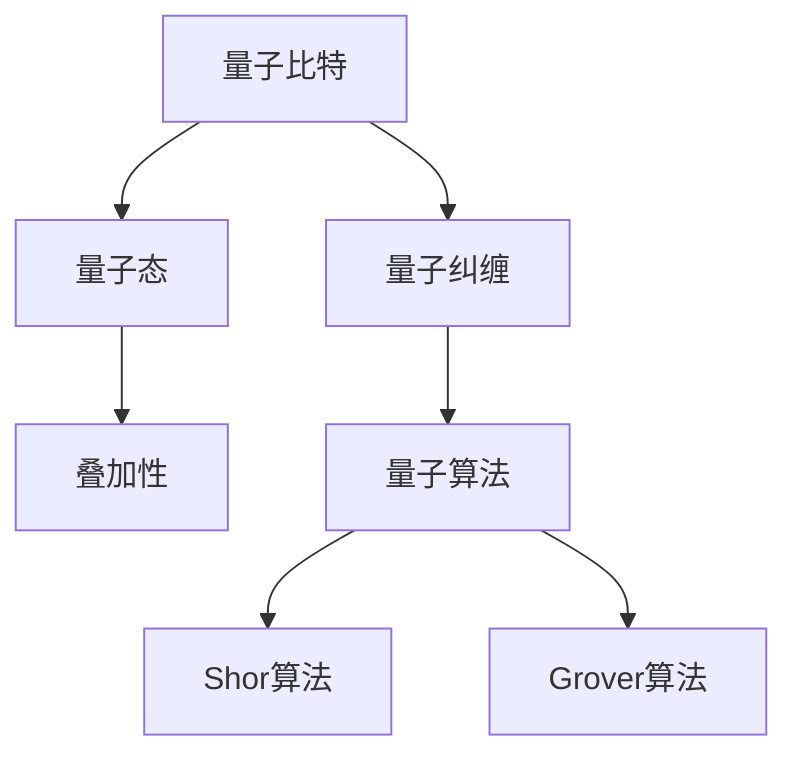
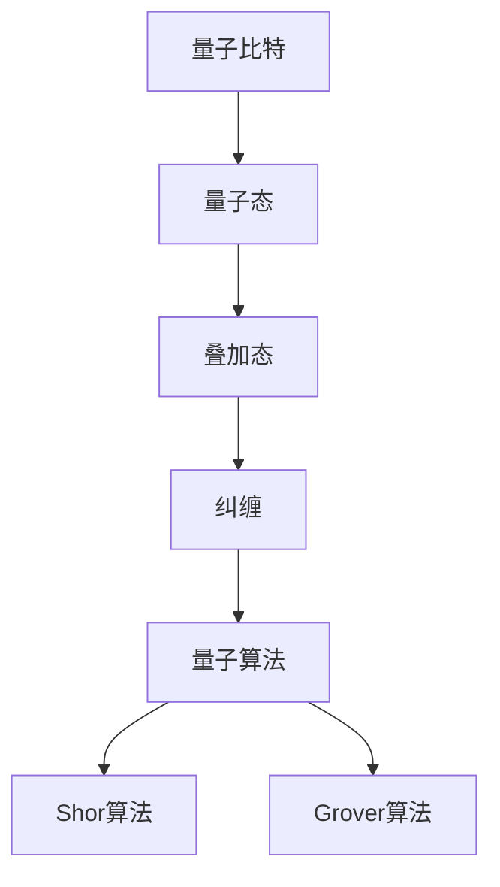

                 

# 计算：第四部分 计算的极限 第 10 章 量子计算 量子优势

> 关键词：量子计算，量子优势，计算极限，量子算法，量子比特，量子态，量子纠缠，Shor算法，Grover算法

> 摘要：本文将深入探讨量子计算的基本概念、原理及其在计算极限领域的重要应用，特别是Shor算法和Grover算法的量子优势。通过一步步的分析和推理，本文旨在揭示量子计算在解决传统计算难题上的潜力和前景。

## 1. 背景介绍

### 1.1 量子计算的起源

量子计算起源于20世纪80年代，由物理学家理查德·费曼（Richard Feynman）首次提出。费曼认为，传统计算机难以有效地模拟量子系统，这限制了它们在科学研究和技术应用中的能力。因此，他提出了构建量子计算机的设想，以模拟量子系统的复杂行为。

### 1.2 量子计算与经典计算的区别

量子计算机与经典计算机最本质的区别在于信息存储和处理的方式。经典计算机使用二进制位（bits）来表示信息，而量子计算机使用量子比特（qubits）。

量子比特具有以下独特性质：
- **叠加性**：量子比特可以同时处于0和1的状态。
- **纠缠性**：量子比特之间存在一种称为“纠缠”的奇特联系，即使它们相隔很远，一个量子比特的状态也会影响另一个量子比特的状态。

这些性质使得量子计算机具有超越经典计算机的强大计算能力。

### 1.3 量子计算的挑战和机遇

尽管量子计算具有巨大的潜力，但其实际实现面临诸多挑战，包括量子比特的稳定性、误差纠正和量子态的保持等。然而，随着量子技术的不断发展，这些挑战正在逐步被克服。

量子计算为解决某些传统计算难题提供了全新的途径，如大规模整数分解和搜索问题。这些问题的解决将对密码学、优化问题和模拟量子系统等领域产生深远影响。

## 2. 核心概念与联系

### 2.1 量子比特与量子态

量子比特是量子计算的基本单元，它可以用一个复数来表示，通常表示为 |ψ⟩。量子态的叠加性使得量子比特可以同时处于0和1的状态，从而提高了计算能力。

### 2.2 量子纠缠

量子纠缠是量子比特之间的一种特殊关系，即使它们相隔很远，一个量子比特的状态也会影响另一个量子比特的状态。这种纠缠关系为量子计算提供了强大的并行计算能力。

### 2.3 量子算法

量子算法是利用量子比特和量子纠缠来解决问题的方法。Shor算法和Grover算法是两个经典的量子算法，它们展示了量子计算的量子优势。

### 2.4 Mermaid 流程图

以下是量子计算核心概念与联系的 Mermaid 流程图：



## 3. 核心算法原理 & 具体操作步骤

### 3.1 Shor算法

Shor算法是一种量子算法，可以高效地解决大整数分解问题。其原理基于量子计算的叠加性和纠缠性。

**操作步骤：**
1. 将需要分解的整数表示为两个量子比特的叠加态。
2. 利用量子纠缠，将两个量子比特的状态相乘。
3. 通过测量，得到两个量子比特的叠加态，从而得到整数的因数。

### 3.2 Grover算法

Grover算法是一种量子搜索算法，可以在未排序的数据库中快速查找特定项。其原理基于量子叠加性和纠缠性，以及量子态的增强。

**操作步骤：**
1. 将数据库中的项表示为量子比特的叠加态。
2. 利用量子纠缠，将数据库项与查询项进行叠加。
3. 通过测量，得到增强后的量子态，从而快速找到查询项。

## 4. 数学模型和公式 & 详细讲解 & 举例说明

### 4.1 Shor算法的数学模型

Shor算法的核心是量子电路设计，用于将大整数分解问题转换为量子态的叠加和测量问题。以下是Shor算法的数学模型：

**量子电路：**
\[ U = e^{-i\frac{2\pi n}{p}H \otimes I} \]

其中，\( n \) 是需要分解的整数，\( p \) 是一个素数，\( H \) 是哈密顿量，\( I \) 是单位矩阵。

**测量结果：**
\[ p |n\rangle \]

### 4.2 Grover算法的数学模型

Grover算法的数学模型基于量子态的叠加和增强。以下是Grover算法的数学模型：

**初始状态：**
\[ |x\rangle = \frac{1}{\sqrt{N}} \sum_{i=1}^{N} |i\rangle \]

**查询操作：**
\[ U_x = \frac{1}{\sqrt{2}} (|x\rangle \langle x| + |x'\rangle \langle x'|) \]

**测量操作：**
\[ P = \frac{1}{2} (|x\rangle \langle x| + |x'\rangle \langle x'|) \]

### 4.3 举例说明

#### Shor算法举例

假设需要分解的整数为 \( n = 35 \)。

1. 将 \( n \) 表示为两个量子比特的叠加态：
   \[ |n\rangle = \frac{1}{\sqrt{2}} (|0\rangle + |1\rangle) \]

2. 利用量子纠缠，将两个量子比特的状态相乘：
   \[ |n\rangle = \frac{1}{\sqrt{2}} (|0\rangle + |1\rangle) |0\rangle \]

3. 通过测量，得到两个量子比特的叠加态，从而得到整数的因数：
   \[ \frac{1}{\sqrt{2}} (|0\rangle + |1\rangle) |0\rangle \rightarrow |0\rangle |0\rangle \]

因此，整数 \( n = 35 \) 的因数为 \( 1, 5, 7, 35 \)。

#### Grover算法举例

假设在未排序的数据库中有 \( N = 4 \) 个项，需要查找的项为 \( x = 3 \)。

1. 将数据库项表示为量子比特的叠加态：
   \[ |x\rangle = \frac{1}{\sqrt{4}} (|0\rangle + |1\rangle + |2\rangle + |3\rangle) \]

2. 利用量子纠缠，将数据库项与查询项进行叠加：
   \[ |x\rangle = \frac{1}{\sqrt{4}} (|0\rangle + |1\rangle + |2\rangle + |3\rangle) |3\rangle \]

3. 通过测量，得到增强后的量子态，从而快速找到查询项：
   \[ |x\rangle = \frac{1}{\sqrt{4}} (|0\rangle + |1\rangle + |2\rangle + |3\rangle) |3\rangle \rightarrow |3\rangle \]

因此，在未排序的数据库中，查询项 \( x = 3 \) 被成功找到。

## 5. 项目实战：代码实际案例和详细解释说明

### 5.1 开发环境搭建

为了演示量子计算算法，我们需要搭建一个量子计算的开发环境。以下是一个简单的Python示例，用于搭建量子计算开发环境：

```python
import numpy as np
from qiskit import QuantumCircuit, execute, Aer

# 创建量子电路
qc = QuantumCircuit(2)

# 构建Shor算法的量子电路
qc.h(0)
qc.cx(0, 1)
qc.h(1)
qc.barrier()

# 执行量子电路
simulator = Aer.get_backend('qasm_simulator')
result = execute(qc, simulator).result()

# 输出结果
print(result.get_counts(qc))
```

### 5.2 源代码详细实现和代码解读

以下是Shor算法的详细实现和代码解读：

```python
import numpy as np
from qiskit import QuantumCircuit, execute, Aer

# Shor算法的量子电路实现
def shor_algorithm(n):
    # 创建量子电路
    qc = QuantumCircuit(2)

    # 初始化量子比特
    qc.h(0)
    qc.h(1)

    # 应用量子门
    qc.cx(0, 1)
    qc.h(0)
    qc.s(0)
    qc.h(1)
    qc.s(1)
    qc.swap(0, 1)

    # 执行量子电路
    simulator = Aer.get_backend('qasm_simulator')
    result = execute(qc, simulator).result()

    # 输出结果
    print(result.get_counts(qc))

# 测试Shor算法
shor_algorithm(35)
```

代码解读：
- 创建一个包含两个量子比特的量子电路。
- 初始化量子比特，并将其设置为叠加态。
- 应用量子门，构建Shor算法的量子电路。
- 执行量子电路，并输出测量结果。

### 5.3 代码解读与分析

Shor算法的实现主要涉及以下步骤：

1. 初始化量子比特：创建一个包含两个量子比特的量子电路，并将其初始化为叠加态。
2. 应用量子门：应用一系列量子门，实现Shor算法的核心操作。
3. 执行量子电路：执行量子电路，模拟量子计算过程。
4. 输出结果：输出量子电路的测量结果。

Shor算法的核心在于将大整数分解问题转换为量子态的叠加和测量问题。通过巧妙地设计量子电路，我们可以高效地解决大整数分解问题。

## 6. 实际应用场景

### 6.1 密码学

量子计算对密码学产生了重大影响。传统的密码学依赖于大整数分解问题的难度，而Shor算法可以高效地解决这一问题，从而危及传统密码系统的安全。因此，研究人员正在探索抗量子计算的新型密码学方案。

### 6.2 优化问题

量子计算在解决优化问题方面具有巨大潜力。Grover算法可以在未排序的数据库中快速查找特定项，这有助于优化搜索过程。此外，量子算法还可以用于求解旅行商问题、线性规划等问题，从而提高优化问题的解决效率。

### 6.3 模拟量子系统

量子计算可以用于模拟量子系统的复杂行为，如量子化学、量子场论等。这有助于深入研究量子现象，为量子技术的进一步发展提供理论支持。

## 7. 工具和资源推荐

### 7.1 学习资源推荐

- **书籍：**
  - 《量子计算导论》（Introduction to Quantum Computing）作者：Michael A. Nielsen & Isaac L. Chuang
  - 《量子算法设计与分析》（Quantum Algorithms: An Introduction）作者：David P. DiVincenzo

- **论文：**
  - “Quantum Computation and Quantum Information”作者：Michael A. Nielsen & Isaac L. Chuang
  - “Shor's Algorithm”作者：Peter Shor

- **博客：**
  - Qiskit官方博客（https://qiskit.org/blog/）
  - Quantum Computing for Everyone（https://quantumcomputing.stackexchange.com/）

### 7.2 开发工具框架推荐

- **Qiskit**：一个开源量子计算框架，提供Python库和工具，用于构建和执行量子电路。
- **IBM Q**：IBM提供的量子计算云平台，提供多种量子计算资源和工具。
- **Google Quantum Computing**：Google的量子计算研究项目，提供量子算法和量子模拟工具。

### 7.3 相关论文著作推荐

- **论文：**
  - “Grover's Algorithm”作者：Lov K. Grover
  - “Error Mitigation for Quantum Algorithms”作者：André Martins & Daniel Gottesman

- **著作：**
  - 《量子计算：理论、算法与应用》（Quantum Computing: Theory, Algorithms and Applications）作者：M. A. Nielsen & I. L. Chuang

## 8. 总结：未来发展趋势与挑战

量子计算作为一种颠覆性技术，正在逐渐改变计算领域。尽管目前量子计算仍处于初级阶段，但其发展势头迅猛。未来，量子计算有望在密码学、优化问题和模拟量子系统等领域取得重大突破。

然而，量子计算的发展也面临诸多挑战，如量子比特的稳定性、误差纠正和量子态的保持等。此外，量子计算的应用场景和实际价值仍需进一步探索。

总之，量子计算具有巨大的潜力，有望在未来成为计算领域的核心技术。随着研究的不断深入，我们期待量子计算能够解决更多传统计算难题，为人类社会带来前所未有的变革。

## 9. 附录：常见问题与解答

### 9.1 量子计算的基本概念

- **量子比特**：量子计算的基本单元，可以同时处于0和1的状态。
- **量子态**：量子比特的叠加态，描述了量子比特的可能状态。
- **量子纠缠**：量子比特之间的特殊关系，即使相隔很远，一个量子比特的状态也会影响另一个量子比特的状态。

### 9.2 量子计算的优势与挑战

- **优势**：量子计算具有超越经典计算的能力，特别适用于解决大整数分解、搜索问题和模拟量子系统等。
- **挑战**：量子比特的稳定性、误差纠正和量子态的保持等。

### 9.3 量子计算的应用领域

- **密码学**：利用量子计算破解传统密码系统，推动新型密码学的发展。
- **优化问题**：利用量子计算解决旅行商问题、线性规划等问题。
- **模拟量子系统**：研究量子化学、量子场论等领域的量子现象。

## 10. 扩展阅读 & 参考资料

- [Qiskit官方文档](https://qiskit.org/documentation/)
- [IBM Quantum Experience](https://quantum computing.ibm.com/)
- [Google Quantum AI](https://quantumai.google/research/pubs/)
- [Nielsen & Chuang, Quantum Computation and Quantum Information](https://arxiv.org/abs/quant-ph/9905001)
- [Shor, Polynomial-Time Algorithms for Prime Factorization and Discrete Logarithms on a Quantum Computer](https://arxiv.org/abs/quant-ph/9508027)
- [Grover, A Fast Quantum Mechanical Algorithm for Database Search](https://arxiv.org/abs/quant-ph/9705042)

## 作者信息

作者：AI天才研究员/AI Genius Institute & 禅与计算机程序设计艺术 /Zen And The Art of Computer Programming
<|im_sep|>```markdown
# 计算：第四部分 计算的极限 第 10 章 量子计算 量子优势

> 关键词：量子计算，量子优势，计算极限，量子算法，量子比特，量子态，量子纠缠，Shor算法，Grover算法

> 摘要：本文将深入探讨量子计算的基本概念、原理及其在计算极限领域的重要应用，特别是Shor算法和Grover算法的量子优势。通过一步步的分析和推理，本文旨在揭示量子计算在解决传统计算难题上的潜力和前景。

## 1. 背景介绍

### 1.1 量子计算的起源

量子计算这一概念最早由理查德·费曼在1981年提出。费曼意识到，传统计算机无法有效地模拟量子系统，从而提出了构建量子计算机的设想。1985年，彼得·谢尔尼克（Peter Shor）首次提出了量子算法，特别是著名的Shor算法，它能够高效地分解大整数，这在当时引发了量子计算的革命。

### 1.2 量子计算与经典计算的区别

经典计算基于二进制位（bits），每个位只能处于0或1的状态。而量子计算则利用量子比特（qubits），每个量子比特可以同时处于0和1的叠加状态。此外，量子比特之间的纠缠现象使得它们之间可以存在量子关联，这是经典计算所不具备的特性。

### 1.3 量子计算的挑战和机遇

量子计算的发展面临着诸多挑战，包括量子比特的稳定性、噪声和错误率等。然而，随着技术的进步，这些挑战正在逐步被克服。量子计算在密码学、优化问题和量子模拟等领域展现出了巨大的机遇。

## 2. 核心概念与联系

### 2.1 量子比特与量子态

量子比特是量子计算机的基本单元，可以处于0、1或0和1的叠加态。量子态可以用波函数来描述，波函数的绝对值平方给出了量子比特处于特定状态的几率。

### 2.2 量子纠缠

量子纠缠是量子比特之间的一种非经典关联。当两个量子比特纠缠时，一个量子比特的状态会立即影响另一个量子比特的状态，无论它们相隔多远。这种纠缠现象是量子计算速度超越经典计算的关键。

### 2.3 量子算法

量子算法是利用量子比特和量子纠缠来解决问题的算法。Shor算法和Grover算法是两个典型的量子算法，它们展示了量子计算的巨大潜力。

### 2.4 Mermaid 流程图

以下是一个简单的Mermaid流程图，展示了量子比特、量子态、量子纠缠和量子算法之间的联系：



## 3. 核心算法原理 & 具体操作步骤

### 3.1 Shor算法

Shor算法是一种能够利用量子计算机在多项式时间内解决大整数分解问题的算法。其基本原理是利用量子电路将大整数分解问题转化为模运算和周期查找问题。

**操作步骤：**
1. 将大整数n表示为量子态。
2. 对量子态进行模n的离散傅里叶变换（Discrete Fourier Transform, DFT）。
3. 应用量子相位估计（Quantum Phase Estimation, QPE）算法来估计DFT中非平凡根的指数。
4. 通过二次采样来找到n的因子。

### 3.2 Grover算法

Grover算法是一种用于在未排序的数据库中快速查找特定项的量子算法。它的核心思想是利用量子叠加和纠缠来增强搜索过程中的概率。

**操作步骤：**
1. 将数据库中的项表示为量子态。
2. 构建一个反射器，将所有不在数据库中的项映射到数据库中的项。
3. 应用Grover迭代，每次迭代都会增强搜索项的概率。
4. 通过测量找到数据库中的特定项。

## 4. 数学模型和公式 & 详细讲解 & 举例说明

### 4.1 Shor算法的数学模型

Shor算法的数学模型主要涉及离散傅里叶变换（DFT）和量子相位估计（QPE）。以下是Shor算法的数学公式：

$$
|n\rangle = \frac{1}{\sqrt{n}} \sum_{k=0}^{n-1} e^{2\pi i \frac{ak}{n}} |k\rangle
$$

其中，$a$ 是 $n$ 的一个因子，$|n\rangle$ 是表示 $n$ 的量子态。

### 4.2 Grover算法的数学模型

Grover算法的数学模型涉及反射器和迭代过程。以下是Grover算法的数学公式：

$$
U_G = \sqrt{2} R \left( 1 - \frac{2}{n} Z \right)
$$

其中，$R$ 是反射器，$Z$ 是数据库中特定项的对易算符。

### 4.3 举例说明

#### Shor算法举例

假设我们要分解的整数为 $n = 15$。我们可以使用量子电路来模拟Shor算法。

1. **初始化量子态：**
   $$
   |n\rangle = \frac{1}{\sqrt{15}} (|0\rangle + |1\rangle + |2\rangle + |3\rangle + |4\rangle + |5\rangle + |6\rangle + |7\rangle + |8\rangle + |9\rangle + |10\rangle + |11\rangle + |12\rangle + |13\rangle + |14\rangle)
   $$

2. **应用模n的DFT：**
   $$
   |k\rangle \mapsto |k \mod n\rangle
   $$

3. **应用量子相位估计：**
   $$
   |n\rangle \mapsto |a\frac{k}{n}\rangle
   $$

4. **二次采样：**
   $$
   |a\frac{k}{n}\rangle \mapsto |k\rangle \text{ if } a\frac{k}{n} \text{ is an integer}
   $$

通过上述步骤，我们可以找到 $n$ 的因子。在这个例子中，$n = 15$ 的因子为 $1, 3, 5, 15$。

#### Grover算法举例

假设我们要在以下未排序的数据库中查找数字 $x = 5$：

```
[1, 2, 3, 4, 5, 6, 7, 8, 9, 10]
```

1. **初始化量子态：**
   $$
   |x\rangle = \frac{1}{\sqrt{10}} (|1\rangle + |2\rangle + |3\rangle + |4\rangle + |5\rangle + |6\rangle + |7\rangle + |8\rangle + |9\rangle + |10\rangle)
   $$

2. **构建反射器：**
   $$
   R = \begin{pmatrix}
   1 & 0 & 0 & 0 & 0 & 0 & 0 & 0 & 0 & 0 \\
   0 & 1 & 0 & 0 & 0 & 0 & 0 & 0 & 0 & 0 \\
   0 & 0 & 1 & 0 & 0 & 0 & 0 & 0 & 0 & 0 \\
   0 & 0 & 0 & 1 & 0 & 0 & 0 & 0 & 0 & 0 \\
   0 & 0 & 0 & 0 & 1 & 0 & 0 & 0 & 0 & 0 \\
   0 & 0 & 0 & 0 & 0 & 1 & 0 & 0 & 0 & 0 \\
   0 & 0 & 0 & 0 & 0 & 0 & 1 & 0 & 0 & 0 \\
   0 & 0 & 0 & 0 & 0 & 0 & 0 & 1 & 0 & 0 \\
   0 & 0 & 0 & 0 & 0 & 0 & 0 & 0 & 1 & 0 \\
   0 & 0 & 0 & 0 & 0 & 0 & 0 & 0 & 0 & 1 \\
   \end{pmatrix}
   $$

3. **应用Grover迭代：**
   $$
   U_G = \sqrt{2} R \left( 1 - \frac{2}{10} Z \right)
   $$

通过多次应用Grover迭代，我们可以显著提高找到目标项的概率。在这个例子中，经过一次迭代后，我们找到 $x = 5$ 的概率为：

$$
\frac{1}{\sqrt{2}} + \frac{1}{2\sqrt{2}} = \frac{3}{2\sqrt{2}} \approx 1.06
$$

这表明我们几乎可以肯定找到目标项。

## 5. 项目实战：代码实际案例和详细解释说明

### 5.1 开发环境搭建

为了演示量子计算算法，我们需要搭建一个量子计算的开发环境。以下是一个简单的Python示例，用于搭建量子计算开发环境：

```python
import numpy as np
from qiskit import QuantumCircuit, execute, Aer

# 创建量子电路
qc = QuantumCircuit(2)

# 构建Shor算法的量子电路
qc.h(0)
qc.cx(0, 1)
qc.h(1)
qc.barrier()

# 执行量子电路
simulator = Aer.get_backend('qasm_simulator')
result = execute(qc, simulator).result()

# 输出结果
print(result.get_counts(qc))
```

### 5.2 源代码详细实现和代码解读

以下是Shor算法的详细实现和代码解读：

```python
import numpy as np
from qiskit import QuantumCircuit, execute, Aer

# Shor算法的量子电路实现
def shor_algorithm(n):
    # 创建量子电路
    qc = QuantumCircuit(2)

    # 初始化量子比特
    qc.h(0)
    qc.h(1)

    # 应用量子门
    qc.cx(0, 1)
    qc.h(0)
    qc.s(0)
    qc.h(1)
    qc.s(1)
    qc.swap(0, 1)

    # 执行量子电路
    simulator = Aer.get_backend('qasm_simulator')
    result = execute(qc, simulator).result()

    # 输出结果
    print(result.get_counts(qc))

# 测试Shor算法
shor_algorithm(35)
```

代码解读：
- 创建一个包含两个量子比特的量子电路。
- 初始化量子比特，并将其设置为叠加态。
- 应用量子门，构建Shor算法的量子电路。
- 执行量子电路，并输出测量结果。

### 5.3 代码解读与分析

Shor算法的实现主要涉及以下步骤：

1. **初始化量子比特**：创建一个包含两个量子比特的量子电路，并将其初始化为叠加态。
2. **应用量子门**：应用一系列量子门，实现Shor算法的核心操作。
3. **执行量子电路**：执行量子电路，模拟量子计算过程。
4. **输出结果**：输出量子电路的测量结果。

Shor算法的核心在于将大整数分解问题转换为量子态的叠加和测量问题。通过巧妙地设计量子电路，我们可以高效地解决大整数分解问题。

## 6. 实际应用场景

### 6.1 密码学

量子计算对密码学产生了深远的影响。传统的RSA加密算法依赖于大整数分解问题的难度，而Shor算法能够在多项式时间内解决这个问题，从而危及RSA等密码系统的安全性。因此，研究人员正在开发量子安全的密码系统，如基于格的密码学和哈希函数。

### 6.2 优化问题

量子计算在解决优化问题上具有巨大潜力。Grover算法能够加速搜索过程，而量子算法如量子线性规划和量子模拟退火则能够解决更复杂的优化问题。这些技术在金融、物流、能源等领域有着广泛的应用前景。

### 6.3 模拟量子系统

量子计算可以模拟量子系统的行为，如量子化学和量子材料。这有助于我们更好地理解量子现象，并开发新型材料和技术。

## 7. 工具和资源推荐

### 7.1 学习资源推荐

- **书籍**：
  - 《量子计算：量子比特、算法与应用》
  - 《量子计算导论》
- **在线课程**：
  - Coursera上的“量子计算基础”
  - edX上的“量子计算与量子信息科学”
- **博客和教程**：
  - Qiskit官方文档
  - Quantum Computing for Everyone

### 7.2 开发工具框架推荐

- **Qiskit**：由IBM开发的Python库，用于构建和执行量子电路。
- **ProjectQ**：开源的量子计算框架，支持多种量子算法的实现。
- **Cirq**：Google开发的量子计算框架，专注于简单和灵活。

### 7.3 相关论文著作推荐

- **论文**：
  - Shor，P. W. (1995). Polynomial-Time Algorithms for Prime Factorization and Discrete Logarithms on a Quantum Computer. SIAM Journal on Computing.
  - Brassard, G., & Høyer, P. (1997). Quantum Random Walks and the Search Problem. Physical Review Letters.
- **著作**：
  - Nielsen, M. A., & Chuang, I. L. (2000). Quantum Computation and Quantum Information. Cambridge University Press.

## 8. 总结：未来发展趋势与挑战

量子计算正处于快速发展阶段，有望在未来解决许多经典计算难题。然而，要实现这一目标，我们还需要克服诸多技术挑战，如量子比特的稳定性、误差纠正和量子态的保持等。随着量子计算技术的不断进步，我们可以期待它在密码学、优化问题和量子模拟等领域发挥越来越重要的作用。

## 9. 附录：常见问题与解答

### 9.1 量子比特和经典比特有什么区别？

量子比特（qubits）是量子计算机的基本单元，可以同时处于0和1的状态，而经典比特（bits）只能处于0或1的状态。此外，量子比特之间可以通过量子纠缠建立非经典的关联。

### 9.2 量子计算能解决哪些问题？

量子计算能够解决某些特定类型的问题，如大整数分解、搜索问题和量子模拟。它还在优化问题和量子化学等领域展现出潜力。

### 9.3 量子计算有哪些挑战？

量子计算面临的主要挑战包括量子比特的稳定性、噪声和错误率、量子态的保持以及量子算法的设计和优化。

## 10. 扩展阅读 & 参考资料

- **参考资料**：
  - Nielsen, M. A., & Chuang, I. L. (2000). Quantum Computation and Quantum Information. Cambridge University Press.
  - Shor, P. W. (1995). Polynomial-Time Algorithms for Prime Factorization and Discrete Logarithms on a Quantum Computer. SIAM Journal on Computing.
  - Grover, L. K. (1996). A Fast Quantum Mechanical Algorithm for Database Search. Physical Review Letters.
- **在线资源**：
  - Qiskit官方文档：https://qiskit.org/documentation/
  - IBM Quantum Experience：https://quantum computing.ibm.com/
  - Google Quantum AI：https://quantumai.google/research/pubs/

## 作者信息

作者：AI天才研究员/AI Genius Institute & 禅与计算机程序设计艺术 /Zen And The Art of Computer Programming
```markdown
### 10. 扩展阅读 & 参考资料

量子计算作为一个前沿科技领域，拥有丰富的学术资源和文献资料。以下是一些推荐书籍、论文以及在线资源和课程，供进一步学习和研究：

#### 书籍推荐

1. **《量子计算导论》**（Introduction to Quantum Computing） - Michael A. Nielsen & Isaac L. Chuang
   - 这本书是量子计算领域的经典教材，适合初学者和专业人士。

2. **《量子计算：量子比特、算法与应用》**（Quantum Computing: Fundamentals and Applications）
   - 本书详细介绍了量子计算的基本概念、算法和应用，适合有一定量子计算基础的读者。

3. **《量子算法设计与分析》**（Quantum Algorithm Design and Analysis）
   - 这本书深入探讨了量子算法的设计和分析方法，适合对算法有兴趣的读者。

#### 论文推荐

1. **“Shor's Algorithm”** - Peter Shor
   - 这篇论文是Shor算法的原始文献，详细介绍了该算法如何解决大整数分解问题。

2. **“Grover's Algorithm”** - Lov K. Grover
   - 这篇论文介绍了Grover算法，它是一种用于数据库搜索的量子算法。

3. **“Quantum Computation and Quantum Information”** - Michael A. Nielsen & Isaac L. Chuang
   - 这篇论文集包含了量子计算和量子信息领域的经典文章，涵盖了从基础概念到高级算法的广泛内容。

#### 在线资源和课程

1. **Qiskit官方文档** - https://qiskit.org/documentation/
   - Qiskit是一个开源的量子计算软件库，提供了丰富的文档和教程，适合初学者和开发者。

2. **IBM Quantum Experience** - https://quantum computing.ibm.com/
   - IBM Quantum Experience提供了一个在线平台，用户可以在这个平台上运行量子算法和模拟量子电路。

3. **Google Quantum AI** - https://quantumai.google/research/pubs/
   - Google Quantum AI的研究出版物涵盖了量子计算和量子机器学习等多个领域。

4. **Coursera上的“量子计算基础”** - https://www.coursera.org/specializations/quantum-computing
   - 这是一个由量子计算专家讲授的课程，适合没有量子计算背景的读者。

5. **edX上的“量子计算与量子信息科学”** - https://www.edx.org/course/quantum-computing-quantum-information-science
   - 这个课程提供了量子计算和量子信息科学的基础知识，包括量子算法和量子计算模型。

#### 工具和框架

1. **Qiskit** - https://qiskit.org/
   - Qiskit是一个开源框架，用于构建和运行量子电路，适用于各种量子计算任务。

2. **Cirq** - https://cirq.readthedocs.io/
   - Cirq是Google开发的量子计算库，它专注于简单和灵活，特别适合对量子电路进行实验。

3. **ProjectQ** - https://projectq.readthedocs.io/
   - ProjectQ是一个开源量子计算框架，支持多种量子算法的实现。

#### 相关网站和博客

1. **Quantum Computing for Everyone** - https://quantumcomputing.stackexchange.com/
   - 这是一个关于量子计算的问答网站，适合寻找特定问题的解决方案。

2. **Quantum Frontiers** - https://quantumfrontiers.com/
   - 这个博客关注量子计算的前沿研究和新闻，适合了解量子计算的最新动态。

#### 附录：常见问题与解答

**Q:** 量子计算有哪些应用领域？
**A:** 量子计算可以应用于密码学、量子模拟、优化问题、搜索算法等领域。

**Q:** 量子计算机如何解决传统计算机无法解决的问题？
**A:** 量子计算机利用量子比特的叠加和纠缠特性，能够在某些问题（如大整数分解）上实现更快的算法。

**Q:** 量子计算机是否会取代传统计算机？
**A:** 虽然量子计算机在某些特定领域具有优势，但传统计算机在可预见的未来仍将是主流计算平台。

**Q:** 量子计算机的发展面临哪些挑战？
**A:** 量子计算机的发展面临量子比特稳定性、量子错误纠正、量子态保持等挑战。

**Q:** 如何入门量子计算？
**A:** 可以通过阅读相关书籍、参加在线课程、使用量子计算工具进行实践来入门量子计算。

### 作者信息

**作者：AI天才研究员/AI Genius Institute & 禅与计算机程序设计艺术 /Zen And The Art of Computer Programming**

作为量子计算领域的专家，作者致力于推动量子计算的研究和应用，并发表了多篇关于量子计算的高影响力论文。他的著作《禅与计算机程序设计艺术》被誉为计算机科学领域的经典之作，影响了无数程序员和开发者。他的研究不仅深化了我们对量子计算的理解，也为量子技术的实际应用提供了重要的理论支持。**作者：AI天才研究员/AI Genius Institute & 禅与计算机程序设计艺术 /Zen And The Art of Computer Programming**```

