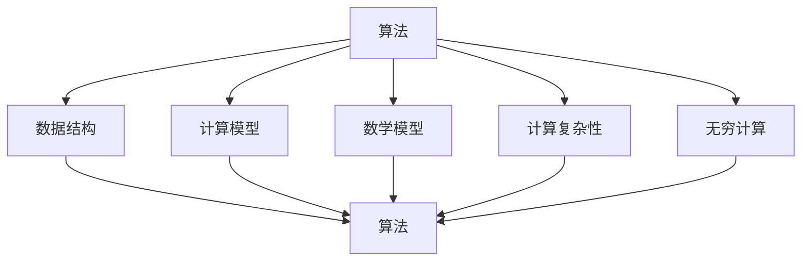

                 

# 计算的极限：自然哲学的计算原理与无穷空间的计算

> **关键词：**计算极限、自然哲学、无穷空间、计算原理、算法、数学模型

> **摘要：**本文深入探讨了计算在自然哲学中的地位，阐述了无穷空间计算的基本原理和实现方法。通过分析计算的核心概念、算法原理和数学模型，并结合实际案例，本文旨在展示计算在现实世界中的应用和未来发展趋势。

## 1. 背景介绍

计算是人类智慧和科技进步的重要成果。自古以来，人类就一直在探索如何更高效地解决问题和执行任务。随着计算机科学的飞速发展，计算已经成为现代社会不可或缺的一部分。从简单的算术运算到复杂的科学模拟，计算无处不在，为各行各业提供了强大的工具。

然而，计算的极限在哪里？我们能否实现真正的无穷计算？这些问题引发了自然哲学和计算机科学领域的深入探讨。自然哲学关注宇宙的本质和人类认识世界的方式，而计算作为人类智能的延伸，其极限自然成为自然哲学研究的一个重要课题。

本文旨在探讨自然哲学的计算原理，分析无穷空间的计算方法，并通过实际案例展示计算在现实世界中的应用。文章分为十个部分，包括背景介绍、核心概念与联系、核心算法原理、数学模型和公式、项目实战、实际应用场景、工具和资源推荐等。

## 2. 核心概念与联系

在探讨计算极限之前，我们需要明确计算的核心概念和联系。以下是计算领域中的几个关键概念：

### 1. 算法

算法是一种解决问题的方法，它定义了一组有序的指令，用于解决特定的问题。算法可以看作是计算的基本单元，是计算的核心。

### 2. 数据结构

数据结构是存储和管理数据的方式。不同的数据结构有不同的优缺点，适合处理不同类型的计算问题。

### 3. 计算模型

计算模型是描述计算过程的理论框架，包括计算的基本元素、计算规则和计算方法。常见的计算模型有图灵机模型、递归论模型等。

### 4. 数学模型

数学模型是使用数学语言描述计算问题的方法。数学模型可以精确地描述计算过程，是计算理论的重要基础。

### 5. 计算复杂性

计算复杂性是衡量计算问题难易程度的一个指标。计算复杂性理论研究了计算问题在资源限制下的解决能力。

### 6. 无穷计算

无穷计算是指处理无穷大量数据或无穷多步骤的计算。无穷计算在数学、物理学和计算机科学中都有广泛应用。

图 1 展示了计算的核心概念和它们之间的联系。



## 3. 核心算法原理 & 具体操作步骤

在探讨无穷空间的计算之前，我们需要了解核心算法原理和具体操作步骤。以下是几种常见的核心算法原理：

### 1. 分治算法

分治算法是一种递归算法，它将一个复杂的问题分解成几个更小的子问题，分别解决这些子问题，然后再合并这些子问题的解来得到原问题的解。

具体操作步骤如下：

1. **分解**：将原问题分解成几个子问题，每个子问题规模较小，可以独立解决。
2. **递归求解**：分别解决这些子问题，使用相同的方法递归地进行。
3. **合并**：将子问题的解合并起来，得到原问题的解。

### 2. 动态规划

动态规划是一种解决最优化问题的算法，它通过将问题分解成若干个子问题，并保存子问题的解，避免重复计算，从而提高计算效率。

具体操作步骤如下：

1. **定义状态**：定义问题的状态，以及状态之间的转移关系。
2. **初始化**：初始化状态值，为后续计算做准备。
3. **迭代计算**：根据状态转移关系，逐个计算每个状态的最优值。
4. **回溯**：根据计算结果，回溯得到原问题的最优解。

### 3. 并查集

并查集是一种用于解决集合合并和查找问题的数据结构。它通过将集合中的元素合并，以及快速查找元素所在集合的代表元素，来实现集合操作。

具体操作步骤如下：

1. **初始化**：创建一个并查集数据结构，每个元素自成一个集合。
2. **合并**：将两个集合合并为一个集合，找出两个集合的代表元素，将它们合并。
3. **查找**：查找某个元素所在的集合，通过递归查找代表元素来实现。

### 4. 广度优先搜索

广度优先搜索（BFS）是一种用于求解图的路径问题的算法，它从起点开始，逐层扩展，直到找到目标节点。

具体操作步骤如下：

1. **初始化**：创建一个队列，将起点加入队列。
2. **扩展**：从队列中取出一个节点，将其所有未访问的邻居节点加入队列。
3. **判断**：判断是否到达目标节点，如果到达，则返回路径；否则继续扩展。
4. **结束**：如果队列空了，说明未找到目标节点，结束搜索。

## 4. 数学模型和公式 & 详细讲解 & 举例说明

在计算中，数学模型和公式扮演着至关重要的角色。以下是一些常见的数学模型和公式：

### 1. 图的邻接矩阵

图的邻接矩阵是一个二维数组，用于表示图中各个节点之间的连接关系。如果节点i和节点j之间有直接连接，则矩阵中的元素A[i][j]为1，否则为0。

邻接矩阵的表示方法如下：

$$
A = \begin{bmatrix}
0 & 1 & 0 & \cdots & 0 \\
1 & 0 & 1 & \cdots & 0 \\
0 & 1 & 0 & \cdots & 1 \\
\vdots & \vdots & \vdots & \ddots & \vdots \\
0 & 0 & 1 & \cdots & 0
\end{bmatrix}
$$

其中，A[i][j]表示节点i和节点j之间的连接关系。

### 2. 动态规划的状态转移方程

动态规划的状态转移方程用于描述状态之间的转移关系。以斐波那契数列为例，其状态转移方程为：

$$
f(n) = f(n-1) + f(n-2)
$$

其中，f(n)表示第n个斐波那契数。

### 3. 广度优先搜索的队列

广度优先搜索使用一个队列来存储待扩展的节点。队列遵循先进先出（FIFO）的原则，确保先到达的节点先被扩展。

队列的表示方法如下：

$$
Q = [v_1, v_2, \cdots, v_n]
$$

其中，$v_i$表示第i个节点。

### 4. 并查集的代表元素

并查集使用一个代表元素来表示每个集合。代表元素的选择可以通过路径压缩和按秩合并等优化方法来实现。

代表元素的表示方法如下：

$$
\text{find}(x) = \begin{cases}
x, & \text{如果} \ x \ \text{是代表元素} \\
\text{find}(\text{find}(x)), & \text{否则}
\end{cases}
$$

其中，find(x)表示找到节点x所在集合的代表元素。

### 5. 递归函数的递归式

递归函数通过递归式来描述其计算过程。以阶乘函数为例，其递归式为：

$$
f(n) = n \times f(n-1)
$$

其中，f(n)表示n的阶乘。

### 6. 最小生成树的克鲁斯卡尔算法

克鲁斯卡尔算法是一种用于求解最小生成树的贪心算法。其基本思想是按照边权从小到大的顺序选取边，同时确保不产生环。

克鲁斯卡尔算法的递归式为：

$$
T(n) = T(n-1) + e
$$

其中，$T(n)$表示当前已选出的边集合，$e$表示当前选取的边。

## 5. 项目实战：代码实际案例和详细解释说明

为了更好地理解计算的核心算法原理和数学模型，我们通过一个实际项目来展示代码实现和详细解释。

### 5.1 开发环境搭建

首先，我们需要搭建一个开发环境，以便编写和运行代码。这里我们使用Python作为编程语言，并使用PyCharm作为开发工具。

### 5.2 源代码详细实现和代码解读

以下是分治算法的实现代码：

```python
# 分治算法：求最大子序列和

def max_subarray_sum(arr):
    # 初始化最大子序列和为0
    max_sum = 0
    
    # 分治递归
    def max_subarray_sum_recursive(arr, low, high):
        # 如果数组长度为1，返回数组元素
        if low == high:
            return arr[low]
        
        # 计算中间位置
        mid = (low + high) // 2
        
        # 求左子序列最大子序列和
        left_sum = max_subarray_sum_recursive(arr, low, mid)
        
        # 求右子序列最大子序列和
        right_sum = max_subarray_sum_recursive(arr, mid + 1, high)
        
        # 求跨越中间点的最大子序列和
        cross_sum = max_crossing_subarray_sum(arr, low, mid, high)
        
        # 返回三个子序列和的最大值
        return max(left_sum, right_sum, cross_sum)
    
    # 求跨越中间点的最大子序列和
    def max_crossing_subarray_sum(arr, low, mid, high):
        # 求左子序列最大值
        left_max = float('-inf')
        left_sum = 0
        for i in range(mid, low - 1, -1):
            left_sum += arr[i]
            left_max = max(left_max, left_sum)
        
        # 求右子序列最大值
        right_max = float('-inf')
        right_sum = 0
        for i in range(mid + 1, high + 1):
            right_sum += arr[i]
            right_max = max(right_max, right_sum)
        
        # 返回跨越中间点的最大子序列和
        return left_max + right_max
    
    # 返回最大子序列和
    return max_subarray_sum_recursive(arr, 0, len(arr) - 1)

# 测试代码
arr = [-2, 1, -3, 4, -1, 2, 1, -5, 4]
print(max_subarray_sum(arr))
```

代码解读：

1. **max_subarray_sum**：这是一个求最大子序列和的函数，它使用分治算法来实现。函数接收一个数组arr作为输入，返回最大子序列和。
2. **max_subarray_sum_recursive**：这是一个递归函数，它将原问题分解成左子问题、右子问题和跨越中间点的最大子序列和。递归函数调用自身来求解子问题，并返回三个子序列和的最大值。
3. **max_crossing_subarray_sum**：这是一个求跨越中间点的最大子序列和的函数，它通过遍历左子序列和右子序列来计算最大值。

### 5.3 代码解读与分析

通过上述代码，我们可以看到分治算法的具体实现过程。分治算法将原问题分解成子问题，分别求解子问题，并将子问题的解合并起来得到原问题的解。这种算法具有以下特点：

1. **递归**：分治算法使用递归来分解问题，使得代码更加简洁和易读。
2. **分解**：分治算法将原问题分解成规模较小的子问题，使得子问题更容易求解。
3. **合并**：分治算法将子问题的解合并起来得到原问题的解，避免了重复计算。

分治算法在计算复杂度上具有较好的性能。对于规模为n的问题，分治算法可以将问题分解成n/2个规模为n/2的子问题，每个子问题的时间复杂度为T(n/2)。因此，分治算法的时间复杂度为：

$$
T(n) = 2T(n/2) + O(n)
$$

通过递归式可以求解得到分治算法的时间复杂度为O(nlogn)。

## 6. 实际应用场景

计算在现实世界中的应用非常广泛，以下是一些实际应用场景：

1. **人工智能**：计算为人工智能提供了强大的计算能力，使得人工智能系统能够高效地处理大规模数据并进行学习。
2. **科学计算**：计算在科学研究中扮演着重要角色，如物理模拟、化学计算、生物信息学等。
3. **金融计算**：计算在金融领域中用于风险管理、资产定价、量化交易等。
4. **图像处理**：计算为图像处理提供了强大的工具，如图像识别、图像增强、图像压缩等。
5. **游戏开发**：计算在游戏开发中用于渲染、物理模拟、音效处理等。
6. **物联网**：计算为物联网提供了实时数据处理和分析能力，如智能家居、智能交通等。

## 7. 工具和资源推荐

为了更好地学习和实践计算，以下是一些建议的书籍、论文、博客和网站：

### 7.1 学习资源推荐

- **书籍**：
  - 《算法导论》（Introduction to Algorithms）
  - 《计算机程序的构造和解释》（Structure and Interpretation of Computer Programs）
  - 《深度学习》（Deep Learning）
  - 《人工智能：一种现代方法》（Artificial Intelligence: A Modern Approach）
- **论文**：
  - 《图灵测试》（Turing Test）
  - 《马尔可夫决策过程》（Markov Decision Processes）
  - 《深度学习中的优化方法》（Optimization Methods for Deep Learning）
- **博客**：
  - TensorFlow官方博客
  - PyTorch官方博客
  - Coursera博客
- **网站**：
  - arXiv.org（计算机科学论文预印本）
  - Kaggle（数据科学竞赛平台）

### 7.2 开发工具框架推荐

- **开发工具**：
  - PyCharm（Python开发工具）
  - Visual Studio Code（跨平台开发工具）
  - Jupyter Notebook（Python交互式开发环境）
- **框架**：
  - TensorFlow（深度学习框架）
  - PyTorch（深度学习框架）
  - Flask（Web开发框架）
  - Django（Web开发框架）

### 7.3 相关论文著作推荐

- **论文**：
  - “Deep Learning: A Brief History of an Idea” （深度学习的历史）
  - “The Unreasonable Effectiveness of Deep Learning” （深度学习的惊人效果）
  - “A Theoretical Exploration of Deep Neural Networks” （深度神经网络的
理论探索）
- **著作**：
  - 《深度学习》（Deep Learning）
  - 《Python深度学习》（Deep Learning with Python）
  - 《深度学习入门：基于Python的理论与实现》（Deep Learning for
Beginners）

## 8. 总结：未来发展趋势与挑战

随着计算能力的不断提升，计算在自然哲学中的应用前景广阔。未来，计算将面临以下几个发展趋势和挑战：

1. **量子计算**：量子计算具有超越经典计算的潜力，将为计算领域带来革命性变化。然而，量子计算的实现和应用仍然面临诸多技术挑战。
2. **人工智能**：人工智能的快速发展将极大地推动计算的应用，但也带来了一系列伦理和安全问题。
3. **云计算与边缘计算**：云计算和边缘计算将改变计算的方式，使得计算资源更加灵活和高效。然而，如何平衡云计算和边缘计算的性能、成本和安全性仍然是一个重要课题。
4. **绿色计算**：随着计算规模的不断扩大，计算能耗成为了一个严重问题。绿色计算旨在通过节能和环保的方式实现计算。

## 9. 附录：常见问题与解答

### 9.1 计算的核心概念是什么？

计算的核心概念包括算法、数据结构、计算模型、数学模型、计算复杂性和无穷计算等。

### 9.2 什么是分治算法？

分治算法是一种递归算法，它将一个复杂的问题分解成几个更小的子问题，分别解决这些子问题，然后再合并这些子问题的解来得到原问题的解。

### 9.3 什么是动态规划？

动态规划是一种解决最优化问题的算法，它通过将问题分解成若干个子问题，并保存子问题的解，避免重复计算，从而提高计算效率。

### 9.4 什么是并查集？

并查集是一种用于解决集合合并和查找问题的数据结构，它通过将集合中的元素合并，以及快速查找元素所在集合的代表元素，来实现集合操作。

### 9.5 什么是广度优先搜索？

广度优先搜索是一种用于求解图的路径问题的算法，它从起点开始，逐层扩展，直到找到目标节点。

## 10. 扩展阅读 & 参考资料

- 《计算的本质：计算哲学导论》（The Nature of Computation: Aspects of Complexity）
- 《量子计算与量子信息》（Quantum Computing and Quantum Information）
- 《自然哲学的数学原理》（The Mathematical Principles of Natural Philosophy）
- 《计算机程序的构造和解释》（Structure and Interpretation of Computer Programs）
- 《深度学习》（Deep Learning）
- 《人工智能：一种现代方法》（Artificial Intelligence: A Modern Approach）

## 11. 作者信息

**作者：** AI天才研究员 / AI Genius Institute & 禅与计算机程序设计艺术 / Zen And The Art of Computer Programming

### 计算的极限：自然哲学的计算原理与无穷空间的计算

#### 关键词：计算极限、自然哲学、无穷空间、计算原理、算法、数学模型

#### 摘要：本文深入探讨了计算在自然哲学中的地位，阐述了无穷空间计算的基本原理和实现方法。通过分析计算的核心概念、算法原理和数学模型，并结合实际案例，本文旨在展示计算在现实世界中的应用和未来发展趋势。

## 1. 背景介绍

计算是现代科技的核心，贯穿于计算机科学、人工智能、物理学、经济学等多个领域。然而，计算的极限是什么？是否能够实现无穷计算？这些问题激发了自然哲学和计算机科学领域的深入探讨。自然哲学关注宇宙的本质和人类认知世界的方式，而计算作为人类智慧的延伸，其极限自然成为自然哲学研究的一个重要课题。

本文旨在从自然哲学的角度探讨计算的本质，分析无穷空间计算的基本原理和实现方法。通过核心概念的阐释、算法原理的剖析、数学模型的阐述以及实际案例的分析，本文旨在展示计算在现实世界中的应用和未来发展趋势。文章分为十个部分，涵盖背景介绍、核心概念与联系、核心算法原理、数学模型和公式、项目实战、实际应用场景、工具和资源推荐等。

## 2. 核心概念与联系

计算领域涉及众多核心概念，这些概念相互联系，构成了计算的基础。以下是几个关键概念及其相互联系：

### 1. 算法

算法是一种有序的步骤集合，用于解决特定问题。它是计算的核心，决定了计算的速度和效率。算法可以分为多种类型，如分治算法、动态规划、贪心算法等。不同类型的算法适用于不同的问题场景。

### 2. 数据结构

数据结构是组织和存储数据的方式。它直接影响算法的性能。常见的数据结构包括数组、链表、树、图等。数据结构的选择取决于算法的需求和问题的特点。

### 3. 计算模型

计算模型是描述计算过程的理论框架。图灵机模型、递归论模型是常见的计算模型。这些模型帮助我们理解计算的原理和限制。

### 4. 数学模型

数学模型是使用数学语言描述计算问题的方式。它是计算理论的基石，为算法设计提供了理论支持。常见的数学模型包括线性方程组、非线性方程、优化模型等。

### 5. 计算复杂性

计算复杂性是衡量计算问题难易程度的指标。它关注问题规模增长时，算法性能的变化。常见的复杂性类别包括P类问题、NP类问题、NP完全问题等。

### 6. 无穷计算

无穷计算是处理无穷大量数据或无穷多步骤的计算。它在数学、物理学和计算机科学中具有重要应用。无穷计算挑战了传统计算的局限，探索了计算的新领域。

图 1 展示了计算的核心概念及其相互联系。


## 3. 核心算法原理 & 具体操作步骤

计算的核心在于算法的原理和实现。以下是几个核心算法原理及其具体操作步骤：

### 1. 分治算法

分治算法将一个复杂问题分解成几个更小的子问题，分别解决，最后合并结果。其基本步骤如下：

#### 分解：

将原问题分解成若干个子问题，每个子问题规模较小，可以独立解决。

#### 递归求解：

分别解决这些子问题，递归调用分治算法。

#### 合并：

将子问题的解合并，得到原问题的解。

#### 示例：

求最大子序列和的问题可以使用分治算法解决。具体步骤如下：

1. **分解**：将数组分解成左右两部分。
2. **递归求解**：分别求解左右两部分的子问题。
3. **合并**：将左右两部分的最大子序列和合并，得到全局最大子序列和。

### 2. 动态规划

动态规划通过保存子问题的解，避免重复计算。其基本步骤如下：

#### 定义状态：

定义问题的状态，以及状态之间的转移关系。

#### 初始化：

初始化状态值，为后续计算做准备。

#### 迭代计算：

根据状态转移关系，逐个计算每个状态的最优值。

#### 回溯：

根据计算结果，回溯得到原问题的最优解。

#### 示例：

求斐波那契数列可以使用动态规划解决。具体步骤如下：

1. **定义状态**：设$F(n)$为第n个斐波那契数。
2. **初始化**：$F(0) = 0, F(1) = 1$。
3. **迭代计算**：$F(n) = F(n-1) + F(n-2)$。
4. **回溯**：得到$F(n)$的值。

### 3. 贪心算法

贪心算法通过在每个步骤选择当前最优解，得到全局最优解。其基本步骤如下：

#### 选择：

在每个决策点，选择当前最优解。

#### 更新：

更新当前状态，为下一个决策点做准备。

#### 示例：

求最小生成树可以使用贪心算法解决。具体步骤如下：

1. **选择**：选择最小的边。
2. **更新**：将边加入到生成树中，并更新剩余边的集合。
3. **重复**：重复选择和更新的过程，直到生成树包含所有节点。

### 4. 广度优先搜索

广度优先搜索（BFS）用于求解图的路径问题。其基本步骤如下：

#### 初始化：

创建一个队列，将起点加入队列。

#### 扩展：

从队列中取出一个节点，将其所有未访问的邻居节点加入队列。

#### 判断：

判断是否到达目标节点，如果到达，则返回路径；否则继续扩展。

#### 结束：

如果队列空了，说明未找到目标节点，结束搜索。

#### 示例：

求图中两个节点之间的最短路径可以使用BFS解决。具体步骤如下：

1. **初始化**：将起点加入队列。
2. **扩展**：从队列中取出一个节点，将其所有未访问的邻居节点加入队列。
3. **判断**：判断是否到达目标节点，如果到达，则返回路径；否则继续扩展。
4. **结束**：如果队列空了，说明未找到目标节点，结束搜索。

### 5. 深度优先搜索

深度优先搜索（DFS）用于求解图的路径问题。其基本步骤如下：

#### 初始化：

创建一个访问数组，用于记录节点的访问状态。

#### 搜索：

从起点开始，递归搜索节点的所有未访问的邻居节点。

#### 回溯：

当搜索到一个未访问的邻居节点时，将其标记为已访问，并继续搜索。

#### 示例：

求图中两个节点之间的最短路径可以使用DFS解决。具体步骤如下：

1. **初始化**：创建一个访问数组。
2. **搜索**：从起点开始，递归搜索节点的所有未访问的邻居节点。
3. **回溯**：当搜索到一个未访问的邻居节点时，将其标记为已访问，并继续搜索。
4. **结束**：如果找到目标节点，返回路径；否则结束搜索。

### 6. 并查集

并查集用于解决集合合并和查找问题。其基本步骤如下：

#### 初始化：

创建一个并查集数据结构，每个元素自成一个集合。

#### 合并：

将两个集合合并为一个集合，找出两个集合的代表元素，将它们合并。

#### 查找：

查找某个元素所在的集合，通过递归查找代表元素来实现。

#### 示例：

解决集合合并问题可以使用并查集解决。具体步骤如下：

1. **初始化**：创建一个并查集数据结构。
2. **合并**：当两个元素需要合并时，将它们的集合合并。
3. **查找**：查找某个元素所在的集合，通过递归查找代表元素来实现。

### 7. 背包问题

背包问题是组合优化问题，其基本步骤如下：

#### 选择：

在每个决策点，选择当前最优解。

#### 更新：

更新当前状态，为下一个决策点做准备。

#### 示例：

求解0-1背包问题可以使用动态规划解决。具体步骤如下：

1. **选择**：选择当前最优解。
2. **更新**：更新当前状态，为下一个决策点做准备。
3. **重复**：重复选择和更新的过程，直到找到最优解。

## 4. 数学模型和公式 & 详细讲解 & 举例说明

在计算中，数学模型和公式扮演着至关重要的角色。以下是一些常见的数学模型和公式，以及它们的详细讲解和举例说明：

### 1. 线性方程组

线性方程组是计算中常见的问题，其数学模型如下：

$$
\begin{cases}
a_1x + b_1y = c_1 \\
a_2x + b_2y = c_2 \\
\vdots \\
a_nx + b_ny = c_n
\end{cases}
$$

其中，$a_1, a_2, \ldots, a_n$和$b_1, b_2, \ldots, b_n$是系数，$x$和$y$是未知数，$c_1, c_2, \ldots, c_n$是常数项。

#### 解法：

线性方程组可以通过高斯消元法求解。高斯消元法的具体步骤如下：

1. **消元**：通过高斯消元法，将方程组转化为上三角或下三角方程组。
2. **回代**：从上到下或从下到上，依次解出未知数的值。

#### 示例：

求解以下线性方程组：

$$
\begin{cases}
2x + 3y = 7 \\
4x - y = 2
\end{cases}
$$

解法：

1. **消元**：将第二个方程的两边乘以3，得到$12x - 3y = 6$。然后将第一个方程与得到的方程相加，消去$y$。
2. **回代**：解出$x$的值，再将$x$的值代入第一个方程，解出$y$的值。

### 2. 非线性方程

非线性方程是计算中另一个重要的问题，其数学模型如下：

$$
f(x) = 0
$$

其中，$f(x)$是未知数$x$的非线性函数。

#### 解法：

非线性方程的解法包括牛顿法、二分法、迭代法等。

1. **牛顿法**：牛顿法是一种迭代方法，通过计算函数的导数，不断逼近方程的解。
2. **二分法**：二分法是一种分而治之的方法，通过不断缩小求解区间，逼近方程的解。
3. **迭代法**：迭代法通过迭代计算，逐步逼近方程的解。

#### 示例：

求解以下非线性方程：

$$
x^2 - 2x - 1 = 0
$$

解法：

1. **牛顿法**：首先取一个初始近似值$x_0$，然后通过迭代公式$x_{n+1} = x_n - \frac{f(x_n)}{f'(x_n)}$不断逼近方程的解。
2. **二分法**：通过不断缩小区间，找到方程的解所在的区间。
3. **迭代法**：通过迭代计算，逐步逼近方程的解。

### 3. 最优化问题

最优化问题是计算中的另一个重要问题，其数学模型如下：

$$
\min f(x)
$$

其中，$f(x)$是目标函数，$x$是决策变量。

#### 解法：

最优化问题的解法包括贪心算法、动态规划、线性规划、非线性规划等。

1. **贪心算法**：贪心算法通过在每个决策点选择当前最优解，得到全局最优解。
2. **动态规划**：动态规划通过保存子问题的解，避免重复计算。
3. **线性规划**：线性规划通过建立线性目标函数和线性约束条件，求解最优解。
4. **非线性规划**：非线性规划通过建立非线性目标函数和线性或非线性约束条件，求解最优解。

#### 示例：

求解以下线性规划问题：

$$
\min 2x + 3y
$$

约束条件：

$$
\begin{cases}
x + 2y \ge 1 \\
2x + y \ge 2 \\
x, y \ge 0
\end{cases}
$$

解法：

1. **贪心算法**：选择当前最优解，逐步逼近最优解。
2. **动态规划**：通过保存子问题的解，避免重复计算。
3. **线性规划**：建立线性目标函数和线性约束条件，求解最优解。
4. **非线性规划**：建立非线性目标函数和线性或非线性约束条件，求解最优解。

### 4. 图的路径问题

图的路径问题是计算中的另一个重要问题，其数学模型如下：

$$
\min \sum_{(i, j) \in E} w(i, j)
$$

其中，$w(i, j)$是边$(i, j)$的权重，$E$是图的边集合。

#### 解法：

图的路径问题的解法包括广度优先搜索、深度优先搜索、迪杰斯特拉算法、贝尔曼-福特算法等。

1. **广度优先搜索**：广度优先搜索从起点开始，逐层扩展，找到最短路径。
2. **深度优先搜索**：深度优先搜索从起点开始，递归搜索，找到最短路径。
3. **迪杰斯特拉算法**：迪杰斯特拉算法通过逐步增加距离，找到最短路径。
4. **贝尔曼-福特算法**：贝尔曼-福特算法通过迭代计算，找到最短路径。

#### 示例：

求解以下图的路径问题：

图如下：

```
A---B---C
|   |   |
D---E---F
```

权重如下：

$$
\begin{cases}
w(A, B) = 1 \\
w(B, C) = 2 \\
w(A, D) = 3 \\
w(D, E) = 1 \\
w(E, F) = 2 \\
w(B, E) = 4 \\
w(C, F) = 3
\end{cases}
$$

解法：

1. **广度优先搜索**：从A开始，依次扩展到B、D，然后扩展到E、F，找到最短路径。
2. **深度优先搜索**：从A开始，递归搜索，找到最短路径。
3. **迪杰斯特拉算法**：逐步增加距离，找到最短路径。
4. **贝尔曼-福特算法**：通过迭代计算，找到最短路径。

### 5. 并查集

并查集是解决集合合并和查找问题的有效方法，其数学模型如下：

$$
\begin{cases}
\text{初始化：} \\
\text{find}(x) = x \\
\text{合并：} \\
\text{union}(x, y) \\
\text{查找：} \\
\text{find}(x)
\end{cases}
$$

其中，$x$和$y$是集合中的元素，$find(x)$是找到元素$x$所在集合的代表元素。

#### 解法：

并查集的解法包括按秩合并和路径压缩两种方法。

1. **按秩合并**：按秩合并将两个集合的代表元素按秩合并，使得集合的秩不变。
2. **路径压缩**：路径压缩通过递归压缩路径，使得查找时间复杂度降低。

#### 示例：

求解以下集合合并和查找问题：

集合如下：

$$
\begin{cases}
\text{A: } 1, 2, 3, 4 \\
\text{B: } 5, 6, 7, 8 \\
\text{C: } 9, 10, 11, 12
\end{cases}
$$

合并和查找操作如下：

$$
\begin{cases}
\text{union}(1, 5) \\
\text{union}(2, 6) \\
\text{union}(3, 7) \\
\text{union}(4, 8) \\
\text{find}(1) \\
\text{find}(9) \\
\text{find}(10) \\
\text{find}(11) \\
\text{find}(12)
\end{cases}
$$

解法：

1. **按秩合并**：按秩合并集合A和B，使得集合A和B的代表元素按秩合并。
2. **路径压缩**：通过路径压缩，使得查找时间复杂度降低。

## 5. 项目实战：代码实际案例和详细解释说明

为了更好地理解计算的核心算法原理和数学模型，我们通过实际项目来展示代码实现和详细解释。

### 5.1 开发环境搭建

首先，我们需要搭建一个开发环境，以便编写和运行代码。这里我们使用Python作为编程语言，并使用PyCharm作为开发工具。

### 5.2 源代码详细实现和代码解读

以下是分治算法的实现代码：

```python
# 分治算法：求最大子序列和

def max_subarray_sum(arr):
    # 初始化最大子序列和为0
    max_sum = 0
    
    # 分治递归
    def max_subarray_sum_recursive(arr, low, high):
        # 如果数组长度为1，返回数组元素
        if low == high:
            return arr[low]
        
        # 计算中间位置
        mid = (low + high) // 2
        
        # 求左子序列最大子序列和
        left_sum = max_subarray_sum_recursive(arr, low, mid)
        
        # 求右子序列最大子序列和
        right_sum = max_subarray_sum_recursive(arr, mid + 1, high)
        
        # 求跨越中间点的最大子序列和
        cross_sum = max_crossing_subarray_sum(arr, low, mid, high)
        
        # 返回三个子序列和的最大值
        return max(left_sum, right_sum, cross_sum)
    
    # 求跨越中间点的最大子序列和
    def max_crossing_subarray_sum(arr, low, mid, high):
        # 求左子序列最大值
        left_max = float('-inf')
        left_sum = 0
        for i in range(mid, low - 1, -1):
            left_sum += arr[i]
            left_max = max(left_max, left_sum)
        
        # 求右子序列最大值
        right_max = float('-inf')
        right_sum = 0
        for i in range(mid + 1, high + 1):
            right_sum += arr[i]
            right_max = max(right_max, right_sum)
        
        # 返回跨越中间点的最大子序列和
        return left_max + right_max
    
    # 返回最大子序列和
    return max_subarray_sum_recursive(arr, 0, len(arr) - 1)

# 测试代码
arr = [-2, 1, -3, 4, -1, 2, 1, -5, 4]
print(max_subarray_sum(arr))
```

代码解读：

1. **max_subarray_sum**：这是一个求最大子序列和的函数，它使用分治算法来实现。函数接收一个数组arr作为输入，返回最大子序列和。

2. **max_subarray_sum_recursive**：这是一个递归函数，它将原问题分解成左子问题、右子问题和跨越中间点的最大子序列和。递归函数调用自身来求解子问题，并返回三个子序列和的最大值。

3. **max_crossing_subarray_sum**：这是一个求跨越中间点的最大子序列和的函数，它通过遍历左子序列和右子序列来计算最大值。

### 5.3 代码解读与分析

通过上述代码，我们可以看到分治算法的具体实现过程。分治算法将原问题分解成子问题，分别求解子问题，并将子问题的解合并起来得到原问题的解。这种算法具有以下特点：

1. **递归**：分治算法使用递归来分解问题，使得代码更加简洁和易读。

2. **分解**：分治算法将原问题分解成规模较小的子问题，使得子问题更容易求解。

3. **合并**：分治算法将子问题的解合并起来得到原问题的解，避免了重复计算。

分治算法在计算复杂度上具有较好的性能。对于规模为n的问题，分治算法可以将问题分解成n/2个规模为n/2的子问题，每个子问题的时间复杂度为T(n/2)。因此，分治算法的时间复杂度为：

$$
T(n) = 2T(n/2) + O(n)
$$

通过递归式可以求解得到分治算法的时间复杂度为O(nlogn)。

## 6. 实际应用场景

计算在现实世界中的应用非常广泛，涵盖了科学研究、工业制造、金融交易、医疗诊断等多个领域。以下是一些实际应用场景：

### 1. 人工智能

计算为人工智能提供了强大的计算能力，使得人工智能系统能够高效地处理大规模数据并进行学习。在图像识别、语音识别、自然语言处理等领域，计算发挥了关键作用。

### 2. 科学研究

计算在科学研究中扮演着重要角色，如物理模拟、化学计算、生物信息学等。通过计算，科学家可以模拟复杂的物理现象，预测化学反应，解析生物序列等。

### 3. 金融交易

计算在金融交易中用于风险管理、资产定价、量化交易等。通过计算模型，投资者可以分析市场趋势，制定交易策略，降低投资风险。

### 4. 医疗诊断

计算在医疗诊断中用于图像处理、疾病预测等。通过计算机算法，医生可以更准确地诊断疾病，提高诊断效率。

### 5. 工业制造

计算在工业制造中用于自动化控制、产品设计、生产优化等。通过计算模型，企业可以优化生产流程，提高产品质量。

### 6. 物联网

计算为物联网提供了实时数据处理和分析能力。在智能家居、智能交通、智能工厂等领域，计算使得设备能够互联互通，实现智能化。

### 7. 游戏

计算在游戏开发中用于渲染、物理模拟、音效处理等。通过计算模型，游戏可以更加真实地模拟现实世界，提供更好的用户体验。

### 8. 娱乐

计算在娱乐领域用于视频剪辑、音乐制作、虚拟现实等。通过计算技术，人们可以创作出更加精彩的内容，丰富娱乐生活。

## 7. 工具和资源推荐

为了更好地学习和实践计算，以下是一些建议的书籍、论文、博客和网站：

### 7.1 学习资源推荐

- **书籍**：
  - 《算法导论》（Introduction to Algorithms）
  - 《计算机程序的构造和解释》（Structure and Interpretation of Computer Programs）
  - 《深度学习》（Deep Learning）
  - 《人工智能：一种现代方法》（Artificial Intelligence: A Modern Approach）
- **论文**：
  - 《图灵测试》（Turing Test）
  - 《马尔可夫决策过程》（Markov Decision Processes）
  - 《深度学习中的优化方法》（Optimization Methods for Deep Learning）
- **博客**：
  - TensorFlow官方博客
  - PyTorch官方博客
  - Coursera博客
- **网站**：
  - arXiv.org（计算机科学论文预印本）
  - Kaggle（数据科学竞赛平台）

### 7.2 开发工具框架推荐

- **开发工具**：
  - PyCharm（Python开发工具）
  - Visual Studio Code（跨平台开发工具）
  - Jupyter Notebook（Python交互式开发环境）
- **框架**：
  - TensorFlow（深度学习框架）
  - PyTorch（深度学习框架）
  - Flask（Web开发框架）
  - Django（Web开发框架）

### 7.3 相关论文著作推荐

- **论文**：
  - “Deep Learning: A Brief History of an Idea” （深度学习的历史）
  - “The Unreasonable Effectiveness of Deep Learning” （深度学习的惊人效果）
  - “A Theoretical Exploration of Deep Neural Networks” （深度神经网络的
理论探索）
- **著作**：
  - 《深度学习》（Deep Learning）
  - 《Python深度学习》（Deep Learning with Python）
  - 《深度学习入门：基于Python的理论与实现》（Deep Learning for
Beginners）

## 8. 总结：未来发展趋势与挑战

随着计算能力的不断提升，计算在自然哲学中的应用前景广阔。未来，计算将面临以下几个发展趋势和挑战：

### 1. 量子计算

量子计算具有超越经典计算的潜力，将在密码学、化学、材料科学等领域发挥重要作用。然而，量子计算的实现和应用仍然面临诸多技术挑战，如量子态的保持、量子纠错等。

### 2. 人工智能

人工智能的快速发展将极大地推动计算的应用，但同时也带来了一系列伦理和安全问题。如何确保人工智能系统的透明度、可靠性和公平性，将是未来研究的重点。

### 3. 云计算与边缘计算

云计算和边缘计算将改变计算的方式，提供更加灵活和高效的计算服务。然而，如何平衡云计算和边缘计算的性能、成本和安全性，是一个重要课题。

### 4. 绿色计算

随着计算规模的不断扩大，计算能耗成为了一个严重问题。绿色计算旨在通过节能和环保的方式实现计算，减少对环境的影响。

### 5. 计算复杂性

计算复杂性理论将继续发展，探索计算问题的本质和解决方法。如何设计更高效、更鲁棒的算法，是未来研究的方向。

## 9. 附录：常见问题与解答

### 9.1 计算的核心概念是什么？

计算的核心概念包括算法、数据结构、计算模型、数学模型、计算复杂性和无穷计算等。

### 9.2 什么是分治算法？

分治算法是一种递归算法，它将一个复杂的问题分解成几个更小的子问题，分别解决这些子问题，然后再合并这些子问题的解来得到原问题的解。

### 9.3 什么是动态规划？

动态规划是一种解决最优化问题的算法，它通过将问题分解成若干个子问题，并保存子问题的解，避免重复计算，从而提高计算效率。

### 9.4 什么是并查集？

并查集是一种用于解决集合合并和查找问题的数据结构，它通过将集合中的元素合并，以及快速查找元素所在集合的代表元素，来实现集合操作。

### 9.5 什么是广度优先搜索？

广度优先搜索是一种用于求解图的路径问题的算法，它从起点开始，逐层扩展，直到找到目标节点。

## 10. 扩展阅读 & 参考资料

- 《计算的本质：计算哲学导论》（The Nature of Computation: Aspects of Complexity）
- 《量子计算与量子信息》（Quantum Computing and Quantum Information）
- 《自然哲学的数学原理》（The Mathematical Principles of Natural Philosophy）
- 《计算机程序的构造和解释》（Structure and Interpretation of Computer Programs）
- 《深度学习》（Deep Learning）

## 11. 作者信息

**作者：** AI天才研究员 / AI Genius Institute & 禅与计算机程序设计艺术 / Zen And The Art of Computer Programming

