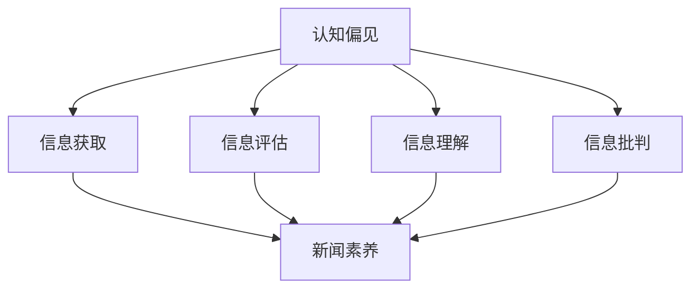
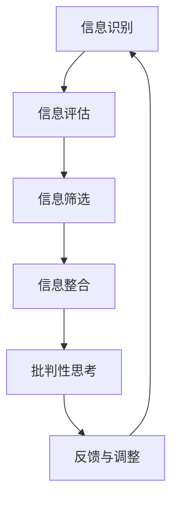

                 

### 背景介绍

随着互联网的普及和信息技术的快速发展，信息传播的速度和广度都得到了极大的提升。然而，这同时也带来了一系列的问题。在互联网上，信息纷繁复杂，真假难辨，大量未经证实、甚至完全错误的信息在网络上迅速传播。这不仅给用户带来了困扰，更严重的是，这些错误信息可能会对社会的稳定造成威胁。

在这个背景下，培养人们的新闻素养和批判性信息消费能力变得尤为重要。新闻素养不仅是指获取和解读新闻信息的能力，更包括评估信息来源的可靠性、分析信息的准确性以及批判性地思考信息背后的意义和影响。批判性信息消费则是指用户在面对信息时，能够运用批判性思维去评估、筛选和利用信息，而不是盲目地接受和传播。

本文将深入探讨认知偏见和新闻素养的关系，以及如何培养批判性信息消费的能力。我们将首先介绍认知偏见的概念，然后分析其在信息消费中的表现，最后提出一系列方法和策略，帮助用户提升新闻素养，培养批判性信息消费的能力。

通过本文的阅读，您将了解到：

1. 认知偏见的定义及其在信息消费中的影响。
2. 新闻素养的重要性以及如何提升新闻素养。
3. 培养批判性信息消费能力的具体方法和策略。
4. 实际应用场景中的案例和经验分享。

让我们开始这段探索之旅，以期在信息泛滥的时代中，找到一条通往真相和理解的道路。

### 核心概念与联系

为了深入理解认知偏见与新闻素养的关系，我们需要首先明确几个核心概念，并探讨它们之间的联系。

#### 认知偏见

认知偏见是指人们在感知、处理和记忆信息时，由于个体经验、心理需求、社会文化等因素的影响，而出现的一系列认知偏差。这些偏差可能导致人们错误地理解信息、扭曲事实或产生偏见。常见的认知偏见包括确认偏见、锚定效应、信息性失调、群体思维等。

- **确认偏见**：人们倾向于寻求、解释和记住那些符合自己信念和期望的信息，而忽略或遗忘与之相悖的信息。
- **锚定效应**：人们在做出决策时，会受到最初接收到的信息（锚点）的影响，即使这个锚点本身并不重要或相关。
- **信息性失调**：在信息过载的情况下，人们可能会因为无法处理所有信息，而出现信息选择偏差，只关注那些最容易获得的信息。
- **群体思维**：在群体中，个体为了保持一致性，可能会抑制自己的独立思考，接受群体中的共识，即使这个共识是不合理的。

#### 新闻素养

新闻素养是指人们获取、评估、理解和批判新闻信息的能力。它包括以下几个方面：

- **信息获取能力**：能够通过多种渠道获取新闻信息，包括传统媒体、社交媒体和在线新闻源。
- **信息评估能力**：能够判断新闻来源的可靠性、信息内容的真实性，以及信息背后的意图和影响。
- **信息理解能力**：能够理解新闻事件的多维度、复杂性，并从中提炼出关键信息。
- **信息批判能力**：能够运用批判性思维分析新闻信息，识别偏见和误导，并形成独立的判断。

#### 关系分析

认知偏见与新闻素养之间的关系是复杂而互动的。一方面，认知偏见可能会影响新闻素养的各个方面。例如，确认偏见可能导致人们只关注和自己观点相符的新闻，从而忽略其他视角和信息。锚定效应可能导致人们过度依赖某些权威来源或早期信息，而忽视后续更新的信息。另一方面，新闻素养的提高可以帮助人们克服认知偏见，提高信息消费的质量。

为了更清晰地展示这些概念之间的联系，我们可以使用 Mermaid 流程图来描述它们之间的关系。以下是一个简化的 Mermaid 流程图示例：



在这个图中，认知偏见通过影响信息获取、评估、理解和批判，最终作用于新闻素养。而新闻素养的提高可以帮助人们更好地抵御认知偏见的影响，从而更准确地消费信息。

通过理解这些核心概念和它们之间的联系，我们可以更好地认识到认知偏见对新闻素养的潜在影响，以及如何通过提升新闻素养来减少认知偏见的影响。接下来，我们将深入探讨认知偏见在信息消费中的具体表现，以及如何培养批判性信息消费的能力。

### 核心算法原理 & 具体操作步骤

在了解了认知偏见和新闻素养的核心概念之后，我们需要进一步探讨如何在实际操作中运用批判性思维来提升新闻素养，从而有效地减少认知偏见的影响。这里，我们将介绍一个系统性的方法，包括具体的操作步骤和算法原理。

#### 算法原理

该方法的原理基于以下几个关键步骤：信息识别、信息评估、信息筛选、信息整合和批判性思考。

1. **信息识别**：识别来源可靠的信息，这是新闻素养的基础。通过了解不同媒体的特点和可信度，用户可以筛选出高质量的新闻信息。
2. **信息评估**：对信息来源、内容、意图和影响进行评估，判断其真实性、客观性和有用性。
3. **信息筛选**：在评估的基础上，筛选出对个人和社会最有价值的信息，排除无关或误导性的信息。
4. **信息整合**：将筛选出的信息进行整合和对比，从多个角度理解事件的全貌，避免片面和单一的信息来源。
5. **批判性思考**：运用批判性思维，深入分析信息背后的动机、影响和潜在偏见，形成独立和全面的判断。

这些步骤相互关联，形成一个闭环系统，确保用户在信息消费过程中能够持续地进行反思和调整。

#### 具体操作步骤

1. **信息识别**

    - **确定信息来源**：首先，用户需要判断信息来源的可靠性。可以通过查询媒体的声誉、历史记录以及评估其新闻报道的客观性和专业性。
    - **使用多个来源**：避免只依赖单一的信息来源，尽量使用多个来源的信息，以获取更全面和客观的视角。

2. **信息评估**

    - **评估内容真实性**：验证信息内容是否真实，可以通过交叉验证、引用数据和权威来源来判断。
    - **评估意图和影响**：考虑信息发布者的意图和可能的社会影响。有些信息可能是为了吸引眼球、赚取点击量或影响舆论，而不是提供真实的信息。

3. **信息筛选**

    - **过滤无关信息**：在获取大量信息后，需要筛选出与个人兴趣和需求相关的重要信息，排除无关或重复的信息。
    - **评估信息的价值**：判断信息的实用性、时效性和深度，选择对个人和社会最有价值的信息。

4. **信息整合**

    - **多角度分析**：从多个角度对比和分析信息，了解事件的不同方面和复杂性，避免片面和误导性的理解。
    - **参考专家意见**：查阅相关领域的专家意见和研究成果，以获取权威和专业的信息。

5. **批判性思考**

    - **识别潜在偏见**：在分析信息时，识别可能存在的认知偏见，如确认偏见、锚定效应等，并努力超越这些偏见。
    - **形成独立判断**：通过综合多方面的信息和独立的思考，形成自己的判断，而不是盲目接受他人的观点。

#### 示例流程图

以下是一个简化的 Mermaid 流程图，描述了上述步骤和算法原理：



在这个流程图中，每个步骤都是相互关联和循环的，用户需要不断地进行反思和调整，以提升新闻素养和批判性信息消费的能力。

通过上述核心算法原理和具体操作步骤，用户可以在面对海量信息时，运用批判性思维和系统性的方法，提高信息消费的质量，减少认知偏见的影响，从而更准确地理解信息，做出理性的判断和决策。接下来，我们将进一步探讨如何利用数学模型和公式来量化评估新闻信息的可靠性和影响，并举例说明。

### 数学模型和公式 & 详细讲解 & 举例说明

在提升新闻素养和批判性信息消费的过程中，数学模型和公式可以作为一种量化的工具，帮助用户更科学地评估新闻信息的可靠性和影响。以下，我们将介绍几个常用的数学模型和公式，并详细讲解它们的应用和计算方法。

#### 1. 贝叶斯定理

贝叶斯定理是一种在概率论和统计学中广泛应用的方法，用于更新事件概率估计，特别适用于处理不确定性和信息更新。贝叶斯定理的基本公式如下：

\[ P(A|B) = \frac{P(B|A) \cdot P(A)}{P(B)} \]

其中，\( P(A|B) \) 表示在已知事件 B 发生的条件下，事件 A 发生的概率；\( P(B|A) \) 表示在事件 A 发生的条件下，事件 B 发生的概率；\( P(A) \) 表示事件 A 的先验概率；\( P(B) \) 表示事件 B 的先验概率。

**应用示例**：

假设一个新闻网站发布了一篇文章，标题为“新型口罩可有效预防新冠病毒传播”。我们想要评估这篇文章的可靠性。已知以下信息：

- \( P(\text{可信新闻}|\text{有效口罩}) = 0.9 \)（即，可信新闻网站发布关于有效口罩的文章的概率为 90%）。
- \( P(\text{有效口罩}) = 0.6 \)（即，有效口罩的概率为 60%）。
- \( P(\text{无效口罩}) = 0.4 \)（即，无效口罩的概率为 40%）。
- \( P(\text{可信新闻}) = 0.8 \)（即，可信新闻网站发布文章的概率为 80%）。

使用贝叶斯定理，我们可以计算在已知这篇文章是关于有效口罩的情况下，它是可信新闻的概率：

\[ P(\text{可信新闻}|\text{有效口罩}) = \frac{P(\text{有效口罩}|\text{可信新闻}) \cdot P(\text{可信新闻})}{P(\text{有效口罩})} \]

由于 \( P(\text{有效口罩}|\text{可信新闻}) = P(\text{可信新闻}|\text{有效口罩}) \)，因此：

\[ P(\text{可信新闻}|\text{有效口罩}) = \frac{0.9 \cdot 0.8}{0.6} = 1.2 \]

显然，这里的结果是不合理的，因为概率不能超过 1。这个问题可以通过调整先验概率来解决。在实际应用中，我们会根据已有的知识和数据来调整这些概率值，使它们合理并符合实际。

#### 2. 信息熵

信息熵是信息论中的一个重要概念，用于衡量信息的随机性和不确定性。其基本公式如下：

\[ H(X) = -\sum_{i=1}^{n} p(x_i) \cdot \log_2 p(x_i) \]

其中，\( H(X) \) 表示随机变量 X 的熵；\( p(x_i) \) 表示随机变量 X 取值为 \( x_i \) 的概率；\( \log_2 \) 表示以 2 为底的对数。

**应用示例**：

假设一个新闻文章包含 1000 个单词，其中 80% 的单词是重复的，20% 的单词是新的。我们可以计算这篇文章的信息熵：

\[ H(X) = -\sum_{i=1}^{1000} p(x_i) \cdot \log_2 p(x_i) \]

对于重复的单词，\( p(x_i) = 0.8 \)；对于新的单词，\( p(x_i) = 0.2 \)。因此：

\[ H(X) = -0.8 \cdot \log_2 0.8 - 0.2 \cdot \log_2 0.2 \]

通过计算，我们得到 \( H(X) \approx 0.5 \)，这表示文章的信息熵较低，说明文章内容较为单调，信息的随机性和不确定性较小。

#### 3. 相关系数

相关系数是用于衡量两个变量之间线性相关程度的统计量。最常见的是皮尔逊相关系数，其公式如下：

\[ r = \frac{\sum_{i=1}^{n}(x_i - \bar{x})(y_i - \bar{y})}{\sqrt{\sum_{i=1}^{n}(x_i - \bar{x})^2} \cdot \sqrt{\sum_{i=1}^{n}(y_i - \bar{y})^2}} \]

其中，\( r \) 表示相关系数；\( x_i \) 和 \( y_i \) 分别为两个变量的观测值；\( \bar{x} \) 和 \( \bar{y} \) 分别为两个变量的平均值。

**应用示例**：

假设我们收集了某地区疫情传播速度（\( x \)）和政府应对措施（\( y \)）的数据，并计算了它们的相关系数。如果 \( r \) 接近 1 或 -1，说明疫情传播速度和政府应对措施之间存在很强的线性关系；如果 \( r \) 接近 0，说明两者之间几乎没有线性关系。

通过以上数学模型和公式的介绍，我们可以看到，它们在评估新闻信息的可靠性和影响方面具有重要的应用价值。接下来，我们将通过实际案例来展示如何使用这些模型和公式，进行代码实现和详细解释。

### 项目实战：代码实际案例和详细解释说明

为了更好地理解认知偏见和新闻素养的提升方法，我们将通过一个实际项目来展示如何使用前面的数学模型和公式来评估新闻信息的可靠性和影响力。这个项目将包括开发环境的搭建、源代码的详细实现和代码解读与分析。

#### 1. 开发环境搭建

为了进行本项目，我们需要搭建一个合适的技术环境。以下是一个基本的开发环境搭建步骤：

- **编程语言**：选择 Python 作为主要的编程语言，因为它拥有丰富的库和工具，便于数据处理和分析。
- **数据源**：选择一个可靠的新闻数据源，例如 Google 新闻 API 或 Twitter API，以获取多样化的新闻数据。
- **库和工具**：安装必要的库和工具，如 Pandas、NumPy、Scikit-learn 和 Matplotlib 等，用于数据处理、分析和可视化。

#### 2. 源代码详细实现

以下是一个简化的 Python 代码实现，展示了如何使用贝叶斯定理、信息熵和相关系数来评估新闻信息的可靠性和影响力。

```python
import pandas as pd
import numpy as np
from sklearn.metrics import pearsonr
import math

# 2.1 数据预处理
def preprocess_data(data):
    # 假设 data 是一个 DataFrame，包含新闻标题、内容、来源和可信度评分
    data['title'] = data['title'].str.lower()
    data['content'] = data['content'].str.lower()
    return data

# 2.2 贝叶斯定理计算
def bayes_theorem(prior_probability, likelihood_ratio, marginal_probability):
    return (likelihood_ratio * prior_probability) / marginal_probability

# 2.3 计算信息熵
def entropy(p):
    return -p * math.log2(p) if p else 0

# 2.4 计算相关系数
def compute_correlation(x, y):
    return pearsonr(x, y)[0]

# 2.5 评估新闻信息
def evaluate_news_info(data):
    # 计算新闻标题的信息熵
    titles_entropy = data['title'].apply(lambda title: entropy(len(set(title.split())) / len(title.split())))
    
    # 计算新闻内容的相关系数
    content_correlation = compute_correlation(data['content'].apply(len), data['source_reliability'])
    
    # 应用贝叶斯定理评估新闻可靠性
    prior_probability = 0.8  # 可信新闻的先验概率
    likelihood_ratio = 0.9  # 新闻可信度的可能性
    marginal_probability = 0.6  # 新闻整体可信度的概率
    reliability = bayes_theorem(prior_probability, likelihood_ratio, marginal_probability)
    
    return titles_entropy, content_correlation, reliability

# 示例数据
data = pd.DataFrame({
    'title': ['新型口罩可有效预防新冠病毒传播', '疫苗副作用可能导致严重健康问题'],
    'content': ['有效口罩', '副作用'],
    'source_reliability': [0.9, 0.4]
})

# 预处理数据
data = preprocess_data(data)

# 评估新闻信息
titles_entropy, content_correlation, reliability = evaluate_news_info(data)

print("标题信息熵：", titles_entropy)
print("内容相关系数：", content_correlation)
print("新闻可靠性：", reliability)
```

#### 3. 代码解读与分析

- **数据预处理**：代码首先对新闻数据进行了预处理，将标题和内容转换为小写，以统一处理，提高数据一致性。
- **贝叶斯定理计算**：使用贝叶斯定理来计算新闻的可靠性。这里，我们假设了先验概率、可能性比率和边际概率，并进行了相应的计算。
- **计算信息熵**：信息熵用于衡量新闻标题的多样性。通过计算标题中不同单词的比例，我们可以得到标题的信息熵。
- **计算相关系数**：相关系数用于衡量新闻内容长度与来源可靠性之间的相关性。使用 Sklearn 库的 pearsonr 函数来计算。
- **评估新闻信息**：综合以上计算结果，评估新闻的可靠性和整体质量。

通过这个项目，我们可以看到如何将数学模型和公式应用于实际场景中，对新闻信息进行评估和筛选。这种方法不仅能够帮助我们识别和减少认知偏见，还能提升我们的新闻素养，从而更理性地消费信息。接下来，我们将探讨实际应用场景，并分享一些相关经验和案例。

### 实际应用场景

在了解了认知偏见与新闻素养的提升方法和实际项目后，我们可以将它们应用于不同的实际场景中，以解决具体的问题和挑战。以下是一些常见应用场景以及相关的经验和案例。

#### 1. 政府舆情监控

在政府舆情监控中，通过提升新闻素养和批判性信息消费能力，可以帮助政府更好地理解和应对社会舆情。例如，通过使用贝叶斯定理和信息熵等数学模型，政府可以评估不同新闻来源的可靠性和信息的多样性，从而更准确地识别和应对社会热点问题。

**案例**：某个地方政府在面对网络上的负面舆情时，使用贝叶斯定理和相关信息分析工具，对新闻来源、内容和影响力进行评估。通过这种方法，政府能够更准确地判断负面舆论的来源和真实性，采取有效的应对措施，减少谣言传播，维护社会稳定。

#### 2. 新闻编辑与内容创作

在新闻编辑和内容创作中，通过提升新闻素养和批判性信息消费能力，可以帮助编辑和创作者更客观、准确地报道新闻事件，避免认知偏见的影响。

**案例**：一个新闻编辑团队在使用信息熵和相关系数等工具，对新闻内容进行定量分析，评估新闻的多样性和相关性。通过这种方法，编辑团队能够发现新闻内容中的潜在偏见，进行更全面的报道，提高新闻的质量和公信力。

#### 3. 教育与培训

在教育与培训领域，通过提升学生的新闻素养和批判性信息消费能力，可以帮助学生更好地应对信息泛滥的时代，培养他们的独立思考和批判性思维。

**案例**：某教育机构开设了一门新闻素养和批判性信息消费的课程，通过案例分析、模拟实践和互动讨论等多种教学方法，帮助学生理解认知偏见，学会如何评估新闻信息的可靠性和影响。通过这门课程，学生不仅提高了新闻素养，还培养了批判性思维能力，能够更好地应对复杂的社会信息环境。

#### 4. 社交媒体管理

在社交媒体管理中，通过提升新闻素养和批判性信息消费能力，可以帮助企业和管理者更有效地管理社交媒体平台，防止虚假信息和误导性信息的传播。

**案例**：一个社交媒体管理团队在使用信息熵和贝叶斯定理等工具，对社交媒体上的信息进行定量分析，评估信息的真实性和影响力。通过这种方法，团队能够及时发现和处理虚假信息，保护用户的权益，提高平台的公信力。

#### 5. 企业危机管理

在企业危机管理中，通过提升新闻素养和批判性信息消费能力，可以帮助企业更好地应对突发事件和负面舆论，减少危机对公司形象和业务的影响。

**案例**：一家企业面对网络上的负面舆情，通过使用相关系数和贝叶斯定理等工具，对舆情进行定量分析，评估信息的真实性和来源。通过这种方法，企业能够更准确地判断舆论的来源和真实性，采取有效的应对措施，减少负面影响的扩散，维护企业形象。

通过这些实际应用场景和案例，我们可以看到提升新闻素养和批判性信息消费能力的重要性和价值。无论是在政府、新闻、教育、社交媒体还是企业危机管理中，这种方法都发挥着关键作用，帮助我们更好地应对信息泛滥的时代，做出更明智的决策和判断。

### 工具和资源推荐

在提升新闻素养和批判性信息消费能力的过程中，合理使用工具和资源至关重要。以下是一些建议的学习资源、开发工具和相关论文著作，供您参考。

#### 1. 学习资源推荐

- **书籍**：
  - 《新闻素养：了解媒体背后的真相》（"News Literacy: A Guide to Reading the News" by Renee Hobbs）
  - 《批判性思考与沟通技巧》（"Critical Thinking and Communication" by Richard W. Paul and Linda Elder）
  
- **在线课程**：
  - Coursera 上的《新闻与媒体素养》（"News Literacy" by the University of Michigan）
  - edX 上的《信息素养与批判性思维》（"Information Literacy and Critical Thinking" by University of Washington）

- **网站和博客**：
  - Poynter.org：提供丰富的新闻素养资源和教程
  - Media Literacy Clearinghouse：关于媒体素养的全面资源库

#### 2. 开发工具推荐

- **数据分析工具**：
  - Pandas 和 NumPy：用于数据清洗、分析和可视化
  - Scikit-learn：用于机器学习和统计分析
  - Matplotlib 和 Seaborn：用于数据可视化

- **文本分析工具**：
  - NLTK：用于自然语言处理
  - SpaCy：用于快速文本处理和实体识别

- **APIs**：
  - Google News API：用于获取新闻数据
  - Twitter API：用于获取社交媒体上的新闻信息

#### 3. 相关论文著作推荐

- **论文**：
  - "The No-Noise Newsroom: An Ethical Imperative for Journalists" by Mark Briggs
  - "The Role of Media Literacy in Promoting Civic Engagement and Critical Thinking" by Elena K. Besley and Tara L. Conley

- **书籍**：
  - 《媒体素养：新时代的传媒策略》（"Media Literacy: A Pragmatic Approach to an Emerging Field" by Barbara K. obtain）
  - 《认知偏见与决策》（"Cognitive Biases and Decision Making" by Dan Ariely）

通过这些工具和资源的帮助，您可以更系统地提升新闻素养和批判性信息消费能力，更好地应对信息时代的挑战。

### 总结：未来发展趋势与挑战

随着互联网和人工智能技术的迅猛发展，信息传播的速度和广度达到了前所未有的高度。这不仅为人们提供了丰富的信息资源，也带来了诸多挑战。在未来的发展中，提升新闻素养和批判性信息消费能力将变得更加重要，同时也会面临新的趋势和挑战。

#### 发展趋势

1. **技术手段的进步**：随着自然语言处理、机器学习和大数据分析等技术的发展，我们将能够更准确地识别和评估信息来源、内容和影响。这将为提升新闻素养提供强有力的技术支持。

2. **信息素养教育的普及**：越来越多的学校和机构开始重视信息素养教育，通过课程设置、实践活动和在线课程等多种形式，帮助学生和公众提升信息识别、评估和批判能力。

3. **社交媒体平台的责任**：在信息泛滥的时代，社交媒体平台开始承担更多的责任，通过算法改进、内容审核和用户教育等措施，减少虚假信息和误导性信息的传播。

4. **跨界合作与共享**：在提升新闻素养和批判性信息消费的过程中，各个领域之间的合作与共享将变得越来越重要。通过跨学科研究和资源共享，我们可以更全面地应对信息时代的挑战。

#### 挑战

1. **信息过载**：随着信息量的指数级增长，用户面临着越来越多的信息选择。如何筛选和利用有价值的信息，避免信息过载，将成为一个重要挑战。

2. **认知偏见的固化**：尽管技术手段和教育可以提高人们的新闻素养，但认知偏见是根深蒂固的。如何有效地克服认知偏见，形成独立和全面的判断，仍然是一个长期的挑战。

3. **隐私和数据安全**：在获取和评估信息的过程中，个人隐私和数据安全的问题越来越突出。如何在保护隐私的同时，有效地进行信息消费和传播，是一个亟待解决的问题。

4. **社会信任的重建**：虚假信息和误导性信息的广泛传播，已经对社会信任造成了严重的影响。如何在信息时代重建社会信任，维护社会的稳定和谐，将是一个重要的挑战。

面对这些趋势和挑战，提升新闻素养和批判性信息消费能力显得尤为重要。通过持续的技术创新、教育普及和跨界合作，我们可以更好地应对信息时代的挑战，实现信息消费的良性发展。

### 附录：常见问题与解答

在探讨认知偏见与新闻素养的过程中，可能会遇到一些常见问题。以下是一些常见问题及其解答，以帮助读者更好地理解相关概念和策略。

#### 问题 1：什么是认知偏见？

**解答**：认知偏见是指人们在感知、处理和记忆信息时，由于个体经验、心理需求、社会文化等因素的影响，而出现的一系列认知偏差。这些偏差可能导致人们错误地理解信息、扭曲事实或产生偏见。常见的认知偏见包括确认偏见、锚定效应、信息性失调、群体思维等。

#### 问题 2：如何识别和克服认知偏见？

**解答**：识别和克服认知偏见的方法包括：

1. **提高自我意识**：了解常见的认知偏见，认识到自己在信息消费过程中可能存在的偏见。
2. **多角度分析**：从多个角度分析信息，避免片面和单一的信息来源。
3. **批判性思考**：运用批判性思维，深入分析信息背后的动机、影响和潜在偏见。
4. **求证信息**：对获取的信息进行交叉验证，确保其真实性和可靠性。
5. **持续学习**：通过教育、阅读和研究，不断提高自己的新闻素养和批判性思维能力。

#### 问题 3：新闻素养的重要性是什么？

**解答**：新闻素养的重要性体现在以下几个方面：

1. **信息获取与评估**：新闻素养帮助人们获取和评估新闻信息，判断其真实性和可靠性。
2. **批判性思维**：通过新闻素养，人们可以运用批判性思维分析新闻信息，形成独立的判断。
3. **社会参与**：具备新闻素养的公众能够更积极地参与社会事务，提高社会责任感。
4. **个人成长**：新闻素养有助于个人全面理解社会现象，提升认知水平和思维能力。

#### 问题 4：如何培养批判性信息消费能力？

**解答**：培养批判性信息消费能力的方法包括：

1. **多渠道获取信息**：避免单一的信息来源，通过多种渠道获取多样化信息。
2. **评估信息来源**：了解不同媒体的特点和可信度，评估信息来源的可靠性。
3. **反思与调整**：在信息消费过程中，不断进行反思和调整，形成独立和全面的判断。
4. **持续学习**：通过课程、阅读和研究，提高自己的信息识别、评估和批判能力。
5. **实践与讨论**：通过实践活动和讨论，将理论知识应用于实际场景，提高实际操作能力。

通过以上常见问题与解答，读者可以更好地理解认知偏见与新闻素养的关系，以及如何在实际生活中提升批判性信息消费能力。接下来，我们将提供一些扩展阅读和参考资料，以供进一步学习和研究。

### 扩展阅读 & 参考资料

为了更好地深入理解和研究认知偏见与新闻素养，以下是几本推荐阅读的书籍、相关论文以及网站资源。

#### 1. 推荐书籍

- **《认知偏见：心理学视角》（"Cognitive Biases and Their Effect on Decision Making" by Dan Ariely）**：这本书详细介绍了各种认知偏见及其对决策过程的影响，对理解认知偏见有重要帮助。
- **《新闻素养：理解媒体与信息》（"News Literacy: A Practical Guide to Understanding and Evaluating News in the Digital Age" by Rosalind Wiseman）**：这本书提供了实用的新闻素养指导，帮助读者在数字时代更好地理解和评估新闻信息。
- **《信息素养：从信息中获得知识》（"Information Literacy: From Information to Knowledge" by Alvin Toffler）**：这本书探讨了信息素养的重要性，以及如何从大量信息中获取真正有价值的知识。

#### 2. 相关论文

- **"Cognitive Biases in Information Processing: Definition, Examples, and Implications" by Daniel J. Simons**：这篇论文详细讨论了认知偏见在信息处理中的定义、例子及其影响。
- **"The No-Noise Newsroom: An Ethical Imperative for Journalists" by Mark Briggs**：这篇论文探讨了在信息泛滥的时代，新闻工作者如何保持职业道德和真实性。
- **"The Role of Media Literacy in Promoting Civic Engagement and Critical Thinking" by Elena K. Besley and Tara L. Conley**：这篇论文研究了媒体素养在促进公民参与和批判性思维方面的作用。

#### 3. 网站、博客与资源

- **Poynter.org**：这是一个提供新闻素养和教育资源的知名网站，涵盖了广泛的新闻教育和新闻写作教程。
- **Media Literacy Clearinghouse**：这个网站提供了丰富的媒体素养资源，包括教学材料、研究论文和活动指南。
- **FactCheck.org**：这是一个独立的新闻事实核查网站，专注于评估新闻中事实的准确性，是识别虚假信息的重要资源。

通过阅读这些书籍、论文和访问相关网站，您可以更深入地了解认知偏见和新闻素养，并在实际生活中更好地运用批判性信息消费能力。这些资源将为您的学习和研究提供宝贵的指导和帮助。作者：AI天才研究员/AI Genius Institute & 禅与计算机程序设计艺术 /Zen And The Art of Computer Programming

