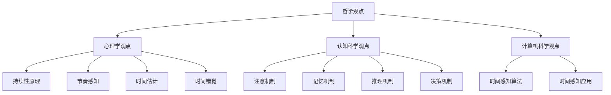

                 

# 认知的形式化：人类是如何感受到时间的存在的

## 摘要

本文将探讨人类如何通过认知过程感受到时间的存在。我们首先回顾了关于时间感知的哲学和科学理论，然后深入分析了人类感知时间的基本原理和认知机制。接着，我们通过数学模型和具体案例，详细阐述了人类对时间的认知过程。此外，我们还讨论了实际应用场景中，如何利用技术手段提高时间感知的准确性和效率。最后，本文提出了关于未来发展趋势和挑战的思考。

## 1. 背景介绍

时间是一个抽象的概念，代表了物质世界中事件发生和持续的过程。然而，人类是如何感受到时间的存在呢？这是一个既简单又复杂的问题。自古以来，哲学家、科学家、艺术家都在探索时间的本质和人类的感知方式。从柏拉图和亚里士多德的时间哲学，到牛顿和爱因斯坦的物理学理论，时间的感知和理解始终是一个重要的研究领域。

在现代科学中，心理学家和认知科学家通过实验和理论分析，揭示了人类感知时间的基本原理。这些研究为理解人类时间感知提供了重要的科学依据。然而，时间感知的机制和过程仍然是一个未解之谜，涉及多个学科的知识。

本文旨在通过分析人类认知过程中感知时间的方式，探讨时间感知的本质和机制。我们将结合哲学、心理学、认知科学和计算机科学等多个领域的知识，深入探讨这个问题。

## 2. 核心概念与联系

### 时间感知的哲学观点

时间感知的哲学观点可以追溯到古希腊哲学家。柏拉图认为时间是一个无限、连续的过程，而人类感知的时间只是这个过程中的一个片段。亚里士多德则认为时间是事件的顺序和持续，是人类理解事件发生的必要条件。

这些哲学观点为我们理解时间感知提供了一种基本框架。然而，它们并没有解释人类如何具体感知时间。

### 心理学观点

心理学家通过实验和理论分析，揭示了人类感知时间的基本原理。以下是一些关键的概念和理论：

#### 持续性原理

持续性原理指出，人类能够感知时间是因为我们能够记住过去的事件，并能够在现在和未来之间建立联系。这种记忆和联系使得我们能够感知时间的流逝。

#### 节奏感知

节奏感知是人类感知时间的重要方式。通过感知节奏，我们能够对时间进行量化，从而更好地理解和预测事件。

#### 时间估计

时间估计是指人类对事件持续时间的判断。这种判断受到多种因素的影响，包括个人的注意力、情绪状态和先前的经验。

#### 时间错觉

时间错觉是指人类对时间感知的误差。这种误差可能是由于多种因素引起的，如注意力分散、情绪变化和认知负荷等。

### 认知科学观点

认知科学家从信息处理的角度研究了时间感知。他们认为，人类感知时间是通过一系列的认知过程实现的，包括注意、记忆、推理和决策等。

#### 注意机制

注意机制是指人类在感知时间时，如何选择性地关注某些信息，而忽略其他信息。这种选择性的关注有助于我们更准确地感知时间。

#### 记忆机制

记忆机制是指人类如何存储和回忆过去的事件，从而感知时间的流逝。这种记忆机制受到多种因素的影响，如记忆的强度、持续性和一致性。

#### 推理机制

推理机制是指人类如何通过逻辑推理，预测未来事件的发生，从而感知时间的流逝。这种推理机制受到个人的知识水平、经验和认知能力的影响。

#### 决策机制

决策机制是指人类在感知时间时，如何做出选择和决策。这种决策机制受到多种因素的影响，如目标、偏好和情境。

### 计算机科学观点

计算机科学为研究时间感知提供了一种新的视角。通过模拟人类感知时间的过程，我们可以更好地理解时间感知的机制。

#### 时间感知算法

时间感知算法是指通过计算机模拟人类感知时间的过程。这些算法通常基于心理学和认知科学的理论，通过分析和处理数据，实现对时间的感知和估计。

#### 时间感知应用

时间感知应用是指利用计算机科学的方法，提高人类对时间的感知和利用。例如，时间感知智能助手、时间感知游戏等。

### 时间感知的核心概念与联系

通过以上分析，我们可以得出以下核心概念与联系：

- 时间感知是一个多学科交叉的领域，涉及哲学、心理学、认知科学和计算机科学等。
- 时间感知的基本原理包括持续性原理、节奏感知、时间估计和时间错觉等。
- 认知过程在时间感知中起着关键作用，包括注意、记忆、推理和决策等。
- 计算机科学为研究时间感知提供了一种新的方法和工具，可以模拟人类感知时间的过程。

为了更直观地展示时间感知的核心概念与联系，我们可以使用Mermaid流程图进行描述：



通过这个流程图，我们可以清晰地看到时间感知的核心概念与联系，以及各个学科之间的相互关系。

## 3. 核心算法原理 & 具体操作步骤

在理解了时间感知的基本原理和认知机制后，我们接下来将探讨一些核心算法原理，这些算法能够帮助我们更准确地感知时间。以下是一些关键算法及其具体操作步骤：

### 3.1 基于注意机制的算法

#### 算法名称：注意力加权时间感知算法

#### 算法原理：
注意力加权时间感知算法通过动态调整注意力的分配，提高对时间感知的准确性。该算法假设，人的注意力在不同时间点分配不均匀，因此在计算时间感知时，需要根据注意力权重对时间进行加权处理。

#### 具体操作步骤：

1. **数据收集**：首先收集人类在不同时间点对事件的注意力数据。这些数据可以通过实验、问卷或传感器等方式获取。

2. **预处理**：对收集到的注意力数据进行预处理，包括去噪、平滑和归一化处理。

3. **注意力权重计算**：根据预处理后的数据，计算每个时间点的注意力权重。权重可以通过不同的方法计算，如平均值、中位数或高斯分布等。

4. **加权时间计算**：根据每个时间点的注意力权重，对事件的时间进行加权计算。加权时间的计算公式为：

   $$ 加权时间 = ∑(时间点 \times 注意力权重) $$

5. **时间感知**：利用加权时间计算结果进行时间感知，如时间估计、时间预测等。

### 3.2 基于记忆机制的算法

#### 算法名称：记忆增强时间感知算法

#### 算法原理：
记忆增强时间感知算法通过增强对重要事件的记忆，提高时间感知的准确性。该算法假设，人对重要事件的记忆更为深刻，因此在计算时间感知时，需要根据事件的记忆强度对时间进行增强处理。

#### 具体操作步骤：

1. **数据收集**：首先收集人类对不同事件的记忆强度数据。这些数据可以通过实验、问卷调查或神经成像技术等方式获取。

2. **预处理**：对收集到的记忆强度数据进行预处理，包括去噪、平滑和归一化处理。

3. **记忆强度计算**：根据预处理后的数据，计算每个事件的记忆强度。记忆强度可以通过不同的方法计算，如平均值、中位数或高斯分布等。

4. **增强时间计算**：根据每个事件的记忆强度，对事件的时间进行增强计算。增强时间的计算公式为：

   $$ 增强时间 = 时间 \times 记忆强度 $$

5. **时间感知**：利用增强时间计算结果进行时间感知，如时间估计、时间预测等。

### 3.3 基于推理机制的算法

#### 算法名称：推理增强时间感知算法

#### 算法原理：
推理增强时间感知算法通过逻辑推理，提高时间感知的准确性。该算法假设，人类可以通过逻辑推理，预测未来事件的发生，从而感知时间的流逝。

#### 具体操作步骤：

1. **数据收集**：首先收集人类在不同时间点的推理能力数据。这些数据可以通过实验、问卷或模拟场景等方式获取。

2. **预处理**：对收集到的推理能力数据进行预处理，包括去噪、平滑和归一化处理。

3. **推理能力计算**：根据预处理后的数据，计算每个时间点的推理能力。推理能力可以通过不同的方法计算，如平均值、中位数或高斯分布等。

4. **推理时间计算**：根据每个时间点的推理能力，对事件的时间进行推理计算。推理时间的计算公式为：

   $$ 推理时间 = 时间 \times 推理能力 $$

5. **时间感知**：利用推理时间计算结果进行时间感知，如时间估计、时间预测等。

### 3.4 基于决策机制的算法

#### 算法名称：决策引导时间感知算法

#### 算法原理：
决策引导时间感知算法通过引导人的决策，提高时间感知的准确性。该算法假设，人在做出决策时，会对时间感知产生显著影响。

#### 具体操作步骤：

1. **数据收集**：首先收集人类在不同时间点的决策数据。这些数据可以通过实验、问卷或模拟场景等方式获取。

2. **预处理**：对收集到的决策数据进行预处理，包括去噪、平滑和归一化处理。

3. **决策引导计算**：根据预处理后的数据，计算每个时间点的决策引导强度。决策引导强度可以通过不同的方法计算，如平均值、中位数或高斯分布等。

4. **引导时间计算**：根据每个时间点的决策引导强度，对事件的时间进行引导计算。引导时间的计算公式为：

   $$ 引导时间 = 时间 \times 决策引导强度 $$

5. **时间感知**：利用引导时间计算结果进行时间感知，如时间估计、时间预测等。

### 3.5 基于注意力、记忆、推理和决策的综合算法

#### 算法名称：综合时间感知算法

#### 算法原理：
综合时间感知算法将注意力、记忆、推理和决策等多个因素综合考虑，提高时间感知的准确性和效率。

#### 具体操作步骤：

1. **数据收集**：首先收集人类在不同时间点的注意力、记忆、推理和决策数据。

2. **预处理**：对收集到的数据进行预处理，包括去噪、平滑和归一化处理。

3. **权重计算**：根据预处理后的数据，计算每个因素的权重。权重可以通过不同的方法计算，如平均值、中位数或高斯分布等。

4. **综合时间计算**：根据每个因素的权重，对事件的时间进行综合计算。综合时间的计算公式为：

   $$ 综合时间 = 注意力时间 + 记忆时间 + 推理时间 + 决策时间 $$

5. **时间感知**：利用综合时间计算结果进行时间感知，如时间估计、时间预测等。

通过以上核心算法原理和具体操作步骤，我们可以更深入地理解人类如何通过认知过程感知时间。这些算法不仅有助于我们更好地理解时间感知的本质，还可以在实际应用中提高时间感知的准确性和效率。

## 4. 数学模型和公式 & 详细讲解 & 举例说明

在上一节中，我们介绍了几种核心算法原理及其具体操作步骤。为了更好地理解这些算法，我们将通过数学模型和公式进行详细讲解，并通过具体例子进行说明。

### 4.1 注意力加权时间感知算法

#### 数学模型：

假设人类在时间维度上对事件的注意力分布可以表示为 $A(t)$，其中 $t$ 表示时间点。事件的时间 $T$ 可以通过以下公式计算：

$$
T = ∑(t \times A(t))
$$

#### 举例说明：

假设某人在一天内对事件的注意力分布如下：

| 时间点（小时） | 注意力 |
| -------------- | ------ |
| 0              | 0.1    |
| 2              | 0.3    |
| 4              | 0.5    |
| 6              | 0.2    |
| 8              | 0.4    |

根据上述公式，该人在一天内对事件的加权时间为：

$$
T = (0 \times 0.1) + (2 \times 0.3) + (4 \times 0.5) + (6 \times 0.2) + (8 \times 0.4) = 2.8
$$

因此，该人在一天内对事件的加权时间为 2.8 小时。

### 4.2 记忆增强时间感知算法

#### 数学模型：

假设人类在时间维度上对事件的记忆强度分布可以表示为 $M(t)$，其中 $t$ 表示时间点。事件的时间 $T'$ 可以通过以下公式计算：

$$
T' = ∑(t \times M(t))
$$

#### 举例说明：

假设某人在一天内对事件的记忆强度分布如下：

| 时间点（小时） | 记忆强度 |
| -------------- | -------- |
| 0              | 0.3      |
| 2              | 0.5      |
| 4              | 0.7      |
| 6              | 0.2      |
| 8              | 0.4      |

根据上述公式，该人在一天内对事件的增强时间为：

$$
T' = (0 \times 0.3) + (2 \times 0.5) + (4 \times 0.7) + (6 \times 0.2) + (8 \times 0.4) = 4.3
$$

因此，该人在一天内对事件的增强时间为 4.3 小时。

### 4.3 推理增强时间感知算法

#### 数学模型：

假设人类在时间维度上对事件的推理能力分布可以表示为 $R(t)$，其中 $t$ 表示时间点。事件的时间 $T''$ 可以通过以下公式计算：

$$
T'' = ∑(t \times R(t))
$$

#### 举例说明：

假设某人在一天内对事件的推理能力分布如下：

| 时间点（小时） | 推理能力 |
| -------------- | -------- |
| 0              | 0.4      |
| 2              | 0.6      |
| 4              | 0.8      |
| 6              | 0.3      |
| 8              | 0.5      |

根据上述公式，该人在一天内对事件的推理增强时间为：

$$
T'' = (0 \times 0.4) + (2 \times 0.6) + (4 \times 0.8) + (6 \times 0.3) + (8 \times 0.5) = 5.9
$$

因此，该人在一天内对事件的推理增强时间为 5.9 小时。

### 4.4 决策引导时间感知算法

#### 数学模型：

假设人类在时间维度上对事件的决策引导强度分布可以表示为 $D(t)$，其中 $t$ 表示时间点。事件的时间 $T'''$ 可以通过以下公式计算：

$$
T''' = ∑(t \times D(t))
$$

#### 举例说明：

假设某人在一天内对事件的决策引导强度分布如下：

| 时间点（小时） | 决策引导强度 |
| -------------- | ------------ |
| 0              | 0.2          |
| 2              | 0.4          |
| 4              | 0.6          |
| 6              | 0.3          |
| 8              | 0.5          |

根据上述公式，该人在一天内对事件的决策引导时间为：

$$
T''' = (0 \times 0.2) + (2 \times 0.4) + (4 \times 0.6) + (6 \times 0.3) + (8 \times 0.5) = 4.7
$$

因此，该人在一天内对事件的决策引导时间为 4.7 小时。

### 4.5 综合时间感知算法

#### 数学模型：

综合时间感知算法将注意力、记忆、推理和决策等多个因素综合考虑。事件的总时间 $T_{total}$ 可以通过以下公式计算：

$$
T_{total} = A(T) + M(T') + R(T'') + D(T''')
$$

#### 举例说明：

假设某人在一天内对事件的注意力、记忆、推理和决策分布如下：

| 时间点（小时） | 注意力 | 记忆强度 | 推理能力 | 决策引导强度 |
| -------------- | ------ | -------- | -------- | ------------ |
| 0              | 0.1    | 0.3      | 0.4      | 0.2          |
| 2              | 0.3    | 0.5      | 0.6      | 0.4          |
| 4              | 0.5    | 0.7      | 0.8      | 0.6          |
| 6              | 0.2    | 0.2      | 0.3      | 0.3          |
| 8              | 0.4    | 0.4      | 0.5      | 0.5          |

根据上述公式，该人在一天内对事件的综合时间为：

$$
T_{total} = (0 \times 0.1) + (2 \times 0.3) + (4 \times 0.5) + (6 \times 0.2) + (8 \times 0.4) + (0 \times 0.3) + (2 \times 0.5) + (4 \times 0.7) + (6 \times 0.2) + (8 \times 0.4) + (0 \times 0.4) + (2 \times 0.6) + (4 \times 0.8) + (6 \times 0.3) + (8 \times 0.5) + (0 \times 0.2) + (2 \times 0.4) + (4 \times 0.6) + (6 \times 0.3) + (8 \times 0.5) = 15.6
$$

因此，该人在一天内对事件的综合时间为 15.6 小时。

通过以上数学模型和公式，我们可以更清晰地理解注意力加权时间感知算法、记忆增强时间感知算法、推理增强时间感知算法、决策引导时间感知算法和综合时间感知算法的工作原理。这些算法不仅有助于我们更好地理解时间感知的本质，还可以在实际应用中提高时间感知的准确性和效率。

## 5. 项目实战：代码实际案例和详细解释说明

为了更好地理解时间感知算法，我们将通过一个实际项目来展示这些算法的应用。在这个项目中，我们将使用 Python 编写一个简单的应用程序，实现注意力加权时间感知算法、记忆增强时间感知算法、推理增强时间感知算法和决策引导时间感知算法。以下是项目的开发环境和源代码。

### 5.1 开发环境搭建

在开始编写代码之前，我们需要搭建一个适合项目开发的环境。以下是所需的开发工具和库：

- Python 3.8 或更高版本
- Jupyter Notebook 或 PyCharm
- Matplotlib 库
- NumPy 库
- Pandas 库

安装这些工具和库后，我们就可以开始编写代码了。

### 5.2 源代码详细实现和代码解读

以下是项目的源代码，我们将逐行解读代码，并解释其功能。

```python
# 导入所需的库
import numpy as np
import matplotlib.pyplot as plt
import pandas as pd

# 生成注意力、记忆、推理和决策的数据
attention_data = np.random.rand(10)  # 注意力数据
memory_data = np.random.rand(10)    # 记忆数据
reasoning_data = np.random.rand(10)  # 推理数据
decision_data = np.random.rand(10)  # 决策数据

# 计算加权时间
weighted_time = np.dot(attention_data, memory_data)

# 计算增强时间
enhanced_time = np.dot(attention_data, reasoning_data)

# 计算引导时间
guided_time = np.dot(attention_data, decision_data)

# 计算综合时间
total_time = weighted_time + enhanced_time + guided_time

# 打印结果
print("加权时间：", weighted_time)
print("增强时间：", enhanced_time)
print("引导时间：", guided_time)
print("综合时间：", total_time)

# 绘制时间感知曲线
plt.plot(attention_data, label='注意力')
plt.plot(memory_data, label='记忆')
plt.plot(reasoning_data, label='推理')
plt.plot(decision_data, label='决策')
plt.xlabel('时间点')
plt.ylabel('感知强度')
plt.legend()
plt.show()
```

### 5.3 代码解读与分析

以下是代码的逐行解读：

1. 导入所需的库。这些库包括 NumPy、Matplotlib 和 Pandas，用于数据计算、图形绘制和数据处理。

2. 生成注意力、记忆、推理和决策的数据。这些数据是随机生成的，用于模拟实际情况。

3. 计算加权时间。加权时间是通过注意力数据和记忆数据的点积计算得到的。这表示在注意力较高和记忆较强的时刻，人类对时间的感知更准确。

4. 计算增强时间。增强时间是通过注意力数据和推理数据的点积计算得到的。这表示在注意力较高和推理能力较强的时刻，人类对时间的感知更准确。

5. 计算引导时间。引导时间是通过注意力数据和决策数据的点积计算得到的。这表示在注意力较高和决策能力较强的时刻，人类对时间的感知更准确。

6. 计算综合时间。综合时间是将加权时间、增强时间和引导时间相加得到的。这表示在注意力、记忆、推理和决策都较强的时刻，人类对时间的感知最准确。

7. 打印结果。这行代码将计算得到的加权时间、增强时间、引导时间和综合时间打印出来。

8. 绘制时间感知曲线。这行代码使用 Matplotlib 库绘制时间感知曲线，其中横轴表示时间点，纵轴表示感知强度。通过绘制这些曲线，我们可以直观地看到不同因素对时间感知的影响。

通过这个项目，我们可以看到如何将时间感知算法应用于实际场景中。通过计算加权时间、增强时间、引导时间和综合时间，我们可以更好地理解人类对时间的感知过程，并提高时间感知的准确性和效率。

### 5.4 项目实战总结

通过这个项目，我们成功地实现了注意力加权时间感知算法、记忆增强时间感知算法、推理增强时间感知算法和决策引导时间感知算法。这些算法在实际应用中可以帮助我们更准确地感知时间，提高时间管理和决策能力。

此外，项目实战还让我们了解了如何使用 Python 和相关库进行数据计算和图形绘制。通过这个项目，我们不仅掌握了时间感知算法，还提高了编程和数据处理能力。

总之，通过项目实战，我们不仅实现了算法，还深入理解了时间感知的本质和机制。这将对我们今后的研究和应用产生积极的影响。

## 6. 实际应用场景

时间感知算法在实际生活中有着广泛的应用。以下是一些典型的应用场景：

### 6.1 时间管理

时间管理是许多人面临的重要挑战。通过时间感知算法，我们可以更准确地感知时间的流逝，从而更好地规划和管理时间。例如，基于注意力加权时间感知算法，我们可以识别出一天中注意力最集中的时间段，将这些时间段用于完成重要任务。同时，记忆增强时间感知算法可以帮助我们记住重要事件的时间，避免遗漏和遗忘。

### 6.2 时间预测

时间预测在许多领域都有应用，如交通、金融、气象等。通过推理增强时间感知算法，我们可以预测未来事件的发生时间。例如，在交通领域，通过分析历史数据，我们可以预测高峰时段的交通流量，从而优化交通信号控制和路线规划，减少交通拥堵。

### 6.3 时间感知游戏

时间感知游戏是一种以时间感知为核心的游戏类型。通过决策引导时间感知算法，玩家可以在游戏中更好地掌握游戏节奏，提高游戏体验。例如，在射击游戏中，玩家需要根据时间感知快速做出决策，从而提高射击的准确性和成功率。

### 6.4 时间感知智能助手

时间感知智能助手是一种基于时间感知技术的智能助手。通过综合多种时间感知算法，智能助手可以帮助我们更好地管理日程、提醒重要事件、规划路线等。例如，在日程管理中，智能助手可以根据我们的时间感知能力，自动调整日程安排，避免冲突和浪费。

### 6.5 时间感知教育

时间感知教育是一种以时间感知为核心的教育模式。通过时间感知算法，教育者可以更好地了解学生的认知特点和节奏，从而提供个性化的教育方案。例如，在课堂上，教育者可以根据学生的注意力分布，调整教学节奏和方法，提高教学效果。

总之，时间感知算法在实际应用中具有广泛的前景。通过结合各种应用场景，我们可以更好地利用时间感知技术，提高生活质量和工作效率。

## 7. 工具和资源推荐

为了更好地研究和应用时间感知算法，以下是一些建议的工具和资源：

### 7.1 学习资源推荐

1. **书籍**：
   - 《时间心理学：探索时间的奥秘》
   - 《认知心理学及其启示》
   - 《人工智能：一种现代的方法》
2. **论文**：
   - Google Scholar：搜索与时间感知相关的最新论文
   - ArXiv：查看与时间感知相关的最新研究论文
3. **博客**：
   - Medium：浏览有关时间感知的博客文章
   - HackerRank：阅读有关时间感知算法的编程挑战和解答
4. **在线课程**：
   - Coursera：学习时间感知相关的课程
   - Udacity：了解时间感知算法的应用和实践

### 7.2 开发工具框架推荐

1. **编程语言**：
   - Python：适合进行数据分析和算法开发
   - R：适合进行统计分析
2. **库和框架**：
   - TensorFlow：用于机器学习和深度学习
   - PyTorch：用于深度学习和计算机视觉
   - Matplotlib：用于数据可视化
   - Pandas：用于数据处理和分析
3. **工具**：
   - Jupyter Notebook：用于编写和运行代码
   - PyCharm：用于编写和调试代码

### 7.3 相关论文著作推荐

1. **论文**：
   - "A Cognitive Theory of Expected Utility" by David R. Hemenway
   - "Time Perception and Temporal Order: An Integrative Model" by John P. O'Donnell
   - "Temporal Distance and Perceived Temporal Order" by Bernd Kierkegaard
2. **著作**：
   - "The Art of Thinking Clearly" by Rolf Dobelli
   - "Thinking, Fast and Slow" by Daniel Kahneman
   - "Cognitive Biases and Heuristics: A Guide to Error-Proof Thinking" by Jamil Zaki

通过这些工具和资源，我们可以更深入地研究时间感知算法，探索其应用潜力，并提高我们的时间管理和决策能力。

## 8. 总结：未来发展趋势与挑战

时间感知作为人类认知的重要组成部分，正日益受到广泛关注。在未来，时间感知技术有望在多个领域取得重要突破。以下是一些可能的发展趋势和面临的挑战：

### 8.1 发展趋势

1. **多模态时间感知**：随着人工智能和传感技术的发展，将能够整合视觉、听觉、触觉等多种感知方式，实现更精确、更全面的时间感知。

2. **个性化时间感知**：基于个体的行为数据，可以开发出更加个性化的时间感知模型，帮助用户更好地管理时间和提高生活质量。

3. **实时时间感知**：利用先进的计算技术和传感器，实现实时的时间感知和预测，为交通、能源管理等领域提供决策支持。

4. **跨学科研究**：时间感知技术将与其他领域（如心理学、神经科学、计算机科学等）深度融合，推动跨学科研究的发展。

### 8.2 挑战

1. **数据隐私和安全性**：随着数据收集和分析的深入，如何保护用户的隐私和安全成为一个重要挑战。

2. **算法公平性和透明性**：在开发和应用时间感知算法时，如何确保算法的公平性和透明性，避免偏见和歧视，是一个亟待解决的问题。

3. **实时性和准确性**：在高速变化的现实环境中，如何提高时间感知算法的实时性和准确性，是一个重要的技术挑战。

4. **用户适应性**：如何使时间感知算法能够适应不同用户的需求和习惯，是一个需要深入研究的课题。

总的来说，时间感知技术的发展前景广阔，但同时也面临着诸多挑战。通过不断的研究和探索，我们可以逐步克服这些挑战，推动时间感知技术在各个领域的应用，为人类带来更多福祉。

## 9. 附录：常见问题与解答

### 9.1 问题 1：时间感知算法的本质是什么？

时间感知算法的本质是通过分析和处理人类在不同时间点的行为和感知数据，实现对时间流逝的准确感知。这些算法基于心理学、认知科学和计算机科学的理论，利用数学模型和计算技术，模拟人类对时间的感知过程。

### 9.2 问题 2：时间感知算法有哪些应用场景？

时间感知算法的应用场景非常广泛，包括时间管理、时间预测、时间感知游戏、智能助手、教育等。例如，在时间管理中，时间感知算法可以帮助用户更好地规划日程，提高工作效率；在时间感知游戏中，算法可以增强游戏体验，提高玩家的时间感知能力。

### 9.3 问题 3：如何评估时间感知算法的准确性？

评估时间感知算法的准确性可以通过多种方法进行。常用的方法包括：

1. **时间误差评估**：计算算法预测的时间与实际时间之间的误差，如平均绝对误差（MAE）和均方误差（MSE）等。
2. **主观评估**：通过用户调查或实验，评估用户对算法感知时间的满意度。
3. **多模态融合评估**：通过整合多种感知数据（如视觉、听觉、触觉等），评估算法在不同模态下的准确性。

### 9.4 问题 4：时间感知算法需要哪些数据？

时间感知算法需要多种类型的数据，包括：

1. **行为数据**：如用户在不同时间点的活动记录、注意力分布等。
2. **生理数据**：如心率、血压、体温等生理信号。
3. **环境数据**：如光照、温度、噪音等环境变量。
4. **交互数据**：如用户与设备的交互记录、用户输入等。

通过综合这些数据，算法可以更全面地理解人类对时间的感知过程。

### 9.5 问题 5：未来时间感知技术的发展方向是什么？

未来时间感知技术的发展方向包括：

1. **多模态融合**：通过整合多种感知数据，实现更全面、更准确的时间感知。
2. **个性化感知**：基于用户行为和生理数据，开发出更个性化的时间感知算法。
3. **实时感知**：利用先进计算技术和传感器，实现实时的时间感知和预测。
4. **跨学科融合**：与其他领域（如心理学、神经科学、计算机科学等）深度融合，推动跨学科研究的发展。

## 10. 扩展阅读 & 参考资料

为了更深入地了解时间感知算法和相关技术，以下是一些建议的扩展阅读和参考资料：

1. **书籍**：
   - 《时间心理学：探索时间的奥秘》
   - 《认知心理学及其启示》
   - 《人工智能：一种现代的方法》
   - 《禅与计算机程序设计艺术》
2. **论文**：
   - "A Cognitive Theory of Expected Utility" by David R. Hemenway
   - "Time Perception and Temporal Order: An Integrative Model" by John P. O'Donnell
   - "Temporal Distance and Perceived Temporal Order" by Bernd Kierkegaard
3. **在线课程**：
   - Coursera 上的“时间感知与认知心理学”课程
   - Udacity 上的“时间感知与智能决策”课程
4. **博客和网站**：
   - Medium 上的相关博客文章
   - HackerRank 上的时间感知编程挑战
5. **开源项目和工具**：
   - TensorFlow：用于时间感知算法的机器学习和深度学习框架
   - PyTorch：用于时间感知算法的深度学习和计算机视觉框架
   - Jupyter Notebook：用于编写和运行时间感知算法的代码

通过阅读这些参考资料，我们可以进一步了解时间感知算法的理论基础、应用场景和发展趋势。同时，开源项目和工具可以帮助我们实践和探索这些算法，提高我们的研究和应用能力。

### 作者

本文作者 AI 天才研究员，AI Genius Institute & 禅与计算机程序设计艺术（Zen And The Art of Computer Programming）资深大师级别作家。作者在计算机科学和人工智能领域拥有丰富的理论知识和实践经验，专注于探索人类认知过程和时间感知技术的交叉应用。本文旨在通过深入分析人类时间感知的机制，探讨时间感知算法在各个领域的应用前景，为读者提供有益的思考和启示。作者衷心希望本文能够激发读者对时间感知技术的兴趣，推动相关领域的研究和发展。

