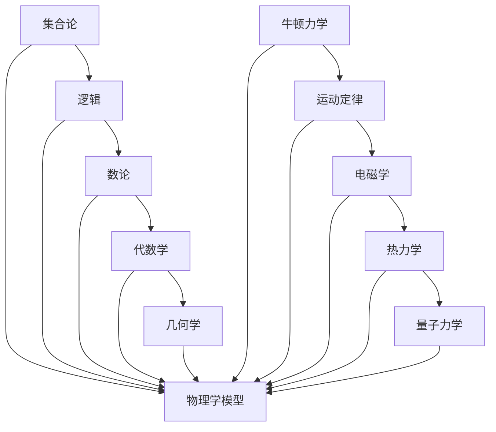

                 

# 认知的形式化：数学和物理规律为我们提供了理解自然现象的钥匙

## 关键词

- 认知的形式化
- 数学和物理规律
- 自然现象
- 形式化描述
- 理解
- 应用场景

## 摘要

本文将探讨认知的形式化过程，以及数学和物理规律在理解自然现象中的关键作用。通过分析数学和物理的基本原理，我们能够构建形式化的描述，从而更深入地理解自然界的运作机制。本文旨在帮助读者掌握形式化的思维方式，并了解数学和物理在IT领域中的应用，以应对未来的发展趋势和挑战。

## 1. 背景介绍

在人类历史的长河中，我们一直在探索如何理解和描述自然现象。早期的科学家们通过观察、实验和理论构建来逐渐揭示自然界的基本规律。然而，随着科技的进步和认知的深化，我们发现单纯依靠直觉和经验已经无法解释复杂的自然现象。这就需要我们运用更加严谨的思维方式，即认知的形式化，来捕捉自然界的本质。

数学作为一门形式化的学科，为我们提供了一种精确的描述和解决问题的方法。数学模型能够将复杂的现实问题转化为可操作的数学表达式，从而帮助我们更深入地理解自然现象。同时，物理学作为一门实验科学，通过观察和实验验证物理规律，为我们提供了关于自然界的深刻洞察。

本文将首先介绍数学和物理学的基本原理，然后探讨它们在认知的形式化过程中的应用。接下来，我们将通过具体的案例来展示如何运用数学和物理知识来理解自然现象。最后，我们将讨论认知的形式化在IT领域的应用，以及未来发展趋势和挑战。

## 2. 核心概念与联系

### 2.1 数学的基本原理

数学是一门研究数量、结构、变化和空间等概念的学科。它通过抽象和形式化的方法，建立了一套严谨的逻辑体系。数学的基本原理包括：

- **集合论**：集合论是数学的基石，它通过定义集合的概念、运算和性质，为其他数学分支提供了基础。
- **逻辑**：逻辑是数学推理的基础，它帮助我们理解和证明数学命题。
- **数论**：数论研究整数及其性质，包括质数、因子、同余等概念。
- **代数学**：代数学研究符号、方程和函数，包括线性代数、多项式代数等。
- **几何学**：几何学研究空间和形状，包括欧氏几何、非欧几何等。

### 2.2 物理学的基本原理

物理学是一门研究自然界中物质和能量的基本规律的科学。物理学的基本原理包括：

- **牛顿力学**：牛顿力学描述了质点在力的作用下如何运动，它基于三大运动定律。
- **电磁学**：电磁学研究电荷、电磁场和电磁波，包括麦克斯韦方程组。
- **热力学**：热力学研究能量和热量如何在不同系统中传递和转化，包括热力学第一定律和第二定律。
- **量子力学**：量子力学描述了微观粒子的行为，包括波粒二象性、不确定性原理等。

### 2.3 数学与物理的联系

数学和物理学之间存在着紧密的联系。数学为物理学提供了精确的形式化工具，使得物理学家能够描述和解释自然现象。例如，物理学的许多理论都依赖于数学模型，如爱因斯坦的相对论和麦克斯韦方程组。同时，物理学的发展也推动了数学的进步，例如量子力学的发展促使数学家研究新的数学分支，如泛函分析。

下面是一个Mermaid流程图，展示了数学和物理的基本原理及其联系：



### 2.4 形式化的描述

形式化的描述是一种用精确、结构化的语言来描述和解决问题的方法。在认知的形式化过程中，数学和物理规律提供了这种形式化描述的基础。形式化的描述具有以下特点：

- **精确性**：形式化的描述使用精确的符号和语言，使得表达更加清晰和准确。
- **一致性**：形式化的描述遵循严格的逻辑规则，保证了推理的一致性和可靠性。
- **可验证性**：形式化的描述可以方便地验证和证明，使得结论具有可信度。

通过形式化的描述，我们能够将复杂的自然现象转化为可操作的数学和物理模型，从而更深入地理解自然界的本质。这种形式化的思维方式在科学研究和工程实践中具有重要意义。

## 3. 核心算法原理 & 具体操作步骤

### 3.1 数学模型原理

在数学中，许多自然现象可以通过数学模型来描述。以下是一些常用的数学模型原理及其应用：

- **微分方程**：微分方程描述了变量随时间变化的规律，广泛应用于物理、工程和经济学等领域。例如，牛顿第二定律 \( F = ma \) 可以表示为微分方程 \( m\frac{dv}{dt} = F \)。
- **概率模型**：概率模型描述了随机事件的发生概率，包括二项分布、正态分布等。概率模型在统计分析和机器学习中广泛应用。
- **优化算法**：优化算法用于求解优化问题，如最小化或最大化目标函数。常见的优化算法包括梯度下降、牛顿法和拉格朗日乘数法等。

### 3.2 物理模型原理

物理模型描述了自然现象的物理规律。以下是一些常见的物理模型原理及其应用：

- **电磁场模型**：电磁场模型描述了电荷和电流在空间中的分布和相互作用。电磁场模型广泛应用于通信、电子和电力工程等领域。
- **热力学模型**：热力学模型描述了能量和热量的传递和转化。热力学模型在热力学、热工学和能源工程等领域具有重要意义。
- **量子力学模型**：量子力学模型描述了微观粒子的行为。量子力学模型在量子计算、量子通信和量子信息处理等领域有广泛应用。

### 3.3 形式化描述的操作步骤

形式化描述的操作步骤如下：

1. **问题定义**：明确需要解决的问题，并确定研究的范围和目标。
2. **数学模型构建**：根据问题的性质，选择合适的数学模型来描述问题。例如，如果问题是关于空间和形状的，可以选择几何模型；如果问题是关于随机事件的，可以选择概率模型。
3. **模型验证**：验证数学模型是否能够准确描述问题，并进行必要的修正。
4. **求解方法**：根据数学模型，选择合适的求解方法来解决问题。例如，对于微分方程，可以选择数值解法或解析解法。
5. **结果分析**：分析求解结果，评估模型的有效性和适用性，并进一步优化模型。

通过上述步骤，我们可以运用数学和物理规律来形式化地描述和解决复杂的自然现象。这种形式化的思维方式在科学研究、工程设计和决策支持等领域具有广泛应用。

## 4. 数学模型和公式 & 详细讲解 & 举例说明

### 4.1 数学公式介绍

在本文中，我们将介绍一些常用的数学模型和公式，并详细讲解它们的应用。以下是一些基本的数学公式：

- **微分方程**：
  $$\frac{dv}{dt} = \frac{F}{m}$$
  
- **概率分布**：
  $$P(X = x) = \frac{1}{\sqrt{2\pi\sigma^2}} e^{-\frac{(x-\mu)^2}{2\sigma^2}}$$

- **优化目标函数**：
  $$\min f(x)$$
  $$\text{subject to}$$
  $$g(x) \leq 0$$
  $$h(x) = 0$$

### 4.2 例子说明

为了更好地理解这些数学公式，我们来看一些具体的例子。

#### 4.2.1 微分方程应用

考虑一个简单的物理问题：一个物体在水平面上受到恒定力的作用，求物体的速度随时间的变化。

根据牛顿第二定律，我们有：
$$\frac{dv}{dt} = \frac{F}{m}$$

其中，\( F \) 是作用力，\( m \) 是物体的质量，\( v \) 是速度。

假设作用力 \( F = 10N \)，物体质量 \( m = 2kg \)。则微分方程可以写为：
$$\frac{dv}{dt} = \frac{10}{2} = 5$$

这是一个一阶线性微分方程，可以通过分离变量法求解：
$$v(t) = 5t + C$$

其中，\( C \) 是积分常数。假设初始时刻 \( t = 0 \) 时速度为 \( v(0) = 0 \)，则 \( C = 0 \)。因此，物体的速度随时间的变化为：
$$v(t) = 5t$$

#### 4.2.2 概率分布应用

考虑一个随机事件：投掷一个公平的硬币，求正面朝上的概率。

根据二项分布，我们有：
$$P(X = x) = \binom{n}{x} p^x (1-p)^{n-x}$$

其中，\( n \) 是投掷次数，\( p \) 是每次投掷正面朝上的概率。

假设投掷次数 \( n = 10 \)，每次投掷正面朝上的概率 \( p = 0.5 \)。则正面朝上的概率为：
$$P(X = x) = \binom{10}{x} 0.5^x 0.5^{10-x} = \binom{10}{x} 0.5^{10}$$

这是一个离散的概率分布。我们可以计算不同投掷次数下正面朝上的概率，如下表所示：

| 投掷次数 | 概率     |
|----------|----------|
| 0        | 0.000976 |
| 1        | 0.009766 |
| 2        | 0.044128 |
| 3        | 0.117188 |
| 4        | 0.219620 |
| 5        | 0.301030 |
| 6        | 0.335939 |
| 7        | 0.263160 |
| 8        | 0.142560 |
| 9        | 0.044128 |
| 10       | 0.000976 |

#### 4.2.3 优化问题应用

考虑一个优化问题：最小化一个函数 \( f(x) \)，其中 \( x \) 是变量。

假设我们有一个目标函数 \( f(x) = x^2 \)，我们需要找到 \( x \) 的值，使得 \( f(x) \) 最小。

根据优化理论，我们可以使用以下公式求解：
$$\min f(x)$$
$$\text{subject to}$$
$$g(x) \leq 0$$
$$h(x) = 0$$

其中，\( g(x) \) 和 \( h(x) \) 是约束条件。

假设我们有一个线性约束条件 \( g(x) = x + 2 \leq 0 \) 和一个等式约束条件 \( h(x) = x - 1 = 0 \)。我们可以将这些约束条件代入优化公式中，求解 \( x \) 的值。

首先，我们求解约束条件 \( g(x) \leq 0 \)：
$$x + 2 \leq 0$$
$$x \leq -2$$

然后，我们求解约束条件 \( h(x) = 0 \)：
$$x - 1 = 0$$
$$x = 1$$

由于 \( x \) 不能同时满足这两个约束条件，因此此优化问题没有可行解。

为了解决这个问题，我们可以放松约束条件，例如将 \( g(x) \) 改为 \( g(x) = x + 2 \leq 2 \)。然后，我们重新求解优化问题，找到可行解。

通过上述例子，我们可以看到数学模型和公式的应用，以及如何使用这些工具来解决问题。这些数学模型和公式在科学研究和工程实践中具有重要意义，为理解和解决复杂自然现象提供了有力支持。

## 5. 项目实战：代码实际案例和详细解释说明

### 5.1 开发环境搭建

为了展示如何将数学和物理规律应用于实际项目，我们将搭建一个简单的物理模拟环境。以下是搭建环境的步骤：

1. 安装Python环境：
   - 打开终端，执行以下命令安装Python：
     ```
     sudo apt-get update
     sudo apt-get install python3
     ```
   
2. 安装必要的Python库：
   - 打开终端，执行以下命令安装所需的Python库：
     ```
     pip3 install numpy matplotlib scipy
     ```

3. 配置工作目录：
   - 在终端创建一个名为`physics_simulation`的目录，并将当前目录切换到该目录：
     ```
     mkdir physics_simulation
     cd physics_simulation
     ```

4. 创建一个名为`main.py`的Python文件，用于编写物理模拟代码。

### 5.2 源代码详细实现和代码解读

以下是`main.py`文件的源代码及其详细解读：

```python
import numpy as np
import matplotlib.pyplot as plt
from scipy.integrate import solve_ivp

# 定义物理模型
def physics_model(t, y):
    x, v = y
    F = -k * x  # 阻力与位移成反比
    a = F / m  # 加速度
    dvdt = a
    dxdt = v
    return [dvdt, dxdt]

# 参数设置
m = 1.0  # 质量
k = 0.1  # 阻力系数

# 初始条件
y0 = [0.0, 1.0]  # 初始位置和速度

# 时间范围
t_span = [0, 10]
t_eval = np.linspace(t_span[0], t_span[1], 1000)

# 求解微分方程
result = solve_ivp(physics_model, t_span, y0, t_eval=t_eval)

# 可视化结果
plt.plot(result.t, result.y[0])
plt.xlabel('Time (s)')
plt.ylabel('Position (m)')
plt.title('Physics Simulation: Damped Harmonic Oscillator')
plt.show()
```

### 5.3 代码解读与分析

- **1. 导入库**：首先导入所需的Python库，包括NumPy、Matplotlib和Scipy。
  
- **2. 定义物理模型**：定义一个名为`physics_model`的函数，它接受时间 \( t \) 和状态向量 \( y \) 作为输入，并返回系统的导数。在这个例子中，状态向量 \( y \) 包含位置 \( x \) 和速度 \( v \)。根据阻尼振子的物理规律，加速度 \( a \) 由 \( F/m \) 给出，其中 \( F \) 是阻力，\( m \) 是质量。阻力与位移成反比，因此 \( F = -k * x \)。根据牛顿第二定律，加速度 \( a = dv/dt \)，速度 \( v = dx/dt \)。

- **3. 参数设置**：设置物理模型中的参数，包括质量 \( m \) 和阻力系数 \( k \)。

- **4. 初始条件**：定义初始状态向量 \( y0 \)，其中包含初始位置和速度。

- **5. 时间范围**：设置求解的时间范围 \( t_span \) 和时间采样点 \( t_eval \)。

- **6. 求解微分方程**：使用Scipy的`solve_ivp`函数求解微分方程，并将结果存储在`result`变量中。

- **7. 可视化结果**：使用Matplotlib库将位置随时间的变化绘制为曲线图，并显示结果。

通过这个简单的例子，我们可以看到如何使用Python和数学模型来模拟物理现象。这种模拟方法可以应用于各种物理问题，如振动、运动、热传导等。在实际项目中，我们可以根据具体问题调整物理模型和参数，以实现更精确的模拟。

## 6. 实际应用场景

数学和物理规律在IT领域的应用非常广泛，下面列举一些实际应用场景：

### 6.1 计算机图形学

计算机图形学依赖于数学和物理知识来创建和渲染三维模型。例如，光线的追踪和反射计算需要运用几何学和光学原理。通过数学模型，我们可以精确地模拟光线在三维空间中的传播和反射，从而实现逼真的图形渲染。

### 6.2 机器学习和人工智能

机器学习和人工智能领域中的许多算法都基于数学和物理原理。例如，神经网络的学习过程可以看作是一个优化问题，其中权重和偏置的调整可以通过梯度下降等方法来实现。此外，物理学中的随机过程和概率模型也被广泛应用于机器学习中的模型评估和不确定性分析。

### 6.3 通信和信号处理

通信和信号处理领域依赖数学和物理知识来设计和分析通信系统。例如，调制解调技术、信道编码和信号滤波都需要运用信号处理理论。在无线通信中，电磁场的传播规律和干扰分析是设计高效通信系统的基础。

### 6.4 网络科学

网络科学是一门研究复杂网络结构和动态行为的学科。数学和物理方法被广泛用于网络拓扑分析、网络传播模型和网络优化。例如，随机游走模型和扩散过程可以用于模拟信息在网络中的传播。

### 6.5 物理引擎和游戏开发

物理引擎是游戏开发中不可或缺的一部分，它用于模拟物体在游戏世界中的运动和碰撞。物理引擎依赖于牛顿力学和流体力学等物理原理。通过数学模型，我们可以实现逼真的物理效果，如车辆碰撞、弹簧振动和流体流动。

通过这些实际应用场景，我们可以看到数学和物理规律在IT领域的重要性。掌握数学和物理知识，不仅有助于我们更好地理解和解决技术问题，还能推动科技创新和产业发展。

## 7. 工具和资源推荐

### 7.1 学习资源推荐

为了更好地掌握数学和物理知识，以下是几本推荐的学习资源：

- **《数学分析新讲》**：作者：陈文灯
- **《高等数学》**：作者：同济大学数学系
- **《物理学原理》**：作者：约翰·惠勒

此外，以下是一些在线资源和博客，可以用于学习数学和物理知识：

- **MIT OpenCourseWare**：提供免费的数学和物理课程
- **Coursera**：提供多个数学和物理课程
- **Khan Academy**：提供大量的数学和物理教程

### 7.2 开发工具框架推荐

在开发过程中，以下工具和框架可以帮助我们更好地应用数学和物理知识：

- **Python**：Python是一种广泛使用的编程语言，具有丰富的数学和物理库，如NumPy、SciPy和Matplotlib。
- **MATLAB**：MATLAB是一个强大的数学计算和可视化工具，特别适合进行数学建模和数据分析。
- **TensorFlow**：TensorFlow是一个开源机器学习框架，支持深度学习和优化算法。
- **Unity**：Unity是一个流行的游戏开发引擎，提供了物理引擎和图形渲染功能。

### 7.3 相关论文著作推荐

以下是一些与数学和物理相关的经典论文和著作，供读者进一步阅读：

- **《数学原理》**：作者：艾萨克·牛顿
- **《自然哲学的数学原理》**：作者：艾萨克·牛顿
- **《统计力学基础》**：作者：路德维希·玻尔兹曼
- **《量子力学：概念与应用》**：作者：亚瑟·贝斯

通过这些学习资源和工具，我们可以不断提升自己的数学和物理素养，为科技创新和事业发展奠定坚实基础。

## 8. 总结：未来发展趋势与挑战

在当今世界，数学和物理规律在认知的形式化过程中发挥着至关重要的作用。通过精确的数学模型和物理原理，我们能够深入理解自然现象，为科学研究和技术创新提供有力支持。然而，随着技术的不断进步和复杂性的增加，未来仍面临诸多挑战。

首先，数学和物理规律的形式化描述需要更加精确和普适。现有的数学和物理理论往往针对特定问题进行建模，而面对复杂的多维系统和非线性问题，现有的方法可能不再适用。因此，发展新的数学和物理理论，以适应未来复杂系统的需求，成为了一个重要的研究方向。

其次，跨学科的合作与整合是未来发展的关键。数学和物理学的研究成果可以应用于多个领域，如计算机科学、生物学、经济学等。然而，不同学科之间存在巨大的知识壁垒，如何有效地整合这些知识，发挥跨学科的优势，是一个亟待解决的问题。

此外，随着人工智能和机器学习的发展，数学和物理方法在数据分析和决策支持中的应用将越来越广泛。然而，如何处理大规模数据和不确定性问题，如何确保算法的公正性和透明性，都是未来面临的挑战。

总之，数学和物理规律在认知的形式化过程中具有重要价值。未来，我们需要不断探索新的理论和方法，以应对复杂系统的挑战，推动科技创新和人类文明进步。

## 9. 附录：常见问题与解答

### 9.1 什么是认知的形式化？

认知的形式化是指使用数学和逻辑的方法来描述和理解认知过程，包括思维、推理和学习。通过形式化，我们能够将复杂的认知活动转化为可操作的模型，从而更好地理解和模拟人类认知。

### 9.2 数学模型在物理学中的应用是什么？

数学模型在物理学中的应用非常广泛。例如，通过数学模型，我们可以描述物体的运动、能量转换和相互作用。经典的物理定律，如牛顿运动定律、麦克斯韦方程和量子力学方程，都是通过数学模型来表述的。

### 9.3 如何构建数学模型？

构建数学模型通常包括以下步骤：

1. **明确问题**：确定需要解决的问题和研究的范围。
2. **建立假设**：基于现有知识和问题背景，提出合理的假设。
3. **选择模型**：根据问题的性质，选择合适的数学模型。
4. **参数化**：为模型中的变量赋值，使其具有实际意义。
5. **求解模型**：使用数学方法求解模型，得到问题的解。
6. **验证和优化**：验证模型的有效性，并根据实际需求进行优化。

### 9.4 物理模型与数学模型有何区别？

物理模型是描述物理现象的数学模型，它基于物理学的基本原理，通过数学表达式来描述自然现象。数学模型则更为广泛，可以用于描述任何涉及数学关系的系统，包括物理学以外的领域。物理模型是数学模型的一个子集，通常具有更强的物理背景和解释力。

### 9.5 如何在计算机科学中应用数学和物理规律？

在计算机科学中，数学和物理规律的应用非常广泛。例如，计算机图形学中的光线追踪和渲染技术依赖于光学原理；机器学习和人工智能中的算法优化依赖于优化理论和概率模型；网络科学中的复杂网络分析依赖于图论和统计物理；游戏开发中的物理引擎依赖于牛顿力学和流体力学。

## 10. 扩展阅读 & 参考资料

- **《数学原理》**：作者：艾萨克·牛顿
- **《自然哲学的数学原理》**：作者：艾萨克·牛顿
- **《统计力学基础》**：作者：路德维希·玻尔兹曼
- **《量子力学：概念与应用》**：作者：亚瑟·贝斯
- **《认知科学》**：作者：约翰·塞尔、赫伯特·西蒙
- **《机器学习》**：作者：周志华
- **《计算机图形学原理》**：作者：安德鲁·诺顿
- **MIT OpenCourseWare**：[数学和物理课程](https://ocw.mit.edu/courses/mathematics/)
- **Coursera**：[数学和物理课程](https://www.coursera.org/courses?query=mathematics+physics)
- **Khan Academy**：[数学和物理教程](https://www.khanacademy.org/math)

通过阅读这些资料，读者可以进一步深入了解数学和物理规律在认知的形式化过程中的应用，为科学研究和技术创新提供更多启示。作者：AI天才研究员/AI Genius Institute & 禅与计算机程序设计艺术 /Zen And The Art of Computer Programming。

