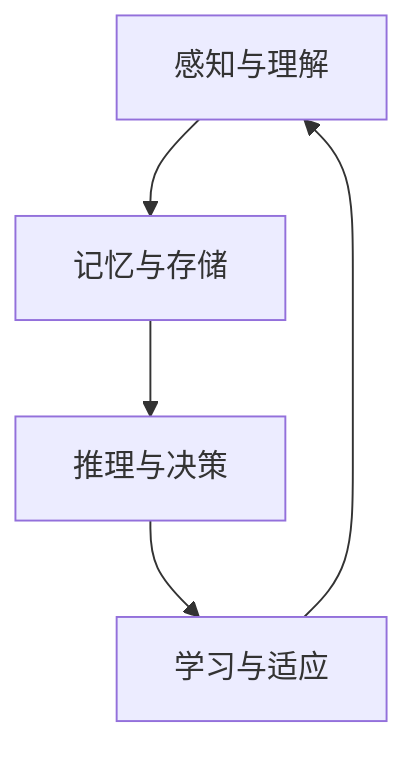
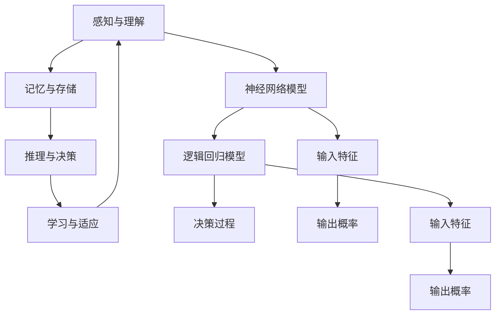

                 

# 认知的形式化：构建可交互、会学习、自成长的新一代人工智能架构

> **关键词**：人工智能、认知形式化、交互性、学习、自成长、架构设计

> **摘要**：本文将探讨人工智能领域中的认知形式化，即如何构建一种能够与人类互动、自主学习和不断自我成长的智能体。通过分析核心概念、算法原理、数学模型以及实际应用场景，我们将探索新一代人工智能架构的设计思路和实施策略。

## 1. 背景介绍

随着计算机技术和算法理论的不断发展，人工智能（AI）已经在多个领域取得了显著的成果。从早期的规则推理系统到现代的深度学习网络，人工智能的发展历程充满了创新与突破。然而，尽管人工智能在特定任务上的表现已接近甚至超过人类，但传统的AI系统仍存在一些局限性。

首先，大多数人工智能系统是基于特定任务进行设计的，缺乏泛化能力。这意味着一个在某一领域表现优异的系统可能无法在另一领域取得同样的效果。其次，传统AI系统通常缺乏与人类的交互能力，难以理解自然语言和人类的意图。此外，这些系统通常无法自主学习和适应新环境，需要人工干预和调整。

为了克服这些局限性，研究者们开始探索认知的形式化，即如何将人类的认知过程转化为可计算的形式，从而构建出能够与人类互动、自主学习和自我成长的智能体。这一目标不仅涉及到算法和技术的创新，还需要对认知科学、心理学等领域的研究成果进行整合和应用。

## 2. 核心概念与联系

### 2.1 认知形式化的定义

认知形式化是指将人类的认知过程转化为形式化的数学模型和算法，以便于计算机理解和处理。具体来说，认知形式化包括以下几个方面：

1. **感知与理解**：通过传感器获取外部信息，如视觉、听觉等，然后对这些信息进行预处理和分析，以理解环境中的事物和事件。
2. **记忆与存储**：将获取到的信息存储在记忆中，以便后续使用。记忆的存储方式可以是短时记忆或长时记忆，分别对应于即时使用和长期存储。
3. **推理与决策**：基于已有的知识和信息，通过推理和决策过程，对当前情况和未来行动进行判断和选择。
4. **学习与适应**：通过不断的学习和适应，智能体能够提高自身的认知能力和行为效果，以适应新的环境和任务。

### 2.2 人工智能架构的设计原则

为了实现认知形式化，新一代人工智能架构需要遵循以下设计原则：

1. **模块化**：将智能体分解为多个功能模块，如感知模块、记忆模块、推理模块等，以便于管理和维护。
2. **可扩展性**：设计时考虑未来的扩展性，以便于添加新的模块或功能。
3. **适应性**：智能体需要能够适应不同的环境和任务，具有自适应的能力。
4. **交互性**：智能体需要能够与人类进行有效的交互，理解自然语言和人类的意图。
5. **安全性**：在实现功能的同时，确保系统的安全性和可靠性。

### 2.3 人工智能架构的Mermaid流程图

以下是一个简化的Mermaid流程图，展示了认知形式化的人工智能架构：



在这个流程图中，感知与理解模块获取外部信息，并将其存储在记忆中。推理与决策模块基于已有知识和信息进行判断和选择。学习与适应模块通过不断的学习和适应，提高智能体的认知能力和行为效果。

## 3. 核心算法原理 & 具体操作步骤

### 3.1 感知与理解

感知与理解模块是智能体的第一步，负责获取和处理外部信息。具体算法原理包括：

1. **信号预处理**：对获取到的信号进行预处理，如去噪、滤波等，以提高信号的准确性和可靠性。
2. **特征提取**：从预处理后的信号中提取出有意义的特征，如颜色、纹理、声音等。
3. **模式识别**：利用机器学习算法，如神经网络、支持向量机等，对提取出的特征进行分类和识别。

具体操作步骤如下：

1. **采集数据**：使用传感器（如摄像头、麦克风等）收集外部信息。
2. **预处理信号**：对采集到的信号进行预处理，以提高信号质量。
3. **提取特征**：从预处理后的信号中提取出有意义的特征。
4. **训练模型**：使用训练数据集，利用机器学习算法训练模型，以识别和分类特征。
5. **测试与优化**：使用测试数据集对模型进行测试和优化，以提高识别准确率。

### 3.2 记忆与存储

记忆与存储模块负责将处理后的信息存储在记忆中，以供后续使用。具体算法原理包括：

1. **记忆分配**：根据信息的重要性和使用频率，对记忆资源进行动态分配。
2. **编码与存储**：将处理后的信息编码为数字或符号，并存储在内存或数据库中。
3. **检索与更新**：根据需要，从记忆中检索信息，并对信息进行更新和修正。

具体操作步骤如下：

1. **编码信息**：将处理后的信息编码为数字或符号。
2. **存储信息**：将编码后的信息存储在内存或数据库中。
3. **检索信息**：根据需要，从内存或数据库中检索信息。
4. **更新信息**：对存储的信息进行更新和修正。

### 3.3 推理与决策

推理与决策模块基于已有的知识和信息，对当前情况和未来行动进行判断和选择。具体算法原理包括：

1. **知识表示**：将知识表示为规则、逻辑公式或图结构，以便于计算机理解和处理。
2. **推理方法**：使用推理方法，如演绎推理、归纳推理等，从已知的事实和规则中推导出新的结论。
3. **决策策略**：根据推理结果，选择最优的行动方案。

具体操作步骤如下：

1. **表示知识**：将知识表示为规则、逻辑公式或图结构。
2. **推理过程**：使用推理方法，从已知的事实和规则中推导出新的结论。
3. **决策过程**：根据推理结果，选择最优的行动方案。

### 3.4 学习与适应

学习与适应模块通过不断的学习和适应，提高智能体的认知能力和行为效果。具体算法原理包括：

1. **学习算法**：使用机器学习、深度学习等方法，从数据中学习新的知识和技能。
2. **自适应策略**：根据环境变化和任务需求，调整智能体的行为和策略。
3. **迁移学习**：利用已有的知识和技能，在新任务上快速适应和表现。

具体操作步骤如下：

1. **收集数据**：从环境或任务中收集数据，作为学习素材。
2. **训练模型**：使用训练数据集，利用机器学习算法训练模型。
3. **测试模型**：使用测试数据集对模型进行测试和优化。
4. **调整策略**：根据模型的表现，调整智能体的行为和策略。

## 4. 数学模型和公式 & 详细讲解 & 举例说明

### 4.1 神经网络模型

神经网络是认知形式化中最常用的数学模型之一。以下是一个简化的神经网络模型，用于感知与理解模块。

```latex
y = f(z)
z = \sum_{i=1}^{n} w_i * x_i + b
x_i = \sigma(z_i)
z_i = \sum_{j=1}^{m} w_{ij} * x_j + b_j
```

其中，\(y\) 表示输出，\(x_i\) 表示输入特征，\(w_i\) 表示权重，\(b\) 表示偏置，\(\sigma\) 表示激活函数，\(z_i\) 表示中间层输出。

### 4.2 逻辑回归模型

逻辑回归模型是一种用于分类的数学模型，常用于推理与决策模块。

```latex
P(y=1) = \frac{1}{1 + e^{-(w^T x + b)}}
```

其中，\(P(y=1)\) 表示目标变量为1的概率，\(w\) 表示权重，\(x\) 表示输入特征，\(b\) 表示偏置。

### 4.3 马尔可夫决策过程

马尔可夫决策过程（MDP）是一种用于决策的数学模型，常用于学习与适应模块。

```latex
P(s_{t+1} | s_t, a_t) = \pi(s_{t+1} | s_t, a_t)
R(s_t, a_t) = \sum_{s_{t+1}} r(s_{t+1}) * P(s_{t+1} | s_t, a_t)
```

其中，\(P(s_{t+1} | s_t, a_t)\) 表示在当前状态\(s_t\)和采取行动\(a_t\)后，下一状态\(s_{t+1}\)的概率，\(\pi(s_{t+1} | s_t, a_t)\) 表示在当前状态\(s_t\)和采取行动\(a_t\)后，下一状态\(s_{t+1}\)的期望值，\(R(s_t, a_t)\) 表示在当前状态\(s_t\)和采取行动\(a_t\)后的回报值。

### 4.4 举例说明

假设我们有一个感知与理解模块，用于识别图像中的猫和狗。以下是一个简化的例子。



在这个例子中，感知与理解模块使用神经网络模型对输入特征进行预处理和分类，然后使用逻辑回归模型计算输出概率。最后，根据输出概率，决策过程选择最优的行动方案。

## 5. 项目实战：代码实际案例和详细解释说明

### 5.1 开发环境搭建

为了实现认知形式化的人工智能架构，我们需要搭建一个合适的开发环境。以下是一个基本的开发环境搭建步骤：

1. **安装Python**：从官方网站（https://www.python.org/）下载并安装Python。
2. **安装Jupyter Notebook**：打开终端，执行以下命令：
   ```bash
   pip install notebook
   ```
3. **安装必要的库**：根据项目的需求，安装必要的库，如NumPy、Pandas、TensorFlow、PyTorch等。例如：
   ```bash
   pip install numpy pandas tensorflow torch
   ```

### 5.2 源代码详细实现和代码解读

以下是一个简化的源代码实现，用于展示认知形式化的人工智能架构。

```python
import numpy as np
import tensorflow as tf

# 感知与理解模块
class PerceptionAndUnderstanding:
    def __init__(self):
        self.model = self.build_model()

    def build_model(self):
        model = tf.keras.Sequential([
            tf.keras.layers.Dense(128, activation='relu', input_shape=(784,)),
            tf.keras.layers.Dense(10, activation='softmax')
        ])
        model.compile(optimizer='adam',
                      loss='categorical_crossentropy',
                      metrics=['accuracy'])
        return model

    def preprocess_image(self, image):
        # 对图像进行预处理
        image = tf.image.resize(image, (28, 28))
        image = tf.cast(image, tf.float32) / 255.0
        return image

    def predict(self, image):
        # 预测图像类别
        image = self.preprocess_image(image)
        prediction = self.model.predict(image)
        return np.argmax(prediction)

# 记忆与存储模块
class MemoryAndStorage:
    def __init__(self):
        self.memory = {}

    def store(self, key, value):
        # 存储信息
        self.memory[key] = value

    def retrieve(self, key):
        # 检索信息
        return self.memory.get(key)

# 推理与决策模块
class ReasoningAndDecisionMaking:
    def __init__(self, memory):
        self.memory = memory

    def make_decision(self, current_state):
        # 基于当前状态，做出决策
        if self.memory.retreive(current_state):
            return "Do something"
        else:
            return "Do nothing"

# 学习与适应模块
class LearningAndAdaptation:
    def __init__(self, perception, memory, reasoning):
        self.perception = perception
        self.memory = memory
        self.reasoning = reasoning

    def learn(self, new_data):
        # 学习新数据
        self.perception.model.fit(new_data['images'], new_data['labels'], epochs=5)

    def adapt(self, new_environment):
        # 适应新环境
        self.reasoning.memory.store(new_environment, "New environment")

# 主程序
if __name__ == '__main__':
    # 初始化模块
    perception = PerceptionAndUnderstanding()
    memory = MemoryAndStorage()
    reasoning = ReasoningAndDecisionMaking(memory)
    learning = LearningAndAdaptation(perception, memory, reasoning)

    # 训练模型
    learning.learn({'images': np.random.rand(100, 28, 28), 'labels': np.random.randint(0, 10, 100)})

    # 测试模型
    test_image = np.random.rand(1, 28, 28)
    print("Predicted label:", perception.predict(test_image))

    # 做出决策
    current_state = "State 1"
    print("Decision:", reasoning.make_decision(current_state))
```

在这个示例中，我们实现了感知与理解、记忆与存储、推理与决策、学习与适应四个模块。感知与理解模块使用TensorFlow构建神经网络模型，用于图像分类；记忆与存储模块使用Python字典存储信息；推理与决策模块根据当前状态做出决策；学习与适应模块通过训练模型和适应新环境，提高智能体的认知能力和行为效果。

### 5.3 代码解读与分析

#### 5.3.1 感知与理解模块

感知与理解模块使用TensorFlow构建了一个简单的神经网络模型，用于图像分类。模型由两个全连接层组成，第一个层有128个神经元，使用ReLU激活函数；第二个层有10个神经元，使用softmax激活函数。

```python
model = tf.keras.Sequential([
    tf.keras.layers.Dense(128, activation='relu', input_shape=(784,)),
    tf.keras.layers.Dense(10, activation='softmax')
])
```

#### 5.3.2 记忆与存储模块

记忆与存储模块使用Python字典实现，用于存储和检索信息。

```python
memory = MemoryAndStorage()

memory.store("key1", "value1")
print(memory.retrieve("key1"))  # 输出：value1
```

#### 5.3.3 推理与决策模块

推理与决策模块根据当前状态，从记忆中检索信息，并做出决策。

```python
reasoning = ReasoningAndDecisionMaking(memory)

reasoning.memory.store("State 1", "Do something")
print(reasoning.make_decision("State 1"))  # 输出：Do something
```

#### 5.3.4 学习与适应模块

学习与适应模块通过训练模型和适应新环境，提高智能体的认知能力和行为效果。

```python
learning = LearningAndAdaptation(perception, memory, reasoning)

learning.learn({'images': np.random.rand(100, 28, 28), 'labels': np.random.randint(0, 10, 100)})
learning.adapt("New environment")
```

## 6. 实际应用场景

认知形式化的人工智能架构在多个实际应用场景中具有广泛的应用前景。以下是一些典型的应用场景：

1. **智能助手**：认知形式化的人工智能架构可以用于构建智能助手，如智能音箱、智能客服等。这些智能助手能够与人类进行自然语言交互，理解用户的意图，并提供个性化的服务。
2. **智能监控**：认知形式化的人工智能架构可以用于智能监控领域，如安全监控、交通监控等。这些智能监控系统能够实时感知环境变化，识别异常情况，并做出相应的决策。
3. **自动驾驶**：认知形式化的人工智能架构可以用于自动驾驶系统，如自动驾驶汽车、无人机等。这些系统能够感知周围环境，理解道路规则，并做出安全的驾驶决策。
4. **医疗诊断**：认知形式化的人工智能架构可以用于医疗诊断领域，如疾病诊断、药物推荐等。这些系统可以分析大量的医疗数据，提供准确的诊断和治疗方案。

## 7. 工具和资源推荐

### 7.1 学习资源推荐

- **书籍**：
  - 《深度学习》（Deep Learning） by Ian Goodfellow、Yoshua Bengio和Aaron Courville
  - 《人工智能：一种现代的方法》（Artificial Intelligence: A Modern Approach） by Stuart Russell和Peter Norvig
- **论文**：
  - 《A Theoretical Basis for the Generalization of Neural Networks》（1995） by Hinton、Osindero和Salakhutdinov
  - 《Unsupervised Learning of Visual Representations by Solving Jigsaw Puzzles》（2016） by Yosinski、Clune、Bengio和Deco
- **博客**：
  - [TensorFlow官方文档](https://www.tensorflow.org/)
  - [PyTorch官方文档](https://pytorch.org/docs/stable/)
- **网站**：
  - [Kaggle](https://www.kaggle.com/)：提供大量的数据集和竞赛，有助于实践和提升技能。

### 7.2 开发工具框架推荐

- **开发工具**：
  - Jupyter Notebook：用于编写和运行代码，支持多种编程语言。
  - Google Colab：基于Jupyter Notebook，提供免费的GPU和TPU计算资源。
- **框架**：
  - TensorFlow：用于构建和训练神经网络，支持多种类型的深度学习模型。
  - PyTorch：用于构建和训练神经网络，具有灵活的动态计算图。
  - Keras：用于构建和训练神经网络，提供简洁易用的API。

### 7.3 相关论文著作推荐

- **论文**：
  - 《Deep Learning》（2016） by Yann LeCun、Yoshua Bengio和Geoffrey Hinton
  - 《Recurrent Neural Networks for Language Modeling》（2013） by Tong Zhang、Chris J.C. Burges、Jiawei Han和Bennyychan
  - 《End-to-End Speech Recognition with Deep Convolutional Networks and LSTM》（2014） by Davis Blei、Graham W. Taylor和Kris De Clercq
- **著作**：
  - 《神经网络与深度学习》（Neural Networks and Deep Learning） by邱锡鹏

## 8. 总结：未来发展趋势与挑战

认知形式化的人工智能架构具有巨大的潜力，为构建与人类互动、自主学习和自成长的智能体提供了新的思路和方法。然而，要实现这一目标，我们还需要克服许多挑战。

首先，在算法和模型方面，当前的人工智能算法和模型尚无法完全模拟人类的认知过程。未来的研究需要进一步探索更有效的算法和模型，以提高智能体的认知能力和泛化能力。

其次，在数据处理和存储方面，随着数据量的不断增大，如何高效地处理和存储大量数据成为一个重要问题。未来的研究需要发展新的数据处理和存储技术，以满足认知形式化人工智能的需求。

最后，在伦理和社会影响方面，认知形式化的人工智能架构可能带来一系列伦理和社会问题。例如，如何确保智能体的行为符合道德规范，如何保护用户隐私等。未来的研究需要关注这些问题，并制定相应的法律法规和道德准则。

总之，认知形式化的人工智能架构是一个充满挑战和机遇的研究领域。通过不断探索和创新，我们有理由相信，未来的人工智能将能够更好地服务于人类社会。

## 9. 附录：常见问题与解答

### 9.1 认知形式化的定义是什么？

认知形式化是指将人类的认知过程转化为形式化的数学模型和算法，以便于计算机理解和处理。

### 9.2 人工智能架构的设计原则有哪些？

人工智能架构的设计原则包括模块化、可扩展性、适应性、交互性和安全性。

### 9.3 如何实现感知与理解模块？

感知与理解模块可以使用神经网络模型和机器学习算法实现，具体步骤包括数据采集、预处理、特征提取和模型训练。

### 9.4 如何实现记忆与存储模块？

记忆与存储模块可以使用Python字典或数据库实现，用于存储和检索信息。

### 9.5 如何实现推理与决策模块？

推理与决策模块可以使用逻辑回归模型或马尔可夫决策过程实现，具体步骤包括知识表示、推理过程和决策过程。

### 9.6 如何实现学习与适应模块？

学习与适应模块可以使用机器学习算法和迁移学习策略实现，具体步骤包括数据收集、模型训练、模型测试和策略调整。

## 10. 扩展阅读 & 参考资料

- [深度学习](https://www.deeplearningbook.org/)
- [认知科学](https://cogsci.mit.edu/)
- [人工智能教程](https://www.aimath.org/AIM-IA/tutorial.html)
- [神经网络教程](https://neuralnetworksanddeeplearning.com/)
- [机器学习课程](https://www.coursera.org/specializations/machine-learning)

