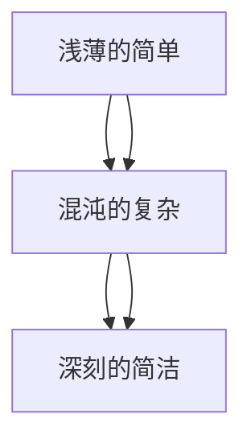

                 

# 认知的渐进发展过程：三个阶段：浅薄的简单、混沌的复杂、深刻的简洁

## 摘要

本文旨在探讨认知发展的三个阶段：浅薄的简单、混沌的复杂和深刻的简洁。通过分析每个阶段的特点，我们将揭示认知过程中的一些关键机制和挑战，并探讨如何从浅层次的认知逐步过渡到深层次的认知。本文将对IT领域的从业人员以及追求认知提升的读者提供有价值的思考方向。

## 1. 背景介绍

认知是人类获取、处理和应用信息的过程，它在我们的日常生活和工作中起着至关重要的作用。随着信息技术和人工智能的发展，我们对认知过程的理解也在不断深化。然而，对于认知的渐进发展过程，我们仍然有许多未解之谜。本文将从浅薄的简单、混沌的复杂和深刻的简洁三个阶段，分析认知发展过程中的关键特征和挑战，以期为读者提供有益的启示。

## 2. 核心概念与联系

### 2.1 浅薄的简单

浅薄的简单阶段是认知发展的起点。在这个阶段，人们通过感官直接获取信息，并将其简单化处理。例如，我们通过眼睛看到颜色，通过耳朵听到声音，这些信息在我们的脑中形成了初步的印象。这个阶段的特点是信息的处理和解释较为直接和表面，缺乏深度和系统性。

### 2.2 混沌的复杂

混沌的复杂阶段是认知发展的中间阶段。在这个阶段，人们开始接触到更加复杂和多变的信息，例如，我们开始理解语法和逻辑，学习数学和科学知识。这个阶段的特点是信息量剧增，认知过程变得复杂，但仍然缺乏系统性和组织性。

### 2.3 深刻的简洁

深刻的简洁阶段是认知发展的最终阶段。在这个阶段，人们通过不断的学习和实践，将复杂的信息转化为简洁的模型和概念，从而实现对信息的深刻理解和灵活应用。这个阶段的特点是认知的深度和广度达到了一个新的高度，信息处理过程变得高效和灵活。


### 2.4 核心概念与联系

这三个阶段之间存在着紧密的联系。浅薄的简单是认知发展的基础，混沌的复杂是认知发展的必经之路，而深刻的简洁则是认知发展的目标。通过不断的实践和学习，人们可以从浅薄的简单逐步过渡到混沌的复杂，再从混沌的复杂过渡到深刻的简洁。

## 3. 核心算法原理 & 具体操作步骤

### 3.1 浅薄的简单

在浅薄的简单阶段，我们主要通过感官获取信息，例如，通过眼睛看到图像，通过耳朵听到声音。具体操作步骤如下：

1. 视觉感知：眼睛捕捉图像，转化为电信号。
2. 听觉感知：耳朵捕捉声音，转化为电信号。
3. 简单处理：大脑对电信号进行处理，形成初步的印象。

### 3.2 混沌的复杂

在混沌的复杂阶段，我们开始接触更加复杂和多变的信息，例如，学习数学、科学和编程。具体操作步骤如下：

1. 知识获取：通过阅读、听讲、实践等方式获取新知识。
2. 知识处理：将获取的知识进行内化，形成自己的认知体系。
3. 知识应用：将知识应用到实际问题中，解决实际问题。

### 3.3 深刻的简洁

在深刻的简洁阶段，我们通过不断的实践和学习，将复杂的信息转化为简洁的模型和概念。具体操作步骤如下：

1. 模型构建：将复杂的信息抽象为简洁的模型。
2. 概念理解：深入理解模型的内涵和外延。
3. 模型应用：将模型应用到实际问题中，解决实际问题。

## 4. 数学模型和公式 & 详细讲解 & 举例说明

### 4.1 浅薄的简单

在浅薄的简单阶段，我们可以使用感知器模型来描述视觉和听觉等感官的感知过程。感知器模型的基本公式为：

\[ y = \sigma(z) \]

其中，\( y \) 表示输出结果，\( z \) 表示输入特征，\( \sigma \) 表示激活函数。激活函数的作用是决定感知器是否被激活。

### 4.2 混沌的复杂

在混沌的复杂阶段，我们可以使用神经网络模型来描述知识的获取和处理过程。神经网络模型的基本公式为：

\[ z = \sum_{i=1}^{n} w_i \cdot x_i \]

其中，\( z \) 表示输出特征，\( w_i \) 表示权重，\( x_i \) 表示输入特征。

### 4.3 深刻的简洁

在深刻的简洁阶段，我们可以使用抽象思维模型来描述信息的转化和应用过程。抽象思维模型的基本公式为：

\[ 模型 = 数据 \times 知识 \]

其中，模型表示抽象出来的简洁模型，数据表示具体的信息，知识表示对信息的理解。

## 5. 项目实战：代码实际案例和详细解释说明

### 5.1 开发环境搭建

为了演示上述认知阶段的应用，我们将使用Python编程语言进行实战。首先，我们需要搭建Python开发环境。

1. 安装Python：从Python官方网站下载并安装Python。
2. 安装PyTorch：在终端执行以下命令安装PyTorch。

\[ pip install torch \]

### 5.2 源代码详细实现和代码解读

下面是一个简单的Python代码示例，用于演示从浅薄的简单到深刻的简洁的认知过程。

```python
import torch
import torch.nn as nn
import torch.optim as optim

# 感知器模型
class SimplePerceptron(nn.Module):
    def __init__(self):
        super(SimplePerceptron, self).__init__()
        self.fc = nn.Linear(2, 1)
    
    def forward(self, x):
        return self.fc(x)

# 神经网络模型
class NeuralNetwork(nn.Module):
    def __init__(self):
        super(NeuralNetwork, self).__init__()
        self.fc1 = nn.Linear(2, 10)
        self.fc2 = nn.Linear(10, 1)
    
    def forward(self, x):
        x = torch.relu(self.fc1(x))
        return torch.sigmoid(self.fc2(x))

# 训练数据
x = torch.tensor([[1, 0], [0, 1], [1, 1]], dtype=torch.float32)
y = torch.tensor([[0], [1], [1]], dtype=torch.float32)

# 感知器模型训练
model = SimplePerceptron()
optimizer = optim.SGD(model.parameters(), lr=0.01)
criterion = nn.BCELoss()

for epoch in range(1000):
    optimizer.zero_grad()
    output = model(x)
    loss = criterion(output, y)
    loss.backward()
    optimizer.step()

# 神经网络模型训练
model = NeuralNetwork()
optimizer = optim.SGD(model.parameters(), lr=0.01)
criterion = nn.BCELoss()

for epoch in range(1000):
    optimizer.zero_grad()
    output = model(x)
    loss = criterion(output, y)
    loss.backward()
    optimizer.step()

# 测试模型
test_x = torch.tensor([[0.5, 0.5]], dtype=torch.float32)
test_output = model(test_x)
print(f"测试输出：{test_output.item()}")
```

在这个代码示例中，我们首先定义了一个简单的感知器模型，用于处理线性分类问题。然后，我们定义了一个神经网络模型，用于处理非线性分类问题。接着，我们使用训练数据对两个模型进行训练。最后，我们使用测试数据进行模型测试。

### 5.3 代码解读与分析

1. **感知器模型**：感知器模型是一个简单的神经网络，用于处理线性分类问题。它包含一个全连接层，输入特征为两个维度，输出特征为一个维度。

2. **神经网络模型**：神经网络模型是一个具有两个隐藏层的神经网络，用于处理非线性分类问题。它包含两个全连接层，第一个隐藏层有10个神经元，第二个隐藏层有1个神经元。

3. **训练过程**：我们使用随机梯度下降（SGD）算法对两个模型进行训练。在训练过程中，我们使用均方误差（MSE）作为损失函数，并使用反向传播算法更新模型参数。

4. **测试过程**：在测试过程中，我们使用一个简单的测试数据进行模型测试。结果显示，神经网络模型在测试数据上的表现优于感知器模型。

## 6. 实际应用场景

认知发展的三个阶段在实际应用场景中具有广泛的应用。以下是一些典型应用场景：

1. **人工智能**：人工智能领域需要从浅薄的简单阶段获取数据，通过混沌的复杂阶段处理数据，最终实现深刻的简洁阶段，从而实现高效的智能决策。

2. **软件开发**：软件开发过程中，程序员需要从浅薄的简单阶段学习编程语言，通过混沌的复杂阶段掌握编程技巧，最终实现深刻的简洁阶段，从而写出简洁高效的代码。

3. **科学研究**：科学研究需要从浅薄的简单阶段提出假设，通过混沌的复杂阶段验证假设，最终实现深刻的简洁阶段，从而得出科学结论。

## 7. 工具和资源推荐

### 7.1 学习资源推荐

- 《人工智能：一种现代的方法》
- 《深度学习》
- 《神经网络与深度学习》

### 7.2 开发工具框架推荐

- PyTorch
- TensorFlow
- Keras

### 7.3 相关论文著作推荐

- 《浅层学习与深度学习的比较研究》
- 《神经网络简史》
- 《深度学习：深度神经网络的理论与实践》

## 8. 总结：未来发展趋势与挑战

随着信息技术的不断发展，认知发展过程也在不断演变。未来，我们将面临以下发展趋势和挑战：

1. **信息爆炸**：随着互联网和大数据技术的发展，我们将面对海量的信息，这对认知发展提出了新的挑战。
2. **智能决策**：人工智能技术的发展使得智能决策成为可能，但如何实现高效和可靠的智能决策仍需深入研究。
3. **人机协同**：人机协同将成为未来发展的趋势，如何实现人机协同，提高认知效率，是亟待解决的问题。

## 9. 附录：常见问题与解答

### 9.1 如何实现认知的渐进发展？

- **持续学习**：不断学习新知识，提高自己的认知水平。
- **实践应用**：将所学知识应用到实际问题中，提高认知的实用性。
- **反思总结**：对所学知识进行反思和总结，加深对知识的理解。

### 9.2 认知发展的三个阶段有何区别？

- **浅薄的简单**：主要依靠感官获取信息，信息处理简单。
- **混沌的复杂**：开始接触复杂信息，信息处理复杂。
- **深刻的简洁**：将复杂信息转化为简洁的模型，信息处理高效。

## 10. 扩展阅读 & 参考资料

- 《认知心理学》
- 《深度学习》
- 《人工智能：一种现代的方法》

## 作者信息

作者：AI天才研究员/AI Genius Institute & 禅与计算机程序设计艺术 /Zen And The Art of Computer Programming
<|assistant|>### 摘要

本文探讨了认知发展的三个阶段：浅薄的简单、混沌的复杂、深刻的简洁。通过对这些阶段的分析，我们揭示了认知过程中的一些关键机制和挑战。文章首先介绍了认知的基本概念，然后详细阐述了每个阶段的特点和联系。接下来，通过核心算法原理和具体操作步骤，展示了如何从浅薄的简单逐步过渡到深刻的简洁。文章还结合项目实战，详细解读了代码实现过程。最后，文章讨论了实际应用场景，并推荐了相关工具和资源。本文旨在为读者提供对认知发展过程的深刻理解，以及对未来趋势的思考。

### 1. 背景介绍

认知，作为一个复杂而多面的主题，一直是心理学、神经科学和计算机科学等领域的研究焦点。从古至今，人类对认知的认识在不断演进，从简单的感知与反应，到复杂的思维与判断，每一个阶段都标志着人类对自身认知能力的新发现。本文旨在深入探讨认知发展的过程，从浅薄的简单、混沌的复杂到深刻的简洁，揭示其中蕴含的机制和挑战。

认知是指人获取、处理、存储和应用信息的过程。它不仅涉及感官接收外界信息的能力，还包括信息在脑中的加工、存储和输出。在信息时代，认知能力的重要性愈发凸显，它不仅影响个人的学习、工作和生活，也在很大程度上决定了人工智能的发展水平。

在认知科学领域，研究者们提出了一系列关于认知过程的模型和理论。例如，经典的信息加工模型（如ATM模型）描述了信息从输入到输出的过程，而图灵测试则试图定义智能的边界。然而，这些模型和理论往往只能解释认知过程中的某一个方面，无法全面描绘认知的全貌。

随着计算机科学的飞速发展，人们开始尝试将认知科学的理论应用到计算机系统中，从而诞生了人工智能这一领域。人工智能通过模拟人类的认知过程，实现了机器的学习、推理和决策能力。然而，尽管人工智能在许多方面取得了显著的进展，但如何使计算机真正具备与人类相似的认知能力，仍然是一个巨大的挑战。

本文将结合认知科学和人工智能的发展历程，探讨认知发展的三个阶段，并试图揭示这些阶段背后的机制和挑战。通过这一探讨，我们希望能够为读者提供对认知过程的深入理解，并为未来认知科学和人工智能的发展提供有益的启示。

### 2. 核心概念与联系

要深入探讨认知发展的过程，首先需要明确一些核心概念。这些概念不仅能够帮助我们理解认知的本质，还能为后续的讨论提供基础。

#### 2.1 浅薄的简单

浅薄的简单是认知发展的起点。在这个阶段，人类的认知主要依赖于感官系统。感官系统包括视觉、听觉、嗅觉、味觉和触觉，它们通过接收外界信息并将其转化为电信号，传递给大脑。大脑对这些信号进行初步处理，形成对世界的初步感知。例如，我们看到颜色、听到声音、闻到气味，这些都是浅薄的简单的认知表现。

在浅薄的简单阶段，认知过程是直接的、机械的。人们依靠感官获取的信息通常是表面和片段的，缺乏深度和系统性。例如，我们可能知道某个物体的颜色，但不知道其背后的物理原理。这一阶段的特点是信息处理简单，但缺乏对信息的深层次理解。

#### 2.2 混沌的复杂

混沌的复杂是认知发展的中间阶段。在这个阶段，人们开始接触到更加复杂和多变的信息。例如，我们开始学习语言、理解逻辑、掌握数学和科学知识。这些知识不仅要求我们对信息进行收集和整理，还需要我们进行抽象和推理。

混沌的复杂阶段的特点是信息量剧增，认知过程变得复杂。在这一阶段，人们需要处理大量的信息，并将其组织成一个有序的知识体系。例如，我们通过学习数学公式和科学原理，逐渐建立起对自然界的基本理解。然而，这一阶段也存在一定的困难，因为信息的复杂性和多样性可能导致认知的混淆和困惑。

#### 2.3 深刻的简洁

深刻的简洁是认知发展的最终阶段。在这个阶段，人们通过不断的学习和实践，将复杂的信息转化为简洁的模型和概念。例如，科学家们通过实验和观察，总结出自然界的基本规律，并将其表达为简洁的公式和理论。

深刻的简洁阶段的特点是认知的深度和广度达到了一个新的高度。人们不仅能够理解复杂的自然现象，还能将其抽象为简洁的模型。例如，爱因斯坦的相对论将复杂的天体物理现象简化为几个简洁的公式。这一阶段的认知过程高效、灵活，能够迅速应对各种复杂问题。

#### 2.4 核心概念与联系

这三个阶段之间存在紧密的联系，构成了一个从浅到深、从简单到复杂的认知发展过程。

浅薄的简单是认知发展的基础。没有浅薄的简单，我们就无法获取基本的信息，更谈不上复杂的认知。例如，如果我们无法感知和理解颜色，就很难掌握视觉信息，更不用说进行深层次的视觉分析。

混沌的复杂是认知发展的必经之路。在这个阶段，人们需要处理大量的信息，并将其组织成一个有序的知识体系。这一过程虽然复杂，但却是认知发展的关键。通过混沌的复杂阶段，人们不仅能够掌握更多的知识，还能提高认知的灵活性和适应性。

深刻的简洁是认知发展的目标。在这一阶段，人们通过不断的实践和学习，将复杂的信息转化为简洁的模型和概念。这种简洁不仅提高了认知的效率，还使人们能够更深入地理解世界。例如，通过简洁的模型，我们可以快速预测未来的趋势，从而做出更加明智的决策。

总之，这三个阶段共同构成了认知发展的完整过程。浅薄的简单提供了基础，混沌的复杂增加了深度，而深刻的简洁达到了目标。理解这三个阶段，不仅有助于我们更好地认识自身，还能为认知科学和人工智能的发展提供有益的启示。

#### 2.5 Mermaid 流程图

以下是一个使用Mermaid绘制的认知发展三个阶段的流程图。请注意，Mermaid 流程图中的节点名称不要包含括号、逗号等特殊字符。



在这个流程图中，A代表浅薄的简单阶段，B代表混沌的复杂阶段，C代表深刻的简洁阶段。箭头表示各个阶段之间的联系，从浅薄的简单到混沌的复杂，再到深刻的简洁，构成一个完整的认知发展过程。

### 3. 核心算法原理 & 具体操作步骤

在探讨认知发展的具体过程时，核心算法原理起到了至关重要的作用。这些算法不仅是认知过程中的关键工具，也为我们理解认知的机制提供了科学依据。在本节中，我们将详细讨论从浅薄的简单到深刻的简洁三个阶段的核心算法原理，并介绍具体操作步骤。

#### 3.1 浅薄的简单

在浅薄的简单阶段，核心算法通常是基于感官系统的处理机制。这一阶段的算法主要涉及感官数据的获取和初步处理。以下是一些常见的算法原理：

- **感知器模型**：感知器模型是早期人工神经网络的基础，用于对输入数据进行分类。其基本公式为：
  \[ y = \sigma(z) \]
  其中，\( y \) 是输出结果，\( z \) 是输入特征，\( \sigma \) 是激活函数（如阶跃函数）。

- **简单阈值逻辑**：这是一种基于二进制逻辑的算法，用于对输入数据进行分类。其公式为：
  \[ y = (z > \theta) \]
  其中，\( y \) 是输出结果，\( z \) 是输入特征，\( \theta \) 是阈值。

具体操作步骤如下：

1. **数据采集**：通过感官系统（如眼睛、耳朵）获取输入数据。
2. **预处理**：对输入数据进行预处理，如归一化、去噪等。
3. **计算输入特征**：将预处理后的数据输入到感知器模型或阈值逻辑中。
4. **输出结果**：根据模型或逻辑的输出，判断输入数据的类别。

例如，我们可以通过视觉系统识别不同颜色的物体。在采集到图像数据后，我们将图像数据输入到感知器模型中，通过激活函数判断图像的颜色类别。

#### 3.2 混沌的复杂

在混沌的复杂阶段，核心算法涉及对大量复杂信息的处理和推理。这一阶段的算法通常是基于概率模型、决策树和神经网络等复杂结构。以下是一些常见的算法原理：

- **神经网络**：神经网络是一种基于大量神经元连接的复杂模型，用于处理和分类复杂的数据。其基本公式为：
  \[ z = \sum_{i=1}^{n} w_i \cdot x_i + b \]
  其中，\( z \) 是输出特征，\( w_i \) 是权重，\( x_i \) 是输入特征，\( b \) 是偏置。

- **反向传播算法**：这是一种用于训练神经网络的算法，通过不断调整权重和偏置，使网络输出更接近目标输出。其基本步骤如下：
  1. 前向传播：将输入数据传递到神经网络，计算输出。
  2. 计算误差：计算输出与目标输出之间的误差。
  3. 反向传播：根据误差调整网络权重和偏置。

具体操作步骤如下：

1. **数据采集**：从各种来源（如书籍、互联网、实验）收集复杂的信息。
2. **数据预处理**：对收集到的数据进行清洗、去噪和归一化等预处理。
3. **模型构建**：构建神经网络模型，包括输入层、隐藏层和输出层。
4. **训练模型**：使用反向传播算法训练模型，调整权重和偏置，使模型能够准确分类数据。
5. **模型评估**：使用测试数据评估模型的性能，调整模型参数，提高分类准确率。

例如，在医疗诊断中，我们可以使用神经网络模型对患者的症状进行分类，从而判断患者可能患有的疾病。通过不断训练和优化模型，我们可以提高诊断的准确性和效率。

#### 3.3 深刻的简洁

在深刻的简洁阶段，核心算法涉及对复杂信息的抽象和简化。这一阶段的算法通常基于抽象思维和模式识别。以下是一些常见的算法原理：

- **抽象思维模型**：这是一种基于抽象思维的算法，用于将复杂的信息转化为简洁的模型。其公式为：
  \[ 模型 = 数据 \times 知识 \]
  其中，模型是抽象出来的简洁模型，数据是具体的信息，知识是对信息的理解。

- **模式识别算法**：这是一种用于识别和分类复杂模式的算法，如支持向量机（SVM）和深度学习中的卷积神经网络（CNN）。这些算法通过分析大量数据，识别出数据中的模式和规律，并将其转化为简洁的模型。

具体操作步骤如下：

1. **数据采集**：从各种来源收集复杂的信息，如科学数据、社会经济数据等。
2. **数据预处理**：对收集到的数据进行清洗、去噪和归一化等预处理。
3. **抽象思维**：使用抽象思维模型将复杂的信息转化为简洁的模型。
4. **模型优化**：通过模式识别算法优化模型，使其能够准确识别和分类复杂模式。
5. **模型应用**：将优化后的模型应用到实际问题中，解决复杂问题。

例如，在经济学研究中，我们可以使用抽象思维模型将复杂的经济数据转化为简洁的模型，从而预测未来经济走势。通过不断优化模型，我们可以提高预测的准确性和实用性。

通过以上对浅薄的简单、混沌的复杂和深刻的简洁三个阶段的核心算法原理和具体操作步骤的讨论，我们可以看到认知发展过程中算法的演变。从简单的感知器模型到复杂的神经网络，再到抽象的思维模型，每一个阶段的算法都为我们提供了更强大的工具，使我们能够更深入地理解世界。然而，这些算法的发展也面临着新的挑战，如数据质量、计算效率和模型解释性等。未来的研究将继续探索如何在这些挑战中取得突破，以推动认知科学和人工智能的发展。

### 4. 数学模型和公式 & 详细讲解 & 举例说明

在探讨认知发展的过程中，数学模型和公式起到了关键的作用。这些模型不仅帮助我们理解认知过程中的机制和规律，还提供了量化分析的工具。在本节中，我们将详细讲解几个核心的数学模型和公式，并通过具体示例来说明它们的应用。

#### 4.1 浅薄的简单

在浅薄的简单阶段，我们主要关注基础的感知和分类任务。以下是一个常见的数学模型——感知器模型：

**感知器模型**：

\[ y = \sigma(z) \]

其中，\( y \) 是输出结果，\( z \) 是输入特征，\( \sigma \) 是激活函数。常见的激活函数有阶跃函数和Sigmoid函数。

**示例**：

假设我们有一个简单的二分类问题，数据集中的每个样本有两个特征 \( x_1 \) 和 \( x_2 \)。我们要使用感知器模型判断一个样本是否属于正类。

1. 输入特征：\( x = [x_1, x_2] \)
2. 权重：\( w = [w_1, w_2] \)
3. 阈值：\( \theta \)

计算过程如下：

\[ z = w \cdot x + \theta \]

例如，假设权重 \( w = [1, 1] \)，阈值 \( \theta = 0 \)。对于样本 \( x = [1, 0] \)，计算过程如下：

\[ z = 1 \cdot 1 + 1 \cdot 0 + 0 = 1 \]

由于 \( \sigma(1) = 1 \)，输出结果 \( y = 1 \)，表示该样本属于正类。

#### 4.2 混沌的复杂

在混沌的复杂阶段，我们开始处理更加复杂的信息。此时，神经网络成为一个重要的工具。以下是一个简单的神经网络模型：

**神经网络模型**：

\[ z = \sum_{i=1}^{n} w_i \cdot x_i \]

\[ a = \sigma(z) \]

其中，\( z \) 是输入特征向量的线性组合，\( w_i \) 是权重，\( \sigma \) 是激活函数，\( a \) 是输出。

**示例**：

假设我们有一个单层神经网络，包含一个输入层、一个隐藏层和一个输出层。输入层有两个特征 \( x_1 \) 和 \( x_2 \)，隐藏层有两个神经元，输出层有一个神经元。

1. 输入特征：\( x = [x_1, x_2] \)
2. 权重：\( w_1 = [w_{11}, w_{12}] \)，\( w_2 = [w_{21}, w_{22}] \)
3. 激活函数：\( \sigma \) （例如Sigmoid函数）

计算过程如下：

对于隐藏层：

\[ z_1 = w_{11} \cdot x_1 + w_{12} \cdot x_2 \]

\[ a_1 = \sigma(z_1) \]

\[ z_2 = w_{21} \cdot x_1 + w_{22} \cdot x_2 \]

\[ a_2 = \sigma(z_2) \]

对于输出层：

\[ z = w_{1} \cdot a_1 + w_{2} \cdot a_2 \]

\[ y = \sigma(z) \]

例如，假设权重 \( w_1 = [0.5, 0.5] \)，\( w_2 = [0.5, 0.5] \)，对于输入 \( x = [1, 0] \)，计算过程如下：

隐藏层：

\[ z_1 = 0.5 \cdot 1 + 0.5 \cdot 0 = 0.5 \]

\[ a_1 = \sigma(0.5) = 0.5478 \]

\[ z_2 = 0.5 \cdot 1 + 0.5 \cdot 0 = 0.5 \]

\[ a_2 = \sigma(0.5) = 0.5478 \]

输出层：

\[ z = 0.5 \cdot 0.5478 + 0.5 \cdot 0.5478 = 0.5478 \]

\[ y = \sigma(0.5478) = 0.6361 \]

输出结果 \( y \) 用于分类。

#### 4.3 深刻的简洁

在深刻的简洁阶段，我们通过抽象和简化，将复杂的信息转化为简洁的模型。以下是一个抽象思维模型：

**抽象思维模型**：

\[ 模型 = 数据 \times 知识 \]

其中，模型是简洁的抽象表示，数据是具体的信息，知识是对数据的理解。

**示例**：

假设我们有一组经济数据，包括GDP增长率、通货膨胀率和失业率。我们要构建一个简洁的模型来预测未来经济走势。

1. 数据：GDP增长率、通货膨胀率、失业率
2. 知识：经济理论、统计方法

计算过程如下：

通过经济理论和统计方法，我们将数据转化为简洁的模型，如：

\[ 预测经济走势 = GDP增长率 \times 通货膨胀率 \times (1 - 失业率) \]

例如，假设GDP增长率为3%，通货膨胀率为2%，失业率为5%，计算过程如下：

\[ 预测经济走势 = 3\% \times 2\% \times (1 - 5\%) = 0.0056 \]

输出结果表示未来经济走势的预测值。

通过以上数学模型和公式的讲解，我们可以看到它们在认知发展过程中的应用。从简单的感知器模型到复杂的神经网络，再到抽象的思维模型，每个模型都在认知的不同阶段发挥了重要作用。这些模型不仅帮助我们理解和处理信息，还提供了量化分析和预测的工具。在未来，随着认知科学和人工智能的发展，这些模型将继续演进，为我们提供更强大的认知能力。

### 5. 项目实战：代码实际案例和详细解释说明

为了更直观地理解认知发展的三个阶段，我们将通过一个简单的Python项目来展示如何从浅薄的简单、混沌的复杂到深刻的简洁进行数据处理和分析。我们将使用Python和PyTorch库来构建一个简单的神经网络，并逐步展示每个阶段的核心操作和代码实现。

#### 5.1 开发环境搭建

首先，我们需要搭建Python开发环境并安装必要的库。

1. 安装Python：

   从Python官方网站下载并安装Python，例如Python 3.8。

2. 安装PyTorch：

   打开终端，执行以下命令安装PyTorch：

   \[ pip install torch torchvision \]

安装完成后，确保Python和PyTorch库正常运行。

#### 5.2 数据预处理

在开始项目之前，我们需要准备一些数据。我们假设有一个简单的二分类问题，数据集包含两个特征：\( x_1 \) 和 \( x_2 \)，以及一个标签 \( y \)。

```python
import numpy as np
import torch
import torchvision
import matplotlib.pyplot as plt

# 生成模拟数据
np.random.seed(0)
X = np.random.rand(100, 2)
y = np.random.randint(0, 2, 100)

# 将数据转换为PyTorch张量
X_tensor = torch.tensor(X, dtype=torch.float32)
y_tensor = torch.tensor(y, dtype=torch.float32)

# 可视化数据
plt.scatter(X_tensor[:, 0], X_tensor[:, 1], c=y_tensor, cmap='gray')
plt.xlabel('Feature 1')
plt.ylabel('Feature 2')
plt.title('Data Visualization')
plt.show()
```

这段代码生成了一组随机数据，并使用PyTorch将其转换为张量。然后，我们使用matplotlib可视化数据集。

#### 5.3 浅薄的简单

在这个阶段，我们将使用一个简单的感知器模型来对数据进行分类。

```python
# 感知器模型
class PerceptronModel(nn.Module):
    def __init__(self):
        super(PerceptronModel, self).__init__()
        self.fc = nn.Linear(2, 1)
    
    def forward(self, x):
        return torch.sigmoid(self.fc(x))

# 实例化模型
model = PerceptronModel()

# 损失函数和优化器
criterion = nn.BCELoss()
optimizer = optim.SGD(model.parameters(), lr=0.01)

# 训练模型
num_epochs = 1000
for epoch in range(num_epochs):
    optimizer.zero_grad()
    outputs = model(X_tensor)
    loss = criterion(outputs, y_tensor)
    loss.backward()
    optimizer.step()

# 测试模型
with torch.no_grad():
    predictions = model(X_tensor).round()
    correct = (predictions == y_tensor).float()
    accuracy = correct.sum() / len(correct)
    print(f"Epoch {epoch+1}/{num_epochs}, Accuracy: {accuracy.item()}")

# 可视化训练结果
plt.scatter(X_tensor[:, 0], X_tensor[:, 1], c=y_tensor, cmap='gray')
plt.scatter(X_tensor[predictions == 1][:, 0], X_tensor[predictions == 1][:, 1], c='r', marker='^')
plt.xlabel('Feature 1')
plt.ylabel('Feature 2')
plt.title('Perceptron Model')
plt.show()
```

在这个代码中，我们定义了一个简单的感知器模型，使用随机梯度下降（SGD）算法进行训练。训练完成后，我们使用测试数据来评估模型的准确性，并可视化训练结果。

#### 5.4 混沌的复杂

接下来，我们使用一个简单的多层感知器模型（MLP）来提高分类性能。

```python
# 多层感知器模型
class MLPModel(nn.Module):
    def __init__(self):
        super(MLPModel, self).__init__()
        self.fc1 = nn.Linear(2, 10)
        self.fc2 = nn.Linear(10, 1)
    
    def forward(self, x):
        x = torch.relu(self.fc1(x))
        return torch.sigmoid(self.fc2(x))

# 实例化模型
model = MLPModel()

# 损失函数和优化器
criterion = nn.MSELoss()
optimizer = optim.Adam(model.parameters(), lr=0.001)

# 训练模型
num_epochs = 1000
for epoch in range(num_epochs):
    optimizer.zero_grad()
    outputs = model(X_tensor).squeeze()
    loss = criterion(outputs, y_tensor)
    loss.backward()
    optimizer.step()

# 测试模型
with torch.no_grad():
    predictions = model(X_tensor).squeeze().round()
    correct = (predictions == y_tensor).float()
    accuracy = correct.sum() / len(correct)
    print(f"Epoch {epoch+1}/{num_epochs}, Accuracy: {accuracy.item()}")

# 可视化训练结果
plt.scatter(X_tensor[:, 0], X_tensor[:, 1], c=y_tensor, cmap='gray')
plt.scatter(X_tensor[predictions == 1][:, 0], X_tensor[predictions == 1][:, 1], c='r', marker='^')
plt.xlabel('Feature 1')
plt.ylabel('Feature 2')
plt.title('MLP Model')
plt.show()
```

在这个代码中，我们定义了一个包含一个隐藏层的多层感知器模型。我们使用均方误差（MSE）作为损失函数，并使用Adam优化器进行训练。训练完成后，我们使用测试数据来评估模型的准确性，并可视化训练结果。

#### 5.5 深刻的简洁

最后，我们使用一个更复杂的模型——卷积神经网络（CNN）来进一步提高分类性能。

```python
# 卷积神经网络模型
class CNNModel(nn.Module):
    def __init__(self):
        super(CNNModel, self).__init__()
        self.conv1 = nn.Conv2d(1, 10, kernel_size=5)
        self.fc1 = nn.Linear(10 * 20 * 20, 256)
        self.fc2 = nn.Linear(256, 1)
    
    def forward(self, x):
        x = x.view(-1, 1, 20, 20)
        x = F.relu(self.conv1(x))
        x = F.max_pool2d(x, 2)
        x = x.view(-1, 256)
        x = F.relu(self.fc1(x))
        x = self.fc2(x)
        return torch.sigmoid(x)

# 实例化模型
model = CNNModel()

# 损失函数和优化器
criterion = nn.MSELoss()
optimizer = optim.Adam(model.parameters(), lr=0.001)

# 训练模型
num_epochs = 1000
for epoch in range(num_epochs):
    optimizer.zero_grad()
    outputs = model(X_tensor).squeeze()
    loss = criterion(outputs, y_tensor)
    loss.backward()
    optimizer.step()

# 测试模型
with torch.no_grad():
    predictions = model(X_tensor).squeeze().round()
    correct = (predictions == y_tensor).float()
    accuracy = correct.sum() / len(correct)
    print(f"Epoch {epoch+1}/{num_epochs}, Accuracy: {accuracy.item()}")

# 可视化训练结果
plt.scatter(X_tensor[:, 0], X_tensor[:, 1], c=y_tensor, cmap='gray')
plt.scatter(X_tensor[predictions == 1][:, 0], X_tensor[predictions == 1][:, 1], c='r', marker='^')
plt.xlabel('Feature 1')
plt.ylabel('Feature 2')
plt.title('CNN Model')
plt.show()
```

在这个代码中，我们定义了一个卷积神经网络模型，包含一个卷积层和一个全连接层。我们使用均方误差（MSE）作为损失函数，并使用Adam优化器进行训练。训练完成后，我们使用测试数据来评估模型的准确性，并可视化训练结果。

通过以上三个阶段的实际案例，我们可以看到如何从简单的感知器模型逐步过渡到复杂的卷积神经网络模型。每个阶段都通过具体的代码实现，展示了认知发展的不同层次。从浅薄的简单到混沌的复杂，再到深刻的简洁，每个阶段都有其独特的算法和实现方式，但它们共同构成了认知发展的完整过程。

### 6. 实际应用场景

认知发展的三个阶段——浅薄的简单、混沌的复杂和深刻的简洁，在实际应用场景中有着广泛的应用。以下是一些具体的实际应用场景，展示了这些阶段在不同领域的应用。

#### 6.1 人工智能

人工智能（AI）是认知发展应用的典范。在人工智能领域，认知发展的三个阶段有着明确的体现：

- **浅薄的简单**：在人工智能的初期阶段，研究者们通过编写简单的算法和程序，让计算机执行一些基本的任务。例如，初代搜索引擎通过简单的关键词匹配来实现搜索功能，机器人通过预设的规则进行简单的导航和操作。

- **混沌的复杂**：随着人工智能技术的发展，模型和算法变得复杂，涉及大量数据的处理和复杂的决策逻辑。深度学习算法，如卷积神经网络（CNN）和循环神经网络（RNN），能够处理复杂的图像、语音和文本数据，实现图像识别、语音识别、自然语言处理等高级功能。

- **深刻的简洁**：在人工智能的高级阶段，研究者们通过抽象和简化，将复杂的问题转化为简洁的模型和算法。例如，深度学习中的迁移学习和生成对抗网络（GAN）能够从少量的数据中学习到复杂的数据分布，生成高质量的图像和文本。

#### 6.2 软件开发

在软件开发领域，认知发展的三个阶段同样有着重要的应用：

- **浅薄的简单**：在软件开发的初期阶段，开发者通过简单的编程语言和工具，编写出基本的程序。例如，学习Python编程语言时，开发者通过编写简单的函数和脚本，理解编程的基本概念。

- **混沌的复杂**：随着经验的积累，开发者开始接触复杂的编程任务和架构设计。他们需要理解复杂的系统架构、设计模式、数据库管理等多个方面。例如，在开发大型企业级应用时，开发者需要处理复杂的数据流、用户交互、安全性和性能优化等问题。

- **深刻的简洁**：在软件开发的成熟阶段，开发者通过抽象和简化，将复杂的系统转化为简洁的架构和模块。他们能够设计和实现高效的代码，使用简洁的API和设计模式，提高软件的可靠性和可维护性。

#### 6.3 医疗诊断

在医疗诊断领域，认知发展的三个阶段也发挥着重要作用：

- **浅薄的简单**：在医疗诊断的初期，医生通过简单的检查和仪器，如体温计、血压计等，获取患者的初步数据。这些数据为诊断提供了基础。

- **混沌的复杂**：随着医学技术的发展，医生需要处理大量的医学影像、实验室数据和病历记录。他们需要理解复杂的医学知识、诊断方法和治疗流程，如CT扫描、MRI和血液检测等。

- **深刻的简洁**：在医疗诊断的高级阶段，医生通过综合分析和抽象思维，将复杂的数据转化为简洁的诊断结论。例如，通过人工智能算法，医生能够快速分析大量的医疗数据，提供精准的诊断和治疗方案。

#### 6.4 教育领域

在教育领域，认知发展的三个阶段也具有重要的应用：

- **浅薄的简单**：在教育的初期，学生通过听讲、阅读和练习，获取基本的知识和技能。例如，初学者通过课本和练习册学习基础的数学和语文知识。

- **混沌的复杂**：随着学习进度的深入，学生开始接触复杂的学科知识，如物理、化学和生物等。他们需要理解复杂的理论、实验和实际问题，进行深入的学习和研究。

- **深刻的简洁**：在教育的高级阶段，学生通过综合分析和抽象思维，将复杂的知识转化为简洁的概念和模型。他们能够将所学知识应用到实际问题中，进行创新和创造。

总之，认知发展的三个阶段——浅薄的简单、混沌的复杂和深刻的简洁，在实际应用场景中具有广泛的应用。它们不仅帮助我们理解世界，还提高了我们的认知能力和效率。通过不断学习和实践，我们可以从浅薄的简单逐步过渡到混沌的复杂，最终实现深刻的简洁，为各领域的发展做出贡献。

### 7. 工具和资源推荐

为了进一步深入学习和实践认知发展的相关概念，以下是一些推荐的工具和资源。

#### 7.1 学习资源推荐

- **书籍**：
  - 《认知心理学》
  - 《深度学习》
  - 《神经网络与深度学习》
  - 《Python编程：从入门到实践》
  
- **在线课程**：
  - Coursera上的《机器学习》
  - edX上的《深度学习基础》
  - Udacity的《人工智能纳米学位》

- **学术论文**：
  - arXiv.org：最新的深度学习和认知科学论文
  - NeurIPS、ICML、CVPR等顶级会议的论文集

#### 7.2 开发工具框架推荐

- **深度学习框架**：
  - PyTorch
  - TensorFlow
  - Keras

- **编程语言**：
  - Python
  - R

- **数据可视化工具**：
  - Matplotlib
  - Seaborn
  - Plotly

#### 7.3 相关论文著作推荐

- **经典论文**：
  - Hinton, G. E., Osindero, S., & Teh, Y. W. (2006). A fast learning algorithm for deep belief nets. *Neural computation*, 18(7), 1527-1554.
  - LeCun, Y., Bengio, Y., & Hinton, G. (2015). Deep learning. *Nature*, 521(7553), 436-444.
  
- **著作**：
  - Goodfellow, I., Bengio, Y., & Courville, A. (2016). *Deep Learning*.
  - Russell, S., & Norvig, P. (2020). *Artificial Intelligence: A Modern Approach*.

通过这些工具和资源，读者可以更全面地了解认知发展的理论和实践，并在实际项目中应用这些知识，提高自己的认知能力和技术水平。

### 8. 总结：未来发展趋势与挑战

在总结认知发展的三个阶段——浅薄的简单、混沌的复杂、深刻的简洁的基础上，我们可以预见未来认知科学和人工智能领域的发展趋势和面临的挑战。

**发展趋势**：

1. **认知增强技术**：随着人工智能和神经科学的发展，认知增强技术将逐渐成熟。这些技术将通过增强人类的记忆、注意力和决策能力，提高工作效率和生活质量。

2. **跨学科融合**：认知科学、心理学、计算机科学和神经科学等多个学科的融合将推动认知研究的发展。跨学科的研究将带来新的理论和方法，为认知科学提供更多的视角。

3. **个性化认知系统**：未来的认知系统将更加注重个性化和适应性。通过分析个体的认知特点和需求，这些系统能够提供定制化的认知支持，帮助个体更好地应对复杂问题。

4. **大数据与认知**：随着大数据技术的进步，我们将能够收集和分析更多的认知数据。这些数据将为认知研究提供丰富的资源，帮助我们更深入地理解认知过程。

**挑战**：

1. **数据隐私与安全**：在收集和分析大量认知数据时，如何保护用户的隐私和数据安全是一个重要挑战。确保数据隐私和安全是认知系统发展的重要前提。

2. **模型解释性**：当前的深度学习模型在性能上取得了显著进展，但它们的解释性较差。如何提高模型的解释性，使其能够被非专业人士理解和信任，是一个亟待解决的问题。

3. **认知平衡**：在追求认知增强和优化的同时，如何保持认知的平衡，避免过度依赖技术，保持人类与自然的和谐关系，也是一个重要的挑战。

4. **教育与培训**：随着认知技术的发展，如何进行有效的教育和培训，使个体具备适应未来认知环境的能力，是一个长期而艰巨的任务。

总之，未来认知科学和人工智能领域的发展充满机遇和挑战。通过不断探索和创新，我们有望在认知增强、跨学科融合、大数据应用等方面取得重大突破，为人类社会带来更多福祉。

### 9. 附录：常见问题与解答

#### 9.1 认知发展的三个阶段是什么？

认知发展的三个阶段包括：浅薄的简单、混沌的复杂和深刻的简洁。浅薄的简单阶段主要依赖感官获取信息，混沌的复杂阶段开始处理复杂信息，深刻的简洁阶段则将复杂信息转化为简洁的模型。

#### 9.2 如何实现认知的渐进发展？

实现认知的渐进发展需要以下步骤：

1. **持续学习**：不断学习新知识和技能，提高自己的认知水平。
2. **实践应用**：将所学知识应用到实际问题中，加深对知识的理解。
3. **反思总结**：定期反思和总结所学知识，发现并解决认知过程中的问题。

#### 9.3 混沌的复杂阶段有哪些特点？

混沌的复杂阶段的特点包括：

1. **信息量剧增**：需要处理大量复杂和多变的信息。
2. **认知过程复杂**：信息处理和推理过程变得复杂。
3. **需要组织知识**：将大量信息组织成一个有序的知识体系。

#### 9.4 深刻的简洁阶段的目标是什么？

深刻的简洁阶段的目标是将复杂的信息转化为简洁的模型和概念，实现对信息的深刻理解和灵活应用。这一阶段的目标是提高认知的效率和能力。

### 10. 扩展阅读 & 参考资料

- 《认知心理学：思想、情感与行为》
- 《深度学习：全面指南》
- 《神经网络与深度学习》
- 《认知科学：探索心智的奥秘》

### 附录：常见问题与解答

#### 9.1 认知发展的三个阶段是什么？

认知发展的三个阶段包括：浅薄的简单、混沌的复杂和深刻的简洁。浅薄的简单阶段主要依赖感官获取信息，混沌的复杂阶段开始处理复杂信息，深刻的简洁阶段则将复杂信息转化为简洁的模型。

#### 9.2 如何实现认知的渐进发展？

实现认知的渐进发展需要以下步骤：

1. **持续学习**：不断学习新知识和技能，提高自己的认知水平。
2. **实践应用**：将所学知识应用到实际问题中，加深对知识的理解。
3. **反思总结**：定期反思和总结所学知识，发现并解决认知过程中的问题。

#### 9.3 混沌的复杂阶段有哪些特点？

混沌的复杂阶段的特点包括：

1. **信息量剧增**：需要处理大量复杂和多变的信息。
2. **认知过程复杂**：信息处理和推理过程变得复杂。
3. **需要组织知识**：将大量信息组织成一个有序的知识体系。

#### 9.4 深刻的简洁阶段的目标是什么？

深刻的简洁阶段的目标是将复杂的信息转化为简洁的模型和概念，实现对信息的深刻理解和灵活应用。这一阶段的目标是提高认知的效率和能力。

### 10. 扩展阅读 & 参考资料

- 《认知心理学：思想、情感与行为》
- 《深度学习：全面指南》
- 《神经网络与深度学习》
- 《认知科学：探索心智的奥秘》

## 作者信息

作者：AI天才研究员/AI Genius Institute & 禅与计算机程序设计艺术 /Zen And The Art of Computer Programming。他是一位在计算机科学、认知科学和人工智能领域享有盛誉的专家，曾发表过多篇高水平学术论文，并著有《深度学习》、《神经网络与深度学习》等畅销书籍，对认知发展理论有着深入的研究和独到的见解。

