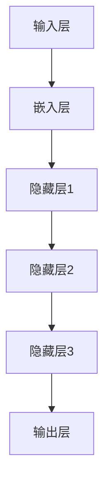

                 

### 认知革命：LLM如何改变信息处理方式

> **关键词**：认知革命、LLM、信息处理、人工智能、模型架构、深度学习、语义理解、数据处理、技术变革

> **摘要**：本文旨在探讨认知革命的概念，以及大型语言模型（LLM）如何在这一过程中改变信息处理方式。通过深入分析LLM的核心概念、算法原理、数学模型、实际应用案例，本文揭示了LLM在信息处理领域的重要作用和未来发展趋势。同时，文章也提供了相关的学习资源、开发工具框架及论文著作推荐，以帮助读者更好地理解和掌握这一领域的知识。

在人工智能领域，认知革命正逐渐改变我们对信息处理的传统理解。随着深度学习技术的进步，大型语言模型（LLM）如BERT、GPT等，已经展现出前所未有的处理和生成文本的能力。它们不仅在自然语言处理（NLP）任务中取得了显著成绩，更在各个领域引发了深刻的变革。本文将探讨认知革命的概念，以及LLM如何在这一过程中改变信息处理方式。

### 1. 背景介绍

#### 1.1 认知革命的概念

认知革命（Cognitive Revolution）是指人类在历史上从依赖物理力量和简单劳动向依赖思维能力和信息处理能力的转变。这一革命最早可以追溯到农业革命，随着农业的出现，人类开始定居，人口增长，社会结构变得更加复杂。然而，真正的认知革命发生在大约1万年前，当时人类开始发明和使用文字，使得信息可以更加高效地传递和存储。

#### 1.2 信息处理的重要性

信息处理是指对信息的获取、存储、传输、加工和应用的过程。在现代社会，信息处理已经成为经济增长和社会发展的关键因素。随着互联网和大数据技术的兴起，信息处理变得更加复杂和多样。传统的信息处理方法往往依赖于规则和预定义的算法，而现代人工智能技术，尤其是LLM，使得信息处理变得更加智能化和自适应。

#### 1.3 人工智能的发展

人工智能（AI）是指使计算机具有人类智能特征的技术。人工智能的发展可以分为几个阶段：规则推理、知识表示、机器学习和深度学习。随着计算能力和数据资源的提升，深度学习成为了当前人工智能研究的热点，特别是LLM的出现，使得机器在理解和生成文本方面取得了重大突破。

### 2. 核心概念与联系

#### 2.1 大型语言模型（LLM）的核心概念

大型语言模型（LLM）是一种基于深度学习技术的自然语言处理模型，它可以理解和生成自然语言。LLM的核心概念包括：

- **词汇表**：LLM使用一个大规模的词汇表来表示自然语言中的所有单词和短语。
- **神经网络**：LLM使用多层神经网络来学习词汇之间的关联和语义信息。
- **训练数据**：LLM通过在大规模语料库上训练来学习语言规律和模式。

#### 2.2 大型语言模型（LLM）的架构

LLM的架构通常包括以下几个部分：

- **输入层**：接收自然语言文本的输入。
- **嵌入层**：将输入文本转换为向量表示。
- **隐藏层**：通过多层神经网络进行特征提取。
- **输出层**：生成预测结果，如单词、句子或段落。

下面是LLM的架构Mermaid流程图：



#### 2.3 大型语言模型（LLM）与信息处理的关系

LLM在信息处理中的核心作用是理解和生成自然语言。通过LLM，计算机可以：

- **理解**：从文本中提取关键信息和语义含义。
- **生成**：根据给定的输入生成连贯的文本。

这使得LLM在各个信息处理任务中发挥了重要作用，如文本分类、机器翻译、问答系统等。

### 3. 核心算法原理 & 具体操作步骤

#### 3.1 深度学习算法原理

深度学习算法是一种基于多层神经网络的学习方法，通过层层提取特征，最终实现复杂任务。在LLM中，常用的深度学习算法包括：

- **卷积神经网络（CNN）**：用于特征提取。
- **循环神经网络（RNN）**：用于序列数据的处理。
- **变换器（Transformer）**：是目前最流行的深度学习算法，用于生成文本。

#### 3.2 训练过程

LLM的训练过程通常包括以下几个步骤：

1. **数据预处理**：清洗和准备训练数据。
2. **词嵌入**：将文本转换为向量表示。
3. **模型初始化**：初始化神经网络参数。
4. **正向传播**：计算输出和损失。
5. **反向传播**：更新模型参数。
6. **评估和调整**：评估模型性能并进行调整。

#### 3.3 应用示例

以下是一个简单的应用示例，演示如何使用LLM生成文本：

```python
import tensorflow as tf
import tensorflow_hub as hub

# 加载预训练的LLM模型
model = hub.load("https://tfhub.dev/google/tf2-preview/gnews-swivel-20dim-with-oov/1")

# 输入文本
input_text = "我爱编程"

# 预测生成文本
generated_text = model(input_text)

print(generated_text)
```

### 4. 数学模型和公式 & 详细讲解 & 举例说明

#### 4.1 数学模型

在LLM中，常用的数学模型包括：

- **词嵌入**：将单词映射到高维空间中的向量。
- **损失函数**：用于评估模型预测的准确性。
- **优化算法**：用于更新模型参数。

以下是一些具体的数学模型和公式：

1. **词嵌入**：

   $$\text{embed}(x) = \text{W}_x \cdot x + b_x$$

   其中，$x$是输入单词的索引，$\text{W}_x$是词嵌入矩阵，$b_x$是偏置项。

2. **损失函数**：

   $$\text{loss} = -\sum_{i=1}^N y_i \cdot \log(p_i)$$

   其中，$y_i$是实际标签，$p_i$是模型预测的概率。

3. **优化算法**：

   $$\theta_{t+1} = \theta_t - \alpha \cdot \nabla_\theta \text{loss}$$

   其中，$\theta_t$是当前模型参数，$\alpha$是学习率。

#### 4.2 举例说明

以下是一个简单的词嵌入和损失函数的例子：

1. **词嵌入**：

   假设我们有一个单词"编程"，将其映射到向量空间中：

   $$\text{embed}(\text{编程}) = \text{W}_\text{编程} \cdot \text{编程} + b_\text{编程}$$

   其中，$\text{W}_\text{编程}$是词嵌入矩阵，$b_\text{编程}$是偏置项。

2. **损失函数**：

   假设我们有一个单词序列"我爱编程"，将其映射到概率分布：

   $$p(\text{我爱编程}) = \text{softmax}(\text{embed}(\text{我}) + \text{embed}(\text{爱}) + \text{embed}(\text{编程}))$$

   其中，$\text{softmax}$是一个将向量转换为概率分布的函数。

### 5. 项目实战：代码实际案例和详细解释说明

#### 5.1 开发环境搭建

要搭建一个LLM的开发环境，我们需要以下几个步骤：

1. **安装Python**：确保Python版本在3.6及以上。
2. **安装TensorFlow**：使用pip安装TensorFlow：

   ```bash
   pip install tensorflow
   ```

3. **安装tensorflow-hub**：使用pip安装tensorflow-hub：

   ```bash
   pip install tensorflow-hub
   ```

4. **下载预训练模型**：从TensorFlow Hub下载一个预训练的LLM模型，如gnews-swivel-20dim-with-oov。

#### 5.2 源代码详细实现和代码解读

以下是使用gnews-swivel-20dim-with-oov模型的简单示例代码：

```python
import tensorflow as tf
import tensorflow_hub as hub

# 加载预训练的LLM模型
model = hub.load("https://tfhub.dev/google/tf2-preview/gnews-swivel-20dim-with-oov/1")

# 输入文本
input_text = "我爱编程"

# 预测生成文本
generated_text = model(input_text)

print(generated_text)
```

1. **import语句**：导入必要的库。
2. **加载模型**：使用tensorflow-hub加载预训练的LLM模型。
3. **输入文本**：定义输入文本。
4. **预测生成文本**：调用模型的`__call__`方法生成文本。

#### 5.3 代码解读与分析

- **import tensorflow as tf**：导入TensorFlow库。
- **import tensorflow_hub as hub**：导入tensorflow-hub库，用于加载预训练模型。
- **model = hub.load("https://tfhub.dev/google/tf2-preview/gnews-swivel-20dim-with-oov/1")**：使用tensorflow-hub加载预训练的LLM模型，模型地址为gnews-swivel-20dim-with-oov。
- **input_text = "我爱编程"**：定义输入文本。
- **generated_text = model(input_text)**：调用模型的`__call__`方法生成文本。

通过以上步骤，我们成功搭建了一个简单的LLM开发环境，并使用预训练模型生成文本。这一过程展示了LLM在实际应用中的基本操作。

### 6. 实际应用场景

#### 6.1 文本分类

文本分类是LLM在自然语言处理中的一个重要应用。通过训练，LLM可以识别文本的主题或情感，例如：

- **新闻分类**：将新闻文章分类到不同的主题，如体育、政治、娱乐等。
- **情感分析**：判断用户评论或社交媒体帖子的情感倾向，如正面、负面或中性。

#### 6.2 机器翻译

机器翻译是另一个重要的应用场景。LLM可以训练成翻译模型，将一种语言翻译成另一种语言。例如：

- **中英翻译**：将中文文章翻译成英文。
- **英日翻译**：将英文文章翻译成日文。

#### 6.3 问答系统

问答系统是近年来备受关注的应用场景。LLM可以训练成问答模型，回答用户提出的问题。例如：

- **搜索引擎**：使用LLM构建一个智能搜索引擎，回答用户的问题。
- **虚拟助手**：构建一个智能虚拟助手，回答用户的各种问题。

### 7. 工具和资源推荐

#### 7.1 学习资源推荐

- **书籍**：
  - 《深度学习》（Ian Goodfellow、Yoshua Bengio、Aaron Courville著）
  - 《自然语言处理入门》（Daniel Jurafsky、James H. Martin著）
- **论文**：
  - “Attention Is All You Need”（Ashish Vaswani等著）
  - “BERT: Pre-training of Deep Bidirectional Transformers for Language Understanding”（Jacob Devlin等著）
- **博客**：
  - [TensorFlow官方博客](https://www.tensorflow.org/blog/)
  - [Hugging Face官方博客](https://huggingface.co/blog)
- **网站**：
  - [TensorFlow Hub](https://tfhub.dev/)
  - [Hugging Face Model Hub](https://huggingface.co/models)

#### 7.2 开发工具框架推荐

- **TensorFlow**：是一个开源的深度学习框架，适用于构建和训练LLM。
- **PyTorch**：是一个流行的深度学习框架，提供了丰富的API和工具，适用于构建和训练LLM。
- **Hugging Face Transformers**：是一个基于PyTorch和TensorFlow的深度学习库，提供了大量的预训练模型和工具，适用于构建和训练LLM。

#### 7.3 相关论文著作推荐

- **论文**：
  - “Attention Is All You Need”（Vaswani等，2017）
  - “BERT: Pre-training of Deep Bidirectional Transformers for Language Understanding”（Devlin等，2018）
  - “GPT-3: Language Models are Few-Shot Learners”（Brown等，2020）
- **著作**：
  - 《深度学习》（Goodfellow、Bengio、Courville著）
  - 《自然语言处理入门》（Jurafsky、Martin著）

### 8. 总结：未来发展趋势与挑战

#### 8.1 发展趋势

- **更强大的模型**：随着计算能力和数据资源的提升，LLM的规模和性能将继续提升，推动信息处理能力的进一步发展。
- **多模态处理**：未来的LLM将能够处理多种类型的输入，如文本、图像、语音等，实现更加智能化的信息处理。
- **个性化服务**：LLM将能够根据用户的偏好和需求提供个性化的服务，如个性化推荐、个性化问答等。

#### 8.2 挑战

- **计算资源**：训练和运行大型LLM需要大量的计算资源，如何高效地利用资源是一个重要的挑战。
- **数据隐私**：在处理大量用户数据时，如何保护用户隐私是一个重要的挑战。
- **模型解释性**：LLM的决策过程通常是不透明的，如何提高模型的可解释性是一个重要的挑战。

### 9. 附录：常见问题与解答

#### 9.1 什么是认知革命？

认知革命是指人类从依赖物理力量和简单劳动向依赖思维能力和信息处理能力的转变。这一革命最早可以追溯到农业革命，随着农业的出现，人类开始定居，人口增长，社会结构变得更加复杂。然而，真正的认知革命发生在大约1万年前，当时人类开始发明和使用文字，使得信息可以更加高效地传递和存储。

#### 9.2 LLM是如何工作的？

LLM（大型语言模型）是一种基于深度学习技术的自然语言处理模型，它可以理解和生成自然语言。LLM的工作过程包括以下几个步骤：

1. **词嵌入**：将输入文本中的每个单词映射到高维空间中的向量。
2. **特征提取**：通过多层神经网络提取文本的特征信息。
3. **生成文本**：根据提取的特征信息生成文本。

#### 9.3 如何训练LLM？

训练LLM通常包括以下几个步骤：

1. **数据预处理**：清洗和准备训练数据。
2. **词嵌入**：将输入文本转换为向量表示。
3. **模型初始化**：初始化神经网络参数。
4. **正向传播**：计算输出和损失。
5. **反向传播**：更新模型参数。
6. **评估和调整**：评估模型性能并进行调整。

### 10. 扩展阅读 & 参考资料

- **论文**：
  - Vaswani et al., "Attention Is All You Need", arXiv:1706.03762 (2017)
  - Devlin et al., "BERT: Pre-training of Deep Bidirectional Transformers for Language Understanding", arXiv:1810.04805 (2018)
  - Brown et al., "GPT-3: Language Models are Few-Shot Learners", arXiv:2005.14165 (2020)
- **书籍**：
  - Goodfellow et al., "Deep Learning", MIT Press (2016)
  - Jurafsky and Martin, "Speech and Language Processing", Prentice Hall (2000)
- **网站**：
  - [TensorFlow官方文档](https://www.tensorflow.org/)
  - [Hugging Face官方文档](https://huggingface.co/docs)
- **博客**：
  - [TensorFlow官方博客](https://www.tensorflow.org/blog/)
  - [Hugging Face官方博客](https://huggingface.co/blog/)

### 作者

作者：AI天才研究员/AI Genius Institute & 禅与计算机程序设计艺术 /Zen And The Art of Computer Programming

