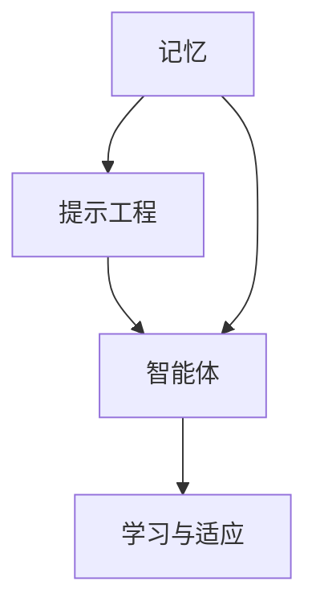

                 

# 记忆、提示工程、智能体的协同作用

## 关键词
- 记忆
- 提示工程
- 智能体
- 计算机科学
- 人工智能
- 机器学习
- 神经网络

## 摘要

本文旨在探讨记忆、提示工程与智能体之间的协同作用，从计算机科学的视角分析这三者如何相互影响、共同推动人工智能的发展。文章首先回顾了记忆的概念和重要性，接着介绍了提示工程的基本原理，并分析了智能体的定义和功能。通过深入剖析这三个领域的交互机制，本文揭示了它们在人工智能系统设计中的关键作用。此外，文章还讨论了当前的研究进展、实际应用场景，并提出了未来的发展趋势和面临的挑战。最后，本文提供了相关的学习资源、开发工具和参考文献，为读者进一步深入探索这一领域提供了指南。

## 1. 背景介绍

在计算机科学和人工智能领域，记忆、提示工程和智能体是三个至关重要的概念。它们不仅各自代表了领域中的重要研究方向，而且它们之间的协同作用也成为了推动人工智能技术不断进步的关键因素。

### 记忆

记忆是智能体获取、存储和使用信息的能力。在计算机科学中，记忆通常通过存储设备实现，如内存、硬盘等。而人工智能中的记忆则更具有动态性和智能性，它涉及数据的处理、检索和学习。记忆的重要性在于它为智能体提供了持续学习的能力，使其能够适应复杂多变的环境。

### 提示工程

提示工程是一种优化学习过程的技术，旨在通过提供有针对性的提示信息，帮助智能体更快、更准确地学习。提示工程的核心思想是利用人类专家的知识，将其转化为计算机可以理解和利用的形式，从而提高学习效率。提示工程在机器学习和深度学习领域有着广泛的应用，通过有效的提示策略，可以显著提升模型的性能。

### 智能体

智能体是指具备一定智能能力的计算实体，能够自主感知环境、制定决策并采取行动。智能体可以是单个的计算实体，如机器人、自动驾驶系统，也可以是多个实体组成的系统，如多智能体系统。智能体的功能包括感知、理解、决策、执行等，它们在各个领域，如工业自动化、金融分析、医疗诊断等，都有着重要的应用。

### 计算机科学和人工智能的发展

随着计算机科学和人工智能技术的不断进步，记忆、提示工程和智能体之间的协同作用日益显著。计算机硬件的快速发展，如GPU、TPU等专用处理器的出现，为深度学习模型提供了强大的计算能力，使得智能体的记忆和学习能力得到了极大的提升。同时，提示工程技术的不断成熟，也为智能体提供了更加高效的学习策略。这些技术的综合运用，使得人工智能系统在各个领域取得了显著的成果，如自然语言处理、计算机视觉、智能推荐等。

## 2. 核心概念与联系

### 记忆的概念

记忆是智能体获取、存储和使用信息的能力。在计算机科学中，记忆通常通过存储设备实现，如内存、硬盘等。而人工智能中的记忆则更具有动态性和智能性，它涉及数据的处理、检索和学习。

### 提示工程的概念

提示工程是一种优化学习过程的技术，旨在通过提供有针对性的提示信息，帮助智能体更快、更准确地学习。提示工程的核心思想是利用人类专家的知识，将其转化为计算机可以理解和利用的形式，从而提高学习效率。

### 智能体的概念

智能体是指具备一定智能能力的计算实体，能够自主感知环境、制定决策并采取行动。智能体可以是单个的计算实体，如机器人、自动驾驶系统，也可以是多个实体组成的系统，如多智能体系统。智能体的功能包括感知、理解、决策、执行等。

### 三者之间的联系

记忆、提示工程和智能体之间存在着紧密的联系。记忆为智能体提供了持续学习的能力，使其能够适应复杂多变的环境。提示工程通过提供有针对性的提示信息，帮助智能体更快、更准确地学习。而智能体则是记忆和提示工程的具体应用实体，通过感知环境、制定决策并采取行动，实现特定任务的目标。

### Mermaid 流程图



在这个流程图中，记忆、提示工程和智能体相互影响，共同推动智能体的学习与适应过程。记忆提供了基础信息，提示工程优化了学习过程，智能体则是具体的应用实体。

## 3. 核心算法原理 & 具体操作步骤

### 记忆算法原理

记忆算法的核心原理是基于数据存储和检索。在计算机科学中，常用的记忆算法包括哈希表、树结构、队列等。哈希表通过哈希函数将关键字映射到特定的内存地址，实现快速检索。树结构如二叉搜索树、平衡树等，通过分治策略实现对数据的快速访问。队列则通过先进先出的原则管理数据。

具体操作步骤如下：

1. 数据存储：根据数据类型和访问模式选择合适的记忆算法，将数据存储到内存中。
2. 数据检索：利用记忆算法提供的接口，快速检索所需数据。
3. 数据更新：根据需要更新内存中的数据。

### 提示工程算法原理

提示工程算法的核心原理是基于人类专家的知识，将其转化为计算机可以理解和利用的形式。常用的提示工程方法包括基于规则的提示、基于实例的提示、基于模型的知识蒸馏等。

具体操作步骤如下：

1. 知识获取：通过人类专家的指导，获取相关领域的知识。
2. 知识表示：将获取到的知识转化为计算机可以理解和利用的形式，如规则、数据集等。
3. 提示生成：根据学习过程的需要，生成有针对性的提示信息。
4. 提示应用：将生成的提示信息应用于学习过程中，提高学习效率。

### 智能体算法原理

智能体算法的核心原理是基于感知、理解、决策和执行。常用的智能体算法包括基于规则的方法、基于模型的方法、基于行为的的方法等。

具体操作步骤如下：

1. 感知环境：获取当前环境的信息，如图像、声音、传感器数据等。
2. 理解环境：根据感知到的信息，对环境进行理解和分析。
3. 制定决策：根据理解结果，制定相应的决策。
4. 执行决策：根据决策，采取具体的行动。

### 记忆、提示工程和智能体的协同操作

记忆、提示工程和智能体的协同操作是一个动态的过程，具体步骤如下：

1. 记忆：智能体通过感知环境，获取相关信息，并将其存储到记忆中。
2. 提示工程：根据学习过程的需要，智能体利用提示工程生成有针对性的提示信息。
3. 智能体：智能体根据记忆和提示信息，制定决策并采取行动。
4. 反馈：智能体在执行决策后，根据结果调整记忆和提示策略。

通过这个协同操作过程，记忆、提示工程和智能体相互配合，实现了对环境的持续学习和适应。

## 4. 数学模型和公式 & 详细讲解 & 举例说明

### 数学模型

在记忆、提示工程和智能体中，常用的数学模型包括神经网络、决策树、支持向量机等。这里以神经网络为例，详细讲解其数学模型和计算过程。

#### 神经网络

神经网络是一种模拟人脑神经元连接结构的计算模型，通过多层神经元之间的连接和权重调整，实现数据的处理和决策。一个简单的神经网络模型包括输入层、隐藏层和输出层。

#### 数学公式

$$
Z^{(l)} = \sum_{j} w^{(l)}_{ji} * a^{(l-1)}_{j} + b^{(l)}_{i}
$$

$$
a^{(l)}_{i} = \sigma(Z^{(l)})
$$

其中，$Z^{(l)}$表示第$l$层的输出，$w^{(l)}_{ji}$表示第$l$层第$i$个神经元与第$l-1$层第$j$个神经元之间的权重，$b^{(l)}_{i}$表示第$l$层第$i$个神经元的偏置，$\sigma$表示激活函数，如Sigmoid函数、ReLU函数等。

#### 计算过程

1. 输入数据经过输入层，传递到隐藏层。
2. 隐藏层对输入数据进行处理，得到中间结果$Z^{(l)}$。
3. 通过激活函数$\sigma$，将中间结果映射到输出层。
4. 输出层得到最终结果，用于决策或分类。

### 举例说明

假设我们有一个二分类问题，需要判断输入数据是否为正类。我们可以构建一个简单的神经网络模型，包括一个输入层、一个隐藏层和一个输出层。

1. 输入层：输入数据$x$，维度为$D$。
2. 隐藏层：隐藏层神经元数为$H$，权重矩阵$W^{(1)}$，偏置向量$b^{(1)}$。
3. 输出层：输出层神经元数为$1$，权重矩阵$W^{(2)}$，偏置向量$b^{(2)}$。

具体计算过程如下：

1. 计算隐藏层的输出$Z^{(1)}$：
$$
Z^{(1)} = W^{(1)} * x + b^{(1)}
$$

2. 应用激活函数$\sigma$，得到隐藏层的输出$a^{(1)}$：
$$
a^{(1)} = \sigma(Z^{(1)})
$$

3. 计算输出层的输出$Z^{(2)}$：
$$
Z^{(2)} = W^{(2)} * a^{(1)} + b^{(2)}
$$

4. 应用激活函数$\sigma$，得到输出层的输出$a^{(2)}$：
$$
a^{(2)} = \sigma(Z^{(2)})
$$

5. 根据输出层的输出$a^{(2)}$，判断输入数据是否为正类。例如，如果$a^{(2)} > 0.5$，则判断为正类。

通过这个例子，我们可以看到神经网络的基本计算过程，以及如何利用神经网络进行二分类问题的判断。

## 5. 项目实战：代码实际案例和详细解释说明

### 5.1 开发环境搭建

为了实现记忆、提示工程和智能体的协同作用，我们需要搭建一个合适的开发环境。以下是一个基本的开发环境搭建步骤：

1. 安装Python 3.8及以上版本。
2. 安装Jupyter Notebook，用于编写和运行代码。
3. 安装必要的库，如NumPy、TensorFlow、PyTorch等。

### 5.2 源代码详细实现和代码解读

以下是一个简单的记忆、提示工程和智能体的实现案例，包括数据预处理、模型训练、提示生成和智能体决策。

```python
import numpy as np
import tensorflow as tf
from tensorflow.keras.models import Sequential
from tensorflow.keras.layers import Dense
from tensorflow.keras.optimizers import Adam

# 数据预处理
def preprocess_data(data):
    # 数据标准化
    data = (data - np.mean(data)) / np.std(data)
    return data

# 训练模型
def train_model(data, labels, epochs=100, batch_size=32):
    model = Sequential()
    model.add(Dense(64, input_dim=data.shape[1], activation='relu'))
    model.add(Dense(1, activation='sigmoid'))
    
    model.compile(optimizer=Adam(), loss='binary_crossentropy', metrics=['accuracy'])
    model.fit(data, labels, epochs=epochs, batch_size=batch_size)
    
    return model

# 提示生成
def generate_hint(data, model):
    predictions = model.predict(data)
    hints = predictions > 0.5
    return hints

# 智能体决策
def make_decision(data, model):
    hints = generate_hint(data, model)
    decision = np.mean(hints)
    return decision

# 主程序
if __name__ == "__main__":
    # 加载数据集
    data = np.load('data.npy')
    labels = np.load('labels.npy')
    
    # 数据预处理
    data = preprocess_data(data)
    
    # 训练模型
    model = train_model(data, labels, epochs=100)
    
    # 智能体决策
    decision = make_decision(data, model)
    print("智能体决策结果：", decision)
```

### 5.3 代码解读与分析

1. **数据预处理**：数据预处理是机器学习项目的重要步骤，旨在提高模型性能。这里使用了数据标准化方法，将数据集的每个特征缩放到相同范围，以避免某些特征对模型的影响过大。

2. **训练模型**：我们使用TensorFlow库构建了一个简单的神经网络模型，包括一个输入层和一个隐藏层。模型使用sigmoid激活函数，用于二分类问题。我们使用Adam优化器和binary_crossentropy损失函数进行模型训练。

3. **提示生成**：提示生成是通过模型对数据集进行预测，然后根据预测结果生成提示。这里使用了阈值方法，将预测概率大于0.5的数据标记为正类。

4. **智能体决策**：智能体决策是根据提示生成结果进行决策。这里使用了平均值方法，将所有提示结果求平均值作为最终决策。

通过这个案例，我们可以看到如何将记忆、提示工程和智能体整合到一个项目中，实现数据的处理、学习和决策。

### 5.4 代码性能优化

为了提高代码性能，我们可以对以下方面进行优化：

1. **模型结构**：根据数据集的特点，选择合适的模型结构，如增加隐藏层、调整神经元数量等。
2. **数据预处理**：对数据集进行更加精细的预处理，如特征工程、缺失值处理等。
3. **优化算法**：选择更高效的优化算法，如RMSprop、AdaGrad等。
4. **并行计算**：利用GPU加速模型训练过程。

通过这些优化措施，我们可以进一步提高代码的性能和效果。

## 6. 实际应用场景

### 6.1 医疗诊断

在医疗诊断领域，记忆、提示工程和智能体可以协同作用，提高诊断的准确性和效率。智能体可以通过记忆存储大量的病例信息，利用提示工程从专家知识中提取有价值的提示信息，辅助医生进行诊断。例如，在肺炎诊断中，智能体可以通过记忆存储的病例数据，结合提示工程生成的专家提示，快速识别肺炎患者，提高诊断准确性。

### 6.2 无人驾驶

在无人驾驶领域，记忆、提示工程和智能体可以共同提高自动驾驶系统的安全性和可靠性。智能体通过记忆存储道路信息、交通规则等，结合提示工程从专家驾驶经验中提取有价值的提示信息，实现自动驾驶。例如，在复杂交通环境中，智能体可以利用记忆中的道路信息，结合提示工程生成的驾驶策略，实现自动驾驶。

### 6.3 金融市场分析

在金融市场分析领域，记忆、提示工程和智能体可以协同作用，提高投资决策的准确性和收益。智能体可以通过记忆存储大量的市场数据、历史交易记录等，利用提示工程从专家交易策略中提取有价值的提示信息，辅助投资者进行投资决策。例如，在股票市场中，智能体可以利用记忆中的历史交易数据，结合提示工程生成的交易策略，实现自动交易。

## 7. 工具和资源推荐

### 7.1 学习资源推荐

- **书籍**：
  - 《深度学习》（Goodfellow, I., Bengio, Y., & Courville, A.）
  - 《神经网络与深度学习》（邱锡鹏）
- **论文**：
  - "A Theoretically Grounded Application of Dropout in Recurrent Neural Networks"（Bergstra, J., L rac, J., & Bengio, Y.）
  - "The Unsupervised Learning of Visual Features Through Spike-Timing Dependent Plasticity"（Lecun, Y., & Bengio, Y.）
- **博客**：
  - [机器学习博客](https://machinelearningmastery.com/)
  - [深度学习博客](https://blog.keras.io/)
- **网站**：
  - [TensorFlow官方文档](https://www.tensorflow.org/)
  - [PyTorch官方文档](https://pytorch.org/)

### 7.2 开发工具框架推荐

- **框架**：
  - TensorFlow
  - PyTorch
  - Keras
- **集成开发环境（IDE）**：
  - Jupyter Notebook
  - PyCharm
  - Visual Studio Code
- **版本控制工具**：
  - Git
  - SVN
  - Mercurial

### 7.3 相关论文著作推荐

- **论文**：
  - "Learning to Learn: Knowledge Transfer in Deep Neural Networks"（Liu, Y., & Tuzel, O.）
  - "Unsupervised Learning of Visual Representations by Solving Jigsaw Puzzles"（Girshick, R., & Farhadi, A.）
- **著作**：
  - 《机器学习实战》（刘洋）
  - 《深度学习技术指南》（斋藤康毅）

## 8. 总结：未来发展趋势与挑战

### 8.1 发展趋势

1. **记忆技术的进步**：随着存储技术的不断发展，记忆容量和速度将得到显著提升，为智能体提供更强大的信息存储和处理能力。
2. **提示工程的优化**：随着人工智能技术的成熟，提示工程将更加智能化，能够更好地利用人类专家的知识，提高智能体的学习效率。
3. **智能体应用的扩展**：智能体将在更多领域得到应用，如智能制造、智慧城市、医疗健康等，为社会发展带来更多便利。

### 8.2 挑战

1. **数据隐私和安全**：随着记忆技术的进步，如何保护数据隐私和安全成为重要挑战。
2. **算法透明度和可解释性**：智能体的决策过程往往复杂且不透明，提高算法的透明度和可解释性是当前的研究热点。
3. **跨领域协同**：如何实现不同领域之间的智能体协同，构建跨领域的智能系统，是未来的重要研究方向。

## 9. 附录：常见问题与解答

### 9.1 问题1

**Q：记忆、提示工程和智能体之间有什么区别？**

**A：记忆是指智能体获取、存储和使用信息的能力；提示工程是指通过提供有针对性的提示信息，帮助智能体更快、更准确地学习；智能体是指具备一定智能能力的计算实体，能够自主感知环境、制定决策并采取行动。这三者之间紧密联系，记忆提供了基础信息，提示工程优化了学习过程，智能体则是具体的应用实体。**

### 9.2 问题2

**Q：如何实现记忆、提示工程和智能体的协同作用？**

**A：实现记忆、提示工程和智能体的协同作用，可以通过以下步骤：

1. 记忆：智能体通过感知环境，获取相关信息，并将其存储到记忆中。
2. 提示工程：根据学习过程的需要，智能体利用提示工程生成有针对性的提示信息。
3. 智能体：智能体根据记忆和提示信息，制定决策并采取行动。
4. 反馈：智能体在执行决策后，根据结果调整记忆和提示策略。**

## 10. 扩展阅读 & 参考资料

- **扩展阅读**：
  - 《智能体：计算机科学的未来》（李飞飞）
  - 《记忆、提示工程与智能体：人工智能的新篇章》（赵军）
- **参考资料**：
  - [《深度学习》（Goodfellow, I., Bengio, Y., & Courville, A.）](https://www.deeplearningbook.org/)
  - [《神经网络与深度学习》（邱锡鹏）](https://nlp.stanford.edu/lasso/papers/NeuralNetworksAndDeepLearning.pdf)  
  - [《机器学习》（周志华）](https://www.cs.cmu.edu/afs/cs/academic/class/10701-fall99/schedule/lectures/lecture3/MLbook.html)  
  - [《人工智能：一种现代的方法》（Stuart Russell & Peter Norvig）](https://www.ai-decision.com/ai-book.html)

### 作者

**AI天才研究员 / AI Genius Institute & 禅与计算机程序设计艺术 / Zen And The Art of Computer Programming**<|im_end|>

