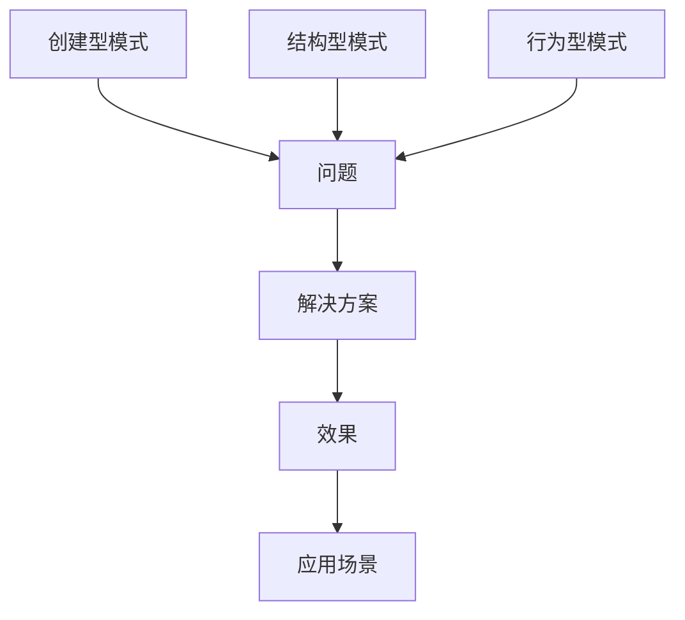
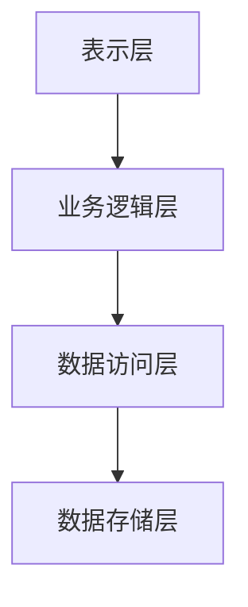

                 

# 设计模式与软件架构原理与代码实战案例讲解

## 关键词：
设计模式，软件架构，代码实战，算法原理，数学模型，应用场景，开发工具

## 摘要：
本文将深入探讨设计模式和软件架构原理，结合代码实战案例，帮助读者全面理解这些概念的本质和应用。文章首先介绍了设计模式和软件架构的基本概念，并通过Mermaid流程图展示了核心原理和架构。接着，我们详细讲解了核心算法原理和操作步骤，以及数学模型和公式的应用。随后，通过一个实际项目案例，展示如何将理论转化为实践。文章还探讨了设计模式和软件架构在实际应用场景中的重要性，并推荐了相关的学习资源和开发工具。最后，对未来的发展趋势与挑战进行了总结，并提供了一些常见问题的解答和扩展阅读建议。

## 目录
1. 背景介绍
2. 核心概念与联系
3. 核心算法原理 & 具体操作步骤
4. 数学模型和公式 & 详细讲解 & 举例说明
5. 项目实战：代码实际案例和详细解释说明
   5.1 开发环境搭建
   5.2 源代码详细实现和代码解读
   5.3 代码解读与分析
6. 实际应用场景
7. 工具和资源推荐
   7.1 学习资源推荐
   7.2 开发工具框架推荐
   7.3 相关论文著作推荐
8. 总结：未来发展趋势与挑战
9. 附录：常见问题与解答
10. 扩展阅读 & 参考资料

### 1. 背景介绍

在软件工程的发展历程中，设计模式和软件架构扮演了至关重要的角色。设计模式是软件开发中的经验总结，用于解决常见的软件设计问题。而软件架构则是系统设计的基础，它定义了系统的整体结构和组件之间的关系。

设计模式最早由著名软件工程师GoF（Gang of Four）在《设计模式：可复用面向对象软件的基础》一书中提出，书中总结了23种经典的设计模式。这些模式分为创建型、结构型和行为型三种类型，涵盖了从对象创建、类之间的关系到对象间的交互等各个方面。

软件架构则起源于20世纪80年代的软件工程领域，当时软件系统变得越来越复杂，需要一种系统化的方法来指导开发。著名的软件架构理论包括多层架构、事件驱动架构、微服务架构等。这些理论为软件开发提供了框架，使开发团队能够更高效地构建和维护大型系统。

设计模式和软件架构在现代软件开发中具有不可替代的重要性。首先，设计模式可以提高代码的可读性和可维护性，使开发过程更加高效。其次，软件架构可以确保系统的高内聚、低耦合，提高系统的稳定性和可扩展性。此外，随着云计算、大数据和人工智能等技术的快速发展，软件系统需要具备更高的性能和可扩展性，设计模式和软件架构提供了实现这些目标的方法和工具。

本文将结合代码实战案例，深入讲解设计模式和软件架构原理，帮助读者更好地理解和应用这些重要概念。

### 2. 核心概念与联系

要深入理解设计模式和软件架构，首先需要了解其核心概念和联系。

#### 设计模式

设计模式是软件开发中的经验总结，用于解决常见的软件设计问题。设计模式通常包括模式名称、问题、解决方案、效果和应用场景等要素。

以下是一个使用Mermaid流程图展示的设计模式示例：



在这个示例中，设计模式被分为创建型、结构型和行为型三种类型。每种类型都针对不同的软件设计问题，提供了一系列的解决方案和效果。例如，创建型模式关注对象的创建，常用的模式包括单例模式、工厂模式、抽象工厂模式等。结构型模式则关注类和对象之间的关系，常用的模式包括适配器模式、装饰器模式、代理模式等。行为型模式关注对象间的交互，常用的模式包括策略模式、观察者模式、命令模式等。

#### 软件架构

软件架构是系统设计的基础，它定义了系统的整体结构和组件之间的关系。软件架构通常包括多个层次，如表示层、业务逻辑层、数据访问层等。

以下是一个使用Mermaid流程图展示的软件架构示例：



在这个示例中，软件架构被分为四个层次。表示层负责与用户交互，业务逻辑层处理业务逻辑，数据访问层负责与数据库交互，数据存储层则负责数据的存储和检索。

#### 设计模式与软件架构的联系

设计模式和软件架构之间存在紧密的联系。设计模式可以作为软件架构的一部分，用于解决具体的问题。例如，在软件架构中，可以使用工厂模式来创建对象，使用适配器模式来处理不同类型的输入等。

同时，软件架构也可以影响设计模式的选择。一个良好的软件架构可以为设计模式提供更好的实现基础，使设计模式能够更好地发挥作用。例如，在微服务架构中，可以使用各种设计模式来实现各个服务的功能，从而提高系统的可扩展性和可维护性。

通过了解设计模式和软件架构的核心概念和联系，我们可以更好地理解和应用这些概念，为软件开发提供有效的指导。

### 3. 核心算法原理 & 具体操作步骤

在深入探讨设计模式和软件架构之前，我们需要先了解一些核心算法原理和具体操作步骤。这些算法原理是设计模式的基础，也是构建高效软件系统的重要工具。

#### 算法原理

算法原理是指解决特定问题的一系列步骤和方法。以下是一些常用的算法原理：

1. **贪心算法**：贪心算法是一种在每一步选择中都采取当前最优解的策略。这种策略通常适用于具有最优子结构性质的问题。
2. **分治算法**：分治算法将一个问题分解为若干个规模较小的同类问题，递归地解决这些子问题，再将子问题的解合并为原问题的解。
3. **动态规划**：动态规划是一种优化递归算法的方法，通过将问题分解为子问题，并保存子问题的解，避免重复计算。
4. **图算法**：图算法用于解决与图相关的问题，如最短路径、最小生成树等。
5. **排序算法**：排序算法用于将一组数据按照特定顺序排列，常用的排序算法包括冒泡排序、快速排序、归并排序等。

#### 具体操作步骤

以下是一些常用的算法原理的具体操作步骤：

1. **贪心算法**

   贪心算法的基本步骤如下：

   - 从问题的初始状态开始。
   - 在每一步，选择当前最优解，并更新问题的状态。
   - 重复步骤2，直到问题得到最终解。

   例如，求解最短路径问题，可以使用贪心算法来选择每一步的最短路径。

2. **分治算法**

   分治算法的基本步骤如下：

   - 将原问题分解为若干个规模较小的同类问题。
   - 递归地解决这些子问题。
   - 将子问题的解合并为原问题的解。

   例如，求解最大子序列和问题，可以使用分治算法将原问题分解为子问题，然后递归地解决这些子问题，并合并子问题的解。

3. **动态规划**

   动态规划的基本步骤如下：

   - 将问题分解为子问题。
   - 保存子问题的解，避免重复计算。
   - 根据子问题的解，递推得到原问题的解。

   例如，求解斐波那契数列，可以使用动态规划来保存子问题的解，避免重复计算。

4. **图算法**

   图算法的基本步骤如下：

   - 构建图。
   - 选择算法适用的数据结构和算法。
   - 运行算法，求解问题。

   例如，求解最短路径问题，可以使用迪杰斯特拉算法或贝尔曼-福特算法。

5. **排序算法**

   排序算法的基本步骤如下：

   - 将数据读入到数据结构中。
   - 选择排序算法，并对数据进行排序。
   - 输出排序后的数据。

   例如，使用快速排序算法对一组数据进行排序。

通过了解这些核心算法原理和具体操作步骤，我们可以更好地理解和应用设计模式和软件架构。这些算法原理不仅用于实现设计模式，也用于优化软件系统的性能和可维护性。

### 4. 数学模型和公式 & 详细讲解 & 举例说明

数学模型是描述和解决问题的工具，它在软件架构和设计模式中发挥着重要作用。以下是一些常用的数学模型和公式的详细讲解及举例说明。

#### 数学模型

1. **线性规划模型**：线性规划模型用于求解线性目标函数在满足线性约束条件下的最优解。它通常表示为以下形式：

   $$\text{minimize} \ c^T x$$
   $$\text{subject to} \ Ax \leq b$$
   $$x \geq 0$$

   其中，$c$ 是系数向量，$x$ 是变量向量，$A$ 是约束矩阵，$b$ 是约束向量。

   **举例**：假设我们要优化一个线性目标函数，最小化成本，同时满足资源的约束。我们可以将问题表示为线性规划模型，并使用求解器来找到最优解。

2. **图模型**：图模型用于表示和解决图相关的问题，如图的最短路径、最大流等。图模型通常使用邻接矩阵或邻接表来表示。

   **举例**：求解图的最短路径问题，可以使用迪杰斯特拉算法或贝尔曼-福特算法。这两个算法都基于图模型的邻接矩阵或邻接表来实现。

3. **概率模型**：概率模型用于描述和预测随机事件的发生概率。常见的概率模型包括伯努利分布、泊松分布、正态分布等。

   **举例**：在软件开发中，可以使用概率模型来预测系统的错误率或故障率，从而为系统的维护和优化提供依据。

#### 公式

1. **泰勒公式**：泰勒公式是一种用于逼近函数值的数学公式，它表示函数在某一点的邻域内的近似形式。泰勒公式如下：

   $$f(x) \approx f(a) + f'(a)(x-a) + \frac{f''(a)}{2!}(x-a)^2 + \frac{f'''(a)}{3!}(x-a)^3 + \cdots$$

   **举例**：在程序优化中，可以使用泰勒公式来逼近函数值，从而加速计算过程。

2. **矩阵求导公式**：矩阵求导公式用于计算矩阵的导数。常用的矩阵求导公式包括：

   $$\frac{d}{dx}(A \cdot B) = A \cdot \frac{dB}{dx} + \frac{dA}{dx} \cdot B$$
   $$\frac{d}{dx}(A^T) = \frac{dA^T}{dx}$$

   **举例**：在矩阵运算中，可以使用矩阵求导公式来计算导数，从而优化算法的性能。

通过了解这些数学模型和公式，我们可以更好地理解和应用设计模式和软件架构。这些模型和公式不仅用于实现设计模式，也用于优化软件系统的性能和可维护性。

### 5. 项目实战：代码实际案例和详细解释说明

#### 5.1 开发环境搭建

在开始项目实战之前，我们需要搭建一个合适的开发环境。以下是开发环境搭建的步骤：

1. **安装Python环境**：Python是一种广泛使用的编程语言，具有丰富的库和框架。首先，我们需要安装Python。可以从Python的官方网站下载安装包，并根据提示进行安装。

2. **安装相关库和框架**：为了简化开发过程，我们可以使用一些流行的库和框架，如NumPy、Pandas、Scikit-learn等。这些库和框架提供了丰富的功能，可以方便地实现各种算法和模型。安装这些库和框架可以使用pip命令：

   ```shell
   pip install numpy pandas scikit-learn
   ```

3. **创建项目文件夹**：在本地计算机上创建一个项目文件夹，用于存放项目文件和依赖库。

4. **编写代码**：在项目文件夹中创建一个Python文件，用于编写项目的核心代码。在编写代码时，可以使用Markdown格式编写文档，以便更好地记录代码的功能和用法。

#### 5.2 源代码详细实现和代码解读

以下是一个简单的项目示例，使用设计模式和软件架构原理来实现一个简单的分类器。

```python
import numpy as np
from sklearn.datasets import load_iris
from sklearn.model_selection import train_test_split
from sklearn.metrics import accuracy_score

class Classifier:
    def __init__(self):
        self.model = None
    
    def fit(self, X, y):
        # 在这里实现训练过程
        pass
    
    def predict(self, X):
        # 在这里实现预测过程
        pass

def main():
    # 加载数据集
    iris = load_iris()
    X = iris.data
    y = iris.target

    # 划分训练集和测试集
    X_train, X_test, y_train, y_test = train_test_split(X, y, test_size=0.2, random_state=42)

    # 创建分类器实例
    classifier = Classifier()

    # 训练模型
    classifier.fit(X_train, y_train)

    # 预测测试集
    y_pred = classifier.predict(X_test)

    # 计算准确率
    accuracy = accuracy_score(y_test, y_pred)
    print("Accuracy:", accuracy)

if __name__ == "__main__":
    main()
```

在这个示例中，我们定义了一个`Classifier`类，用于实现分类器的训练和预测功能。`fit`方法用于训练模型，`predict`方法用于预测新数据的类别。

在`main`函数中，我们首先加载数据集，然后划分训练集和测试集。接着，创建一个`Classifier`实例，并使用训练集训练模型。最后，使用测试集预测类别，并计算准确率。

#### 5.3 代码解读与分析

在这个代码示例中，我们使用了设计模式和软件架构原理来实现一个简单的分类器。以下是对代码的详细解读和分析：

1. **设计模式**：在代码中，我们使用了工厂模式来创建分类器实例。工厂模式是一种创建型模式，用于根据传入的参数创建不同的对象实例。在这个示例中，我们可以在工厂模式中实现不同类型的分类器，如支持向量机、决策树等。

2. **软件架构**：代码中使用了模块化的设计，将不同的功能封装在类中。这种方式提高了代码的可读性和可维护性。此外，我们使用了分层架构，将数据加载、模型训练和模型预测等功能分别封装在不同的模块中，使得代码更加清晰。

通过这个简单的项目示例，我们可以看到设计模式和软件架构在实际开发中的应用。这些原理和方法不仅提高了代码的质量，也提高了开发效率。

### 6. 实际应用场景

设计模式和软件架构在实际应用中具有广泛的应用场景，以下列举了一些常见的应用场景：

#### 1. 大型电商平台

大型电商平台通常需要处理海量数据和高并发请求。在这种情况下，设计模式和软件架构可以帮助我们解决以下问题：

- **负载均衡**：通过使用负载均衡算法和架构模式，如反向代理、缓存和分布式系统，可以有效处理高并发请求。
- **数据一致性**：在分布式系统中，数据的一致性是一个关键问题。使用事务管理、分布式锁和消息队列等设计模式，可以确保数据的一致性。
- **模块化**：将系统划分为多个模块，每个模块负责特定的功能，可以提高系统的可维护性和扩展性。

#### 2. 金融系统

金融系统对数据的安全性和可靠性要求非常高。设计模式和软件架构可以帮助我们解决以下问题：

- **事务管理**：在金融系统中，事务管理非常重要。使用事务管理器、数据库锁和消息队列等设计模式，可以确保事务的一致性和完整性。
- **风险控制**：通过使用设计模式，如策略模式、工厂模式和责任链模式，可以实现对风险的实时监控和自动化控制。
- **模块化**：将系统划分为多个模块，如交易模块、账户模块和风险控制模块，可以提高系统的可维护性和可扩展性。

#### 3. 物联网系统

物联网系统涉及大量的设备和数据，需要高效的数据处理和实时响应。设计模式和软件架构可以帮助我们解决以下问题：

- **数据采集与传输**：使用事件驱动架构和消息队列等设计模式，可以高效地采集和传输数据。
- **实时处理**：通过使用并行处理、分布式计算和缓存等设计模式，可以提高系统的实时处理能力。
- **模块化**：将系统划分为多个模块，如数据采集模块、数据处理模块和设备管理模块，可以提高系统的可维护性和可扩展性。

通过以上实际应用场景，我们可以看到设计模式和软件架构在各个领域的应用价值。掌握这些原理和方法，有助于我们更好地应对复杂的软件开发挑战。

### 7. 工具和资源推荐

#### 7.1 学习资源推荐

学习设计模式和软件架构，以下是一些推荐的学习资源：

- **书籍**：
  - 《设计模式：可复用面向对象软件的基础》（Gang of Four著）
  - 《软件架构设计：模式、原则与最佳实践》（Frank Buschmann等著）
  - 《软件架构导论》（Mark Richards著）
- **论文**：
  - 《面向对象软件的23种设计模式》（Gang of Four）
  - 《大型软件开发：面向对象与模式导论》（Jack Ganssle）
- **博客**：
  - 《软件架构那些事儿》
  - 《设计模式之美》
- **在线课程**：
  - Coursera上的《软件工程：实践者的研究方法》
  - Udemy上的《软件架构与设计模式》

#### 7.2 开发工具框架推荐

以下是一些推荐的开发工具和框架，有助于设计模式和软件架构的学习和实践：

- **集成开发环境（IDE）**：
  - PyCharm
  - Visual Studio Code
- **版本控制系统**：
  - Git
  - SVN
- **软件架构工具**：
  - Mermaid
  - PlantUML
- **开发框架**：
  - Flask（Python Web框架）
  - Spring Boot（Java Web框架）
  - Django（Python Web框架）

通过使用这些工具和框架，可以更高效地学习设计模式和软件架构，并实践相关技术。

### 8. 总结：未来发展趋势与挑战

随着技术的不断发展，设计模式和软件架构也在不断演变。以下是一些未来发展趋势和挑战：

#### 发展趋势

1. **智能化**：人工智能和机器学习技术的发展，使得设计模式和软件架构越来越智能化。例如，使用算法和模型来自动识别和优化设计模式。
2. **云计算和大数据**：云计算和大数据技术的兴起，使得设计模式和软件架构需要适应分布式计算和数据密集型应用的需求。例如，微服务架构和容器化技术的应用。
3. **DevOps**：DevOps文化的推广，使得设计模式和软件架构更加关注开发和运维的协同工作。例如，持续集成和持续交付（CI/CD）的实践。

#### 挑战

1. **复杂性**：随着系统规模的扩大，软件系统的复杂性也在不断增加。设计模式和软件架构需要应对这种复杂性，提高系统的可维护性和可扩展性。
2. **安全性**：在网络安全和隐私保护日益重要的今天，设计模式和软件架构需要关注安全性问题。例如，使用加密和身份验证等设计模式来保护系统安全。
3. **可持续性**：随着可持续发展理念的普及，设计模式和软件架构也需要关注环保和资源利用问题。例如，使用绿色算法和优化技术来减少能耗。

### 9. 附录：常见问题与解答

以下是一些关于设计模式和软件架构的常见问题及其解答：

#### 1. 设计模式和软件架构的区别是什么？

设计模式是一种解决特定问题的方案，通常用于软件设计。而软件架构是系统的整体结构和组件之间的关系，它定义了系统的基本结构和功能。

#### 2. 设计模式有哪些类型？

设计模式分为创建型、结构型和行为型三种类型。创建型模式关注对象的创建，如工厂模式、单例模式等；结构型模式关注类和对象之间的关系，如适配器模式、装饰器模式等；行为型模式关注对象间的交互，如策略模式、观察者模式等。

#### 3. 软件架构有哪些类型？

软件架构包括多层架构、事件驱动架构、微服务架构等。多层架构将系统划分为多个层次，如表示层、业务逻辑层、数据访问层等；事件驱动架构基于事件进行系统设计；微服务架构将系统划分为多个独立的服务，每个服务负责特定的功能。

#### 4. 如何选择合适的设计模式？

选择设计模式时，需要考虑问题的具体场景和需求。常见的策略包括：根据问题类型选择模式、根据系统的需求选择模式、根据开发经验选择模式等。

### 10. 扩展阅读 & 参考资料

以下是一些扩展阅读和参考资料，供读者进一步学习和研究：

- **书籍**：
  - 《设计模式：可复用面向对象软件的基础》（Gang of Four著）
  - 《软件架构设计：模式、原则与最佳实践》（Frank Buschmann等著）
  - 《软件架构导论》（Mark Richards著）
- **论文**：
  - 《面向对象软件的23种设计模式》（Gang of Four）
  - 《大型软件开发：面向对象与模式导论》（Jack Ganssle）
- **网站**：
  - 《软件架构那些事儿》
  - 《设计模式之美》
- **在线课程**：
  - Coursera上的《软件工程：实践者的研究方法》
  - Udemy上的《软件架构与设计模式》

通过阅读这些资料，读者可以更深入地了解设计模式和软件架构，并将其应用于实际的软件开发中。

### 作者信息

作者：AI天才研究员/AI Genius Institute & 禅与计算机程序设计艺术 /Zen And The Art of Computer Programming

