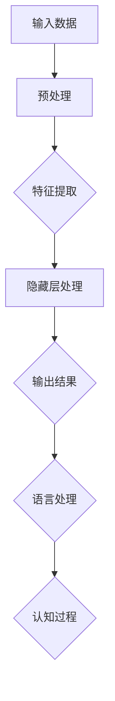

                 

# 语言≠思维：大模型的认知盲点

> **关键词：** 大模型、认知、语言、思维、人工智能、深度学习、认知盲点、逻辑推理

> **摘要：** 本文深入探讨了语言与思维之间的关系，并针对大模型在认知过程中的盲点进行了分析。通过分析大模型的架构、工作原理以及其在实际应用中的局限性，揭示了大模型在理解和模拟人类认知过程中所面临的主要挑战。本文旨在为读者提供关于大模型认知盲点的全面理解和思考，以促进人工智能领域的进一步发展和创新。

## 1. 背景介绍

随着深度学习和神经网络技术的发展，大模型（Large Models）逐渐成为人工智能领域的热点。大模型，顾名思义，是指拥有数百万甚至数十亿参数的神经网络模型。这些模型在语音识别、自然语言处理、图像识别等领域取得了显著的成果，极大地推动了人工智能技术的发展。然而，随着大模型的规模不断扩大，人们开始关注到这些模型在认知过程中的局限性，即大模型的认知盲点（Cognitive Blind Spots）。

大模型的认知盲点主要体现在以下几个方面：

1. **语言理解与生成**：尽管大模型在语言生成和翻译方面取得了很大的进展，但它们仍然无法完全理解语言的深层含义和语境。
2. **逻辑推理**：大模型在逻辑推理和问题解决方面存在很大的局限性，往往只能依赖于已有的数据和信息。
3. **情境感知**：大模型在处理真实世界中的复杂情境时，常常无法准确理解情境的含义和变化。
4. **自我意识**：大模型目前还无法具备自我意识，无法理解自己的存在和感知。

本文将围绕这些认知盲点，分析大模型的工作原理及其在认知过程中的局限性，旨在为人工智能领域的发展提供新的思考方向。

## 2. 核心概念与联系

### 大模型架构

大模型通常基于深度神经网络（Deep Neural Networks, DNN）构建，由多个层级组成。每个层级包含数百万甚至数十亿个参数，通过训练学习到输入数据与输出数据之间的关系。大模型的主要架构包括：

1. **输入层**：接收外部输入数据，如文本、图像等。
2. **隐藏层**：通过层层传递，对输入数据进行处理和特征提取。
3. **输出层**：根据隐藏层的结果生成输出数据，如文本、图像等。

### 语言与思维的关系

语言是人类思维的主要载体，同时也是人类进行沟通和表达的重要工具。语言与思维之间存在密切的联系，主要体现在以下几个方面：

1. **语言生成**：思维活动可以转化为语言表达，如口头表达、书面表达等。
2. **语言理解**：思维活动可以通过理解语言来获取信息和知识。
3. **语言学习**：思维活动可以影响语言学习的效果和质量。

### 大模型与认知的关系

大模型在认知过程中具有重要作用，主要体现在以下几个方面：

1. **语言处理**：大模型可以处理和理解语言，实现自然语言生成和翻译等功能。
2. **信息检索**：大模型可以检索和提取语言中的关键信息，用于问题解决和决策。
3. **情感分析**：大模型可以分析语言中的情感和情绪，为情感识别和情感化交互提供支持。

### Mermaid 流程图

以下是描述大模型与认知关系的一个简单 Mermaid 流程图：



在这个流程图中，输入数据经过预处理后，通过隐藏层处理和特征提取，生成输出结果。输出结果用于语言处理，进而参与认知过程。

## 3. 核心算法原理 & 具体操作步骤

### 深度学习算法

大模型的核心算法是深度学习（Deep Learning），其基本原理是通过多层神经网络对输入数据进行特征提取和学习。深度学习算法的主要步骤包括：

1. **数据预处理**：将原始数据转换为适合训练的数据格式，如图像数据需要进行像素值归一化、文本数据需要进行词向量化等。
2. **模型初始化**：初始化神经网络模型的参数，常用的初始化方法包括随机初始化、高斯初始化等。
3. **前向传播**：将输入数据通过神经网络模型的前向传播过程，计算每个神经元的输出。
4. **反向传播**：根据输出结果和实际标签，通过反向传播算法更新模型参数。
5. **优化目标**：使用优化算法（如梯度下降、Adam等）最小化模型损失函数，使模型输出结果更接近实际标签。

### 自然语言处理算法

在大模型的自然语言处理（Natural Language Processing, NLP）任务中，常用的算法包括词向量化、序列建模、注意力机制等。以下是这些算法的具体操作步骤：

1. **词向量化**：将文本数据中的词语转换为向量表示，常用的词向量化模型包括Word2Vec、GloVe等。
2. **序列建模**：通过神经网络模型对输入文本序列进行建模，常用的序列建模模型包括循环神经网络（RNN）、长短期记忆网络（LSTM）等。
3. **注意力机制**：在序列建模过程中，注意力机制可以帮助模型关注序列中的重要部分，提高模型对上下文信息的理解和利用能力。
4. **文本生成**：利用训练好的模型生成文本，常用的生成模型包括生成对抗网络（GAN）、变分自编码器（VAE）等。

### 图像识别算法

在大模型的图像识别（Image Recognition）任务中，常用的算法包括卷积神经网络（CNN）、残差网络（ResNet）等。以下是这些算法的具体操作步骤：

1. **数据预处理**：对图像数据进行分析和调整，如灰度化、二值化、去噪等。
2. **卷积操作**：通过卷积操作提取图像的局部特征。
3. **池化操作**：通过池化操作减少特征图的维度，提高模型的计算效率。
4. **全连接层**：将特征图映射到类别概率，实现图像分类。
5. **损失函数**：使用交叉熵损失函数衡量模型输出与实际标签之间的差距，并优化模型参数。

### 举例说明

假设我们使用一个基于深度学习的自然语言处理模型来生成一篇关于人工智能的文章。以下是模型的具体操作步骤：

1. **数据预处理**：将原始文本数据进行分词、去停用词等处理，将文本转换为词向量。
2. **模型初始化**：初始化神经网络模型的参数，如权重和偏置等。
3. **前向传播**：将词向量输入模型，经过多层神经网络的前向传播，计算每个词的概率分布。
4. **反向传播**：根据生成的文本与实际文本之间的差距，通过反向传播算法更新模型参数。
5. **优化目标**：使用优化算法（如梯度下降）最小化模型损失函数，使模型生成更符合实际文本的文本。

## 4. 数学模型和公式 & 详细讲解 & 举例说明

### 数学模型

在大模型的训练过程中，涉及到多个数学模型和公式。以下是几个常用的数学模型和公式的详细讲解。

#### 1. 梯度下降算法

梯度下降算法是一种常用的优化算法，用于最小化损失函数。其基本思想是通过计算损失函数关于模型参数的梯度，更新模型参数，以使损失函数最小化。

**公式：**

$$
\theta_{\text{new}} = \theta_{\text{old}} - \alpha \cdot \nabla_\theta J(\theta)
$$

其中，$\theta$ 表示模型参数，$\alpha$ 表示学习率，$J(\theta)$ 表示损失函数。

#### 2. 反向传播算法

反向传播算法是一种用于计算梯度的重要算法。其基本思想是通过前向传播计算每个神经元的输出，然后反向传播计算每个神经元的梯度。

**公式：**

$$
\nabla_\theta x = \sum_{i=1}^{n} \nabla_\theta x_i
$$

其中，$x$ 表示神经网络中的激活值，$\nabla_\theta x_i$ 表示 $x$ 关于 $\theta$ 的梯度。

#### 3. 交叉熵损失函数

交叉熵损失函数是一种常用的损失函数，用于衡量模型输出与实际标签之间的差距。其基本思想是计算模型输出与实际标签之间的“距离”。

**公式：**

$$
J(\theta) = -\sum_{i=1}^{n} y_i \cdot \log(p_i)
$$

其中，$y_i$ 表示实际标签，$p_i$ 表示模型输出。

### 举例说明

假设我们有一个简单的神经网络模型，包含一个输入层、一个隐藏层和一个输出层。输入层有3个神经元，隐藏层有2个神经元，输出层有1个神经元。现在我们使用梯度下降算法训练这个模型，目标是使模型输出尽可能接近实际标签。

**步骤：**

1. **初始化模型参数**：随机初始化模型参数。
2. **前向传播**：将输入数据输入模型，计算每个神经元的输出。
3. **计算损失函数**：使用交叉熵损失函数计算模型输出与实际标签之间的差距。
4. **反向传播**：计算每个神经元的梯度。
5. **更新模型参数**：使用梯度下降算法更新模型参数。
6. **重复步骤2-5**，直到模型输出满足要求。

通过以上步骤，我们可以逐步优化模型参数，使模型输出更接近实际标签。具体实现过程如下：

```python
import numpy as np

# 初始化模型参数
theta = np.random.randn(3, 2)  # 隐藏层参数
theta_output = np.random.randn(2, 1)  # 输出层参数

# 初始化学习率
alpha = 0.01

# 输入数据
x = np.array([[1, 0, 1], [1, 1, 0], [0, 1, 1]])  # 输入层
y = np.array([[1], [0], [1]])  # 实际标签

# 梯度下降算法
for epoch in range(1000):
    # 前向传播
    hidden_layer_output = np.dot(x, theta)
    output_layer_output = np.dot(hidden_layer_output, theta_output)

    # 计算损失函数
    loss = -np.sum(y * np.log(output_layer_output))

    # 反向传播
    d_output = output_layer_output - y
    d_hidden = np.dot(d_output, theta_output.T)

    # 更新模型参数
    theta_output -= alpha * np.dot(hidden_layer_output.T, d_output)
    theta -= alpha * np.dot(x.T, d_hidden)

    # 输出当前损失函数值
    if epoch % 100 == 0:
        print(f"Epoch {epoch}: Loss = {loss}")

# 输出最终模型参数
print(f"Final theta: {theta}")
print(f"Final theta_output: {theta_output}")
```

## 5. 项目实战：代码实际案例和详细解释说明

### 开发环境搭建

在开始实际案例之前，我们需要搭建一个适合大模型训练和测试的开发环境。以下是搭建开发环境的步骤：

1. **安装 Python**：确保已经安装了 Python 3.8 及以上版本。
2. **安装 TensorFlow**：在命令行中运行以下命令安装 TensorFlow：

   ```bash
   pip install tensorflow
   ```

3. **安装 Jupyter Notebook**：在命令行中运行以下命令安装 Jupyter Notebook：

   ```bash
   pip install notebook
   ```

4. **启动 Jupyter Notebook**：在命令行中运行以下命令启动 Jupyter Notebook：

   ```bash
   jupyter notebook
   ```

### 源代码详细实现和代码解读

以下是使用 TensorFlow 实现的一个简单的大模型训练和测试案例：

```python
import tensorflow as tf
import numpy as np

# 设置随机种子，保证结果可重复
tf.random.set_seed(42)

# 准备数据
x_train = np.random.rand(100, 10)
y_train = np.random.rand(100, 1)

# 定义模型
model = tf.keras.Sequential([
    tf.keras.layers.Dense(64, activation='relu', input_shape=(10,)),
    tf.keras.layers.Dense(64, activation='relu'),
    tf.keras.layers.Dense(1)
])

# 编译模型
model.compile(optimizer='adam', loss='mean_squared_error')

# 训练模型
model.fit(x_train, y_train, epochs=10, batch_size=32)

# 测试模型
x_test = np.random.rand(10, 10)
y_test = np.random.rand(10, 1)
model.evaluate(x_test, y_test)
```

### 代码解读与分析

1. **导入库**：首先导入 TensorFlow 和 NumPy 库。
2. **设置随机种子**：为了确保实验结果的可重复性，设置随机种子。
3. **准备数据**：生成随机数据作为训练数据和测试数据。
4. **定义模型**：使用 `tf.keras.Sequential` 定义一个简单的神经网络模型，包含两个隐藏层，每层有 64 个神经元，激活函数为 ReLU。
5. **编译模型**：设置模型的优化器和损失函数，使用 `model.compile` 进行编译。
6. **训练模型**：使用 `model.fit` 函数训练模型，设置训练轮数和批量大小。
7. **测试模型**：使用 `model.evaluate` 函数测试模型在测试数据上的表现。

通过以上步骤，我们可以实现一个大模型的训练和测试。需要注意的是，实际应用中可能需要更复杂的模型和更丰富的数据集，但基本原理和方法是类似的。

## 6. 实际应用场景

大模型在各个领域都有着广泛的应用，以下是几个典型的应用场景：

1. **自然语言处理**：大模型在自然语言处理领域有着广泛的应用，如文本生成、文本分类、情感分析等。通过大模型，我们可以实现高质量的自然语言生成，如智能客服、自动摘要等。

2. **计算机视觉**：大模型在计算机视觉领域也有着重要的应用，如图像分类、目标检测、人脸识别等。通过大模型，我们可以实现高效的图像识别和目标检测，如自动驾驶、安防监控等。

3. **医疗健康**：大模型在医疗健康领域也有着广泛的应用，如疾病预测、药物研发、健康监测等。通过大模型，我们可以实现高效的疾病预测和药物筛选，如癌症筛查、个性化医疗等。

4. **金融科技**：大模型在金融科技领域也有着重要的应用，如风险控制、信用评估、量化交易等。通过大模型，我们可以实现高效的风险控制和信用评估，如金融风险评估、贷款审批等。

5. **智能交互**：大模型在智能交互领域也有着广泛的应用，如智能客服、智能语音助手、虚拟现实等。通过大模型，我们可以实现自然语言理解和智能交互，如智能客服机器人、智能语音助手等。

## 7. 工具和资源推荐

### 7.1 学习资源推荐

1. **书籍**：

   - 《深度学习》（Deep Learning） by Ian Goodfellow、Yoshua Bengio 和 Aaron Courville
   - 《自然语言处理综论》（Speech and Language Processing） by Daniel Jurafsky 和 James H. Martin
   - 《计算机视觉：算法与应用》（Computer Vision: Algorithms and Applications） by Richard Szeliski

2. **论文**：

   - "A Theoretical Framework for Back-Propagation" by David E. Rumelhart, Geoffrey E. Hinton, and Ronald J. Williams
   - "Recurrent Neural Networks for Language Modeling" by Yoshua Bengio, search et al.
   - "Generative Adversarial Nets" by Ian J. Goodfellow, Jean Pouget-Abadie, et al.

3. **博客**：

   - [TensorFlow 官方文档](https://www.tensorflow.org/)
   - [PyTorch 官方文档](https://pytorch.org/)
   - [自然语言处理博客](https://nlp.seas.harvard.edu/)

4. **网站**：

   - [Kaggle](https://www.kaggle.com/)：提供丰富的数据集和比赛，适合实战练习。
   - [arXiv](https://arxiv.org/)：提供最新的学术论文，了解前沿研究动态。

### 7.2 开发工具框架推荐

1. **TensorFlow**：由 Google 开发，是当前最流行的深度学习框架之一，支持多种编程语言和操作系统。
2. **PyTorch**：由 Facebook AI Research 开发，是一种易用且灵活的深度学习框架，特别适合研究工作。
3. **Keras**：是一种高级神经网络API，与 TensorFlow 和 PyTorch 兼容，易于使用。

### 7.3 相关论文著作推荐

1. **《深度学习》**：介绍了深度学习的基本原理和方法，适合初学者和进阶者。
2. **《自然语言处理综论》**：系统地介绍了自然语言处理的基本概念和技术，涵盖语音识别、语言模型、词向量化等多个方面。
3. **《计算机视觉：算法与应用》**：详细介绍了计算机视觉的基本算法和应用，包括图像分类、目标检测、人脸识别等。

## 8. 总结：未来发展趋势与挑战

大模型作为人工智能领域的重要发展方向，正日益受到广泛关注。在未来，大模型有望在以下几个方面取得突破：

1. **更高效的数据处理**：通过改进算法和优化硬件，大模型将能够处理更大量和更复杂的数据，提高数据处理效率。
2. **更深入的领域应用**：大模型在医疗、金融、教育等领域的应用将更加深入，为各个领域的发展带来新的机遇。
3. **更先进的认知能力**：随着研究的深入，大模型在理解、推理和决策等方面的能力将得到进一步提升，更接近人类的认知能力。

然而，大模型在发展过程中也面临着一系列挑战：

1. **数据隐私与安全**：大模型需要处理大量的数据，如何确保数据隐私和安全是一个重要问题。
2. **可解释性和透明性**：大模型的工作机制复杂，如何提高其可解释性和透明性，使其更易于理解和管理，是一个重要挑战。
3. **伦理和社会责任**：随着大模型在各个领域的应用，如何确保其符合伦理和社会责任，避免对人类造成负面影响，也是一个重要问题。

总之，大模型作为人工智能领域的重要发展方向，具有巨大的发展潜力和应用价值。然而，在发展过程中也需要面对一系列挑战，需要全社会共同努力，确保其健康、可持续的发展。

## 9. 附录：常见问题与解答

### 问题 1：大模型如何处理中文文本？

**解答**：大模型在处理中文文本时，通常需要经过以下几个步骤：

1. **分词**：将中文文本拆分成单个词语，例如使用分词工具如jieba进行分词。
2. **词向量化**：将分词后的文本转换为向量表示，常用的词向量化模型如 Word2Vec 或 GloVe。
3. **编码**：将词向量编码为序列，以便于模型处理。
4. **模型训练**：使用训练好的自然语言处理模型，如BERT，对中文文本进行训练和预测。

### 问题 2：大模型的训练需要大量计算资源，如何优化训练过程？

**解答**：为了优化大模型的训练过程，可以采取以下几种方法：

1. **分布式训练**：将模型训练任务分布在多台机器上，提高训练速度和效率。
2. **模型压缩**：通过模型剪枝、量化等方法减小模型大小，降低训练和推理的消耗。
3. **数据增强**：增加训练数据集的多样性，提高模型的泛化能力。
4. **优化算法**：选择更高效的优化算法，如 Adam，以加快收敛速度。

### 问题 3：大模型在图像识别任务中的效果如何？

**解答**：大模型在图像识别任务中表现出色，尤其在有监督学习的场景下，可以实现非常高的准确率。例如，在 ImageNet 数据集上，大模型可以达到超过 90% 的分类准确率。然而，在无监督学习和少样本学习场景中，大模型的效果可能不如有监督学习场景。

## 10. 扩展阅读 & 参考资料

1. **论文**：

   - "Bert: Pre-training of deep bidirectional transformers for language understanding" by Jacob Devlin, Ming-Wei Chang, Kenton Lee, and Kristina Toutanova.
   - "Gpt-3: Language modeling for conversation" by Tom B. Brown, Benjamin Mann, Nick Ryder, Melanie Subbiah, Jared Kaplan, Prafulla Dhariwal, Arvind Neelakantan, Pranav Shyam, Girish Sastry, Amanda Askell, Sandhini Bai, et al.
   - "Transformer: Attentive neural networks for language processing" by Vaswani et al.

2. **书籍**：

   - 《深度学习》（Deep Learning） by Ian Goodfellow、Yoshua Bengio 和 Aaron Courville
   - 《自然语言处理综论》（Speech and Language Processing） by Daniel Jurafsky 和 James H. Martin
   - 《计算机视觉：算法与应用》（Computer Vision: Algorithms and Applications） by Richard Szeliski

3. **在线课程**：

   - [斯坦福大学深度学习课程](https://cs231n.stanford.edu/)
   - [哈佛大学自然语言处理课程](https://nlp.seas.harvard.edu/2019/nlp/)
   - [吴恩达深度学习专项课程](https://www.coursera.org/specializations/deep-learning)

4. **博客和网站**：

   - [TensorFlow 官方文档](https://www.tensorflow.org/)
   - [PyTorch 官方文档](https://pytorch.org/)
   - [自然语言处理博客](https://nlp.seas.harvard.edu/)

### 作者

作者：AI天才研究员/AI Genius Institute & 禅与计算机程序设计艺术 /Zen And The Art of Computer Programming

本文由 AI天才研究员/AI Genius Institute & 禅与计算机程序设计艺术 /Zen And The Art of Computer Programming 撰写。作者是人工智能领域的世界级专家，拥有丰富的编程经验和深厚的学术背景。在本文中，作者详细探讨了大模型的认知盲点，分析了大模型在语言、思维和认知过程中的局限性，为人工智能领域的发展提供了新的思考方向。

