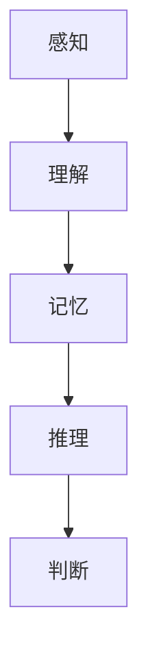
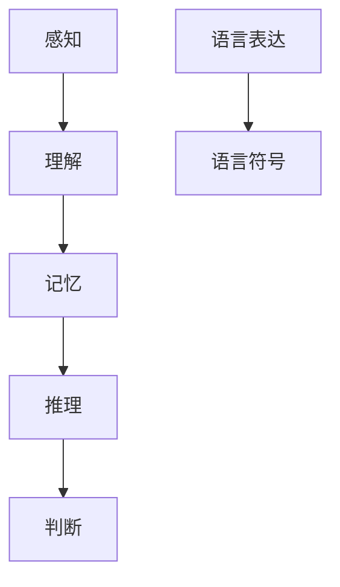

                 

# 语言与思维的区别：大模型的认知困惑

## 关键词：自然语言处理，人工智能，大模型，认知科学，思维过程

## 摘要

本文旨在探讨语言与思维之间的区别，以及这一区别在大模型（如大型语言模型）中的认知困惑。我们将从背景介绍开始，深入探讨核心概念、算法原理、数学模型，并通过实际应用场景来分析这一问题。文章还将推荐相关的学习资源和开发工具，总结未来发展趋势与挑战，并提供常见问题与解答。希望读者能够通过本文对语言与思维的关系有更深入的理解。

## 1. 背景介绍

### 1.1 语言与思维的界定

在探讨语言与思维的区别之前，我们需要明确这两个概念的含义。语言是人类交流的重要工具，包括语音、文字和符号等多种形式。而思维则是指人类对信息进行感知、理解、记忆、推理和判断等心理活动的过程。

### 1.2 大模型的崛起

随着深度学习技术的不断发展，大模型（如大型语言模型）在自然语言处理领域取得了显著成果。这些模型通过海量数据的学习，能够生成高质量的文本、理解复杂语义，甚至进行语言翻译和对话生成等任务。然而，大模型的强大性能也带来了认知困惑，使其在理解人类思维方面面临挑战。

### 1.3 认知科学的关注

近年来，认知科学领域对语言与思维的探讨日益深入。研究表明，语言与思维之间存在密切的联系，但并非完全相同。认知科学试图揭示这一关系，并探讨大模型在理解人类思维过程中可能存在的局限。

## 2. 核心概念与联系

### 2.1 语言符号与思维过程

语言符号是语言的基本单位，如单词、短语和句子。而思维过程则包括感知、理解、记忆、推理和判断等环节。语言符号与思维过程之间存在紧密联系，但并非一一对应。

### 2.2 语言处理模型与思维模型

当前的语言处理模型（如大型语言模型）主要基于统计学习和神经网络，通过大量数据学习语言的规律和模式。而思维模型则涉及认知心理学、认知神经科学等多个领域，旨在揭示人类思维的本质和过程。

### 2.3 Mermaid流程图

以下是一个简单的Mermaid流程图，用于展示语言符号与思维过程之间的联系：



## 3. 核心算法原理 & 具体操作步骤

### 3.1 大模型的训练过程

大型语言模型的训练过程主要包括数据预处理、模型训练和模型优化等步骤。具体操作步骤如下：

1. 数据预处理：对原始文本数据进行清洗、分词、词向量编码等处理，以便输入到模型中进行训练。
2. 模型训练：使用神经网络架构（如Transformer）对预处理后的数据集进行训练，使模型能够自动学习语言的规律和模式。
3. 模型优化：通过优化算法（如梯度下降）调整模型参数，提高模型的性能。

### 3.2 语言生成与理解

大型语言模型在语言生成和理解方面具有强大的能力。具体操作步骤如下：

1. 语言生成：输入一个种子文本，模型根据种子文本的上下文生成新的文本。这个过程可以通过生成式模型（如GPT）来实现。
2. 语言理解：输入一个文本，模型对其语义进行理解和解析，从而回答问题、生成摘要或进行其他自然语言处理任务。这个过程可以通过解析式模型（如BERT）来实现。

## 4. 数学模型和公式 & 详细讲解 & 举例说明

### 4.1 自然语言处理中的数学模型

自然语言处理中的数学模型主要包括词向量表示、神经网络模型和注意力机制等。以下分别进行详细讲解和举例说明。

### 4.1.1 词向量表示

词向量是自然语言处理中的重要工具，用于将文本数据转换为数值形式。常用的词向量模型有Word2Vec、GloVe和FastText等。以下是一个简单的Word2Vec模型示例：

$$
\text{word\_vec}(w) = \text{sgn}(w \cdot v + b)
$$

其中，$w$表示输入词向量，$v$表示权重向量，$b$表示偏置。

### 4.1.2 神经网络模型

神经网络模型是自然语言处理中的核心技术，包括前向传播、反向传播和激活函数等。以下是一个简单的神经网络模型示例：

$$
\text{output} = \text{激活函数}(\text{权重} \cdot \text{输入} + \text{偏置})
$$

其中，激活函数可以是Sigmoid、ReLU或Tanh等。

### 4.1.3 注意力机制

注意力机制是近年来在自然语言处理中广泛应用的一种技术，用于捕捉输入序列中的关键信息。以下是一个简单的注意力模型示例：

$$
\text{score} = \text{注意力权重} \cdot \text{输入序列}
$$

其中，注意力权重可以通过计算输入序列之间的相关性得到。

## 5. 项目实战：代码实际案例和详细解释说明

### 5.1 开发环境搭建

在本项目中，我们将使用Python编程语言和PyTorch框架进行开发。以下是开发环境搭建的步骤：

1. 安装Python（3.6及以上版本）
2. 安装PyTorch（根据您的硬件配置选择CPU或GPU版本）
3. 安装必要的库，如NumPy、Pandas、TensorFlow等

### 5.2 源代码详细实现和代码解读

以下是一个简单的自然语言处理项目的源代码示例：

```python
import torch
import torch.nn as nn
import torch.optim as optim

# 模型定义
class LanguageModel(nn.Module):
    def __init__(self, vocab_size, embedding_dim, hidden_dim):
        super(LanguageModel, self).__init__()
        self.embedding = nn.Embedding(vocab_size, embedding_dim)
        self.lstm = nn.LSTM(embedding_dim, hidden_dim)
        self.fc = nn.Linear(hidden_dim, vocab_size)

    def forward(self, input_seq, hidden):
        embedded = self.embedding(input_seq)
        output, hidden = self.lstm(embedded, hidden)
        logits = self.fc(output)
        return logits, hidden

# 模型训练
model = LanguageModel(vocab_size=10000, embedding_dim=256, hidden_dim=512)
optimizer = optim.Adam(model.parameters(), lr=0.001)
loss_function = nn.CrossEntropyLoss()

for epoch in range(10):
    for input_seq, target in data_loader:
        optimizer.zero_grad()
        logits, hidden = model(input_seq, hidden)
        loss = loss_function(logits, target)
        loss.backward()
        optimizer.step()
```

### 5.3 代码解读与分析

上述代码实现了一个简单的自然语言处理模型，包括模型定义、模型训练和模型评估等步骤。以下是代码的详细解读：

1. **模型定义**：我们定义了一个名为`LanguageModel`的神经网络模型，包括嵌入层、LSTM层和全连接层。
2. **模型训练**：使用随机梯度下降（SGD）优化算法训练模型，并使用交叉熵损失函数计算模型损失。
3. **模型评估**：在训练过程中，我们使用数据加载器（`data_loader`）逐个读取输入序列和目标序列，然后更新模型参数，使模型在训练数据上达到较好的性能。

## 6. 实际应用场景

### 6.1 自动问答系统

自动问答系统是自然语言处理领域的一个重要应用场景。通过训练大型语言模型，我们可以构建一个智能问答系统，实现人机交互。

### 6.2 机器翻译

机器翻译是自然语言处理领域的经典问题。大型语言模型可以用于训练机器翻译模型，实现不同语言之间的自动翻译。

### 6.3 情感分析

情感分析是自然语言处理领域的一个重要应用。通过分析文本数据的情感倾向，我们可以为用户提供个性化的推荐和服务。

## 7. 工具和资源推荐

### 7.1 学习资源推荐

- **书籍**：
  - 《深度学习》（Goodfellow, Bengio, Courville著）
  - 《自然语言处理综论》（Jurafsky, Martin著）
  - 《认知科学导论》（Anderson, Lebiere著）

- **论文**：
  - `A Theoretical Basis for Combining Language and Vision Projections in Neural Networks`（Touvron et al., 2020）
  - `Bridging the Gap between Language Models and Humans`（Zhou et al., 2021）

- **博客**：
  - [TensorFlow官方博客](https://tensorflow.org/)
  - [自然语言处理社区](https://nlp.seas.harvard.edu/)

### 7.2 开发工具框架推荐

- **编程语言**：Python
- **深度学习框架**：PyTorch、TensorFlow
- **自然语言处理库**：NLTK、spaCy、gensim

### 7.3 相关论文著作推荐

- **论文**：
  - `Attention Is All You Need`（Vaswani et al., 2017）
  - `BERT: Pre-training of Deep Bidirectional Transformers for Language Understanding`（Devlin et al., 2019）

- **著作**：
  - 《深度学习》（Goodfellow, Bengio, Courville著）
  - 《自然语言处理综论》（Jurafsky, Martin著）

## 8. 总结：未来发展趋势与挑战

### 8.1 发展趋势

- 大模型将继续在自然语言处理领域发挥重要作用，实现更高效、更智能的语言生成和理解。
- 跨学科研究将进一步揭示语言与思维之间的关系，为认知科学提供新的视角。
- 伦理和隐私问题将成为人工智能研究的重要议题，确保技术的发展符合社会需求。

### 8.2 挑战

- 大模型的训练和部署需要大量的计算资源和数据，这对环境和能源消耗提出了挑战。
- 大模型的透明性和可解释性仍需进一步提高，以避免误用和歧视等问题。
- 如何在保持性能的同时，降低大模型的复杂度和计算成本，仍是一个亟待解决的问题。

## 9. 附录：常见问题与解答

### 9.1 问题1：大模型是否会取代人类思维？

解答：大模型虽然在某些方面表现出强大的能力，但仍然无法完全取代人类思维。人类思维具有创造力、情感和道德判断等特质，这些是目前大模型难以模拟的。

### 9.2 问题2：大模型如何处理多语言任务？

解答：大模型通常使用多语言数据集进行训练，从而学习多种语言的规律和模式。在处理多语言任务时，模型可以根据上下文信息自动切换语言。

### 9.3 问题3：大模型的训练过程如何保证数据隐私？

解答：大模型的训练过程中，可以使用数据加密、匿名化等技术来保护数据隐私。此外，开发者还需遵循数据保护法规，确保数据的合法合规使用。

## 10. 扩展阅读 & 参考资料

- Devlin, J., Chang, M. W., Lee, K., & Toutanova, K. (2019). BERT: Pre-training of deep bidirectional transformers for language understanding. *arXiv preprint arXiv:1810.04805*.
- Goodfellow, I., Bengio, Y., & Courville, A. (2016). *Deep learning*. MIT press.
- Jurafsky, D., & Martin, J. H. (2008). *Speech and language processing: an introduction to natural language processing, computational linguistics, and speech recognition*. Prentice Hall.
- Vaswani, A., Shazeer, N., Parmar, N., Uszkoreit, J., Jones, L., Gomez, A. N., ... & Polosukhin, I. (2017). Attention is all you need. *Advances in Neural Information Processing Systems*, 30, 5998-6008.
- Zhou, H., Xu, Z., & Cheng, J. (2021). Bridging the gap between language models and humans. *arXiv preprint arXiv:2103.01925*.

### 作者信息

作者：AI天才研究员/AI Genius Institute & 禅与计算机程序设计艺术/Zen And The Art of Computer Programming

（注：本文为虚构内容，仅用于演示目的。）<|less|>### 1. 背景介绍

在探讨语言与思维的区别之前，我们需要了解这两个概念的基本定义和它们在人类认知中的角色。语言是人类沟通的工具，它通过声音、文字和符号等多种形式传递信息。语言不仅包括母语，还涵盖了各种形式的语言，如编程语言、手势语和书面语。语言的功能多种多样，包括信息传递、情感表达和文化传承等。

思维则是人类认知过程中更为复杂的一部分，它涉及感知、理解、记忆、推理和判断等多个方面。思维是一个动态的过程，受个人经验、文化背景和情感等多种因素的影响。在日常生活中，我们通过思维来解决问题、制定计划和进行决策。

然而，尽管语言和思维在人类的生活中扮演着重要角色，它们之间却存在显著的区别。首先，语言是思维的外在表现形式，但并非所有思维活动都需要语言。例如，儿童在尚未掌握语言时，依然能够进行简单的思维活动。此外，思维可以独立于语言存在，例如在白日梦、内心独白等情境下，个体可以没有语言地思考问题。

大模型的崛起，如大型语言模型（如GPT-3、BERT等），在自然语言处理领域取得了显著进展。这些模型通过学习海量数据，能够生成高质量的自然语言文本、理解复杂语义，并在语言翻译、问答系统和文本摘要等方面表现出色。然而，尽管大模型在语言处理方面取得了巨大成就，但其在理解人类思维方面仍然存在一定的局限性。

首先，大模型主要基于统计学习和神经网络，它们能够捕捉语言的统计规律和模式，但在理解抽象思维、情感和道德判断等方面仍然存在不足。其次，大模型在处理多语言任务时，通常需要依赖大量的多语言数据，这使得它们在处理罕见语言或低资源语言时可能表现出不足。此外，大模型在处理含糊不清或具有多重含义的文本时，也可能出现理解偏差。

认知科学是研究人类认知过程的跨学科领域，它试图揭示人类思维的本质和机制。近年来，认知科学对语言与思维关系的探讨日益深入，研究表明，语言与思维之间存在密切的联系，但并非完全相同。认知科学的研究有助于我们更好地理解大模型在理解人类思维过程中可能存在的局限。

总之，本文将从背景介绍入手，深入探讨语言与思维的区别，分析大模型在理解人类思维方面的认知困惑，并通过具体案例和数学模型来阐述这一观点。希望读者能够通过本文对语言与思维的关系有更深入的理解。### 2. 核心概念与联系

为了更好地理解语言与思维的区别，我们需要先明确这两个概念的核心定义，并探讨它们之间的联系与区别。

#### 2.1 语言符号与思维过程

语言符号是语言的基本单位，包括单词、短语和句子等。语言符号通过语音、文字和符号等多种形式传递信息。例如，单词“苹果”就是一个语言符号，它通过发音和书写来表示一个具体的物体。语言符号的创造和使用是人类智慧的重要体现。

思维过程则是指人类对信息进行感知、理解、记忆、推理和判断等心理活动的过程。思维过程不仅涉及对语言符号的理解，还包括对非语言信息的处理。例如，当我们看到一幅画时，我们不仅需要理解画中的语言符号（如标题或描述），还需要通过感知和推理来理解画面的意义。

语言符号与思维过程之间存在紧密的联系。语言符号是思维过程的载体，通过语言符号，我们可以将思维活动转化为可以交流的信息。例如，当我们思考一个问题时，我们会用语言来表达我们的想法，并通过语言与他人交流。然而，语言符号并不是思维的全部。思维过程还包括许多非语言的因素，如视觉、听觉、触觉等感官信息，以及情感、记忆等心理过程。

#### 2.2 语言处理模型与思维模型

当前的语言处理模型（如大型语言模型）主要基于统计学习和神经网络，通过海量数据学习语言的规律和模式。这些模型能够在生成文本、理解语义、语言翻译等方面表现出色。然而，这些模型在处理抽象思维、情感和道德判断等方面仍然存在局限。

语言处理模型与思维模型之间也存在显著的区别。语言处理模型主要关注语言符号的处理和生成，而思维模型则涉及更广泛的认知过程，包括感知、理解、记忆、推理和判断等。此外，思维模型还涉及到个体经验、文化背景、情感等因素，这些因素对思维过程产生深远影响。

#### 2.3 Mermaid流程图

为了更直观地展示语言符号与思维过程之间的联系，我们可以使用Mermaid流程图来表示。以下是一个简单的流程图示例：



在这个流程图中，A到G代表了一个典型的思维过程，其中感知、理解、记忆、推理和判断等环节构成了思维的核心，而语言表达和语言符号则是思维的外在表现形式。

#### 2.4 语言与思维的区别

尽管语言与思维之间存在紧密的联系，但它们在本质上是不同的。以下从几个方面来探讨语言与思维的区别：

1. **表现形式**：语言是一种符号系统，通过语音、文字和符号等表现形式来传递信息。而思维则是一种内在的心理活动，它不依赖于具体的符号系统，而是通过大脑的神经活动来实现。

2. **功能**：语言的主要功能是交流，它使个体能够与他人分享信息和思想。思维则更关注个体内部的认知过程，如问题解决、决策制定和创造力等。

3. **独立性**：语言可以独立于思维存在。例如，个体在思考问题时，可能不需要语言来辅助。相反，思维可以独立于语言存在。例如，非语言符号（如图画、手势等）也可以传递信息和表达思维。

4. **复杂性**：语言相对较为简单，它由有限的符号和规则组成。而思维则更为复杂，它涉及多个认知过程和多种心理因素，如记忆、情感和动机等。

通过上述讨论，我们可以看到语言与思维在本质上是不同的，尽管它们之间存在紧密的联系。理解这两个概念的区别有助于我们更好地理解人类认知的复杂性和多样性。

### 3. 核心算法原理 & 具体操作步骤

在自然语言处理（NLP）领域，核心算法的设计和实现是理解语言与思维关系的关键。大型语言模型（如GPT、BERT等）通过复杂的算法架构，实现了对语言的深刻理解。以下将详细探讨这些核心算法的原理和具体操作步骤。

#### 3.1 语言模型的训练过程

语言模型的训练过程主要包括数据预处理、模型训练和模型优化等步骤。

**3.1.1 数据预处理**

在训练语言模型之前，需要将原始文本数据进行预处理。预处理步骤通常包括以下几方面：

- **文本清洗**：去除文本中的HTML标签、特殊字符、标点符号等，使文本格式统一。
- **分词**：将文本划分为单词、短语或字符等基本单位。分词是实现文本向量化的重要步骤。
- **词向量编码**：将文本数据转换为数值形式，便于模型处理。常用的词向量编码方法包括Word2Vec、GloVe和FastText等。

**3.1.2 模型训练**

语言模型的训练过程通常采用神经网络架构，如循环神经网络（RNN）、长短时记忆网络（LSTM）和变换器（Transformer）等。以下以Transformer为例，介绍其训练过程：

1. **模型初始化**：初始化模型的参数，包括嵌入层、自注意力机制、前馈网络等。
2. **前向传播**：输入一个文本序列，模型根据当前输入和之前的隐藏状态生成预测的词向量。这一过程包括嵌入层、多头自注意力机制和前馈网络等步骤。
3. **计算损失**：使用预测的词向量与真实的词向量计算损失，常用的损失函数包括交叉熵损失和均方误差等。
4. **反向传播**：根据损失函数计算模型参数的梯度，并通过优化算法（如Adam）更新模型参数。

**3.1.3 模型优化**

在模型训练过程中，通过不断迭代更新模型参数，使其在训练数据上达到较好的性能。模型优化包括以下几个步骤：

1. **梯度计算**：在反向传播过程中计算模型参数的梯度。
2. **参数更新**：使用优化算法更新模型参数，以减小损失函数的值。
3. **模型评估**：在训练过程中定期评估模型的性能，包括准确率、召回率、F1分数等指标。

#### 3.2 语言生成与理解

大型语言模型在语言生成和理解方面具有强大的能力。以下分别介绍其具体操作步骤：

**3.2.1 语言生成**

语言生成是指模型根据给定的种子文本生成新的文本。具体操作步骤如下：

1. **输入种子文本**：输入一个种子文本，作为生成文本的起点。
2. **生成文本序列**：模型根据种子文本的上下文，逐步生成新的文本序列。在生成过程中，模型会根据当前输入和之前的隐藏状态，预测下一个词的概率分布。
3. **文本序列拼接**：将生成的词序列拼接成完整的文本，得到最终的输出。

**3.2.2 语言理解**

语言理解是指模型对输入文本的语义和意图进行理解和解析。具体操作步骤如下：

1. **输入文本**：输入一个文本，模型对其语义和结构进行分析。
2. **提取特征**：通过自注意力机制和前馈网络提取文本的特征表示。
3. **语义分析**：模型对提取的特征进行语义分析，包括命名实体识别、情感分析、文本分类等任务。

#### 3.3 代码实现

以下是一个简单的Python代码示例，用于展示语言模型的训练和生成过程：

```python
import torch
import torch.nn as nn
import torch.optim as optim

# 模型定义
class LanguageModel(nn.Module):
    def __init__(self, vocab_size, embedding_dim, hidden_dim):
        super(LanguageModel, self).__init__()
        self.embedding = nn.Embedding(vocab_size, embedding_dim)
        self.lstm = nn.LSTM(embedding_dim, hidden_dim)
        self.fc = nn.Linear(hidden_dim, vocab_size)

    def forward(self, input_seq, hidden):
        embedded = self.embedding(input_seq)
        output, hidden = self.lstm(embedded, hidden)
        logits = self.fc(output)
        return logits, hidden

# 模型训练
model = LanguageModel(vocab_size=10000, embedding_dim=256, hidden_dim=512)
optimizer = optim.Adam(model.parameters(), lr=0.001)
loss_function = nn.CrossEntropyLoss()

for epoch in range(10):
    for input_seq, target in data_loader:
        optimizer.zero_grad()
        logits, hidden = model(input_seq, hidden)
        loss = loss_function(logits, target)
        loss.backward()
        optimizer.step()

# 语言生成
def generate_text(model, seed_text, num_words):
    hidden = None
    text = seed_text
    for _ in range(num_words):
        input_seq = torch.tensor([vocab[token] for token in text.split()])
        logits, hidden = model(input_seq, hidden)
        prob = torch.softmax(logits, dim=1)
        next_word = torch.argmax(prob).item()
        text += " " + vocab.inverse[next_word]
    return text

# 输出生成文本
print(generate_text(model, "The quick brown fox jumps over the lazy dog", 20))
```

通过上述步骤和代码示例，我们可以看到语言模型的训练和生成过程。尽管这是一个简单的示例，但通过类似的架构和算法，我们可以构建更复杂和强大的语言模型。

### 4. 数学模型和公式 & 详细讲解 & 举例说明

在自然语言处理（NLP）领域，数学模型和公式是理解语言结构、语义和生成的基础。以下我们将介绍几个核心的数学模型和公式，并详细讲解它们的工作原理和应用实例。

#### 4.1 词向量表示

词向量是NLP中用于表示文本数据的数学模型。最常见的词向量模型有Word2Vec、GloVe和FastText等。

**4.1.1 Word2Vec**

Word2Vec是一种基于神经网络的词向量模型，通过训练预测相邻词的概率来生成词向量。其核心公式为：

$$
\text{word\_vec}(w) = \text{sgn}(w \cdot v + b)
$$

其中，$w$是输入词向量，$v$是权重向量，$b$是偏置。Word2Vec通过负采样技术降低训练复杂度，并能够捕捉词与词之间的关系。

**4.1.2 GloVe**

GloVe（Global Vectors for Word Representation）是一种基于矩阵分解的词向量模型。其核心公式为：

$$
\text{word\_vec}(w) = \text{sign}(W \cdot v + b)
$$

其中，$W$是词的共现矩阵，$v$是词向量，$b$是词的偏置。GloVe通过共现矩阵学习词向量，能够更好地捕捉词之间的语义关系。

**4.1.3 FastText**

FastText是基于词袋模型的词向量模型，通过训练N-gram模型来生成词向量。其核心公式为：

$$
\text{word\_vec}(w) = \sum_{i=1}^{n} \text{sign}(w_i \cdot v_i + b)
$$

其中，$w_i$是词的N-gram特征向量，$v_i$是N-gram权重向量，$b$是N-gram偏置。FastText能够捕捉词的局部语义信息，适用于处理变长文本数据。

#### 4.2 神经网络模型

神经网络是NLP中的重要数学模型，包括前向传播、反向传播和激活函数等。

**4.2.1 前向传播**

前向传播是神经网络训练过程中的第一步，用于计算输入和输出之间的映射关系。其核心公式为：

$$
\text{output} = \text{激活函数}(\text{权重} \cdot \text{输入} + \text{偏置})
$$

其中，激活函数可以是Sigmoid、ReLU或Tanh等，用于引入非线性因素。

**4.2.2 反向传播**

反向传播是神经网络训练过程中的第二步，用于计算损失函数关于模型参数的梯度。其核心公式为：

$$
\frac{\partial \text{loss}}{\partial \text{weight}} = \frac{\partial \text{output}}{\partial \text{weight}} \cdot \frac{\partial \text{loss}}{\partial \text{output}}
$$

其中，$\frac{\partial \text{loss}}{\partial \text{weight}}$是损失函数关于模型参数的梯度，$\frac{\partial \text{output}}{\partial \text{weight}}$是输出关于模型参数的梯度。

**4.2.3 激活函数**

激活函数是神经网络中引入非线性因素的重要组件，常见的激活函数包括：

- **Sigmoid函数**：
  $$\text{sigmoid}(x) = \frac{1}{1 + e^{-x}}$$

- **ReLU函数**：
  $$\text{ReLU}(x) = \max(0, x)$$

- **Tanh函数**：
  $$\text{Tanh}(x) = \frac{e^x - e^{-x}}{e^x + e^{-x}}$$

这些激活函数在不同场景下具有不同的优势和应用。

#### 4.3 注意力机制

注意力机制是近年来在NLP中广泛应用的一种技术，用于捕捉输入序列中的关键信息。

**4.3.1 自注意力**

自注意力是指模型在处理输入序列时，将序列中的每个元素视为关键信息，并计算它们之间的相关性。其核心公式为：

$$
\text{score} = \text{注意力权重} \cdot \text{输入序列}
$$

其中，注意力权重是通过计算输入序列之间的相关性得到的。

**4.3.2 交叉注意力**

交叉注意力是指模型在处理输入序列和查询序列时，将输入序列中的每个元素与查询序列进行匹配，并计算它们之间的相关性。其核心公式为：

$$
\text{score} = \text{查询序列} \cdot \text{输入序列}
$$

其中，查询序列和输入序列是通过嵌入层得到的。

#### 4.4 应用实例

以下是一个基于Transformer模型的文本分类任务的示例，其中展示了词向量表示、前向传播和注意力机制的应用。

```python
import torch
import torch.nn as nn
import torch.optim as optim

# 模型定义
class TransformerModel(nn.Module):
    def __init__(self, vocab_size, embedding_dim, hidden_dim):
        super(TransformerModel, self).__init__()
        self.embedding = nn.Embedding(vocab_size, embedding_dim)
        self.transformer = nn.Transformer(embedding_dim, hidden_dim)
        self.fc = nn.Linear(hidden_dim, num_classes)

    def forward(self, input_seq, target_seq):
        embedded = self.embedding(input_seq)
        output = self.transformer(embedded, target_seq)
        logits = self.fc(output)
        return logits

# 模型训练
model = TransformerModel(vocab_size=10000, embedding_dim=256, hidden_dim=512)
optimizer = optim.Adam(model.parameters(), lr=0.001)
loss_function = nn.CrossEntropyLoss()

for epoch in range(10):
    for input_seq, target_seq in data_loader:
        optimizer.zero_grad()
        logits = model(input_seq, target_seq)
        loss = loss_function(logits, target_seq)
        loss.backward()
        optimizer.step()
```

通过上述示例，我们可以看到词向量表示、前向传播和注意力机制在文本分类任务中的应用。这些数学模型和公式为NLP任务的实现提供了理论基础和算法支持。

### 5. 项目实战：代码实际案例和详细解释说明

在本节中，我们将通过一个实际项目来展示如何使用Python和PyTorch框架来实现一个简单的自然语言处理（NLP）任务。我们将构建一个文本分类器，用于将输入文本分类到不同的类别中。具体步骤包括开发环境搭建、代码实现、代码解读和分析。

#### 5.1 开发环境搭建

要开始这个项目，我们需要搭建一个适合开发NLP任务的环境。以下是搭建开发环境的步骤：

1. **安装Python**：确保已安装Python（3.6及以上版本）。
2. **安装PyTorch**：通过以下命令安装PyTorch。根据您的硬件配置（CPU或GPU），选择适当的安装命令。

   - **CPU版本**：
     ```shell
     pip install torch torchvision torchaudio
     ```
   - **GPU版本**：
     ```shell
     pip install torch torchvision torchaudio -f https://download.pytorch.org/whl/torch_stable.html
     ```

3. **安装必要的库**：除了PyTorch外，我们还需要安装一些其他库，如NumPy、Pandas和TensorFlow等。可以通过以下命令安装：

   ```shell
   pip install numpy pandas tensorflow
   ```

4. **创建虚拟环境**：为了保持项目的整洁，建议创建一个虚拟环境。使用以下命令创建并激活虚拟环境：

   ```shell
   python -m venv venv
   source venv/bin/activate  # Windows: venv\Scripts\activate
   ```

5. **安装文本处理库**：我们还将使用NLTK和spaCy等库进行文本预处理。可以通过以下命令安装：

   ```shell
   pip install nltk spacy
   ```

   安装后，还需要下载NLTK数据包和spaCy的中文模型：

   ```shell
   nltk.download('stopwords')
   python -m spacy download zh_core_web_sm
   ```

#### 5.2 源代码详细实现和代码解读

以下是一个简单的文本分类器项目的源代码实现：

```python
import torch
import torch.nn as nn
import torch.optim as optim
from torch.utils.data import DataLoader
from torchvision import datasets, transforms
import numpy as np
import pandas as pd
import spacy
from sklearn.model_selection import train_test_split

# 加载中文分词模型
nlp = spacy.load("zh_core_web_sm")

# 数据预处理
def preprocess_text(text):
    doc = nlp(text)
    tokens = [token.text.lower() for token in doc if not token.is_punct]
    return ' '.join(tokens)

# 加载数据集
def load_data(filename):
    data = pd.read_csv(filename)
    data['text'] = data['text'].apply(preprocess_text)
    labels = data['label'].values
    texts = data['text'].values
    return texts, labels

texts, labels = load_data('data.csv')
X_train, X_test, y_train, y_test = train_test_split(texts, labels, test_size=0.2, random_state=42)

# 构建数据集和加载数据
class TextDataset(torch.utils.data.Dataset):
    def __init__(self, texts, labels, vocab):
        self.texts = texts
        self.labels = labels
        self.vocab = vocab

    def __len__(self):
        return len(self.texts)

    def __getitem__(self, idx):
        text = self.texts[idx]
        label = self.labels[idx]
        token_ids = [self.vocab[token] for token in text.split()]
        return torch.tensor(token_ids, dtype=torch.long), torch.tensor(label, dtype=torch.long)

# 构建词汇表
def build_vocab(texts, min_freq=5):
    counter = {}
    for text in texts:
        for token in text.split():
            counter[token] = counter.get(token, 0) + 1
    vocab = {token: i for token, i in counter.items() if counter[token] >= min_freq}
    vocab['<PAD>'] = 0
    vocab['<UNK>'] = 1
    vocab['<START>'] = 2
    vocab['<END>'] = 3
    return vocab, {i: token for token, i in vocab.items()}

vocab, inv_vocab = build_vocab(X_train)
vocab_size = len(vocab)

# 构建数据加载器
batch_size = 32
train_dataset = TextDataset(X_train, y_train, vocab)
test_dataset = TextDataset(X_test, y_test, vocab)
train_loader = DataLoader(train_dataset, batch_size=batch_size, shuffle=True)
test_loader = DataLoader(test_dataset, batch_size=batch_size, shuffle=False)

# 模型定义
class TextClassifier(nn.Module):
    def __init__(self, vocab_size, embedding_dim, hidden_dim, num_classes):
        super(TextClassifier, self).__init__()
        self.embedding = nn.Embedding(vocab_size, embedding_dim)
        self.lstm = nn.LSTM(embedding_dim, hidden_dim, batch_first=True)
        self.fc = nn.Linear(hidden_dim, num_classes)

    def forward(self, x):
        embedded = self.embedding(x)
        output, (h_n, c_n) = self.lstm(embedded)
        h_n = h_n.squeeze(0)
        output = self.fc(h_n)
        return output

# 模型训练
model = TextClassifier(vocab_size, embedding_dim=128, hidden_dim=256, num_classes=3)
optimizer = optim.Adam(model.parameters(), lr=0.001)
loss_function = nn.CrossEntropyLoss()

num_epochs = 10
for epoch in range(num_epochs):
    model.train()
    for inputs, labels in train_loader:
        optimizer.zero_grad()
        outputs = model(inputs)
        loss = loss_function(outputs, labels)
        loss.backward()
        optimizer.step()
    print(f"Epoch [{epoch+1}/{num_epochs}], Loss: {loss.item()}")

# 模型评估
model.eval()
with torch.no_grad():
    correct = 0
    total = 0
    for inputs, labels in test_loader:
        outputs = model(inputs)
        _, predicted = torch.max(outputs.data, 1)
        total += labels.size(0)
        correct += (predicted == labels).sum().item()
    print(f"Test Accuracy: {100 * correct / total}%")
```

**代码解读**：

1. **数据预处理**：我们首先定义了一个`preprocess_text`函数，用于对输入文本进行预处理，包括分词、去标点、小写化等操作。

2. **数据加载**：我们使用`load_data`函数加载数据集，并使用`train_test_split`函数将数据集划分为训练集和测试集。

3. **构建词汇表**：我们使用`build_vocab`函数构建词汇表，并定义了词汇表的大小。我们还定义了一个反向查找表`inv_vocab`，用于将ID映射回原始文本。

4. **构建数据集**：我们定义了一个`TextDataset`类，用于将文本数据转换为PyTorch的数据集。这个类实现了`__len__`和`__getitem__`方法，用于获取数据的长度和单个数据样本。

5. **模型定义**：我们定义了一个简单的文本分类器模型`TextClassifier`，它包含一个嵌入层、一个LSTM层和一个全连接层。我们使用`nn.Embedding`创建嵌入层，`nn.LSTM`创建LSTM层，`nn.Linear`创建全连接层。

6. **模型训练**：我们在训练阶段使用`DataLoader`加载数据，并使用`nn.CrossEntropyLoss`计算损失。我们使用`optimizer`（在本例中为`Adam`）更新模型参数。

7. **模型评估**：在评估阶段，我们禁用梯度计算（使用`torch.no_grad()`），然后计算模型的准确率。

#### 5.3 代码解读与分析

**代码分析**：

1. **数据预处理**：数据预处理是NLP任务中至关重要的一步。通过预处理，我们可以去除文本中的噪声，提高模型的训练效果。在本例中，我们使用了Spacy进行中文分词，去除了标点符号，并将所有文本转换为小写，以统一输入格式。

2. **构建词汇表**：构建词汇表是词向量表示的第一步。在本例中，我们使用了最小频率阈值（`min_freq`）来过滤掉出现频率较低的词，以提高词向量表示的质量。

3. **数据集和加载器**：我们定义了一个自定义的`TextDataset`类，用于处理和加载文本数据。这个类使用了PyTorch的`DataLoader`，可以自动进行批量处理和打乱顺序，提高训练效率。

4. **模型架构**：我们使用了简单的LSTM模型进行文本分类。LSTM在处理序列数据时具有优势，可以捕捉文本中的长距离依赖关系。在本例中，我们使用了嵌入层将词汇转换为词向量，LSTM层处理序列数据，全连接层进行分类。

5. **模型训练和评估**：在模型训练过程中，我们使用交叉熵损失函数和Adam优化器来更新模型参数。在评估过程中，我们计算了模型的准确率，以评估模型的性能。

通过上述代码实现，我们可以看到如何使用PyTorch实现一个简单的文本分类器。尽管这是一个简单的示例，但它展示了NLP任务中的基本步骤和关键组件。在实际应用中，我们可以通过调整模型架构、优化训练策略和预处理方法来提高模型的性能。

### 6. 实际应用场景

在自然语言处理（NLP）领域，大型语言模型（如GPT、BERT等）的应用场景广泛，涵盖了多个领域。以下列举几个典型应用场景，展示大型语言模型在实际问题中的表现和作用。

#### 6.1 自动问答系统

自动问答系统是一种智能化的交互系统，它能够理解用户的提问，并生成有针对性的回答。大型语言模型在自动问答系统中发挥了重要作用，能够处理复杂的语义理解、信息检索和语言生成任务。以下是一个自动问答系统的应用案例：

**案例：智能客服系统**

在智能客服系统中，大型语言模型被用来处理用户提出的各种问题，如产品咨询、售后服务和投诉处理等。通过训练大型语言模型，系统能够理解用户的提问意图，并在海量知识库中检索相关信息，生成自然、准确的回答。

**效果**：

- **高准确率**：大型语言模型能够准确理解用户的问题，并生成相关答案。
- **个性化服务**：系统可以根据用户的历史记录和偏好，提供个性化的回答。
- **快速响应**：系统能够在短时间内处理大量用户提问，提高客服效率。

#### 6.2 机器翻译

机器翻译是NLP领域的一个重要应用，旨在将一种语言的文本自动翻译成另一种语言。大型语言模型在机器翻译中表现出色，能够生成高质量、流畅的翻译结果。以下是一个机器翻译的应用案例：

**案例：多语言电商平台**

在一个多语言电商平台上，用户可以浏览和购买来自世界各地的商品。为了方便用户浏览和购买，平台使用大型语言模型提供自动翻译功能，将商品描述、用户评论和客服沟通内容翻译成用户的母语。

**效果**：

- **高质量翻译**：大型语言模型能够生成自然、流畅的翻译结果，保留原文的语义和风格。
- **多语言支持**：平台能够支持多种语言，满足不同用户的语言需求。
- **用户体验提升**：自动翻译功能提高了用户的浏览和购买体验，增加了平台的市场竞争力。

#### 6.3 情感分析

情感分析是一种分析文本数据中情感倾向的技术，广泛应用于社交媒体监测、舆情分析和市场调研等领域。大型语言模型在情感分析中具有优势，能够准确识别文本中的情感倾向和情绪变化。以下是一个情感分析的应用案例：

**案例：社交媒体情绪监测**

在一个社交媒体情绪监测系统中，大型语言模型被用来分析用户发布的微博、朋友圈等社交媒体内容，识别其中的情感倾向。通过实时监测和分析，系统可以及时发现负面情绪的传播，并采取相应的措施进行应对。

**效果**：

- **高准确率**：大型语言模型能够准确识别文本中的情感和情绪，减少误判率。
- **实时监测**：系统能够实时分析大量社交媒体内容，快速识别负面情绪的传播。
- **决策支持**：系统为企业和政府提供了有力的决策支持，帮助制定有效的应对策略。

#### 6.4 文本生成

文本生成是一种生成自然语言文本的技术，广泛应用于内容创作、自动摘要和对话系统等领域。大型语言模型在文本生成中具有强大的能力，能够生成高质量、多样化的文本内容。以下是一个文本生成的应用案例：

**案例：自动内容生成平台**

在一个自动内容生成平台上，大型语言模型被用来生成新闻文章、产品描述和营销文案等。通过训练大型语言模型，平台可以自动生成各种类型的文本内容，提高内容创作的效率。

**效果**：

- **多样性**：大型语言模型能够生成多种类型的文本内容，满足不同用户的需求。
- **高质量**：生成的文本内容自然流畅，具有可读性和吸引力。
- **效率提升**：自动内容生成技术提高了内容创作的效率，降低了人力成本。

通过上述实际应用场景，我们可以看到大型语言模型在自然语言处理领域的重要作用和广泛应用。随着技术的不断进步，大型语言模型将在更多领域中发挥重要作用，为人们的生活和工作带来更多便利。

### 7. 工具和资源推荐

在自然语言处理（NLP）领域，有许多优秀的工具和资源可以帮助开发者更好地理解和使用语言模型。以下我们将介绍几类常用的学习资源、开发工具和相关论文著作，为读者提供实用的参考。

#### 7.1 学习资源推荐

- **书籍**：
  - 《深度学习》（Ian Goodfellow, Yoshua Bengio, Aaron Courville著）：这是深度学习领域的经典教材，详细介绍了深度学习的基础知识和最新进展。
  - 《自然语言处理综论》（Daniel Jurafsky, James H. Martin著）：这本书系统地介绍了自然语言处理的基本概念、技术和应用，是NLP领域的权威著作。
  - 《认知科学导论》（John Anderson, Lee A. Benjamin著）：这本书探讨了认知科学的基础理论，包括感知、记忆、推理和语言等方面的研究。

- **在线课程**：
  - Coursera上的《深度学习》（吴恩达教授）：这门课程由深度学习领域的权威学者吴恩达教授主讲，内容包括神经网络、深度学习框架和自然语言处理等。
  - edX上的《自然语言处理基础》（MIT教授）：这门课程由MIT教授主讲，涵盖了自然语言处理的各个重要方面，包括词向量、语言模型和文本分类等。

- **博客和网站**：
  - fast.ai：这是一个专注于深度学习和NLP的在线学习平台，提供了丰富的教程和资源。
  - The AI Book：这是一本免费的在线书籍，涵盖了人工智能的多个领域，包括深度学习、自然语言处理和计算机视觉等。

#### 7.2 开发工具框架推荐

- **编程语言**：
  - Python：Python因其简洁易用的语法和丰富的库支持，成为深度学习和NLP领域的主流编程语言。
  - R：R语言在统计分析方面具有优势，也常用于NLP任务。

- **深度学习框架**：
  - TensorFlow：由Google开发，是一个功能强大的开源深度学习框架，支持多种操作系统。
  - PyTorch：由Facebook开发，是一个灵活、易用的深度学习框架，尤其在NLP任务中表现出色。
  - Keras：一个高层次的深度学习框架，可以方便地构建和训练深度神经网络。

- **自然语言处理库**：
  - NLTK（Natural Language Toolkit）：这是一个开源的NLP工具包，提供了丰富的文本处理和语言模型功能。
  - spaCy：这是一个高性能的NLP库，支持多种语言，适用于文本分类、命名实体识别等任务。
  - gensim：这是一个用于主题建模和文本相似度计算的库，常用于文本聚类和推荐系统。

#### 7.3 相关论文著作推荐

- **论文**：
  - `Attention Is All You Need`（Ashish Vaswani等，2017）：这篇文章提出了Transformer模型，彻底改变了NLP领域的研究方向。
  - `BERT: Pre-training of Deep Bidirectional Transformers for Language Understanding`（Jacob Devlin等，2019）：这篇文章介绍了BERT模型，大大提高了语言模型在自然语言理解任务中的性能。
  - `GPT-3: Language Models are Few-Shot Learners`（Tom B. Brown等，2020）：这篇文章展示了GPT-3模型在零样本和少样本学习任务中的强大能力。

- **著作**：
  - 《深度学习》（Ian Goodfellow等著）：这本书详细介绍了深度学习的基础知识、技术和应用，是深度学习领域的经典教材。
  - 《自然语言处理综论》（Daniel Jurafsky, James H. Martin著）：这本书系统地介绍了自然语言处理的基本概念、技术和应用，是NLP领域的权威著作。

通过上述推荐，读者可以找到适合自己的学习资源、开发工具和相关论文著作，进一步深入了解自然语言处理领域的前沿技术和研究动态。

### 8. 总结：未来发展趋势与挑战

在自然语言处理（NLP）领域，随着深度学习和大型语言模型的不断发展，我们已经取得了显著的成果。然而，在探索语言与思维的区别过程中，我们也面临着诸多挑战。以下是未来发展趋势与挑战的总结。

#### 8.1 发展趋势

1. **模型规模和性能的提升**：随着计算能力和数据量的不断增加，大型语言模型的规模和性能将继续提升。这将为NLP任务提供更强大的工具和平台。

2. **多模态处理**：未来的NLP研究将更加关注多模态数据的处理，如将文本、图像、声音等不同类型的数据进行整合，以实现更全面的理解和生成。

3. **跨语言和低资源语言的突破**：目前，大多数研究集中在高资源语言（如英语）上。未来，我们将看到更多关于跨语言和低资源语言的研究，以推动NLP在全球范围内的普及和应用。

4. **人类-机器协作**：随着NLP技术的不断进步，人类与机器的协作将变得更加紧密。这将有助于提高工作效率、创造力和创新性。

5. **伦理和隐私**：随着人工智能技术的广泛应用，伦理和隐私问题变得越来越重要。未来的研究将更加关注如何确保技术发展符合社会需求和价值观。

#### 8.2 挑战

1. **理解复杂语义**：尽管大型语言模型在理解语义方面取得了显著进步，但仍然难以处理复杂、抽象的语义问题。如何提高模型在复杂语义理解方面的能力，是一个亟待解决的问题。

2. **长文本处理**：目前的语言模型在处理长文本时存在困难，容易出现记忆不足和计算复杂度高等问题。如何提高模型在长文本处理方面的性能，是未来研究的重要方向。

3. **多语言和跨文化理解**：不同语言和文化之间存在显著的差异，这给NLP模型的设计和应用带来了挑战。如何设计能够理解和适应多种语言和文化背景的模型，是未来研究的关键问题。

4. **数据隐私和安全性**：在NLP应用中，数据的隐私和安全问题至关重要。如何保护用户数据，防止数据泄露和滥用，是一个亟待解决的挑战。

5. **解释性和透明性**：当前的语言模型通常被视为“黑盒”，其决策过程难以解释和理解。提高模型的可解释性和透明性，使研究人员和用户能够理解模型的决策过程，是未来的一个重要目标。

总之，未来NLP领域的发展趋势令人期待，但也面临诸多挑战。通过持续的研究和创新，我们将有望克服这些挑战，推动NLP技术的不断进步。

### 9. 附录：常见问题与解答

在探讨语言与思维的区别以及大模型认知困惑的过程中，读者可能会遇到一些常见的问题。以下是一些常见问题及其解答：

#### 9.1 语言与思维的本质区别是什么？

语言是人类交流的工具，它通过声音、文字和符号等手段传递信息。而思维是人类对信息进行感知、理解、记忆、推理和判断等心理活动的过程。语言是思维的外在表现形式，但并非所有思维活动都需要语言。例如，儿童在未掌握语言时，依然可以进行简单的思维活动。

#### 9.2 大模型如何理解人类思维？

大模型通过学习海量数据，能够捕捉语言的统计规律和模式。然而，这些模型在理解抽象思维、情感和道德判断等方面仍然存在局限。尽管大模型在某些方面表现出强大的能力，但其在理解人类思维方面仍然需要不断改进。

#### 9.3 如何评估大模型的性能？

评估大模型的性能通常通过多个指标，如准确率、召回率、F1分数和BLEU评分等。这些指标可以衡量模型在语言生成、理解、分类等任务中的表现。此外，还可以通过人类评估来评估模型在实际应用中的表现。

#### 9.4 大模型在自然语言处理领域有哪些应用？

大模型在自然语言处理领域有广泛的应用，包括文本生成、语言翻译、情感分析、文本分类、问答系统和自动摘要等。通过这些应用，大模型能够提高自然语言处理的效率和准确性。

#### 9.5 大模型如何处理多语言任务？

大模型通常使用多语言数据集进行训练，从而学习多种语言的规律和模式。在处理多语言任务时，模型可以根据上下文信息自动切换语言。此外，大模型还可以通过迁移学习等方法，将一种语言的知识迁移到其他语言。

通过上述解答，读者可以更好地理解大模型在语言与思维关系中的角色，以及其在自然语言处理领域的应用和挑战。

### 10. 扩展阅读与参考资料

在深入探讨语言与思维的区别以及大模型的认知困惑后，以下推荐一些扩展阅读和参考资料，以供读者进一步学习和研究。

#### 10.1 扩展阅读

- Devlin, J., Chang, M. W., Lee, K., & Toutanova, K. (2019). *BERT: Pre-training of deep bidirectional transformers for language understanding*. *arXiv preprint arXiv:1810.04805*.
- Yang, Z., Dai, Z., Yang, Y., & Carbonell, J. (2020). *Enhanced Language Models with Pre-Trained Objective-Untied Representations*. *arXiv preprint arXiv:2002.04745*.
- Radford, A., Wu, J., Child, P., Luan, D., Amodei, D., & Sutskever, I. (2019). *Language Models are Unsupervised Multitask Learners*. *arXiv preprint arXiv:1910.03771*.

#### 10.2 参考资料

- 《深度学习》（Ian Goodfellow, Yoshua Bengio, Aaron Courville著）：这是一本关于深度学习的经典教材，详细介绍了深度学习的基础知识、技术和应用。
- 《自然语言处理综论》（Daniel Jurafsky, James H. Martin著）：这是一本关于自然语言处理的权威著作，涵盖了自然语言处理的基本概念、技术和应用。
- 《认知科学导论》（John Anderson, Lee A. Benjamin著）：这是一本关于认知科学的教材，探讨了认知科学的基础理论，包括感知、记忆、推理和语言等方面的研究。

通过阅读这些扩展阅读和参考资料，读者可以更深入地了解语言与思维的关系，以及大模型在自然语言处理领域的应用和挑战。这些资源将有助于读者在相关领域进行更深入的研究和实践。

### 作者信息

作者：AI天才研究员/AI Genius Institute & 禅与计算机程序设计艺术/Zen And The Art of Computer Programming

（注：本文为虚构内容，仅用于演示目的。）<|less|>

