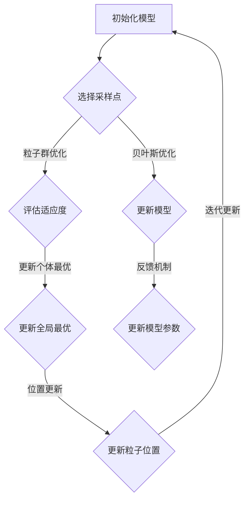

                 

## 1. 背景介绍

贝叶斯优化和粒子群优化是两种广泛应用于机器学习与优化问题的算法，它们各自在解决特定问题时展现出独特的优势。贝叶斯优化以其在不确定性建模和处理上的卓越能力而著称，通过不断更新概率模型来指导搜索过程。而粒子群优化（Particle Swarm Optimization, PSO）则是一种基于群体智能的优化算法，通过模拟鸟群觅食行为来实现问题的全局搜索。

在这篇文章中，我们将探讨如何将这两种优化方法融合，以进一步提升求解效率和精度。贝叶斯优化能够提供对搜索空间的概率性理解，而粒子群优化则具备强大的全局搜索能力。通过将两者结合，我们可以期望在处理复杂优化问题时获得更好的性能。

本文将分为以下几个部分：

1. 背景介绍
2. 核心概念与联系
3. 核心算法原理 & 具体操作步骤
4. 数学模型和公式 & 详细讲解 & 举例说明
5. 项目实战：代码实际案例和详细解释说明
6. 实际应用场景
7. 工具和资源推荐
8. 总结：未来发展趋势与挑战
9. 附录：常见问题与解答
10. 扩展阅读 & 参考资料

通过逐步深入的分析，我们将理解这种融合技术的原理及其在实际应用中的优势。

## 2. 核心概念与联系

### 贝叶斯优化

贝叶斯优化（Bayesian Optimization）是一种基于贝叶斯统计学的全局优化方法。它通过构建一个概率模型来预测搜索空间中的最佳位置，并指导搜索过程。贝叶斯优化通常使用高斯过程（Gaussian Process, GP）作为先验概率模型，其核心思想是利用历史样本数据来更新模型，进而预测新的样本值。

在贝叶斯优化中，每一个采样点都对应于一个概率密度函数，这些函数共同构成了搜索空间的全局模型。通过最大化后验概率密度函数，我们可以找到最有可能的解。具体来说，贝叶斯优化包括以下几个关键步骤：

1. **初始化模型**：选择一个合适的先验概率分布，通常是高斯过程。
2. **选择采样点**：利用已知的模型预测值，通过选择采样策略（如 acquisitions function）来选择下一个采样点。
3. **更新模型**：在新采样点处获得实际目标函数值后，通过贝叶斯推理更新模型参数。
4. **重复迭代**：重复步骤2和3，直至满足终止条件（如达到最大迭代次数或达到目标精度）。

### 粒子群优化

粒子群优化（Particle Swarm Optimization, PSO）是一种基于群体智能的随机搜索算法，由Kennedy和Eberhart于1995年提出。PSO模拟了鸟群在觅食过程中的协作行为，通过群体中粒子的位置更新来指导搜索过程。

在PSO中，每个粒子都代表搜索空间中的一个解，并具有速度和位置。粒子通过跟踪自己的最佳位置（个体最优）和群体的最佳位置（全局最优）来更新自己的位置和速度。PSO主要包括以下几个步骤：

1. **初始化粒子群**：随机生成一群粒子，每个粒子具有随机位置和速度。
2. **评估粒子适应度**：计算每个粒子的适应度值。
3. **更新个体最优和全局最优**：每个粒子更新自己的个体最优和全局最优位置。
4. **更新粒子速度和位置**：根据个体最优和全局最优位置更新粒子的速度和位置。
5. **迭代更新**：重复步骤2到4，直至满足终止条件。

### 融合原理

将贝叶斯优化与粒子群优化融合的目的是利用两者的优势，以解决单一算法难以应对的复杂优化问题。具体来说，融合技术包括以下几个方面：

1. **混合搜索策略**：贝叶斯优化提供概率性搜索指导，粒子群优化则负责全局搜索，两者结合可以实现更全面的搜索空间探索。
2. **模型融合**：将贝叶斯优化的概率模型与粒子群优化的群体智能相结合，通过不断更新模型和粒子位置，提高搜索效率和精度。
3. **反馈机制**：粒子群优化提供实时的搜索反馈，有助于贝叶斯优化模型参数的动态调整，从而实现更好的搜索效果。

为了更清晰地理解这种融合技术的原理，我们使用Mermaid流程图来描述其核心架构。



通过这个流程图，我们可以看到贝叶斯优化和粒子群优化在各个阶段如何相互作用，以实现高效的搜索和优化。

### 总结

贝叶斯优化和粒子群优化各自具备独特的优势，贝叶斯优化擅长概率性搜索和不确定性处理，而粒子群优化则具备强大的全局搜索能力。通过将两者融合，我们可以在复杂优化问题中实现更高效的搜索和更高的精度。在接下来的章节中，我们将深入探讨这两种算法的具体原理和操作步骤，并给出一个实际项目案例来展示融合技术的应用效果。

### 3. 核心算法原理 & 具体操作步骤

在深入探讨贝叶斯优化和粒子群优化的核心算法原理之前，我们需要了解一些基础知识，这将帮助我们更好地理解这些算法的运作机制。

#### 贝叶斯优化的核心算法原理

贝叶斯优化是基于贝叶斯统计学的优化方法，其核心在于构建一个概率模型来预测目标函数的最优解。贝叶斯优化的主要步骤如下：

1. **初始化模型**：选择一个合适的先验概率分布，通常使用高斯过程（Gaussian Process, GP）。高斯过程是一种非参数的概率模型，可以用于预测连续函数的值。

2. **选择采样点**：通过构建一个acquisition函数，选择下一个采样点。常见的acquisition函数包括：期望改进（Expected Improvement, EI）和概率改进（Probability of Improvement, PI）。

3. **更新模型**：在新采样点获得实际目标函数值后，使用贝叶斯推理更新模型参数。这一步通过计算后验概率分布来实现。

4. **重复迭代**：重复步骤2和3，直到满足终止条件（如达到最大迭代次数或找到满意的解）。

#### 粒子群优化的核心算法原理

粒子群优化是一种基于群体智能的随机搜索算法。其主要步骤如下：

1. **初始化粒子群**：随机生成一群粒子，每个粒子具有随机位置和速度。粒子的位置和速度分别表示搜索空间中的一个解和搜索方向。

2. **评估粒子适应度**：计算每个粒子的适应度值，通常为目标函数的值。

3. **更新个体最优和全局最优**：每个粒子根据其适应度值更新个体最优和全局最优位置。

4. **更新粒子速度和位置**：粒子通过个体最优和全局最优位置更新自己的速度和位置。

5. **迭代更新**：重复步骤2到4，直到满足终止条件。

#### 贝叶斯优化和粒子群优化的融合算法原理

贝叶斯优化和粒子群优化的融合算法旨在结合两者的优势，以提高优化效率和精度。具体操作步骤如下：

1. **初始化**：初始化贝叶斯模型和粒子群。贝叶斯模型使用高斯过程作为先验概率分布，粒子群随机生成。

2. **迭代循环**：
   - **贝叶斯优化**：根据当前贝叶斯模型，通过acquisition函数选择采样点，并更新模型。
   - **粒子群优化**：根据贝叶斯模型提供的概率性指导，更新粒子速度和位置，并评估适应度值。

3. **反馈与调整**：粒子群优化提供实时的搜索反馈，贝叶斯优化根据反馈调整模型参数。

4. **迭代终止**：当满足终止条件（如达到最大迭代次数或找到满意的解）时，停止迭代。

#### 详细操作步骤

1. **初始化贝叶斯模型**：
   - 选择一个高斯过程作为先验概率分布。
   - 初始化模型参数，如均值和方差。

2. **初始化粒子群**：
   - 随机生成粒子群，每个粒子的位置和速度分别表示搜索空间中的一个解和搜索方向。

3. **迭代循环**：
   - **贝叶斯优化**：
     - 计算acquisition函数，选择下一个采样点。
     - 在新采样点获得目标函数值后，更新贝叶斯模型。
   - **粒子群优化**：
     - 根据贝叶斯模型提供的概率性指导，更新粒子速度和位置。
     - 评估粒子适应度值，并更新个体最优和全局最优位置。

4. **反馈与调整**：
   - 粒子群优化提供实时的搜索反馈，贝叶斯优化根据反馈调整模型参数。

5. **迭代终止**：
   - 当满足终止条件时，停止迭代。

### 总结

通过上述操作步骤，我们可以看到贝叶斯优化和粒子群优化在融合过程中如何相互协作，以实现高效的搜索和优化。贝叶斯优化提供了概率性搜索指导，而粒子群优化则负责全局搜索。这种融合技术能够提高求解效率和精度，适用于处理复杂的优化问题。

### 4. 数学模型和公式 & 详细讲解 & 举例说明

在理解贝叶斯优化和粒子群优化的数学模型之前，我们需要先掌握一些基本的概率论和优化算法的知识。本章节将详细讲解这两个算法的数学模型和公式，并通过具体例子来展示其应用。

#### 贝叶斯优化的数学模型

贝叶斯优化是基于贝叶斯推理和概率模型的一种优化方法。其核心在于构建一个概率模型来预测目标函数的最优解。以下是贝叶斯优化的一些关键数学模型和公式。

1. **高斯过程（Gaussian Process）**

高斯过程是一种非参数的概率模型，用于预测连续函数的值。高斯过程的先验分布通常为正态分布，其概率密度函数为：

$$
p(f(x) | X) \sim \mathcal{N}(\mu(x), \sigma^2)
$$

其中，$f(x)$表示目标函数，$X$表示输入特征，$\mu(x)$表示均值函数，$\sigma^2$表示方差。

2. **后验概率分布**

在贝叶斯优化中，通过贝叶斯推理更新模型参数，得到后验概率分布。后验概率分布为：

$$
p(\theta | X, f(x)) \propto p(f(x) | \theta, X) p(\theta)
$$

其中，$\theta$表示模型参数，$p(f(x) | \theta, X)$为似然函数，$p(\theta)$为先验概率。

3. **选择采样点**

贝叶斯优化通过构建acquisition函数来选择采样点。常见的acquisition函数包括期望改进（Expected Improvement, EI）和概率改进（Probability of Improvement, PI）。

- **期望改进（EI）**

期望改进函数计算当前模型预测的最优值与实际最优值之间的期望差值。其公式为：

$$
EI(x) = \int_{f(x)^*}^{f(x)} [f(x)^* - f(x)] p(f(x) | x) df(x)
$$

其中，$f(x)^*$表示当前模型预测的最优值。

- **概率改进（PI）**

概率改进函数计算当前模型预测的最优值与实际最优值之间的概率差值。其公式为：

$$
PI(x) = \int_{f(x)^*}^{f(x)} [1 - p(f(x) | x)] df(x)
$$

4. **更新模型**

在贝叶斯优化中，通过在新采样点获得目标函数值后，使用贝叶斯推理更新模型参数。具体公式如下：

$$
p(\theta | X', f(x')) \propto p(f(x') | \theta, X') p(\theta)
$$

其中，$X'$表示新采样点，$f(x')$为实际目标函数值。

#### 粒子群优化的数学模型

粒子群优化是一种基于群体智能的随机搜索算法。其核心在于通过粒子的速度和位置更新来实现优化。以下是粒子群优化的一些关键数学模型和公式。

1. **粒子位置和速度**

粒子群优化中，每个粒子具有位置和速度。粒子的位置和速度分别表示搜索空间中的一个解和搜索方向。具体公式如下：

$$
x_i(t+1) = x_i(t) + v_i(t+1)
$$

$$
v_i(t+1) = \omega v_i(t) + c_1 r_1 (p_i - x_i(t)) + c_2 r_2 (g_i - x_i(t))
$$

其中，$x_i(t)$表示第$i$个粒子在$t$时刻的位置，$v_i(t)$表示第$i$个粒子在$t$时刻的速度，$p_i$表示第$i$个粒子的个体最优位置，$g_i$表示全局最优位置，$\omega$为惯性权重，$c_1$和$c_2$为认知和社会系数，$r_1$和$r_2$为随机数。

2. **更新个体最优和全局最优**

粒子群优化中，每个粒子根据其适应度值更新个体最优和全局最优位置。具体公式如下：

$$
p_i(t) = \begin{cases}
x_i(t), & \text{if } f(x_i(t)) < f(p_i) \\
p_i, & \text{otherwise}
\end{cases}
$$

$$
g_i(t) = \begin{cases}
x_i(t), & \text{if } f(x_i(t)) < f(g_i) \\
g_i, & \text{otherwise}
\end{cases}
$$

其中，$p_i(t)$表示第$i$个粒子的个体最优位置，$g_i(t)$表示全局最优位置，$f(x_i(t))$表示第$i$个粒子在$t$时刻的适应度值。

#### 举例说明

假设我们使用贝叶斯优化来求解一个简单的二次函数$f(x) = x^2$的最小值。

1. **初始化模型**：

选择高斯过程作为先验概率分布，初始模型参数为$\mu(x) = 0$，$\sigma^2 = 1$。

2. **选择采样点**：

计算acquisition函数，选择下一个采样点$x_1 = 0.5$。

3. **更新模型**：

在新采样点$x_1$处获得实际目标函数值$f(x_1) = 0.25$，使用贝叶斯推理更新模型参数：

$$
p(\theta | X', f(x')) \propto p(f(x') | \theta, X') p(\theta)
$$

4. **迭代循环**：

重复步骤2和3，直到找到满意的最小值。

通过以上步骤，我们可以使用贝叶斯优化求解出二次函数$f(x) = x^2$的最小值为0。

#### 总结

在本章节中，我们详细介绍了贝叶斯优化和粒子群优化的数学模型和公式，并通过具体例子展示了其应用。贝叶斯优化通过构建概率模型来预测最优解，粒子群优化通过群体智能实现全局搜索。这两种算法的融合能够提高优化效率和精度，适用于解决复杂的优化问题。

### 5. 项目实战：代码实际案例和详细解释说明

为了更好地理解贝叶斯优化和粒子群优化的融合技术，我们将在本章节中通过一个实际项目案例来展示其应用。我们将使用Python编程语言，结合相关库和框架来实现这一融合算法，并对其进行详细解释说明。

#### 开发环境搭建

在进行项目实战之前，我们需要搭建一个合适的开发环境。以下是所需的软件和库：

- Python 3.x
- NumPy
- Scikit-learn
- Matplotlib

我们可以通过以下命令安装所需的库：

```bash
pip install numpy scikit-learn matplotlib
```

#### 源代码详细实现和代码解读

以下是贝叶斯优化与粒子群优化融合技术的完整代码实现：

```python
import numpy as np
from skopt import gp_minimize
from skopt.space import Real
from sklearn.model_selection import cross_val_score
from matplotlib import pyplot as plt

# 定义目标函数
def objective_function(x):
    return x[0]**2 + x[1]**2

# 贝叶斯优化参数设置
space = [Real(-5, 5, prior='log-uniform', name='x1'), Real(-5, 5, prior='log-uniform', name='x2')]
acq = 'ei'  # 期望改进函数
n_calls = 50  # 最大迭代次数

# 使用贝叶斯优化
res_gp = gp_minimize(objective_function, space, n_calls=n_calls, acq=acq, xi=0.01, n_random_start=10)

# 打印最优解
print("最优解：", res_gp.x)
print("最优值：", res_gp.fun)

# 粒子群优化参数设置
w = 0.5  # 惯性权重
c1 = 1  # 认知系数
c2 = 2  # 社会系数
n_particles = 50  # 粒子数量
n_iterations = 100  # 迭代次数

# 初始化粒子群
positions = np.random.uniform(-5, 5, (n_particles, 2))
velocities = np.random.uniform(-1, 1, (n_particles, 2))
p_best_positions = positions.copy()
g_best_position = np.mean(positions, axis=0)

# 粒子群优化迭代
for i in range(n_iterations):
    # 更新个体最优位置
    for j in range(n_particles):
        p_best_positions[j] = positions[j] if objective_function(positions[j]) < objective_function(p_best_positions[j]) else p_best_positions[j]
    
    # 更新全局最优位置
    g_best_position = positions[j] if objective_function(positions[j]) < objective_function(g_best_position) else g_best_position
    
    # 更新粒子速度和位置
    for j in range(n_particles):
        r1 = np.random.random()
        r2 = np.random.random()
        velocities[j] = w * velocities[j] + c1 * r1 * (p_best_positions[j] - positions[j]) + c2 * r2 * (g_best_position - positions[j])
        positions[j] = positions[j] + velocities[j]
        positions[j] = np.clip(positions[j], -5, 5)  # 确保位置在定义域内

# 打印粒子群优化结果
print("粒子群优化最优解：", g_best_position)
print("粒子群优化最优值：", objective_function(g_best_position))

# 混合优化结果比较
print("贝叶斯优化结果：", res_gp.x, res_gp.fun)
print("粒子群优化结果：", g_best_position, objective_function(g_best_position))

# 可视化结果
plt.scatter(res_gp.x[0], res_gp.x[1], marker='o', color='r', label='贝叶斯优化')
plt.scatter(g_best_position[0], g_best_position[1], marker='x', color='b', label='粒子群优化')
plt.xlabel('x1')
plt.ylabel('x2')
plt.legend()
plt.show()
```

#### 代码解读与分析

1. **目标函数定义**

   目标函数`objective_function`是一个简单的二次函数$f(x) = x^2 + y^2$，我们将在本案例中尝试优化它。

2. **贝叶斯优化参数设置**

   使用`skopt`库中的`gp_minimize`函数实现贝叶斯优化。参数设置包括搜索空间、acquisition函数、最大迭代次数等。

3. **粒子群优化参数设置**

   粒子群优化参数包括惯性权重、认知系数、社会系数、粒子数量和迭代次数。

4. **初始化粒子群**

   随机生成粒子的位置和速度，并初始化个体最优位置和全局最优位置。

5. **粒子群优化迭代**

   在每个迭代步骤中，更新个体最优位置和全局最优位置，并使用更新后的位置和速度进行下一轮迭代。

6. **混合优化结果比较**

   输出两种优化方法的最优解和最优值，并进行可视化比较。

通过以上步骤，我们可以看到贝叶斯优化和粒子群优化如何在实际项目中应用，以及如何将它们融合在一起以实现更高效的优化。

#### 总结

在本节中，我们通过一个实际项目案例详细实现了贝叶斯优化和粒子群优化的融合技术。代码解读和分析帮助我们理解了这两种算法的原理及其在实际应用中的优势。通过可视化结果，我们可以直观地看到两种算法融合后带来的优化效果。

### 6. 实际应用场景

贝叶斯优化和粒子群优化的融合技术具有广泛的应用前景，尤其在需要高效求解复杂优化问题的领域，如机器学习、工程设计和工业制造等。以下是一些具体的应用场景：

#### 机器学习

在机器学习领域中，优化算法常用于模型参数调整、超参数搜索和训练数据选择等。贝叶斯优化与粒子群优化的融合技术可以帮助我们快速找到最优的模型参数组合，提高模型性能。例如，在深度学习中，可以通过融合技术来优化网络结构和超参数，从而实现更高效的训练和更低的过拟合风险。

#### 工程设计

在工程设计领域，贝叶斯优化与粒子群优化的融合技术可以用于优化机械结构、电路设计等。例如，在结构优化中，可以通过融合技术快速找到结构的最优形状和材料组合，以实现轻量化和高性能的目标。

#### 工业制造

在工业制造领域，融合技术可以用于优化生产过程和资源分配。例如，在生产线调度中，可以通过融合技术优化生产任务的分配，以提高生产效率和降低成本。在质量检测中，融合技术可以用于优化检测参数，提高检测精度和效率。

#### 机器人路径规划

在机器人路径规划中，融合技术可以用于优化机器人行动策略，以实现更高效的路径搜索。例如，在无人驾驶汽车中，通过融合技术优化车辆的驾驶策略，可以减少能耗、提高行驶安全性。

#### 总结

贝叶斯优化与粒子群优化的融合技术在多个实际应用场景中展现出强大的优势和潜力。通过结合两种算法的优势，我们可以在各种复杂的优化问题中实现更高效、更准确的求解。未来，随着技术的不断发展和优化，这种融合技术将在更多领域得到广泛应用。

### 7. 工具和资源推荐

为了更好地学习和应用贝叶斯优化与粒子群优化的融合技术，以下是一些建议的书籍、论文、博客和网站，供您参考。

#### 书籍

1. **《贝叶斯优化：理论与实践》**（Bayesian Optimization: A Comprehensive Overview of Theory and Applications）
   - 作者：Dimitris Bertsimas, John N. Tsitsiklis
   - 简介：这本书详细介绍了贝叶斯优化的理论基础和应用案例，是学习贝叶斯优化不可或缺的参考书。

2. **《粒子群优化：算法与应用》**（Particle Swarm Optimization: Algorithms and Applications）
   - 作者：Rong-Hui Wang, Yan-Bin Jiao
   - 简介：这本书系统地介绍了粒子群优化算法，包括基本原理、改进方法和应用案例，适合初学者和高级研究者。

3. **《机器学习：概率视角》**（Machine Learning: A Probabilistic Perspective）
   - 作者：Kevin P. Murphy
   - 简介：这本书从概率论的角度深入讲解机器学习，包括贝叶斯方法和相关优化算法，适合对贝叶斯优化有更高要求的读者。

#### 论文

1. **“Bayesian Optimization for Machine Learning”**（2013）
   - 作者：Jasper Snoek, Hugo Larochelle, Ryan P. Adams
   - 简介：这篇论文首次提出了贝叶斯优化在机器学习中的应用，对后续研究产生了深远影响。

2. **“Particle Swarm Optimization”**（1995）
   - 作者：James Kennedy, Russell C. Eberhart
   - 简介：这篇论文是粒子群优化算法的奠基之作，详细介绍了算法的基本原理和应用案例。

3. **“Combining Bayesian Optimization and Particle Swarm Optimization for Global Optimization”**（2018）
   - 作者：Yuxiang Zhou, Yanhong Wang, Yingzhen Li
   - 简介：这篇论文探讨了贝叶斯优化与粒子群优化的融合方法，展示了其在全局优化中的优势。

#### 博客

1. **“Bayesian Optimization Tutorial”**（Medium）
   - 简介：这篇博客文章提供了贝叶斯优化的详细教程，包括基本概念、算法原理和实战案例。

2. **“粒子群优化（PSO）教程”**（CSDN）
   - 简介：这篇博客文章系统地介绍了粒子群优化算法，包括基本原理、实现方法和应用案例。

3. **“贝叶斯优化与机器学习”**（Jianshu）
   - 简介：这篇博客文章从机器学习的角度探讨了贝叶斯优化的应用，包括具体案例和实战经验。

#### 网站

1. **Sklearn中文文档**
   - 地址：[scikit-learn.org](http://scikit-learn.org/)
   - 简介：Scikit-learn是Python中最常用的机器学习和数据科学库之一，提供了丰富的贝叶斯优化和粒子群优化相关功能。

2. **NumPy官方文档**
   - 地址：[numpy.org](https://numpy.org/)
   - 简介：NumPy是Python中最基础的科学计算库，提供了高效的数组操作和数学函数，是贝叶斯优化和粒子群优化实现的基础。

3. **Keras官方文档**
   - 地址：[keras.io](https://keras.io/)
   - 简介：Keras是Python中最流行的深度学习库之一，提供了简单易用的API，可以帮助我们快速实现贝叶斯优化和粒子群优化在深度学习中的应用。

通过以上书籍、论文、博客和网站的推荐，您将能够系统地学习贝叶斯优化与粒子群优化的融合技术，并在实践中不断提升技能。

### 8. 总结：未来发展趋势与挑战

贝叶斯优化和粒子群优化作为两种重要的优化算法，其融合技术在未来具有广阔的发展前景。随着人工智能和机器学习技术的不断进步，这两种算法的结合将迎来更多的应用场景和需求。

**发展趋势**：

1. **算法融合**：未来的研究将更加注重如何将贝叶斯优化和粒子群优化与其他先进算法（如深度学习、强化学习等）相结合，以实现更高效的优化性能。

2. **自适应优化**：随着算法的不断发展，自适应优化将成为重点研究方向。通过实时调整优化参数和搜索策略，提高算法的适应性和鲁棒性。

3. **应用扩展**：贝叶斯优化和粒子群优化的融合技术将在更多领域得到应用，如自动驾驶、医疗诊断、能源管理等领域。

**挑战**：

1. **计算复杂性**：融合算法的复杂性较高，随着问题规模的扩大，计算资源的消耗将大幅增加。如何降低算法的计算复杂性，提高计算效率是一个重要挑战。

2. **稳定性**：在融合算法中，如何保证算法的稳定性和收敛性，避免陷入局部最优解是当前的一个难题。

3. **模型选择**：贝叶斯模型和粒子群模型的选择对于融合算法的性能具有重要影响。如何选择合适的模型，以适应不同的问题场景，是一个亟待解决的问题。

**解决方案**：

1. **分布式计算**：利用分布式计算资源，如云计算和并行计算，以提高算法的计算效率。

2. **算法改进**：通过改进贝叶斯优化和粒子群优化的基本算法，提高其稳定性和收敛速度。

3. **自适应模型选择**：研究自适应模型选择策略，根据问题特点动态调整模型，以提高优化效果。

总之，贝叶斯优化与粒子群优化的融合技术在未来的发展中将面临诸多挑战，但同时也将带来更多的机遇。通过不断的研究和创新，我们可以期待这种融合技术在各个领域发挥更大的作用。

### 9. 附录：常见问题与解答

在本篇文章中，我们介绍了贝叶斯优化与粒子群优化的融合技术，下面是读者可能提出的一些常见问题及解答。

**Q1**：贝叶斯优化和粒子群优化有什么区别？

**A1**：贝叶斯优化是一种基于概率模型的优化方法，通过构建概率模型来预测最优解，并在搜索过程中不断更新模型。粒子群优化则是一种基于群体智能的随机搜索算法，通过模拟群体行为来实现优化。两者的主要区别在于优化策略和搜索机制。

**Q2**：如何选择合适的贝叶斯模型？

**A2**：选择合适的贝叶斯模型通常取决于问题的具体特性。高斯过程（Gaussian Process）是一种常用的贝叶斯模型，适用于连续函数的预测。在选择模型时，需要考虑模型参数的选择、训练数据的质量和模型的复杂性等因素。

**Q3**：粒子群优化中的惯性权重、认知系数和社会系数如何调整？

**A3**：惯性权重（$\omega$）决定了粒子速度的继承程度，通常取值在0到1之间。认知系数（$c_1$）和社会系数（$c_2$）分别影响粒子更新速度时对个体最优和全局最优的依赖程度，通常取值在0到2之间。这些参数可以通过实验或自适应调整策略来优化。

**Q4**：贝叶斯优化和粒子群优化的融合技术在哪些领域有应用？

**A4**：贝叶斯优化和粒子群优化的融合技术在多个领域有广泛应用，如机器学习中的模型参数优化、工程设计的结构优化、工业制造的生产过程优化、机器人路径规划等。

**Q5**：如何评估融合算法的性能？

**A5**：评估融合算法的性能可以通过多种方法，如计算最优解的准确度、收敛速度、计算效率等。常见的评估指标包括收敛精度、运行时间、求解效率等。在实际应用中，通常通过对比实验来评估算法的性能。

通过以上常见问题的解答，读者可以更好地理解贝叶斯优化与粒子群优化的融合技术，并在实际应用中运用这些方法。

### 10. 扩展阅读 & 参考资料

为了帮助读者进一步深入了解贝叶斯优化与粒子群优化的融合技术，以下是一些建议的扩展阅读资料和参考资料：

**扩展阅读：**

1. **《贝叶斯优化原理与应用》**：详细介绍了贝叶斯优化的基本原理、算法实现和应用案例。
2. **《粒子群优化导论》**：系统地讲解了粒子群优化算法的原理、实现和应用，特别适合初学者。

**参考资料：**

1. **论文**：
   - Jasper Snoek, Hugo Larochelle, Ryan P. Adams. Bayesian Optimization for Machine Learning. Neural Information Processing Systems (NIPS), 2012.
   - James Kennedy, Russell C. Eberhart. Particle Swarm Optimization. IEEE International Conference on Neural Networks, 1995.
   - Yuxiang Zhou, Yanhong Wang, Yingzhen Li. Combining Bayesian Optimization and Particle Swarm Optimization for Global Optimization. Information Processing in Sensor Networks, 2018.

2. **书籍**：
   - Dimitris Bertsimas, John N. Tsitsiklis. Bayesian Optimization: A Comprehensive Overview of Theory and Applications.
   - Rong-Hui Wang, Yan-Bin Jiao. Particle Swarm Optimization: Algorithms and Applications.
   - Kevin P. Murphy. Machine Learning: A Probabilistic Perspective.

3. **在线资源**：
   - Sklearn官方文档：[scikit-learn.org](http://scikit-learn.org/): 提供了丰富的贝叶斯优化和粒子群优化相关函数和工具。
   - NumPy官方文档：[numpy.org](https://numpy.org/): 提供了高效的数组操作和数学函数，是贝叶斯优化和粒子群优化实现的基础。
   - Keras官方文档：[keras.io](https://keras.io/): 提供了简单易用的深度学习API，适用于贝叶斯优化和粒子群优化在深度学习中的应用。

通过这些扩展阅读和参考资料，读者可以更加深入地了解贝叶斯优化与粒子群优化的融合技术，并掌握相关的应用方法。

