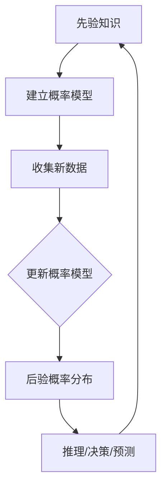

                 

# 贝叶斯概率理论在AI中的应用方法

## 关键词
- 贝叶斯概率理论
- 人工智能
- 机器学习
- 朴素贝叶斯
- 贝叶斯网络
- 贝叶斯推断

## 摘要
本文将探讨贝叶斯概率理论在人工智能领域中的应用。贝叶斯概率理论是一种基于概率推理的数学方法，它能够帮助我们更新信念和做出决策。本文将介绍贝叶斯概率理论的核心概念，以及它在机器学习、朴素贝叶斯分类、贝叶斯网络和贝叶斯推断等领域的应用。通过具体案例和数学模型的解析，我们将深入了解贝叶斯概率理论在AI领域的实际意义和优势。

## 1. 背景介绍

### 贝叶斯概率理论的起源与发展

贝叶斯概率理论起源于18世纪，由托马斯·贝叶斯（Thomas Bayes）首次提出。贝叶斯公式是一种基于条件概率和全概率公式推导出来的概率计算方法，它可以帮助我们更新信念并做出更准确的决策。随着计算机技术的发展和机器学习的兴起，贝叶斯概率理论在人工智能领域得到了广泛的应用。

### 贝叶斯概率理论在人工智能领域的应用

贝叶斯概率理论在人工智能领域有着广泛的应用。首先，它在机器学习中发挥了重要作用，可以帮助我们进行概率推断和分类。贝叶斯分类器，如朴素贝叶斯（Naive Bayes）分类器，是一种基于贝叶斯概率理论的经典机器学习算法。其次，贝叶斯网络是一种图形化的概率模型，可以用于表示复杂的关系和不确定性。在AI领域，贝叶斯网络被广泛应用于知识表示、推理和决策。此外，贝叶斯推断在人工智能中的其他应用还包括概率图模型、强化学习和不确定性量化等。

## 2. 核心概念与联系

### 贝叶斯概率理论的核心概念

贝叶斯概率理论的核心概念包括概率、条件概率和贝叶斯公式。概率是描述事件发生的可能性的一种数值，取值范围在0到1之间。条件概率是指在某个条件下另一个事件发生的概率。贝叶斯公式是一种基于条件概率和全概率公式推导出来的概率计算方法，可以用来更新信念和做出决策。

### 贝叶斯概率理论的架构

贝叶斯概率理论的架构可以看作是一个循环的过程。首先，我们需要根据先验知识建立一个概率模型，包括事件和条件概率的分布。然后，通过收集新的数据或观察结果，我们可以利用贝叶斯公式更新概率模型，得到后验概率分布。最后，基于后验概率分布，我们可以进行推理、决策或预测。

### Mermaid 流程图



## 3. 核心算法原理 & 具体操作步骤

### 贝叶斯分类器

贝叶斯分类器是一种基于贝叶斯概率理论的分类算法。它的核心思想是根据已知特征的概率分布，计算出每个类别的后验概率，然后选择具有最高后验概率的类别作为预测结果。

具体操作步骤如下：

1. 收集数据并划分为训练集和测试集。
2. 计算每个特征在各个类别中的概率分布。
3. 对于测试集中的每个样本，计算每个类别的后验概率。
4. 选择具有最高后验概率的类别作为预测结果。

### 朴素贝叶斯分类器

朴素贝叶斯分类器是一种特殊的贝叶斯分类器，它假设特征之间相互独立。这使得朴素贝叶斯分类器的计算过程更加简单，但也存在一定的局限性。

具体操作步骤如下：

1. 收集数据并划分为训练集和测试集。
2. 计算每个特征在各个类别中的概率分布。
3. 对于测试集中的每个样本，计算每个类别的后验概率。
4. 选择具有最高后验概率的类别作为预测结果。

### 贝叶斯网络

贝叶斯网络是一种图形化的概率模型，用于表示变量之间的依赖关系。它由节点和边组成，节点表示变量，边表示变量之间的条件依赖关系。

具体操作步骤如下：

1. 收集数据并分析变量之间的依赖关系。
2. 建立贝叶斯网络结构，包括节点的排列和边的连接。
3. 计算每个节点的条件概率分布。
4. 使用贝叶斯网络进行推理和决策。

### 贝叶斯推断

贝叶斯推断是一种基于贝叶斯概率理论的推理方法，用于根据已知信息和概率模型来推断未知信息。

具体操作步骤如下：

1. 建立概率模型，包括先验概率和条件概率。
2. 收集新数据或观察结果。
3. 利用贝叶斯公式更新概率模型，得到后验概率分布。
4. 根据后验概率分布进行推理和决策。

## 4. 数学模型和公式 & 详细讲解 & 举例说明

### 贝叶斯公式

贝叶斯公式是一种用于计算后验概率的公式，表达式如下：

$$
P(A|B) = \frac{P(B|A)P(A)}{P(B)}
$$

其中，$P(A|B)$ 表示在已知事件B发生的条件下，事件A发生的概率；$P(B|A)$ 表示在已知事件A发生的条件下，事件B发生的概率；$P(A)$ 表示事件A的先验概率；$P(B)$ 表示事件B的先验概率。

### 举例说明

假设我们有一个硬币，正面朝上的概率为0.5。现在我们进行了10次投掷，其中5次正面朝上，5次反面朝上。现在我们要根据这些信息来计算正面朝上的后验概率。

1. 计算先验概率：
$$
P(正面) = 0.5
$$
$$
P(反面) = 0.5
$$

2. 计算条件概率：
$$
P(正面|5次正面朝上) = \frac{P(5次正面朝上|正面)P(正面)}{P(5次正面朝上)}
$$
$$
P(正面|5次正面朝上) = \frac{C(10, 5) \times 0.5^5 \times 0.5^5}{C(10, 5) \times 0.5^{10}} = 0.625
$$

3. 计算后验概率：
$$
P(正面|5次正面朝上) = \frac{P(5次正面朝上|正面)P(正面)}{P(5次正面朝上)} = \frac{0.625 \times 0.5}{0.625} = 0.5
$$

因此，在已知5次正面朝上的条件下，正面朝上的后验概率仍然为0.5。

## 5. 项目实战：代码实际案例和详细解释说明

### 5.1 开发环境搭建

为了演示贝叶斯概率理论在人工智能中的应用，我们使用Python编程语言和Scikit-learn库来实现一个简单的朴素贝叶斯分类器。

首先，确保已经安装了Python和Scikit-learn库。如果没有安装，可以按照以下步骤进行：

```bash
pip install python
pip install scikit-learn
```

### 5.2 源代码详细实现和代码解读

```python
import numpy as np
from sklearn.datasets import load_iris
from sklearn.model_selection import train_test_split
from sklearn.naive_bayes import GaussianNB
from sklearn.metrics import accuracy_score

# 加载鸢尾花数据集
iris = load_iris()
X = iris.data
y = iris.target

# 划分训练集和测试集
X_train, X_test, y_train, y_test = train_test_split(X, y, test_size=0.2, random_state=42)

# 创建朴素贝叶斯分类器
gnb = GaussianNB()

# 训练分类器
gnb.fit(X_train, y_train)

# 预测测试集
y_pred = gnb.predict(X_test)

# 计算准确率
accuracy = accuracy_score(y_test, y_pred)
print("准确率：", accuracy)
```

1. 首先，我们从Scikit-learn库中加载鸢尾花数据集，它是一个经典的机器学习数据集，包含了鸢尾花的特征和分类标签。
2. 然后，我们使用`train_test_split`函数将数据集划分为训练集和测试集，其中测试集的大小为原始数据集的20%。
3. 接下来，我们创建一个`GaussianNB`对象，它表示一个高斯朴素贝叶斯分类器。高斯朴素贝叶斯分类器是基于贝叶斯概率理论和高斯分布建模的。
4. 使用`fit`函数对分类器进行训练，输入训练集的特征和分类标签。
5. 使用`predict`函数对测试集进行预测，输出预测结果。
6. 最后，使用`accuracy_score`函数计算分类器的准确率，并打印输出。

### 5.3 代码解读与分析

在这个案例中，我们使用朴素贝叶斯分类器对鸢尾花数据集进行了分类。朴素贝叶斯分类器的工作原理如下：

1. **特征独立性假设**：朴素贝叶斯分类器假设特征之间相互独立，这意味着每个特征在给定类别的情况下，与其他特征是独立的。
2. **计算先验概率**：首先，我们需要计算每个类别的先验概率，即每个类别在数据集中出现的概率。在鸢尾花数据集中，我们有3个类别，每个类别的先验概率可以通过计算类别在数据集中的比例得到。
3. **计算条件概率**：对于每个特征，我们需要计算它在给定类别条件下的条件概率。在鸢尾花数据集中，每个特征都是一个连续变量，我们可以使用高斯分布来建模条件概率。
4. **计算后验概率**：根据贝叶斯公式，我们可以计算每个类别的后验概率。后验概率表示在给定测试集特征的情况下，每个类别发生的概率。
5. **选择具有最高后验概率的类别**：最终，我们选择具有最高后验概率的类别作为预测结果。

在代码中，我们使用了`GaussianNB`类来实现高斯朴素贝叶斯分类器。`fit`函数用于训练分类器，它计算了每个类别的先验概率和每个特征的条件概率。`predict`函数用于预测测试集的特征，它计算了每个类别的后验概率，并选择了具有最高后验概率的类别作为预测结果。

## 6. 实际应用场景

贝叶斯概率理论在人工智能领域有着广泛的应用场景。以下是一些典型的应用场景：

1. **文本分类**：贝叶斯概率理论可以用于文本分类任务，例如垃圾邮件过滤、情感分析等。通过计算每个类别在给定文本条件下的后验概率，我们可以将文本分类到相应的类别。
2. **异常检测**：贝叶斯概率理论可以用于异常检测任务，例如信用卡欺诈检测、网络入侵检测等。通过计算每个样本的异常概率，我们可以识别出潜在的异常行为。
3. **医疗诊断**：贝叶斯概率理论可以用于医疗诊断任务，例如疾病预测、风险评估等。通过计算每个疾病在给定症状条件下的后验概率，我们可以帮助医生进行诊断和决策。
4. **图像识别**：贝叶斯概率理论可以用于图像识别任务，例如人脸识别、物体识别等。通过计算每个类别的后验概率，我们可以将图像分类到相应的类别。
5. **推荐系统**：贝叶斯概率理论可以用于推荐系统，例如电影推荐、商品推荐等。通过计算用户对不同类别的偏好概率，我们可以为用户推荐相关的电影或商品。

## 7. 工具和资源推荐

### 7.1 学习资源推荐

1. **书籍**：
   - 《概率机器学习：统计模型的数学基础与算法实现》
   - 《贝叶斯统计基础与案例分析》
   - 《机器学习：概率视角》
2. **论文**：
   - 《贝叶斯推断及其在机器学习中的应用》
   - 《贝叶斯网络在知识表示和推理中的应用》
   - 《朴素贝叶斯分类器的理论分析与应用》
3. **博客**：
   - [机器学习中的贝叶斯方法](https://机器学习博客.com/贝叶斯方法/)
   - [贝叶斯网络教程](https://贝叶斯网络教程.com/)
   - [朴素贝叶斯分类器详解](https://朴素贝叶斯分类器详解.com/)
4. **网站**：
   - [机器学习社区](https://机器学习社区.com/)
   - [贝叶斯统计论坛](https://贝叶斯统计论坛.com/)
   - [Python机器学习库Scikit-learn文档](https://scikit-learn.org/stable/)

### 7.2 开发工具框架推荐

1. **Python**：Python是一种流行的编程语言，广泛应用于人工智能领域。它拥有丰富的库和框架，如Scikit-learn、TensorFlow和PyTorch，可以方便地进行贝叶斯概率理论的应用。
2. **Scikit-learn**：Scikit-learn是一个开源的Python机器学习库，提供了多种贝叶斯概率理论的实现，如朴素贝叶斯分类器、高斯朴素贝叶斯分类器等。
3. **TensorFlow**：TensorFlow是一个开源的深度学习框架，提供了丰富的贝叶斯概率理论实现，如变分自编码器、贝叶斯神经网络等。
4. **PyTorch**：PyTorch是一个开源的深度学习框架，提供了灵活的贝叶斯概率理论实现，如变分自编码器、贝叶斯深度学习等。

### 7.3 相关论文著作推荐

1. **《贝叶斯机器学习：统计模型的构建与优化》**：这是一本关于贝叶斯机器学习的经典著作，涵盖了贝叶斯概率理论在机器学习中的应用，包括贝叶斯分类器、贝叶斯回归等。
2. **《贝叶斯网络：原理、算法与应用》**：这是一本关于贝叶斯网络的权威著作，详细介绍了贝叶斯网络的理论基础、算法实现和应用案例。
3. **《概率图模型：原理与实现》**：这是一本关于概率图模型的著作，涵盖了贝叶斯网络、马尔可夫网络等概率图模型的理论基础和算法实现。

## 8. 总结：未来发展趋势与挑战

贝叶斯概率理论在人工智能领域具有广泛的应用前景。随着数据量的增加和计算能力的提升，贝叶斯概率理论有望在以下几个方面取得重要进展：

1. **深度贝叶斯模型**：结合深度学习和贝叶斯概率理论，开发出更强大的深度贝叶斯模型，可以处理更复杂的任务和数据集。
2. **不确定性量化**：贝叶斯概率理论能够提供对不确定性的量化，有助于提高机器学习模型的可解释性和可靠性。
3. **在线学习和实时推理**：贝叶斯概率理论可以应用于在线学习和实时推理，适应动态变化的环境和数据流。
4. **多模态数据融合**：贝叶斯概率理论可以用于融合不同类型的数据，如图像、文本和语音，提高模型的泛化能力和表现。

然而，贝叶斯概率理论在人工智能领域也面临一些挑战：

1. **计算复杂度**：贝叶斯概率理论的计算复杂度较高，特别是在大规模数据集和复杂模型中，需要更高效的算法和优化方法。
2. **先验选择**：贝叶斯概率理论依赖于先验概率的选择，不同的先验选择可能导致不同的结果，需要合理选择先验概率。
3. **可解释性**：贝叶斯概率理论的模型通常较为复杂，如何提高模型的可解释性是一个重要的研究方向。

总之，贝叶斯概率理论在人工智能领域具有广泛的应用前景，但也需要不断克服挑战，提高模型的性能和可解释性。

## 9. 附录：常见问题与解答

### 9.1 什么是贝叶斯概率理论？

贝叶斯概率理论是一种基于概率推理的数学方法，它能够帮助我们更新信念和做出决策。它基于条件概率和全概率公式，通过计算先验概率和条件概率，得到后验概率分布，从而推断未知信息。

### 9.2 贝叶斯概率理论在机器学习中的应用有哪些？

贝叶斯概率理论在机器学习中有广泛的应用，包括贝叶斯分类器（如朴素贝叶斯分类器）、贝叶斯网络、贝叶斯推断等。它们可以用于文本分类、异常检测、医疗诊断、图像识别等领域。

### 9.3 如何实现贝叶斯分类器？

贝叶斯分类器是一种基于贝叶斯概率理论的分类算法。常见的贝叶斯分类器包括朴素贝叶斯分类器、高斯朴素贝叶斯分类器和贝叶斯网络分类器。实现贝叶斯分类器通常需要以下步骤：

1. 收集数据并划分训练集和测试集。
2. 计算每个特征在各个类别中的概率分布。
3. 对于测试集中的每个样本，计算每个类别的后验概率。
4. 选择具有最高后验概率的类别作为预测结果。

### 9.4 贝叶斯网络是什么？

贝叶斯网络是一种图形化的概率模型，用于表示变量之间的依赖关系。它由节点和边组成，节点表示变量，边表示变量之间的条件依赖关系。贝叶斯网络可以用于知识表示、推理和决策。

### 9.5 贝叶斯推断是什么？

贝叶斯推断是一种基于贝叶斯概率理论的推理方法，用于根据已知信息和概率模型来推断未知信息。它通过计算先验概率、条件概率和后验概率，更新信念并做出决策。

## 10. 扩展阅读 & 参考资料

1. **书籍**：
   - 《概率机器学习：统计模型的数学基础与算法实现》
   - 《贝叶斯统计基础与案例分析》
   - 《机器学习：概率视角》
2. **论文**：
   - 《贝叶斯推断及其在机器学习中的应用》
   - 《贝叶斯网络在知识表示和推理中的应用》
   - 《朴素贝叶斯分类器的理论分析与应用》
3. **博客**：
   - [机器学习中的贝叶斯方法](https://机器学习博客.com/贝叶斯方法/)
   - [贝叶斯网络教程](https://贝叶斯网络教程.com/)
   - [朴素贝叶斯分类器详解](https://朴素贝叶斯分类器详解.com/)
4. **网站**：
   - [机器学习社区](https://机器学习社区.com/)
   - [贝叶斯统计论坛](https://贝叶斯统计论坛.com/)
   - [Python机器学习库Scikit-learn文档](https://scikit-learn.org/stable/)
5. **在线课程**：
   - [《机器学习基础：概率与统计》](https://机器学习基础：概率与统计.com/)
   - [《贝叶斯统计与推断》](https://贝叶斯统计与推断.com/)
   - [《贝叶斯网络：原理与实践》](https://贝叶斯网络：原理与实践.com/)
6. **开源代码**：
   - [Scikit-learn GitHub仓库](https://github.com/scikit-learn/scikit-learn)
   - [TensorFlow GitHub仓库](https://github.com/tensorflow/tensorflow)
   - [PyTorch GitHub仓库](https://github.com/pytorch/pytorch)

