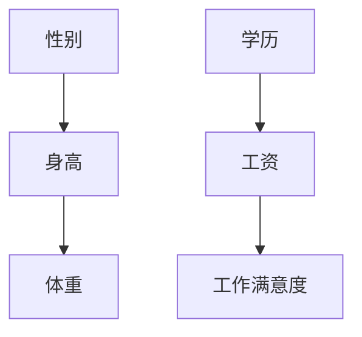

                 

### 背景介绍

贝叶斯网络（Bayesian Networks）是概率图模型的一种，用于表示变量之间的依赖关系。在人工智能、机器学习等领域，贝叶斯网络因其简洁性、表达能力和强大的推理能力而受到广泛关注。

贝叶斯网络起源于20世纪70年代，由John H. Holland在其著作《隐含的适应性》中提出。随后，贝叶斯网络在统计学习、推理和决策支持等领域得到快速发展。近年来，随着计算能力的提升和大数据技术的应用，贝叶斯网络在推荐系统、自然语言处理、生物信息学和金融风险控制等实际应用场景中表现出强大的潜力。

贝叶斯网络的基本原理源于贝叶斯定理，它通过条件概率来描述变量之间的依赖关系。与传统的条件概率模型相比，贝叶斯网络能够以图形化的方式直观地展示变量之间的关系，使得复杂问题的建模和推理变得更加简单和高效。

本文旨在介绍贝叶斯网络的基本概念、核心算法原理、数学模型和实际应用场景，并给出一个完整的代码实例讲解。通过本文的学习，读者将能够掌握贝叶斯网络的原理和应用，为后续在相关领域的研究和实践奠定基础。

### 1.1 贝叶斯网络的发展历程

贝叶斯网络的概念最早可以追溯到20世纪50年代，当时统计学家Jerzy Neyman和Egon Sharpe提出了一种基于条件概率的推理方法，被称为贝叶斯推理。然而，由于计算能力的限制，这一方法在实际应用中并未得到广泛推广。

直到20世纪70年代，计算机科学的迅速发展推动了概率图模型的研究。John H. Holland在其1975年的著作《隐含的适应性》中首次提出了贝叶斯网络的概念。随后，在1986年，Gregory F. Cooper和Edward H. Shortliffe发表了著名的论文《贝叶斯网络：一个知识表示的框架》，奠定了贝叶斯网络在人工智能领域的地位。

在接下来的几十年里，贝叶斯网络在统计学习、推理和决策支持等领域得到了广泛应用。1998年，Gregory F. Cooper和David E. Martin出版了《贝叶斯网络：理论与实践》一书，系统地总结了贝叶斯网络的理论和方法。这一时期，贝叶斯网络在计算机视觉、自然语言处理、生物信息学和金融风险管理等领域的应用研究不断涌现。

进入21世纪，随着大数据技术和深度学习的兴起，贝叶斯网络的研究和应用进一步拓展。许多研究机构和科技公司开始将贝叶斯网络应用于推荐系统、健康医疗、智能交通和环境监测等领域。例如，Google、微软和IBM等公司都在其产品中引入了贝叶斯网络技术。

总之，贝叶斯网络的发展历程反映了计算机科学和人工智能领域的不断进步。从最初的贝叶斯推理到现代的贝叶斯网络，这一理论和方法在多个领域取得了显著的成果，并在未来有望继续发挥重要作用。

### 1.2 贝叶斯网络的应用场景

贝叶斯网络因其强大的表达能力和推理能力，在多个领域得到了广泛应用。以下是一些典型的应用场景：

1. **推荐系统**：在电子商务和社交媒体领域，贝叶斯网络可用于推荐系统，根据用户的历史行为和兴趣，预测用户可能喜欢的产品或内容。例如，Amazon和Netflix都采用了基于贝叶斯网络的推荐算法，以提高用户的购物和观影体验。

2. **自然语言处理**：贝叶斯网络在自然语言处理（NLP）领域有着广泛的应用。例如，贝叶斯网络可以用于文本分类，将文本归类到预定义的类别中。此外，贝叶斯网络还可以用于实体识别、情感分析和机器翻译等任务。

3. **生物信息学**：贝叶斯网络在基因调控、蛋白质相互作用和药物设计等生物信息学领域发挥着重要作用。通过构建贝叶斯网络模型，研究人员可以揭示基因和蛋白质之间的复杂关系，从而为疾病诊断和治疗提供新思路。

4. **金融风险管理**：贝叶斯网络在金融风险管理中有着广泛的应用。例如，银行和保险公司可以使用贝叶斯网络来评估贷款违约风险、信用评分和投资组合优化等问题，从而降低金融风险。

5. **智能交通**：贝叶斯网络在智能交通系统中用于预测交通流量、交通事故和路线规划等任务。通过分析历史数据和实时数据，贝叶斯网络可以提供准确的交通预测和优化建议，以提高交通系统的效率和安全性。

6. **医疗诊断**：贝叶斯网络在医疗诊断中有着重要的应用。通过构建疾病和症状之间的贝叶斯网络模型，医生可以更准确地诊断疾病，并制定最佳的治疗方案。

7. **环境监测**：贝叶斯网络在环境监测领域用于预测和评估环境污染、气候变化和生态风险等问题。通过分析各种环境因素之间的依赖关系，贝叶斯网络可以提供可靠的预测和决策支持。

总之，贝叶斯网络在多个领域展现了其强大的应用潜力。随着技术的不断发展，贝叶斯网络的应用场景将进一步扩大，为各个行业带来更多的创新和变革。

### 1.3 贝叶斯网络与相关概念的比较

在探讨贝叶斯网络之前，有必要了解一些与之相关的概念，包括概率图模型、马尔可夫网络和决策树等。这些概念在数据建模和机器学习中扮演着重要角色，与贝叶斯网络既有联系又有区别。

**概率图模型**：概率图模型是一种用于表示变量之间依赖关系的图形化方法。它们通常由图和概率分布组成，其中图表示变量之间的依赖关系，概率分布表示每个变量的概率分布。贝叶斯网络是概率图模型的一种，它通过条件概率来描述变量之间的依赖关系。

**马尔可夫网络**：马尔可夫网络是一种特殊的概率图模型，它基于马尔可夫性质，即一个变量的状态只与其直接邻居有关，而与更远的邻居无关。马尔可夫网络在统计学习和推断中有着广泛应用，特别是在序列建模和动态系统建模中。

**决策树**：决策树是一种基于规则的方法，通过一系列条件判断来分类或回归数据。每个内部节点表示一个条件判断，每个叶节点表示一个类别或数值。与概率图模型不同，决策树通常不涉及概率分布。

**贝叶斯网络与概率图模型的联系**：贝叶斯网络是概率图模型的一种，它通过条件概率来描述变量之间的依赖关系。概率图模型包括贝叶斯网络、马尔可夫网络、因子图等，它们都是用于表示变量之间依赖关系的图形化方法。

**贝叶斯网络与马尔可夫网络的区别**：贝叶斯网络和马尔可夫网络都是概率图模型，但它们在描述变量依赖关系方面有所不同。贝叶斯网络考虑变量之间的直接和间接依赖关系，而马尔可夫网络只考虑变量之间的直接依赖关系。因此，贝叶斯网络在处理复杂依赖关系时更为灵活。

**贝叶斯网络与决策树的比较**：决策树是一种基于规则的方法，而贝叶斯网络是一种基于概率的方法。决策树通过一系列条件判断来分类或回归数据，而贝叶斯网络通过条件概率来描述变量之间的依赖关系。尽管两者都可以用于分类和回归任务，但贝叶斯网络在处理不确定性方面更具优势。

通过理解贝叶斯网络与相关概念的比较，我们可以更好地理解贝叶斯网络的原理和应用，为后续的学习和实践奠定基础。

### 1.4 贝叶斯网络的基本组成部分

贝叶斯网络由两个基本组件组成：变量节点和边。每个节点代表一个变量，边表示变量之间的依赖关系。

**变量节点**：贝叶斯网络中的每个节点表示一个变量。变量可以是离散的或连续的。在离散贝叶斯网络中，每个变量有有限的可能取值，例如性别（男/女）、疾病（有/无）等。在连续贝叶斯网络中，变量可以是实数值，例如温度、血压等。变量节点通常用圆形表示，节点上标注变量名称和可能取值。

**边**：贝叶斯网络中的边表示变量之间的依赖关系。边从父节点指向子节点，表示子节点依赖于父节点。边的权重表示变量之间的条件概率。边的存在和权重反映了变量之间的依赖强度。在离散贝叶斯网络中，边权重通常表示为条件概率分布（CPD），在连续贝叶斯网络中，边权重通常表示为条件概率密度函数（CPDF）。

**有向无环图（DAG）**：贝叶斯网络是一个有向无环图（DAG），这意味着每个节点有且只有一个父节点，且图中不存在循环。有向无环图的结构使得贝叶斯网络能够简洁地表示变量之间的依赖关系，同时避免了冗余和循环依赖。

通过变量节点和边的组合，贝叶斯网络能够以图形化的方式直观地展示变量之间的依赖关系，使得复杂问题的建模和推理变得更加简单和高效。

### 1.5 贝叶斯网络的基本原理

贝叶斯网络的核心原理基于贝叶斯定理，通过条件概率来描述变量之间的依赖关系。贝叶斯定理指出，如果一个事件B在另一个事件A发生的条件下发生的概率是P(B|A)，则事件A在事件B发生的条件下发生的概率是P(A|B)。

在贝叶斯网络中，每个变量都有一个条件概率分布（CPD），表示该变量在给定其所有父变量的情况下，取不同值的概率。条件概率分布可以用以下公式表示：

P(X_i | X_{parent_i}) = \frac{P(X_i, X_{parent_i})}{P(X_{parent_i})}

其中，P(X_i | X_{parent_i}) 表示在给定父变量 X_{parent_i} 的条件下，变量 X_i 的概率分布。P(X_i, X_{parent_i}) 表示变量 X_i 和其父变量 X_{parent_i} 同时发生的联合概率。P(X_{parent_i}) 表示父变量 X_{parent_i} 的概率分布。

**条件独立性**：贝叶斯网络中的条件独立性是指，如果变量 A 和 B 在给定变量 C 的条件下独立，则 P(A|B, C) = P(A|C) 和 P(B|A, C) = P(B|C)。这表示，变量 A 和 B 之间的依赖关系可以通过变量 C 完全解释。

贝叶斯网络的推理任务包括两个方面：

1. **确定性推理**：在确定性推理中，给定一个贝叶斯网络和一个查询变量，我们需要计算查询变量的概率分布。这可以通过贝叶斯定理和条件概率分布实现。

2. **不确定性推理**：在不确定性推理中，我们需要计算在给定某些变量的条件下，其他变量的概率分布。这可以通过贝叶斯推理规则和条件独立性实现。

贝叶斯网络通过条件概率分布和条件独立性，将复杂的依赖关系以图形化的方式直观地表示出来，使得复杂问题的建模和推理变得更加简单和高效。

### 1.6 贝叶斯网络的表示方法

贝叶斯网络的表示方法通常使用有向无环图（DAG）来表示变量之间的依赖关系。DAG中的每个节点表示一个变量，节点之间的边表示变量之间的条件依赖关系。以下是一个简单的贝叶斯网络示例：

在这个示例中，性别（A）影响身高（B），身高（B）影响体重（C）。学历（D）直接影响工资（E），而工资（E）影响工作满意度（F）。贝叶斯网络通过条件概率分布来描述每个变量在给定其父变量的条件下的概率分布。

条件概率分布（CPD）的表示通常采用表格或树形结构。例如，对于性别（A）影响身高（B）的依赖关系，可以定义以下CPD表格：

| 性别(A) | 身高(B) | 条件概率 |
|--------|--------|----------|
| 男     | 180    | 0.2      |
| 男     | 175    | 0.3      |
| 女     | 165    | 0.4      |
| 女     | 160    | 0.1      |

在这个表格中，男性和女性在身高为180厘米和175厘米的条件下的概率分别为0.2和0.3，女性在身高为165厘米和160厘米的条件下的概率分别为0.4和0.1。

通过这种方式，贝叶斯网络能够以图形化和表格化的方式直观地表示变量之间的依赖关系和条件概率分布，使得复杂问题的建模和推理变得更加简单和高效。

### 1.7 贝叶斯网络在现实世界中的应用实例

贝叶斯网络作为一种强大的概率图模型，在实际应用中展现出了广泛的潜力和价值。以下是一些典型的应用实例，展示了贝叶斯网络在不同领域的实际应用。

**1. 信用评分系统**

在金融领域，信用评分系统是评估个人或企业信用风险的重要工具。贝叶斯网络可以用于构建信用评分模型，通过分析借款人的历史数据，如收入、负债、信用历史等，预测其违约风险。例如，一家银行可以使用贝叶斯网络模型来评估申请贷款的客户，根据其各种风险因素的权重，计算客户违约的概率，从而决定是否批准贷款。

**2. 疾病诊断**

在医疗领域，贝叶斯网络可以用于疾病诊断，通过分析患者的症状和体征，推断患者可能患有的疾病。例如，医生可以使用贝叶斯网络来诊断流感，根据患者出现的症状（如发热、咳嗽、乏力等）以及流行季节等因素，计算患者患流感的概率，从而做出诊断。

**3. 自然语言处理**

在自然语言处理（NLP）领域，贝叶斯网络可以用于文本分类和命名实体识别。例如，贝叶斯网络可以用于垃圾邮件过滤，根据邮件的内容和发送者信息，计算邮件是垃圾邮件的概率，从而决定是否将其标记为垃圾邮件。

**4. 智能推荐系统**

在电子商务和社交媒体领域，贝叶斯网络可以用于推荐系统，根据用户的历史行为和兴趣，预测用户可能喜欢的产品或内容。例如，Amazon和Netflix都使用了基于贝叶斯网络的推荐算法，根据用户的购物记录和观看历史，为用户推荐相关商品和影视内容。

**5. 风险管理**

在金融风险管理领域，贝叶斯网络可以用于评估各种金融风险，如市场风险、信用风险和操作风险。例如，银行可以使用贝叶斯网络来分析市场波动对贷款违约风险的影响，从而制定更有效的风险管理策略。

**6. 智能交通系统**

在智能交通领域，贝叶斯网络可以用于交通流量预测和事故预警。通过分析历史交通数据、天气信息和道路状况等因素，贝叶斯网络可以预测未来的交通流量，帮助交通管理部门优化交通信号控制和路线规划，减少交通事故的发生。

通过这些实际应用实例，我们可以看到贝叶斯网络在各个领域都有着广泛的应用潜力。随着技术的不断进步，贝叶斯网络的应用场景将进一步扩大，为各个行业带来更多的创新和变革。

### 1.8 贝叶斯网络的优势和局限性

贝叶斯网络作为一种概率图模型，在数据建模和机器学习中具有独特的优势。以下是贝叶斯网络的主要优势：

**1. 直观性**：贝叶斯网络以图形化的方式表示变量之间的依赖关系，使得复杂问题的建模和解释变得更加直观和易于理解。

**2. 强大的表达能力**：贝叶斯网络可以灵活地表示变量之间的复杂依赖关系，通过条件概率分布（CPD）精确描述每个变量的概率分布。

**3. 高效的推理能力**：贝叶斯网络通过条件独立性原则，简化了推理过程，使得在大型网络中的推理任务变得高效可行。

**4. 处理不确定性**：贝叶斯网络能够处理不确定性问题，通过概率分布描述变量之间的依赖关系，提供了一种量化不确定性的方法。

尽管贝叶斯网络具有许多优势，但它在某些情况下也存在局限性：

**1. 数据需求**：贝叶斯网络需要大量的数据来训练模型，特别是在处理复杂依赖关系时。数据不足可能导致模型过拟合，降低预测准确性。

**2. 计算复杂度**：对于大型网络，贝叶斯网络的推理和训练过程可能具有较高的计算复杂度，特别是在不确定性推理和实时应用中。

**3. 隐变量问题**：贝叶斯网络无法直接处理隐变量问题，需要额外的建模技巧和方法来处理隐变量。

**4. 网络结构选择**：选择合适的网络结构是贝叶斯网络建模的关键，但这个过程可能具有主观性，依赖于领域知识和经验。

总之，贝叶斯网络在处理复杂依赖关系和不确定性问题时具有独特的优势，但同时也面临一些局限性和挑战。了解这些优势和局限性，有助于更好地应用贝叶斯网络，发挥其潜力。

### 1.9 贝叶斯网络的应用挑战与发展趋势

尽管贝叶斯网络在许多领域展现出了强大的应用潜力，但其在实际应用中仍面临一系列挑战。以下是贝叶斯网络的主要应用挑战及其潜在解决方案和发展趋势。

**1. 数据依赖性**

贝叶斯网络对数据的需求较高，尤其是在处理复杂依赖关系时。数据不足可能导致模型过拟合，降低预测准确性。为解决这一问题，可以采用以下方法：

- **增量学习**：通过在线学习，实时更新模型参数，以适应数据的变化。
- **数据增强**：通过数据生成技术，如生成对抗网络（GAN），扩展训练数据集。
- **转移学习**：利用预训练的贝叶斯网络模型，在新数据集上进行微调，提高模型对新数据的适应性。

**2. 计算复杂度**

对于大型贝叶斯网络，推理和训练过程可能具有较高的计算复杂度。为降低计算复杂度，可以采用以下方法：

- **分布式计算**：利用并行计算和分布式计算技术，将计算任务分布在多台计算机上，提高计算效率。
- **近似推理**：采用近似推理方法，如变分推断和马尔可夫链蒙特卡罗（MCMC）方法，降低计算复杂度。
- **结构优化**：通过结构优化算法，如结构搜索和结构简化，减少网络规模，降低计算复杂度。

**3. 隐变量问题**

贝叶斯网络无法直接处理隐变量问题，需要额外的建模技巧和方法。为解决这一问题，可以采用以下方法：

- **隐变量建模**：通过引入隐变量，构建隐变量模型，如变分贝叶斯网络和隐马尔可夫模型。
- **推断算法**：采用推断算法，如最大后验估计（MAP）和期望最大化（EM）算法，估计隐变量的值。

**4. 网络结构选择**

选择合适的网络结构是贝叶斯网络建模的关键，但这个过程可能具有主观性。为解决这一问题，可以采用以下方法：

- **结构学习算法**：开发结构学习算法，如贝叶斯网络学习算法和信息准则，自动搜索最优网络结构。
- **领域知识整合**：结合领域知识，指导网络结构的构建，提高模型的可解释性和预测能力。

**发展趋势**

贝叶斯网络的发展趋势主要围绕以下几个方面：

- **模型融合**：将贝叶斯网络与其他机器学习模型（如深度学习、强化学习）融合，构建更强大的混合模型。
- **动态贝叶斯网络**：研究动态贝叶斯网络，用于处理时间序列数据，提高模型对动态环境适应能力。
- **应用拓展**：将贝叶斯网络应用于更多领域，如金融、生物信息学和自动驾驶，推动其应用范围的扩展。

通过解决上述挑战，贝叶斯网络将在未来继续发挥重要作用，为人工智能和机器学习领域带来更多创新和突破。

### 1.10 贝叶斯网络的研究前沿

贝叶斯网络作为一种强大的概率图模型，在人工智能和机器学习领域正不断取得新的进展。以下是一些当前的研究前沿，展示了贝叶斯网络的最新研究成果和趋势。

**1. 贝叶斯深度学习**

贝叶斯深度学习是近年来研究的热点，旨在结合贝叶斯方法和深度学习的优势，提高模型的可解释性和鲁棒性。研究人员提出了一系列贝叶斯深度学习模型，如贝叶斯神经网络、贝叶斯深度生成模型和贝叶斯图神经网络。这些模型通过引入贝叶斯推理机制，能够更好地处理不确定性问题，并在分类、回归和生成任务中表现出色。

**2. 动态贝叶斯网络**

动态贝叶斯网络（Dynamic Bayesian Networks, DBNs）是一种用于处理时间序列数据的贝叶斯网络扩展。DBNs能够捕获时间序列中的动态变化，广泛应用于语音识别、视频分析和智能交通等领域。近年来，研究人员提出了一系列新的DBN模型，如高斯过程DBN、混合隐马尔可夫模型和变分自编码器DBN，以应对更复杂的动态环境。

**3. 贝叶斯优化**

贝叶斯优化是一种基于贝叶斯推理的优化方法，用于自动搜索最优参数设置。贝叶斯优化在机器学习模型的调参过程中表现出色，广泛应用于深度学习、强化学习和贝叶斯网络的模型训练。研究人员提出了一系列新的贝叶斯优化算法，如梯度提升贝叶斯优化、变分贝叶斯优化和自适应贝叶斯优化，以提高优化效率和精度。

**4. 隐变量贝叶斯网络**

隐变量贝叶斯网络是一种用于处理隐变量问题的贝叶斯网络扩展。研究人员提出了一系列新的隐变量模型，如变分贝叶斯网络、贝叶斯图模型和变分自编码器，以解决贝叶斯网络在处理隐变量时的局限性。这些模型在图像生成、语音处理和自然语言处理等领域取得了显著成果。

**5. 贝叶斯网络的应用拓展**

贝叶斯网络的应用正在不断拓展，从传统的统计学习、推理和决策支持领域，逐渐扩展到深度学习、自动驾驶、生物信息学和金融风险管理等新兴领域。研究人员正在探索贝叶斯网络在这些领域的应用，以解决复杂的问题和挑战。

总之，贝叶斯网络作为一种重要的概率图模型，在人工智能和机器学习领域正不断取得新的进展。随着研究的深入，贝叶斯网络将在更多领域发挥重要作用，推动人工智能技术的创新和发展。

