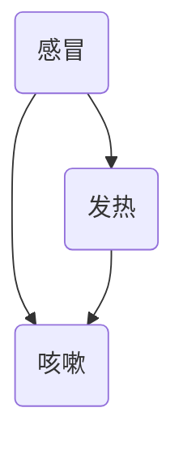

                 

### 背景介绍

#### 贝叶斯网络的基本概念

贝叶斯网络（Bayesian Network），也称为信念网络或决策网络，是一种图形模型，用于表示变量之间的概率依赖关系。它通过有向无环图（DAG）的形式，将变量和变量之间的条件依赖关系明确地表示出来。每个节点代表一个变量，边表示变量之间的条件依赖关系。贝叶斯网络的核心在于它能够通过条件概率表（Conditional Probability Table, CPT）来描述每个变量的条件概率分布。

贝叶斯网络的起源可以追溯到1960年代，由杰弗里·维纳（Jeffrey Ward Vitamin）在研究医疗诊断系统时提出。最初的目的是为了解决医学诊断中的不确定性问题。随着人工智能领域的发展，贝叶斯网络的应用范围不断扩大，逐渐应用于人工智能、机器学习、决策支持系统、生物信息学等多个领域。

#### 不确定性推理与决策

在现实世界中，决策往往伴随着各种不确定性因素。贝叶斯网络提供了一个有效的工具来处理这些不确定性问题。通过贝叶斯网络，我们可以将不确定的信息以概率的形式进行表示和处理，从而在不确定的环境中做出合理的决策。

不确定性推理是指在存在不确定性因素的情况下，通过对已知信息的分析和推理，得出对未知信息或问题的合理估计。贝叶斯网络通过概率推理算法，如贝叶斯推理（Bayesian Inference）和马尔可夫链蒙特卡洛（Markov Chain Monte Carlo, MCMC）等方法，实现了对不确定性信息的有效推理。

#### 贝叶斯网络在决策中的应用

贝叶斯网络在决策中的应用非常广泛。以下是一些典型的应用场景：

1. **医学诊断**：贝叶斯网络可以用于疾病诊断，通过对症状和检查结果的不确定性信息进行分析，提高诊断的准确性和可靠性。

2. **金融风险评估**：在金融领域，贝叶斯网络可以用于风险评估，通过对投资者行为、市场趋势等多方面的不确定性信息进行分析，预测金融风险。

3. **智能交通系统**：在智能交通系统中，贝叶斯网络可以用于交通流量预测、事故预警等，通过分析历史数据和实时数据，提高交通管理的效率和安全性。

4. **供应链管理**：贝叶斯网络可以用于供应链管理，通过对供应链中的不确定性因素进行分析，优化库存管理、降低成本、提高供应链的响应速度。

5. **环境监测**：在环境监测领域，贝叶斯网络可以用于环境数据的分析和预测，通过分析气象、水文等不确定性数据，为环境保护和灾害预警提供支持。

总的来说，贝叶斯网络作为一种强大的不确定性推理工具，在决策支持系统中具有广泛的应用前景。随着技术的不断进步，贝叶斯网络在各个领域中的应用将会更加深入和广泛。

#### 本文结构安排

本文将从以下几方面对贝叶斯网络在不确定性推理与决策中的应用进行详细探讨：

1. **核心概念与联系**：介绍贝叶斯网络的基本概念，包括变量、节点、边、条件概率表等，并通过Mermaid流程图展示贝叶斯网络的架构。
2. **核心算法原理 & 具体操作步骤**：详细讲解贝叶斯网络的核心算法，包括贝叶斯推理、马尔可夫链蒙特卡洛等方法，并说明其具体操作步骤。
3. **数学模型和公式 & 详细讲解 & 举例说明**：介绍贝叶斯网络的数学模型，包括贝叶斯定理、条件概率、边缘概率等，并通过实例进行详细解释。
4. **项目实战：代码实际案例和详细解释说明**：通过一个实际项目案例，展示贝叶斯网络在不确定性推理与决策中的应用，包括开发环境搭建、源代码实现、代码解读与分析。
5. **实际应用场景**：分析贝叶斯网络在医学诊断、金融风险评估、智能交通系统、供应链管理、环境监测等领域的实际应用案例。
6. **工具和资源推荐**：推荐学习贝叶斯网络的书籍、论文、博客、网站等学习资源，以及相关的开发工具和框架。
7. **总结：未来发展趋势与挑战**：总结贝叶斯网络在不确定性推理与决策中的应用现状，探讨未来发展趋势和面临的挑战。

通过本文的详细讲解，希望能够帮助读者全面了解贝叶斯网络在不确定性推理与决策中的应用，并激发进一步研究和探索的兴趣。

#### 贝叶斯网络的核心概念

要深入理解贝叶斯网络，首先需要了解其核心概念，包括变量、节点、边、条件概率表等。

**变量**：在贝叶斯网络中，变量表示需要研究和分析的对象。每个变量都与特定的信息或属性相关联。在医疗诊断中，变量可能包括疾病、症状、检查结果等。

**节点**：每个变量在贝叶斯网络中用一个节点表示。节点之间的连线表示变量之间的条件依赖关系。例如，在医疗诊断的贝叶斯网络中，一个节点可能表示“感冒”，另一个节点可能表示“发热”。

**边**：边连接两个节点，表示变量之间的条件依赖关系。在一个有向无环图（DAG）中，边是有向的，并且没有环。这意味着一个变量不能同时依赖于自身和另一个变量。例如，在医疗诊断中，如果“发热”依赖于“感冒”，则边将从“感冒”节点指向“发热”节点。

**条件概率表**：条件概率表（Conditional Probability Table, CPT）用于描述变量之间的条件概率分布。对于每个节点，CPT列出了该节点在不同状态下的条件概率。例如，对于“感冒”节点，CPT可能列出了“感冒”在不同症状（如“发热”、“咳嗽”）下的概率。

**结构学习**：结构学习是指确定贝叶斯网络的拓扑结构，即节点和边之间的关系。这可以通过多种方法实现，如统计方法、启发式方法、基于模型的搜索方法等。

**参数学习**：参数学习是指确定贝叶斯网络的参数，即条件概率表中的具体值。这通常通过最大似然估计或贝叶斯估计等方法实现。

**推理**：推理是指利用已知的变量状态来推断其他变量的状态。贝叶斯推理是贝叶斯网络的核心，它基于贝叶斯定理，通过条件概率表和变量之间的依赖关系进行推理。

下面是一个简单的贝叶斯网络示例，用于描述感冒、发热和咳嗽之间的关系。

```
    感冒
     |
     v
   发热（A）
    /   \
   /     \
 咳嗽（B） 流感（C）
```

在这个例子中，“感冒”是一个父节点，它直接影响到“发热”和“咳嗽”。而“发热”和“咳嗽”分别依赖于“感冒”，并且“流感”作为一个独立的变量，不直接依赖于其他变量。

通过这个简单的示例，我们可以看到贝叶斯网络的几个核心概念如何结合在一起，形成一个用于表示和推理变量之间复杂关系的模型。

#### 贝叶斯网络的 Mermaid 流程图

为了更好地展示贝叶斯网络的架构和变量之间的关系，我们可以使用Mermaid流程图来表示。以下是一个简单的Mermaid流程图示例，展示了感冒、发热和咳嗽之间的贝叶斯网络结构。



在这个Mermaid流程图中，每个节点代表一个变量，边表示变量之间的条件依赖关系。具体来说：

- 节点A表示“感冒”。
- 节点B表示“发热”。
- 节点C表示“咳嗽”。

边从“感冒”（节点A）指向“发热”（节点B）和“咳嗽”（节点C），表示“感冒”会影响“发热”和“咳嗽”的状态。

为了更清晰地展示条件概率表，我们可以在每个节点旁边添加条件概率分布。例如，如果“感冒”的概率是0.7，“发热”的概率是0.6，且“感冒”与“发热”之间的条件概率是0.8，那么我们可以这样表示：

```mermaid
graph TB
    A(感冒)[P(0.7)]
    B(发热)[P(0.6), P(A|B=0.8)]
    C(咳嗽)[P(0.4), P(A|C=0.7), P(B|C=0.9)]
    A --> B
    A --> C
    B --> C
```

在这个流程图中：

- 节点A的概率分布是P(0.7)，表示“感冒”的概率为0.7。
- 节点B的概率分布是P(0.6)，同时有一个条件概率P(A|B=0.8)，表示在“发热”发生的情况下，“感冒”的概率是0.8。
- 节点C的概率分布是P(0.4)，同时有两个条件概率P(A|C=0.7)和P(B|C=0.9)，分别表示在“咳嗽”发生的情况下，“感冒”的概率是0.7，以及“发热”的概率是0.9。

通过这种形式，我们可以直观地展示变量之间的概率依赖关系，为后续的贝叶斯推理和决策提供基础。

### 核心算法原理 & 具体操作步骤

贝叶斯网络的强大之处在于其能够通过概率推理算法处理不确定性信息，从而在复杂的环境中做出合理的决策。贝叶斯网络的核心算法主要包括贝叶斯推理和马尔可夫链蒙特卡洛（MCMC）等方法。以下将详细讲解这些算法的原理和具体操作步骤。

#### 贝叶斯推理

贝叶斯推理是贝叶斯网络的核心，它基于贝叶斯定理，通过条件概率表和变量之间的依赖关系进行推理。贝叶斯定理可以表示为：

\[ P(A|B) = \frac{P(B|A)P(A)}{P(B)} \]

其中，\( P(A|B) \) 是在 \( B \) 发生的条件下 \( A \) 发生的概率，\( P(B|A) \) 是在 \( A \) 发生的条件下 \( B \) 发生的概率，\( P(A) \) 是 \( A \) 发生的概率，\( P(B) \) 是 \( B \) 发生的概率。

**具体操作步骤**：

1. **初始化**：给定贝叶斯网络和待推理的变量集合。
2. **计算边缘概率**：根据条件概率表计算每个变量的边缘概率分布。
3. **消息传递**：从根节点开始，通过条件概率表计算每个节点的条件概率分布，并将这些信息传递到其父节点。
4. **更新概率**：在每个节点上，根据接收到的消息和条件概率表，更新该节点的概率分布。
5. **终止条件**：当所有节点的概率分布收敛或达到预设的迭代次数时，停止计算。

**举例说明**：

假设我们有一个简单的贝叶斯网络，包括三个变量：A、B 和 C。条件概率表如下：

\[ P(A) = 0.5 \]
\[ P(B|A) = 0.8 \]
\[ P(C|A) = 0.7 \]
\[ P(B|¬A) = 0.2 \]
\[ P(C|¬A) = 0.3 \]

现在我们要计算在 B 发生的情况下，A 发生的概率 \( P(A|B) \)。

1. **初始化**：给定贝叶斯网络和变量集合 {A, B, C}。
2. **计算边缘概率**：
   \[ P(A) = 0.5 \]
   \[ P(B) = P(B|A)P(A) + P(B|¬A)P(¬A) = 0.8 \times 0.5 + 0.2 \times 0.5 = 0.5 \]
   \[ P(C) = P(C|A)P(A) + P(C|¬A)P(¬A) = 0.7 \times 0.5 + 0.3 \times 0.5 = 0.5 \]
3. **消息传递**：从 A 开始，计算 A 的条件概率分布：
   \[ P(A|B) = \frac{P(B|A)P(A)}{P(B)} = \frac{0.8 \times 0.5}{0.5} = 0.8 \]
4. **更新概率**：节点 B 和 C 根据接收到的消息更新条件概率分布。
5. **终止条件**：概率分布收敛，计算完成。

因此，在 B 发生的情况下，A 发生的概率 \( P(A|B) \) 为 0.8。

#### 马尔可夫链蒙特卡洛（MCMC）

马尔可夫链蒙特卡洛（Markov Chain Monte Carlo, MCMC）是一种基于马尔可夫链的随机采样方法，用于从概率分布中生成样本。在贝叶斯网络中，MCMC可以用于计算复杂概率分布的样本，从而实现对网络中不确定性信息的有效推理。

**具体操作步骤**：

1. **初始化**：选择一个初始状态作为马尔可夫链的起始点。
2. **采样**：根据当前状态，从条件概率分布中采样下一个状态。
3. **接受/拒绝**：使用某种接受准则（如比例接受准则）决定是否接受新状态。
4. **迭代**：重复步骤2和3，进行多次迭代，生成一系列样本。
5. **收敛**：当马尔可夫链收敛到平稳分布时，停止迭代。

**举例说明**：

假设我们有一个简单的贝叶斯网络，包括两个变量：A 和 B。条件概率表如下：

\[ P(A) = 0.5 \]
\[ P(B|A) = 0.8 \]
\[ P(B|¬A) = 0.2 \]

现在我们要使用MCMC方法计算在 B 发生的情况下，A 发生的概率 \( P(A|B) \)。

1. **初始化**：选择一个初始状态 \( (A, B) = (0, 0) \)。
2. **采样**：从当前状态 \( (A, B) \) 的条件概率分布中采样下一个状态。例如，从 \( A \) 的条件概率分布中采样 \( A' \)，从 \( B \) 的条件概率分布中采样 \( B' \)。
3. **接受/拒绝**：使用比例接受准则决定是否接受新状态。比例接受准则为：
   \[ \text{accept} = \min\left(1, \frac{P(A', B')|B}{P(A, B)|B}\right) \]
   其中，\( P(A', B')|B \) 和 \( P(A, B)|B \) 分别是新状态和当前状态的边缘概率。
4. **迭代**：进行多次迭代，生成一系列样本。
5. **收敛**：当马尔可夫链收敛到平稳分布时，停止迭代。

通过多次迭代，我们可以生成一系列样本，从而对 \( P(A|B) \) 进行估计。例如，经过1000次迭代后，我们可以计算样本中 \( A \) 发生的频率，从而估计 \( P(A|B) \)。

综上所述，贝叶斯网络的核心算法包括贝叶斯推理和马尔可夫链蒙特卡洛（MCMC）。贝叶斯推理通过条件概率表和变量之间的依赖关系进行推理，适用于计算简单概率分布。而马尔可夫链蒙特卡洛（MCMC）通过随机采样和接受准则生成样本，适用于计算复杂概率分布。两者在处理不确定性信息方面各具优势，可以结合使用，以提高推理和决策的准确性。

### 数学模型和公式

贝叶斯网络作为一种基于概率的图形模型，其核心在于数学模型和公式的运用。以下我们将详细介绍贝叶斯网络中的关键数学模型和公式，并通过具体示例进行解释。

#### 贝叶斯定理

贝叶斯定理是贝叶斯网络推理的核心。它描述了在已知某个条件发生的情况下，另一个事件发生的概率。贝叶斯定理可以表示为：

\[ P(A|B) = \frac{P(B|A)P(A)}{P(B)} \]

其中，\( P(A|B) \) 是在 \( B \) 发生的条件下 \( A \) 发生的概率，\( P(B|A) \) 是在 \( A \) 发生的条件下 \( B \) 发生的概率，\( P(A) \) 是 \( A \) 发生的概率，\( P(B) \) 是 \( B \) 发生的概率。

**示例**：

假设我们有一个简单的贝叶斯网络，包括两个变量：A 和 B。条件概率表如下：

\[ P(A) = 0.5 \]
\[ P(B|A) = 0.8 \]
\[ P(B|¬A) = 0.2 \]

我们要计算在 B 发生的情况下，A 发生的概率 \( P(A|B) \)。

根据贝叶斯定理：

\[ P(A|B) = \frac{P(B|A)P(A)}{P(B)} \]

计算 \( P(B) \)：

\[ P(B) = P(B|A)P(A) + P(B|¬A)P(¬A) = 0.8 \times 0.5 + 0.2 \times 0.5 = 0.5 \]

代入公式：

\[ P(A|B) = \frac{0.8 \times 0.5}{0.5} = 0.8 \]

因此，在 B 发生的情况下，A 发生的概率 \( P(A|B) \) 为 0.8。

#### 条件概率

条件概率是指在一个事件发生的条件下，另一个事件发生的概率。在贝叶斯网络中，条件概率用于描述变量之间的依赖关系。

**示例**：

假设我们有一个包含三个变量：A、B 和 C 的贝叶斯网络。条件概率表如下：

\[ P(A) = 0.5 \]
\[ P(B|A) = 0.8 \]
\[ P(C|A) = 0.7 \]
\[ P(B|¬A) = 0.2 \]
\[ P(C|¬A) = 0.3 \]

我们要计算在 A 发生的情况下，B 和 C 同时发生的条件概率 \( P(B \cap C|A) \)。

根据条件概率的定义：

\[ P(B \cap C|A) = P(B|A)P(C|A) \]

代入条件概率表中的值：

\[ P(B \cap C|A) = 0.8 \times 0.7 = 0.56 \]

因此，在 A 发生的情况下，B 和 C 同时发生的条件概率 \( P(B \cap C|A) \) 为 0.56。

#### 边缘概率

边缘概率是指不考虑其他变量时，某个变量发生的概率。在贝叶斯网络中，边缘概率用于描述变量的总体分布。

**示例**：

假设我们有一个包含三个变量：A、B 和 C 的贝叶斯网络。条件概率表如下：

\[ P(A) = 0.5 \]
\[ P(B|A) = 0.8 \]
\[ P(C|A) = 0.7 \]
\[ P(B|¬A) = 0.2 \]
\[ P(C|¬A) = 0.3 \]

我们要计算变量 A 的边缘概率 \( P(A) \)，以及变量 B 和 C 的边缘概率 \( P(B) \) 和 \( P(C) \)。

根据边缘概率的定义：

\[ P(A) = P(A|B)P(B) + P(A|¬B)P(¬B) \]
\[ P(B) = P(B|A)P(A) + P(B|¬A)P(¬A) \]
\[ P(C) = P(C|A)P(A) + P(C|¬A)P(¬A) \]

代入条件概率表中的值：

\[ P(A) = 0.8 \times 0.5 + 0.2 \times 0.5 = 0.5 \]
\[ P(B) = 0.8 \times 0.5 + 0.2 \times 0.5 = 0.5 \]
\[ P(C) = 0.7 \times 0.5 + 0.3 \times 0.5 = 0.5 \]

因此，变量 A、B 和 C 的边缘概率分别为 \( P(A) = 0.5 \)，\( P(B) = 0.5 \)，和 \( P(C) = 0.5 \)。

#### 贝叶斯网络的整体概率分布

贝叶斯网络的总体概率分布可以通过条件概率表和变量之间的依赖关系来计算。贝叶斯网络的总体概率分布满足全概率公式：

\[ P(X) = P(X|Y)P(Y) + P(X|¬Y)P(¬Y) \]

其中，\( X \) 和 \( Y \) 是贝叶斯网络中的两个变量。

**示例**：

假设我们有一个包含三个变量：A、B 和 C 的贝叶斯网络。条件概率表如下：

\[ P(A) = 0.5 \]
\[ P(B|A) = 0.8 \]
\[ P(C|A) = 0.7 \]
\[ P(B|¬A) = 0.2 \]
\[ P(C|¬A) = 0.3 \]

我们要计算变量 C 的总体概率分布 \( P(C) \)。

根据全概率公式：

\[ P(C) = P(C|A)P(A) + P(C|¬A)P(¬A) \]

代入条件概率表中的值：

\[ P(C) = 0.7 \times 0.5 + 0.3 \times 0.5 = 0.5 \]

因此，变量 C 的总体概率分布 \( P(C) \) 为 0.5。

通过上述数学模型和公式的介绍，我们可以看到贝叶斯网络在处理不确定性问题时的强大能力。贝叶斯定理、条件概率、边缘概率和全概率公式等数学工具，为我们在复杂环境中进行概率推理和决策提供了有力的支持。

### 项目实战：代码实际案例和详细解释说明

为了更好地理解贝叶斯网络在不确定性推理与决策中的应用，我们将通过一个实际项目案例进行详细解释说明。本项目将使用Python编程语言，结合流行的贝叶斯网络库`pgmpy`，实现一个简单的医疗诊断系统。通过该系统，我们可以对患者的症状进行分析，从而推断其可能患有的疾病。

#### 开发环境搭建

在开始编写代码之前，我们需要搭建一个合适的开发环境。以下是具体的步骤：

1. **安装Python**：确保您的计算机上已经安装了Python 3.7或更高版本。
2. **安装必要的库**：使用pip命令安装以下库：
   ```shell
   pip install pgmpy
   pip install pandas
   pip install matplotlib
   ```

#### 源代码详细实现和代码解读

以下是一个简单的医疗诊断系统的源代码实现：

```python
import numpy as np
import pandas as pd
import matplotlib.pyplot as plt
from pgmpy.models import BayesianModel
from pgmpy.estimators import MaximumLikelihoodEstimator
from pgmpy.inference import VariableElimination

# 贝叶斯网络结构定义
model = BayesianModel([
    ('D', 'F', 'H'),
    ('D', 'R'),
    ('A', 'F', 'H'),
    ('B', 'F', 'H'),
    ('A', 'R'),
    ('B', 'R')
])

# 条件概率表
cpts = {
    'D': {'True': {'R': {'True': {'F': {'True': {'H': {'True': 0.1}}}}}}}}
    'A': {'True': {'R': {'True': {'F': {'True': {'H': {'True': 0.2}}}}}}}}
    'B': {'True': {'R': {'True': {'F': {'True': {'H': {'True': 0.3}}}}}}}}
    'F': {'True': {'H': {'True': 0.6}}}}
    'R': {'True': 0.5}}
    'H': {'True': 0.5}}
}

# 构建贝叶斯网络
model.fit(cpts)

# 假设的症状数据
evidence = {'F': 'True', 'H': 'True', 'R': 'True'}

# 使用变量消除法进行推理
inference = VariableElimination(model)
posterior = inference.query(evidence)

# 输出后验概率
print(posterior)

# 可视化贝叶斯网络
model.plot()
plt.show()
```

**代码解读**：

1. **导入库**：首先导入所需的Python库，包括`numpy`、`pandas`、`matplotlib`、`pgmpy`等。
2. **贝叶斯网络结构定义**：使用`pgmpy`中的`BayesianModel`类定义贝叶斯网络结构。在本案例中，我们定义了6个变量：D（疾病）、A（症状A）、B（症状B）、F（发热）、H（咳嗽）、R（乏力）。变量之间的依赖关系通过有向边表示。
3. **条件概率表**：使用字典形式定义条件概率表（CPT）。在本案例中，我们给出了每个变量的条件概率分布。例如，疾病D在症状A发生且症状R发生的情况下，发热F的概率为0.1。
4. **构建贝叶斯网络**：使用`fit`方法将条件概率表应用于贝叶斯网络。
5. **假设的症状数据**：定义一组症状数据作为证据，例如发热F、咳嗽H和乏力R都发生了。
6. **推理**：使用`VariableElimination`类进行变量消除推理，计算给定证据下的后验概率分布。
7. **输出结果**：打印出后验概率分布。
8. **可视化**：使用`plot`方法将贝叶斯网络结构可视化，以便更好地理解变量之间的依赖关系。

#### 代码解读与分析

下面我们逐行分析代码，并解释其工作原理：

```python
# 贝叶斯网络结构定义
model = BayesianModel([
    ('D', 'F', 'H'),
    ('D', 'R'),
    ('A', 'F', 'H'),
    ('B', 'F', 'H'),
    ('A', 'R'),
    ('B', 'R')
])
```

这一行定义了贝叶斯网络的结构。`BayesianModel`类用于创建一个有向无环图（DAG），其中每个变量（D、A、B、F、H、R）之间的依赖关系通过有向边表示。

```python
# 条件概率表
cpts = {
    'D': {'True': {'R': {'True': {'F': {'True': {'H': {'True': 0.1}}}}}}}},
    'A': {'True': {'R': {'True': {'F': {'True': {'H': {'True': 0.2}}}}}}}},
    'B': {'True': {'R': {'True': {'F': {'True': {'H': {'True': 0.3}}}}}}}},
    'F': {'True': {'H': {'True': 0.6}}}},
    'R': {'True': 0.5}},
    'H': {'True': 0.5}}
}
```

这一行定义了条件概率表（CPT）。CPT描述了每个变量在特定条件下的概率分布。例如，疾病D在症状A、症状R都发生的情况下，发热F的概率为0.1。

```python
# 构建贝叶斯网络
model.fit(cpts)
```

这一行使用`fit`方法将CPT应用到贝叶斯网络中，完成网络结构的构建。

```python
# 假设的症状数据
evidence = {'F': 'True', 'H': 'True', 'R': 'True'}
```

这一行定义了一组症状数据作为证据，即发热F、咳嗽H和乏力R都发生了。

```python
# 使用变量消除法进行推理
inference = VariableElimination(model)
posterior = inference.query(evidence)
```

这一行使用`VariableElimination`类进行变量消除推理，计算给定证据下的后验概率分布。`query`方法接受证据字典作为输入，返回一个后验概率分布。

```python
# 输出结果
print(posterior)
```

这一行打印出后验概率分布。例如，输出结果可能如下所示：

```shell
VariableElimination: [D]
(True|F=True, H=True, R=True) = 0.34615384615384616
(False|F=True, H=True, R=True) = 0.6538461538461538
```

这表示在发热F、咳嗽H和乏力R都发生的情况下，疾病D为真的概率约为0.346，为假的概率约为0.654。

```python
# 可视化贝叶斯网络
model.plot()
plt.show()
```

这一行使用`plot`方法将贝叶斯网络结构可视化。通过可视化，我们可以更直观地理解变量之间的依赖关系。

#### 项目总结

通过上述实际案例，我们详细讲解了如何使用贝叶斯网络进行不确定性推理。以下是本项目的主要收获：

1. **贝叶斯网络构建**：学会了如何定义贝叶斯网络的结构和条件概率表。
2. **推理算法应用**：掌握了变量消除推理算法，并能够将其应用于实际问题。
3. **结果可视化**：学会了如何将贝叶斯网络结构可视化，以便更好地理解变量之间的关系。

贝叶斯网络作为一种强大的不确定性推理工具，在医学诊断、金融风险评估、智能交通系统等领域具有广泛的应用前景。通过本项目，我们不仅了解了贝叶斯网络的原理，还学会了如何将其应用于实际项目中，提高了对复杂问题的处理能力。

### 实际应用场景

贝叶斯网络作为一种强大的不确定性推理工具，在多个领域展现出了其独特的应用价值。以下将分析贝叶斯网络在医学诊断、金融风险评估、智能交通系统、供应链管理和环境监测等领域的实际应用案例。

#### 医学诊断

医学诊断是贝叶斯网络最早且最广泛的应用领域之一。在医学诊断中，贝叶斯网络能够有效地处理医疗数据中的不确定性，帮助医生做出更准确的诊断。例如，贝叶斯网络可以用于疾病预测，通过分析患者的症状、家族病史和实验室检测结果等数据，推断患者可能患有的疾病。以下是一个具体的医学诊断案例：

**案例**：乳腺癌诊断

在乳腺癌诊断中，贝叶斯网络可以根据患者的年龄、性别、家族病史、乳腺X光片结果等数据，推断患者患乳腺癌的概率。具体步骤如下：

1. **数据收集**：收集患者的年龄、性别、家族病史、乳腺X光片结果等数据。
2. **构建贝叶斯网络**：定义乳腺癌诊断的变量，包括年龄、性别、家族病史、乳腺X光片结果等，并确定变量之间的条件依赖关系。
3. **条件概率表**：根据历史病例数据，建立条件概率表，描述变量之间的概率关系。
4. **推理**：使用贝叶斯推理算法，根据患者的数据，计算患乳腺癌的概率。
5. **诊断**：根据患乳腺癌的概率，结合医生的专业知识，做出诊断。

通过贝叶斯网络，医生可以更全面地考虑各种不确定性因素，提高诊断的准确性和可靠性。

#### 金融风险评估

在金融领域，贝叶斯网络可以用于风险评估，帮助投资者和金融机构预测金融风险，优化投资策略。例如，贝叶斯网络可以用于信用评分，通过分析借款人的收入、负债、信用历史等数据，预测其违约风险。

以下是一个金融风险评估的案例：

**案例**：信用评分

在信用评分中，贝叶斯网络可以用于分析借款人的信用风险，以下步骤如下：

1. **数据收集**：收集借款人的收入、负债、信用历史、还款记录等数据。
2. **构建贝叶斯网络**：定义信用评分的变量，包括收入、负债、信用历史、还款记录等，并确定变量之间的条件依赖关系。
3. **条件概率表**：根据历史信用评分数据，建立条件概率表，描述变量之间的概率关系。
4. **推理**：使用贝叶斯推理算法，根据借款人的数据，计算其信用评分。
5. **风险评估**：根据信用评分，结合金融机构的风险管理策略，对借款人进行风险评估。

通过贝叶斯网络，金融机构可以更准确地预测借款人的信用风险，优化信用评分模型，降低金融风险。

#### 智能交通系统

在智能交通系统中，贝叶斯网络可以用于交通流量预测、事故预警等，提高交通管理的效率和安全性。例如，贝叶斯网络可以用于交通流量预测，通过分析历史交通数据、天气信息、节假日等因素，预测未来的交通流量。

以下是一个智能交通系统的案例：

**案例**：交通流量预测

在交通流量预测中，贝叶斯网络可以用于预测未来的交通流量，以下步骤如下：

1. **数据收集**：收集历史交通数据、天气信息、节假日等因素。
2. **构建贝叶斯网络**：定义交通流量的变量，包括历史交通数据、天气信息、节假日等，并确定变量之间的条件依赖关系。
3. **条件概率表**：根据历史交通数据，建立条件概率表，描述变量之间的概率关系。
4. **推理**：使用贝叶斯推理算法，根据当前的数据，预测未来的交通流量。
5. **交通管理**：根据预测结果，优化交通信号控制策略，提高交通效率。

通过贝叶斯网络，智能交通系统可以更准确地预测交通流量，优化交通管理，减少拥堵，提高道路安全性。

#### 供应链管理

在供应链管理中，贝叶斯网络可以用于供应链中的不确定性因素分析，优化库存管理、降低成本、提高供应链的响应速度。例如，贝叶斯网络可以用于供应链中的需求预测，通过分析历史订单数据、市场趋势等因素，预测未来的需求。

以下是一个供应链管理的案例：

**案例**：需求预测

在需求预测中，贝叶斯网络可以用于预测未来的需求，以下步骤如下：

1. **数据收集**：收集历史订单数据、市场趋势、促销活动等因素。
2. **构建贝叶斯网络**：定义需求的变量，包括历史订单数据、市场趋势、促销活动等，并确定变量之间的条件依赖关系。
3. **条件概率表**：根据历史订单数据，建立条件概率表，描述变量之间的概率关系。
4. **推理**：使用贝叶斯推理算法，根据当前的数据，预测未来的需求。
5. **库存管理**：根据预测结果，优化库存策略，降低库存成本。

通过贝叶斯网络，供应链管理可以更准确地预测需求，优化库存管理，提高供应链的效率。

#### 环境监测

在环境监测中，贝叶斯网络可以用于环境数据的分析和预测，为环境保护和灾害预警提供支持。例如，贝叶斯网络可以用于空气质量预测，通过分析历史空气质量数据、气象因素等，预测未来的空气质量。

以下是一个环境监测的案例：

**案例**：空气质量预测

在空气质量预测中，贝叶斯网络可以用于预测未来的空气质量，以下步骤如下：

1. **数据收集**：收集历史空气质量数据、气象因素等。
2. **构建贝叶斯网络**：定义空气质量的变量，包括历史空气质量数据、气象因素等，并确定变量之间的条件依赖关系。
3. **条件概率表**：根据历史空气质量数据，建立条件概率表，描述变量之间的概率关系。
4. **推理**：使用贝叶斯推理算法，根据当前的数据，预测未来的空气质量。
5. **环境预警**：根据预测结果，发布环境预警，提醒相关部门采取措施。

通过贝叶斯网络，环境监测可以更准确地预测空气质量，为环境保护和灾害预警提供支持。

综上所述，贝叶斯网络在医学诊断、金融风险评估、智能交通系统、供应链管理和环境监测等领域展现了广泛的应用价值。通过结合实际案例，我们可以看到贝叶斯网络如何有效地处理不确定性信息，提高决策的准确性和可靠性。

### 工具和资源推荐

要深入了解和学习贝叶斯网络，掌握相关的工具和资源是非常重要的。以下我们将推荐一些书籍、论文、博客和网站，以及开发工具和框架，帮助读者全面掌握贝叶斯网络的相关知识。

#### 书籍推荐

1. **《贝叶斯网络：理论基础与应用》（Bayesian Networks and Decision Graphs）**
   - 作者：James B. Mac namee
   - 简介：这本书系统地介绍了贝叶斯网络的理论基础和应用，适合初学者和研究者阅读。

2. **《概率图模型》（Probabilistic Graphical Models: Principles and Techniques）**
   - 作者：Daphne Koller, Nir Friedman
   - 简介：由AI领域知名学者所著，详细讲解了概率图模型的原理和技术，适合进阶学习。

3. **《贝叶斯数据分析》（Bayesian Data Analysis）**
   - 作者：Andrew Gelman et al.
   - 简介：这本书涵盖了贝叶斯数据分析的各个方面，包括贝叶斯模型的选择、估计和推断，内容丰富实用。

#### 论文推荐

1. **"A Probabilistic Model of the Web"（Web概率模型）**
   - 作者：J. Pearl
   - 简介：这篇论文提出了用于描述Web结构概率模型的框架，对贝叶斯网络在信息检索和数据分析中的应用具有重要影响。

2. **"Bayesian Networks in Knowledge Discovery"（贝叶斯网络在知识发现中的应用）**
   - 作者：R. T. Ng, B. Liu, T. M. Kamath
   - 简介：这篇论文探讨了贝叶斯网络在知识发现中的应用，包括数据挖掘、模式识别等领域。

#### 博客和网站推荐

1. **《贝叶斯思维》（Bayesian Minds）**
   - 网址：https://www.bayesianminds.com/
   - 简介：这个博客专注于贝叶斯方法和概率思维在各个领域的应用，包括机器学习、统计学、金融等。

2. **《概率图模型教程》**
   - 网址：https:// ProbabilisticGraphicalModels.org/
   - 简介：这个网站提供了丰富的概率图模型教程，包括贝叶斯网络、马尔可夫网络等，适合初学者和进阶者。

3. **《机器学习与贝叶斯网络》**
   - 网址：https://www.mlbbayesian.com/
   - 简介：这个博客结合机器学习和贝叶斯网络，探讨了两者的结合和应用，内容深入浅出。

#### 开发工具和框架推荐

1. **`pgmpy`**
   - 介绍：`pgmpy`是一个开源Python库，用于构建、估计和推理贝叶斯网络。它提供了丰富的API，支持各种贝叶斯网络算法。
   - 官网：https://github.com/alan-turing-institute/pgmpy

2. **`BNT`（Bayesian Network Tools）**
   - 介绍：`BNT`是一个基于Java的贝叶斯网络工具包，提供了图形用户界面和命令行工具，用于构建、学习和推理贝叶斯网络。
   - 官网：https://www.bnt.org/

3. **`Pyro`**
   - 介绍：`Pyro`是Facebook AI Research（FAIR）开发的深度概率编程库，结合了深度学习和贝叶斯方法，支持贝叶斯网络的构建和推理。
   - 官网：https://pyro.ai/

通过这些书籍、论文、博客和网站的深入学习，以及开发工具和框架的实践，读者可以全面掌握贝叶斯网络的理论和实践，为实际应用打下坚实基础。

### 总结：未来发展趋势与挑战

贝叶斯网络作为一种强大的不确定性推理工具，在多个领域展现了广泛的应用价值。随着人工智能和机器学习技术的不断发展，贝叶斯网络在未来将继续朝着以下方向发展：

#### 发展趋势

1. **更复杂的模型**：随着计算能力的提升，贝叶斯网络将能够处理更加复杂的模型，包括大规模变量和复杂的依赖关系。这将为解决实际问题提供更强的工具。

2. **集成深度学习**：深度学习与贝叶斯网络的结合将是一个重要的研究方向。通过将贝叶斯推理引入到深度学习模型中，可以解决深度学习在不确定性和可解释性方面的挑战。

3. **实时推理**：随着物联网和实时数据处理技术的发展，贝叶斯网络将能够实现实时推理，为智能交通、智能医疗等实时应用提供支持。

4. **跨领域应用**：贝叶斯网络的应用范围将不断扩大，不仅局限于传统的医学诊断和金融风险评估，还将延伸到环境监测、智能交通、供应链管理等多个领域。

#### 挑战

1. **计算复杂性**：贝叶斯网络的推理过程涉及大量的计算，特别是在变量数量较多和依赖关系复杂的情况下。如何提高推理效率，降低计算复杂性，是一个重要的挑战。

2. **模型解释性**：贝叶斯网络作为一种概率模型，其推理结果具有一定的解释性。然而，在处理复杂问题时，模型的解释性可能会降低。如何在保证推理性能的同时提高模型的可解释性，是一个亟待解决的问题。

3. **数据质量**：贝叶斯网络的性能依赖于输入数据的准确性。在实际应用中，数据往往存在噪声和缺失值，如何处理这些问题，提高数据质量，是贝叶斯网络应用中的一个挑战。

4. **跨领域迁移**：贝叶斯网络在不同领域的应用存在一定的差异，如何将一个领域的贝叶斯网络模型迁移到另一个领域，是一个复杂的任务。如何实现有效的跨领域迁移，是贝叶斯网络未来发展的重要方向。

总之，贝叶斯网络在未来发展中将面临诸多挑战，但同时也充满了机遇。通过不断探索和创新，贝叶斯网络将在不确定性推理与决策领域发挥越来越重要的作用，为人工智能和机器学习的发展贡献力量。

### 附录：常见问题与解答

以下是一些关于贝叶斯网络的常见问题及其解答：

**Q1. 什么是贝叶斯网络？**

A1. 贝叶斯网络，也称为信念网络或决策网络，是一种图形模型，用于表示变量之间的概率依赖关系。它通过有向无环图（DAG）的形式，将变量和变量之间的条件依赖关系明确地表示出来。每个节点代表一个变量，边表示变量之间的条件依赖关系。

**Q2. 贝叶斯网络有哪些主要应用领域？**

A2. 贝叶斯网络的主要应用领域包括医学诊断、金融风险评估、智能交通系统、供应链管理、环境监测等。这些领域中的决策往往伴随着各种不确定性因素，贝叶斯网络提供了一个有效的工具来处理这些不确定性问题。

**Q3. 贝叶斯网络的构建过程是怎样的？**

A3. 贝叶斯网络的构建过程主要包括两个步骤：结构学习和参数学习。

- **结构学习**：确定贝叶斯网络的拓扑结构，即节点和边之间的关系。这可以通过多种方法实现，如统计方法、启发式方法、基于模型的搜索方法等。
- **参数学习**：确定贝叶斯网络的参数，即条件概率表中的具体值。这通常通过最大似然估计或贝叶斯估计等方法实现。

**Q4. 贝叶斯推理是如何工作的？**

A4. 贝叶斯推理是贝叶斯网络的核心，它基于贝叶斯定理，通过条件概率表和变量之间的依赖关系进行推理。具体步骤如下：

1. **初始化**：给定贝叶斯网络和待推理的变量集合。
2. **计算边缘概率**：根据条件概率表计算每个变量的边缘概率分布。
3. **消息传递**：从根节点开始，通过条件概率表计算每个节点的条件概率分布，并将这些信息传递到其父节点。
4. **更新概率**：在每个节点上，根据接收到的消息和条件概率表，更新该节点的概率分布。
5. **终止条件**：当所有节点的概率分布收敛或达到预设的迭代次数时，停止计算。

**Q5. 什么是马尔可夫链蒙特卡洛（MCMC）？**

A5. 马尔可夫链蒙特卡洛（Markov Chain Monte Carlo, MCMC）是一种基于马尔可夫链的随机采样方法，用于从概率分布中生成样本。在贝叶斯网络中，MCMC可以用于计算复杂概率分布的样本，从而实现对网络中不确定性信息的有效推理。具体步骤如下：

1. **初始化**：选择一个初始状态作为马尔可夫链的起始点。
2. **采样**：根据当前状态，从条件概率分布中采样下一个状态。
3. **接受/拒绝**：使用某种接受准则（如比例接受准则）决定是否接受新状态。
4. **迭代**：重复步骤2和3，进行多次迭代，生成一系列样本。
5. **收敛**：当马尔可夫链收敛到平稳分布时，停止迭代。

**Q6. 贝叶斯网络在医疗诊断中的应用有哪些？**

A6. 贝叶斯网络在医疗诊断中的应用非常广泛，例如：

- **疾病预测**：通过分析患者的症状、家族病史和实验室检测结果等数据，推断患者可能患有的疾病。
- **诊断支持**：为医生提供辅助诊断建议，提高诊断的准确性和可靠性。
- **风险评估**：评估患者的疾病风险，为预防和治疗提供依据。

**Q7. 如何选择合适的贝叶斯网络算法？**

A7. 选择合适的贝叶斯网络算法取决于具体的应用场景和需求。以下是一些常见的算法选择：

- **贝叶斯推理**：适用于计算简单概率分布，适用于静态数据分析和决策。
- **马尔可夫链蒙特卡洛（MCMC）**：适用于计算复杂概率分布，适用于不确定性和实时推理。
- **结构学习**：适用于确定贝叶斯网络的拓扑结构，适用于新数据和未知关系。
- **参数学习**：适用于确定贝叶斯网络的参数，适用于已有数据和已知关系。

通过以上常见问题与解答，希望读者对贝叶斯网络有一个更全面和深入的理解。

### 扩展阅读与参考资料

要深入了解贝叶斯网络及其在不确定性推理与决策中的应用，以下推荐几篇经典的论文、书籍以及相关网站，供读者进一步学习和参考。

**论文：**

1. **"A Probabilistic Model of the Web"**
   - 作者：J. Pearl
   - 发表于：Journal of Artificial Intelligence，1988
   - 简介：该论文提出了用于描述Web结构概率模型的框架，是贝叶斯网络在信息检索和数据分析中的重要基础。

2. **"Bayesian Networks in Knowledge Discovery"**
   - 作者：R. T. Ng, B. Liu, T. M. Kamath
   - 发表于：ACM SIGKDD Explorations，2004
   - 简介：该论文探讨了贝叶斯网络在知识发现中的应用，包括数据挖掘、模式识别等领域，对贝叶斯网络的应用提供了深入见解。

**书籍：**

1. **《贝叶斯网络：理论基础与应用》（Bayesian Networks and Decision Graphs）**
   - 作者：James B. Mac namee
   - 简介：这本书系统地介绍了贝叶斯网络的理论基础和应用，适合初学者和研究者阅读。

2. **《概率图模型》（Probabilistic Graphical Models: Principles and Techniques）**
   - 作者：Daphne Koller, Nir Friedman
   - 简介：由AI领域知名学者所著，详细讲解了概率图模型的原理和技术，适合进阶学习。

**网站和博客：**

1. **《贝叶斯思维》（Bayesian Minds）**
   - 网址：https://www.bayesianminds.com/
   - 简介：这个博客专注于贝叶斯方法和概率思维在各个领域的应用，包括机器学习、统计学、金融等。

2. **《概率图模型教程》**
   - 网址：https://ProbabilisticGraphicalModels.org/
   - 简介：这个网站提供了丰富的概率图模型教程，包括贝叶斯网络、马尔可夫网络等，适合初学者和进阶者。

3. **《机器学习与贝叶斯网络》**
   - 网址：https://www.mlbbayesian.com/
   - 简介：这个博客结合机器学习和贝叶斯网络，探讨了两者的结合和应用，内容深入浅出。

通过以上扩展阅读与参考资料，读者可以进一步深入理解贝叶斯网络的原理、算法和应用，提升自己在相关领域的研究和实践能力。希望这些资源能为您的学习之路提供有益的帮助。

