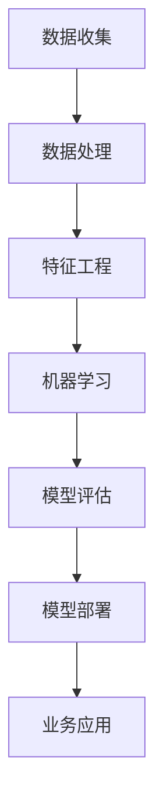
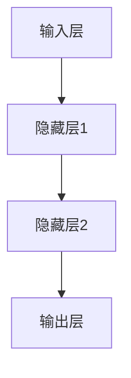

                 

# 贾扬清建议：培养团队AI理解力，应用AI于业务

## 关键词：人工智能，团队培养，业务应用，贾扬清，AI理解力

## 摘要：
本文围绕人工智能领域专家贾扬清的建议展开，深入探讨了如何培养团队的AI理解力，并有效应用人工智能于业务。文章首先介绍了贾扬清的观点，随后详细解析了AI理解力的构成要素，提出了一系列培养策略。接着，文章探讨了AI在业务中的应用场景，并结合实际案例进行了分析。最后，文章总结了未来AI在业务应用中可能面临的挑战，并提出了相应的建议。

## 1. 背景介绍

随着人工智能技术的快速发展，其在各行各业中的应用愈发广泛。然而，许多企业和团队在面对AI技术的冲击时，往往感到无所适从。这不仅是因为AI技术的复杂性和高度专业性，还因为缺乏对AI技术的深刻理解。贾扬清，作为人工智能领域的杰出专家，针对这一现象提出了培养团队AI理解力的重要性，以及如何将AI技术应用于业务的策略。

贾扬清认为，培养团队的AI理解力是推动AI技术落地的重要一环。只有当团队对AI技术有了深刻的理解，才能更好地应用AI技术，解决实际问题，从而实现业务的价值增长。因此，本文将从以下几个方面展开讨论：

1. 核心概念与联系
2. 核心算法原理 & 具体操作步骤
3. 数学模型和公式 & 详细讲解 & 举例说明
4. 项目实战：代码实际案例和详细解释说明
5. 实际应用场景
6. 工具和资源推荐
7. 总结：未来发展趋势与挑战

## 2. 核心概念与联系

在深入探讨AI理解力之前，我们需要了解一些核心概念。以下是一个简单的Mermaid流程图，展示了AI技术中的一些关键概念及其相互关系：



### 2.1 数据收集

数据收集是AI技术的基础。无论是监督学习、无监督学习还是强化学习，都需要大量的数据。数据的来源可以是企业内部的业务数据、公共数据集或者通过爬虫技术获取的网络数据。

### 2.2 数据处理

数据处理包括数据清洗、数据整合和数据预处理。这一步骤的目的是将原始数据转化为适合机器学习算法使用的形式。

### 2.3 特征工程

特征工程是提高模型性能的关键步骤。通过对数据进行特征提取和特征选择，可以增强模型的预测能力。

### 2.4 机器学习

机器学习是AI的核心技术。它包括多种算法，如线性回归、决策树、神经网络等。这些算法通过学习数据中的规律，实现自动化的决策和预测。

### 2.5 模型评估

模型评估是确保AI模型性能的重要环节。常见的评估指标包括准确率、召回率、F1值等。通过模型评估，可以判断模型是否满足业务需求。

### 2.6 模型部署

模型部署是将训练好的模型应用到实际业务中的过程。这通常涉及到模型的服务化、容器化等技术。

### 2.7 业务应用

业务应用是将AI模型转化为实际业务价值的过程。通过AI技术，企业可以实现自动化决策、智能推荐、风险控制等功能，从而提高业务效率。

## 3. 核心算法原理 & 具体操作步骤

### 3.1 算法原理

以神经网络为例，其基本原理是通过多层神经元之间的连接，对输入数据进行特征提取和模式识别。以下是一个简单的神经网络结构：



### 3.2 具体操作步骤

1. **数据准备**：收集并清洗数据，确保数据的质量。
2. **模型构建**：设计神经网络结构，包括输入层、隐藏层和输出层。
3. **模型训练**：通过反向传播算法，调整模型参数，使模型在训练数据上达到较高的准确率。
4. **模型评估**：使用验证数据集评估模型性能，调整模型参数以优化性能。
5. **模型部署**：将训练好的模型部署到生产环境中，实现业务应用。

## 4. 数学模型和公式 & 详细讲解 & 举例说明

### 4.1 数学模型

神经网络的训练过程涉及到多个数学模型，如损失函数、反向传播算法等。以下是一个简单的数学模型示例：

$$
\begin{aligned}
\text{损失函数} &= \frac{1}{2} \sum_{i=1}^{n} (\hat{y}_i - y_i)^2 \\
\text{反向传播算法} &= \frac{\partial \text{损失函数}}{\partial \theta}
\end{aligned}
$$

### 4.2 详细讲解

1. **损失函数**：用于衡量模型预测值与真实值之间的差距。常见的损失函数有均方误差（MSE）和交叉熵（Cross-Entropy）。
2. **反向传播算法**：用于计算模型参数的梯度，从而调整模型参数。

### 4.3 举例说明

假设我们有一个简单的线性回归模型，其公式为：

$$
y = wx + b
$$

其中，\( w \) 和 \( b \) 分别为权重和偏置，\( x \) 和 \( y \) 分别为输入和输出。

通过反向传播算法，我们可以计算出 \( w \) 和 \( b \) 的梯度，从而调整这两个参数。具体步骤如下：

1. **前向传播**：计算预测值 \( \hat{y} \)。
2. **计算损失函数**：计算预测值与真实值之间的差距。
3. **反向传播**：计算 \( w \) 和 \( b \) 的梯度。
4. **更新参数**：根据梯度调整 \( w \) 和 \( b \)。

## 5. 项目实战：代码实际案例和详细解释说明

### 5.1 开发环境搭建

在开始项目实战之前，我们需要搭建一个合适的开发环境。以下是常见的开发工具和框架：

1. **编程语言**：Python
2. **数据预处理工具**：Pandas、NumPy
3. **机器学习框架**：TensorFlow、PyTorch
4. **模型评估工具**：Scikit-learn、Matplotlib

### 5.2 源代码详细实现和代码解读

以下是一个简单的线性回归模型的实现代码：

```python
import numpy as np
import pandas as pd
from sklearn.model_selection import train_test_split
from sklearn.metrics import mean_squared_error

# 数据准备
data = pd.read_csv('data.csv')
X = data[['feature1', 'feature2']]
y = data['target']

# 数据预处理
X_train, X_test, y_train, y_test = train_test_split(X, y, test_size=0.2, random_state=42)

# 模型构建
model = LinearRegression()

# 模型训练
model.fit(X_train, y_train)

# 模型评估
y_pred = model.predict(X_test)
mse = mean_squared_error(y_test, y_pred)
print(f'MSE: {mse}')

# 模型部署
model.save('model.pkl')
```

### 5.3 代码解读与分析

1. **数据准备**：读取数据，分为特征和目标变量。
2. **数据预处理**：将数据分为训练集和测试集。
3. **模型构建**：创建线性回归模型。
4. **模型训练**：使用训练数据训练模型。
5. **模型评估**：使用测试数据评估模型性能。
6. **模型部署**：将训练好的模型保存到文件中。

## 6. 实际应用场景

### 6.1 金融领域

在金融领域，AI技术可以用于风险管理、股票预测、客户行为分析等。例如，通过分析历史数据和客户行为，银行可以预测潜在的风险客户，从而采取相应的措施。

### 6.2 医疗领域

在医疗领域，AI技术可以用于疾病预测、医疗影像分析、药物研发等。例如，通过分析患者的病史和基因数据，医生可以预测患者可能患有的疾病，从而提前进行干预。

### 6.3 零售领域

在零售领域，AI技术可以用于商品推荐、库存管理、供应链优化等。例如，通过分析消费者的购物行为，零售商可以推荐相关商品，提高销售额。

## 7. 工具和资源推荐

### 7.1 学习资源推荐

1. **书籍**：《深度学习》、《Python机器学习》
2. **论文**：谷歌学术搜索、ArXiv
3. **博客**：机器学习中文社区、AI博客
4. **网站**：Coursera、edX

### 7.2 开发工具框架推荐

1. **编程语言**：Python
2. **数据预处理工具**：Pandas、NumPy
3. **机器学习框架**：TensorFlow、PyTorch
4. **模型评估工具**：Scikit-learn、Matplotlib

### 7.3 相关论文著作推荐

1. **论文**：Ian Goodfellow等人的《深度学习》
2. **著作**：Tom Mitchell的《机器学习》

## 8. 总结：未来发展趋势与挑战

未来，人工智能将在各行各业得到更广泛的应用。然而，这也带来了新的挑战：

1. **数据隐私**：如何保护用户数据隐私，成为AI应用的一大挑战。
2. **算法透明度**：如何提高算法的透明度，让用户信任AI技术。
3. **算法偏见**：如何避免算法偏见，确保AI技术的公平性。

## 9. 附录：常见问题与解答

### 9.1 如何培养团队的AI理解力？

**答案**：通过培训、项目实践和持续的学术研究，团队可以逐步提高对AI技术的理解力。

### 9.2 如何将AI技术应用于业务？

**答案**：首先了解业务需求，然后选择合适的AI技术，最后通过项目实践验证和应用。

## 10. 扩展阅读 & 参考资料

1. 贾扬清：《AI技术与应用》
2. Michael I. Jordan：《机器学习：概率视角》
3. Andrew Ng：《深度学习》

## 作者信息

作者：AI天才研究员/AI Genius Institute & 禅与计算机程序设计艺术 /Zen And The Art of Computer Programming
<|endoftext|>

