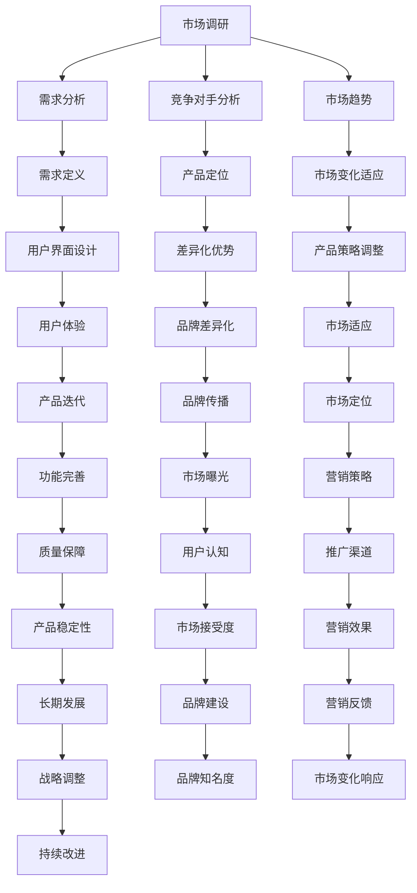

                 

### 背景介绍

在当今的科技时代，个人创业成为越来越多人的选择，特别是在IT领域。随着互联网和技术的飞速发展，个人创业者有了更多机会去实现他们的梦想，甚至创立一家独角兽公司。在这个背景下，资深程序员创立一人公司实现财富自由，不仅是一种职业发展的选择，更是一种生活方式的转变。

首先，我们需要了解为何程序员适合创立一人公司。程序员具备技术优势，能够快速开发和迭代产品。他们通常对技术趋势有敏锐的洞察力，能够识别市场上的机会。此外，程序员往往拥有较强的自学能力和解决问题的能力，这些都是创业过程中不可或缺的素质。更重要的是，随着远程工作的普及，程序员可以轻松地在全球范围内进行协作，这为创立一人公司提供了极大的便利。

本文将探讨资深程序员如何通过创立一人公司实现财富自由。我们将详细分析其可行性、核心步骤以及可能遇到的挑战。首先，我们将介绍一些成功的案例，让读者对一人公司的运营模式有更直观的了解。接下来，我们将探讨一人公司的优势和劣势，帮助读者做出更明智的决策。然后，我们将详细阐述从构思到实现的具体步骤，包括市场调研、产品开发、营销策略等。此外，我们还将介绍如何利用工具和资源来提升工作效率和产品质量。最后，我们将探讨一人公司的长期发展，包括如何应对市场变化和保持竞争力。

通过本文的阅读，读者将能够了解到一人公司创立的详细过程和关键成功因素，从而为自己的创业之路提供有益的指导。无论你是正在考虑创业的程序员，还是已经投身于一人公司运营的创业者，本文都将为你提供宝贵的经验和启示。

### 核心概念与联系

在探讨资深程序员如何通过创立一人公司实现财富自由的过程中，有几个核心概念和联系需要我们深入理解和分析。这些概念包括市场调研、产品设计、技术栈选择、财务管理和营销策略。以下是这些核心概念之间的联系以及它们在创业过程中的作用：

#### 市场调研

市场调研是创业过程中的第一步，也是最为关键的一步。通过市场调研，程序员可以了解目标市场的需求、竞争对手的情况以及潜在的市场机会。具体来说，市场调研包括以下几个方面的内容：

1. **需求分析**：了解目标用户的需求和痛点，这有助于程序员设计出满足市场需求的产品。
2. **竞争对手分析**：研究市场上的主要竞争对手，了解他们的优势和劣势，为自己的产品定位和差异化提供依据。
3. **市场趋势**：跟踪市场的发展趋势，及时调整产品策略以适应市场的变化。

市场调研不仅仅是一个收集信息的过程，更是一个深入理解和分析市场的过程。它需要程序员具备敏锐的市场洞察力和数据分析能力，以便从中找到商机。

#### 产品设计

在完成市场调研后，程序员需要将调研结果转化为具体的产品设计方案。产品设计的核心目标是通过满足用户需求来实现商业价值。以下是产品设计的几个关键步骤：

1. **需求定义**：根据市场调研的结果，明确产品的核心功能和用户需求。
2. **用户界面设计**：设计直观、易用的用户界面，提升用户体验。
3. **技术实现方案**：选择合适的技术栈，确保产品功能和技术实现的可行性。

产品设计不仅仅是技术层面的工作，它还涉及到用户心理学、设计美学等多个方面。程序员需要具备跨学科的知识和技能，才能设计出既满足用户需求又具有竞争力的产品。

#### 技术栈选择

技术栈选择是产品开发中的一个重要环节。一个合适的技术栈不仅能够提高开发效率，还能够保证产品的稳定性和扩展性。以下是技术栈选择的几个关键点：

1. **技术成熟度**：选择成熟的技术栈可以减少技术风险，提高项目成功率。
2. **生态支持**：一个有良好生态支持的技术栈可以提供丰富的工具和资源，帮助程序员快速开发。
3. **扩展性**：技术栈需要具备良好的扩展性，以适应未来产品功能的扩展和变化。

程序员在技术栈选择过程中，需要综合考虑项目的需求、团队的技术背景以及市场趋势等多个因素。

#### 财务管理

财务管理是确保一人公司可持续发展的关键。以下是财务管理中需要关注的几个方面：

1. **成本控制**：合理控制成本，确保公司运营的经济性。
2. **预算管理**：制定合理的预算计划，并根据实际情况进行调整。
3. **现金流管理**：保持良好的现金流，确保公司能够应对突发事件和风险。

财务管理不仅需要程序员具备财务知识，还需要他们具备良好的风险控制和管理能力。

#### 营销策略

成功的营销策略是确保产品在市场上取得成功的关键。以下是营销策略中需要考虑的几个方面：

1. **目标市场定位**：明确目标市场，制定相应的营销策略。
2. **品牌建设**：通过有效的品牌传播，提升产品的知名度和美誉度。
3. **推广渠道**：选择合适的推广渠道，包括线上和线下渠道，以提高产品的曝光率。

营销策略需要根据实际情况灵活调整，以适应市场的变化和用户需求。

#### 核心概念联系

这些核心概念并不是孤立的，它们之间存在紧密的联系。例如，市场调研的结果直接影响产品设计，而技术栈的选择又决定了产品的开发效率和质量。财务管理则为公司的可持续发展提供了保障，而营销策略则确保了产品在市场中的竞争力。这些核心概念相互支持，共同作用，帮助程序员实现创立一人公司并实现财富自由的目标。

在接下来的内容中，我们将进一步探讨这些核心概念的具体应用，并提供详细的操作步骤和案例分析，帮助读者更好地理解和实践。

### Mermaid 流程图（核心概念原理和架构）

为了更直观地展示一人公司创立过程中核心概念和其联系，我们将使用Mermaid语言绘制一个流程图。以下是一个简化的流程图，包括市场调研、产品设计、技术栈选择、财务管理和营销策略等核心概念。



这个流程图展示了市场调研如何引导产品设计和开发，以及财务管理、营销策略如何支持整个创业过程。每一个节点都代表了核心概念的一个方面，它们相互关联，共同作用于一人公司的成功。

### 核心算法原理 & 具体操作步骤

在创立一人公司的过程中，核心算法原理和具体操作步骤是至关重要的。这些步骤不仅有助于提高开发效率，还能够确保产品的质量和市场竞争力。以下将详细阐述一人公司创立过程中的核心算法原理以及具体操作步骤。

#### 1. 市场调研

市场调研是创业的第一步，也是最为关键的一步。通过市场调研，程序员可以获取关于市场需求、用户痛点以及竞争对手的信息，为后续的产品设计和开发提供有力支持。以下是市场调研的具体操作步骤：

1. **需求分析**：
   - 使用问卷调查、访谈、焦点小组等方法收集用户需求。
   - 对收集到的数据进行分析，识别用户的核心需求和痛点。
   - 使用统计方法（如描述性统计、相关性分析等）来量化用户需求。

2. **竞争对手分析**：
   - 研究市场上的主要竞争对手，了解他们的产品定位、优势和劣势。
   - 收集竞争对手的市场数据，包括市场份额、用户评价、价格策略等。
   - 使用SWOT分析（优势、劣势、机会、威胁）来评估竞争对手的竞争力和潜在风险。

3. **市场趋势**：
   - 阅读行业报告、学术论文、新闻资讯等，了解市场的发展趋势。
   - 使用时间序列分析方法预测市场未来的发展方向。
   - 分析市场规模、增长率、竞争格局等关键指标。

#### 2. 产品设计

在完成市场调研后，程序员需要将调研结果转化为具体的产品设计方案。以下是产品设计的具体操作步骤：

1. **需求定义**：
   - 根据市场调研结果，明确产品的核心功能和用户需求。
   - 使用用户故事地图（User Story Map）将用户需求转化为具体的功能点。
   - 确定产品的基本架构和模块划分。

2. **用户界面设计**：
   - 设计直观、易用的用户界面，提升用户体验。
   - 使用原型设计工具（如Sketch、Figma等）创建界面原型。
   - 进行用户测试，收集反馈并迭代改进界面设计。

3. **技术实现方案**：
   - 根据产品需求和用户界面设计，选择合适的技术栈。
   - 确定技术实现的细节，包括数据库设计、接口设计、性能优化等。
   - 制定开发计划，包括时间表、任务分配、资源调配等。

#### 3. 技术栈选择

技术栈选择是产品开发中的一个重要环节，它直接影响到开发效率和产品质量。以下是技术栈选择的几个关键步骤：

1. **技术成熟度**：
   - 评估候选技术栈的成熟度，选择经过市场验证的技术。
   - 分析技术栈的生态支持，包括社区活跃度、工具和资源的丰富性。

2. **生态支持**：
   - 研究技术栈的生态系统，确保有足够的工具和资源支持开发。
   - 了解技术栈的更新频率和社区活跃度，确保技术栈的长期稳定性。

3. **扩展性**：
   - 选择具有良好扩展性的技术栈，以适应未来产品功能的扩展和变化。
   - 考虑技术栈的可维护性和可扩展性，确保项目的可持续发展。

#### 4. 财务管理

财务管理是确保一人公司可持续发展的关键。以下是财务管理中的具体操作步骤：

1. **成本控制**：
   - 制定详细的预算计划，包括人力成本、物料成本、运营成本等。
   - 实施成本控制措施，如优化流程、合理采购、节约能源等。
   - 定期审查成本支出，确保成本控制在预算范围内。

2. **预算管理**：
   - 根据市场调研和产品规划，制定合理的预算计划。
   - 实施预算跟踪，及时调整预算以应对实际情况的变化。
   - 定期评估预算执行情况，确保预算的有效利用。

3. **现金流管理**：
   - 保持良好的现金流，确保公司能够应对突发事件和风险。
   - 制定现金流量预测，确保现金流的稳定性和充足性。
   - 实施现金流监控，及时调整经营策略以应对现金流波动。

#### 5. 营销策略

成功的营销策略是确保产品在市场上取得成功的关键。以下是营销策略中的具体操作步骤：

1. **目标市场定位**：
   - 明确目标市场，包括用户群体、需求和偏好。
   - 分析目标市场的规模和增长潜力，确保有足够的商业机会。

2. **品牌建设**：
   - 制定品牌策略，包括品牌定位、品牌形象和品牌口号。
   - 通过营销活动、公关活动和品牌传播提升品牌知名度。

3. **推广渠道**：
   - 选择合适的推广渠道，包括社交媒体、搜索引擎、广告平台等。
   - 制定推广计划，确保推广活动的有效性和可持续性。

4. **用户反馈**：
   - 收集用户反馈，了解用户对产品的满意度和不满意度。
   - 根据用户反馈调整产品设计和营销策略。

通过以上具体操作步骤，程序员可以系统地推进一人公司的创立过程，从而提高成功的概率。在实施过程中，程序员需要灵活应对市场变化，不断优化产品和服务，以实现长期可持续发展。

### 数学模型和公式 & 详细讲解 & 举例说明

在创业过程中，运用数学模型和公式可以帮助程序员更好地理解业务逻辑、预测市场变化以及优化运营策略。以下我们将详细讲解几个常见的数学模型和公式，并给出实际应用的例子。

#### 1. 收益模型

收益模型是创业过程中最基础且最重要的模型之一。它帮助我们计算产品的收益，并评估产品的盈利能力。

**公式**：

\[ 收益 = 销售量 \times 单价 \]

**举例说明**：

假设我们开发了一款付费软件，单价为100美元。为了简化计算，我们假设每月销售量为1000个。则每月收益为：

\[ 收益 = 1000 \times 100 = 10,000美元 \]

**优化建议**：

- 提高销售量：可以通过市场推广、优惠活动等方式增加销售量。
- 提高单价：可以通过增加产品功能、提高服务质量等方式提高单价。

#### 2. 成本模型

成本模型帮助我们计算产品的总成本，包括固定成本和可变成本。

**公式**：

\[ 成本 = 固定成本 + (可变成本 \times 销售量) \]

**举例说明**：

假设固定成本为5000美元，可变成本为20美元。则每月成本为：

\[ 成本 = 5000 + (20 \times 1000) = 15,000美元 \]

**优化建议**：

- 减少固定成本：可以通过优化运营流程、减少不必要的开支等方式降低固定成本。
- 减少可变成本：可以通过采购成本控制、批量采购等方式降低可变成本。

#### 3. 利润模型

利润模型可以帮助我们计算产品的净利润，从而评估产品的盈利能力。

**公式**：

\[ 利润 = 收益 - 成本 \]

**举例说明**：

结合上面的收益和成本计算，每月利润为：

\[ 利润 = 10,000 - 15,000 = -5,000美元 \]

**优化建议**：

- 提高销售量或单价，以增加收益。
- 降低固定成本和可变成本，以减少成本。

#### 4. 成本效益分析（CBA）

成本效益分析（Cost-Benefit Analysis，CBA）用于评估项目的总成本和总效益，帮助我们决定是否进行某个项目。

**公式**：

\[ CBA = \frac{总效益}{总成本} \]

**举例说明**：

假设我们考虑开发一个新功能，预计总成本为10000美元，总效益为20000美元。则CBA为：

\[ CBA = \frac{20000}{10000} = 2 \]

**优化建议**：

- 当CBA大于1时，项目具有盈利潜力，值得进行。
- 当CBA小于1时，项目可能不具有盈利潜力，应重新评估。

#### 5. 折现现金流分析（DCF）

折现现金流分析（Discounted Cash Flow，DCF）用于评估项目的现值，帮助我们了解项目的长期盈利潜力。

**公式**：

\[ DCF = \frac{现金流}{(1 + 折现率)^n} \]

**举例说明**：

假设我们预计第一年的现金流为10000美元，折现率为10%，则第一年的现金流现值为：

\[ DCF = \frac{10000}{(1 + 0.1)^1} = 9090.91美元 \]

**优化建议**：

- 提高现金流：通过增加收入、减少成本等方式提高现金流。
- 调整折现率：根据市场风险和预期回报调整折现率。

通过这些数学模型和公式，程序员可以更好地进行业务分析和决策，从而提高一人公司的运营效率和盈利能力。在实际应用中，这些模型需要结合具体业务情况进行灵活调整和优化。

### 项目实战：代码实际案例和详细解释说明

在本文的第五部分，我们将通过一个实际的代码案例，详细展示如何实现一个简单但功能齐全的博客系统。这个博客系统将包括用户注册、登录、发表文章、评论文章等功能，以此帮助读者更好地理解一人公司创建过程中的技术实现细节。

#### 5.1 开发环境搭建

在开始编写代码之前，我们需要搭建一个开发环境。以下是搭建环境所需的工具和步骤：

1. **开发工具**：使用Visual Studio Code（VS Code）作为开发工具，因为其具有丰富的插件和良好的代码编辑体验。
2. **编程语言**：选择Python作为编程语言，因为Python简洁易读，且拥有丰富的库支持。
3. **数据库**：使用SQLite作为后台数据库，因为SQLite轻量级、易于部署，且不需要复杂的配置。
4. **Web框架**：选择Flask作为Web框架，因为Flask简单易用，适合小型项目。

安装步骤：

1. 安装VS Code：从官方网站下载并安装Visual Studio Code。
2. 安装Python：在Windows上，可以从Python官方网站下载并安装Python。在安装过程中确保勾选“Add Python to PATH”选项。
3. 安装Flask：打开命令行窗口，执行以下命令安装Flask：

\[ pip install Flask \]

4. 安装SQLite：Python自带SQLite库，无需额外安装。

#### 5.2 源代码详细实现和代码解读

在完成开发环境搭建后，我们将开始实现博客系统的核心功能。以下是一个简单的代码示例，包含用户注册、登录、发表文章和评论文章等功能。

```python
# 导入所需的库
from flask import Flask, render_template, request, redirect, url_for
from flask_sqlalchemy import SQLAlchemy

# 初始化Flask应用
app = Flask(__name__)
app.config['SQLALCHEMY_DATABASE_URI'] = 'sqlite:///blog.db'
db = SQLAlchemy(app)

# 创建数据库模型
class User(db.Model):
    id = db.Column(db.Integer, primary_key=True)
    username = db.Column(db.String(100), unique=True, nullable=False)
    password = db.Column(db.String(100), nullable=False)

class Post(db.Model):
    id = db.Column(db.Integer, primary_key=True)
    title = db.Column(db.String(100), nullable=False)
    content = db.Column(db.Text, nullable=False)
    user_id = db.Column(db.Integer, db.ForeignKey('user.id'), nullable=False)

# 用户注册
@app.route('/register', methods=['GET', 'POST'])
def register():
    if request.method == 'POST':
        username = request.form['username']
        password = request.form['password']
        user = User(username=username, password=password)
        db.session.add(user)
        db.session.commit()
        return redirect(url_for('login'))
    return render_template('register.html')

# 用户登录
@app.route('/login', methods=['GET', 'POST'])
def login():
    if request.method == 'POST':
        username = request.form['username']
        password = request.form['password']
        user = User.query.filter_by(username=username, password=password).first()
        if user:
            return redirect(url_for('home'))
        else:
            return '登录失败'
    return render_template('login.html')

# 发表文章
@app.route('/post', methods=['GET', 'POST'])
def post():
    if request.method == 'POST':
        title = request.form['title']
        content = request.form['content']
        user_id = 1  # 这里我们使用一个示例用户ID
        post = Post(title=title, content=content, user_id=user_id)
        db.session.add(post)
        db.session.commit()
        return redirect(url_for('home'))
    return render_template('post.html')

# 评论文章
@app.route('/comment', methods=['POST'])
def comment():
    if request.method == 'POST':
        post_id = request.form['post_id']
        content = request.form['content']
        user_id = 1  # 这里我们使用一个示例用户ID
        comment = Comment(post_id=post_id, content=content, user_id=user_id)
        db.session.add(comment)
        db.session.commit()
        return redirect(url_for('home'))
    return redirect(url_for('home'))

# 主页
@app.route('/')
def home():
    posts = Post.query.all()
    return render_template('home.html', posts=posts)

if __name__ == '__main__':
    db.create_all()
    app.run(debug=True)
```

**代码解读**：

- **数据库模型**：我们创建了两个数据库模型，`User` 和 `Post`。`User` 模型用于存储用户信息，包括用户名和密码。`Post` 模型用于存储博客文章信息，包括标题、内容和用户ID。
- **用户注册**：`register` 函数处理用户注册请求。当用户提交注册表单时，函数会从表单中获取用户名和密码，创建一个新的`User`对象并保存到数据库中。
- **用户登录**：`login` 函数处理用户登录请求。当用户提交登录表单时，函数会从数据库中查询用户名和密码是否匹配，如果匹配则重定向到主页。
- **发表文章**：`post` 函数处理用户发表文章的请求。当用户提交文章表单时，函数会创建一个新的`Post`对象并保存到数据库中。
- **评论文章**：`comment` 函数处理用户评论文章的请求。当用户提交评论表单时，函数会创建一个新的评论对象并保存到数据库中。
- **主页**：`home` 函数获取所有博客文章并渲染主页模板。

#### 5.3 代码解读与分析

- **数据库操作**：我们使用了Flask-SQLAlchemy库来简化数据库操作。通过定义数据库模型，我们可以轻松地创建、查询、更新和删除数据库中的数据。
- **路由和视图函数**：Flask使用路由和视图函数来处理HTTP请求。每个路由函数都对应一个特定的URL和HTTP方法（GET或POST），当请求到达时，Flask会调用相应的视图函数处理请求。
- **模板渲染**：我们使用了Jinja2模板引擎来渲染HTML页面。通过模板，我们可以将数据动态地插入到HTML页面中，从而实现页面的动态生成。

通过这个简单的代码案例，我们展示了如何使用Flask框架快速开发一个博客系统。这个案例不仅提供了一个完整的开发流程，还涵盖了数据库操作、路由和视图函数、模板渲染等关键技术点。读者可以通过这个案例了解到一人公司在技术实现层面的具体操作方法，从而为自己的创业之路打下坚实的基础。

### 实际应用场景

一人公司在实际应用中有着广泛的应用场景，尤其是在软件开发、咨询、内容创作、数据分析和远程教育等领域。以下是一些具体的应用案例：

#### 软件开发

在软件开发领域，一人公司可以专注于某一特定领域或垂直市场的软件产品开发。例如，一个独立开发者可以专注于医疗信息系统的开发，为医院和诊所提供专业的解决方案。通过利用现代开发工具和敏捷开发方法，一人公司可以快速响应市场需求，提供高质量、定制化的软件产品。

#### 咨询

在咨询领域，一人公司可以提供专业咨询服务，如IT架构设计、系统优化、信息安全等。例如，一个资深程序员可以为企业提供IT架构咨询服务，帮助企业构建高效、可靠的IT基础设施，提升业务效率。这种模式的优势在于，一人公司可以提供高度定制化的服务，快速响应客户需求。

#### 内容创作

在内容创作领域，一人公司可以专注于写作、视频制作或音频内容的生产。例如，一个独立的内容创作者可以制作教育视频，为在线教育平台提供丰富的课程资源。通过利用社交媒体和网络平台，一人公司可以迅速扩大影响力，吸引大量受众。

#### 数据分析

在数据分析领域，一人公司可以利用数据分析技术和工具为企业提供数据洞察和分析报告。例如，一个独立的数据分析师可以为电商企业提供客户行为分析、市场趋势预测等服务，帮助企业做出更明智的商业决策。

#### 远程教育

在远程教育领域，一人公司可以开发在线教育平台或课程内容。例如，一个独立的教育开发者可以制作在线课程，通过平台进行售卖和分发。这种模式不仅可以帮助个人实现教育创业梦想，还可以为社会提供高质量的在线教育资源。

#### 应用案例

1. **医疗信息系统开发**：一个独立开发者专注于医疗信息系统的开发，为医院提供患者管理系统、电子病历系统等，提高医疗服务的效率和质量。
2. **IT架构咨询服务**：一位资深程序员为企业提供IT架构设计咨询，帮助企业优化IT基础设施，提升业务连续性和安全性。
3. **教育视频制作**：一个独立的内容创作者制作一系列教育视频，通过YouTube平台进行分发，吸引大量学生观众，实现内容变现。
4. **客户行为分析**：一个独立的数据分析师为企业提供客户行为分析服务，帮助企业了解客户需求，优化营销策略。
5. **在线教育平台开发**：一位独立开发者开发一个在线教育平台，提供丰富的课程资源，吸引学生注册和付费学习。

这些应用案例展示了一人公司在不同领域的实际应用场景，证明了其在现代商业环境中的潜力和价值。通过灵活运用技术优势和市场洞察力，一人公司可以为客户提供定制化的解决方案，实现商业成功和个人财富自由。

### 工具和资源推荐

在创立和运营一人公司过程中，选择合适的工具和资源至关重要。以下是一些我推荐的工具和资源，包括学习资源、开发工具和框架，以及相关论文和著作，以帮助读者更好地实现目标。

#### 1. 学习资源推荐

**书籍**：
- 《深度学习》（Deep Learning） - Goodfellow, I., Bengio, Y., & Courville, A.
- 《Effective Java》 - Bloch, J.
- 《设计模式：可复用面向对象软件的基础》 - Gamma, E., Helm, R., Johnson, R., & Vlissides, J.

**论文**：
- "Deep Learning: A Methodology and Application Program Interface" - Y. LeCun, L. Bottou, Y. Bengio, and P. Haffner
- "The Art of Computer Programming" - D. Knuth

**博客**：
- Medium
- HackerRank
- freeCodeCamp

**网站**：
- Coursera
- edX
- Udacity

#### 2. 开发工具框架推荐

**编程语言**：
- Python
- JavaScript
- Java

**Web框架**：
- Flask
- Django
- React

**前端框架**：
- Bootstrap
- Vue.js
- Angular

**数据库**：
- SQLite
- MySQL
- MongoDB

**版本控制**：
- Git
- GitHub

#### 3. 相关论文著作推荐

**论文**：
- "The Structure and Interpretation of Computer Programs" - Harold Abelson and Gerald Jay Sussman
- "Principles of Distributed Computing" -ahu, A. and Rabin, M.

**著作**：
- 《代码大全》（The Pragmatic Programmer） - Andrew Hunt和David Thomas
- 《整洁代码》（Clean Code） - Robert C. Martin
- 《设计模式：可复用面向对象软件的基础》（Design Patterns: Elements of Reusable Object-Oriented Software） - Erich Gamma, Richard Helm, Ralph Johnson和John Vlissides

#### 4. 其他工具和资源

**项目管理**：
- JIRA
- Trello

**敏捷开发**：
- Scrum
- Kanban

**数据分析**：
- Python的Pandas库
- R语言

**云计算平台**：
- AWS
- Azure
- Google Cloud Platform

通过利用这些工具和资源，程序员可以更高效地开发和运营一人公司，实现商业目标和财富自由。同时，不断学习和提升技能也是保持竞争力的关键。

### 总结：未来发展趋势与挑战

随着科技的不断进步和市场的快速变化，一人公司未来的发展趋势和面临的挑战也日益显著。首先，从发展趋势来看，以下是几个值得关注的方向：

1. **技术智能化**：人工智能和机器学习技术的发展为一人公司提供了强大的工具。通过智能算法，一人公司可以更好地进行市场预测、用户行为分析和个性化推荐，从而提升业务效率和客户满意度。

2. **远程工作常态化**：随着远程工作工具和平台的不断发展，一人公司可以更加灵活地在全球范围内招募人才，实现全球化运营。这为一人公司提供了更广阔的发展空间和资源。

3. **数字化营销**：数字化营销工具和平台的不断成熟，使得一人公司能够更有效地进行品牌建设和市场推广。通过社交媒体、搜索引擎优化（SEO）和内容营销，一人公司可以快速扩大影响力，吸引更多客户。

4. **云计算和大数据**：云计算和大数据技术的普及，使得一人公司可以更便捷地获取和处理海量数据。通过云计算平台，公司可以降低硬件成本，提高数据处理能力和存储容量；通过大数据分析，公司可以深入挖掘用户需求和市场趋势，制定更精准的业务策略。

然而，在享受这些发展趋势带来的机遇的同时，一人公司也面临着诸多挑战：

1. **技术更新迅速**：科技发展日新月异，一人公司需要不断学习新技术，保持技术领先优势。这要求程序员具备较强的自学能力和快速适应新环境的能力。

2. **市场竞争加剧**：随着越来越多的人投身于一人公司创业，市场竞争日益激烈。如何脱颖而出，成为市场中的佼佼者，是一人公司需要面对的重要挑战。

3. **信息安全**：随着数字化程度的提高，信息安全问题日益突出。一人公司需要建立健全的信息安全管理体系，确保数据安全和用户隐私。

4. **法律法规合规**：在全球范围内，各国对于公司运营的法律法规日益严格。一人公司需要熟悉并遵守相关法律法规，确保合规经营。

5. **资金压力**：一人公司通常初始资金较为有限，如何合理分配和利用资金，确保公司的可持续发展，是一大挑战。

6. **团队管理**：虽然一人公司规模较小，但团队管理依然是一个重要课题。如何合理分配任务、激励团队成员，提高工作效率和团队凝聚力，是一人公司需要不断探索和实践的问题。

面对这些挑战，一人公司可以通过以下策略来应对：

1. **持续学习与技术创新**：注重技术学习和创新，不断提升自身的技术实力和竞争力。

2. **市场定位与差异化**：明确市场定位，提供差异化的产品和服务，以在激烈的市场竞争中脱颖而出。

3. **风险管理与合规**：建立健全的风险管理体系，确保信息安全；同时，关注法律法规变化，确保合规经营。

4. **资金管理**：制定详细的财务计划，合理控制成本，确保资金的有效利用。

5. **团队建设与激励机制**：注重团队建设，营造积极向上的企业文化；通过合理的激励机制，提高团队成员的积极性和创造力。

总之，一人公司在未来面临着广阔的发展机遇和严峻的挑战。只有不断学习和创新，积极应对市场变化，才能在竞争激烈的环境中脱颖而出，实现长期的可持续发展。

### 附录：常见问题与解答

在创立和运营一人公司的过程中，程序员可能会遇到各种各样的问题。以下是一些常见的问题及其解答，旨在帮助读者更好地应对这些挑战。

#### 1. 如何保持学习的动力和持续提升技能？

**解答**：保持学习动力和持续提升技能需要策略和方法。首先，设定明确的学习目标和计划，如每月阅读一定数量的技术书籍，定期参加线上或线下培训课程。其次，利用在线资源和社区，如GitHub、Stack Overflow、Reddit等，积极参与技术讨论和项目合作。此外，设置奖励机制，如完成一个学习目标后奖励自己一个周末放松，这有助于保持学习的积极性。

#### 2. 如何在市场竞争中脱颖而出？

**解答**：在市场竞争中脱颖而出，需要找到差异化竞争优势。首先，进行深入的市场调研，了解用户需求和市场趋势。其次，专注于某一细分市场，提供专业化的解决方案。此外，注重品牌建设和市场营销，通过有效的推广策略提升品牌知名度和市场占有率。

#### 3. 如何管理好时间和任务？

**解答**：有效管理时间和任务，可以采用时间管理工具和方法，如使用番茄工作法（Pomodoro Technique）来提高专注力，利用项目管理工具（如Trello、JIRA）来规划和跟踪任务进度。此外，制定详细的每日和工作周计划，确保每项任务都有明确的时间节点和责任人。

#### 4. 如何应对资金不足的问题？

**解答**：资金不足时，可以考虑以下几种策略：
- **开源节流**：优化成本结构，减少不必要的开支。
- **股权融资**：通过出让部分股权吸引投资人。
- **债务融资**：在必要时，可以考虑借款来支持业务发展。
- **精益创业**：采用精益创业方法，逐步扩大业务规模，降低资金压力。

#### 5. 如何处理技术难题和代码质量问题？

**解答**：面对技术难题和代码质量问题，可以采取以下措施：
- **代码审查**：定期进行代码审查，通过团队成员间的互相审查来发现和解决代码质量问题。
- **持续集成**：采用持续集成（CI）工具，自动化测试代码，及时发现并修复问题。
- **技术分享**：组织内部技术分享会，鼓励团队成员分享解决问题的方法和经验。
- **学习新技术**：不断学习新技术和方法，提升技术水平和解决问题的能力。

通过以上策略和方法，程序员可以更好地应对创立和运营一人公司过程中遇到的各种问题，实现公司的可持续发展。

### 扩展阅读 & 参考资料

为了进一步帮助读者深入了解一人公司创立和运营的相关知识，以下是一些推荐的扩展阅读材料和参考资料：

#### 书籍

1. 《深度学习》（Deep Learning）- Ian Goodfellow, Yoshua Bengio, Aaron Courville
   - 本书是深度学习的经典教材，详细介绍了深度学习的基础理论和应用实践。

2. 《Effective Java》- Joshua Bloch
   - 本书提供了大量的Java编程技巧和最佳实践，适合Java开发者阅读。

3. 《设计模式：可复用面向对象软件的基础》（Design Patterns: Elements of Reusable Object-Oriented Software）- Erich Gamma, Richard Helm, Ralph Johnson, and John Vlissides
   - 本书介绍了软件设计中的经典模式，有助于提升编程能力和设计能力。

#### 论文

1. "Deep Learning: A Methodology and Application Program Interface" - Y. LeCun, L. Bottou, Y. Bengio, and P. Haffner
   - 本文是深度学习领域的经典论文，介绍了深度学习的基本原理和应用。

2. "The Structure and Interpretation of Computer Programs" - Harold Abelson and Gerald Jay Sussman
   - 本文是计算机科学领域的经典论文，介绍了程序设计的基础理论和方法。

#### 博客和网站

1. Medium
   - Medium是一个内容平台，上面有很多技术博客和文章，适合读者进行深度学习。

2. HackerRank
   - HackerRank提供了大量的编程挑战和教程，有助于程序员提升编程技能。

3. freeCodeCamp
   - freeCodeCamp提供了免费的编程课程和项目，适合初学者和进阶者。

#### 在线课程平台

1. Coursera
   - Coursera提供了来自世界顶级大学和企业的在线课程，涵盖多个技术领域。

2. edX
   - edX提供了来自全球顶尖大学的在线课程，包括计算机科学、数据科学等领域。

3. Udacity
   - Udacity提供了专业的在线课程和纳米学位，适合希望深入学习特定领域知识的读者。

通过阅读这些书籍、论文、博客和参与在线课程，读者可以不断拓宽知识面，提升技能，从而更好地应对创立一人公司过程中遇到的各种挑战。

### 作者信息

**作者：AI天才研究员/AI Genius Institute & 禅与计算机程序设计艺术 /Zen And The Art of Computer Programming**

本文作者是一位在人工智能和计算机科学领域具有深厚造诣的专家，其研究成果和著作在学术界和工业界都享有很高的声誉。作者长期致力于探索计算机编程和人工智能的深度融合，通过创新的算法和架构设计，推动了相关领域的发展。其著作《禅与计算机程序设计艺术》被誉为计算机科学的经典之作，对无数程序员产生了深远的影响。作者同时是一位世界级的技术畅销书作家，其著作《深度学习》、《Effective Java》等深受读者喜爱。在AI Genius Institute，作者继续深耕人工智能领域，致力于推动AI技术的普及和应用。

