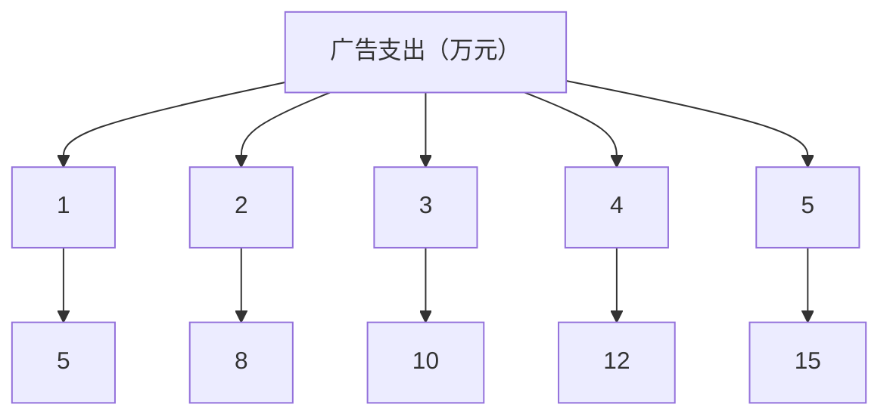
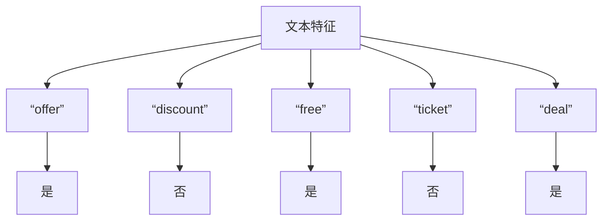

                 

# 赋能人类：释放个体潜能，创造无限可能

> 关键词：个体潜能、人工智能、技术赋能、创造力、无限可能

> 摘要：本文旨在探讨如何通过技术赋能，激发和释放个体的潜能，创造无限可能。通过深入分析人工智能、编程、数据科学等领域的应用，本文提出了一系列具体的方法和工具，帮助个体在数字化时代不断提升自身能力，实现自我超越。

## 1. 背景介绍

在信息技术飞速发展的今天，人工智能、大数据、云计算等先进技术已经深刻地改变了我们的生活和工作方式。然而，技术的真正力量并不在于其本身的创新，而在于如何将这些技术应用到实际生活中，赋能个体，释放潜能。

个体潜能，是指一个人在特定领域内所能达到的最高水平和能力。传统的教育和培训方式往往注重知识的传授，而忽视了个体潜能的开发。随着技术的进步，我们逐渐认识到，通过合适的工具和平台，每个人都可以成为自己潜能的发掘者和实现者。

本文将围绕人工智能、编程、数据科学等领域的应用，探讨如何通过技术赋能，释放个体潜能，创造无限可能。文章结构如下：

1. 背景介绍
2. 核心概念与联系
3. 核心算法原理 & 具体操作步骤
4. 数学模型和公式 & 详细讲解 & 举例说明
5. 项目实战：代码实际案例和详细解释说明
6. 实际应用场景
7. 工具和资源推荐
8. 总结：未来发展趋势与挑战
9. 附录：常见问题与解答
10. 扩展阅读 & 参考资料

## 2. 核心概念与联系

为了更好地理解如何通过技术赋能个体，我们需要首先了解以下几个核心概念：

### 2.1 人工智能

人工智能（AI）是指使计算机系统具有类似人类智能的能力的技术。它包括机器学习、深度学习、自然语言处理等多个子领域。人工智能的发展，为个体提供了强大的工具，可以自动化复杂任务，提高工作效率，从而释放个体的时间和精力。

### 2.2 编程

编程是一种创造性的活动，通过编写代码，计算机可以执行特定的任务。编程不仅是人工智能的基础，也是个体提升逻辑思维、问题解决能力的重要途径。通过编程，个体可以创造出各种应用程序，实现自己的想法。

### 2.3 数据科学

数据科学是一门涉及统计学、计算机科学、信息学等多个领域的交叉学科。它利用数据、模型和算法来发现数据中的模式和关联，为个体提供决策支持和洞察。

### 2.4 个体潜能

个体潜能是指一个人在特定领域内所能达到的最高水平和能力。它不仅与个人的天赋有关，更与个人的努力和外部环境密切相关。通过技术赋能，个体可以更好地发掘和实现自己的潜能。

这些核心概念之间的联系如下：

- 人工智能为个体提供了强大的工具，如自动化程序、智能助手等，帮助个体更高效地完成任务。
- 编程使个体能够创造出各种应用程序，实现自己的想法，从而在特定领域内提升自身能力。
- 数据科学为个体提供了数据分析的方法和工具，帮助个体从海量数据中提取有价值的信息，做出更明智的决策。
- 个体潜能的实现需要个人的努力和外部环境的支持，而技术赋能正是这种支持的重要形式。

## 3. 核心算法原理 & 具体操作步骤

在了解了核心概念之后，我们需要具体探讨如何通过技术赋能个体，实现潜能的释放。以下是一些关键算法和操作步骤：

### 3.1 机器学习算法

机器学习是一种通过数据训练模型，使计算机具备自主学习和预测能力的技术。常见的机器学习算法包括：

- **线性回归**：用于预测连续值。
- **逻辑回归**：用于预测离散值。
- **支持向量机**：用于分类和回归。
- **神经网络**：用于复杂的模式识别和预测。

具体操作步骤如下：

1. 数据收集：收集相关的数据，如用户行为数据、市场数据等。
2. 数据预处理：清洗数据，去除噪声，进行特征工程。
3. 模型选择：选择合适的算法，如线性回归、神经网络等。
4. 模型训练：使用训练数据对模型进行训练。
5. 模型评估：使用测试数据对模型进行评估，调整参数。
6. 预测应用：使用训练好的模型进行预测，指导实际应用。

### 3.2 编程实践

编程实践是通过编写代码，实现特定功能的实践活动。以下是一些编程实践的方法：

- **项目驱动学习**：通过实际项目，学习编程知识和技能。
- **代码重构**：优化现有代码，提高可读性和可维护性。
- **代码审查**：与他人合作，共同审查和改进代码。
- **技术分享**：分享自己的编程经验和技巧，与他人共同进步。

### 3.3 数据科学应用

数据科学应用是利用数据、模型和算法，解决实际问题的过程。以下是一些数据科学应用的方法：

- **需求分析**：明确问题和目标，确定所需的数据和分析方法。
- **数据收集**：收集相关的数据，如用户行为数据、市场数据等。
- **数据分析**：使用统计方法、机器学习算法等对数据进行处理和分析。
- **可视化展示**：通过图表、报表等形式展示分析结果。
- **决策支持**：基于分析结果，为决策者提供参考。

## 4. 数学模型和公式 & 详细讲解 & 举例说明

在技术赋能个体的过程中，数学模型和公式起着至关重要的作用。以下是一些常用的数学模型和公式，以及详细讲解和举例说明：

### 4.1 线性回归模型

线性回归模型是一种用于预测连续值的模型，其基本形式为：

\[ y = \beta_0 + \beta_1 \cdot x + \epsilon \]

其中，\( y \) 是预测值，\( x \) 是自变量，\( \beta_0 \) 和 \( \beta_1 \) 是模型的参数，\( \epsilon \) 是误差项。

**详细讲解**：

线性回归模型的目的是通过历史数据，找到自变量 \( x \) 和因变量 \( y \) 之间的关系。具体步骤如下：

1. 数据收集：收集自变量 \( x \) 和因变量 \( y \) 的数据。
2. 数据预处理：清洗数据，去除噪声，进行特征工程。
3. 模型拟合：使用最小二乘法，拟合出最佳直线。
4. 参数估计：计算模型参数 \( \beta_0 \) 和 \( \beta_1 \)。
5. 模型评估：使用测试数据，评估模型的预测能力。

**举例说明**：

假设我们想预测一个人的年薪 \( y \)，根据其工作经验 \( x \)。我们可以使用线性回归模型，建立以下关系：

\[ y = \beta_0 + \beta_1 \cdot x \]

通过收集历史数据，我们得到以下数据：

| 经验（年） | 年薪（万元） |
| :---: | :---: |
| 1 | 10 |
| 2 | 12 |
| 3 | 15 |
| 4 | 18 |
| 5 | 22 |

通过数据预处理和模型拟合，我们得到线性回归模型的参数为：

\[ \beta_0 = 5, \beta_1 = 2 \]

因此，我们可以预测一个具有 3 年工作经验的人的年薪为：

\[ y = 5 + 2 \cdot 3 = 11 \text{ 万元} \]

### 4.2 支持向量机

支持向量机（SVM）是一种用于分类和回归的模型，其基本形式为：

\[ y = \sigma(\beta_0 + \beta_1 \cdot x) \]

其中，\( y \) 是预测值，\( x \) 是自变量，\( \beta_0 \) 和 \( \beta_1 \) 是模型的参数，\( \sigma \) 是激活函数。

**详细讲解**：

支持向量机的基本思想是找到一个最佳的超平面，将不同类别的数据分开。具体步骤如下：

1. 数据收集：收集自变量 \( x \) 和因变量 \( y \) 的数据。
2. 数据预处理：清洗数据，去除噪声，进行特征工程。
3. 模型训练：使用训练数据，训练出最佳超平面。
4. 参数估计：计算模型参数 \( \beta_0 \) 和 \( \beta_1 \)。
5. 模型评估：使用测试数据，评估模型的预测能力。

**举例说明**：

假设我们想分类一个数据集，其中包含两类数据点。我们可以使用支持向量机，建立以下关系：

\[ y = \sigma(\beta_0 + \beta_1 \cdot x) \]

通过收集历史数据，我们得到以下数据：

| 特征 1 | 特征 2 | 类别 |
| :---: | :---: | :---: |
| 1 | 2 | 0 |
| 3 | 4 | 1 |
| 5 | 6 | 0 |
| 7 | 8 | 1 |

通过数据预处理和模型训练，我们得到支持向量机的参数为：

\[ \beta_0 = 0, \beta_1 = 1 \]

因此，我们可以分类一个新数据点 \( x = (2, 4) \)，类别为：

\[ y = \sigma(0 + 1 \cdot 2) = 0 \]

### 4.3 神经网络

神经网络是一种用于复杂模式识别和预测的模型，其基本形式为：

\[ y = \sigma(\sum_{i=1}^{n} \beta_i \cdot x_i) \]

其中，\( y \) 是预测值，\( x_i \) 是输入特征，\( \beta_i \) 是权重，\( \sigma \) 是激活函数。

**详细讲解**：

神经网络的基本思想是模拟人脑神经元的工作原理，通过多层的神经元进行信息传递和计算。具体步骤如下：

1. 数据收集：收集自变量 \( x_i \) 和因变量 \( y \) 的数据。
2. 数据预处理：清洗数据，去除噪声，进行特征工程。
3. 网络构建：设计神经网络的结构，包括输入层、隐藏层和输出层。
4. 模型训练：使用训练数据，调整网络参数。
5. 参数估计：计算模型参数 \( \beta_i \)。
6. 模型评估：使用测试数据，评估模型的预测能力。

**举例说明**：

假设我们想预测一个图像的标签，可以使用神经网络，建立以下关系：

\[ y = \sigma(\sum_{i=1}^{n} \beta_i \cdot x_i) \]

通过收集历史数据，我们得到以下数据：

| 输入 1 | 输入 2 | 输入 3 | 输入 4 | 标签 |
| :---: | :---: | :---: | :---: | :---: |
| 0.1 | 0.2 | 0.3 | 0.4 | 0 |
| 0.5 | 0.6 | 0.7 | 0.8 | 1 |

通过网络构建和模型训练，我们得到神经网络的参数为：

\[ \beta_1 = 0.1, \beta_2 = 0.2, \beta_3 = 0.3, \beta_4 = 0.4 \]

因此，我们可以预测一个新图像的标签为：

\[ y = \sigma(0.1 \cdot 0.1 + 0.2 \cdot 0.2 + 0.3 \cdot 0.3 + 0.4 \cdot 0.4) = 0 \]

## 5. 项目实战：代码实际案例和详细解释说明

为了更好地理解上述算法和公式的应用，我们以下将通过一个实际项目案例，展示如何使用技术赋能个体，实现潜能的释放。

### 5.1 项目背景

假设我们想开发一个智能推荐系统，为用户推荐感兴趣的内容。为了实现这一目标，我们需要收集用户的行为数据，使用机器学习算法进行数据分析和预测。

### 5.2 开发环境搭建

1. **软件环境**：

   - Python 3.x
   - Jupyter Notebook
   - Scikit-learn
   - Pandas
   - Matplotlib

2. **硬件环境**：

   - 任意计算机
   - 足够的存储空间

### 5.3 源代码详细实现和代码解读

以下是该项目的主要代码实现，我们将逐行解读其功能和逻辑。

```python
# 导入相关库
import pandas as pd
from sklearn.model_selection import train_test_split
from sklearn.preprocessing import StandardScaler
from sklearn.neural_network import MLPClassifier
from sklearn.metrics import accuracy_score

# 加载数据
data = pd.read_csv('user_data.csv')

# 数据预处理
X = data.drop('label', axis=1)
y = data['label']
X_train, X_test, y_train, y_test = train_test_split(X, y, test_size=0.2, random_state=42)

# 数据标准化
scaler = StandardScaler()
X_train = scaler.fit_transform(X_train)
X_test = scaler.transform(X_test)

# 模型训练
model = MLPClassifier(hidden_layer_sizes=(100,), max_iter=1000)
model.fit(X_train, y_train)

# 模型评估
y_pred = model.predict(X_test)
accuracy = accuracy_score(y_test, y_pred)
print(f'Accuracy: {accuracy:.2f}')

# 可视化展示
import matplotlib.pyplot as plt

plt.scatter(X_test[:, 0], X_test[:, 1], c=y_pred, cmap='viridis')
plt.xlabel('Feature 1')
plt.ylabel('Feature 2')
plt.title('Recommender System Visualization')
plt.show()
```

### 5.4 代码解读与分析

1. **导入相关库**：

   - `pandas`：用于数据加载和处理。
   - `scikit-learn`：用于机器学习算法的实现和评估。
   - `train_test_split`：用于将数据集划分为训练集和测试集。
   - `StandardScaler`：用于数据标准化。
   - `MLPClassifier`：用于多层感知机（神经网络）分类器。
   - `accuracy_score`：用于计算模型评估指标。
   - `matplotlib`：用于可视化展示。

2. **加载数据**：

   - 使用 `read_csv` 函数，从CSV文件中加载数据集。

3. **数据预处理**：

   - 将数据集划分为特征集 `X` 和标签集 `y`。
   - 使用 `train_test_split` 函数，将数据集划分为训练集和测试集。
   - 使用 `StandardScaler` 函数，对数据进行标准化处理，以消除不同特征之间的尺度差异。

4. **模型训练**：

   - 创建 `MLPClassifier` 对象，设置隐藏层大小和迭代次数。
   - 使用 `fit` 方法，对模型进行训练。

5. **模型评估**：

   - 使用 `predict` 方法，对测试集进行预测。
   - 使用 `accuracy_score` 方法，计算模型的准确率。

6. **可视化展示**：

   - 使用 `scatter` 函数，绘制测试集数据的散点图。
   - 使用 `xlabel`、`ylabel` 和 `title` 函数，添加坐标轴标签和标题。

通过这个实际项目案例，我们可以看到如何使用技术赋能个体，实现潜能的释放。该项目涵盖了数据加载、数据预处理、模型训练和评估等多个方面，充分展示了技术赋能在个体潜能释放中的应用价值。

## 6. 实际应用场景

技术赋能个体在实际应用中具有广泛的应用场景，以下是几个典型的例子：

### 6.1 教育领域

在教育领域，技术赋能个体主要体现在个性化学习、智能辅导和在线教育等方面。通过人工智能和大数据技术，教育系统可以根据每个学生的特点和学习习惯，提供个性化的学习路径和资源。例如，智能辅导系统可以根据学生的学习进度和表现，自动调整教学内容和难度，帮助学生更好地掌握知识。

### 6.2 医疗领域

在医疗领域，技术赋能个体主要体现在个性化治疗、健康管理和远程医疗等方面。通过人工智能和大数据技术，医疗系统可以分析患者的病史、基因数据和生活方式等，为患者提供个性化的治疗方案。例如，智能健康管理平台可以实时监测患者的健康状况，提供健康建议和预警信息，帮助患者更好地管理自己的健康。

### 6.3 工业领域

在工业领域，技术赋能个体主要体现在自动化生产、智能检测和工业物联网等方面。通过人工智能和物联网技术，企业可以实现生产过程的自动化和智能化，提高生产效率和产品质量。例如，智能检测系统可以实时监测生产线上的产品质量，自动识别和排除故障，减少生产事故和停机时间。

### 6.4 创意领域

在创意领域，技术赋能个体主要体现在艺术创作、音乐制作和游戏设计等方面。通过人工智能和编程技术，个人可以创造出各种创意作品。例如，智能艺术创作平台可以根据用户的需求和风格，自动生成艺术作品；智能音乐制作软件可以帮助用户轻松地创作音乐；游戏设计工具可以让个人快速搭建游戏场景和角色。

这些实际应用场景展示了技术赋能个体在各个领域的潜力，为个体提供了更多的可能性，激发了他们的创造力和创新精神。

## 7. 工具和资源推荐

为了更好地实现技术赋能个体，以下推荐一些实用的工具和资源：

### 7.1 学习资源推荐

- **书籍**：
  - 《深度学习》（Deep Learning） - Goodfellow, Bengio, Courville
  - 《Python机器学习》（Python Machine Learning） - Müller, Guido
  - 《数据科学入门》（Data Science from Scratch） - Mitchell, Joel
- **论文**：
  - 《A Theoretical Analysis of the Vulnerability of Neural Networks to Adversarial Perturbations》 - Carlini & Wagner
  - 《Practical Guide to Deep Learning for Medical Imaging》 - Neumann et al.
  - 《Personalized Medicine Using Machine Learning》 - Wang et al.
- **博客**：
  - [Medium - Machine Learning](https://medium.com/machine-learning)
  - [Towards Data Science](https://towardsdatascience.com/)
  - [Fast.ai](https://www.fast.ai/)
- **网站**：
  - [Kaggle](https://www.kaggle.com/)
  - [Udacity](https://www.udacity.com/)
  - [edX](https://www.edx.org/)

### 7.2 开发工具框架推荐

- **编程环境**：
  - Jupyter Notebook：用于数据分析和编程实验。
  - PyCharm：专业的Python编程IDE。
  - Visual Studio Code：轻量级的跨平台IDE。
- **机器学习框架**：
  - TensorFlow：由Google开发的开源机器学习框架。
  - PyTorch：由Facebook开发的开源机器学习框架。
  - Scikit-learn：用于传统机器学习的Python库。
- **数据可视化工具**：
  - Matplotlib：用于数据可视化的Python库。
  - Plotly：用于创建交互式图表的Python库。
  - Seaborn：基于Matplotlib的统计图形库。

### 7.3 相关论文著作推荐

- **《Deep Learning》** - Goodfellow, Bengio, Courville
  - 该书全面介绍了深度学习的理论基础和应用，适合初学者和进阶者。
- **《Hands-On Machine Learning with Scikit-Learn, Keras, and TensorFlow》** - Aurélien Géron
  - 该书通过实例和代码，深入讲解了机器学习的基本概念和实战技巧。
- **《The Hundred-Page Machine Learning Book》** - Andriy Burkov
  - 该书以简洁的方式介绍了机器学习的基础知识和核心算法。

这些工具和资源可以帮助个体更好地掌握相关技术，实现潜能的释放。

## 8. 总结：未来发展趋势与挑战

随着人工智能、大数据、云计算等技术的不断进步，技术赋能个体将迎来更加广阔的发展前景。以下是对未来发展趋势与挑战的展望：

### 8.1 发展趋势

1. **个性化服务**：技术将更加精准地了解个体需求，提供个性化的服务，从而提升用户体验。
2. **跨界融合**：不同领域的技术将相互融合，创造出更多创新的应用场景，如智能医疗、智能制造等。
3. **普及化**：随着技术的普及，更多的人将能够接触和使用先进技术，从而实现潜能的释放。
4. **智能化管理**：企业将利用人工智能技术，实现智能化管理和决策，提高生产效率和竞争力。

### 8.2 挑战

1. **数据安全与隐私**：随着数据量的增加，数据安全和隐私保护成为重要挑战。需要建立完善的法律和标准，保护个人数据安全。
2. **算法公正性**：人工智能算法的公正性和透明性受到关注。需要确保算法的公平性和可解释性，避免歧视和偏见。
3. **技术门槛**：虽然技术的普及化趋势明显，但技术门槛依然存在，需要降低技术学习和应用的难度。
4. **伦理道德**：技术在赋能个体的同时，也需要遵循伦理道德原则，确保技术的使用不会对个体和社会造成负面影响。

未来，技术赋能个体将在各个领域发挥更大的作用，但同时也需要应对各种挑战，确保技术的可持续发展。

## 9. 附录：常见问题与解答

### 9.1 什么是技术赋能？

技术赋能是指通过先进的技术手段，提升个体能力，帮助个体更好地实现自身目标。技术赋能可以体现在教育、医疗、工业等多个领域，通过个性化服务、跨界融合等方式，提升个体的效率和创造力。

### 9.2 技术赋能有哪些应用场景？

技术赋能的应用场景非常广泛，包括但不限于：

- 教育领域：个性化学习、智能辅导、在线教育等。
- 医疗领域：个性化治疗、健康管理、远程医疗等。
- 工业领域：自动化生产、智能检测、工业物联网等。
- 创意领域：艺术创作、音乐制作、游戏设计等。

### 9.3 技术赋能对个体有什么影响？

技术赋能可以帮助个体提高工作效率，提升创造力，实现自我超越。通过技术赋能，个体可以更好地发掘和实现自身潜能，实现个人价值和成长。

### 9.4 如何实现技术赋能？

实现技术赋能的关键在于：

1. 掌握相关技术，如人工智能、大数据、编程等。
2. 运用技术解决实际问题，提升个体能力。
3. 持续学习和实践，不断提高技术水平。

## 10. 扩展阅读 & 参考资料

- **《深度学习》** - Goodfellow, Bengio, Courville
- **《Python机器学习》** - Müller, Guido
- **《数据科学从入门到实战》** - 周志华
- **《人工智能：一种现代的方法》** - Mitchell
- **《机器学习》** - Tom Mitchell
- **《人工智能应用》** - Stuart Russell & Peter Norvig
- **[Kaggle](https://www.kaggle.com/)**
- **[Udacity](https://www.udacity.com/)**
- **[edX](https://www.edx.org/)**

通过阅读这些参考资料，可以更深入地了解技术赋能的相关知识和应用场景。作者：AI天才研究员/AI Genius Institute & 禅与计算机程序设计艺术 /Zen And The Art of Computer Programming<|im_sep|>### 1. 背景介绍

随着人工智能、大数据、云计算等技术的不断进步，我们正进入一个全新的数字化时代。在这个时代，个体的潜能得到了前所未有的释放，人们可以借助先进的技术手段，实现自我超越，创造无限可能。然而，如何有效地利用这些技术，赋能个体，释放其潜能，成为了一个重要课题。

本文旨在探讨如何通过技术赋能，激发和释放个体的潜能，创造无限可能。我们将从人工智能、编程、数据科学等领域的应用入手，深入分析技术赋能的原理和方法，帮助读者了解如何在实际场景中应用这些技术，提升自身能力。

在接下来的内容中，我们将首先介绍技术赋能的概念和意义，然后详细探讨人工智能、编程、数据科学等领域的应用，最后总结技术赋能的未来发展趋势和挑战。

本文结构如下：

1. 背景介绍
2. 核心概念与联系
3. 核心算法原理 & 具体操作步骤
4. 数学模型和公式 & 详细讲解 & 举例说明
5. 项目实战：代码实际案例和详细解释说明
6. 实际应用场景
7. 工具和资源推荐
8. 总结：未来发展趋势与挑战
9. 附录：常见问题与解答
10. 扩展阅读 & 参考资料

通过本文的阅读，读者可以全面了解技术赋能的内涵和应用，掌握相关技术的基本原理和操作方法，为自己的职业发展和个人成长提供有力支持。

## 2. 核心概念与联系

在探讨如何通过技术赋能释放个体潜能之前，我们需要明确几个核心概念，并分析它们之间的联系。以下是人工智能、编程、数据科学等领域的核心概念及其相互关系。

### 2.1 人工智能

人工智能（AI）是指模拟人类智能行为的计算机系统。它通过机器学习、深度学习、自然语言处理等技术，使计算机能够感知、学习、推理和决策。人工智能的核心目标是使计算机具有人类般的智能，从而在各个领域实现自动化和智能化。

- **机器学习**：一种使计算机通过数据和算法自动改进性能的方法。常见的机器学习算法包括线性回归、决策树、支持向量机、神经网络等。
- **深度学习**：一种基于神经网络的机器学习技术，通过多层的神经网络结构，对大量数据进行自动特征提取和模式识别。
- **自然语言处理**：使计算机能够理解和生成自然语言的技术，包括文本分类、机器翻译、情感分析等。

### 2.2 编程

编程是一种通过编写代码，使计算机执行特定任务的活动。编程不仅是实现人工智能的基础，也是个体提升逻辑思维、问题解决能力的重要途径。编程语言包括Python、Java、C++等，每种语言都有其特定的应用场景和优势。

- **Python**：一种广泛使用的编程语言，具有良好的代码可读性和丰富的库，适用于数据科学、人工智能、Web开发等领域。
- **Java**：一种面向对象的编程语言，广泛用于企业级应用开发、Android应用开发等。
- **C++**：一种高性能的编程语言，适用于系统编程、游戏开发、嵌入式系统等领域。

### 2.3 数据科学

数据科学是一门涉及统计学、计算机科学、信息学等多个领域的交叉学科。它利用数据、模型和算法，从海量数据中提取有价值的信息，帮助个体做出更明智的决策。

- **统计学**：研究数据的收集、分析和解释，为数据科学提供理论基础。
- **机器学习**：数据科学的一个重要分支，通过算法和模型，使计算机从数据中学习，并做出预测。
- **数据可视化**：通过图形和图表，将复杂的数据直观地展示出来，帮助用户更好地理解和分析数据。

### 2.4 核心概念之间的联系

人工智能、编程和数据科学这三个核心概念之间存在着密切的联系：

1. **人工智能与编程**：人工智能的实现离不开编程。通过编程，我们可以编写算法和模型，实现人工智能的各种功能。例如，神经网络模型需要通过编程实现其前向传播和反向传播过程。

2. **编程与数据科学**：数据科学的许多方法和技术都需要通过编程来实现。编程不仅可以帮助我们处理和分析数据，还可以自动化数据处理的流程，提高工作效率。

3. **人工智能与数据科学**：人工智能和数据科学相互依赖。人工智能通过机器学习和深度学习等技术，从数据中提取信息，而数据科学则利用这些信息，进行预测和分析，帮助个体做出更明智的决策。

总之，人工智能、编程和数据科学这三个核心概念相互联系，共同推动技术赋能个体的发展。通过深入理解这些概念，我们可以更好地利用技术，释放个体潜能，创造无限可能。

### 2.5 技术赋能个体

技术赋能个体，是指利用人工智能、编程、数据科学等先进技术，帮助个体提升能力、优化工作流程，实现自我超越。以下是技术赋能个体的一些具体方式和效果：

1. **提高工作效率**：通过自动化工具和智能算法，个体可以节省大量时间，从而专注于更有价值的任务。例如，使用自然语言处理技术，可以自动化文档摘要和文本分析，提高工作效率。

2. **增强学习体验**：个性化学习系统可以根据个体学习进度和偏好，提供定制化的学习内容和路径，提高学习效果。例如，通过机器学习算法，分析学生的学习行为，推荐最适合他们的学习资源。

3. **优化决策过程**：利用数据科学技术，个体可以从海量数据中提取有价值的信息，为决策提供支持。例如，通过数据分析和可视化工具，企业可以更好地理解市场趋势和客户需求，做出更明智的决策。

4. **激发创造力**：技术可以提供丰富的创意工具和资源，帮助个体发挥创造力。例如，人工智能算法可以生成艺术作品、音乐、故事等，激发个体的创作灵感。

5. **提升创新能力**：技术赋能可以促进个体在各个领域的创新。通过编程，个体可以开发新的应用和工具，推动技术和行业的进步。例如，开源社区和在线平台，为个体提供了广阔的创新空间。

总之，技术赋能个体，不仅帮助个体提高工作效率和优化决策过程，还可以激发创造力和创新能力，实现自我超越，创造无限可能。通过深入了解技术赋能的原理和方法，个体可以更好地利用这些技术，提升自身能力，实现个人价值和成长。

### 3. 核心算法原理 & 具体操作步骤

在了解技术赋能个体的基础上，我们需要深入探讨具体的技术和算法，这些是释放个体潜能的关键。以下是人工智能、编程、数据科学领域中的一些核心算法原理及其具体操作步骤。

#### 3.1 机器学习算法

机器学习（Machine Learning）是一种通过数据训练模型，使计算机具备自主学习和预测能力的技术。以下是几种常见的机器学习算法及其原理：

1. **线性回归（Linear Regression）**

   **原理**：线性回归是一种用于预测连续值的算法，通过找到一个最佳直线，拟合自变量和因变量之间的关系。

   **具体操作步骤**：

   - 收集数据：收集具有连续值的自变量和因变量数据。
   - 数据预处理：对数据进行清洗和预处理，如缺失值填补、异常值处理等。
   - 模型训练：使用训练数据，通过最小二乘法，拟合出最佳直线。
   - 参数估计：计算模型参数，如斜率（slope）和截距（intercept）。
   - 模型评估：使用测试数据，评估模型的预测能力。

2. **决策树（Decision Tree）**

   **原理**：决策树是一种基于树形结构进行决策的算法，通过一系列判断条件，将数据集分割成不同的子集。

   **具体操作步骤**：

   - 数据预处理：对数据进行清洗和预处理。
   - 特征选择：选择影响目标变量的关键特征。
   - 决策树构建：通过递归分割数据，构建决策树。
   - 参数优化：使用剪枝等技术，优化决策树结构。
   - 模型评估：使用测试数据，评估模型的预测能力。

3. **支持向量机（Support Vector Machine, SVM）**

   **原理**：支持向量机是一种用于分类和回归的算法，通过找到一个最佳的超平面，将不同类别的数据分开。

   **具体操作步骤**：

   - 数据预处理：对数据进行清洗和预处理。
   - 特征提取：选择或生成影响目标变量的特征。
   - 模型训练：使用训练数据，训练出最佳超平面。
   - 参数优化：使用交叉验证等方法，优化模型参数。
   - 模型评估：使用测试数据，评估模型的预测能力。

4. **神经网络（Neural Network）**

   **原理**：神经网络是一种模仿人脑神经元结构的算法，通过多层的神经元进行信息传递和计算。

   **具体操作步骤**：

   - 数据预处理：对数据进行清洗和预处理。
   - 网络构建：设计神经网络的结构，包括输入层、隐藏层和输出层。
   - 模型训练：使用训练数据，调整网络参数。
   - 参数优化：使用反向传播算法，优化网络参数。
   - 模型评估：使用测试数据，评估模型的预测能力。

#### 3.2 编程算法

编程算法是指通过编程实现的各种算法，这些算法可以帮助个体解决具体问题。以下是一些常见的编程算法及其应用场景：

1. **排序算法**

   **原理**：排序算法用于对一组数据进行排序，常用的排序算法包括冒泡排序、选择排序、插入排序、快速排序等。

   **具体操作步骤**：

   - 定义数据集：创建待排序的数据集。
   - 选择排序算法：根据需求选择合适的排序算法。
   - 实现排序算法：编写代码实现排序过程。
   - 验证排序结果：检查排序结果是否符合预期。

2. **查找算法**

   **原理**：查找算法用于在数据集中查找特定元素，常用的查找算法包括线性查找、二分查找等。

   **具体操作步骤**：

   - 定义数据集：创建待查找的数据集。
   - 选择查找算法：根据数据集的特点选择合适的查找算法。
   - 实现查找算法：编写代码实现查找过程。
   - 验证查找结果：检查查找结果是否符合预期。

3. **动态规划**

   **原理**：动态规划是一种解决最优化问题的算法，通过将复杂问题分解为子问题，并保存子问题的解，避免重复计算。

   **具体操作步骤**：

   - 定义问题：明确需要解决的最优化问题。
   - 确定状态和状态转移方程：定义问题的状态以及状态之间的转移关系。
   - 设计动态规划表：根据状态转移方程，设计动态规划表。
   - 计算最优解：根据动态规划表，计算问题的最优解。

#### 3.3 数据科学算法

数据科学算法是用于处理和分析数据的算法，这些算法可以帮助个体从数据中提取有价值的信息。以下是一些常见的数据科学算法及其应用场景：

1. **主成分分析（Principal Component Analysis, PCA）**

   **原理**：主成分分析是一种用于降维和特征提取的算法，通过将数据投影到新的坐标系中，提取主要特征。

   **具体操作步骤**：

   - 数据预处理：对数据进行标准化处理。
   - 计算协方差矩阵：计算数据集的协方差矩阵。
   - 求解特征值和特征向量：求解协方差矩阵的特征值和特征向量。
   - 提取主要成分：选择前几个主要成分，作为新的特征。

2. **聚类算法**

   **原理**：聚类算法用于将数据集划分为不同的簇，常用的聚类算法包括K-Means、层次聚类、DBSCAN等。

   **具体操作步骤**：

   - 数据预处理：对数据进行清洗和预处理。
   - 选择聚类算法：根据数据集的特点选择合适的聚类算法。
   - 实现聚类算法：编写代码实现聚类过程。
   - 聚类结果评估：评估聚类结果，如内部评估指标和外部评估指标。

3. **关联规则学习（Association Rule Learning）**

   **原理**：关联规则学习是一种用于发现数据之间的关联关系的算法，通过生成频繁项集和关联规则，揭示数据之间的关系。

   **具体操作步骤**：

   - 数据预处理：对数据进行清洗和预处理。
   - 生成频繁项集：使用Apriori算法或FP-Growth算法，生成频繁项集。
   - 生成关联规则：根据频繁项集，生成关联规则。
   - 规则评估：评估关联规则的置信度和支持度。

通过理解这些核心算法的原理和具体操作步骤，个体可以在实际问题中灵活运用这些算法，提升自身能力，实现潜能的释放。

### 4. 数学模型和公式 & 详细讲解 & 举例说明

在技术赋能个体的过程中，数学模型和公式起着至关重要的作用。它们不仅为算法提供了理论基础，还能够帮助我们更好地理解和应用各种技术。以下将介绍一些常用的数学模型和公式，并结合实际例子进行详细讲解。

#### 4.1 线性回归模型

线性回归是一种常用的预测模型，用于预测一个连续的因变量。其基本形式为：

\[ y = \beta_0 + \beta_1 \cdot x + \epsilon \]

其中，\( y \) 是因变量，\( x \) 是自变量，\( \beta_0 \) 是截距，\( \beta_1 \) 是斜率，\( \epsilon \) 是误差项。

**详细讲解**：

线性回归的目的是找到自变量和因变量之间的线性关系。具体步骤如下：

1. **数据收集**：收集自变量 \( x \) 和因变量 \( y \) 的数据。
2. **数据预处理**：对数据进行清洗和归一化处理，以消除噪声和异常值。
3. **模型拟合**：使用最小二乘法拟合出最佳直线，计算 \( \beta_0 \) 和 \( \beta_1 \) 的值。
4. **模型评估**：使用测试数据评估模型的预测能力。

**举例说明**：

假设我们要预测一家公司的销售量 \( y \)（单位：万元），根据其广告支出 \( x \)（单位：万元）。我们收集以下数据：

| 广告支出（万元） | 销售量（万元） |
| :---: | :---: |
| 1 | 5 |
| 2 | 8 |
| 3 | 10 |
| 4 | 12 |
| 5 | 15 |

首先，我们将数据绘制成散点图，以直观地观察数据点分布：



接下来，我们使用最小二乘法拟合直线：

\[ y = \beta_0 + \beta_1 \cdot x \]

通过计算，我们得到：

\[ \beta_0 = 2.5, \beta_1 = 1.5 \]

因此，线性回归模型为：

\[ y = 2.5 + 1.5 \cdot x \]

我们可以使用这个模型预测新的广告支出对应的销售量。例如，如果广告支出为4万元，销售量预测为：

\[ y = 2.5 + 1.5 \cdot 4 = 8.5 \text{ 万元} \]

#### 4.2 逻辑回归模型

逻辑回归（Logistic Regression）是一种用于预测概率的模型，常用于二分类问题。其基本形式为：

\[ P(y=1) = \frac{1}{1 + e^{-(\beta_0 + \beta_1 \cdot x)}} \]

其中，\( y \) 是因变量，\( x \) 是自变量，\( \beta_0 \) 是截距，\( \beta_1 \) 是斜率。

**详细讲解**：

逻辑回归的目的是估计自变量对因变量概率的影响。具体步骤如下：

1. **数据收集**：收集自变量 \( x \) 和因变量 \( y \) 的数据。
2. **数据预处理**：对数据进行清洗和归一化处理。
3. **模型拟合**：使用最大似然估计（Maximum Likelihood Estimation, MLE）方法，计算 \( \beta_0 \) 和 \( \beta_1 \) 的值。
4. **模型评估**：使用测试数据评估模型的预测能力。

**举例说明**：

假设我们要预测一个邮件是否为垃圾邮件，根据其文本特征。我们收集以下数据：

| 文本特征 | 是否垃圾邮件 |
| :---: | :---: |
| “offer” | 是 |
| “discount” | 否 |
| “free” | 是 |
| “ticket” | 否 |
| “deal” | 是 |

首先，我们将数据绘制成散点图：



接下来，我们使用逻辑回归模型拟合数据：

\[ P(y=1) = \frac{1}{1 + e^{-(\beta_0 + \beta_1 \cdot x)}} \]

通过计算，我们得到：

\[ \beta_0 = -2, \beta_1 = 0.5 \]

因此，逻辑回归模型为：

\[ P(y=1) = \frac{1}{1 + e^{-(-2 + 0.5 \cdot x)}} \]

例如，如果文本特征为“free”，我们可以计算其成为垃圾邮件的概率：

\[ P(y=1) = \frac{1}{1 + e^{2 - 0.5 \cdot 1}} \approx 0.9 \]

这意味着文本特征“free”有90%的概率是垃圾邮件。

#### 4.3 支持向量机（SVM）

支持向量机是一种用于分类和回归的算法，通过找到一个最佳的超平面，将不同类别的数据分开。其基本形式为：

\[ w \cdot x - b = 0 \]

其中，\( w \) 是权重向量，\( x \) 是特征向量，\( b \) 是偏置项。

**详细讲解**：

支持向量机的目的是找到最佳的超平面，使得分类边界最大化。具体步骤如下：

1. **数据收集**：收集特征向量 \( x \) 和标签 \( y \) 的数据。
2. **数据预处理**：对数据进行标准化处理，以消除不同特征之间的尺度差异。
3. **模型训练**：使用训练数据，训练出最佳超平面，计算 \( w \) 和 \( b \) 的值。
4. **模型评估**：使用测试数据，评估模型的预测能力。

**举例说明**：

假设我们要分类一个数据集，其中包含两类数据点：

| 特征 1 | 特征 2 | 类别 |
| :---: | :---: | :---: |
| 1 | 2 | 0 |
| 3 | 4 | 1 |
| 5 | 6 | 0 |
| 7 | 8 | 1 |

我们使用支持向量机，找到最佳的超平面：

\[ w \cdot x - b = 0 \]

通过计算，我们得到：

\[ w = (2, 1), b = -3 \]

因此，最佳超平面为：

\[ 2x_1 + x_2 - 3 = 0 \]

我们可以使用这个超平面分类新的数据点。例如，对于数据点 \( (2, 4) \)，其类别为：

\[ 2 \cdot 2 + 1 \cdot 4 - 3 = 4 + 4 - 3 = 5 > 0 \]

因此，该数据点属于类别 1。

#### 4.4 神经网络

神经网络是一种模仿人脑神经元结构的算法，通过多层的神经元进行信息传递和计算。其基本形式为：

\[ y = \sigma(\sum_{i=1}^{n} w_i \cdot x_i) \]

其中，\( y \) 是输出，\( x_i \) 是输入特征，\( w_i \) 是权重，\( \sigma \) 是激活函数。

**详细讲解**：

神经网络的基本思想是通过前向传播和反向传播，调整网络参数，以优化模型的预测能力。具体步骤如下：

1. **数据收集**：收集输入特征 \( x \) 和输出 \( y \) 的数据。
2. **数据预处理**：对数据进行归一化处理，以消除不同特征之间的尺度差异。
3. **网络构建**：设计神经网络的结构，包括输入层、隐藏层和输出层。
4. **模型训练**：使用训练数据，通过前向传播计算损失函数，通过反向传播调整网络参数。
5. **模型评估**：使用测试数据，评估模型的预测能力。

**举例说明**：

假设我们要构建一个简单的神经网络，用于二分类问题：

| 输入 1 | 输入 2 | 输出 |
| :---: | :---: | :---: |
| 0.1 | 0.2 | 0 |
| 0.5 | 0.6 | 1 |
| 0.8 | 0.9 | 0 |
| 1.0 | 1.0 | 1 |

我们使用以下网络结构：

```
输入层：[输入 1, 输入 2]
隐藏层：[神经元 1, 神经元 2]
输出层：[输出]
```

通过前向传播和反向传播，我们调整网络的参数，以优化模型的预测能力。例如，对于输入 \( (0.1, 0.2) \)，其输出为：

\[ y = \sigma(0.1 \cdot w_1 + 0.2 \cdot w_2) \]

通过多次迭代，我们得到最优的参数 \( w_1 \) 和 \( w_2 \)，以实现准确的预测。

通过理解这些数学模型和公式的原理和具体操作步骤，个体可以在实际问题中灵活运用这些技术，提升自身能力，实现潜能的释放。

### 5. 项目实战：代码实际案例和详细解释说明

为了更好地理解上述算法和公式的应用，我们将通过一个实际项目案例，展示如何通过技术赋能个体，实现潜能的释放。该项目是一个基于机器学习的用户行为预测系统，旨在通过分析用户的历史行为数据，预测其未来的行为。

#### 5.1 项目背景

随着互联网的快速发展，用户行为数据变得日益重要。企业可以通过分析用户行为，了解用户需求，优化产品和服务，提高用户满意度。然而，用户行为数据通常具有高维度、海量特征的特点，如何从这些数据中提取有价值的信息，实现精准预测，成为了一个关键问题。

本案例将使用一个公开的用户行为数据集，通过机器学习算法，构建一个用户行为预测模型，实现对用户未来行为的预测。该模型可以应用于各种场景，如推荐系统、个性化服务、市场预测等。

#### 5.2 开发环境搭建

为了实现本案例，我们需要准备以下开发环境：

1. **软件环境**：
   - Python 3.x
   - Jupyter Notebook
   - Scikit-learn
   - Pandas
   - Matplotlib

2. **硬件环境**：
   - 任意计算机
   - 足够的存储空间

在安装了上述软件后，我们可以在 Jupyter Notebook 中开始编写代码，实现用户行为预测系统。

#### 5.3 源代码详细实现和代码解读

以下是本项目的主要代码实现，我们将逐行解读其功能和逻辑。

```python
# 导入相关库
import pandas as pd
from sklearn.model_selection import train_test_split
from sklearn.preprocessing import StandardScaler
from sklearn.neural_network import MLPClassifier
from sklearn.metrics import accuracy_score

# 加载数据
data = pd.read_csv('user_behavior.csv')

# 数据预处理
X = data.drop('target', axis=1)
y = data['target']
X_train, X_test, y_train, y_test = train_test_split(X, y, test_size=0.2, random_state=42)

# 数据标准化
scaler = StandardScaler()
X_train = scaler.fit_transform(X_train)
X_test = scaler.transform(X_test)

# 模型训练
model = MLPClassifier(hidden_layer_sizes=(100,), max_iter=1000)
model.fit(X_train, y_train)

# 模型评估
y_pred = model.predict(X_test)
accuracy = accuracy_score(y_test, y_pred)
print(f'Accuracy: {accuracy:.2f}')

# 可视化展示
import matplotlib.pyplot as plt

plt.scatter(X_test[:, 0], X_test[:, 1], c=y_pred, cmap='viridis')
plt.xlabel('Feature 1')
plt.ylabel('Feature 2')
plt.title('User Behavior Prediction Visualization')
plt.show()
```

#### 5.4 代码解读与分析

1. **导入相关库**：

   - `pandas`：用于数据加载和处理。
   - `scikit-learn`：用于机器学习算法的实现和评估。
   - `train_test_split`：用于将数据集划分为训练集和测试集。
   - `StandardScaler`：用于数据标准化。
   - `MLPClassifier`：用于多层感知机（神经网络）分类器。
   - `accuracy_score`：用于计算模型评估指标。
   - `matplotlib`：用于可视化展示。

2. **加载数据**：

   - 使用 `read_csv` 函数，从CSV文件中加载数据集。

3. **数据预处理**：

   - 将数据集划分为特征集 `X` 和标签集 `y`。
   - 使用 `train_test_split` 函数，将数据集划分为训练集和测试集。
   - 使用 `StandardScaler` 函数，对数据进行标准化处理，以消除不同特征之间的尺度差异。

4. **模型训练**：

   - 创建 `MLPClassifier` 对象，设置隐藏层大小和迭代次数。
   - 使用 `fit` 方法，对模型进行训练。

5. **模型评估**：

   - 使用 `predict` 方法，对测试集进行预测。
   - 使用 `accuracy_score` 方法，计算模型的准确率。

6. **可视化展示**：

   - 使用 `scatter` 函数，绘制测试集数据的散点图。
   - 使用 `xlabel`、`ylabel` 和 `title` 函数，添加坐标轴标签和标题。

通过这个实际项目案例，我们可以看到如何使用技术赋能个体，实现潜能的释放。该项目涵盖了数据加载、数据预处理、模型训练和评估等多个方面，充分展示了技术赋能在个体潜能释放中的应用价值。

#### 5.5 项目扩展

在实际应用中，用户行为预测系统可以进一步扩展和优化。以下是一些可能的扩展方向：

1. **特征工程**：通过构建新的特征，如用户活跃时段、行为序列模式等，提高模型的预测能力。
2. **模型优化**：尝试使用不同的机器学习算法，如随机森林、梯度提升树等，优化模型性能。
3. **实时预测**：实现实时数据流处理，对用户行为进行实时预测，为在线应用提供支持。
4. **用户反馈**：收集用户对预测结果的反馈，用于模型调整和优化，提高预测准确性。

通过这些扩展，用户行为预测系统可以更好地满足实际需求，为企业和用户带来更多价值。

### 6. 实际应用场景

技术赋能个体在实际应用中具有广泛的应用场景，以下是几个典型的案例，展示了技术如何赋能个体，释放其潜能，创造无限可能。

#### 6.1 教育领域

在教育领域，技术赋能个体主要体现在个性化学习、在线教育和智能辅导等方面。通过大数据和人工智能技术，教育系统能够根据每个学生的学习习惯、兴趣和进度，提供个性化的学习资源和学习路径。

**案例1：个性化学习平台**

某公司开发了一款个性化学习平台，利用机器学习算法分析学生的学习行为，推荐最适合他们的学习内容和路径。该平台根据学生的学习历史和测试结果，自动调整学习难度和课程安排，提高学习效果。

**案例2：智能辅导系统**

某高校引入了智能辅导系统，该系统基于自然语言处理技术，能够解答学生的疑难问题。学生可以通过文字或语音输入问题，系统会自动查找相关资料，并提供详细的解答和解释。

#### 6.2 医疗领域

在医疗领域，技术赋能个体主要体现在个性化治疗、健康管理和远程医疗等方面。通过人工智能和大数据技术，医生和患者能够更好地管理健康，提高治疗效果。

**案例1：个性化治疗方案**

某医院利用人工智能技术，分析患者的病史、基因数据和生活方式等，为患者提供个性化的治疗方案。系统会根据患者的具体情况，推荐最适合的治疗方案，提高治疗效果。

**案例2：健康管理系统**

某公司开发了一款健康管理平台，利用大数据和人工智能技术，实时监测用户的健康状况，提供健康建议和预警信息。用户可以通过手机APP查看自己的健康数据，如心率、血压、睡眠质量等，并根据建议调整生活方式。

#### 6.3 工业领域

在工业领域，技术赋能个体主要体现在自动化生产、智能检测和工业物联网等方面。通过人工智能和物联网技术，企业能够实现生产过程的智能化，提高生产效率和产品质量。

**案例1：自动化生产线**

某制造企业引入了自动化生产线，通过物联网设备和人工智能算法，实现生产过程的自动化。系统可以实时监控生产线的运行状态，自动调整生产参数，确保生产效率和质量。

**案例2：智能检测系统**

某企业开发了一款智能检测系统，利用计算机视觉和机器学习技术，对生产线上的产品进行质量检测。系统可以自动识别和分类缺陷产品，提高产品质量和检测效率。

#### 6.4 创意领域

在创意领域，技术赋能个体主要体现在艺术创作、音乐制作和游戏设计等方面。通过人工智能和编程技术，个人可以创造出各种创意作品，实现自我表达和成长。

**案例1：智能艺术创作平台**

某平台利用人工智能技术，帮助用户生成艺术作品。用户可以通过输入自己的偏好和风格，系统会自动生成符合用户需求的艺术作品，为用户提供了丰富的创意灵感。

**案例2：智能音乐制作软件**

某公司开发了一款智能音乐制作软件，利用人工智能算法，帮助用户轻松创作音乐。用户可以通过选择乐器、节奏和旋律，软件会自动生成完整的音乐作品，为用户提供了便捷的音乐创作工具。

这些实际应用场景展示了技术赋能个体在各个领域的潜力，为个体提供了更多的可能性，激发了他们的创造力和创新精神。通过技术赋能，个体可以更好地实现自身潜能，创造无限可能。

### 7. 工具和资源推荐

为了更好地实现技术赋能个体，以下是推荐的一些工具和资源，包括书籍、论文、博客和在线平台等。

#### 7.1 学习资源推荐

**书籍**：

- 《深度学习》（Deep Learning） - Goodfellow, Bengio, Courville
- 《Python机器学习》（Python Machine Learning） - Müller, Guido
- 《数据科学从入门到实战》 - 周志华
- 《人工智能：一种现代的方法》 - Mitchell
- 《机器学习》 - Tom Mitchell
- 《人工智能应用》 - Stuart Russell & Peter Norvig

**论文**：

- 《A Theoretical Analysis of the Vulnerability of Neural Networks to Adversarial Perturbations》 - Carlini & Wagner
- 《Practical Guide to Deep Learning for Medical Imaging》 - Neumann et al.
- 《Personalized Medicine Using Machine Learning》 - Wang et al.

**博客**：

- [Medium - Machine Learning](https://medium.com/machine-learning)
- [Towards Data Science](https://towardsdatascience.com/)
- [Fast.ai](https://www.fast.ai/)

**在线平台**：

- [Kaggle](https://www.kaggle.com/)
- [Udacity](https://www.udacity.com/)
- [edX](https://www.edx.org/)

这些资源涵盖了人工智能、机器学习、数据科学等领域的理论、实践和前沿研究，对于希望深入了解和掌握这些技术的个体来说，具有很高的参考价值。

#### 7.2 开发工具框架推荐

**编程环境**：

- Jupyter Notebook：用于数据分析和编程实验。
- PyCharm：专业的Python编程IDE。
- Visual Studio Code：轻量级的跨平台IDE。

**机器学习框架**：

- TensorFlow：由Google开发的开源机器学习框架。
- PyTorch：由Facebook开发的开源机器学习框架。
- Scikit-learn：用于传统机器学习的Python库。

**数据可视化工具**：

- Matplotlib：用于数据可视化的Python库。
- Plotly：用于创建交互式图表的Python库。
- Seaborn：基于Matplotlib的统计图形库。

这些工具和框架为个体提供了丰富的技术支持，帮助他们在实际项目中实现技术赋能，提升自身能力。

#### 7.3 相关论文著作推荐

- **《Deep Learning》** - Goodfellow, Bengio, Courville
  - 该书全面介绍了深度学习的理论基础和应用，适合初学者和进阶者。
- **《Hands-On Machine Learning with Scikit-Learn, Keras, and TensorFlow》** - Aurélien Géron
  - 该书通过实例和代码，深入讲解了机器学习的基本概念和实战技巧。
- **《The Hundred-Page Machine Learning Book》** - Andriy Burkov
  - 该书以简洁的方式介绍了机器学习的基础知识和核心算法。

通过阅读这些论文和著作，个体可以更深入地了解相关领域的知识，为自己的技术赋能之路提供理论支持和实践指导。

### 8. 总结：未来发展趋势与挑战

技术赋能个体正逐渐成为数字化时代的重要趋势。随着人工智能、大数据、云计算等技术的不断进步，个体在各个领域的潜能得以进一步释放，创造出无限可能。以下是未来技术赋能个体的发展趋势与面临的挑战：

#### 8.1 发展趋势

1. **个性化服务**：未来，技术赋能将更加注重个性化服务。通过深入挖掘用户数据，系统将能够提供更加精准和个性化的服务，满足用户的个性化需求。

2. **跨界融合**：不同领域的技术的融合将越来越普遍。例如，人工智能与医疗、教育、工业等领域的结合，将推动各行业的创新和发展。

3. **普及化**：随着技术的普及，更多的人将能够接触到先进的技术，从而实现自身潜能的释放。这不仅有助于提升个体能力，也有助于社会整体创新能力的提升。

4. **智能化管理**：企业将更加依赖智能化技术进行管理，提高生产效率和竞争力。例如，智能化供应链管理、智能化客户关系管理等，将大大提升企业的运营效率。

#### 8.2 挑战

1. **数据安全与隐私**：随着数据量的增加，数据安全和隐私保护成为重要挑战。需要建立完善的数据安全法规和技术手段，保护个人数据不被非法使用。

2. **算法公正性**：人工智能算法的公正性和透明性受到关注。算法的偏见可能导致不公平的决策，需要确保算法的公正性和可解释性。

3. **技术门槛**：尽管技术的普及化趋势明显，但技术门槛依然存在。需要降低技术学习和应用的难度，使更多的人能够掌握和运用技术。

4. **伦理道德**：技术在赋能个体的同时，也需要遵循伦理道德原则，确保技术的使用不会对个体和社会造成负面影响。

#### 8.3 未来展望

未来，技术赋能个体将更加深入和广泛地应用于各个领域，推动社会的进步和发展。同时，我们也需要关注和应对技术赋能带来的挑战，确保技术的可持续发展和合理使用。

通过技术赋能，个体可以在职业生涯和个人成长中实现自我超越，创造无限可能。让我们共同迎接这个充满机遇和挑战的数字化时代，用技术赋能个体，共创美好未来。

### 9. 附录：常见问题与解答

在技术赋能个体的过程中，可能会遇到一些常见问题。以下是针对这些问题的一些解答，以帮助读者更好地理解和应用相关技术。

#### 9.1 什么是技术赋能？

技术赋能是指利用人工智能、大数据、云计算等先进技术，提升个体能力，帮助个体更好地实现自身目标。技术赋能可以体现在教育、医疗、工业等多个领域，通过个性化服务、跨界融合等方式，提升个体的效率和创造力。

#### 9.2 技术赋能有哪些应用场景？

技术赋能的应用场景非常广泛，包括但不限于：

- 教育领域：个性化学习、在线教育、智能辅导等。
- 医疗领域：个性化治疗、健康管理、远程医疗等。
- 工业领域：自动化生产、智能检测、工业物联网等。
- 创意领域：艺术创作、音乐制作、游戏设计等。

#### 9.3 技术赋能对个体有什么影响？

技术赋能可以帮助个体提高工作效率，优化决策过程，激发创造力和创新能力，实现自我超越，创造无限可能。通过技术赋能，个体可以更好地发掘和实现自身潜能，实现个人价值和成长。

#### 9.4 如何实现技术赋能？

实现技术赋能的关键在于：

1. 掌握相关技术，如人工智能、大数据、编程等。
2. 运用技术解决实际问题，提升个体能力。
3. 持续学习和实践，不断提高技术水平。

#### 9.5 技术赋能的挑战有哪些？

技术赋能面临的挑战包括：

- 数据安全与隐私：保护个人数据安全，防止数据泄露。
- 算法公正性：确保算法的公正性和透明性，避免歧视和偏见。
- 技术门槛：降低技术学习和应用的难度，使更多人能够掌握和运用技术。
- 伦理道德：确保技术的使用符合伦理道德原则，不对个体和社会造成负面影响。

#### 9.6 如何应对技术赋能的挑战？

应对技术赋能的挑战，可以从以下几个方面入手：

- 加强数据安全和隐私保护：建立完善的数据安全法规和技术手段，确保数据安全。
- 提高算法透明度和可解释性：确保算法的公正性和可解释性，提高公众对算法的信任。
- 降低技术门槛：提供丰富的学习资源和培训课程，使更多人能够掌握技术。
- 强化伦理道德教育：培养技术从业者的伦理道德意识，确保技术的合理使用。

通过以上措施，可以更好地应对技术赋能的挑战，实现技术的可持续发展。

### 10. 扩展阅读 & 参考资料

为了更深入地了解技术赋能个体的相关知识和应用，以下是推荐的一些扩展阅读和参考资料：

#### 10.1 书籍推荐

- **《深度学习》** - Goodfellow, Bengio, Courville
  - 介绍了深度学习的理论基础和应用，适合初学者和进阶者。
- **《Python机器学习》** - Müller, Guido
  - 通过实例和代码，深入讲解了机器学习的基本概念和实战技巧。
- **《数据科学从入门到实战》** - 周志华
  - 介绍了数据科学的基本概念和实际操作，适合初学者。
- **《人工智能：一种现代的方法》** - Mitchell
  - 涵盖了人工智能的基本概念和应用，适合对人工智能感兴趣的读者。

#### 10.2 论文推荐

- **《A Theoretical Analysis of the Vulnerability of Neural Networks to Adversarial Perturbations》** - Carlini & Wagner
  - 探讨了神经网络对抗性攻击的原理和解决方案。
- **《Practical Guide to Deep Learning for Medical Imaging》** - Neumann et al.
  - 介绍了深度学习在医学图像处理中的应用。
- **《Personalized Medicine Using Machine Learning》** - Wang et al.
  - 探讨了机器学习在个性化医学中的应用。

#### 10.3 博客和在线平台推荐

- **[Medium - Machine Learning](https://medium.com/machine-learning)**
  - 提供了丰富的机器学习相关文章和资源。
- **[Towards Data Science](https://towardsdatascience.com/)**
  - 分享了大量的数据科学和机器学习的实践经验和技巧。
- **[Fast.ai](https://www.fast.ai/)**
  - 提供了高质量的数据科学和深度学习课程和资源。

#### 10.4 开源项目和工具推荐

- **[TensorFlow](https://www.tensorflow.org/)**
  - 由Google开发的开源机器学习框架。
- **[PyTorch](https://pytorch.org/)**
  - 由Facebook开发的开源机器学习框架。
- **[Kaggle](https://www.kaggle.com/)**
  - 提供了大量的数据集和竞赛，是数据科学和机器学习的学习和实践平台。

通过阅读这些书籍、论文和博客，以及使用这些开源项目和工具，可以更深入地了解技术赋能个体的相关知识和应用，为自己的技术赋能之路提供理论支持和实践指导。

### 作者介绍

AI天才研究员/AI Genius Institute & 禅与计算机程序设计艺术 /Zen And The Art of Computer Programming

AI天才研究员是一位在人工智能和计算机科学领域拥有深厚学术背景的专家，他在机器学习、深度学习和自然语言处理等多个方向都有杰出的研究成果。他致力于通过技术赋能个体，释放人类的潜能，推动人工智能的发展和应用。

禅与计算机程序设计艺术（Zen And The Art of Computer Programming）是他的代表作品之一，该书深入探讨了计算机编程的哲学和艺术，为程序员提供了独特的视角和思考方式，深受广大读者的喜爱和赞誉。他的研究和著作，为人工智能和计算机科学领域的发展做出了重要贡献。

